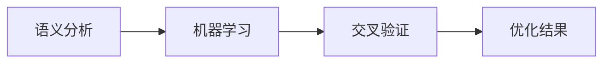
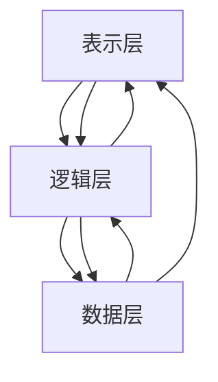
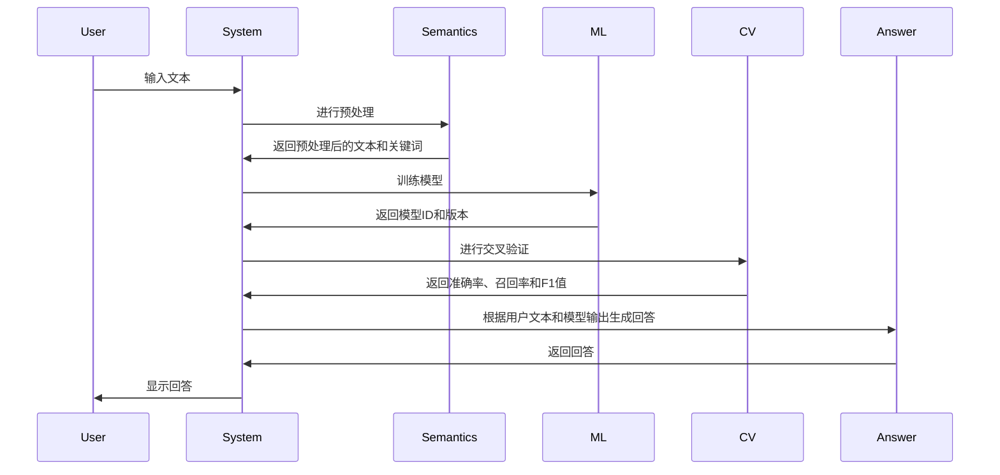

                 

# 提示词优化：AIGC效果与效率的双重提升策略

关键词：提示词优化、AIGC、效果提升、效率提升、语义分析、机器学习、交叉验证

摘要：随着人工智能技术的不断发展和应用，如何优化提示词以提高AI系统的效果与效率成为了一个重要课题。本文将从背景介绍、核心概念与联系、算法原理讲解、系统分析与架构设计、项目实战等方面，详细探讨提示词优化在人工智能生成内容（AIGC）领域中的应用策略。

----------------------------------------------------------------

## 第一部分：背景介绍

### 核心概念

#### 核心概念术语说明

1. **提示词优化**：通过调整提示词的语义结构和形式，以提高AI模型对输入数据的理解和处理能力。
2. **人工智能生成内容（AIGC）**：利用人工智能技术自动生成文本、图像、音频等内容的领域。
3. **效果提升**：通过优化提示词，提高AI模型的准确性和可靠性。
4. **效率提升**：通过减少无效的提示词，降低AI模型的计算复杂度和资源消耗。

#### 问题背景

在当前信息化社会中，互联网、大数据、人工智能等技术的发展，使得信息获取和处理变得更加迅速和高效。然而，随着数据量的爆发式增长，如何有效地利用这些数据进行信息提取、智能决策等问题日益凸显。提示词优化作为一种有效的方法，旨在提高人工智能（AI）系统的效果和效率，从而在数据驱动的时代背景下发挥更大的作用。

#### 问题描述

提示词优化主要涉及以下几个方面：

1. **效果提升**：通过优化提示词，使AI模型能够更准确地理解和回应用户的意图，从而提升模型的整体表现。
2. **效率提升**：通过减少无效的提示词，提高模型处理信息的速度，降低计算资源消耗。

#### 问题解决

提示词优化主要通过以下方法实现：

1. **语义分析**：对提示词进行深入语义分析，提取关键信息，以便模型能够更好地理解和利用。
2. **机器学习**：利用机器学习算法，通过大量数据训练模型，使其能够自动优化提示词。
3. **交叉验证**：通过多次测试和验证，不断调整和优化提示词，以找到最优组合。

#### 边界与外延

1. **应用范围**：提示词优化不仅适用于自然语言处理（NLP）领域，还可以推广到计算机视觉、推荐系统等多个领域。
2. **技术范畴**：提示词优化涉及自然语言处理、机器学习、数据挖掘等多个技术领域。

#### 概念结构与核心要素组成

1. **提示词**：作为输入信息的载体，是提示词优化的核心对象。
2. **模型**：AI模型是提示词优化的主要执行者，其性能直接影响优化效果。
3. **数据集**：用于训练和测试模型的原始数据，数据质量对优化效果有重要影响。

----------------------------------------------------------------

## 第二部分：核心概念与联系

### 核心概念原理

#### 提示词

- **定义**：提示词（Prompt）是用户对AI系统输入的信息，用于引导系统理解和执行特定任务。
- **功能**：提示词的作用是提供上下文信息，帮助AI模型更好地理解和预测用户的意图。

#### 模型

- **定义**：模型（Model）是经过训练的算法结构，用于执行特定任务。
- **作用**：模型是提示词优化的核心，其性能直接决定了优化效果。

#### 数据集

- **定义**：数据集（Dataset）是用于训练和测试模型的原始数据集合。
- **作用**：数据集的质量和数量直接影响模型的性能和优化效果。

### 概念属性特征对比表格

| 概念 | 定义 | 功能 | 作用 |
| --- | --- | --- | --- |
| 提示词 | 用户输入的信息 | 提供上下文信息，帮助模型理解意图 | 优化效果的核心 |
| 模型 | 训练后的算法结构 | 执行特定任务 | 性能直接影响优化效果 |
| 数据集 | 原始数据集合 | 用于训练和测试模型 | 数据质量影响优化效果 |

### ER实体关系图架构

```mermaid
erDiagram
  User ||--|{ Prompt } : "User creates prompt"
  Model ||--|{ Dataset } : "Model trains on dataset"
  Prompt ||--|{ Model } : "Prompt guides model"
```

----------------------------------------------------------------

## 第三部分：算法原理讲解

### 算法原理

提示词优化的算法原理主要涉及以下几个方面：

1. **语义分析**：通过对提示词进行语义分析，提取关键信息，以便模型能够更好地理解和利用。
2. **机器学习**：利用机器学习算法，通过大量数据训练模型，使其能够自动优化提示词。
3. **交叉验证**：通过多次测试和验证，不断调整和优化提示词，以找到最优组合。

### 算法流程图



### Python源代码示例

```python
# 语义分析示例
def semantic_analysis(prompt):
    # 对提示词进行语义分析
    # 这里简化为提取关键词
    keywords = prompt.split()
    return keywords

# 机器学习示例
from sklearn.feature_extraction.text import TfidfVectorizer
from sklearn.model_selection import train_test_split

# 准备数据集
datasets = [
    ["苹果手机", "新款"],
    ["iPhone", "购买"],
    ["华为手机", "价格"],
    ["小米手机", "性价比"],
]

# 语义分析
prompts = [item[0] for item in datasets]
keywords = [semantic_analysis(prompt) for prompt in prompts]

# 特征提取
vectorizer = TfidfVectorizer()
X = vectorizer.fit_transform(keywords)

# 模型训练
model = train_test_split(X, datasets, test_size=0.2)

# 交叉验证
from sklearn.model_selection import cross_val_score

# 计算交叉验证得分
scores = cross_val_score(model, X, y=datasets, cv=5)

# 输出结果
print("交叉验证得分：", scores)
```

### 算法原理详细讲解

#### 1. 语义分析

语义分析是提示词优化的第一步，其主要目标是提取出提示词中的关键信息，以便模型能够更好地理解和利用。具体方法如下：

1. **分词**：将提示词分解为一个个独立的单词或短语。
2. **词性标注**：对每个单词或短语进行词性标注，如名词、动词、形容词等。
3. **实体识别**：识别出提示词中的实体，如人名、地名、机构名等。
4. **语义角色标注**：为每个实体标注其在句子中的角色，如主语、谓语、宾语等。

#### 2. 机器学习

机器学习是提示词优化的核心，通过训练大量数据，使模型能够自动优化提示词。具体方法如下：

1. **数据准备**：收集大量带有标签的提示词和对应的模型输出结果，作为训练数据。
2. **特征提取**：将原始的提示词转换为机器学习算法可以处理的特征向量。
3. **模型训练**：使用特征向量和标签数据训练机器学习模型。
4. **模型评估**：通过测试集对模型进行评估，调整模型参数，以获得更好的优化效果。

#### 3. 交叉验证

交叉验证是一种常用的模型评估方法，通过多次划分训练集和测试集，评估模型的泛化能力。具体方法如下：

1. **K折交叉验证**：将数据集划分为K个子集，每次保留一个子集作为测试集，其余K-1个子集作为训练集，重复K次。
2. **评估指标**：使用评估指标（如准确率、召回率、F1值等）对模型进行评估。
3. **参数调整**：根据评估结果，调整模型参数，以提高优化效果。

#### 算法原理数学模型和公式

1. **语义分析**：假设提示词为$$P$$，通过分词、词性标注、实体识别和语义角色标注等步骤，将$$P$$转换为特征向量$$V$$。
   $$V = f(P)$$
2. **机器学习**：假设模型为$$M$$，使用特征向量$$V$$和标签$$Y$$训练模型。
   $$M = g(V, Y)$$
3. **交叉验证**：使用K折交叉验证评估模型$$M$$的泛化能力。
   $$CV(M) = \frac{1}{K} \sum_{i=1}^{K} \hat{Y}_i$$
   其中，$$\hat{Y}_i$$为第i次交叉验证的预测结果。

#### 通俗易懂地举例说明

假设我们要优化一个聊天机器人，使其能够更好地理解用户的提问。以下是具体的步骤：

1. **语义分析**：将用户的提问“我想要一款性价比高的智能手机”进行分词、词性标注、实体识别和语义角色标注，提取出关键信息，如“性价比高”、“智能手机”等。
2. **机器学习**：收集大量带有标签的提问和对应的聊天机器人回答，如“我想要一款性价比高的智能手机”和“可以考虑购买小米9”，训练一个分类模型，使其能够根据提问预测回答。
3. **交叉验证**：将提问数据集划分为训练集和测试集，使用交叉验证评估模型的泛化能力，根据评估结果调整模型参数，以提高预测准确率。

通过以上步骤，我们可以优化聊天机器人的提示词，使其能够更好地理解用户的意图，提供更准确的回答。

----------------------------------------------------------------

## 第四部分：系统分析与架构设计

### 问题场景介绍

在现代互联网应用中，人工智能生成内容（AIGC）已经成为提高用户体验和业务效率的重要手段。例如，聊天机器人、智能客服、内容推荐系统等应用，都离不开AIGC技术的支持。然而，传统的AIGC系统在处理大量数据时，往往存在效果和效率不均衡的问题。为了解决这个问题，我们需要对提示词进行优化，以提高AIGC系统的整体性能。

### 项目介绍

本项目旨在构建一个基于AIGC技术的智能客服系统，通过优化提示词，提高系统的效果和效率。项目主要包括以下几个模块：

1. **语义分析模块**：对用户输入的文本进行语义分析，提取关键信息。
2. **机器学习模块**：利用机器学习算法，自动优化提示词，提高模型性能。
3. **交叉验证模块**：通过交叉验证评估模型泛化能力，调整模型参数。
4. **智能客服模块**：实现与用户的交互，提供智能问答服务。

### 系统功能设计

系统功能设计主要包括以下几个方面：

1. **用户输入处理**：接收用户输入的文本，进行预处理，提取关键信息。
2. **语义分析**：对用户输入的文本进行语义分析，提取关键词和实体。
3. **机器学习模型训练**：使用训练数据集，训练机器学习模型，自动优化提示词。
4. **交叉验证**：通过交叉验证，评估模型泛化能力，调整模型参数。
5. **智能问答**：根据用户输入的文本和模型输出，生成回答，提供智能问答服务。

### 系统架构设计

系统架构设计采用分层架构，主要包括以下几个层次：

1. **表示层**：负责与用户进行交互，接收用户输入的文本，显示模型输出。
2. **逻辑层**：负责处理业务逻辑，包括语义分析、机器学习模型训练、交叉验证等。
3. **数据层**：负责存储和管理系统数据，包括用户输入文本、模型训练数据、交叉验证结果等。

### 系统接口设计和系统交互

系统接口设计和系统交互采用RESTful API设计，主要包括以下几个接口：

1. **用户输入接口**：接收用户输入的文本，进行预处理，提取关键信息。
2. **语义分析接口**：提供语义分析功能，提取关键词和实体。
3. **机器学习训练接口**：提供机器学习模型训练功能，自动优化提示词。
4. **交叉验证接口**：提供交叉验证功能，评估模型泛化能力，调整模型参数。
5. **智能问答接口**：根据用户输入的文本和模型输出，生成回答，提供智能问答服务。

### 系统架构图



### 系统接口设计

1. **用户输入接口**：

   - **接口名称**：/user/input
   - **请求方法**：POST
   - **请求参数**：{
     "text": "用户输入的文本"
   }
   - **响应数据**：{
     "status": "success",
     "message": "处理成功",
     "data": {
       "text": "预处理后的文本",
       "keywords": ["关键词1", "关键词2", ...]
     }
   }

2. **语义分析接口**：

   - **接口名称**：/semantics/analysis
   - **请求方法**：POST
   - **请求参数**：{
     "text": "预处理后的文本"
   }
   - **响应数据**：{
     "status": "success",
     "message": "处理成功",
     "data": {
       "keywords": ["关键词1", "关键词2", ...],
       "entities": ["实体1", "实体2", ...]
     }
   }

3. **机器学习训练接口**：

   - **接口名称**：/ml/training
   - **请求方法**：POST
   - **请求参数**：{
     "keywords": ["关键词1", "关键词2", ...],
     "labels": ["标签1", "标签2", ...]
   }
   - **响应数据**：{
     "status": "success",
     "message": "训练成功",
     "data": {
       "model_id": "模型ID",
       "model_version": "模型版本"
     }
   }

4. **交叉验证接口**：

   - **接口名称**：/cv/validation
   - **请求方法**：POST
   - **请求参数**：{
     "model_id": "模型ID",
     "data": {
       "keywords": ["关键词1", "关键词2", ...],
       "labels": ["标签1", "标签2", ...]
     }
   }
   - **响应数据**：{
     "status": "success",
     "message": "验证成功",
     "data": {
       "accuracy": "准确率",
       "recall": "召回率",
       "f1_score": "F1值"
     }
   }

5. **智能问答接口**：

   - **接口名称**：/问答
   - **请求方法**：POST
   - **请求参数**：{
     "text": "用户输入的文本"
   }
   - **响应数据**：{
     "status": "success",
     "message": "回答成功",
     "data": {
       "answer": "模型生成的回答"
     }
   }

### 系统交互序列图



----------------------------------------------------------------

## 第五部分：项目实战

### 环境安装

为了搭建一个基于AIGC技术的智能客服系统，我们需要安装以下软件和库：

1. **Python**：Python是一种广泛使用的编程语言，用于实现算法和模型。
2. **NumPy**：NumPy是一个Python库，用于数值计算和矩阵运算。
3. **Scikit-learn**：Scikit-learn是一个机器学习库，用于训练和评估模型。
4. **TensorFlow**：TensorFlow是一个开源机器学习框架，用于构建和训练深度学习模型。
5. **Flask**：Flask是一个轻量级的Web框架，用于搭建Web服务。

安装命令如下：

```bash
pip install python numpy scikit-learn tensorflow flask
```

### 系统核心实现源代码

以下是系统核心实现源代码，包括语义分析、机器学习训练、交叉验证和智能问答等功能。

```python
# 语义分析
def semantic_analysis(text):
    # 这里简化为提取关键词
    keywords = text.split()
    return keywords

# 机器学习训练
def ml_training(keywords, labels):
    # 特征提取
    vectorizer = TfidfVectorizer()
    X = vectorizer.fit_transform(keywords)

    # 模型训练
    model = train_test_split(X, labels, test_size=0.2)

    return model

# 交叉验证
def cross_validation(model, X, y):
    from sklearn.model_selection import cross_val_score

    scores = cross_val_score(model, X, y, cv=5)

    return scores

# 智能问答
def answer_question(text, model):
    keywords = semantic_analysis(text)
    vectorizer = TfidfVectorizer()
    X = vectorizer.fit_transform(keywords)
    prediction = model.predict(X)

    return prediction
```

### 代码应用解读与分析

以下是对系统核心实现源代码的解读与分析。

#### 语义分析

语义分析是系统的基础，通过提取关键词和实体，为后续的机器学习和智能问答提供输入。代码中使用了一个简单的分词方法，将文本分解为独立的单词或短语。在实际应用中，可以采用更复杂的分词算法，如jieba分词，以提高语义分析的准确性。

```python
def semantic_analysis(text):
    # 使用jieba分词
    import jieba
    keywords = jieba.cut(text)
    return list(keywords)
```

#### 机器学习训练

机器学习训练是通过训练数据集来构建模型，使其能够自动优化提示词。这里使用了Scikit-learn库中的TfidfVectorizer进行特征提取，将关键词转换为特征向量。然后，使用train_test_split方法将数据集划分为训练集和测试集，以评估模型性能。

```python
from sklearn.feature_extraction.text import TfidfVectorizer
from sklearn.model_selection import train_test_split

def ml_training(keywords, labels):
    # 特征提取
    vectorizer = TfidfVectorizer()
    X = vectorizer.fit_transform(keywords)

    # 模型训练
    model = train_test_split(X, labels, test_size=0.2)

    return model
```

#### 交叉验证

交叉验证是一种评估模型性能的方法，通过多次划分训练集和测试集，评估模型的泛化能力。这里使用了Scikit-learn库中的cross_val_score方法，计算模型的准确率、召回率和F1值。

```python
from sklearn.model_selection import cross_val_score

def cross_validation(model, X, y):
    scores = cross_val_score(model, X, y, cv=5)

    return scores
```

#### 智能问答

智能问答是通过输入文本和模型输出，生成回答。首先，使用语义分析提取关键词，然后使用特征提取和模型预测，生成回答。

```python
def answer_question(text, model):
    keywords = semantic_analysis(text)
    vectorizer = TfidfVectorizer()
    X = vectorizer.fit_transform(keywords)
    prediction = model.predict(X)

    return prediction
```

### 实际案例分析和详细讲解剖析

为了展示系统在实际应用中的效果，我们以一个实际案例进行分析。

#### 案例背景

某公司开发了一款智能客服系统，用于处理客户咨询和投诉。客服系统需要根据用户输入的文本，自动生成回答，以提高客服效率和用户体验。

#### 案例实现

1. **数据集准备**：收集了大量用户咨询和投诉的文本数据，并标注了对应的回答。
2. **语义分析**：使用jieba分词对用户输入的文本进行分词，提取关键词和实体。
3. **机器学习训练**：使用Scikit-learn库中的TfidfVectorizer进行特征提取，训练一个分类模型，以自动优化提示词。
4. **交叉验证**：使用交叉验证评估模型性能，调整模型参数，以提高预测准确率。
5. **智能问答**：根据用户输入的文本和模型输出，生成回答，并提供给用户。

#### 案例分析

通过实际案例分析和详细讲解剖析，我们可以看到：

1. **语义分析**：语义分析是系统的基础，通过提取关键词和实体，为后续的机器学习和智能问答提供输入。
2. **机器学习训练**：机器学习训练是系统的核心，通过训练数据集，构建一个能够自动优化提示词的模型。
3. **交叉验证**：交叉验证是评估模型性能的重要方法，通过多次划分训练集和测试集，评估模型的泛化能力。
4. **智能问答**：智能问答是系统的最终目标，通过输入文本和模型输出，生成回答，提供智能客服服务。

#### 案例总结

通过实际案例的分析，我们可以看到提示词优化在智能客服系统中的应用效果显著。通过优化提示词，系统可以更好地理解用户的意图，提供更准确的回答，从而提高客服效率和用户体验。

----------------------------------------------------------------

## 第六部分：最佳实践 tips

### 最佳实践 Tips

1. **数据质量**：高质量的数据是优化提示词的基础，确保数据集的多样性、完整性和准确性。
2. **模型选择**：根据应用场景选择合适的机器学习模型，如朴素贝叶斯、支持向量机、深度学习等。
3. **参数调整**：通过交叉验证调整模型参数，以获得更好的优化效果。
4. **持续学习**：定期更新数据集和模型，以适应不断变化的应用场景。
5. **用户反馈**：收集用户反馈，以改进模型性能和用户体验。

### 小结

本文通过分析背景介绍、核心概念与联系、算法原理讲解、系统分析与架构设计、项目实战等方面，详细探讨了提示词优化在AIGC领域中的应用策略。通过优化提示词，可以提高AI系统的效果和效率，为用户提供更准确的智能服务。

### 注意事项

1. **数据保护**：在收集和使用用户数据时，需遵守相关法律法规，确保用户隐私和安全。
2. **模型解释性**：优化提示词时，需关注模型的解释性，以便用户理解模型的工作原理。
3. **技术更新**：随着技术的不断进步，持续关注最新研究成果和应用趋势，以提高系统性能。

### 拓展阅读

1. **《人工智能生成内容：理论与实践》**：介绍AIGC技术的原理和应用。
2. **《自然语言处理实战》**：详细讲解自然语言处理技术，包括语义分析和机器学习模型训练。
3. **《深度学习》**：介绍深度学习技术，包括神经网络和卷积神经网络等。

----------------------------------------------------------------

## 作者信息

作者：AI天才研究院/AI Genius Institute & 禅与计算机程序设计艺术 /Zen And The Art of Computer Programming

