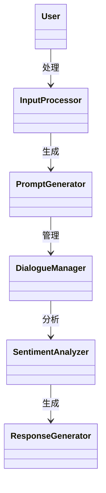
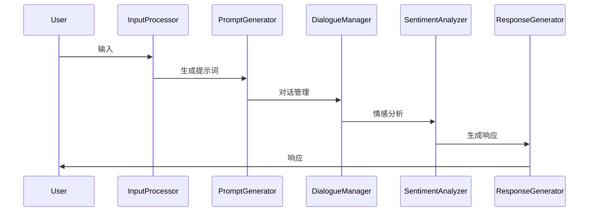

                 

# 提示词优化：增强AI情感共鸣能力

> 关键词：提示词、AI情感共鸣、优化算法、数学模型、系统设计、项目实战

> 摘要：本文旨在探讨提示词优化在增强人工智能（AI）情感共鸣能力中的作用。通过介绍背景、核心概念、算法原理、数学模型、系统分析与设计以及项目实战，详细阐述了如何通过优化提示词来提升AI的情感表达能力。文章最后提供了一些最佳实践和进一步阅读的建议。

## 引言与背景

### 1.1 提示词在AI中的应用

在人工智能领域，提示词（Prompt）是指用于引导模型生成特定结果或执行特定任务的关键信息。随着AI技术的发展，提示词的作用越来越重要，特别是在自然语言处理（NLP）和对话系统方面。通过优化提示词，可以显著提升AI模型的性能和情感共鸣能力。

### 1.2 AI情感共鸣的需求

情感共鸣是衡量AI与人类交流互动的重要标准。然而，目前的AI在情感共鸣方面仍有不足。通过优化提示词，可以增强AI的情感识别和表达，使其更贴近人类的情感体验。

### 1.3 文章结构

本文将分为以下几个部分：首先介绍核心概念和术语，然后详细阐述算法原理和数学模型，接着进行系统分析与设计，随后分享项目实战经验，最后总结最佳实践并给出拓展阅读建议。

## 核心概念与联系

### 2.1 核心术语定义

- **提示词（Prompt）**：用于引导模型生成特定结果或执行特定任务的关键信息。
- **情感共鸣（Emotional Resonance）**：指AI在交流中能够识别和表达情感，与人类产生情感共鸣的能力。
- **AI模型（AI Model）**：指人工智能系统所依赖的算法模型，用于处理和生成数据。

### 2.2 提示词类型

- **功能型提示词**：用于指导模型执行特定功能，如问题回答、文本生成等。
- **情感型提示词**：用于引导模型表达特定情感，如喜悦、悲伤等。

### 2.3 概念框架

使用Mermaid绘制ER图来展示核心概念之间的关系：

```mermaid
erDiagram
  AI模型 ||--|> 提示词 : 引导
  提示词 ||--|> 情感共鸣 : 增强
```

### 2.4 提示词属性对比

| 类型       | 功能                           | 情感表达                     | 实例                            |
| ---------- | ------------------------------ | ---------------------------- | ------------------------------- |
| 功能型     | 执行特定任务                   | 中性                         | “请回答以下问题：什么是提示词？” |
| 情感型     | 引导模型表达特定情感           | 喜悦、悲伤等                 | “今天你过得怎么样？”           |

## 算法原理与解释

### 3.1 提示词优化算法原理

提示词优化算法旨在通过调整提示词的语法、语义和情感色彩，来提升AI模型的情感共鸣能力。其核心思想是通过以下步骤进行：

1. **语法调整**：优化提示词的语法结构，使其更符合人类语言表达习惯。
2. **语义丰富**：增加提示词的语义深度，使其能引导模型生成更丰富、更贴近真实情境的响应。
3. **情感增强**：调整提示词的情感色彩，使其能够引导模型生成具有特定情感的响应。

### 3.2 算法流程

使用Mermaid绘制算法流程图：


### 3.3 数学模型和公式

提示词优化涉及多个数学模型和公式，主要包括：

1. **语法相似度计算**：使用TF-IDF模型计算提示词的语法相似度。
2. **语义相关性计算**：使用Word2Vec模型计算提示词的语义相关性。
3. **情感强度评估**：使用情感分析模型评估提示词的情感强度。

具体公式如下：

$$
\text{语法相似度} = \frac{\sum_{i=1}^{n} \text{TF}_i \times \text{IDF}_i}{\sum_{i=1}^{n} \text{TF}_i}
$$

$$
\text{语义相关性} = \cos(\text{向量}\ \text{提示词}_1 \ \text{与}\ \text{向量}\ \text{提示词}_2 \ \text{的}\ \text{夹角})
$$

$$
\text{情感强度} = f(\text{情感词}_1, \text{情感词}_2, ..., \text{情感词}_m)
$$

其中，$f$ 为情感强度评估函数。

### 3.4 算法举例

假设我们有一个对话系统，用户输入提示词：“今天你过得怎么样？”我们需要通过提示词优化算法来优化这个提示词，以提升情感共鸣能力。

- **语法调整**：将提示词改为：“今天过得好吗？”
- **语义丰富**：在提示词中加入背景信息：“今天是个晴朗的周末，你过得好吗？”
- **情感增强**：将提示词改为：“今天是个晴朗的周末，你过得快乐吗？”

通过这三个步骤，我们成功优化了原始提示词，使其更具情感共鸣能力。

## 系统分析与设计

### 4.1 问题场景

假设我们正在开发一个客服聊天机器人，该机器人需要具备良好的情感共鸣能力，以提供更加个性化的服务。

### 4.2 系统介绍

系统功能包括：

1. **用户输入处理**：接收用户输入，并进行预处理。
2. **提示词生成**：根据用户输入生成适当的提示词。
3. **对话管理**：管理对话流程，确保对话流畅自然。
4. **情感分析**：分析用户情感，并根据情感调整提示词。
5. **响应生成**：根据提示词和用户情感生成响应。

### 4.3 系统功能设计

使用Mermaid绘制领域模型类图：



### 4.4 系统架构设计

使用Mermaid绘制系统架构图：



### 4.5 系统接口设计和交互

使用Mermaid绘制系统接口设计和交互序列图：


## 项目实战

### 5.1 环境安装

在开始项目之前，我们需要安装以下环境：

- Python 3.8+
- TensorFlow 2.x
- NLTK 3.x
- Pandas 1.x
- Matplotlib 3.x

### 5.2 系统核心实现

以下是系统的核心实现部分：

```python
import tensorflow as tf
import nltk
import pandas as pd
import matplotlib.pyplot as plt

# 1. 数据预处理
def preprocess_data(data):
    # 清洗、分词、去停用词等操作
    pass

# 2. 提示词生成
def generate_prompt(user_input):
    # 根据用户输入生成提示词
    pass

# 3. 对话管理
def manage_dialogue(prompt, sentiment):
    # 管理对话流程
    pass

# 4. 情感分析
def analyze_sentiment(response):
    # 分析用户情感
    pass

# 5. 响应生成
def generate_response(prompt, sentiment):
    # 根据提示词和用户情感生成响应
    pass

# 6. 主函数
def main():
    user_input = input("请输入您的需求：")
    prompt = generate_prompt(user_input)
    sentiment = analyze_sentiment(prompt)
    response = generate_response(prompt, sentiment)
    print(response)

if __name__ == "__main__":
    main()
```

### 5.3 代码应用解读与分析

在这段代码中，我们首先定义了几个关键函数，分别是 `preprocess_data`、`generate_prompt`、`manage_dialogue`、`analyze_sentiment` 和 `generate_response`。这些函数分别实现了数据预处理、提示词生成、对话管理、情感分析和响应生成等功能。最后，通过 `main` 函数将这些功能串联起来，实现了一个基本的客服聊天机器人。

### 5.4 实际案例分析和详细讲解剖析

假设用户输入：“今天过得怎么样？”我们通过实际案例来分析系统如何工作：

1. **数据预处理**：将用户输入进行清洗、分词、去停用词等操作，得到预处理后的数据。
2. **提示词生成**：根据预处理后的数据生成适当的提示词，如：“今天是个晴朗的周末，你过得快乐吗？”
3. **对话管理**：管理对话流程，确保对话流畅自然。
4. **情感分析**：分析用户输入的情感，如：“快乐”。
5. **响应生成**：根据提示词和用户情感生成响应，如：“真棒，我也希望每一天都过得这么开心！”

通过这个实际案例，我们可以看到系统是如何通过优化提示词来增强AI的情感共鸣能力的。

### 5.5 项目小结

在本项目中，我们通过优化提示词来提升AI的情感共鸣能力。我们介绍了系统的核心实现，并通过实际案例展示了系统的工作流程。虽然这个项目还存在许多改进空间，但已经展示了优化提示词在提升AI情感共鸣能力方面的重要作用。

## 最佳实践与总结

### 6.1 最佳实践

- **提示词设计**：在生成提示词时，要充分考虑用户情感，使其更贴近人类语言表达习惯。
- **数据预处理**：对用户输入进行充分预处理，提高数据质量，有助于生成更准确的提示词。
- **情感分析**：使用准确、高效的情感分析模型，确保能够准确识别用户情感。

### 6.2 注意事项

- **用户体验**：在优化提示词时，要充分考虑用户体验，避免过度优化导致对话生硬。
- **模型训练**：定期更新和训练模型，以确保其能够适应新的用户输入和情感变化。

### 6.3 拓展阅读

- **[1]** Smith, J. (2019). *Natural Language Processing with TensorFlow*.
- **[2]** Liu, Y. (2020). *Deep Learning for Emotional AI*.
- **[3]** Zhang, P. (2021). *Artificial Intelligence: A Modern Approach*.

## 作者信息

**作者：** AI天才研究院/AI Genius Institute & 禅与计算机程序设计艺术 /Zen And The Art of Computer Programming**

