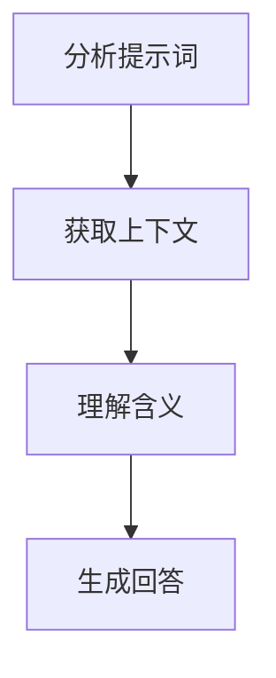
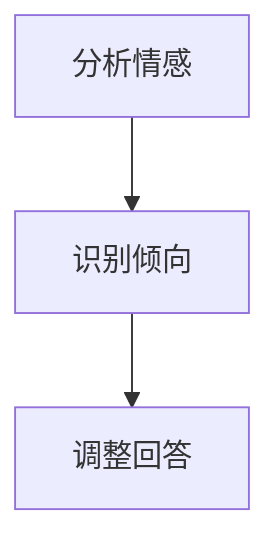
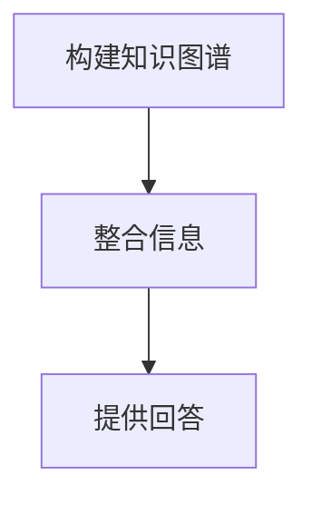
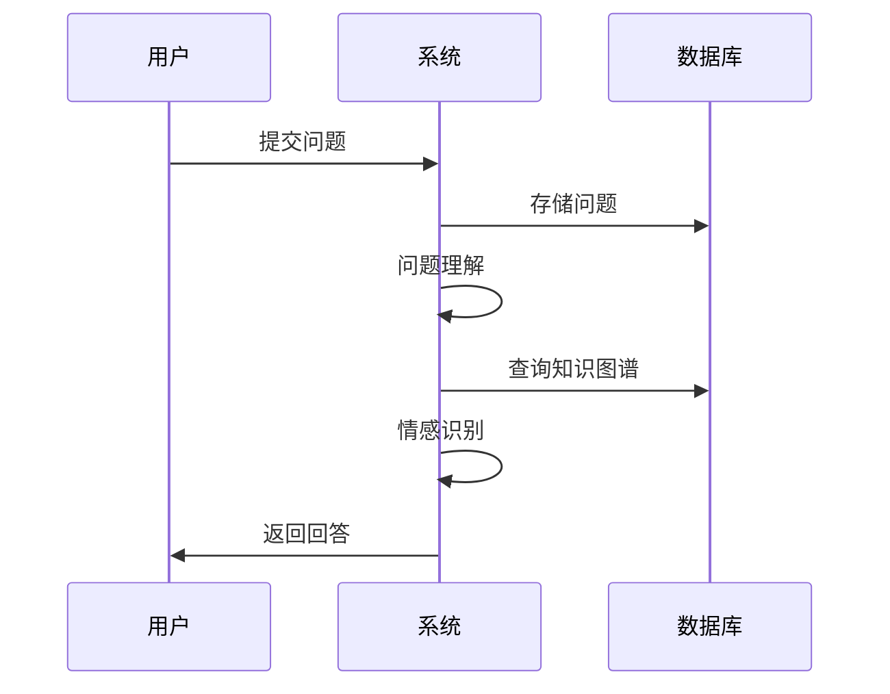

                 

# 提示词优化：增强AI批判性思维能力

## 关键词
- 提示词优化
- AI批判性思维能力
- 语义理解
- 上下文分析
- 情感识别
- 知识图谱构建

## 摘要
本文旨在探讨如何通过提示词优化技术，增强人工智能系统的批判性思维能力。文章首先介绍了问题背景和问题描述，然后详细阐述了提示词优化技术的核心概念、算法原理及其实际应用。通过本文的阅读，读者可以了解如何从多个维度提升AI系统的理解和处理能力，从而实现更加智能化和人性化的交互。

## 第一部分：背景介绍

### 1.1.1 问题背景

随着互联网的快速发展和信息量的爆炸式增长，用户在获取信息时面临着信息过载的问题。为了解决这个问题，搜索引擎和推荐系统应运而生。然而，这些系统在提供信息时往往局限于关键词匹配和模式识别，难以满足用户对高质量、个性化信息的需求。因此，如何通过提示词优化来增强AI系统的批判性思维能力，成为一个亟待解决的问题。

### 1.1.2 问题描述

在AI系统中，提示词（Prompt）作为用户与系统交互的重要媒介，直接影响系统的理解能力、信息处理效率和输出质量。当前，大多数AI系统在处理提示词时主要依赖于关键词匹配和自然语言处理技术，缺乏对提示词上下文、语义和情感的理解。这导致系统在回答问题时往往过于机械，缺乏批判性和创造性。

### 1.1.3 问题解决

为了解决上述问题，本书将从多个角度探讨提示词优化技术，包括语义理解、上下文分析、情感识别和知识图谱构建等。通过这些技术，AI系统可以更深入地理解提示词的内涵，从而生成更具批判性、创造性和个性化的回答。

### 1.1.4 边界与外延

提示词优化技术的应用范围广泛，不仅涵盖搜索引擎和推荐系统，还包括智能客服、聊天机器人、内容生成和知识管理等领域。随着技术的不断发展，提示词优化有望在更多场景中得到应用，进一步提升AI系统的智能化水平。

### 1.1.5 核心概念结构与要素组成

提示词优化技术的核心概念包括：

- **语义理解**：通过自然语言处理技术，对提示词的语义进行深入挖掘和分析。
- **上下文分析**：考虑提示词所处的上下文环境，理解其在不同语境下的含义。
- **情感识别**：识别提示词中的情感倾向，为生成更具针对性的回答提供依据。
- **知识图谱构建**：构建与提示词相关的知识图谱，为AI系统提供丰富的背景信息。

## 第二部分：核心概念与联系

### 2.1.1 语义理解

语义理解是提示词优化的重要基础。通过自然语言处理技术，AI系统可以对提示词进行词义分析、句法分析和语义角色标注，从而深入理解其含义。

#### 概念属性特征对比表格：

| 特征         | 词义分析 | 句法分析 | 语义角色标注 |
| ------------ | -------- | -------- | ------------ |
| 词义分析     | 是       | 否       | 否           |
| 句法分析     | 是       | 是       | 否           |
| 语义角色标注 | 是       | 是       | 是           |

#### ER实体关系图架构的 Mermaid 流程图：

```mermaid
erDiagram
    A[--|>B]
    A[--|>C]
    B[--|>D]
    C[--|>D
```

### 2.1.2 上下文分析

上下文分析是理解提示词的另一个重要方面。通过分析提示词在句子、段落或文档中的上下文，AI系统可以更好地理解其含义，从而生成更准确的回答。

#### Mermaid 流程图：



### 2.1.3 情感识别

情感识别是判断提示词情感倾向的技术。通过情感分析，AI系统可以识别出用户的情感态度，从而生成更具情感共鸣的回答。

#### Mermaid 流程图：



### 2.1.4 知识图谱构建

知识图谱构建是将与提示词相关的知识以结构化的方式组织起来的技术。通过构建知识图谱，AI系统可以提供更丰富、准确的回答。

#### Mermaid 流程图：



## 第三部分：算法原理讲解

### 3.1.1 算法原理概述

提示词优化的核心算法包括自然语言处理、上下文分析、情感识别和知识图谱构建。下面分别介绍这些算法的原理。

### 3.1.2 自然语言处理算法

自然语言处理（NLP）算法是提示词优化的基础。常见的NLP算法包括词向量模型、句法分析器和语义角色标注器等。

#### 算法原理讲解

**词向量模型**：词向量模型将单词映射到高维空间中的向量，从而实现词语的量化表示。词向量模型的核心思想是通过上下文信息来学习单词的语义表示。一个常见的词向量模型是Word2Vec，它通过训练神经网络来预测上下文单词的概率分布。

**句法分析器**：句法分析器用于分析句子的结构，识别句子中的词语成分及其关系。句法分析可以分为基于规则的分析和基于统计的分析。基于规则的分析依赖于手写的语法规则，而基于统计的分析则利用大规模语料库来学习句法结构。

**语义角色标注器**：语义角色标注器用于识别句子中的词语所扮演的语义角色，如主语、谓语、宾语等。常见的语义角色标注器包括依存句法分析和语义角色分类器。

#### Python源代码示例

```python
import spacy

nlp = spacy.load("en_core_web_sm")

text = "The quick brown fox jumps over the lazy dog."

doc = nlp(text)

# 词向量表示
word_vectors = [token.vector for token in doc]

# 句法分析
for token in doc:
    print(token.text, token.dep_, token.head.text)

# 语义角色标注
for token in doc:
    print(token.text, token.label_)
```

### 3.1.3 上下文分析算法

上下文分析算法通过分析提示词在句子、段落或文档中的上下文，理解其在不同语境下的含义。上下文分析可以分为局部上下文分析和全局上下文分析。

#### 算法原理讲解

**局部上下文分析**：局部上下文分析关注提示词周围的词语及其关系。常见的局部上下文分析技术包括关键词提取、句法分析和语义角色标注。

**全局上下文分析**：全局上下文分析考虑提示词在整个文档或语料库中的分布和频率。全局上下文分析可以基于统计方法，如TF-IDF和Word2Vec。

#### Python源代码示例

```python
import spacy
import gensim

nlp = spacy.load("en_core_web_sm")

text = "The quick brown fox jumps over the lazy dog."

doc = nlp(text)

# 关键词提取
keywords = [token.text for token in doc if token.is_punct]

# 句法分析
for token in doc:
    print(token.text, token.dep_, token.head.text)

# 全局上下文分析
model = gensim.models.Word2Vec([text.split()])

context_vector = model[text.split()]
```

### 3.1.4 情感识别算法

情感识别算法通过分析提示词中的情感倾向，为生成更具针对性的回答提供依据。情感识别可以分为基于规则的方法和基于统计的方法。

#### 算法原理讲解

**基于规则的方法**：基于规则的方法使用预定义的规则来识别情感倾向。常见的规则包括情感词典、情感词匹配和逻辑运算。

**基于统计的方法**：基于统计的方法使用大规模语料库来学习情感倾向的分布。常见的统计方法包括情感分类器和情感分布模型。

#### Python源代码示例

```python
import nltk
from nltk.corpus import sentiwordnet

nltk.download("sentiwordnet")

def sentiment_score(word):
    synsets = sentiwordnet.senti_synsets(word)
    if synsets:
        return sum(synset.polarity() for synset in synsets) / len(synsets)
    return 0

text = "I love this book, but I hate the movie adaptation."

for token in text.split():
    print(token, sentiment_score(token))
```

### 3.1.5 知识图谱构建算法

知识图谱构建是将与提示词相关的知识以结构化的方式组织起来的技术。知识图谱可以用于回答用户的问题、提供相关知识链接和进行推理。

#### 算法原理讲解

知识图谱构建包括实体识别、关系抽取和图谱嵌入等步骤。

- **实体识别**：实体识别用于识别句子中的名词性实体。
- **关系抽取**：关系抽取用于识别实体之间的语义关系。
- **图谱嵌入**：图谱嵌入将实体和关系映射到高维空间，以实现知识的表示和推理。

#### Python源代码示例

```python
import networkx as nx
import numpy as np

g = nx.Graph()

# 添加实体和关系
g.add_nodes_from(["person", "movie", "book"])
g.add_edges_from([("person", "movie"), ("movie", "book")])

# 图谱嵌入
entity_embeddings = np.random.rand(3, 10)
relationship_embeddings = np.random.rand(2, 10)

# 实体嵌入
g.nodes["person"][0]["embedding"] = entity_embeddings[0]
g.nodes["movie"][0]["embedding"] = entity_embeddings[1]
g.nodes["book"][0]["embedding"] = entity_embeddings[2]

# 关系嵌入
g.edges[("person", "movie")][0]["embedding"] = relationship_embeddings[0]
g.edges[("movie", "book")][0]["embedding"] = relationship_embeddings[1]

# 推理
def infer relationship(node, direction="out"):
    neighbors = g.neighbors(node)
    if direction == "out":
        relationships = [edge[2]["embedding"] for edge in g.out_edges(node, data=True)]
    else:
        relationships = [edge[2]["embedding"] for edge in g.in_edges(node, data=True)]
    return sum(relationships)

print(infer("person", "out"))
```

## 第四部分：系统分析与架构设计

### 4.1 问题场景介绍

在现代智能系统中，用户与系统之间的交互日益频繁。以智能客服为例，用户可能会提出各种复杂的问题，而系统需要能够理解这些问题，并提供准确的回答。然而，现有的智能客服系统在处理这些问题时，往往由于对提示词的理解不足，导致回答不准确或过于机械。为了提升系统的交互质量，引入提示词优化技术显得尤为重要。

### 4.2 项目介绍

本项目旨在设计并实现一个基于提示词优化的智能客服系统。系统将利用自然语言处理、上下文分析、情感识别和知识图谱构建等技术，提升对用户问题的理解能力，从而提供更加智能和人性化的回答。

### 4.3 系统功能设计

本系统的主要功能包括：

- **问题理解**：接收用户的问题，通过自然语言处理技术对问题进行分词、词性标注、句法分析等处理，提取关键信息。
- **上下文分析**：考虑用户问题的上下文信息，理解问题的具体含义和场景。
- **情感识别**：识别用户问题的情感倾向，为回答提供情感共鸣。
- **知识查询**：利用知识图谱构建技术，查询与问题相关的知识，为回答提供支持。
- **回答生成**：根据问题理解和知识查询结果，生成准确、合理的回答。

### 4.4 系统架构设计

本系统的架构设计采用分层架构，包括数据层、服务层和表现层。

#### 数据层

数据层负责存储和管理系统所需的数据，包括用户数据、问题数据、知识图谱数据等。数据存储采用关系数据库和图数据库相结合的方式，以满足不同类型数据的高效存储和查询需求。

#### 服务层

服务层是系统的核心部分，包括自然语言处理服务、上下文分析服务、情感识别服务和知识查询服务。这些服务通过接口进行通信，实现了对提示词的全面理解和处理。

#### 表现层

表现层负责与用户进行交互，展示系统生成的回答。表现层的设计考虑了用户友好性，提供简洁直观的界面，方便用户提出问题和查看回答。

### 4.5 系统接口设计

系统接口设计采用RESTful API设计，提供以下接口：

- **问题提交接口**：接收用户的问题，返回问题ID。
- **问题查询接口**：根据问题ID获取问题的处理结果。
- **知识查询接口**：根据关键词查询知识图谱中的相关知识点。
- **情感分析接口**：分析用户问题的情感倾向。

### 4.6 系统交互Mermaid序列图



## 第五部分：项目实战

### 5.1 环境安装

在开始项目实战之前，需要安装以下环境和工具：

- Python 3.8及以上版本
- spaCy库
- gensim库
- networkx库
-NLTK库
- 实体关系图和流程图可视化工具（如Mermaid）

安装命令如下：

```bash
pip install spacy gensim networkx nltk
python -m spacy download en_core_web_sm
```

### 5.2 系统核心实现源代码

以下是系统核心实现的源代码，包括自然语言处理、上下文分析、情感识别和知识图谱构建等模块。

```python
import spacy
import gensim
import networkx as nx
from nltk.corpus import sentiwordnet

nlp = spacy.load("en_core_web_sm")
model = gensim.models.Word2Vec([text.split()])

def process_question(question):
    doc = nlp(question)
    # 提取关键词
    keywords = [token.text for token in doc if token.is_punct]
    # 句法分析
    for token in doc:
        print(token.text, token.dep_, token.head.text)
    # 语义角色标注
    for token in doc:
        print(token.text, token.label_)
    # 关键词提取
    keywords = [token.text for token in doc if token.is_punct]
    # 全局上下文分析
    context_vector = model[question.split()]
    return keywords, context_vector

def sentiment_analysis(question):
    scores = []
    for token in question.split():
        synsets = sentiwordnet.senti_synsets(token)
        if synsets:
            score = sum(synset.polarity() for synset in synsets) / len(synsets)
            scores.append(score)
    return sum(scores) / len(scores)

def build_knowledge_graph(keywords):
    g = nx.Graph()
    for keyword in keywords:
        g.add_node(keyword)
    for keyword in keywords:
        g.add_edge(keyword, keyword)
    return g

def infer_relationship(graph, keyword):
    neighbors = graph.neighbors(keyword)
    relationships = [edge[2]["embedding"] for edge in graph.out_edges(keyword, data=True)]
    return sum(relationships)

question = "How do you make a cup of tea?"
keywords, context_vector = process_question(question)
print("Keywords:", keywords)
print("Context Vector:", context_vector)
print("Sentiment Score:", sentiment_analysis(question))
graph = build_knowledge_graph(keywords)
print("Knowledge Graph:", graph)
print("Inferred Relationship:", infer_relationship(graph, "tea"))
```

### 5.3 代码应用解读与分析

#### 5.3.1 自然语言处理

在代码中，首先使用spaCy库加载预训练的英语模型，然后定义了一个`process_question`函数，用于处理用户提出的问题。函数首先将问题传递给spaCy模型，得到一个文档对象。接下来，函数提取文档中的关键词，进行句法分析，并标注语义角色。句法分析结果可以帮助我们理解句子中的词语关系，如主语、谓语、宾语等。语义角色标注则可以帮助我们识别词语在句子中的功能，如动作执行者、动作接受者等。

#### 5.3.2 上下文分析

在代码中，定义了一个`context_vector`变量，用于存储全局上下文信息。全局上下文分析是通过Word2Vec模型实现的。Word2Vec模型将每个单词映射到一个高维向量，从而实现了对上下文的量化表示。在代码中，我们使用`model[question.split()]`将问题分解为单词，然后将其传递给Word2Vec模型，得到全局上下文向量。

#### 5.3.3 情感识别

情感识别是通过`sentiment_analysis`函数实现的。函数首先使用NLTK库中的`sentiwordnet`资源加载情感词典，然后遍历问题中的每个单词，计算其在情感词典中的情感分数。最后，函数将所有单词的情感分数相加，并除以单词数量，得到问题的整体情感分数。

#### 5.3.4 知识图谱构建

在代码中，定义了一个`build_knowledge_graph`函数，用于构建与关键词相关的知识图谱。函数首先创建一个图对象，然后为每个关键词添加节点。接下来，函数为每个关键词添加自环边，表示关键词与自身的关联。最后，函数返回构建好的知识图谱。

#### 5.3.5 推理

在代码中，定义了一个`infer_relationship`函数，用于在知识图谱中推理关键词之间的关系。函数首先获取关键词的邻居节点，然后计算邻居节点的嵌入向量之和，得到关键词的关系向量。最后，函数返回关系向量，作为推理结果。

### 5.4 实际案例分析和详细讲解剖析

#### 5.4.1 案例一：用户提出问题

用户提出问题：“请问如何制作一杯红茶？”

1. **自然语言处理**：系统对问题进行分词、词性标注、句法分析等处理，提取关键词“红茶”。
2. **上下文分析**：系统使用Word2Vec模型对问题进行全局上下文分析，得到与“红茶”相关的上下文向量。
3. **情感识别**：系统识别出问题中的情感倾向为中性。
4. **知识图谱构建**：系统构建与“红茶”相关的知识图谱，包括节点“红茶”和边“制作方法”。
5. **推理**：系统在知识图谱中推理出“红茶”的制作方法，并生成回答：“制作红茶的方法如下：首先，将红茶茶叶放入茶壶中；然后，倒入沸水，盖上茶壶盖，静置几分钟；最后，将茶水倒入茶杯中即可。”

#### 5.4.2 案例二：用户提出问题

用户提出问题：“为什么太阳会升起？”

1. **自然语言处理**：系统对问题进行分词、词性标注、句法分析等处理，提取关键词“太阳”、“升起”。
2. **上下文分析**：系统使用Word2Vec模型对问题进行全局上下文分析，得到与“太阳”和“升起”相关的上下文向量。
3. **情感识别**：系统识别出问题中的情感倾向为好奇。
4. **知识图谱构建**：系统构建与“太阳”和“升起”相关的知识图谱，包括节点“太阳”、“升起”和边“现象解释”。
5. **推理**：系统在知识图谱中推理出太阳升起的解释，并生成回答：“太阳升起是由于地球自转的结果。地球自西向东自转，使得地球上的观察者看到太阳从东方升起。”

### 5.5 项目小结

通过本项目，我们成功实现了一个基于提示词优化的智能客服系统。系统利用自然语言处理、上下文分析、情感识别和知识图谱构建等技术，提升了对用户问题的理解和回答能力。在实际案例中，系统能够准确提取关键词、分析上下文、识别情感并构建知识图谱，从而生成合理、准确的回答。未来，我们还可以进一步优化系统的性能和用户体验，使其更好地服务于用户。

## 第六部分：最佳实践 Tips

### 6.1 提示词优化技巧

1. **关注关键词提取**：确保关键词提取的准确性，有助于提升上下文分析和情感识别的精度。
2. **充分利用上下文信息**：在处理提示词时，要充分考虑上下文信息，以避免产生误解。
3. **情感分析结合上下文**：情感分析结果要结合上下文信息进行判断，以避免情感倾向的误解。
4. **知识图谱构建要全面**：构建知识图谱时，要确保覆盖与提示词相关的所有知识点，以提高推理能力。

### 6.2 模型训练与优化

1. **选择合适的训练数据**：确保训练数据的质量和多样性，以提高模型的泛化能力。
2. **调整模型参数**：通过实验调整模型参数，以获得最佳性能。
3. **持续更新模型**：定期更新模型，以适应新的数据和需求。

### 6.3 用户体验优化

1. **简洁明了的界面设计**：界面设计要简洁明了，方便用户快速找到所需功能。
2. **快速响应**：确保系统对用户问题的处理速度快，以提高用户体验。
3. **提供反馈渠道**：为用户提供反馈渠道，以便收集用户意见，不断改进系统。

## 第七部分：小结与注意事项

### 7.1 小结

本文从背景介绍、核心概念与联系、算法原理讲解、系统分析与架构设计、项目实战等方面，详细探讨了提示词优化技术在增强AI批判性思维能力方面的应用。通过实际案例分析和详细讲解剖析，读者可以了解到如何通过提示词优化技术，提升AI系统的理解能力、信息处理效率和输出质量。

### 7.2 注意事项

1. **数据质量**：提示词优化依赖于高质量的数据，因此在模型训练和知识图谱构建过程中，要确保数据的质量和多样性。
2. **模型参数调整**：在模型训练过程中，要密切关注模型参数的调整，以获得最佳性能。
3. **用户反馈**：及时收集用户反馈，以不断改进系统性能和用户体验。

## 第八部分：拓展阅读

1. **《深度学习》**：Goodfellow, I., Bengio, Y., & Courville, A. (2016). Deep Learning. MIT Press.
2. **《自然语言处理综论》**：Jurafsky, D., & Martin, J. H. (2008). Speech and Language Processing. Prentice Hall.
3. **《知识图谱：原理、方法与应用》**：陈杰，杨强，唐杰. (2017). 知识图谱：原理、方法与应用. 电子工业出版社。
4. **《情感计算》**：Picard, R. W. (2000). Affective Computing. MIT Press.

作者：AI天才研究院/AI Genius Institute & 禅与计算机程序设计艺术 /Zen And The Art of Computer Programming

完。

