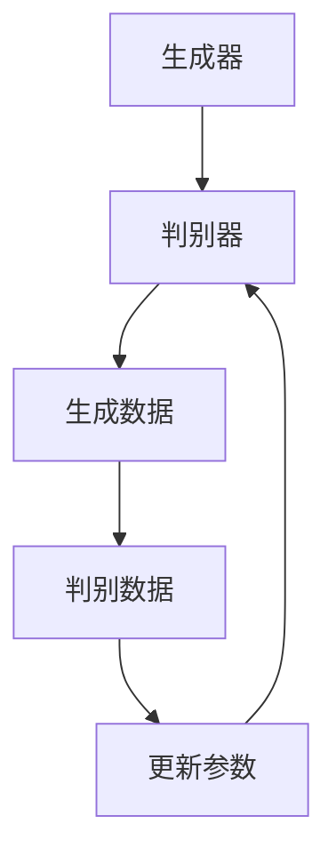
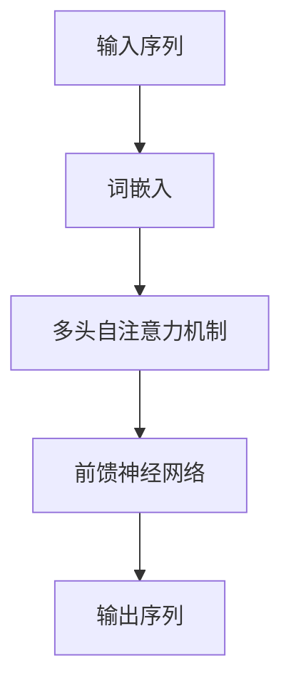

                 

# 提示词优化：增强AI讽刺文学创作的深度

> 关键词：AI讽刺文学、提示词优化、GANs、Transformer、自然语言处理

> 摘要：本文探讨了如何通过提示词优化来提升人工智能在讽刺文学创作中的深度。通过分析人工智能创作模型和提示词设计策略，本文提出了多种方法来优化提示词，以增强AI对讽刺语境的理解和创作能力。文章结构清晰，逻辑严密，旨在为AI在讽刺文学创作领域的研究与应用提供有价值的参考。

## 第1章: 背景介绍与核心概念

### 1.1 问题的背景

#### 1.1.1 人工智能与文学创作

随着人工智能技术的飞速发展，AI在各个领域的应用越来越广泛，其中文学创作领域也不例外。AI已经在自动写作、写作辅助等方面取得了显著成果。例如，基于深度学习的自动写作系统可以生成新闻报道、故事情节等，而写作辅助工具则可以帮助人类作者提高写作效率和质量。

然而，AI在讽刺文学创作方面的发展相对较慢。讽刺文学具有独特的风格和表达方式，往往需要作者具备深厚的文化底蕴和敏锐的观察力。虽然现有的AI模型在生成文本方面表现出色，但在理解和模拟讽刺手法方面仍然存在一定的困难。

#### 1.1.2 AI讽刺文学的现状与问题

目前，AI在讽刺文学创作中仍存在一些问题，如对讽刺语境的理解不够深入、讽刺效果的表现有限等。这些问题限制了AI在讽刺文学领域的应用潜力。例如，AI生成的讽刺作品往往缺乏幽默感和讽刺力度，无法达到人类作者的水平。此外，AI在处理讽刺文学时容易产生歧义，导致创作结果不符合预期。

### 1.2 提示词优化的概念

提示词优化是指通过改进输入的提示词，引导AI模型更好地理解创作意图，从而提升创作质量的过程。在AI讽刺文学创作中，提示词优化具有重要作用，能够帮助AI更准确地捕捉讽刺的要点，提高作品的讽刺效果。

### 1.3 核心概念

#### 1.3.1 人工智能创作模型

在本文中，我们将主要探讨基于深度学习的人工智能创作模型，如GANs、Transformer等，这些模型在讽刺文学创作中的应用。

#### 1.3.2 提示词设计策略

针对讽刺文学的特点，本文将介绍多种提示词设计策略，如情感化提示、情境化提示等，以提升AI对讽刺文学的理解和创作能力。

## 第2章: 核心概念与联系

### 2.1 AI讽刺文学创作模型原理

#### 2.1.1 GANs模型

GANs（生成对抗网络）是一种常用的深度学习模型，可以生成高质量的文本数据。GANs由生成器和判别器两个部分组成，生成器负责生成文本数据，判别器负责判断生成文本数据的质量。通过不断迭代训练，GANs能够提高生成文本的质量和多样性。

在本章中，我们将详细介绍GANs模型的工作原理和应用，并探讨如何将其应用于讽刺文学创作。

#### 2.1.2 Transformer模型

Transformer模型是一种基于自注意力机制的深度学习模型，在自然语言处理领域取得了巨大成功。Transformer模型通过自注意力机制处理长文本，能够捕捉文本中的长期依赖关系，从而提高文本生成质量。

在本章中，我们将探讨Transformer模型在讽刺文学创作中的应用，并分析其优势与不足。

### 2.2 AI讽刺文学创作模型属性特征对比表格

| 模型类型 | 特点 | 适用场景 |
| :---: | :---: | :---: |
| GANs | 可以生成高质量文本数据 | 需要大量训练数据，适用于创作多样性要求较高的场景 |
| Transformer | 基于自注意力机制，处理长文本能力较强 | 适用于需要处理长文本的讽刺文学创作 |

## 第3章: 提示词设计策略

### 3.1 情感化提示

#### 3.1.1 情感化提示的概念

情感化提示是指通过添加具有情感色彩的词汇和语句，引导AI模型创作出具有情感共鸣的讽刺作品。

#### 3.1.2 情感化提示的实践

在本节中，我们将通过具体案例，介绍如何在讽刺文学创作中使用情感化提示。

### 3.2 情境化提示

#### 3.2.1 情境化提示的概念

情境化提示是指通过提供具体的情境背景，引导AI模型创作出符合情境的讽刺作品。

#### 3.2.2 情境化提示的实践

在本节中，我们将通过具体案例，介绍如何在讽刺文学创作中使用情境化提示。

## 第4章: 算法原理讲解

### 4.1 GANs算法原理

#### 4.1.1 GANs模型的数学模型

在本章中，我们将使用mermaid画出GANs模型的mermaid流程图，并使用Python源代码详细阐述GANs算法的原理。

### 4.2 Transformer算法原理

#### 4.2.1 Transformer模型的数学模型

在本章中，我们将使用mermaid画出Transformer模型的mermaid流程图，并使用Python源代码详细阐述Transformer算法的原理。

## 第5章: 数学模型和数学公式

### 5.1 GANs数学模型

在本章中，我们将使用LaTeX格式给出GANs的数学模型，并进行详细讲解。

$$
\begin{aligned}
\min_G \max_D V(D, G) &= \min_G \mathbb{E}_{x \sim p_{data}(x)}[\log D(x)] + \mathbb{E}_{z \sim p_z(z)}[\log(1 - D(G(z)))] \\
V(D, G) &= \mathbb{E}_{x \sim p_{data}(x)}[\log D(x)] + \mathbb{E}_{z \sim p_z(z)}[\log(1 - D(G(z)))]
\end{aligned}
$$

### 5.2 Transformer数学模型

在本章中，我们将使用LaTeX格式给出Transformer的数学模型，并进行详细讲解。

$$
\begin{aligned}
\text{输入序列} &= [x_1, x_2, \ldots, x_n] \\
\text{词嵌入} &= \text{embedding}(x_i) \\
\text{自注意力} &= \text{softmax}\left(\frac{\text{query} \cdot \text{key}^T}{\sqrt{d_k}}\right) \\
\text{输出} &= \text{value} \cdot \text{自注意力} \\
\text{前馈神经网络} &= \text{ReLU}(W_2 \cdot \text{input} + b_2) \\
\text{输出序列} &= \text{softmax}(W_O \cdot \text{output} + b_O)
\end{aligned}
$$

## 第6章: 系统分析与架构设计方案

### 6.1 问题场景介绍

在本节中，我们将介绍AI讽刺文学创作系统的应用场景，包括用户需求、功能需求等。

### 6.2 项目介绍

在本节中，我们将介绍AI讽刺文学创作系统的整体架构、模块划分、技术选型等。

### 6.3 系统功能设计

在本节中，我们将使用mermaid类图展示系统的领域模型，详细介绍系统的主要功能模块及其关系。

### 6.4 系统架构设计

在本节中，我们将使用mermaid架构图展示系统的整体架构，包括前端、后端、数据库等模块及其交互关系。

### 6.5 系统接口设计和系统交互

在本节中，我们将使用mermaid序列图展示系统的接口设计和系统交互过程，详细介绍各个模块的功能和调用顺序。

## 第7章: 项目实战

### 7.1 环境安装

在本节中，我们将详细介绍AI讽刺文学创作系统的环境安装步骤，包括依赖库的安装、配置等。

### 7.2 系统核心实现源代码

在本节中，我们将展示系统核心功能的源代码，包括GANs模型和Transformer模型的实现。

### 7.3 代码应用解读与分析

在本节中，我们将对系统核心代码进行解读和分析，介绍代码的工作原理、设计思路和优化方法。

### 7.4 实际案例分析和详细讲解剖析

在本节中，我们将通过实际案例，展示AI讽刺文学创作系统的应用效果，并对案例进行分析和讲解。

### 7.5 项目小结

在本节中，我们将对项目进行总结，回顾项目实现过程中的经验教训，并对未来的发展方向进行展望。

## 第8章: 最佳实践 tips、小结、注意事项、拓展阅读等内容

### 8.1 最佳实践 tips

在本节中，我们将分享一些关于AI讽刺文学创作的最佳实践，帮助读者更好地应用本文提出的提示词优化方法。

### 8.2 小结

在本节中，我们将对全文进行总结，回顾文章的主要观点和结论。

### 8.3 注意事项

在本节中，我们将提醒读者在使用AI讽刺文学创作系统时需要注意的问题和事项。

### 8.4 拓展阅读

在本节中，我们将推荐一些相关的文献和资料，供读者进一步学习和研究。

作者：AI天才研究院/AI Genius Institute & 禅与计算机程序设计艺术 /Zen And The Art of Computer Programming

