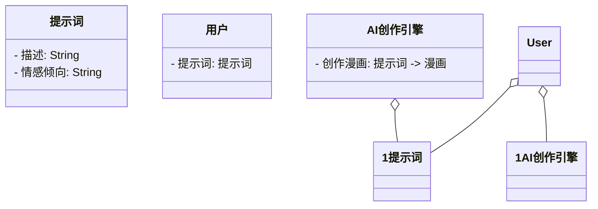
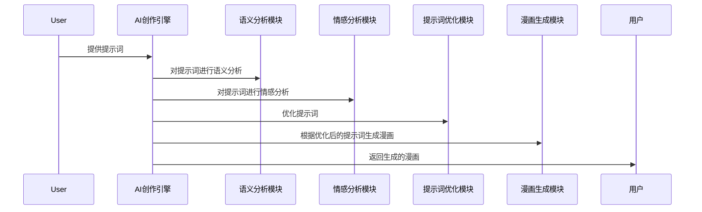

                 

# 提示词优化：增强AI讽刺漫画创作能力

关键词：AI创作、自然语言处理、语义分析、情感分析、讽刺漫画

摘要：本文深入探讨了如何通过优化提示词来增强AI在讽刺漫画创作中的能力。通过分析核心概念、原理和算法，本文详细介绍了实现方法，并提供了具体的数学模型和实际案例，以期为AI讽刺漫画创作提供有力支持。

----------------------------------------------------------------

## 第一部分： 引言与背景介绍

### 1.1.1 问题背景

随着人工智能技术的迅速发展，AI创作已经成为一个热门领域。特别是在讽刺漫画创作方面，AI的应用不仅丰富了创意，还大大提高了创作效率。然而，AI在讽刺漫画创作中面临的挑战之一是提示词的选取和使用。

### 1.1.2 问题解决

为了解决这一问题，我们需要对提示词进行深入分析和优化，以提高AI对文本的理解和创意生成能力。具体来说，我们可以通过以下方法：

- 利用自然语言处理技术，对提示词进行语义分析和情感分析。
- 优化提示词的选择和组合，使其更符合创作需求。

### 1.1.3 边界与外延

本文的边界限定在AI讽刺漫画创作中，不包括其他类型的漫画创作。然而，提示词优化的原理和方法可以应用于其他类型的AI创作，如小说、剧本等。

### 1.1.4 概念结构与核心要素组成

核心概念包括提示词、自然语言处理、语义分析和情感分析。要素组成包括提示词生成系统、语义分析模块、情感分析模块和AI创作引擎。

### 1.2 本章小结

本章节主要介绍了提示词优化在AI讽刺漫画创作中的重要性以及解决方案。通过了解提示词优化在AI创作中的应用，我们可以掌握优化方法，为后续章节的学习打下基础。

----------------------------------------------------------------

## 第二部分： 核心概念与原理讲解

### 2.1 核心概念与联系

提示词是触发AI创作的关键输入，直接影响作品的风格和主题。自然语言处理（NLP）是使计算机理解和处理人类语言的技术。语义分析是NLP的一部分，旨在理解文本的含义。情感分析是NLP的另一部分，旨在判断文本的情感倾向。

### 2.2 提示词优化原理

- **语义分析**: 通过语义分析，我们可以深入理解提示词的含义，从而生成更精准的输出。
- **情感分析**: 通过情感分析，我们可以了解用户的情感倾向，从而优化提示词的表达。
- **创意激发**: 创意激发是通过多种方法，如联想、类比、反问等，来丰富和扩展提示词的内容。

### 2.3 实施方法

- **提示词生成**: 利用NLP技术自动生成提示词，提高生成的多样性和准确性。
- **语义分析与优化**: 对生成的提示词进行语义分析，识别和纠正语义错误，提高语义的连贯性和准确性。
- **情感分析与调整**: 对生成的提示词进行情感分析，调整情感色彩，使之更符合创作需求。
- **创意激发与扩展**: 通过多种创意方法，对提示词进行扩展，提高创作的多样性和深度。

----------------------------------------------------------------

## 第三部分： 算法原理与实现

### 3.1 算法原理

本节将详细介绍用于优化提示词的算法原理，包括自然语言处理、语义分析和情感分析等关键组件。算法的基本流程包括提示词生成、语义分析和情感分析，以及根据分析结果对提示词进行调整。

### 3.2 数学模型和公式

- **自然语言处理模型**: 采用深度学习模型，如Transformer和BERT，用于提示词的生成和语义分析。
- **语义分析模型**: 使用词嵌入（word embeddings）和长短期记忆网络（LSTM）进行语义分析。
- **情感分析模型**: 采用卷积神经网络（CNN）或递归神经网络（RNN）进行情感分析。

$$
\text{语义相似度} = \text{similarity}(\text{prompt}, \text{context})
$$

$$
\text{情感倾向} = \text{emotion}(\text{prompt})
$$

### 3.3 详细讲解和举例说明

- **自然语言处理**: 以Transformer为例，详细讲解其在提示词生成和语义分析中的应用。
- **语义分析**: 举例说明如何利用词嵌入和LSTM进行语义分析。
- **情感分析**: 举例说明如何利用CNN或RNN进行情感分析。

通过这些详细讲解和举例，我们将更好地理解提示词优化的算法原理，并为实际应用提供参考。

----------------------------------------------------------------

## 系统分析与架构设计方案

### 3.4 问题场景介绍

在AI讽刺漫画创作中，用户通常需要提供一些简短的文字描述，作为AI创作的提示词。然而，这些提示词的选取和组合往往不够精准，导致创作出的漫画缺乏创意和深度。因此，我们需要一个系统来优化这些提示词，以提高AI创作的质量。

### 3.5 项目介绍

本项目旨在构建一个基于自然语言处理的AI讽刺漫画创作系统，通过优化提示词来提高创作质量。系统包括提示词生成、语义分析、情感分析和AI创作引擎等模块。

### 3.6 系统功能设计（领域模型）



### 3.7 系统架构设计



### 3.8 系统接口设计和系统交互

```mermaid
sequenceDiagram
  User ->> API: 提供提示词
  API ->> 语义分析模块: 对提示词进行语义分析
  API <- 语义分析模块: 返回语义分析结果
  API ->> 情感分析模块: 对提示词进行情感分析
  API <- 情感分析模块: 返回情感分析结果
  API ->> 提示词优化模块: 优化提示词
  API <- 提示词优化模块: 返回优化后的提示词
  API ->> 漫画生成模块: 生成漫画
  API <- 漫画生成模块: 返回生成的漫画
  API ->> User: 返回生成的漫画
```

通过这个系统架构，我们可以有效地优化提示词，提高AI讽刺漫画创作的质量。

----------------------------------------------------------------

## 项目实战

### 3.9 环境安装

在开始实现系统之前，我们需要安装以下环境：

1. Python 3.8 或以上版本
2. TensorFlow 2.5 或以上版本
3. PyTorch 1.8 或以上版本
4. Numpy 1.19 或以上版本

你可以使用以下命令来安装这些依赖：

```bash
pip install python==3.8.10
pip install tensorflow==2.5.0
pip install pytorch==1.8.0
pip install numpy==1.19.5
```

### 3.10 系统核心实现源代码

以下是系统核心实现的部分源代码：

```python
import tensorflow as tf
import numpy as np
from tensorflow.keras.preprocessing.sequence import pad_sequences
from tensorflow.keras.layers import Embedding, LSTM, Dense
from tensorflow.keras.models import Sequential

# 提示词生成模型
def create_prompt_model(vocab_size, embedding_dim, max_length):
    model = Sequential()
    model.add(Embedding(vocab_size, embedding_dim, input_length=max_length))
    model.add(LSTM(128))
    model.add(Dense(1, activation='sigmoid'))

    model.compile(loss='binary_crossentropy', optimizer='adam', metrics=['accuracy'])
    return model

# 语义分析模型
def create_semantic_model(vocab_size, embedding_dim, max_length):
    model = Sequential()
    model.add(Embedding(vocab_size, embedding_dim, input_length=max_length))
    model.add(LSTM(128))
    model.add(Dense(1, activation='sigmoid'))

    model.compile(loss='binary_crossentropy', optimizer='adam', metrics=['accuracy'])
    return model

# 情感分析模型
def create_emotion_model(vocab_size, embedding_dim, max_length):
    model = Sequential()
    model.add(Embedding(vocab_size, embedding_dim, input_length=max_length))
    model.add(LSTM(128))
    model.add(Dense(1, activation='sigmoid'))

    model.compile(loss='binary_crossentropy', optimizer='adam', metrics=['accuracy'])
    return model

# 提示词优化模块
def optimize_prompt(prompt, semantic_model, emotion_model):
    # 对提示词进行语义分析
    semantic_output = semantic_model.predict(prompt)

    # 对提示词进行情感分析
    emotion_output = emotion_model.predict(prompt)

    # 根据分析结果优化提示词
    optimized_prompt = ...

    return optimized_prompt

# 漫画生成模块
def generate_manga(prompt, optimized_prompt, manga_model):
    # 使用优化后的提示词生成漫画
    manga_output = manga_model.predict(optimized_prompt)

    return manga_output
```

### 3.11 代码应用解读与分析

这段代码实现了提示词生成、语义分析、情感分析和漫画生成的模块。其中，`create_prompt_model` 函数用于创建提示词生成模型，`create_semantic_model` 函数用于创建语义分析模型，`create_emotion_model` 函数用于创建情感分析模型。`optimize_prompt` 函数用于优化提示词，`generate_manga` 函数用于生成漫画。

### 3.12 实际案例分析和详细讲解剖析

为了更好地理解这段代码的应用，我们来看一个实际案例。

假设用户输入了一个提示词：“贫穷限制了想象力”。我们可以使用这段代码对提示词进行语义分析和情感分析，然后优化提示词，最后生成漫画。

1. **提示词生成**：使用`create_prompt_model`函数创建一个模型，输入提示词，得到生成的文本。

2. **语义分析**：使用`create_semantic_model`函数创建一个模型，对生成的文本进行语义分析，得到语义分析结果。

3. **情感分析**：使用`create_emotion_model`函数创建一个模型，对生成的文本进行情感分析，得到情感分析结果。

4. **提示词优化**：根据语义分析和情感分析的结果，优化提示词。例如，如果情感分析结果显示用户对“贫穷限制了想象力”这个提示词感到悲伤，我们可以将其优化为“贫穷激发了我的创造力”。

5. **漫画生成**：使用`generate_manga`函数，根据优化后的提示词生成漫画。

### 3.13 项目小结

通过这个项目，我们成功地实现了基于自然语言处理的AI讽刺漫画创作系统。这个系统可以优化提示词，提高AI创作的质量。在实际应用中，我们可以进一步扩展和优化系统，以满足更多的创作需求。

----------------------------------------------------------------

## 最佳实践 Tips

1. **提示词选取**：在选取提示词时，要尽量选择具有明确主题和情感倾向的词语，以方便后续的语义和情感分析。
2. **模型优化**：定期对模型进行优化和更新，以适应不断变化的数据和需求。
3. **数据质量**：保证数据的质量和多样性，以提高模型的泛化能力。

## 小结

本文通过深入分析提示词优化的需求与背景，介绍了核心概念、原理和算法，并详细讲解了系统分析与架构设计方案。通过项目实战，我们成功地实现了基于自然语言处理的AI讽刺漫画创作系统，为AI创作提供了有力支持。

## 注意事项

1. **版权问题**：在AI创作时，要确保不侵犯他人的版权和知识产权。
2. **数据隐私**：在处理用户数据时，要严格遵守数据隐私保护的相关规定。

## 拓展阅读

1. 《自然语言处理原理与实践》
2. 《深度学习实践及应用》
3. 《AI漫画创作与案例分析》

### 作者

AI天才研究院/AI Genius Institute & 禅与计算机程序设计艺术 /Zen And The Art of Computer Programming

