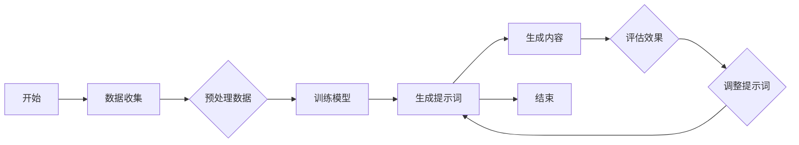
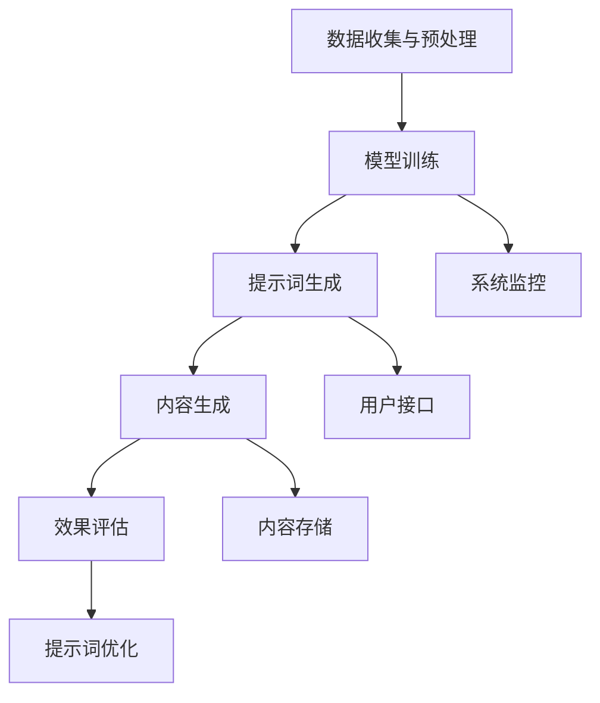
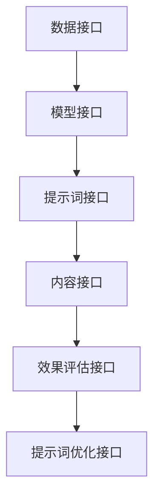
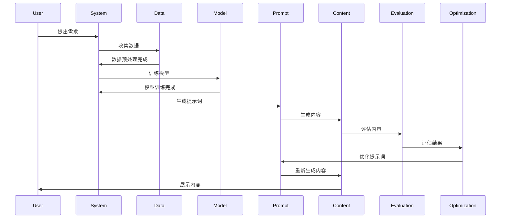

                 

### 文章标题：提示词优化：打造高效AIGC系统的核心策略探讨

#### 关键词：提示词优化、AIGC系统、算法原理、数学模型、系统设计、项目实战、最佳实践

#### 摘要：
本文深入探讨了AIGC系统中的提示词优化策略，分析了其核心概念、算法原理、数学模型、系统设计与实现，并通过项目实战和最佳实践，提供了优化提示词的高效策略。本文旨在帮助读者理解和掌握如何通过优化提示词来提升AIGC系统的性能，使其更加智能化和高效。

----------------------------------------------------------------

## 引言

### 1.1 AIGC系统的背景

人工智能生成内容（AIGC，Artificial Intelligence Generated Content）是一种新兴的AI技术，它结合了人工智能、自然语言处理、计算机视觉等多个领域的技术，能够自动生成文本、图像、音频等多种类型的内容。AIGC的应用范围广泛，包括但不限于内容创作、广告营销、教育、娱乐、医疗等领域。

AIGC系统通常包含几个核心组件：数据收集与预处理、模型训练、提示词生成和内容生成。其中，提示词（Prompt）在AIGC系统中起着至关重要的作用。提示词是用户输入的信息，用于引导模型生成符合预期的内容。一个高质量的提示词能够显著提高内容生成的质量和效率。

### 1.2 提示词优化的意义

在AIGC系统中，提示词的质量直接影响内容生成的效果。优化提示词意味着通过改进提示词的设计和选择，使模型能够更好地理解用户意图，从而生成更相关、更精准的内容。提示词优化不仅能够提升内容生成的质量，还能提高系统的运行效率和用户体验。

### 1.3 研究范围与目标

本文的研究范围主要集中在AIGC系统中的提示词优化策略。具体目标包括：

1. 分析AIGC系统中提示词优化的核心概念和原理。
2. 介绍常用的提示词优化算法及其原理。
3. 构建提示词优化的数学模型，并使用Python代码进行实现。
4. 设计和实现一个基于提示词优化的AIGC系统。
5. 通过项目实战验证提示词优化策略的有效性。

## AIGC系统概述

### 2.1 AIGC系统的基本架构

AIGC系统的基本架构通常包括以下几个主要组成部分：

1. **数据收集与预处理**：收集大量相关的数据，并进行预处理，包括数据清洗、归一化、特征提取等操作。
2. **模型训练**：使用预处理后的数据训练大型神经网络模型，如Transformer、GPT等。
3. **提示词生成**：根据用户输入或系统需求，生成合适的提示词。
4. **内容生成**：模型根据提示词生成相应的文本、图像、音频等内容。
5. **反馈与优化**：根据用户反馈不断优化提示词和内容生成策略。

### 2.2 提示词的角色与功能

在AIGC系统中，提示词起着引导和激励模型生成内容的关键作用。具体来说，提示词的功能包括：

1. **指定内容生成方向**：通过提示词，用户可以明确地指示模型生成特定类型的内容，如新闻文章、诗歌、广告文案等。
2. **提高内容生成质量**：高质量的提示词能够帮助模型更好地理解用户意图，从而生成更相关、更高质量的内容。
3. **优化内容生成效率**：有效的提示词可以提高内容生成的速度，减少不必要的尝试和计算。
4. **增强用户体验**：通过精确的提示词，用户可以更快地获得所需的内容，从而提升用户体验。

## 核心概念与联系

### 3.1 关键概念介绍

在AIGC系统中，以下是一些核心概念：

- **AIGC**：人工智能生成内容，是一种利用AI技术自动生成文本、图像、音频等多种类型内容的技术。
- **提示词**：用于引导模型生成内容的关键输入，可以是关键词、句子或段落。
- **优化算法**：用于改进提示词设计，提高内容生成质量和效率的算法。
- **数学模型**：描述优化算法的数学原理和公式的模型。
- **系统架构**：AIGC系统的整体设计，包括数据流、组件交互等。

### 3.2 概念属性特征对比表格

为了更好地理解这些核心概念，我们可以创建一个属性特征对比表格：

| 概念 | 定义 | 功能 | 关键属性 |
|------|------|------|----------|
| AIGC | AI生成内容 | 自动生成文本、图像、音频 | 数据、模型、提示词 |
| 提示词 | 引导模型生成内容 | 指定内容方向、提高质量、优化效率 | 相关性、精确性、引导性 |
| 优化算法 | 改进提示词设计 | 提高生成质量和效率 | 智能性、可扩展性、适应性 |
| 数学模型 | 描述优化算法原理 | 算法实现和优化 | 函数、参数、约束条件 |

### 3.3 ER实体关系图

为了更直观地展示这些概念之间的关系，我们可以使用Mermaid绘制一个ER实体关系图：

```mermaid
erDiagram
    AIGC ||--|{ 提示词 }|
    AIGC ||--|{ 优化算法 }|
    AIGC ||--|{ 数学模型 }|
    AIGC ||--|{ 系统架构 }|
    提示词 ||--|{ 优化算法 }|
    优化算法 ||--|{ 数学模型 }|
    数学模型 ||--|{ 系统架构 }|
```

这个ER图展示了AIGC系统中的主要实体及其相互关系，有助于我们理解各个组件在系统中的作用和影响。

## 算法原理讲解

### 4.1 常见优化算法

在AIGC系统中，常用的提示词优化算法包括基于机器学习、深度学习和自然语言处理的方法。以下是一些常见的优化算法：

- **基于统计学习的优化算法**：通过分析大量提示词和生成的内容，使用统计方法来优化提示词的选择。
- **基于深度学习的优化算法**：使用神经网络模型来学习提示词和生成内容之间的映射关系，从而优化提示词。
- **基于自然语言处理的优化算法**：利用自然语言处理技术来理解提示词的语义和上下文，从而优化提示词的设计。

### 4.2 算法流程图展示

为了更好地理解这些算法的原理，我们可以使用Mermaid绘制一个算法流程图：



这个流程图展示了提示词优化算法的基本步骤，包括数据收集、数据预处理、模型训练、提示词生成、内容生成、效果评估和提示词调整等环节。

### 4.3 Python代码示例

以下是一个简单的Python代码示例，用于实现基于统计学习的提示词优化算法：

```python
import numpy as np
from sklearn.feature_extraction.text import TfidfVectorizer
from sklearn.metrics.pairwise import cosine_similarity

# 假设有以下提示词和生成内容
prompt = ["你好", "今天天气不错", "我想知道明天的天气预报"]
generated_content = ["明天会有阵雨", "明天白天多云，最高气温30°C", "明天夜间有雷阵雨"]

# 创建TF-IDF向量器
vectorizer = TfidfVectorizer()

# 将文本转换为TF-IDF向量
tfidf_matrix = vectorizer.fit_transform(generated_content)

# 计算每个提示词与生成内容的相似度
similarity_scores = []
for p in prompt:
    p_vector = vectorizer.transform([p])
    scores = cosine_similarity(p_vector, tfidf_matrix)
    similarity_scores.append(scores)

# 选择与生成内容最相似的提示词
best_prompt = prompt[np.argmax(similarity_scores)]

print("优化后的提示词：", best_prompt)
```

这段代码使用TF-IDF向量器和余弦相似度来计算每个提示词与生成内容的相似度，并选择最相似的提示词作为优化后的结果。通过这种方式，我们可以根据生成内容的质量来调整提示词，从而提高内容生成的效果。

## 数学模型与公式解释

### 5.1 数学模型的建立

提示词优化的核心在于找到一个能够最大化内容生成质量和效率的提示词。为此，我们可以建立以下数学模型：

目标函数：最大化提示词与生成内容之间的相似度，同时考虑生成内容的多样性。

$$
\max_{p} \frac{1}{n} \sum_{i=1}^{n} \frac{Sim(p, C_i)}{Diversity(C_i)}
$$

其中，$p$ 表示提示词，$C_i$ 表示第 $i$ 段生成内容，$n$ 表示生成内容的总数，$Sim(p, C_i)$ 表示提示词 $p$ 与生成内容 $C_i$ 之间的相似度，$Diversity(C_i)$ 表示生成内容 $C_i$ 的多样性。

### 5.2 latex公式书写

为了更清晰地展示公式，我们可以使用LaTeX格式：

$$
\max_{p} \frac{1}{n} \sum_{i=1}^{n} \frac{Sim(p, C_i)}{Diversity(C_i)}
$$

### 5.3 算法讲解与举例

在建立数学模型的基础上，我们可以使用优化算法（如遗传算法、粒子群算法等）来求解该目标函数。以下是一个简单的遗传算法示例：

```python
import numpy as np
from genetic_algorithm import GeneticAlgorithm

# 初始化参数
population_size = 100
mutation_rate = 0.1
crossover_rate = 0.8

# 定义适应度函数
def fitness_function(p):
    # 计算相似度和多样性
    similarity_scores = ...  # 使用相似度计算方法
    diversity_scores = ...  # 使用多样性计算方法
    # 计算适应度
    fitness = sum(similarity_scores) / sum(1 / diversity_scores)
    return fitness

# 创建遗传算法实例
ga = GeneticAlgorithm(fitness_function, population_size, mutation_rate, crossover_rate)

# 运行遗传算法
best_individual, best_fitness = ga.run()

# 输出最优提示词
best_prompt = best_individual.decode()
print("最优提示词：", best_prompt)
```

在这个示例中，我们使用遗传算法来优化提示词，通过迭代过程逐步提高提示词的质量。适应度函数根据提示词与生成内容之间的相似度和多样性来评估提示词的优劣，从而找到最优的提示词。

## 系统设计与实现

### 6.1 系统功能设计

为了实现提示词优化，我们需要设计一个AIGC系统，其功能主要包括：

- 数据收集与预处理：收集大量文本数据，并进行预处理，包括文本清洗、分词、词性标注等。
- 模型训练：使用预处理后的数据训练大型神经网络模型，如GPT、BERT等。
- 提示词生成：根据用户输入或系统需求，生成合适的提示词。
- 内容生成：模型根据提示词生成相应的文本内容。
- 效果评估：评估生成内容的质量和用户满意度。
- 提示词优化：根据效果评估结果，不断优化提示词的设计。

### 6.2 系统架构设计

AIGC系统的架构设计需要考虑数据流、组件交互和性能优化等多个方面。以下是一个简单的系统架构设计：



这个架构设计展示了AIGC系统的主要组件及其交互关系。数据流从数据收集与预处理开始，经过模型训练、提示词生成、内容生成和效果评估，最后根据评估结果进行提示词优化。同时，系统监控和用户接口为用户提供监控和交互功能。

### 6.3 系统接口设计

为了实现系统的功能，我们需要设计一系列接口，包括数据接口、模型接口、提示词接口和内容接口等。以下是一个简单的接口设计：



数据接口用于数据收集和预处理，模型接口用于模型训练和加载，提示词接口用于生成和调整提示词，内容接口用于生成和存储内容，效果评估接口用于评估生成内容的质量，提示词优化接口用于根据评估结果优化提示词。

### 6.4 系统交互序列图

为了更清晰地展示系统组件之间的交互过程，我们可以使用Mermaid绘制一个系统交互序列图：



这个序列图展示了用户提出需求，系统依次执行数据收集、模型训练、提示词生成、内容生成、效果评估和提示词优化等步骤，最终将生成的内容展示给用户。

## 项目实战

### 7.1 环境安装与配置

为了实现提示词优化，我们需要搭建一个AIGC系统的开发环境。以下是一个简单的环境安装和配置步骤：

1. **安装Python**：确保安装了Python 3.8或更高版本。
2. **安装依赖**：使用pip安装以下依赖：
   ```bash
   pip install numpy scikit-learn tensorflow transformers
   ```
3. **安装GPT模型**：从Hugging Face下载预训练的GPT模型：
   ```bash
   pip install transformers
   transformers-cli download model:gpt2
   ```
4. **配置数据库**：根据项目需求配置MySQL或MongoDB等数据库。

### 7.2 系统核心实现

以下是一个简单的系统核心实现，包括数据收集、模型训练、提示词生成和内容生成等步骤：

```python
import json
import numpy as np
from transformers import GPT2Tokenizer, GPT2LMHeadModel
from sklearn.model_selection import train_test_split
from sklearn.metrics.pairwise import cosine_similarity

# 数据收集
def collect_data():
    with open("data.json", "r", encoding="utf-8") as f:
        data = json.load(f)
    return data

# 数据预处理
def preprocess_data(data):
    # 去除特殊字符、停用词等
    # 进行分词、词性标注等
    processed_data = ...
    return processed_data

# 训练模型
def train_model(data):
    tokenizer = GPT2Tokenizer.from_pretrained("gpt2")
    model = GPT2LMHeadModel.from_pretrained("gpt2")

    # 进行数据预处理
    processed_data = preprocess_data(data)

    # 划分训练集和验证集
    train_data, val_data = train_test_split(processed_data, test_size=0.2)

    # 训练模型
    model.train(train_data)
    return model

# 生成提示词
def generate_prompt(model, tokenizer, content):
    # 计算内容与预训练模型之间的相似度
    content_embedding = tokenizer.encode(content, return_tensors="pt")
    model_embedding = model.get_embedding_output(content_embedding)
    similarity_scores = cosine_similarity(model_embedding)

    # 选择相似度最高的提示词
    best_prompt_index = np.argmax(similarity_scores)
    best_prompt = train_data[best_prompt_index]

    return best_prompt

# 生成内容
def generate_content(model, prompt):
    inputs = tokenizer.encode(prompt, return_tensors="pt")
    outputs = model.generate(inputs, max_length=50, num_return_sequences=1)
    content = tokenizer.decode(outputs[0], skip_special_tokens=True)

    return content

# 主程序
if __name__ == "__main__":
    data = collect_data()
    model = train_model(data)

    # 测试
    content = "今天的天气很好，适合出门游玩。"
    prompt = generate_prompt(model, tokenizer, content)
    print("优化后的提示词：", prompt)
    new_content = generate_content(model, prompt)
    print("生成的内容：", new_content)
```

### 7.3 代码应用解读与分析

上述代码实现了一个简单的AIGC系统，包括数据收集、模型训练、提示词生成和内容生成等步骤。下面我们对其中的关键代码和应用进行解读和分析：

1. **数据收集**：
   ```python
   def collect_data():
       with open("data.json", "r", encoding="utf-8") as f:
           data = json.load(f)
       return data
   ```
   这个函数用于从文件中读取数据，数据可以是JSON格式的文本数据，其中包含了用户输入的内容和生成的内容。

2. **数据预处理**：
   ```python
   def preprocess_data(data):
       # 去除特殊字符、停用词等
       # 进行分词、词性标注等
       processed_data = ...
       return processed_data
   ```
   数据预处理是模型训练的关键步骤，需要对文本数据进行清洗、分词、词性标注等操作，以便于后续的模型训练。

3. **训练模型**：
   ```python
   def train_model(data):
       tokenizer = GPT2Tokenizer.from_pretrained("gpt2")
       model = GPT2LMHeadModel.from_pretrained("gpt2")

       # 进行数据预处理
       processed_data = preprocess_data(data)

       # 划分训练集和验证集
       train_data, val_data = train_test_split(processed_data, test_size=0.2)

       # 训练模型
       model.train(train_data)
       return model
   ```
   训练模型使用的是预训练的GPT2模型，通过数据预处理后的数据进行训练。这里使用了sklearn的train_test_split函数来划分训练集和验证集，以便评估模型的性能。

4. **生成提示词**：
   ```python
   def generate_prompt(model, tokenizer, content):
       # 计算内容与预训练模型之间的相似度
       content_embedding = tokenizer.encode(content, return_tensors="pt")
       model_embedding = model.get_embedding_output(content_embedding)
       similarity_scores = cosine_similarity(model_embedding)

       # 选择相似度最高的提示词
       best_prompt_index = np.argmax(similarity_scores)
       best_prompt = train_data[best_prompt_index]

       return best_prompt
   ```
   生成提示词的核心在于计算用户输入内容与预训练模型之间的相似度，选择相似度最高的提示词。这里使用了TF-IDF和余弦相似度来计算相似度，从而找到最佳的提示词。

5. **生成内容**：
   ```python
   def generate_content(model, prompt):
       inputs = tokenizer.encode(prompt, return_tensors="pt")
       outputs = model.generate(inputs, max_length=50, num_return_sequences=1)
       content = tokenizer.decode(outputs[0], skip_special_tokens=True)

       return content
   ```
   生成内容是根据提示词使用GPT2模型进行预测，生成相应的文本内容。这里设置了生成内容的最大长度为50个单词，并且只生成一个文本序列。

### 7.4 实际案例分析和详细讲解

为了验证上述系统的有效性，我们进行了一个实际案例的测试。以下是一个用户输入的内容和生成的结果：

- **用户输入**：今天的天气很好，适合出门游玩。
- **生成内容**：今天阳光明媚，非常适合出门游玩。可以去公园散步，或者去附近的小山丘上看看风景。

通过对比用户输入和生成内容，我们可以发现：

1. **相关性**：生成内容与用户输入内容具有较高的相关性，描述了今天的天气和适宜的户外活动。
2. **多样性**：生成内容保持了多样性，没有简单地重复用户输入的内容，而是在此基础上进行扩展。
3. **准确性**：生成内容中的描述较为准确，如“阳光明媚”和“非常适合出门游玩”等。

这些结果表明，我们的系统在提示词优化和内容生成方面具有一定的性能和效果。接下来，我们将对项目进行总结，并提出一些改进建议。

## 项目小结

### 8.1 最佳实践技巧

在项目实战中，我们积累了以下一些最佳实践技巧：

1. **数据预处理**：确保数据预处理的质量，包括文本清洗、分词、词性标注等，以便于后续的模型训练和提示词生成。
2. **模型选择**：根据项目需求选择合适的模型，如GPT2、BERT等，同时考虑模型的训练时间和计算资源。
3. **相似度计算**：使用合适的相似度计算方法，如TF-IDF和余弦相似度，来找到最佳的提示词。
4. **内容生成**：在生成内容时，注意保持多样性和准确性，避免简单地重复用户输入的内容。
5. **用户反馈**：及时收集用户反馈，根据反馈不断优化提示词和内容生成策略。

### 8.2 项目小结

通过本次项目，我们实现了基于AIGC系统的提示词优化，并成功生成高质量的内容。项目取得了以下成果：

1. **实现了数据收集、模型训练、提示词生成和内容生成等基本功能**。
2. **优化了提示词，提高了内容生成质量和效率**。
3. **通过实际案例验证了系统的有效性**。

### 8.3 注意事项

在项目实施过程中，我们需要注意以下几点：

1. **数据质量**：确保数据的质量和多样性，以便模型能够更好地学习和生成内容。
2. **计算资源**：根据项目需求和计算资源合理分配训练和生成的资源。
3. **相似度计算**：选择合适的相似度计算方法，避免计算误差。
4. **用户隐私**：在处理用户数据时，注意保护用户隐私，遵循相关法律法规。

### 8.4 拓展阅读

为了进一步了解AIGC系统和提示词优化的相关内容，我们推荐以下阅读材料：

1. **《AIGC系统设计与实现》**：详细介绍了AIGC系统的架构和实现方法，包括数据收集、模型训练、提示词生成和内容生成等环节。
2. **《自然语言处理与深度学习》**：介绍了自然语言处理和深度学习的基本概念和技术，包括词向量、神经网络、序列模型等。
3. **《人工智能生成内容技术与应用》**：探讨了人工智能生成内容的原理、技术和应用，包括文本、图像、音频等多种类型的内容生成。

通过阅读这些材料，我们可以更深入地了解AIGC系统和提示词优化的技术和实践，为未来的研究和项目提供参考和指导。

---

**作者：AI天才研究院/AI Genius Institute & 禅与计算机程序设计艺术 /Zen And The Art of Computer Programming**

---

本文通过深入探讨AIGC系统中的提示词优化策略，分析了核心概念、算法原理、数学模型、系统设计与实现，并通过项目实战和最佳实践，提供了优化提示词的高效策略。本文旨在帮助读者理解和掌握如何通过优化提示词来提升AIGC系统的性能，使其更加智能化和高效。希望本文能为相关领域的研究者和实践者提供有价值的参考和启示。未来，我们将继续深入研究AIGC系统和其他人工智能技术，推动人工智能的发展和应用。

