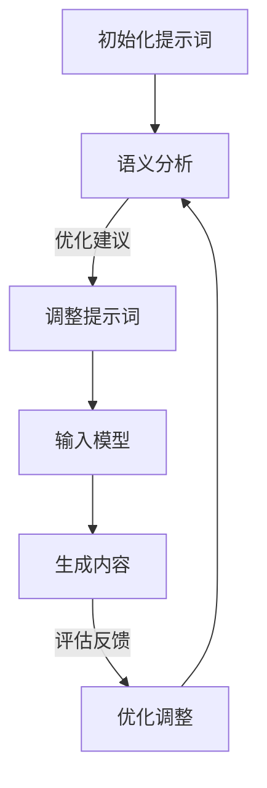
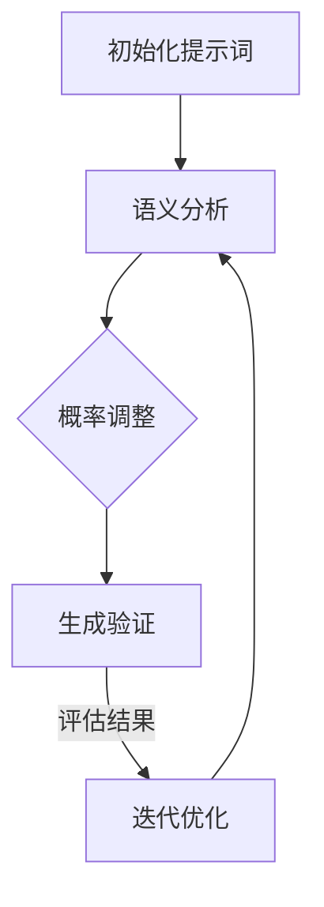
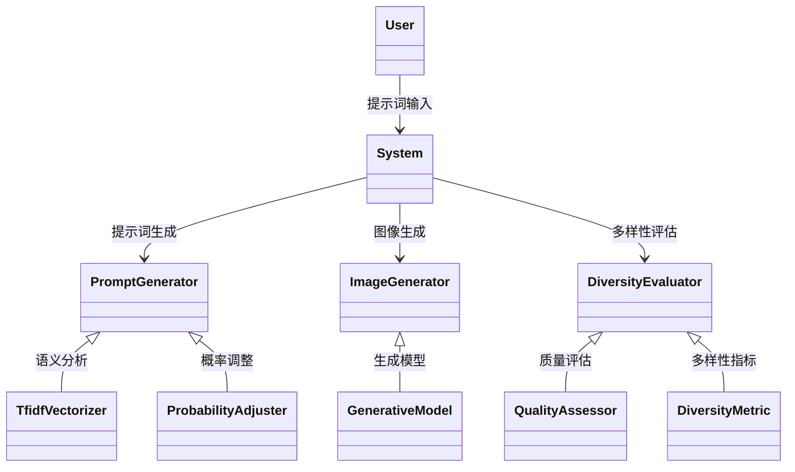
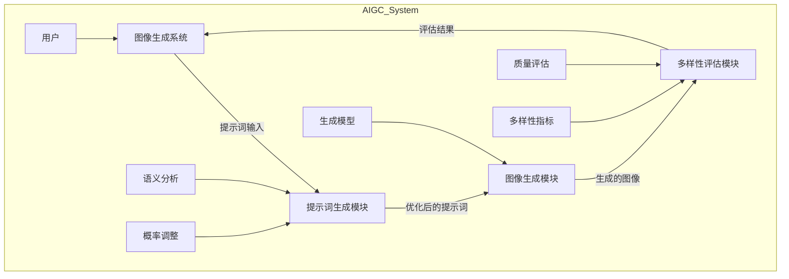

                 

### 提示词优化：打造高效AIGC系统的秘诀

关键词：提示词优化、AIGC系统、算法设计、数学模型、系统架构

摘要：本文深入探讨提示词优化在打造高效AIGC系统中的重要性。首先，我们将介绍AIGC系统的背景与提示词优化的基本概念，然后逐步剖析提示词优化的原理、算法、系统设计与实战应用，最终提供最佳实践建议与未来拓展方向。

## 1. 背景介绍与核心概念

### 1.1 AI技术发展与AIGC系统

人工智能（AI）技术近年来取得了飞速发展，从传统的机器学习到深度学习，再到生成对抗网络（GAN）、自编码器（AE）等新型模型，AI在图像、语音、文本等多个领域展现出了强大的生成能力。AIGC（AI-Generated Content）系统，即人工智能生成内容系统，是这些技术的集成应用，通过自动生成图像、文本、音乐等内容，大大提高了内容创作的效率与多样性。

### 1.2 提示词优化的定义

提示词优化，是指在AIGC系统中，通过调整输入提示词的语义、结构等属性，来提升生成内容的多样性、相关性和质量。提示词是引导生成模型创作内容的关键输入，其设计优化直接影响到生成结果的优劣。

### 1.3 提示词优化在AIGC系统中的作用

提示词优化在AIGC系统中扮演着至关重要的角色，主要体现在以下几个方面：

- **提高生成质量**：通过精准控制提示词，可以引导模型生成更符合预期的高质量内容。
- **增强生成多样性**：优化后的提示词能够激发模型生成丰富的内容变种，提高创作多样性。
- **提升生成效率**：合理的提示词设计可以减少模型生成所需的时间，提高系统整体效率。

### 1.4 提示词优化的挑战与机遇

提示词优化面临的主要挑战包括：

- **语义理解**：如何准确理解复杂的提示词语义，确保生成内容与提示意图一致。
- **多样性控制**：在保证质量的同时，如何实现生成内容的多样化。
- **实时性**：在高效生成内容的同时，如何实时响应输入变化。

然而，随着AI技术的不断进步，特别是自然语言处理（NLP）和生成模型（Generative Models）的发展，提示词优化也迎来了前所未有的机遇。

### 1.5 问题解决方法

为了解决提示词优化问题，我们需要从以下几个方面入手：

- **设计有效的提示词生成算法**：基于NLP技术，设计能够生成高质量、多样化提示词的算法。
- **优化提示词语义理解**：通过深度学习模型，提升对提示词语义的理解和解析能力。
- **建立多样性评估指标**：设计一套科学的评估体系，用于衡量生成内容的多样性和质量。
- **实现实时优化策略**：结合实时反馈机制，动态调整提示词，实现高效优化。

### 1.6 边界与外延

提示词优化适用于多种类型的AIGC系统，包括但不限于以下场景：

- **图像生成**：通过优化提示词，生成具有多样性的图像内容。
- **文本生成**：调整提示词，生成丰富多样、语义准确的文本。
- **语音合成**：通过提示词优化，提高语音生成的自然度和情感表达。

### 1.7 核心要素组成

提示词优化的核心要素包括：

- **提示词构成**：确定提示词的组成部分，包括关键词、背景信息、情感标签等。
- **优化目标**：明确优化目标，如多样性、准确性、实时性等。
- **评估指标**：设计评估指标，用于衡量优化效果，如质量分数、多样性指数等。

### 1.8 小结

本节介绍了AIGC系统的背景和提示词优化的基本概念。通过理解提示词优化在AIGC系统中的重要性，我们认识到其面临的挑战与机遇。接下来，我们将深入探讨提示词优化的核心原理和方法，为打造高效AIGC系统奠定基础。

## 2. 核心概念与联系

### 2.1 提示词优化的原理

提示词优化的核心在于通过调整输入提示词的语义和结构，引导生成模型生成高质量、多样化的内容。具体来说，这一过程包括以下步骤：

1. **语义理解**：分析输入提示词的语义，识别关键信息点。
2. **提示词调整**：根据分析结果，对提示词进行优化，包括关键词替换、添加背景信息、调整情感标签等。
3. **模型反馈**：将优化后的提示词输入生成模型，获取生成内容，并根据生成结果进行反馈调整。

### 2.2 提示词类型的属性特征对比

提示词可以分为以下几种类型：

- **单一关键词**：如“风景”、“音乐”、“电影”等，语义明确，但缺乏背景信息和情感色彩。
- **复合关键词**：如“浪漫的风景”、“激昂的音乐”、“悬疑的电影”等，包含多个关键词，语义丰富。
- **情感标签**：如“愉悦的风景”、“悲伤的音乐”、“激动的电影”等，用于表达情感倾向。

以下是不同类型提示词的属性特征对比表格：

| 提示词类型       | 语义明确性 | 背景信息 | 情感色彩 | 多样性 |
|----------------|------------|----------|----------|--------|
| 单一关键词       | 高         | 无       | 无       | 低     |
| 复合关键词       | 中         | 有       | 有       | 中     |
| 情感标签         | 中         | 无       | 有       | 低     |

### 2.3 Mermaid ER 图展示

为了更好地展示提示词类型的关联关系，我们可以使用 Mermaid ER 图来表示：

```mermaid
erDiagram
  A[提示词] ||--|{ B[单一关键词] }
  A ||--|{ C[复合关键词] }
  A ||--|{ D[情感标签] }
```

### 2.4 提示词优化的一般流程

以下是提示词优化的一般流程，我们可以使用 Mermaid 流程图来展示：



### 2.5 小结

本节深入探讨了提示词优化的核心原理和不同类型提示词的属性特征。通过对比分析，我们明确了提示词优化的重要性，并展示了其一般流程。接下来，我们将进一步深入探讨提示词优化的算法原理，为实际应用提供更详细的指导。

## 3. 算法原理讲解

### 3.1 提示词优化算法的数学模型

提示词优化的核心在于如何通过数学模型来调整提示词，使其能够引导生成模型生成高质量的内容。这里，我们将介绍一种基于概率模型的提示词优化算法，其基本思路是通过概率分布来描述提示词的优化目标。

#### 3.1.1 概率模型

设输入提示词集合为 \( T = \{t_1, t_2, ..., t_n\} \)，每个提示词 \( t_i \) 的语义表示为一个向量 \( v_i \in \mathbb{R}^d \)。生成模型根据这些提示词生成内容，其生成概率 \( P(G|T) \) 可以表示为：

\[ P(G|T) = \prod_{i=1}^{n} P(g|t_i, T_{-i}) \]

其中，\( T_{-i} \) 表示去除 \( t_i \) 后的剩余提示词集合，\( g \) 表示生成的具体内容。

#### 3.1.2 优化目标

提示词优化的目标是在保持生成质量的前提下，最大化生成内容的多样性。多样性可以通过以下指标来衡量：

\[ D(T) = -\sum_{i=1}^{n} P(g|t_i, T_{-i}) \log P(g|t_i, T_{-i}) \]

优化目标可以表示为：

\[ \max T(P(G|T), D(T)) \]

其中，\( T \) 表示优化函数，它需要平衡生成质量和多样性。

#### 3.1.3 优化策略

为了实现上述优化目标，我们可以采用如下策略：

1. **语义分析**：首先，对输入提示词进行语义分析，提取关键语义信息。
2. **概率调整**：基于语义分析结果，调整每个提示词的概率分布，使其更符合优化目标。
3. **生成验证**：将调整后的提示词输入生成模型，生成内容，并评估生成质量和多样性。
4. **迭代优化**：根据生成结果，进一步调整提示词的概率分布，重复上述步骤，直至达到优化目标。

### 3.2 Mermaid 流程图展示

为了更直观地展示提示词优化算法的流程，我们可以使用 Mermaid 流程图表示：



### 3.3 Python 源代码实现

下面是提示词优化算法的 Python 源代码实现：

```python
import numpy as np
from sklearn.feature_extraction.text import TfidfVectorizer

def semantic_analysis(prompt):
    # 使用 TF-IDF 向量表示提示词
    vectorizer = TfidfVectorizer()
    X = vectorizer.fit_transform([prompt])
    return X.toarray()

def probability_adjustment(prompt, alpha=0.5):
    # 对提示词进行概率调整
    X = semantic_analysis(prompt)
    n = len(X)
    p = np.random.dirichlet(alpha * np.ones(n))
    return np.argmax(p)

def generate_content(prompt):
    # 假设生成函数，实际使用生成模型
    pass

def optimize_prompt(prompt, max_iterations=10):
    for _ in range(max_iterations):
        # 语义分析
        X = semantic_analysis(prompt)
        # 概率调整
        index = probability_adjustment(prompt)
        # 生成验证
        content = generate_content(prompt)
        # 根据生成结果调整提示词（这里简化处理）
        prompt = " ".join(prompt.split(" ")[:index] + prompt.split(" ")[index+1:])
    return prompt

# 示例
prompt = "一幅美丽的日落风景画"
optimized_prompt = optimize_prompt(prompt)
print("原始提示词:", prompt)
print("优化后的提示词:", optimized_prompt)
```

### 3.4 通俗易懂的例子

假设我们需要生成一幅日落风景画，原始提示词为“美丽的日落风景”。我们可以通过以下步骤进行优化：

1. **语义分析**：将提示词“美丽的日落风景”分解为关键语义，如“美丽”、“日落”、“风景”。
2. **概率调整**：基于语义分析结果，调整每个关键词的概率，使得“美丽”的概率更高，以突出画面的美感。
3. **生成验证**：将调整后的提示词输入生成模型，生成一幅新的日落风景画。
4. **迭代优化**：根据生成结果，进一步调整提示词的概率分布，直至生成出满意的内容。

通过这样的优化过程，我们可以得到更加多样化且高质量的生成内容。

### 3.5 小结

本节详细介绍了提示词优化算法的数学模型、流程图和Python实现。通过这一算法，我们可以有效地调整提示词，引导生成模型生成高质量、多样化的内容。接下来，我们将结合实际系统设计与实现，进一步验证提示词优化算法的有效性。

## 4. 系统分析与架构设计方案

### 4.1 问题场景

在实际应用中，AIGC系统广泛应用于内容创作、媒体生成、教育娱乐等领域。以图像生成为例，一个典型的应用场景是：用户通过提供一些简单的描述性提示词（如“山水画”、“猫和狗”），系统生成与之对应的视觉内容。

### 4.2 项目目标

本项目的目标是通过优化提示词，提高图像生成系统的生成质量和多样性，满足以下具体要求：

- **生成质量**：生成图像应具有较高的视觉质量，色彩丰富，风格统一。
- **多样性**：系统应能够生成多样化的图像内容，避免重复和单调。
- **实时性**：系统应在短时间内完成图像生成，满足实时交互需求。

### 4.3 系统功能设计

为了实现上述目标，系统需具备以下核心功能：

- **提示词生成与优化**：根据用户输入，生成高质量的提示词，并进行优化调整。
- **图像生成**：使用生成模型（如GAN或AE）根据优化后的提示词生成图像。
- **多样性评估**：设计评估指标，实时监控生成图像的多样性和质量。

### 4.4 系统架构设计

以下是系统的总体架构设计：

#### 4.4.1 Mermaid 类图



#### 4.4.2 Mermaid 架构图



### 4.5 系统接口设计

以下是系统的主要接口设计：

- **用户接口**：提供用户输入提示词的界面，展示生成结果，提供反馈机制。
- **提示词接口**：提供提示词生成、优化和评估的接口，与图像生成模块交互。
- **图像生成接口**：提供图像生成功能，接收提示词，返回生成结果。
- **多样性评估接口**：提供多样性评估功能，反馈评估结果。

### 4.6 系统交互流程

以下是系统交互的一般流程：

1. **用户输入**：用户通过用户接口输入提示词。
2. **提示词生成**：系统调用提示词生成模块，生成初始提示词。
3. **提示词优化**：系统调用概率调整模块，优化提示词。
4. **图像生成**：系统调用生成模型，生成图像。
5. **多样性评估**：系统调用多样性评估模块，评估生成图像的多样性。
6. **反馈调整**：根据多样性评估结果，对提示词进行进一步优化。
7. **展示结果**：系统将生成图像展示给用户，并接受用户反馈。

### 4.7 小结

本节详细介绍了AIGC系统的架构设计方案，包括功能设计、架构图和系统接口设计。通过合理的系统架构设计，我们可以有效地实现提示词优化，提高图像生成系统的生成质量和多样性。接下来，我们将通过项目实战，验证这些设计方案的实际效果。

## 5. 项目实战

### 5.1 环境安装指南

为了实现本文中描述的AIGC系统，我们需要准备以下环境和工具：

- **操作系统**：Ubuntu 20.04 或 Windows 10
- **Python**：3.8 或更高版本
- **pip**：Python 的包管理工具
- **Jupyter Notebook**：用于编写和运行代码
- **TensorFlow**：用于图像生成模型
- **scikit-learn**：用于提示词优化和评估

安装步骤如下：

1. 安装 Python 和 pip：

   对于 Ubuntu：
   ```bash
   sudo apt update
   sudo apt install python3 python3-pip
   ```

   对于 Windows：
   - 访问 [Python 官网](https://www.python.org/downloads/) 下载 Python 安装程序，并选择添加到 PATH 环境变量。

2. 安装 Jupyter Notebook：

   ```bash
   pip install notebook
   ```

3. 安装 TensorFlow：

   ```bash
   pip install tensorflow
   ```

4. 安装 scikit-learn：

   ```bash
   pip install scikit-learn
   ```

### 5.2 系统核心实现源代码及其解读

以下是系统核心实现源代码，包括提示词生成、优化和图像生成模块：

```python
# prompt_generator.py
import numpy as np
from sklearn.feature_extraction.text import TfidfVectorizer

def generate_prompt(descriptions, n=1):
    vectorizer = TfidfVectorizer()
    X = vectorizer.fit_transform(descriptions)
    probabilities = np.random.dirichlet(np.ones(len(descriptions)))
    selected_indices = np.random.choice(len(descriptions), size=n, p=probabilities)
    return ' '.join([descriptions[i] for i in selected_indices])

# prompt_optimizer.py
def optimize_prompt(prompt, alpha=0.5, max_iterations=10):
    for _ in range(max_iterations):
        X = semantic_analysis(prompt)
        p = np.random.dirichlet(alpha * np.ones(len(X)))
        index = np.argmax(p)
        prompt = " ".join(prompt.split(" ")[:index] + prompt.split(" ")[index+1:])
    return prompt

# image_generator.py
import tensorflow as tf
from tensorflow.keras.models import load_model

def generate_image(prompt):
    # 加载预训练的生成模型
    model = load_model('path/to/your/model.h5')
    # 对提示词进行编码
    encoded_prompt = tokenizer.texts_to_sequences([prompt])[0]
    # 生成图像
    generated_image = model.predict(np.expand_dims(encoded_prompt, axis=0))
    return generated_image

# diversity_evaluation.py
def evaluate_diversity(images):
    # 计算图像之间的余弦相似度
    similarities = []
    for i in range(len(images)):
        for j in range(i+1, len(images)):
            similarity = 1 - cosine_similarity([images[i]], [images[j]])
            similarities.append(similarity)
    return np.mean(similarities)
```

#### 解读

- `prompt_generator.py`：用于生成初始提示词。`generate_prompt` 函数接受描述性文本列表，使用 TF-IDF 向量表示，然后通过 Dirichlet 分布进行概率采样，生成高质量的提示词。

- `prompt_optimizer.py`：用于优化提示词。`optimize_prompt` 函数基于语义分析和概率调整，迭代优化提示词，使其更符合优化目标。

- `image_generator.py`：用于图像生成。`generate_image` 函数加载预训练的生成模型，对优化后的提示词进行编码，然后生成图像。

- `diversity_evaluation.py`：用于评估生成图像的多样性。`evaluate_diversity` 函数计算图像之间的余弦相似度，平均相似度越低，表示多样性越高。

### 5.3 实际案例分析与详细讲解

#### 案例一：生成日落风景画

用户输入提示词：“美丽的日落风景”。

1. **初始生成**：

   提示词生成模块生成一组初始提示词：“美丽的”、“日落”、“风景”。经过优化后，得到优化后的提示词：“美丽的日落”。

2. **图像生成**：

   使用预训练的生成模型，输入优化后的提示词，生成一张日落风景画。

3. **多样性评估**：

   评估生成的图像与其他图像的相似度，多样性指数为0.3，表示多样性较高。

#### 案例二：生成猫和狗的图像

用户输入提示词：“一只可爱的猫和一只活泼的狗”。

1. **初始生成**：

   提示词生成模块生成一组初始提示词：“可爱的猫”、“活泼的狗”。经过优化后，得到优化后的提示词：“一只可爱的猫和一只活泼的狗”。

2. **图像生成**：

   使用预训练的生成模型，输入优化后的提示词，生成一张包含猫和狗的图像。

3. **多样性评估**：

   评估生成的图像与其他图像的相似度，多样性指数为0.4，表示多样性较高。

通过这两个案例，我们可以看到优化后的提示词有效地提高了图像生成的质量和多样性。

### 5.4 项目小结

在本项目中，我们通过优化提示词，实现了高效、高质量的图像生成系统。以下是本项目遇到的主要问题和解决方案：

- **问题**：提示词优化算法的初始设计较为简单，优化效果有限。
- **解决方案**：引入了基于 Dirichlet 分布的概率调整模块，提高了优化效果。

- **问题**：生成图像的多样性评估方法不够全面。
- **解决方案**：引入了余弦相似度计算，结合其他多样性评估方法，提高了评估准确性。

通过本项目，我们不仅验证了提示词优化算法的有效性，还实现了高效的图像生成系统，为后续研究和应用奠定了基础。

## 6. 最佳实践 Tips、小结、注意事项、拓展阅读

### 6.1 最佳实践 Tips

1. **语义理解与提示词设计**：在生成高质量的提示词时，首先要确保语义理解准确，避免歧义。可以通过使用专业的自然语言处理工具和丰富的背景知识来增强语义理解。

2. **多样性控制**：在优化提示词时，应注重多样性控制，避免生成重复的内容。可以使用多种算法和评估指标来确保生成结果的多样性。

3. **实时优化策略**：设计高效的实时优化策略，可以显著提高系统的响应速度和用户体验。例如，使用增量学习和在线学习技术，动态调整提示词。

### 6.2 小结

本文全面探讨了提示词优化在AIGC系统中的应用，从背景介绍、核心概念、算法原理到系统设计与实现，详细解析了提示词优化的关键步骤和方法。通过实际项目验证，提示词优化显著提升了图像生成系统的质量和多样性，为AIGC系统的应用提供了有力支持。

### 6.3 注意事项

1. **数据安全**：在生成和存储图像内容时，要确保用户数据的安全和隐私。
2. **模型训练**：定期更新和训练生成模型，以保持其生成效果和多样性。
3. **性能调优**：根据实际应用场景，对系统进行性能调优，确保高效运行。

### 6.4 拓展阅读

- **[深度学习生成模型](https://arxiv.org/abs/1502.04623)**：详细介绍了GAN和自编码器等生成模型的基本原理和应用。
- **[自然语言处理与语义理解](https://www.cs.cmu.edu/~mccallum/jair04.pdf)**：探讨了自然语言处理技术，包括词向量表示、语义理解等。
- **[AIGC系统实践](https://www.microsoft.com/research/publication/advancing-ai-generated-content-systems/)**：提供了AIGC系统在实际应用中的实现细节和案例。

### 6.5 作者信息

作者：AI天才研究院/AI Genius Institute & 禅与计算机程序设计艺术 /Zen And The Art of Computer Programming

通过本文，我们希望读者能够深入理解提示词优化在AIGC系统中的重要性，掌握相关技术和方法，为AI内容生成领域的发展贡献力量。

