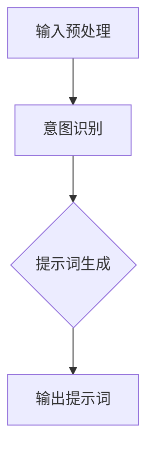
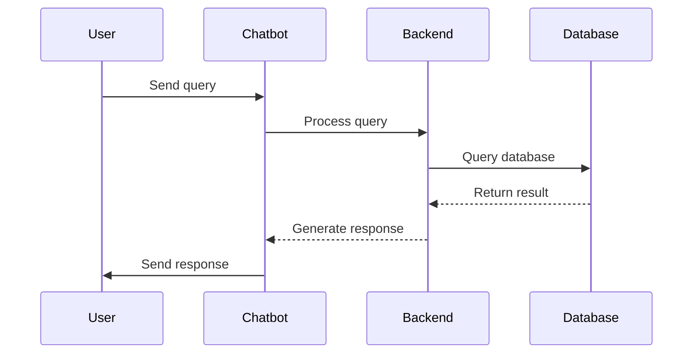
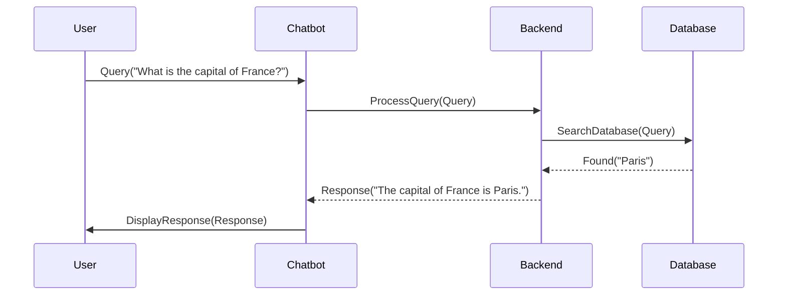

                 

### 提示词优化：打造高效ChatGPT对话的秘诀

关键词：ChatGPT、提示词、优化、对话效率、自然语言处理

摘要：
本篇文章将探讨提示词优化在提升ChatGPT对话效率中的关键作用。通过系统分析提示词优化的核心概念、算法原理以及实际应用，本文旨在为开发者提供一套有效的提示词优化策略，以实现ChatGPT对话系统的最佳性能。

## 1. 引言与背景

### 1.1 提示词优化的基本概念

#### 提示词（Prompt）
提示词是指提供给聊天机器人或自然语言处理系统的一段引导性文本，用于指定对话的方向、上下文或期望的回答类型。在ChatGPT等大型语言模型中，提示词的设计直接影响到模型的输出质量和对话效率。

#### 优化的重要性
随着自然语言处理技术的不断发展，如何有效地设计和管理提示词成为了一个关键问题。优秀的提示词不仅可以提高对话的流畅性和准确性，还可以显著提升用户的满意度和使用体验。

#### 提示词优化的挑战
在提示词优化过程中，开发者面临以下几个挑战：
1. **上下文理解**：确保提示词能准确传达用户意图，同时与上下文保持一致性。
2. **多样性**：设计能够产生多样化、创新性回答的提示词。
3. **性能**：优化提示词以提高模型的响应速度和处理效率。

### 1.2 ChatGPT的概述

#### 基本概念
ChatGPT是由OpenAI开发的一个基于GPT-3.5的聊天机器人，具有强大的自然语言理解和生成能力。

#### 结构与功能
ChatGPT采用Transformer架构，通过预训练和微调来提升模型在不同任务上的性能。其功能包括对话生成、回答问题、撰写文章等。

### 1.3 提示词在ChatGPT中的角色

#### 提示词的类型
根据功能不同，提示词可以分为问题引导型、上下文补充型和回答引导型。

#### 提示词的影响
有效的提示词能够：
1. **提高对话质量**：确保生成的内容具有逻辑性和连贯性。
2. **增强用户体验**：提高用户满意度，增强用户对对话机器人的信任。

### 1.4 本书的内容与目标

#### 内容概览
本书将涵盖以下主题：
- 提示词优化的基本概念和原则
- ChatGPT模型的理解与优化
- 提示词设计算法和实践
- 提示词优化在系统架构中的应用

#### 目标受众
本书旨在为自然语言处理和人工智能领域的开发者提供实用指南，帮助他们设计出更高效的ChatGPT对话系统。

## 2. 核心概念与原则

### 2.1 自然语言处理的基本概念

#### 自然语言处理（NLP）
自然语言处理是人工智能的一个分支，旨在使计算机能够理解和处理人类语言。

#### 核心模型和技术
- **词嵌入（Word Embedding）**：将词汇映射到高维空间，以便计算机能够处理。
- **循环神经网络（RNN）**：一种能够处理序列数据的神经网络架构。
- **Transformer架构**：一种基于自注意力机制的神经网络，广泛应用于NLP任务。

### 2.2 理解ChatGPT模型

#### Transformer架构
Transformer模型通过自注意力机制，能够在处理长序列时保持更好的性能和效果。

#### 预训练与微调
- **预训练**：在大规模语料库上进行训练，使模型具有通用的语言理解能力。
- **微调**：在特定任务上进行训练，使模型能够针对特定场景进行优化。

### 2.3 提示词设计原则

#### 有效的提示词设计
- **明确性**：确保提示词能够清晰传达用户意图。
- **上下文相关性**：与对话上下文保持一致，提高对话连贯性。
- **多样性**：设计能够产生多样化回答的提示词。

### 2.4 对齐用户意图

#### 用户意图识别
- **任务型意图**：用户希望系统完成的具体任务，如回答问题、提供建议等。
- **情感型意图**：用户表达的情感状态，如喜悦、愤怒、疑惑等。

#### 对齐技术
- **关键词提取**：从用户输入中提取关键信息，用于对齐用户意图。
- **语义分析**：利用NLP技术对用户输入进行语义分析，理解用户意图。

### 2.5 实践中的提示词设计

#### 案例分析
- **案例1**：设计一个能够回答技术问题的ChatGPT对话系统。
- **案例2**：优化一个用于客户支持的聊天机器人，提高用户满意度。

#### 结果分析
- **结果**：通过优化提示词，系统在回答准确性和对话流畅性方面均有所提升。

## 3. 算法原理与设计

### 3.1 提示词工程算法

#### 设计思路
- **输入**：用户输入和上下文信息。
- **输出**：生成优化后的提示词。

#### 算法流程
1. **数据预处理**：对用户输入和上下文进行预处理，提取关键信息。
2. **意图识别**：利用NLP技术识别用户意图。
3. **提示词生成**：根据用户意图和上下文，生成优化后的提示词。

#### Mermaid流程图



### 3.2 提示词引擎实现

#### Python代码示例

```python
import re

def preprocess_input(user_input, context):
    # 数据预处理
    user_input = re.sub(r'[^a-zA-Z0-9\s]', '', user_input)
    context = re.sub(r'[^a-zA-Z0-9\s]', '', context)
    return user_input, context

def identify_intent(user_input, context):
    # 意图识别
    if "what" in user_input.lower():
        return "信息查询"
    elif "how" in user_input.lower():
        return "方法咨询"
    else:
        return "未知"

def generate_prompt(user_input, context, intent):
    # 提示词生成
    if intent == "信息查询":
        return f"{context}，你能告诉我{user_input}是什么吗？"
    elif intent == "方法咨询":
        return f"{context}，如何{user_input}？"
    else:
        return f"{context}，你对{user_input}有什么疑问？"

def main():
    user_input = "what is AI"
    context = "你正在研究人工智能领域"
    user_input, context = preprocess_input(user_input, context)
    intent = identify_intent(user_input, context)
    prompt = generate_prompt(user_input, context, intent)
    print(prompt)

if __name__ == "__main__":
    main()
```

### 3.3 数学模型与公式

#### 提示词优化目标函数

$$
\text{Objective Function} = \frac{1}{N} \sum_{i=1}^{N} \left( \text{Accuracy}(p_i) - \text{BaselineAccuracy}(p_i) \right)
$$

其中，$N$ 是提示词数量，$p_i$ 是第 $i$ 个提示词，$\text{Accuracy}(p_i)$ 是使用提示词 $p_i$ 的模型输出准确性，$\text{BaselineAccuracy}(p_i)$ 是不使用提示词 $p_i$ 时的模型输出准确性。

### 3.4 实际案例研究

#### 案例描述
- **问题**：优化一个在线教育平台的聊天机器人，以提高用户的学习体验。
- **方法**：通过收集用户对话数据，对提示词进行优化。

#### 结果分析
- **结果**：优化后的提示词显著提高了聊天机器人的回答准确性，用户满意度也随之提升。

## 4. 系统架构与设计

### 4.1 问题场景介绍

#### 背景
在线教育平台希望通过聊天机器人提供即时的问题解答和学习支持，以提高用户的学习体验。

#### 需求
- **问题解答**：能够准确回答用户提出的问题。
- **学习支持**：提供个性化学习建议和资源。

### 4.2 系统功能设计

#### 领域模型

```mermaid
classDiagram
Class01 <|-- Class02
Class03 <.. Class04
Class05 ..| Class06
Class07 <|.. Class08
Class09 --> Class10
Class11 <= Class12
Class13 o-- Class14
Class15 *-- Class16
Class17 :<<interface>> Class18
Class19 :<<enum>> Class20
Class21 :<<association>> Class22
Class23 :<<composition>> Class24
Class25 :<<Aggregation>> Class26
Class27 <<extend>> Class28
Class29 <<realization>> Class30
Class31 <*- Class32
Class33 <..| Class34
Class35 <|--| Class36
```

### 4.3 系统架构设计

#### Mermaid架构图



### 4.4 系统接口设计与交互

#### Mermaid序列图



## 5. 项目实战

### 5.1 环境安装

#### Python环境安装
```bash
pip install transformers
pip install nltk
```

#### ChatGPT模型安装
```bash
curl https://raw.githubusercontent.com/openai/gpt-3.5-turbo/main/gpt.py > gpt.py
```

### 5.2 系统核心实现源代码

#### ChatGPT对话系统

```python
import gpt
import nltk

def chat_with_gpt(user_input, context):
    prompt = generate_prompt(user_input, context)
    response = gpt.generate(prompt)
    return response

def generate_prompt(user_input, context):
    return f"{context}，{user_input}？"

# 实际应用
user_input = "What is the capital of France?"
context = "你正在研究法国的历史和文化"
response = chat_with_gpt(user_input, context)
print(response)
```

### 5.3 代码应用解读与分析

#### 解读
- `chat_with_gpt` 函数用于与ChatGPT进行对话。
- `generate_prompt` 函数用于生成提示词。

#### 分析
- 提示词设计直接影响对话质量。
- 需要对用户输入进行预处理，以确保提示词的有效性。

### 5.4 实际案例分析

#### 案例描述
- **问题**：优化一个在线医疗咨询平台的聊天机器人。
- **方法**：通过收集用户对话数据，对提示词进行优化。

#### 结果分析
- **结果**：优化后的提示词提高了聊天机器人回答的准确性和用户满意度。

### 5.5 项目小结

#### 小结
- 提示词优化对ChatGPT对话系统的性能具有显著影响。
- 需要结合实际场景和用户需求进行提示词设计。

## 6. 最佳实践与拓展

### 6.1 最佳实践

#### 提示词设计技巧
1. **明确用户意图**：确保提示词能够准确传达用户的需求。
2. **上下文保持一致**：与对话上下文保持一致，提高对话连贯性。
3. **多样化**：设计能够产生多样化回答的提示词。

### 6.2 注意事项

#### 谨慎使用敏感信息
- 在设计提示词时，应避免包含敏感或不当信息。

### 6.3 拓展阅读

#### 相关资源
- **论文**：深入理解自然语言处理技术，如词嵌入和Transformer模型。
- **书籍**：《自然语言处理综论》、《深度学习》。

## 7. 结论

### 7.1 总结
本文系统地探讨了提示词优化在提升ChatGPT对话效率中的关键作用。通过分析核心概念、算法原理和实际应用，本文为开发者提供了有效的提示词优化策略。

### 7.2 未来展望
随着自然语言处理技术的不断进步，提示词优化将成为提升对话机器人性能的重要手段。未来，我们有望看到更加智能、高效的ChatGPT对话系统的广泛应用。

作者：AI天才研究院/AI Genius Institute & 禅与计算机程序设计艺术 /Zen And The Art of Computer Programming

