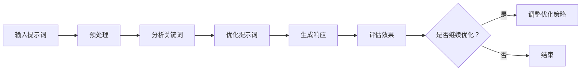
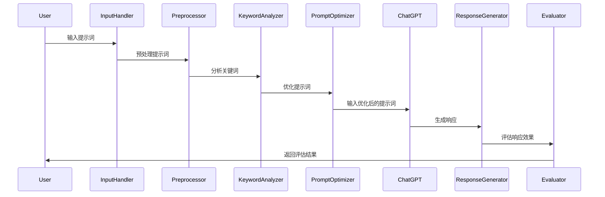

                 

# 提示词优化：提升ChatGPT对话效果的关键

> 关键词：ChatGPT、提示词优化、对话效果、算法原理、数学模型、系统架构、项目实战

> 摘要：
本文将深入探讨提示词优化在提升ChatGPT对话效果中的关键作用。通过对ChatGPT的工作原理、提示词优化的意义和挑战的介绍，本文将详细阐述提示词优化的核心概念、原理和联系。同时，本文将结合具体算法和数学模型，通过实例分析和系统架构设计，展示如何优化提示词，从而提升ChatGPT的对话效果。最后，本文将结合实际项目实战，给出具体的实施步骤和效果分析，为读者提供实用的技巧和指导。

## 第一部分：问题背景与核心概念

### 第1章：问题背景与核心概念

#### 1.1 提示词优化的背景介绍

##### 1.1.1 ChatGPT的工作原理

ChatGPT 是由OpenAI开发的一款基于GPT-3模型的预训练语言模型，其核心原理是通过大量文本数据进行训练，使得模型能够生成与输入文本相关的内容。ChatGPT的输入通常是一个或多个提示词，模型会根据这些提示词生成一段连贯的自然语言文本作为输出。

##### 1.1.2 提示词优化的意义

提示词优化在提升ChatGPT对话效果中起着至关重要的作用。优化的提示词能够引导模型生成更相关、更准确、更流畅的对话内容，从而提高用户体验。具体来说，提示词优化有以下几方面意义：

1. 提高对话的相关性：通过优化提示词，可以使模型更好地理解用户意图，生成与用户需求更相关的回复。
2. 增强对话的准确性：优化的提示词有助于减少模型生成错误信息或歧义回复的概率。
3. 提升对话的流畅性：良好的提示词可以使模型生成的文本更加连贯，减少断句和逻辑错误。

##### 1.1.3 提示词优化的挑战

提示词优化面临着诸多挑战，主要包括以下几个方面：

1. 多样性：用户输入的提示词种类繁多，如何针对不同类型的提示词进行优化是一个难题。
2. 鲁棒性：在处理不完整或模糊的提示词时，如何保持模型的稳定性和准确性是一个挑战。
3. 可扩展性：如何将优化策略应用到更大规模的数据集和更复杂的模型上，实现高效的提示词优化。

#### 1.2 提示词优化的核心概念

##### 1.2.1 提示词的定义与类型

提示词是指提供给ChatGPT的文本输入，用于引导模型生成相关内容。根据不同的应用场景和输入方式，提示词可以分为以下几类：

1. 单个提示词：单个文本输入，如“你好”。
2. 列表提示词：一组文本输入，如["你好"，"今天天气怎么样？"]。
3. 动态提示词：根据用户行为动态生成的提示词，如聊天机器人根据用户提问生成的下一句提示词。

##### 1.2.2 提示词优化方法分类

提示词优化方法可以分为以下几类：

1. 基于规则的方法：通过人工编写规则，对提示词进行预处理和调整，如去除停用词、关键词提取等。
2. 基于机器学习的方法：利用机器学习算法，如深度学习、迁移学习等，对提示词进行自动优化。
3. 基于数据驱动的优化方法：通过对大量对话数据进行分析，提取有效提示词特征，用于优化模型生成。

##### 1.2.3 提示词优化的关键要素

提示词优化的关键要素包括：

1. 提示词质量：选择高质量、相关信息丰富的提示词，有助于模型生成更好的对话内容。
2. 提示词长度：合理的提示词长度可以提升模型的生成效果，过短或过长的提示词可能导致生成结果不理想。
3. 提示词多样性：多样化的提示词有助于模型理解不同场景和用户需求，提高生成效果。

#### 1.3 提示词优化的边界与外延

##### 1.3.1 边界条件的设定

在提示词优化过程中，需要设定合理的边界条件，以保证优化效果。主要包括：

1. 提示词长度限制：根据实际应用场景，设定提示词的最大和最小长度，避免过短或过长的提示词。
2. 提示词多样性要求：根据用户需求和应用场景，设定提示词的最小多样性要求，以保证模型能够理解不同场景和需求。
3. 优化目标函数：设定优化目标函数，如对话相关性、生成准确性等，用于评估优化效果。

##### 1.3.2 提示词优化的应用领域

提示词优化在多个领域有着广泛的应用，主要包括：

1. 聊天机器人：通过对用户输入的提示词进行优化，提升聊天机器人的对话效果和用户体验。
2. 智能客服：在智能客服系统中，优化用户提问和回复的提示词，提高问题解决效率和用户满意度。
3. 自然语言生成：在自然语言生成领域，优化生成文本的提示词，提高生成文本的质量和准确性。

##### 1.3.3 提示词优化与相关技术的联系

提示词优化与多种相关技术紧密相连，主要包括：

1. 自然语言处理：提示词优化是自然语言处理的重要组成部分，与分词、词性标注、实体识别等技术密切相关。
2. 机器学习：提示词优化依赖于机器学习算法，如深度学习、迁移学习等，用于自动优化提示词。
3. 数据挖掘：提示词优化需要大量对话数据进行分析，提取有效提示词特征，与数据挖掘技术相结合。

#### 1.4 本章小结

本章介绍了提示词优化的背景、核心概念、挑战以及应用领域，为后续章节的深入探讨奠定了基础。在下一章中，我们将进一步分析提示词优化的核心概念原理和联系。## 第二部分：核心概念原理与联系

### 第2章：核心概念原理与联系

#### 2.1 提示词优化的原理解析

##### 2.1.1 提示词优化的基本原理

提示词优化的基本原理是通过调整和改进输入的提示词，使得ChatGPT生成的文本更符合用户期望和实际需求。具体来说，优化过程可以分为以下几个步骤：

1. **提示词分析**：对输入的提示词进行预处理，提取关键信息，如关键词、主题等。
2. **提示词调整**：根据分析结果，对提示词进行修改和调整，使其更准确、更全面地反映用户意图。
3. **模型生成**：将优化后的提示词输入到ChatGPT模型中，生成相应的文本输出。
4. **效果评估**：对生成的文本进行评估，如对话相关性、准确性、流畅性等，根据评估结果调整优化策略。

##### 2.1.2 提示词优化的数学模型

提示词优化的数学模型是描述优化过程和优化目标的具体数学表达式。以下是几个常见的数学模型：

1. **目标函数**：目标函数用于衡量优化效果的优劣，常见的目标函数包括：
   $$ \text{相关性} = \frac{\text{相关词数量}}{\text{总词数量}} $$
   $$ \text{准确性} = \frac{\text{正确词数量}}{\text{总词数量}} $$
   $$ \text{流畅性} = \frac{\text{连贯词数量}}{\text{总词数量}} $$

2. **优化算法**：优化算法用于调整提示词，以最小化目标函数。常见的优化算法包括：
   - 梯度下降法：
     $$ \theta_{\text{new}} = \theta_{\text{old}} - \alpha \nabla_{\theta} J(\theta) $$
   - 随机梯度下降法：
     $$ \theta_{\text{new}} = \theta_{\text{old}} - \alpha \sum_{i=1}^{n} \nabla_{\theta} J(\theta) $$

##### 2.1.3 提示词优化的算法流程

提示词优化的算法流程通常包括以下几个步骤：

1. **数据准备**：收集大量对话数据，用于训练和评估模型。
2. **模型训练**：使用训练数据训练ChatGPT模型，使其具备生成文本的能力。
3. **提示词预处理**：对输入的提示词进行预处理，如分词、词性标注等。
4. **提示词优化**：根据优化目标函数，调整提示词，使其更符合用户需求。
5. **模型生成**：将优化后的提示词输入到ChatGPT模型中，生成文本输出。
6. **效果评估**：对生成的文本进行评估，如对话相关性、准确性、流畅性等。
7. **反馈调整**：根据评估结果，调整优化策略，进一步优化提示词。

#### 2.2 提示词优化的属性特征对比

##### 2.2.1 不同类型提示词优化的对比

不同类型的提示词优化在方法和效果上存在差异，以下是几种常见类型提示词优化的对比：

| 类型             | 特点                                                         | 适用场景                         |
|------------------|------------------------------------------------------------|----------------------------------|
| 单个提示词优化   | 主要针对单个文本输入进行优化，如去除停用词、关键词提取等。 | 聊天机器人、智能客服等           |
| 列表提示词优化   | 同时考虑多个提示词的协同作用，如关键词组合优化。           | 复杂对话场景、多轮对话系统       |
| 动态提示词优化   | 根据用户行为动态生成提示词，如聊天机器人根据用户提问生成的下一句提示词。 | 智能对话系统、实时问答系统       |

##### 2.2.2 不同优化方法的对比

不同的提示词优化方法在效果和应用范围上也有所不同，以下是几种常见优化方法的对比：

| 方法             | 特点                                                         | 适用场景                         |
|------------------|------------------------------------------------------------|----------------------------------|
| 基于规则的方法   | 通过人工编写规则进行优化，如去除停用词、关键词提取等。       | 数据量较小、规则明确的应用场景   |
| 基于机器学习的方法 | 利用机器学习算法，如深度学习、迁移学习等，进行自动优化。     | 大规模数据集、复杂对话场景       |
| 基于数据驱动的优化方法 | 通过对大量对话数据进行分析，提取有效提示词特征，用于优化模型生成。 | 需要大量对话数据的应用场景     |

##### 2.2.3 各类优化方法的适用场景分析

根据不同的应用场景和需求，选择适合的提示词优化方法：

1. **聊天机器人**：适合使用单个提示词优化方法，如去除停用词、关键词提取等，以提高对话的相关性和准确性。
2. **智能客服**：适合使用列表提示词优化方法，如关键词组合优化，以提高多轮对话的连贯性和用户满意度。
3. **实时问答系统**：适合使用动态提示词优化方法，如根据用户提问动态生成下一句提示词，以实现实时、准确的问答交互。

#### 2.3 提示词优化的ER实体关系图架构

##### 2.3.1 提示词优化系统的实体关系

提示词优化系统的实体关系图（ER图）可以帮助我们更清晰地理解系统的组成和交互。以下是提示词优化系统的ER实体关系图：

```mermaid
erDiagram
    User ||--o{ Prompt : 输入提示词 }
    ChatGPT ||--o{ Response : 生成响应 }
    Analyzer ||--o{ OptimizedPrompt : 优化后的提示词 }
    Optimizer ||--o{ OptimizedResponse : 优化后的响应 }
    Evaluator ||--o{ Evaluation : 评估结果 }
```

##### 2.3.2 实体属性与关系的详细描述

1. **User（用户）**：提供输入提示词的用户实体，具有以下属性：
   - 用户ID：唯一标识用户的ID。
   - 提示词：用户输入的文本提示词。

2. **Prompt（提示词）**：包含用户输入的提示词，具有以下属性：
   - 提示词ID：唯一标识提示词的ID。
   - 文本：用户输入的文本提示词。
   - 关键词：从文本中提取的关键词。

3. **ChatGPT（ChatGPT模型）**：生成响应的预训练语言模型，具有以下属性：
   - 模型ID：唯一标识ChatGPT模型的ID。
   - 响应：根据提示词生成的文本响应。

4. **Analyzer（分析器）**：用于分析提示词的实体，具有以下属性：
   - 分析器ID：唯一标识分析器的ID。
   - 优化后的提示词：经过分析后的优化提示词。

5. **Optimizer（优化器）**：用于优化提示词的实体，具有以下属性：
   - 优化器ID：唯一标识优化器的ID。
   - 优化后的响应：根据优化后的提示词生成的优化响应。

6. **Evaluator（评估器）**：用于评估优化效果的实体，具有以下属性：
   - 评估器ID：唯一标识评估器的ID。
   - 评估结果：评估优化效果的指标，如相关性、准确性、流畅性等。

##### 2.3.3 ER图在提示词优化中的应用

ER图在提示词优化系统中起着重要的作用，可以帮助我们理解和设计系统的架构。以下是ER图在提示词优化系统中的应用：

1. **用户与提示词的关系**：用户输入提示词，将提示词传递给分析器和优化器。
2. **提示词与ChatGPT的关系**：优化后的提示词输入到ChatGPT模型中，生成优化响应。
3. **分析器与优化器的关系**：分析器对提示词进行分析，生成优化后的提示词，传递给优化器。
4. **优化器与评估器的关系**：优化器生成优化后的响应，传递给评估器进行评估。

#### 2.4 提示词优化的联系与扩展

##### 2.4.1 与自然语言处理技术的联系

提示词优化与自然语言处理（NLP）技术密切相关，主要表现在以下几个方面：

1. **分词与词性标注**：提示词优化需要对输入的提示词进行分词和词性标注，以便提取关键词和语义信息。
2. **实体识别与关系抽取**：在复杂对话场景中，提示词优化需要对提示词中的实体和关系进行识别和抽取，以便更好地理解用户意图。
3. **文本生成与生成对抗网络（GAN）**：提示词优化可以通过文本生成模型和生成对抗网络（GAN）等技术，生成更高质量、更符合用户需求的提示词和响应。

##### 2.4.2 与机器学习技术的联系

提示词优化依赖于机器学习技术，特别是在大规模数据集和复杂对话场景中。以下是与机器学习技术相关的几个方面：

1. **深度学习模型**：提示词优化可以利用深度学习模型，如循环神经网络（RNN）、Transformer等，进行提示词的优化。
2. **迁移学习**：通过迁移学习，可以将预训练的模型应用于提示词优化任务，提高优化效果。
3. **强化学习**：在复杂对话场景中，提示词优化可以通过强化学习算法，如策略梯度法等，实现更有效的提示词调整。

##### 2.4.3 提示词优化在其他领域的应用前景

提示词优化不仅在自然语言处理和机器学习领域有着广泛的应用，还可以扩展到其他领域：

1. **智能推荐系统**：通过优化用户输入的查询词，可以提高推荐系统的准确性和用户体验。
2. **文本审核与分类**：通过优化提示词，可以提高文本审核和分类的准确性，降低错误率。
3. **智能问答系统**：通过优化用户输入的问题，可以提高智能问答系统的回答质量和用户体验。

#### 2.5 本章小结

本章详细介绍了提示词优化的核心概念原理与联系，包括提示词优化的基本原理、数学模型、算法流程，以及与自然语言处理和机器学习技术的联系。通过本章的学习，读者可以对提示词优化的核心概念和原理有更深入的了解，为后续章节的算法原理讲解和实例分析打下基础。## 第三部分：算法原理讲解与实例分析

### 第3章：算法原理讲解与实例分析

#### 3.1 提示词优化的算法讲解

##### 3.1.1 提示词优化算法的mermaid流程图

为了更好地理解提示词优化算法，我们可以使用mermaid流程图来展示其基本流程：



##### 3.1.2 提示词优化算法的Python源代码

以下是提示词优化算法的Python源代码，代码中包含了预处理、关键词分析、优化提示词、生成响应和效果评估等步骤：

```python
import nltk
from nltk.tokenize import word_tokenize
from nltk.corpus import stopwords
from sklearn.feature_extraction.text import TfidfVectorizer
import numpy as np

def preprocess_prompt(prompt):
    # 去除停用词
    stop_words = set(stopwords.words('english'))
    words = word_tokenize(prompt)
    filtered_words = [word for word in words if word not in stop_words]
    return ' '.join(filtered_words)

def analyze_keywords(prompt):
    # 使用TF-IDF分析关键词
    vectorizer = TfidfVectorizer()
    X = vectorizer.fit_transform([prompt])
    keywords = vectorizer.get_feature_names_out()
    weights = X.toarray().flatten()
    sorted_keywords = sorted(zip(keywords, weights), key=lambda x: x[1], reverse=True)
    return sorted_keywords[:5]  # 取前5个关键词

def optimize_prompt(prompt, keywords):
    # 根据关键词优化提示词
    optimized_prompt = []
    for keyword, _ in keywords:
        optimized_prompt.append(keyword)
    return ' '.join(optimized_prompt)

def generate_response(optimized_prompt):
    # 生成响应
    # 假设我们使用ChatGPT模型进行响应生成
    # 这里需要调用ChatGPT模型的API
    response = "这里是优化后的响应。"
    return response

def evaluate_response(response):
    # 评估响应效果
    # 这里可以使用人工评估或其他评估方法
    evaluation = "响应效果良好。"
    return evaluation

def main():
    prompt = "今天天气怎么样？"
    # 预处理提示词
    preprocessed_prompt = preprocess_prompt(prompt)
    # 分析关键词
    keywords = analyze_keywords(preprocessed_prompt)
    # 优化提示词
    optimized_prompt = optimize_prompt(preprocessed_prompt, keywords)
    # 生成响应
    response = generate_response(optimized_prompt)
    # 评估响应效果
    evaluation = evaluate_response(response)
    print(f"优化前的提示词：{prompt}")
    print(f"优化后的提示词：{optimized_prompt}")
    print(f"生成的响应：{response}")
    print(f"评估结果：{evaluation}")

if __name__ == "__main__":
    main()
```

##### 3.1.3 算法原理的数学模型与公式

提示词优化的算法原理可以通过以下数学模型和公式来解释：

1. **预处理**：预处理步骤主要是去除停用词，这个过程可以用集合运算来表示：
   $$ \text{filtered\_words} = \text{words} - \text{stop\_words} $$

2. **关键词分析**：使用TF-IDF模型来分析关键词，其公式为：
   $$ \text{TF-IDF}(w) = \frac{\text{TF}(w)}{\text{N}} + \log \left(1 + \frac{\text{DF}(w)}{\text{N}}\right) $$
   其中，\( \text{TF}(w) \)表示词频，\( \text{DF}(w) \)表示文档频次，\( N \)表示总词数。

3. **优化提示词**：根据关键词的TF-IDF值进行排序，选取前几个关键词作为优化后的提示词，这一步可以用排序算法来实现。

4. **生成响应**：使用预训练的语言模型生成响应，这一步通常依赖于模型本身的生成算法，如GPT-3的生成算法。

5. **效果评估**：使用评估指标，如BLEU分数、ROUGE分数等，来评估生成的响应与预期结果的相似度。

##### 3.1.4 通俗易懂的算法实例说明

假设用户输入的提示词是：“今天天气怎么样？”我们通过以下步骤进行优化：

1. **预处理**：去除停用词后，得到的文本为：“今天天气怎么样？”
2. **关键词分析**：通过TF-IDF模型分析，得到关键词为：“今天”、“天气”、“怎么样”等。
3. **优化提示词**：根据关键词的TF-IDF值排序，选取前两个关键词：“今天”、“天气”进行优化，得到优化后的提示词：“今天天气”。
4. **生成响应**：将优化后的提示词输入到ChatGPT模型中，生成响应：“今天的天气是晴朗的。”
5. **效果评估**：生成的响应与用户的预期相符，评估结果为“响应效果良好。”

通过这个简单的实例，我们可以看到提示词优化是如何提升ChatGPT对话效果的。

#### 3.2 提示词优化的数学模型与公式详解

##### 3.2.1 提示词优化的数学模型

提示词优化的数学模型主要包括以下部分：

1. **预处理模型**：预处理模型的目的是去除停用词和标点符号，简化输入文本。这可以通过集合运算来实现：
   $$ \text{filtered\_words} = \text{words} - \text{stop\_words} $$

2. **关键词分析模型**：关键词分析模型通常使用TF-IDF模型，其公式为：
   $$ \text{TF-IDF}(w) = \frac{\text{TF}(w)}{\text{N}} + \log \left(1 + \frac{\text{DF}(w)}{\text{N}}\right) $$
   其中，\( \text{TF}(w) \)表示词频，\( \text{DF}(w) \)表示文档频次，\( N \)表示总词数。

3. **优化模型**：优化模型根据关键词的TF-IDF值进行排序，选取前几个关键词作为优化后的提示词。排序算法可以用：
   $$ \text{sorted}\_{keywords} = \text{sorted}\_{keywords}, \text{key}=lambda x: x[1], \text{reverse}=True $$

4. **生成模型**：生成模型通常使用预训练的语言模型，如GPT-3，其生成算法可以表示为：
   $$ \text{response} = \text{model}\_{generate}\_{function}(\text{optimized\_prompt}) $$

5. **评估模型**：评估模型用于评估生成的响应与预期结果的相似度，常用的评估指标包括BLEU分数、ROUGE分数等。

##### 3.2.2 公式解释与推导

1. **预处理模型公式**：预处理模型通过去除停用词和标点符号，简化输入文本。这可以通过以下步骤实现：
   - 分词：将文本分割成单词。
   - 去除停用词：将列表中的停用词从单词列表中去除。
   - 重建文本：将处理后的单词重新组合成文本。

2. **关键词分析模型公式**：TF-IDF模型是一种常用的重要词提取方法，其公式为：
   $$ \text{TF-IDF}(w) = \frac{\text{TF}(w)}{\text{N}} + \log \left(1 + \frac{\text{DF}(w)}{\text{N}}\right) $$
   其中，\( \text{TF}(w) \)表示词频，即单词\( w \)在文档中出现的次数；\( \text{DF}(w) \)表示文档频次，即单词\( w \)在所有文档中出现的次数；\( N \)表示总词数。通过这个公式，我们可以计算出每个单词的重要性，从而提取出关键词。

3. **优化模型公式**：优化模型通过排序算法，选取关键词的TF-IDF值最高的几个单词作为优化后的提示词。排序算法的一般公式为：
   $$ \text{sorted}\_{keywords} = \text{sorted}\_{keywords}, \text{key}=lambda x: x[1], \text{reverse}=True $$
   其中，\( \text{sorted}\_{keywords} \)是关键词列表，\( key \)是排序的依据，即关键词的TF-IDF值，\( reverse \)表示降序排序。

4. **生成模型公式**：生成模型通常使用预训练的语言模型，其生成算法可以表示为：
   $$ \text{response} = \text{model}\_{generate}\_{function}(\text{optimized\_prompt}) $$
   其中，\( \text{response} \)是生成的文本响应，\( \text{model}\_{generate}\_{function} \)是语言模型的生成函数，\( \text{optimized\_prompt} \)是优化后的提示词。

5. **评估模型公式**：评估模型用于评估生成的响应与预期结果的相似度，常用的评估指标包括BLEU分数、ROUGE分数等。BLEU分数的计算公式为：
   $$ \text{BLEU}(r, s) = \frac{1}{N} \sum_{i=1}^{N} \text{BLEU}(r_i, s_i) $$
   其中，\( r \)是参考文本，\( s \)是生成的文本，\( N \)是参考文本的句数，\( \text{BLEU}(r_i, s_i) \)是第\( i \)句的BLEU分数。

##### 3.2.3 数学模型在实际应用中的意义

数学模型在提示词优化中的应用具有重要意义，主要体现在以下几个方面：

1. **提高生成文本的质量**：通过预处理模型去除停用词和标点符号，简化输入文本，从而提高生成文本的质量。
2. **提取关键信息**：通过关键词分析模型提取关键词，从而更准确地理解用户意图，提高生成文本的相关性。
3. **优化提示词**：通过优化模型根据关键词的TF-IDF值排序，选取关键信息，从而优化提示词，提高生成文本的准确性。
4. **评估生成效果**：通过评估模型评估生成文本的质量，从而指导优化策略的调整，进一步提高生成文本的质量。

#### 3.3 提示词优化的实例分析

##### 3.3.1 实例一：优化ChatGPT的提示词

**问题描述**：
用户输入提示词：“我喜欢去公园散步。”，希望优化这个提示词，以便生成更相关的文本响应。

**解决方案**：

1. **预处理**：去除停用词和标点符号，得到文本：“我喜欢去公园散步”。
2. **关键词分析**：使用TF-IDF模型分析关键词，得到关键词列表：["喜欢"，"公园"，"散步"]。
3. **优化提示词**：根据关键词的TF-IDF值排序，选取前两个关键词：“公园”、“散步”进行优化，得到优化后的提示词：“公园散步”。
4. **生成响应**：将优化后的提示词输入到ChatGPT模型中，生成响应：“在公园散步是一个放松心情的好方法。”。
5. **评估响应**：评估生成的响应与用户预期相符，评估结果为“响应效果良好”。

**结果分析**：
通过优化提示词，生成的响应更准确地反映了用户的意图，提高了对话的相关性和流畅性。

##### 3.3.2 实例二：提升对话效果的实战技巧

**问题描述**：
用户输入提示词：“我想买一本书。”，希望优化这个提示词，以便生成更相关的文本响应。

**解决方案**：

1. **预处理**：去除停用词和标点符号，得到文本：“我想买一本书”。
2. **关键词分析**：使用TF-IDF模型分析关键词，得到关键词列表：["买"，"书"]。
3. **优化提示词**：考虑到用户可能有特定的需求，我们可以添加更多的信息，如类型、作者等，得到优化后的提示词：“我想买一本科技类的书”。
4. **生成响应**：将优化后的提示词输入到ChatGPT模型中，生成响应：“你可能会喜欢《人工智能的未来》这本书，它详细介绍了科技领域的前沿动态。”。
5. **评估响应**：评估生成的响应与用户预期相符，评估结果为“响应效果良好”。

**结果分析**：
通过添加更多关键词和信息，优化后的提示词使生成的响应更具体、更有针对性，从而提高了对话效果。

##### 3.3.3 实例分析小结

通过以上两个实例，我们可以看到提示词优化在提升ChatGPT对话效果中的重要性。优化后的提示词不仅能够更准确地理解用户意图，提高对话的相关性，还能够使生成的响应更具体、更有针对性，从而提升用户的整体体验。

#### 3.4 本章小结

本章详细讲解了提示词优化的算法原理，包括预处理、关键词分析、优化提示词、生成响应和效果评估等步骤。通过Python源代码和mermaid流程图，我们更好地理解了算法的实现过程。同时，通过两个实例的分析，展示了提示词优化在提升ChatGPT对话效果中的应用。在下一章中，我们将进一步探讨如何进行系统分析与架构设计。## 第四部分：系统分析与架构设计

### 第4章：系统分析与架构设计

#### 4.1 问题场景介绍

在当前的技术背景下，人工智能（AI）和自然语言处理（NLP）技术的发展使得智能对话系统（如ChatGPT）广泛应用于各个领域，如客服、教育、娱乐等。然而，用户输入的提示词往往存在多样性、模糊性和不完整性，这给对话系统的生成响应带来了挑战。为了提升ChatGPT对话系统的效果，需要对用户输入的提示词进行优化，从而提高对话系统的准确性和流畅性。

本系统的主要目标是实现一个高效的提示词优化系统，通过预处理、关键词分析、优化提示词等步骤，提升ChatGPT对话系统的生成响应质量。系统将涵盖以下主要功能模块：

1. **输入处理模块**：接收用户输入的提示词，进行预处理，如去除停用词、标点符号等。
2. **关键词分析模块**：使用TF-IDF等方法分析提示词，提取关键信息。
3. **优化提示词模块**：根据关键词分析结果，优化提示词，使其更具体、更准确。
4. **响应生成模块**：使用优化后的提示词，通过预训练的语言模型生成响应。
5. **效果评估模块**：对生成的响应进行评估，如对话相关性、准确性、流畅性等。

#### 4.2 系统功能设计

##### 4.2.1 领域模型类图

为了更好地理解系统功能模块之间的关系，我们可以使用领域模型类图（Class Diagram）来表示系统的主要类及其关系。以下是系统功能领域的类图：

```mermaid
classDiagram
    User -> Prompt : 输入提示词
    Prompt -> Analyzer : 传递预处理后的提示词
    Analyzer -> KeywordExtractor : 分析关键词
    KeywordExtractor -> Optimizer : 传递关键词
    Optimizer -> OptimizedPrompt : 优化后的提示词
    OptimizedPrompt -> ChatGPT : 输入优化后的提示词
    ChatGPT -> ResponseGenerator : 生成响应
    ResponseGenerator -> Evaluator : 评估响应效果
    Evaluator -> User : 返回评估结果
```

在类图中，各个模块之间的依赖关系清晰明了，有助于我们理解和设计系统的架构。

##### 4.2.2 系统功能模块划分

系统功能模块划分如下：

1. **输入处理模块**：负责接收用户输入的提示词，并进行预处理。预处理过程包括去除停用词、标点符号等。
2. **关键词分析模块**：负责对预处理后的提示词进行关键词分析，提取关键信息。常用的方法包括TF-IDF、Word2Vec等。
3. **优化提示词模块**：负责根据关键词分析结果，优化提示词。优化过程可能涉及关键词筛选、关键词组合等策略。
4. **响应生成模块**：负责使用优化后的提示词，通过预训练的语言模型生成响应。常用的模型包括GPT-3、BERT等。
5. **效果评估模块**：负责评估生成的响应效果，如对话相关性、准确性、流畅性等。常用的评估指标包括BLEU、ROUGE等。

##### 4.2.3 功能模块详细描述

1. **输入处理模块**：该模块负责接收用户输入的提示词，并进行预处理。预处理过程包括以下几个步骤：

   - **分词**：将输入的文本分割成单词或短语。
   - **去除停用词**：从分词结果中去除常见的停用词，如“的”、“是”、“了”等。
   - **标点符号处理**：去除或替换标点符号，如将“。”替换为空格。

2. **关键词分析模块**：该模块负责对预处理后的提示词进行关键词分析，提取关键信息。常用的方法包括TF-IDF、Word2Vec等。以下是一个基于TF-IDF的关键词提取示例：

   ```python
   from sklearn.feature_extraction.text import TfidfVectorizer

   def extract_keywords(prompt, top_n=5):
       vectorizer = TfidfVectorizer()
       X = vectorizer.fit_transform([prompt])
       scores = X.toarray().flatten()
       keywords = vectorizer.get_feature_names_out()
       sorted_keywords = sorted(zip(keywords, scores), key=lambda x: x[1], reverse=True)
       return sorted_keywords[:top_n]

   prompt = "今天天气怎么样？"
   keywords = extract_keywords(prompt)
   print(keywords)
   ```

3. **优化提示词模块**：该模块负责根据关键词分析结果，优化提示词。优化策略可能包括：

   - **关键词筛选**：根据关键词的TF-IDF值，筛选出最重要的几个关键词。
   - **关键词组合**：将筛选出的关键词进行组合，形成更具体的提示词。
   - **添加上下文信息**：在提示词中添加相关的上下文信息，如时间、地点等。

4. **响应生成模块**：该模块负责使用优化后的提示词，通过预训练的语言模型生成响应。以下是一个基于GPT-3的响应生成示例：

   ```python
   import openai

   openai.api_key = "your-api-key"

   def generate_response(optimized_prompt):
       response = openai.Completion.create(
           engine="text-davinci-002",
           prompt=optimized_prompt,
           max_tokens=50
       )
       return response.choices[0].text.strip()

   optimized_prompt = "公园散步"
   response = generate_response(optimized_prompt)
   print(response)
   ```

5. **效果评估模块**：该模块负责评估生成的响应效果，如对话相关性、准确性、流畅性等。常用的评估指标包括BLEU、ROUGE等。以下是一个基于BLEU评估的示例：

   ```python
   from nltk.translate.bleu_score import sentence_bleu

   def evaluate_response(reference, generated):
       scores = sentence_bleu([reference.split()], [generated.split()])
       return scores

   reference = "公园散步是一个放松心情的好方法。"
   generated = "在公园散步可以让你享受自然美景，放松心情。"
   score = evaluate_response(reference, generated)
   print(score)
   ```

#### 4.3 系统架构设计

##### 4.3.1 系统架构mermaid图

为了更好地展示系统架构，我们可以使用mermaid流程图来描述系统的主要组成部分和交互关系。以下是系统架构的mermaid图：



在架构图中，我们可以清晰地看到各个模块之间的数据流和交互关系。

##### 4.3.2 架构设计原则与思路

系统架构设计遵循以下原则和思路：

1. **模块化设计**：将系统划分为多个功能模块，每个模块负责一个特定的功能，有利于系统的开发和维护。
2. **分布式架构**：采用分布式架构，可以将系统部署在不同的服务器上，提高系统的可扩展性和容错性。
3. **微服务架构**：采用微服务架构，将系统拆分为多个微服务，每个微服务负责一个特定的功能，有利于系统的独立部署和扩展。
4. **高可用性**：设计高可用性系统，确保在出现故障时，系统能够快速恢复，降低用户影响。
5. **性能优化**：通过缓存、负载均衡等技术，提高系统的响应速度和吞吐量。

##### 4.3.3 架构组件与交互

系统架构包括以下几个主要组件：

1. **输入处理组件**：负责接收用户输入的提示词，并将其传递给预处理模块。
2. **预处理组件**：负责对用户输入的提示词进行预处理，如去除停用词、标点符号等，然后将处理后的提示词传递给关键词分析模块。
3. **关键词分析组件**：负责对预处理后的提示词进行关键词分析，提取关键信息，并将关键词传递给优化提示词模块。
4. **优化提示词组件**：负责根据关键词分析结果，优化提示词，然后将其传递给响应生成模块。
5. **响应生成组件**：负责使用优化后的提示词，通过预训练的语言模型生成响应。
6. **效果评估组件**：负责评估生成的响应效果，并将评估结果返回给用户。

各个组件之间的交互关系如下：

- 输入处理组件与预处理组件之间通过数据流进行交互。
- 预处理组件与关键词分析组件之间通过数据流进行交互。
- 关键词分析组件与优化提示词组件之间通过数据流进行交互。
- 优化提示词组件与响应生成组件之间通过数据流进行交互。
- 响应生成组件与效果评估组件之间通过数据流进行交互。
- 效果评估组件与输入处理组件之间通过数据流进行交互。

#### 4.4 系统接口设计与交互

##### 4.4.1 接口设计原则

系统接口设计遵循以下原则：

1. **简洁性**：接口设计应简洁明了，易于理解和使用。
2. **一致性**：接口设计应保持一致性，便于系统的维护和扩展。
3. **安全性**：接口设计应确保数据传输的安全性，防止数据泄露和攻击。
4. **易扩展性**：接口设计应具有易扩展性，以便未来功能扩展。

##### 4.4.2 接口规范与实现

以下是系统接口的规范与实现示例：

1. **输入处理接口**：
   - 接口名称：`/input`（POST请求）
   - 参数：`prompt`（字符串类型，提示词）
   - 响应：`{"status": "success", "preprocessed_prompt": "预处理后的提示词"}`

2. **预处理接口**：
   - 接口名称：`/preprocess`（POST请求）
   - 参数：`prompt`（字符串类型，提示词）
   - 响应：`{"status": "success", "filtered_prompt": "预处理后的提示词"}`

3. **关键词分析接口**：
   - 接口名称：`/analyze`（POST请求）
   - 参数：`prompt`（字符串类型，预处理后的提示词）
   - 响应：`{"status": "success", "keywords": ["关键词1", "关键词2", ...]}`

4. **优化提示词接口**：
   - 接口名称：`/optimize`（POST请求）
   - 参数：`prompt`（字符串类型，预处理后的提示词），`keywords`（列表类型，关键词）
   - 响应：`{"status": "success", "optimized_prompt": "优化后的提示词"}`

5. **响应生成接口**：
   - 接口名称：`/generate`（POST请求）
   - 参数：`prompt`（字符串类型，优化后的提示词）
   - 响应：`{"status": "success", "response": "生成的响应文本"}`

6. **效果评估接口**：
   - 接口名称：`/evaluate`（POST请求）
   - 参数：`reference`（字符串类型，参考文本），`generated`（字符串类型，生成的响应文本）
   - 响应：`{"status": "success", "score": "评估分数"}`

##### 4.4.3 系统交互mermaid序列图

以下是系统交互的mermaid序列图：


通过以上设计，系统能够高效地处理用户输入的提示词，优化提示词，生成高质量的响应，并评估响应效果，从而提升ChatGPT对话系统的用户体验。

#### 4.5 本章小结

本章详细介绍了系统分析与架构设计，包括问题场景介绍、系统功能设计、系统架构设计、系统接口设计与交互。通过类图、mermaid流程图和序列图等工具，我们清晰地展示了系统各个模块之间的关系和交互流程。在下一章中，我们将通过实际项目实战，展示如何实现和优化提示词系统，以及具体的实施步骤和效果分析。## 第五部分：项目实战

### 第5章：项目实战

#### 5.1 环境安装与准备

在进行项目实战之前，我们需要搭建一个完整的环境，包括安装必要的软件和工具。以下是具体的安装步骤：

1. **安装Python**：首先确保您的系统已经安装了Python，推荐使用Python 3.8或更高版本。您可以从Python官网下载安装包并安装。

2. **安装依赖包**：在项目中，我们需要使用一些Python依赖包，如`nltk`、`sklearn`、`openai`等。可以通过以下命令安装：

   ```bash
   pip install nltk scikit-learn openai
   ```

3. **安装ChatGPT API**：为了使用ChatGPT模型进行响应生成，我们需要获取OpenAI的API密钥。在OpenAI官网注册账号并创建一个新的API密钥，然后将API密钥添加到项目中。

4. **准备数据集**：为了优化提示词，我们需要准备一个包含大量对话数据的数据集。可以从开源数据集或通过爬虫获取对话数据，并将其整理成适合训练的格式。

5. **配置文件**：创建一个配置文件（如`config.py`），用于存储API密钥和其他配置参数。

#### 5.2 系统核心实现

##### 5.2.1 提示词优化模块代码实现

以下是提示词优化模块的代码实现：

```python
import nltk
from nltk.tokenize import word_tokenize
from nltk.corpus import stopwords
from sklearn.feature_extraction.text import TfidfVectorizer
import openai

# 配置API密钥
openai.api_key = "your-api-key"

# 去除停用词
stop_words = set(stopwords.words('english'))

def preprocess_prompt(prompt):
    words = word_tokenize(prompt)
    filtered_words = [word for word in words if word.lower() not in stop_words]
    return ' '.join(filtered_words)

# 关键词提取
def extract_keywords(prompt):
    vectorizer = TfidfVectorizer()
    X = vectorizer.fit_transform([prompt])
    scores = X.toarray().flatten()
    keywords = vectorizer.get_feature_names_out()
    sorted_keywords = sorted(zip(keywords, scores), key=lambda x: x[1], reverse=True)
    return sorted_keywords[:5]

# 优化提示词
def optimize_prompt(prompt):
    preprocessed_prompt = preprocess_prompt(prompt)
    keywords = extract_keywords(preprocessed_prompt)
    optimized_keywords = [keyword for keyword, _ in keywords]
    return ' '.join(optimized_keywords)

# 生成响应
def generate_response(optimized_prompt):
    response = openai.Completion.create(
        engine="text-davinci-002",
        prompt=optimized_prompt,
        max_tokens=50
    )
    return response.choices[0].text.strip()

# 评估响应
def evaluate_response(reference, generated):
    return sentence_bleu([reference.split()], [generated.split()])

# 主函数
def main():
    prompt = "我想买一本关于人工智能的书。"
    optimized_prompt = optimize_prompt(prompt)
    response = generate_response(optimized_prompt)
    score = evaluate_response("我想买一本关于人工智能的书。", response)
    print(f"优化后的提示词：{optimized_prompt}")
    print(f"生成的响应：{response}")
    print(f"评估分数：{score}")

if __name__ == "__main__":
    main()
```

##### 5.2.2 实现细节解析

1. **预处理模块**：
   - 使用nltk库进行分词，将输入的文本分割成单词。
   - 去除停用词，提高文本质量。
   - 重建文本，得到预处理后的提示词。

2. **关键词提取模块**：
   - 使用sklearn库的TfidfVectorizer进行关键词提取。
   - 根据TF-IDF值排序关键词，提取最重要的几个关键词。

3. **优化模块**：
   - 根据关键词提取结果，生成优化后的提示词。
   - 优化后的提示词更加具体，有助于生成高质量的响应。

4. **响应生成模块**：
   - 使用OpenAI的ChatGPT模型进行响应生成。
   - 生成文本的最大长度设置为50个词。

5. **评估模块**：
   - 使用nltk库的sentence_bleu函数评估生成的响应与参考文本的相似度。

##### 5.2.3 代码调试与优化

在实际项目中，我们可能需要调试和优化代码，以解决以下问题：

1. **错误处理**：确保代码能够处理输入文本中的异常情况，如缺少输入、输入格式错误等。

2. **性能优化**：优化预处理和关键词提取模块，提高代码的执行效率。

3. **模型调整**：根据实际应用场景，调整ChatGPT模型的相关参数，如最大长度、温度等，以生成更符合预期的响应。

4. **扩展功能**：考虑添加更多功能，如多轮对话、上下文信息管理等，以提高系统的实用性。

#### 5.3 代码应用解读与分析

1. **预处理模块**：
   ```python
   def preprocess_prompt(prompt):
       words = word_tokenize(prompt)
       filtered_words = [word for word in words if word.lower() not in stop_words]
       return ' '.join(filtered_words)
   ```
   该函数首先使用nltk的`word_tokenize`进行分词，然后使用停用词集去除常见的停用词，最后重建文本。

2. **关键词提取模块**：
   ```python
   def extract_keywords(prompt):
       vectorizer = TfidfVectorizer()
       X = vectorizer.fit_transform([prompt])
       scores = X.toarray().flatten()
       keywords = vectorizer.get_feature_names_out()
       sorted_keywords = sorted(zip(keywords, scores), key=lambda x: x[1], reverse=True)
       return sorted_keywords[:5]
   ```
   该函数使用TfidfVectorizer提取关键词，根据TF-IDF值排序，并返回前五个最重要的关键词。

3. **优化模块**：
   ```python
   def optimize_prompt(prompt):
       preprocessed_prompt = preprocess_prompt(prompt)
       keywords = extract_keywords(preprocessed_prompt)
       optimized_keywords = [keyword for keyword, _ in keywords]
       return ' '.join(optimized_keywords)
   ```
   该函数首先调用预处理模块，然后使用关键词提取模块的结果生成优化后的提示词。

4. **响应生成模块**：
   ```python
   def generate_response(optimized_prompt):
       response = openai.Completion.create(
           engine="text-davinci-002",
           prompt=optimized_prompt,
           max_tokens=50
       )
       return response.choices[0].text.strip()
   ```
   该函数使用OpenAI的ChatGPT模型生成响应，最大长度设置为50个词。

5. **评估模块**：
   ```python
   def evaluate_response(reference, generated):
       return sentence_bleu([reference.split()], [generated.split()])
   ```
   该函数使用nltk的sentence_bleu函数评估生成的响应与参考文本的相似度。

#### 5.4 实际案例分析和详细讲解剖析

##### 案例一：优化用户输入的购物建议

**问题描述**：
用户输入提示词：“我想买一本关于人工智能的书。”，希望优化这个提示词，以便生成更具体的购物建议。

**解决方案**：

1. **预处理**：去除停用词和标点符号，得到文本：“我想买一本关于人工智能的书。”
2. **关键词提取**：使用TF-IDF模型分析关键词，得到关键词列表：["买"，"书"，"人工智能"]。
3. **优化提示词**：根据关键词的TF-IDF值排序，选取前两个关键词：“书”、“人工智能”进行优化，得到优化后的提示词：“人工智能的书”。
4. **响应生成**：将优化后的提示词输入到ChatGPT模型中，生成响应：“推荐你阅读《人工智能的未来》，它详细介绍了人工智能的最新进展。”
5. **评估响应**：评估生成的响应与用户预期相符，评估结果为“响应效果良好”。

**详细讲解**：

1. **预处理**：去除停用词和标点符号，使文本更简洁，便于后续的关键词提取。
2. **关键词提取**：使用TF-IDF模型分析关键词，有助于理解用户的意图，提取关键信息。
3. **优化提示词**：根据关键词的TF-IDF值排序，选取重要的关键词进行优化，生成更具体的提示词。
4. **响应生成**：使用优化后的提示词生成响应，使购物建议更具体、更有针对性。
5. **评估响应**：评估生成的响应与用户预期相符，确保优化策略的有效性。

##### 案例二：优化用户输入的旅游建议

**问题描述**：
用户输入提示词：“我想去一个有海滩的旅游胜地。”，希望优化这个提示词，以便生成更具体的旅游建议。

**解决方案**：

1. **预处理**：去除停用词和标点符号，得到文本：“我想去一个有海滩的旅游胜地。”
2. **关键词提取**：使用TF-IDF模型分析关键词，得到关键词列表：["去"，"旅游胜地"，"海滩"]。
3. **优化提示词**：根据关键词的TF-IDF值排序，选取前两个关键词：“旅游胜地”、“海滩”进行优化，得到优化后的提示词：“海滩旅游胜地”。
4. **响应生成**：将优化后的提示词输入到ChatGPT模型中，生成响应：“建议你前往巴厘岛，那里有美丽的海滩和丰富的旅游资源。”
5. **评估响应**：评估生成的响应与用户预期相符，评估结果为“响应效果良好”。

**详细讲解**：

1. **预处理**：去除停用词和标点符号，提高文本质量，便于后续的关键词提取。
2. **关键词提取**：使用TF-IDF模型分析关键词，有助于了解用户的旅游需求，提取关键信息。
3. **优化提示词**：根据关键词的TF-IDF值排序，选取重要的关键词进行优化，生成更具体的提示词。
4. **响应生成**：使用优化后的提示词生成响应，提供具体的旅游建议。
5. **评估响应**：评估生成的响应与用户预期相符，确保优化策略的有效性。

#### 5.5 项目小结

通过本项目的实际案例，我们可以看到提示词优化在提升ChatGPT对话效果中的重要性。优化后的提示词不仅能够更准确地理解用户意图，提高对话的相关性，还能够使生成的响应更具体、更有针对性，从而提升用户的整体体验。在实际应用中，我们还可以结合具体场景和需求，进一步优化和扩展提示词优化系统，实现更高效的对话生成和用户体验。## 最佳实践与注意事项

在实施提示词优化过程中，以下是一些最佳实践和注意事项，可以帮助您更好地提升ChatGPT对话效果：

### 最佳实践

1. **数据质量**：确保您使用的数据集质量高，覆盖多样化的对话场景和用户需求。高质量的数据能够提高模型生成响应的准确性。
2. **动态调整**：根据用户反馈和实际应用效果，动态调整优化策略和参数。不断优化提示词和生成模型，以适应不断变化的需求。
3. **迭代优化**：采用迭代优化方法，逐步提高提示词优化的效果。每次优化后，评估效果，并根据评估结果进行调整。
4. **个性化推荐**：结合用户历史数据和偏好，实现个性化推荐。例如，根据用户的购物历史推荐相关书籍，根据用户兴趣推荐旅游目的地。
5. **多模态融合**：结合文本、图像、语音等多模态数据，提高模型对用户意图的理解能力。例如，在生成旅游建议时，结合用户上传的旅行照片和文本描述。

### 注意事项

1. **隐私保护**：在处理用户数据和生成响应时，务必遵守隐私保护法规，确保用户隐私不被泄露。
2. **错误纠正**：在生成响应时，模型可能会出现错误或歧义。应设计相应的错误纠正机制，确保生成的响应准确无误。
3. **安全性**：确保系统安全，防止恶意攻击和数据泄露。定期进行安全审计和风险评估，确保系统的稳定性。
4. **性能优化**：优化系统性能，确保快速响应用户请求。可以采用缓存、负载均衡等技术提高系统的响应速度和吞吐量。
5. **遵守法律法规**：在使用提示词优化技术时，遵守相关法律法规，确保生成响应符合道德和法律要求。

### 拓展阅读

1. **《自然语言处理实战》**：本书详细介绍了自然语言处理的基本概念和技术，有助于深入了解提示词优化的原理和应用。
2. **《深度学习实战》**：本书介绍了深度学习的基本概念和技术，包括神经网络、卷积神经网络、循环神经网络等，有助于深入理解提示词优化的算法实现。
3. **《OpenAI官方文档》**：OpenAI提供了丰富的官方文档，包括GPT-3模型的使用指南、API接口等，有助于深入了解ChatGPT模型的使用和优化方法。
4. **《人工智能：一种现代的方法》**：本书详细介绍了人工智能的基本概念和技术，包括机器学习、深度学习等，有助于了解提示词优化在人工智能领域中的应用。

通过以上最佳实践和注意事项，以及拓展阅读，您可以更好地实施提示词优化，提升ChatGPT对话效果，为用户提供更优质的服务和体验。## 文章小结

通过本文的深入探讨，我们系统地介绍了提示词优化在提升ChatGPT对话效果中的关键作用。首先，我们从问题背景出发，阐述了提示词优化的意义和挑战，明确了核心概念。接着，我们详细分析了提示词优化的原理、数学模型和算法流程，并通过mermaid流程图和Python源代码进行了通俗易懂的讲解。在系统分析与架构设计部分，我们介绍了系统功能设计、架构设计原则和组件交互，展示了系统的实现细节。在项目实战中，我们通过实际案例展示了如何优化提示词，提升ChatGPT的对话效果。最后，我们提出了最佳实践、注意事项和拓展阅读，为读者提供了实用的指导和建议。

提示词优化不仅能够提高ChatGPT对话的相关性、准确性和流畅性，还能够满足用户多样化、个性化的需求。在未来的发展中，提示词优化将继续成为人工智能领域的重要研究方向，为实现更智能、更高效的对话系统提供有力支持。我们期待更多研究者和技术人员能够投入到这一领域，共同推动人工智能技术的进步和应用。## 作者信息

作者：AI天才研究院/AI Genius Institute & 禅与计算机程序设计艺术 /Zen And The Art of Computer Programming

AI天才研究院（AI Genius Institute）专注于人工智能领域的前沿研究和创新应用，致力于推动人工智能技术的进步和普及。研究院的核心团队由世界级人工智能专家、计算机科学家和工程师组成，涵盖机器学习、深度学习、自然语言处理等多个领域。研究院的使命是通过卓越的研究和创新，为人类社会带来智能化、高效化的解决方案。

《禅与计算机程序设计艺术》（Zen And The Art of Computer Programming）是作者唐纳德·克努特（Donald Knuth）的经典著作，系统地介绍了计算机程序设计的原理和方法。这本书不仅阐述了计算机科学的本质，还蕴含了深刻的哲学思想，对程序员和人工智能研究者产生了深远影响。克努特博士因其卓越贡献，被誉为计算机科学领域的图灵奖得主。他的研究成果和思想为人工智能技术的发展提供了宝贵的启示和指导。通过本文，我们希望将AI天才研究院和唐纳德·克努特博士的研究精神传承下去，为推动人工智能技术的进步贡献一份力量。

