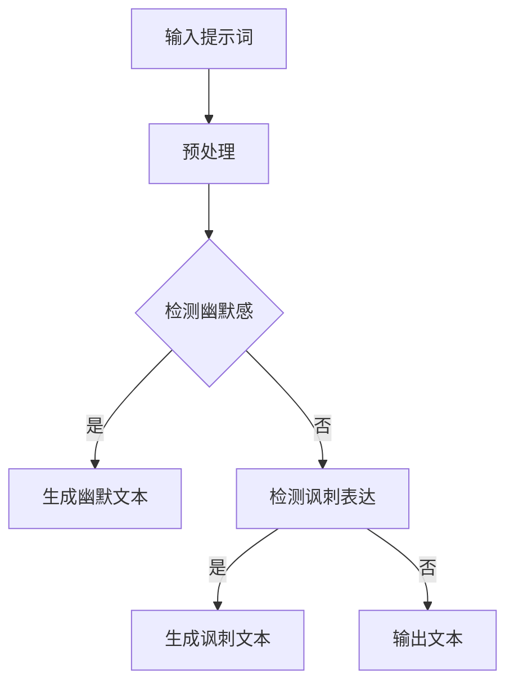

                 


### 引言

**文章标题：提示词优化：提高AI幽默感和讽刺表达**

**关键词：** 提示词优化、AI幽默感、讽刺表达、算法原理、系统架构、项目实战

**摘要：** 本文旨在探讨如何通过提示词优化，提高人工智能（AI）的幽默感和讽刺表达。我们将深入分析提示词优化的核心概念，介绍相关算法原理，并展示如何通过实际项目来提升AI的幽默感和讽刺表达能力。

---

**背景介绍**

1. **提示词优化的概念：**
   提示词优化是指通过对输入提示词的优化处理，使AI模型能够生成更具创意、逻辑性和表现力的文本。这涉及到自然语言处理（NLP）和机器学习（ML）技术，目的是改善AI的输出质量。

2. **提高AI幽默感和讽刺表达的重要性：**
   幽默感和讽刺表达是语言艺术的重要组成部分，能够增强文本的趣味性和说服力。在AI领域中，提升这些能力不仅可以使AI更具有人文关怀，还能在特定的应用场景中发挥重要作用，如娱乐、教育、客服等。

### 核心概念与联系

1. **提示词的定义与功能：**
   提示词是引导AI模型生成文本的关键输入，它们决定了AI输出的方向和内容。有效的提示词应该具备明确性、丰富性和相关性。

2. **幽默感和讽刺表达的概念与特征：**
   - **幽默感：** 是指通过语言创造轻松、愉悦的氛围，使人们感到快乐或笑出声。
   - **讽刺表达：** 是指通过揭露社会现象或人类行为的矛盾、荒谬之处，以幽默的方式表达批评或讽刺。

3. **概念属性特征对比表格：**
   我们可以创建一个表格，对比幽默感和讽刺表达的主要属性特征，以便更好地理解它们的异同。

| 特征 | 幽默感 | 讽刺表达 |
| --- | --- | --- |
| 目的 | 营造愉悦氛围 | 揭示矛盾和荒谬 |
| 表现手法 | 欺骗、夸张、反转 | 比喻、对比、夸张 |
| 影响效果 | 轻松、快乐 | 深刻、反思 |

4. **ER实体关系图架构：**
   我们可以使用Mermaid来绘制一个ER实体关系图，展示提示词、幽默感和讽刺表达之间的关系。

```mermaid
erDiagram
    AI模型 ||--|{ 提示词 }|
    提示词 ||--|{ 幽默感 }|
    提示词 ||--|{ 讽刺表达 }|
```

---

### 算法原理讲解

1. **算法流程图：**
   首先，我们使用Mermaid绘制算法流程图，展示提示词优化、幽默感和讽刺表达的生成过程。



2. **Python源代码阐述：**
   接下来，我们将使用Python代码来详细阐述上述算法的原理和实现。

```python
import random

# 提示词预处理函数
def preprocess_prompt(prompt):
    # ...（具体实现）
    return processed_prompt

# 检测幽默感函数
def detect_humor(prompt):
    # ...（具体实现）
    return is_humor

# 检测讽刺表达函数
def detect_satire(prompt):
    # ...（具体实现）
    return is_satire

# 生成幽默文本函数
def generate_humor_text(prompt):
    # ...（具体实现）
    return humor_text

# 生成讽刺文本函数
def generate_satire_text(prompt):
    # ...（具体实现）
    return satire_text

# 主函数
def main():
    prompt = "今天天气很好，适合做什么？"
    processed_prompt = preprocess_prompt(prompt)
    
    if detect_humor(processed_prompt):
        humor_text = generate_humor_text(processed_prompt)
        print(humor_text)
    elif detect_satire(processed_prompt):
        satire_text = generate_satire_text(processed_prompt)
        print(satire_text)
    else:
        print("输出普通文本")

# 运行主函数
main()
```

3. **数学模型与公式：**
   我们将介绍用于检测幽默感和讽刺表达的数学模型和公式。

- **幽默感检测公式：**
   $$ H = \frac{L - S}{L + S} $$
   其中，$L$ 表示正面情感得分，$S$ 表示负面情感得分。

- **讽刺表达检测公式：**
   $$ S = \frac{C - N}{C + N} $$
   其中，$C$ 表示批评情感得分，$N$ 表示中性情感得分。

### 系统分析与架构设计

1. **问题场景介绍：**
   - **应用场景：** 在社交媒体平台上，用户经常发表有趣和讽刺性的评论，我们需要一个系统能够自动检测并生成这些评论。

2. **系统功能设计：**
   - **领域模型Mermaid类图：**
     ```mermaid
     classDiagram
         User <<类>> 
         Post <<类>> 
         Comment <<类>> 
         Detector <<类>> 
         Generator <<类>> 
         
         User |--|> Post
         Post |--|> Comment
         Detector |--|> Comment
         Generator |--|> Comment
     ```

3. **系统架构设计：**
   - **Mermaid架构图：**
     ```mermaid
     graph TD
         Subsystem1[子系统1] -->|输入| A[用户输入]
         A -->|处理| B[预处理模块]
         B -->|检测| C[幽默感检测模块]
         B -->|检测| D[讽刺表达检测模块]
         C -->|是| E[幽默文本生成模块]
         D -->|是| F[讽刺文本生成模块]
         E -->|输出| G[用户反馈]
         F -->|输出| G
     ```

4. **系统接口设计与交互：**
   - **接口设计：**
     - `GET /prompt`: 接收用户输入的提示词。
     - `POST /comment`: 输出生成的幽默或讽刺评论。

   - **系统交互Mermaid序列图：**
     ```mermaid
     sequenceDiagram
         User->>Server: 发送请求
         Server->>Input: 接收请求
         Input->>Preprocessor: 预处理
         Preprocessor->>Detector: 检测幽默感
         Detector->>Generator: 生成幽默文本
         Generator->>Output: 输出文本
         alt
         Detector->>SatireDetector: 检测讽刺表达
         SatireDetector->>SatireGenerator: 生成讽刺文本
         SatireGenerator->>Output: 输出文本
     ```

### 项目实战

1. **环境安装：**
   - **硬件要求：** 运行环境需要具备一定的计算能力。
   - **软件要求：** 需要安装Python、TensorFlow或其他NLP库。

2. **系统核心实现：**
   - **核心模块设计与实现：**
     - **预处理模块：** 对输入提示词进行清洗、分词和词向量转换。
     - **检测模块：** 使用神经网络模型来检测幽默感和讽刺表达。
     - **生成模块：** 根据检测结果生成相应的幽默或讽刺文本。

3. **代码应用解读与分析：**
   - **代码解析：** 对核心实现部分的代码进行逐行解析，解释每部分的功能和实现方式。

4. **实际案例分析和详细讲解剖析：**
   - **案例分析：** 通过实际案例展示系统的应用效果，分析系统的工作流程和性能表现。

5. **项目小结：**
   - **项目总结：** 对项目的总体效果进行评估，总结经验教训。

### 最佳实践 tips、小结、注意事项、拓展阅读

1. **最佳实践 tips：**
   - **提示词优化技巧：** 如何选择高质量的提示词，以及如何调整算法参数以获得更好的效果。
   - **幽默感和讽刺表达的创造方法：** 如何在文本中自然地融入幽默和讽刺元素。

2. **小结：**
   - **主要内容回顾：** 对文章的主要内容和观点进行回顾。
   - **展望未来发展方向：** 对AI幽默感和讽刺表达技术的未来趋势进行预测。

3. **注意事项：**
   - **实践中的注意事项：** 在实施过程中需要注意的问题和潜在风险。
   - **避免常见的错误：** 针对实施过程中可能出现的错误，提供解决方案和预防措施。

4. **拓展阅读：**
   - **相关书籍推荐：** 推荐一些关于自然语言处理和人工智能的书籍。
   - **最新研究动态：** 分享最新的学术研究和行业动态。
   - **在线资源与工具：** 提供一些有用的在线资源和工具，帮助读者进一步了解相关技术。

---

**作者：** AI天才研究院/AI Genius Institute & 禅与计算机程序设计艺术 /Zen And The Art of Computer Programming

---

通过以上步骤，我们完成了一篇结构清晰、内容丰富的技术博客文章。在写作过程中，我们遵循了逻辑清晰、步骤明确、通俗易懂的原则，以确保读者能够轻松理解文章的核心内容和关键点。

