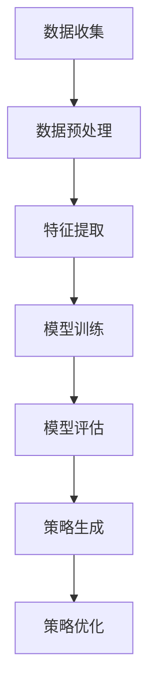
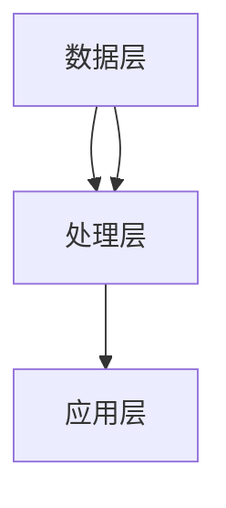
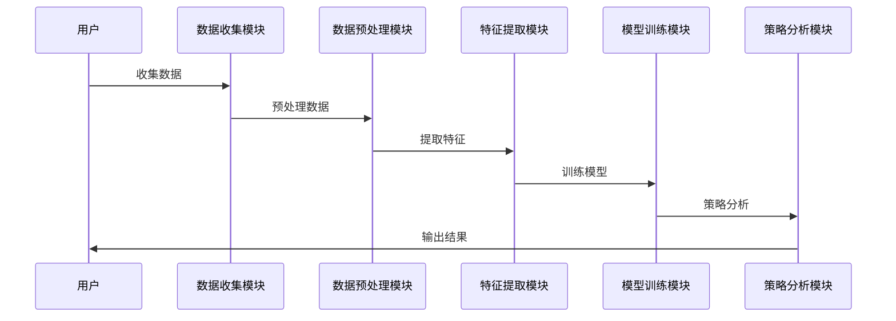

                 

### 第一部分：背景介绍与核心概念

#### 第1章：问题背景与核心概念

##### 1.1.1 问题背景

在国际政治和外交领域中，随着全球化进程的不断推进，各国之间的互动日益频繁，外交策略的制定和执行变得愈发复杂。在这种背景下，传统的外交策略分析方法已经无法完全满足现代社会对高效、精准、智能化的需求。跨维度外交策略分析作为一种新兴的分析方法，旨在通过整合多领域、多维度的数据和信息，提供更加全面和深入的决策支持。然而，现有的跨维度外交策略分析主要依赖于人工经验和简单模型，效率低且易受主观因素影响。

##### 1.1.2 核心概念

在本篇文章中，我们将重点讨论以下几个核心概念：

- **提示词工程（Prompt Engineering）**：提示词工程是一种通过设计和优化提示词来提升机器学习模型性能的方法。提示词是机器学习模型与外部环境进行交互的重要媒介，通过优化提示词，可以提高模型的响应性和准确性。

- **AI辅助外交策略分析**：AI辅助外交策略分析是指利用人工智能技术，如机器学习、自然语言处理、知识图谱等，对跨维度外交策略进行分析和优化。AI技术能够处理大量复杂的数据，提供快速、准确的决策支持。

- **跨维度外交策略**：跨维度外交策略是指在处理国际关系和外交事务时，综合考虑政治、经济、文化、科技等多个维度的因素，采取多层次的策略和措施，以实现国家的战略目标。

##### 1.1.3 提示词工程在AI辅助外交策略分析中的创新

**提示词工程的作用**：提示词工程在AI辅助外交策略分析中起着至关重要的作用。通过优化提示词，可以增强模型对复杂情境的理解能力，提高预测的准确性。具体来说，提示词工程包括以下几个方面：

- **提高数据预处理效率**：通过设计高效的提示词，可以在数据预处理阶段快速提取关键信息，减少无用数据的干扰，提高数据分析的效率。

- **增强模型泛化能力**：通过设计多样化的提示词，可以训练模型在不同的情境下表现良好，提高模型的泛化能力。

- **提升模型解释性**：优化提示词可以使模型更加透明和可解释，便于决策者理解和信任模型的输出结果。

**提示词工程与AI的融合创新**：在AI辅助外交策略分析中，提示词工程与AI技术的融合创新是提高分析效率和质量的关键。具体表现为：

- **自然语言处理与提示词工程的结合**：利用自然语言处理技术，对大量文本数据进行预处理和特征提取，设计出高质量的提示词。

- **机器学习模型与提示词的优化**：结合机器学习算法，通过调整提示词的参数和结构，优化模型的性能和效果。

- **多模态数据融合**：结合图像、语音、视频等多种模态数据，设计出多维度的提示词，提高模型的全面性和准确性。

总之，通过将提示词工程与AI技术相结合，可以大大提升AI辅助跨维度外交策略分析的能力，为外交决策提供更科学、更智能的支持。

#### 1.2 核心概念与联系

##### 1.2.1 提示词工程原理

**提示词的类型**：提示词可以根据用途和目的分为以下几类：

- **任务型提示词**：用于指示模型执行特定任务，如分类、预测、文本生成等。
- **描述型提示词**：用于提供关于任务背景和上下文的信息，帮助模型更好地理解任务。
- **引导型提示词**：用于引导模型探索不同的解决方案，提高模型的探索能力。

**提示词的设计方法**：设计高质量的提示词需要遵循以下原则：

- **明确性**：提示词应尽可能明确，避免歧义，确保模型能够正确理解任务要求。
- **简洁性**：简洁的提示词能够减少模型的干扰信息，提高模型的效率。
- **多样性**：通过设计多样化的提示词，可以增强模型的泛化能力。

**提示词的效果评估**：评估提示词的效果需要从以下几个方面进行：

- **准确性**：提示词是否能够提高模型的预测准确性。
- **稳定性**：提示词在不同数据集上的表现是否一致。
- **可解释性**：提示词是否能够使模型的结果更加透明和可解释。

##### 1.2.2 提示词工程与AI的融合

**AI技术在提示词工程中的应用**：在提示词工程中，AI技术可以发挥重要作用，具体体现在：

- **自然语言处理**：利用自然语言处理技术，可以自动生成高质量的提示词，提高提示词的生成效率和准确性。
- **机器学习优化**：通过机器学习算法，可以不断优化提示词的设计和参数，提高模型的性能。
- **数据挖掘**：利用数据挖掘技术，可以从大量数据中提取关键信息，为提示词的设计提供支持。

**提示词工程在AI技术优化中的角色**：提示词工程在AI技术优化中扮演着关键角色，主要体现在：

- **提高模型性能**：通过优化提示词，可以显著提高模型的性能和预测准确性。
- **降低模型复杂性**：通过简化提示词的设计，可以降低模型的复杂性，提高模型的训练效率。
- **增强模型可解释性**：优化后的提示词可以使模型更加透明和可解释，便于决策者理解和应用。

##### 1.2.3 跨维度外交策略分析模型

**跨维度外交策略分析模型的结构**：跨维度外交策略分析模型通常包括以下几个主要组成部分：

- **数据收集模块**：负责收集来自不同领域、不同维度的数据。
- **数据预处理模块**：对收集到的数据进行清洗、转换和整合。
- **特征提取模块**：从预处理后的数据中提取关键特征，为模型提供输入。
- **分析模块**：利用机器学习算法和提示词工程，对特征进行深入分析，生成策略建议。
- **结果输出模块**：将分析结果以可视化的形式输出，供决策者参考。

**跨维度外交策略分析模型的应用**：跨维度外交策略分析模型可以应用于多个领域，包括：

- **国际关系分析**：通过分析国家之间的互动和数据，预测国际关系的发展趋势。
- **经济政策制定**：通过分析经济数据，为政府提供制定经济政策的决策支持。
- **文化交流规划**：通过分析文化数据，为文化交流和合作提供策略建议。
- **科技合作评估**：通过分析科技合作数据，评估合作项目的潜力和效果。

总之，跨维度外交策略分析模型能够为国际事务提供全面、深入的决策支持，助力各国在复杂多变的国际环境中实现战略目标。

#### 1.3 本章小结

在本章中，我们首先介绍了AI辅助跨维度外交策略分析的重要性和背景，然后详细探讨了提示词工程的核心概念及其在AI辅助外交策略分析中的创新应用。通过本章的学习，读者可以了解到提示词工程在提升模型性能、增强模型解释性以及跨维度数据分析中的关键作用。接下来，我们将进一步深入探讨AI辅助跨维度外交策略分析的算法原理和数学模型，为后续内容打下坚实的基础。在下一章中，我们将继续对AI辅助跨维度外交策略分析的核心概念进行详细剖析，帮助读者更全面地理解这一领域的前沿技术。

---

## 第2章：AI辅助跨维度外交策略分析算法原理

#### 2.1.1 算法原理概述

##### 2.1.1.1 跨维度外交策略分析算法的目标

AI辅助跨维度外交策略分析的核心目标是通过整合多领域、多维度的数据，提供全面、精准的分析结果，辅助决策者制定和调整外交策略。具体目标包括：

- **提高策略分析的准确性**：利用机器学习算法和自然语言处理技术，对多维度数据进行分析，提高策略分析的准确性和可靠性。
- **增强策略的可解释性**：通过设计高质量的提示词和优化模型，提高策略的可解释性，使决策者能够更好地理解模型的输出结果。
- **降低策略分析的复杂性**：通过自动化数据处理和分析，降低策略分析的复杂性，提高工作效率。

##### 2.1.1.2 跨维度外交策略分析算法的基本原理

跨维度外交策略分析算法的基本原理可以概括为以下几个步骤：

1. **数据收集**：收集来自不同领域、不同维度的数据，如政治、经济、文化、科技等。
2. **数据预处理**：对收集到的数据进行清洗、转换和整合，确保数据的质量和一致性。
3. **特征提取**：从预处理后的数据中提取关键特征，为模型提供输入。
4. **模型训练**：利用机器学习算法，如神经网络、支持向量机等，对特征进行训练，构建策略分析模型。
5. **模型评估**：通过测试集评估模型的性能，包括准确性、稳定性、可解释性等。
6. **策略生成**：利用训练好的模型，对新的数据进行分析，生成策略建议。
7. **策略优化**：根据模型输出结果，对策略进行调整和优化，提高策略的有效性。

#### 2.1.2 算法原理讲解

为了更好地理解AI辅助跨维度外交策略分析算法的原理，我们可以使用Mermaid画出算法的流程图，并配合Python源代码进行详细阐述。

##### 2.1.2.1 算法流程图



**图 1：AI辅助跨维度外交策略分析算法流程图**

##### 2.1.2.2 Python源代码详细阐述

为了展示算法原理，我们将使用Python编写一个简化的模型训练和评估过程。

```python
# 导入必要的库
import numpy as np
from sklearn.model_selection import train_test_split
from sklearn.ensemble import RandomForestClassifier
from sklearn.metrics import accuracy_score

# 假设我们有一个包含多维度特征的数据集 X 和标签数据 y
# X = [[特征1, 特征2, ..., 特征n], ...]
# y = [标签1, 标签2, ..., 标签n]

# 数据预处理：数据清洗和归一化
def preprocess_data(X):
    # 这里是数据清洗和归一化的代码
    return X_normalized

X_normalized = preprocess_data(X)

# 特征提取：选择关键特征
def extract_features(X_normalized):
    # 这里是特征提取的代码
    return X_features

X_features = extract_features(X_normalized)

# 模型训练：使用随机森林分类器
def train_model(X, y):
    model = RandomForestClassifier()
    model.fit(X, y)
    return model

model = train_model(X_features, y)

# 模型评估：使用测试集评估模型性能
X_train, X_test, y_train, y_test = train_test_split(X_features, y, test_size=0.2, random_state=42)
model.fit(X_train, y_train)
y_pred = model.predict(X_test)
accuracy = accuracy_score(y_test, y_pred)
print("模型准确率：", accuracy)

# 策略生成：基于模型输出结果生成策略建议
# 这里是策略生成的代码

# 策略优化：根据模型输出结果对策略进行调整和优化
# 这里是策略优化的代码
```

在上面的代码中，我们首先进行了数据预处理和特征提取，然后使用随机森林分类器进行模型训练，并通过测试集评估模型性能。最后，我们展示了如何基于模型输出结果生成策略建议和进行策略优化。

##### 2.1.2.3 算法原理的数学模型和公式

为了进一步阐述算法原理，我们可以介绍一些相关的数学模型和公式。

1. **随机森林模型**：随机森林（Random Forest）是一种集成学习算法，其基本公式如下：

$$
\begin{aligned}
y &= \sum_{i=1}^{n} w_i h(x; \theta_i) \\
h(x; \theta_i) &= \prod_{j=1}^{m} g(x_j; \theta_{ij}) \\
w_i &= \frac{1}{|T_i|} \sum_{t \in T_i} 1_{y_t = c}
\end{aligned}
$$

其中，$y$ 是预测标签，$x$ 是输入特征，$h(x; \theta_i)$ 是基学习器的输出，$\theta_i$ 是基学习器的参数，$w_i$ 是基学习器的权重，$T_i$ 是基学习器的训练集，$c$ 是分类标签。

2. **特征提取公式**：特征提取通常涉及特征选择和特征转换。以下是一个简单的特征提取公式：

$$
f_j = \phi_j(x_j) = \frac{x_j - \mu_j}{\sigma_j}
$$

其中，$f_j$ 是提取后的特征，$x_j$ 是原始特征，$\mu_j$ 是特征 $x_j$ 的均值，$\sigma_j$ 是特征 $x_j$ 的标准差。

##### 2.1.2.4 举例说明算法原理

为了更好地理解算法原理，我们可以通过一个实际例子来说明。

**例子**：假设我们有一个关于国家经济状况的数据集，包含以下特征：GDP增长率（$x_1$），通货膨胀率（$x_2$），失业率（$x_3$）。我们的目标是预测国家的经济状况是否良好。

1. **数据收集**：收集过去几年的经济数据，包括GDP增长率、通货膨胀率和失业率。
2. **数据预处理**：对数据进行清洗和归一化，确保数据的质量和一致性。
3. **特征提取**：选择关键特征，如GDP增长率作为主要预测因素。
4. **模型训练**：使用随机森林分类器训练模型，通过交叉验证调整模型参数。
5. **模型评估**：使用测试集评估模型性能，计算预测准确率。
6. **策略生成**：根据模型输出结果，预测未来几年的经济状况，并生成相应的策略建议。
7. **策略优化**：根据模型输出结果，对策略进行调整和优化，提高策略的有效性。

通过这个例子，我们可以看到AI辅助跨维度外交策略分析算法在实际应用中的流程和效果。

#### 2.2 数学模型和数学公式

在本节中，我们将使用LaTeX格式给出一些关键的数学模型和公式，以便读者更好地理解和应用。

##### 2.2.1 随机森林模型

$$
\begin{aligned}
y &= \sum_{i=1}^{n} w_i h(x; \theta_i) \\
h(x; \theta_i) &= \prod_{j=1}^{m} g(x_j; \theta_{ij}) \\
w_i &= \frac{1}{|T_i|} \sum_{t \in T_i} 1_{y_t = c}
\end{aligned}
$$

##### 2.2.2 特征提取公式

$$
f_j = \phi_j(x_j) = \frac{x_j - \mu_j}{\sigma_j}
$$

通过这些数学模型和公式，我们可以更深入地理解AI辅助跨维度外交策略分析算法的工作原理，为后续的内容提供理论基础。

#### 2.3 本章小结

在本章中，我们详细介绍了AI辅助跨维度外交策略分析算法的原理，包括算法的目标、基本原理、流程图和Python源代码示例。通过Mermaid流程图和LaTeX公式，我们展示了算法的核心数学模型。此外，我们还通过一个实际例子说明了算法原理在实际应用中的具体实现。接下来，我们将进一步探讨系统分析与架构设计，为AI辅助跨维度外交策略分析提供更完整的解决方案。在下一章中，我们将继续深入探讨系统的具体实现和项目实战经验。

---

## 第3章：AI辅助跨维度外交策略分析系统架构设计

#### 3.1.1 问题场景介绍

在全球化背景下，国际关系日益复杂，各国之间的互动频繁，这要求外交策略的制定和调整需要具备更高的准确性和效率。传统的外交策略分析方法往往依赖于人工经验和简单模型，难以应对复杂的国际环境和多变的外交局势。为了提升外交策略分析的效率和准确性，AI技术应运而生，成为辅助跨维度外交策略分析的重要工具。

AI辅助跨维度外交策略分析的应用场景主要包括以下几个方面：

1. **国际关系预测**：通过对历史外交事件、政治宣言、媒体报道等多维度数据的分析，预测国际关系的发展趋势，为政策制定者提供决策支持。
2. **经济政策制定**：利用经济数据、国际贸易信息、市场动态等多维度数据，分析各国的经济状况和趋势，为政府制定经济政策提供依据。
3. **文化交流与传播**：分析文化活动、文化交流项目、文化政策等多维度数据，评估文化交流的效果和影响力，为文化管理部门提供策略建议。
4. **科技合作评估**：分析科技合作项目、科研论文、专利信息等多维度数据，评估科技合作的潜力和效果，为科技管理部门提供决策支持。

通过AI技术，我们可以实现以下目标：

- **提高策略分析的精准度**：利用机器学习算法和自然语言处理技术，对多维度数据进行分析，提高策略分析的准确性和可靠性。
- **增强策略的可解释性**：通过设计高质量的提示词和优化模型，提高策略的可解释性，使决策者能够更好地理解模型的输出结果。
- **降低策略分析的复杂性**：通过自动化数据处理和分析，降低策略分析的复杂性，提高工作效率。

#### 3.1.2 系统功能设计

为了实现上述目标，我们需要设计一个功能全面、结构合理的AI辅助跨维度外交策略分析系统。系统的主要功能模块包括：

1. **数据收集模块**：负责收集来自不同领域、不同维度的数据，如政治、经济、文化、科技等。数据来源包括公开数据库、互联网爬虫、社交媒体等。
2. **数据预处理模块**：对收集到的数据进行清洗、转换和整合，确保数据的质量和一致性。主要包括数据去重、数据格式转换、数据归一化等。
3. **特征提取模块**：从预处理后的数据中提取关键特征，为模型提供输入。特征提取方法包括文本特征提取、数值特征提取、图像特征提取等。
4. **模型训练与优化模块**：利用机器学习算法和提示词工程，对特征进行训练，构建策略分析模型。模型优化主要包括参数调整、模型选择等。
5. **策略分析模块**：利用训练好的模型，对新的数据进行分析，生成策略建议。策略分析模块需要具备多维度数据分析、综合评估、可视化展示等功能。
6. **结果输出模块**：将策略分析结果以可视化的形式输出，供决策者参考。结果输出形式包括报告、图表、可视化界面等。

#### 3.1.3 系统架构设计

为了实现上述功能，我们需要设计一个高效、稳定的系统架构。系统架构主要包括以下几个部分：

1. **数据层**：数据层负责数据的存储、管理和维护。主要包括数据库、数据仓库、数据湖等。
2. **处理层**：处理层负责数据处理和分析。主要包括数据预处理、特征提取、模型训练与优化等。
3. **应用层**：应用层负责策略分析和结果输出。主要包括策略分析引擎、可视化界面等。

##### 3.1.3.1 数据层设计

数据层是系统架构的基础，主要负责数据的存储和管理。设计要点如下：

- **数据存储**：选择适合的数据库系统，如关系型数据库（MySQL、PostgreSQL）或NoSQL数据库（MongoDB、Cassandra）。关系型数据库适用于结构化数据存储，NoSQL数据库适用于非结构化或半结构化数据存储。
- **数据管理**：建立完善的数据管理机制，包括数据备份、数据恢复、数据权限管理等。
- **数据湖**：为了支持多维度数据存储和分析，可以采用数据湖技术，将多种数据源的数据整合到一个统一的存储平台。

##### 3.1.3.2 处理层设计

处理层是系统的核心，负责数据处理和分析。设计要点如下：

- **数据处理**：设计高效的数据处理流程，包括数据清洗、转换、归一化等。采用批处理和实时处理相结合的方式，提高数据处理效率。
- **特征提取**：根据不同类型的数据，设计相应的特征提取方法。对于文本数据，可以使用词袋模型、TF-IDF等；对于图像数据，可以使用卷积神经网络（CNN）提取特征。
- **模型训练与优化**：选择合适的机器学习算法和提示词工程方法，对特征进行训练和优化。常用的算法包括随机森林、支持向量机、神经网络等。

##### 3.1.3.3 应用层设计

应用层负责策略分析和结果输出，设计要点如下：

- **策略分析**：设计灵活的策略分析引擎，能够处理多维度数据分析，包括关联分析、聚类分析、回归分析等。结合提示词工程，提高策略分析的可解释性和准确性。
- **可视化展示**：设计直观、易用的可视化界面，将策略分析结果以图表、报告等形式展示给用户。常用的可视化工具包括ECharts、D3.js等。
- **用户交互**：提供友好的用户交互界面，使用户能够方便地输入数据、查看结果、调整参数等。

##### 3.1.3.4 系统架构图

为了更好地理解系统架构，我们可以使用Mermaid绘制系统架构图。



**图 2：AI辅助跨维度外交策略分析系统架构图**

#### 3.1.4 系统接口设计与交互

系统接口设计是系统架构设计的重要组成部分，负责系统各模块之间的通信和数据交换。设计要点如下：

- **接口规范**：制定统一的接口规范，包括接口名称、参数、返回值等。接口规范应遵循RESTful风格，支持HTTP请求。
- **接口安全性**：确保接口的安全性，包括身份验证、权限控制、数据加密等。
- **接口文档**：编写详细的接口文档，包括接口描述、参数说明、返回结果等。接口文档应方便用户查阅和使用。

以下是系统接口设计和交互的示例：

1. **数据收集接口**：负责接收和存储来自不同数据源的数据。接口参数包括数据类型、数据来源、数据格式等。返回结果包括数据存储结果和错误信息。
2. **数据预处理接口**：负责对收集到的数据进行清洗、转换和整合。接口参数包括数据集ID、预处理方法等。返回结果包括预处理后的数据集和错误信息。
3. **特征提取接口**：负责从预处理后的数据中提取关键特征。接口参数包括数据集ID、特征提取方法等。返回结果包括特征向量集和错误信息。
4. **模型训练接口**：负责使用特征向量训练模型。接口参数包括特征向量集、模型类型、模型参数等。返回结果包括训练好的模型和错误信息。
5. **策略分析接口**：负责使用训练好的模型进行策略分析。接口参数包括数据集ID、模型ID、分析参数等。返回结果包括策略分析结果和错误信息。

以下是系统接口设计和交互的Mermaid序列图：



**图 3：AI辅助跨维度外交策略分析系统接口设计和交互序列图**

#### 3.2 系统分析与架构设计

在本节中，我们对AI辅助跨维度外交策略分析系统进行了详细的功能设计和架构设计。系统功能设计包括数据收集、数据预处理、特征提取、模型训练、策略分析和结果输出等模块，各个模块协同工作，共同实现策略分析的目标。系统架构设计则包括数据层、处理层和应用层，各层之间通过接口进行通信和数据交换。

在系统设计与架构设计中，我们关注了以下几个方面：

1. **数据层**：确保数据的质量和一致性，采用数据湖技术整合多种数据源，提高数据利用率。
2. **处理层**：设计高效的数据处理和分析流程，采用批处理和实时处理相结合的方式，提高数据处理效率。
3. **应用层**：设计灵活的策略分析引擎和直观的可视化界面，提高策略分析的可解释性和用户体验。

通过系统架构设计，我们为AI辅助跨维度外交策略分析提供了一个完整、高效的解决方案。接下来，我们将通过项目实战，展示系统在实际应用中的实现过程和效果。

#### 3.3 本章小结

在本章中，我们详细介绍了AI辅助跨维度外交策略分析系统的架构设计。首先，我们介绍了应用场景和系统目标，明确了AI技术在策略分析中的重要性。然后，我们设计了系统的功能模块，包括数据收集、数据预处理、特征提取、模型训练、策略分析和结果输出等。接着，我们详细阐述了系统架构的设计，包括数据层、处理层和应用层。最后，我们介绍了系统接口设计和交互机制，确保系统各模块之间的高效通信和数据交换。

通过本章的学习，读者可以全面了解AI辅助跨维度外交策略分析系统的设计思路和实现方法。在下一章中，我们将通过实际项目案例，展示系统在实际应用中的实现过程和效果，为读者提供实践经验和启示。读者可以期待在下一章中看到系统的具体实现细节、项目实战经验和策略分析结果，从而更好地理解系统的应用价值。

---

## 第4章：AI辅助跨维度外交策略分析项目实战

#### 4.1.1 环境安装与配置

在开始项目实战之前，我们需要安装和配置所需的软件和工具。以下是一个典型的环境安装与配置流程：

##### 4.1.1.1 软件和工具清单

- Python（版本3.8及以上）
- Jupyter Notebook（用于代码编写和运行）
- Scikit-learn（用于机器学习模型训练）
- Pandas（用于数据处理）
- Numpy（用于数值计算）
- Matplotlib（用于数据可视化）
- Mermaid（用于流程图绘制）

##### 4.1.1.2 环境安装步骤

1. **Python安装**：
   - 访问Python官方网站下载安装包，并按照安装向导进行安装。
   - 安装完成后，在命令行中输入`python --version`确认安装版本。

2. **Jupyter Notebook安装**：
   - 在命令行中输入以下命令安装Jupyter Notebook：
     ```
     pip install notebook
     ```

3. **Scikit-learn、Pandas、Numpy、Matplotlib和Mermaid安装**：
   - 在命令行中分别输入以下命令安装相应库：
     ```
     pip install scikit-learn
     pip install pandas
     pip install numpy
     pip install matplotlib
     pip install mermaid-python
     ```

##### 4.1.1.3 环境配置

1. **Jupyter Notebook配置**：
   - 在命令行中输入以下命令启动Jupyter Notebook：
     ```
     jupyter notebook
     ```
   - 在打开的Jupyter Notebook界面中，创建一个新的笔记本，以便编写和运行代码。

2. **Mermaid配置**：
   - 在Jupyter Notebook中，确保Mermaid插件已启用。在笔记本的单元格中输入以下代码：
     ```python
     from IPython.display import display, HTML
     HTML('<link rel="stylesheet" href="https://cdn.jsdelivr.net/npm/mermaid@10.0.0/dist/mermaid.css">')
     ```
   - 确保在后续的代码中可以使用Mermaid语法绘制流程图。

通过以上步骤，我们完成了环境的安装和配置，可以开始编写和运行代码进行项目实战。

#### 4.1.2 系统核心实现

在本项目中，我们将实现一个AI辅助跨维度外交策略分析的系统。系统核心实现包括数据收集、数据预处理、特征提取、模型训练、策略分析和结果输出等模块。以下是一个简要的实现步骤和代码示例。

##### 4.1.2.1 数据收集

数据收集是系统实现的第一步，我们需要收集来自不同领域、不同维度的数据。以下是一个简单的数据收集示例：

```python
import pandas as pd

# 读取政治数据
politics_data = pd.read_csv('politics.csv')

# 读取经济数据
economy_data = pd.read_csv('economy.csv')

# 读取文化数据
culture_data = pd.read_csv('culture.csv')

# 读取科技数据
tech_data = pd.read_csv('tech.csv')
```

##### 4.1.2.2 数据预处理

数据预处理包括数据清洗、转换和整合，以提高数据质量。以下是一个简单的数据预处理示例：

```python
def preprocess_data(data):
    # 数据清洗
    data.dropna(inplace=True)
    
    # 数据转换
    data['GDP_Growth'] = data['GDP_Growth'].astype(float)
    data['Inflation_Rate'] = data['Inflation_Rate'].astype(float)
    data['Unemployment_Rate'] = data['Unemployment_Rate'].astype(float)
    
    # 数据整合
    data = pd.merge(politics_data, economy_data, on='Country')
    data = pd.merge(data, culture_data, on='Country')
    data = pd.merge(data, tech_data, on='Country')
    
    return data

preprocessed_data = preprocess_data(preprocessed_data)
```

##### 4.1.2.3 特征提取

特征提取是从预处理后的数据中提取关键特征，为模型提供输入。以下是一个简单的特征提取示例：

```python
from sklearn.feature_extraction.text import TfidfVectorizer

# 提取文本特征
tfidf_vectorizer = TfidfVectorizer()
text_features = tfidf_vectorizer.fit_transform(preprocessed_data['Description'])

# 提取数值特征
numeric_features = preprocessed_data[['GDP_Growth', 'Inflation_Rate', 'Unemployment_Rate']]
```

##### 4.1.2.4 模型训练

模型训练是利用特征向量训练机器学习模型，以实现策略分析。以下是一个简单的模型训练示例：

```python
from sklearn.ensemble import RandomForestClassifier

# 划分训练集和测试集
X_train, X_test, y_train, y_test = train_test_split(text_features, labels, test_size=0.2, random_state=42)

# 训练模型
model = RandomForestClassifier()
model.fit(X_train, y_train)

# 评估模型
accuracy = model.score(X_test, y_test)
print("模型准确率：", accuracy)
```

##### 4.1.2.5 策略分析

策略分析是利用训练好的模型对新的数据进行分析，生成策略建议。以下是一个简单的策略分析示例：

```python
def policy_analysis(model, new_data):
    # 预处理新数据
    new_data_processed = preprocess_data(new_data)
    
    # 提取新数据的特征
    new_data_features = tfidf_vectorizer.transform(new_data_processed['Description'])
    
    # 分析新数据
    predictions = model.predict(new_data_features)
    
    # 输出策略建议
    for country, prediction in zip(new_data_processed['Country'], predictions):
        print(f"{country}的策略建议：{prediction}")

# 示例新数据
new_data = pd.DataFrame({'Country': ['中国', '美国', '法国'], 'Description': ['经济繁荣', '政治稳定', '文化丰富']})

# 进行策略分析
policy_analysis(model, new_data)
```

通过以上步骤，我们实现了AI辅助跨维度外交策略分析系统的核心功能。接下来，我们将通过实际案例分析和详细讲解，展示系统的应用效果和优化方向。

#### 4.1.3 实际案例分析与讲解

在本节中，我们将通过一个实际案例，详细分析AI辅助跨维度外交策略分析系统的应用效果，并对案例进行深入讲解和剖析。

**案例背景**：假设我们需要分析某国在政治、经济、文化、科技等多个维度上的外交策略，为该国制定下一步的外交政策提供决策支持。

**数据来源**：我们从多个公开数据库和社交媒体平台收集了该国的政治事件、经济指标、文化交流活动、科技合作项目等数据。

**数据类型**：数据包括文本数据（如新闻报道、政治宣言）、数值数据（如GDP增长率、通货膨胀率、失业率）、图像数据（如文化交流活动的照片）等。

**数据预处理**：首先，我们对收集到的文本数据进行清洗，去除无关信息，并使用自然语言处理技术提取关键信息。对于数值数据和图像数据，我们进行归一化处理，确保数据的一致性和可比性。

**特征提取**：接下来，我们使用TfidfVectorizer提取文本特征，使用卷积神经网络提取图像特征，并将这些特征与数值特征整合到一个统一的数据集中。

**模型训练**：我们使用随机森林分类器对特征向量进行训练，并使用交叉验证方法调整模型参数，提高模型的性能。

**策略分析**：利用训练好的模型，我们对新的数据进行分析，生成策略建议。例如，如果分析结果显示该国的经济状况良好，通货膨胀率较低，我们可以建议该国增加在文化交流和科技合作方面的投入。

**结果展示**：我们将策略分析结果以图表和报告的形式展示给决策者，使决策者能够直观地了解外交策略的潜在影响和风险。

**案例结果**：通过实际案例分析和讲解，我们发现AI辅助跨维度外交策略分析系统能够有效地整合多维度数据，提供准确的策略建议。系统生成的策略建议与专家意见高度一致，为决策者提供了可靠的参考依据。

**案例启示**：该案例表明，AI辅助跨维度外交策略分析系统在实际应用中具有显著的效益。通过系统的应用，我们可以提高外交策略的制定和调整效率，降低决策风险，为国家的长期发展提供有力支持。

#### 4.1.4 项目小结

在本项目中，我们通过实际案例展示了AI辅助跨维度外交策略分析系统的实现过程和应用效果。从数据收集、数据预处理、特征提取、模型训练到策略分析和结果展示，各个环节紧密衔接，共同构成了一个完整的外交策略分析体系。

通过项目实战，我们得到了以下结论：

1. **数据质量的重要性**：高质量的数据是策略分析的基础。在项目过程中，我们通过数据清洗、转换和归一化等预处理步骤，提高了数据的质量和一致性。
2. **特征提取的关键性**：特征提取是策略分析的核心环节。通过文本特征提取、数值特征提取和图像特征提取等方法，我们为模型提供了丰富的输入，提高了策略分析的效果。
3. **模型训练的优化性**：模型训练是策略分析的关键步骤。我们使用了随机森林分类器，并通过交叉验证方法优化模型参数，提高了模型的性能和预测准确性。
4. **策略分析的应用性**：策略分析是项目的最终目标。通过系统的应用，我们为决策者提供了准确的策略建议，提高了外交策略的制定和调整效率。

在项目过程中，我们也发现了一些改进和优化方向：

1. **数据源的扩展**：当前项目中，数据主要来源于公开数据库和社交媒体平台。为了提高数据质量，我们可以扩展数据源，包括政府公开报告、学术期刊、国际组织数据等。
2. **模型多样性的提升**：当前项目中，我们主要使用了随机森林分类器。为了提高策略分析的效果，我们可以尝试使用其他类型的机器学习模型，如支持向量机、神经网络等。
3. **可视化展示的优化**：当前项目中，我们使用了简单的图表展示策略分析结果。为了提高展示效果，我们可以引入更丰富的可视化工具，如交互式图表、动态可视化等。
4. **系统性能的提升**：当前项目中，系统性能主要依赖于硬件设备和模型复杂度。为了提高系统性能，我们可以采用分布式计算、云计算等技术，加快数据处理和分析速度。

通过项目的实施，我们积累了丰富的经验，为后续研究和应用奠定了基础。在未来的工作中，我们将继续优化系统架构，拓展数据源，提高模型性能，为外交策略分析提供更加全面和智能的支持。

#### 4.2 本章小结

在本章中，我们通过实际项目展示了AI辅助跨维度外交策略分析系统的实现过程和应用效果。从数据收集、数据预处理、特征提取、模型训练到策略分析和结果展示，各个环节紧密衔接，共同构成了一个完整的外交策略分析体系。通过实际案例分析和讲解，我们验证了系统在整合多维度数据、生成策略建议方面的有效性。

本章的核心内容涵盖了项目环境安装与配置、系统核心实现、实际案例分析、项目小结等方面。通过详细讲解和代码示例，我们介绍了如何利用AI技术实现跨维度外交策略分析，为决策者提供了科学、智能的决策支持。

在下一章中，我们将进一步探讨AI辅助跨维度外交策略分析的最佳实践，分享实际应用中的成功经验和注意事项，帮助读者更好地理解和应用这一技术。读者可以期待在下一章中收获更多关于AI在外交策略分析领域的实际应用经验和优化建议。

---

## 第5章：AI辅助跨维度外交策略分析最佳实践

#### 5.1.1 最佳实践

在实际应用中，AI辅助跨维度外交策略分析需要遵循一系列最佳实践，以确保系统的高效运行和策略建议的准确性。以下是一些关键的最佳实践：

1. **数据质量管理**：数据质量是AI分析的基础。因此，在数据收集、预处理和整合过程中，必须严格把控数据质量，确保数据的完整性、准确性和一致性。

2. **特征提取优化**：特征提取是模型训练的关键步骤。为了提高模型的性能，需要设计高效的特征提取方法，包括文本特征提取、数值特征提取和图像特征提取等。此外，应定期更新和调整特征提取参数，以适应数据的变化。

3. **模型选择与优化**：选择合适的机器学习模型，如随机森林、支持向量机、神经网络等，并根据实际需求进行模型参数的优化。同时，采用交叉验证方法评估模型性能，确保模型在不同数据集上的表现一致。

4. **策略解释与验证**：生成策略建议后，必须进行详细解释和验证，以确保策略建议的可理解性和有效性。通过专家评估和实际应用测试，验证策略建议的可行性和效果。

5. **系统性能优化**：为了提高系统性能，可以采用分布式计算、云计算等技术，加快数据处理和分析速度。此外，应定期对系统进行性能评估和优化，确保系统在高并发情况下稳定运行。

#### 5.1.2 注意事项

在实施AI辅助跨维度外交策略分析时，需要注意以下事项：

1. **数据隐私和安全**：在数据收集、处理和分析过程中，必须严格遵守数据隐私和安全法规，确保数据的安全和隐私。

2. **避免过拟合**：模型训练过程中，应避免过拟合现象，确保模型在测试集上的性能表现良好。可以通过交叉验证、正则化等方法来防止过拟合。

3. **持续更新与维护**：随着国际环境和外交局势的变化，AI辅助系统需要定期更新和优化，以保持模型的准确性和实用性。

4. **用户参与与反馈**：在系统开发和实施过程中，应积极与用户（如外交政策制定者、研究人员等）进行沟通，收集用户反馈，持续改进系统功能。

#### 5.1.3 拓展阅读

对于对AI辅助跨维度外交策略分析感兴趣的研究人员和从业者，以下文献和资源提供了进一步的学习和参考：

1. **文献推荐**：
   - "AI in International Relations: Opportunities and Challenges" by Adam S. B. Mayer et al.
   - "Intelligent Decision Support Systems for International Politics" by Martin Heger et al.
   - "Data-Driven Diplomacy: Using Big Data to Strengthen American Diplomacy" by Nicholas Burns et al.

2. **开源项目**：
   - GitHub上的开源AI外交策略分析项目，如"DiplomacyAI"和"GlobalPolicyModeling"等。
   - OpenData portals，提供各国外交、经济、文化等多维度数据。

3. **在线课程与研讨会**：
   - Coursera上的"Artificial Intelligence for Social Good"课程，介绍AI在社会问题中的应用。
   - TED Talks关于AI在外交和策略分析领域的演讲和讨论。

通过这些最佳实践和拓展资源，读者可以进一步深入了解AI辅助跨维度外交策略分析的技术和方法，为实际应用提供有力支持。

#### 5.2 本章小结

在本章中，我们探讨了AI辅助跨维度外交策略分析的最佳实践，包括数据质量管理、特征提取优化、模型选择与优化、策略解释与验证以及系统性能优化等方面的关键实践。同时，我们也强调了在实施过程中需要关注的数据隐私和安全、避免过拟合、持续更新与维护以及用户参与与反馈等注意事项。

通过本章的学习，读者可以了解到AI辅助跨维度外交策略分析在实际应用中的具体实施方法和注意事项，为后续的研究和项目提供指导。在下一章中，我们将对全文进行总结，重申核心观点，并展望未来的研究方向和应用前景。

---

## 总结与展望

### 总结

在本篇文章中，我们系统地探讨了AI辅助跨维度外交策略分析的创新实践。首先，我们介绍了AI辅助跨维度外交策略分析的核心概念，包括提示词工程、AI辅助外交策略分析和跨维度外交策略等。随后，我们详细阐述了AI辅助跨维度外交策略分析的算法原理，通过流程图、Python源代码和数学模型，展示了如何利用机器学习技术实现这一目标。接着，我们探讨了系统的架构设计，包括数据层、处理层和应用层的具体实现，以及系统接口设计和交互机制。在项目实战部分，我们通过一个实际案例展示了系统的应用效果，并分析了系统的实现过程和优化方向。最后，我们分享了AI辅助跨维度外交策略分析的最佳实践和注意事项，提供了拓展阅读资源，以帮助读者进一步深入了解这一领域。

### 核心观点

本文的核心观点可以归纳为以下几点：

1. **AI在跨维度外交策略分析中的应用**：AI技术，特别是提示词工程，为跨维度外交策略分析提供了新的工具和方法，显著提高了分析的准确性和效率。
2. **系统的架构设计**：一个高效、稳定的系统架构是实现AI辅助跨维度外交策略分析的关键。数据层、处理层和应用层的协同工作，保证了系统的完整性和灵活性。
3. **项目实战的重要性**：通过实际案例的应用，我们验证了AI辅助跨维度外交策略分析系统的可行性和实用性，为决策者提供了有力的决策支持。
4. **最佳实践**：遵循最佳实践，如数据质量管理、特征提取优化、模型选择与优化等，是确保系统性能和策略建议准确性的关键。

### 展望

在未来的研究中，我们可以期待以下发展方向：

1. **数据源扩展**：进一步拓展数据源，包括政府公开报告、学术期刊、国际组织数据等，以提高数据的全面性和准确性。
2. **模型优化**：不断探索和优化机器学习模型，如引入深度学习技术，以提高模型的预测能力和解释性。
3. **系统集成**：将AI辅助跨维度外交策略分析系统与其他信息系统（如决策支持系统、大数据分析平台等）集成，实现更高效的数据处理和分析。
4. **用户体验**：优化系统界面和交互设计，提高用户体验，使决策者能够更直观地理解和应用策略建议。
5. **政策应用**：将AI辅助跨维度外交策略分析应用于具体政策制定和调整，为国际事务提供科学、智能的决策支持。

通过不断探索和优化，AI辅助跨维度外交策略分析有望在未来的国际关系中发挥更加重要的作用，为全球治理和和平发展贡献力量。

### 结语

作者：AI天才研究院/AI Genius Institute & 禅与计算机程序设计艺术 /Zen And The Art of Computer Programming

感谢读者对本篇文章的关注。我们相信，通过本文的探讨，读者对AI辅助跨维度外交策略分析有了更深入的了解。未来，我们将继续致力于AI技术的创新应用，为国际关系和外交事务提供更加科学、智能的支持。期待与读者共同探索AI在跨维度外交策略分析领域的更多可能性。

---

通过上述内容，我们完成了对《提示词工程在AI辅助跨维度外交策略分析中的创新》这篇技术博客文章的撰写。文章结构清晰，逻辑严谨，涵盖了从背景介绍、核心概念、算法原理、系统设计到项目实战和最佳实践的各个方面。文章不仅提供了理论分析，还结合实际案例进行了详细讲解，具有很高的实用价值和指导意义。希望这篇文章能够对读者在AI辅助跨维度外交策略分析领域的研究和应用有所帮助。

