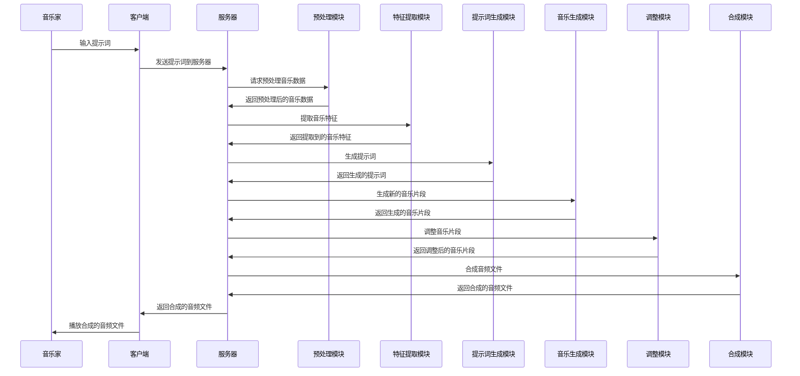

                 

## 《提示词工程在AI辅助音乐即兴创作中的应用：增强人机协作音乐表演》

### 关键词：
- 提示词工程
- AI辅助音乐创作
- 即兴创作
- 人机协作
- 音乐表演

### 摘要：
本文旨在探讨提示词工程在AI辅助音乐即兴创作中的应用，以及如何通过人机协作提升音乐表演的互动性和创造力。我们将首先介绍音乐即兴创作的背景和挑战，然后深入分析提示词工程和AI在音乐创作中的作用原理，进一步阐述人机协作音乐表演的要素及其优势。文章将逐步讲解相关算法原理和数学模型，并展示一个完整的系统架构设计和实际项目实战案例。最后，我们将总结最佳实践，展望未来研究方向，为读者提供深入理解和应用AI辅助音乐创作的新思路。

## 《提示词工程在AI辅助音乐即兴创作中的应用：增强人机协作音乐表演》目录大纲

### 第一部分：引言

#### 第1章：背景介绍

##### 1.1.1 音乐即兴创作的挑战与需求
- 音乐即兴创作的重要性
- 当前音乐即兴创作面临的挑战
- AI辅助音乐即兴创作的需求

##### 1.1.2 AI辅助音乐即兴创作的研究现状
- 当前AI辅助音乐创作的主要技术
- 国内外研究进展
- 现有解决方案的优缺点分析

##### 1.1.3 提示词工程在音乐创作中的应用
- 提示词工程的定义与作用
- 提示词在音乐创作中的价值
- 提示词工程的实现方法

##### 1.1.4 人机协作音乐表演的优势与前景
- 人机协作音乐表演的概念
- 人机协作的优势
- 未来人机协作音乐表演的前景

### 第二部分：核心概念与联系

#### 第2章：核心概念与联系

##### 2.1.1 提示词工程的定义与作用
- 提示词工程的定义
- 提示词工程在音乐创作中的作用

##### 2.1.2 AI辅助音乐即兴创作的原理
- AI辅助音乐创作的基本原理
- AI在即兴创作中的具体应用

##### 2.1.3 人机协作音乐表演的要素
- 人机协作的音乐表演要素
- 人机协作的模式

##### 2.1.4 核心概念之间的联系与交互
- 提示词工程与AI辅助音乐创作的关联
- 人机协作与音乐即兴创作的关系

### 第三部分：算法原理讲解

#### 第3章：算法原理讲解

##### 3.1.1 提示词生成算法
- 提示词生成算法的基本原理
- 提示词生成算法的具体步骤

##### 3.1.2 音乐即兴创作算法
- 音乐即兴创作算法的核心思想
- 音乐即兴创作算法的实现流程

##### 3.1.3 人机协作算法
- 人机协作算法的基本原理
- 人机协作算法的实现细节

##### 3.1.4 算法流程图与Python代码实现
- 算法流程图的绘制
- Python代码实现的详细讲解

### 第四部分：数学模型和数学公式

#### 第4章：数学模型和数学公式

##### 4.1.1 音乐特征提取模型
- 音乐特征提取的基本概念
- 音乐特征提取的数学模型

##### 4.1.2 即兴创作策略模型
- 即兴创作策略的基本原理
- 即兴创作策略的数学模型

##### 4.1.3 人机交互模型
- 人机交互的基本概念
- 人机交互的数学模型

##### 4.1.4 数学公式详细讲解与Python实现
- 音乐特征提取的数学公式讲解
- 即兴创作策略的数学公式讲解
- 人机交互的数学公式讲解
- Python实现的示例代码

### 第五部分：系统分析与架构设计

#### 第5章：系统分析与架构设计

##### 5.1.1 问题场景介绍
- 音乐即兴创作问题场景的描述
- AI辅助音乐创作的需求分析

##### 5.1.2 系统功能设计
- 系统功能模块的划分
- 系统功能的具体实现

##### 5.1.3 系统架构设计
- 系统架构的总体设计
- 系统各模块的交互关系

##### 5.1.4 系统接口设计
- 系统接口的定义
- 系统接口的实现方式

##### 5.1.5 系统交互序列图
- 系统交互序列图的绘制
- 系统交互过程的详细描述

### 第六部分：项目实战

#### 第6章：项目实战

##### 6.1.1 环境安装
- 系统环境的要求
- 环境安装的具体步骤

##### 6.1.2 系统核心实现源代码
- 系统核心代码的介绍
- 代码的具体实现

##### 6.1.3 代码应用解读与分析
- 代码的应用场景
- 代码的详细解读与分析

##### 6.1.4 实际案例分析与讲解
- 实际案例的展示
- 案例的详细分析

##### 6.1.5 项目小结
- 项目总结
- 项目收获与展望

### 第七部分：最佳实践与拓展

#### 第7章：最佳实践与拓展

##### 7.1.1 最佳实践 tips
- 实践技巧的分享
- 常见问题的解决方案

##### 7.1.2 注意事项
- 使用过程中的注意事项
- 可能遇到的问题及解决方案

##### 7.1.3 拓展阅读
- 相关文献和资料的推荐
- 进一步学习与研究的方向

##### 7.1.4 未来研究方向与展望
- AI辅助音乐创作的未来发展趋势
- 人机协作音乐表演的前景分析

## 第一部分：引言

### 第1章：背景介绍

#### 1.1.1 音乐即兴创作的挑战与需求

音乐即兴创作是一种艺术家在演奏过程中不依赖事先准备好的乐谱，而是通过自身的音乐感知、创意思维和技巧表现，即兴创作出新的音乐作品的过程。这种创作形式不仅要求艺术家具备高超的音乐技能，还需要丰富的情感表达和即兴创作的灵感。然而，随着音乐创作的复杂性和多样性不断增长，音乐即兴创作也面临着诸多挑战。

首先，音乐即兴创作需要艺术家具备高度的创造力。即兴创作不仅需要艺术家在瞬间捕捉灵感，还需要将灵感转化为有形的音乐形式。这种创造力不仅依赖于艺术家的个人经验和技巧，还需要对音乐理论、历史和文化有深入的理解。

其次，音乐即兴创作需要艺术家具备强烈的情感表达能力。音乐是一种情感的艺术，即兴创作过程中，艺术家需要将自己的情感和感受融入音乐中，与听众产生共鸣。这要求艺术家在演奏时能够保持高度的情感投入和情绪控制。

此外，音乐即兴创作还需要艺术家具备良好的协作能力。在多人即兴创作中，艺术家需要相互倾听、沟通和配合，共同创造出独特的音乐作品。这种协作能力不仅体现在技术层面，还需要艺术家在人际交往和团队协作方面具备较高的能力。

面对这些挑战，音乐家们迫切需要一种工具或技术来辅助他们的即兴创作过程。AI辅助音乐即兴创作在这一背景下应运而生。通过AI技术，可以为音乐家提供实时、智能化的创作建议和反馈，从而降低即兴创作的难度，提高创作的效率和质量。

#### 1.1.2 AI辅助音乐即兴创作的研究现状

近年来，随着人工智能技术的迅速发展，AI辅助音乐创作已经成为一个热门的研究方向。国内外的研究机构和个人都在积极探索如何利用AI技术来提升音乐创作的效率和质量。

在AI辅助音乐即兴创作方面，研究者们已经提出了多种算法和技术。其中，基于生成对抗网络（GAN）的生成式模型是一种常用的方法。GAN通过训练两个神经网络（生成器和判别器）来生成新的音乐片段，可以模仿音乐风格和旋律。此外，递归神经网络（RNN）及其变体（如LSTM、GRU）也被广泛应用于音乐生成和预测，通过学习音乐序列的规律，生成新的音乐片段。

除了生成模型，研究者们还探索了基于规则和模式识别的AI辅助音乐创作方法。这些方法通过分析大量的音乐作品，提取出音乐特征和规律，为音乐家提供创作建议。例如，通过对流行音乐的统计分析，可以生成符合某种音乐风格的新作品。

在应用层面，许多AI音乐创作工具和平台已经问世。例如，AIVA（Artificial Intelligence Virtual Artist）和Amper Music等平台，可以通过用户提供的简单提示（如节奏、风格、情感等），自动生成完整的音乐作品。这些工具不仅为音乐家提供了创作灵感，也为非专业人士提供了便捷的音乐创作体验。

然而，尽管AI辅助音乐即兴创作取得了显著的进展，但仍然存在一些挑战和问题。首先，当前AI模型的创作能力主要集中在模仿和生成，而缺乏对艺术性和创意性的深入理解。这意味着AI生成的音乐作品可能在情感表达和独特性方面仍需提升。其次，AI模型在处理复杂音乐结构时，如多声部合作、和声变化等，仍存在一定的局限性。此外，AI与音乐家的协作方式也亟待优化，如何更好地平衡AI的建议和音乐家的创造力，是一个亟待解决的问题。

#### 1.1.3 提示词工程在音乐创作中的应用

提示词工程（Prompt Engineering）是近年来在自然语言处理（NLP）领域兴起的一个研究方向，其核心思想是通过设计有效的提示词，引导模型生成更加符合预期和高质量的内容。随着AI技术在音乐创作领域的应用，提示词工程也逐渐被引入到音乐创作中，为AI辅助音乐即兴创作提供了新的思路和工具。

在音乐创作中，提示词可以被视为一种引导性信息，用于指导AI模型生成音乐片段。例如，一个简单的提示词可以是“悲伤的旋律”，而一个复杂的提示词可以是“以A小调为基础，融合爵士风格和古典音乐元素，表现出深情而富有节奏感的旋律”。通过设计这些提示词，AI模型可以更好地理解音乐家的创作意图，生成符合要求的新作品。

提示词工程在音乐创作中的应用具有以下几个优势：

1. **提高创作效率**：通过提示词，音乐家可以快速生成初步的音乐框架，为后续的创作提供基础。这大大缩短了从构思到成品的时间，提高了创作的效率。

2. **增强创作多样性**：不同的提示词可以引导AI模型生成具有不同风格和情感的音乐片段。通过组合和变换提示词，音乐家可以获得丰富多样的创作素材，增强作品的独特性和艺术性。

3. **优化创作体验**：提示词可以为音乐家提供明确的创作方向，减少创作的迷茫感和不确定性。同时，音乐家可以实时调整提示词，与AI模型进行互动，从而获得更加个性化的创作体验。

4. **辅助艺术表达**：通过精细的提示词，AI模型可以更好地捕捉音乐家的情感和创意，生成具有深度和内涵的音乐作品，从而提高艺术表达的准确性。

总之，提示词工程在音乐创作中的应用，为AI辅助音乐即兴创作提供了新的方法和工具。通过设计有效的提示词，可以显著提高音乐创作的效率和质量，为音乐家提供更加丰富和多样的创作体验。

#### 1.1.4 人机协作音乐表演的优势与前景

人机协作音乐表演是一种将人工智能与人类音乐家相结合的表演形式，通过AI技术的辅助，人类音乐家可以更加灵活和高效地进行音乐创作和表演。这种形式不仅丰富了音乐表演的形式和内容，也为音乐创作带来了新的可能性。

首先，人机协作音乐表演具有以下优势：

1. **提高创作自由度**：AI可以实时为音乐家提供创作建议，帮助音乐家突破创作瓶颈，探索新的音乐风格和表达方式。音乐家可以根据自己的情感和创意，与AI协作，实现更加自由和多样化的音乐创作。

2. **增强互动性**：人机协作音乐表演中，AI不仅作为创作工具，还可以作为表演伙伴，与音乐家进行实时互动。这种互动性不仅增加了表演的趣味性，也提升了观众的体验。

3. **提升表演效果**：AI可以分析音乐家的演奏，提供即时的反馈和建议，帮助音乐家调整演奏技巧，提高表演水平。同时，AI还可以根据音乐家的演奏，动态生成和调整音乐片段，使表演更加生动和有感染力。

其次，人机协作音乐表演具有广阔的前景：

1. **艺术表现力提升**：随着AI技术的不断发展，AI在音乐创作和表演方面的能力将得到进一步提升，能够生成更加复杂和富有艺术性的音乐作品。这将使音乐表演的艺术表现力达到新的高度。

2. **跨领域融合**：人机协作音乐表演不仅限于传统音乐领域，还可以与电子音乐、虚拟现实等技术相结合，创造出全新的音乐表演形式。这种跨领域的融合将为音乐表演带来更多创新和突破。

3. **大众参与度提升**：人机协作音乐表演的互动性和趣味性，将吸引更多普通观众参与音乐创作和表演，从而提高大众对音乐的兴趣和参与度。

总之，人机协作音乐表演作为一种新兴的表演形式，具有巨大的发展潜力。通过结合AI技术，音乐家可以实现更加自由和创新的创作，观众可以体验到更加丰富和多样化的音乐表演，为音乐艺术的发展注入新的活力。

## 第二部分：核心概念与联系

### 第2章：核心概念与联系

#### 2.1.1 提示词工程的定义与作用

提示词工程（Prompt Engineering）是自然语言处理（NLP）领域的一个关键概念，它旨在设计有效的提示词，以引导模型生成更加符合预期和高质量的内容。在音乐创作中，提示词工程通过设计特定的提示词来引导AI模型生成符合音乐家意图的音乐片段。

提示词工程的作用主要体现在以下几个方面：

1. **引导生成**：通过设计明确的提示词，可以引导AI模型生成特定风格、情感或旋律的音乐片段。例如，一个提示词“悲伤的旋律”可以引导模型生成符合悲伤情绪的音乐。

2. **提高创作效率**：提示词可以帮助音乐家快速生成初步的音乐框架，从而节省创作时间，提高工作效率。音乐家可以根据提示词进行修改和调整，从而实现高效的音乐创作。

3. **增强艺术性**：通过精心设计的提示词，AI模型可以更好地理解音乐家的创作意图，生成更具艺术性的音乐作品。例如，一个提示词“融合古典音乐和电子音乐”可以引导模型创造出独特的音乐风格。

4. **优化互动性**：提示词工程使得AI与音乐家的互动更加紧密，音乐家可以根据提示词与AI进行实时沟通和调整，从而实现更加紧密和高效的人机协作。

#### 2.1.2 AI辅助音乐即兴创作的原理

AI辅助音乐即兴创作是指利用人工智能技术，如生成对抗网络（GAN）、递归神经网络（RNN）等，来辅助音乐家进行即兴创作。其原理主要包括以下几个步骤：

1. **特征提取**：首先，AI模型通过分析大量的音乐数据，提取出音乐的基本特征，如音高、节奏、和声等。这些特征用于构建音乐的基础框架。

2. **生成音乐片段**：基于提取到的音乐特征，AI模型使用生成式算法（如GAN）生成新的音乐片段。这些片段可以是旋律、和声或完整的乐段。

3. **风格迁移**：AI模型可以通过风格迁移技术，将一种音乐风格的特征迁移到新的音乐片段中，从而实现风格多样化。

4. **实时交互**：音乐家在创作过程中可以与AI进行实时互动，调整生成参数或提示词，从而影响AI的生成结果。这种互动性使得AI能够更好地适应音乐家的创作意图。

#### 2.1.3 人机协作音乐表演的要素

人机协作音乐表演是将人类音乐家和人工智能系统结合起来，共同完成音乐表演的一种形式。其关键要素包括：

1. **音乐家**：人类音乐家是表演的主体，负责演奏乐器、表达情感和创作音乐。音乐家的演奏技巧、音乐理解和艺术表现力是表演成功的关键。

2. **AI系统**：AI系统作为辅助工具，负责生成音乐片段、提供实时反馈和建议。AI系统的音乐生成能力、风格迁移能力和交互能力是其发挥作用的核心。

3. **交互界面**：交互界面是音乐家和AI系统进行沟通和协作的桥梁。通过交互界面，音乐家可以与AI系统交换信息，调整参数，控制音乐生成过程。

4. **协作模式**：人机协作音乐表演的协作模式包括合作模式、辅助模式和混合模式等。在合作模式中，音乐家和AI系统共同创作音乐；在辅助模式中，AI系统为音乐家提供创作建议；在混合模式中，AI系统与音乐家交替进行创作。

#### 2.1.4 核心概念之间的联系与交互

提示词工程、AI辅助音乐即兴创作和人机协作音乐表演是相互关联、互为支撑的核心概念。它们的交互关系和协作机制如下：

1. **提示词工程与AI辅助音乐即兴创作**：提示词工程通过设计特定的提示词，引导AI模型生成符合音乐家意图的音乐片段。这些音乐片段可以作为即兴创作的素材，音乐家可以在此基础上进行修改和调整。

2. **AI辅助音乐即兴创作与人机协作音乐表演**：AI辅助音乐即兴创作生成的音乐片段可以作为人机协作音乐表演的基础，音乐家通过实时互动和调整，与AI系统共同完成表演。

3. **人机协作音乐表演与提示词工程**：人机协作音乐表演中，音乐家通过交互界面与AI系统进行沟通，调整提示词和生成参数，从而影响AI系统的音乐生成结果，实现更加紧密的协作和创作。

总之，提示词工程、AI辅助音乐即兴创作和人机协作音乐表演相互关联，共同构建了一个高效、创新的音乐创作和表演生态系统。通过这些核心概念的相互协作，音乐家可以更加灵活和高效地进行音乐创作和表演，为观众带来全新的音乐体验。

### 第3章：算法原理讲解

#### 3.1.1 提示词生成算法

提示词生成算法是提示词工程中的核心算法，其目的是生成高质量的提示词，以引导AI模型生成符合音乐家意图的音乐片段。以下是提示词生成算法的基本原理和步骤：

1. **数据预处理**：首先，对音乐数据集进行预处理，包括提取音乐特征（如音高、节奏、和声等）和标签（如情感、风格等）。预处理后的数据将用于训练和生成提示词。

2. **模型选择**：选择合适的模型进行提示词生成。常用的模型包括循环神经网络（RNN）、长短期记忆网络（LSTM）和变压器（Transformer）等。这些模型具有强大的序列建模能力，能够捕捉音乐特征和风格。

3. **训练过程**：使用预处理的音乐数据集，训练提示词生成模型。训练过程中，模型会学习如何根据音乐特征和标签生成相应的提示词。训练过程中需要优化模型的参数，以提高生成的提示词质量。

4. **生成提示词**：在训练完成后，使用模型生成新的提示词。生成过程可以通过以下步骤实现：
   - 输入音乐特征和标签，模型根据训练结果生成初步的提示词。
   - 对生成的提示词进行后处理，如去除冗余信息、调整语气等，以提高提示词的实用性。

5. **优化提示词**：根据音乐家的反馈，对生成的提示词进行优化。这一步骤可以通过迭代的方式进行，每次优化后都向模型提供新的数据，以不断提升生成的提示词质量。

#### 3.1.2 音乐即兴创作算法

音乐即兴创作算法是AI辅助音乐创作中的核心算法，其目的是通过生成新的音乐片段，辅助音乐家进行即兴创作。以下是音乐即兴创作算法的基本原理和步骤：

1. **特征提取**：首先，对音乐数据集进行特征提取，包括音高、节奏、和声、旋律等。这些特征将用于构建音乐的基础框架。

2. **生成模型选择**：选择合适的生成模型，如生成对抗网络（GAN）、变分自编码器（VAE）和递归神经网络（RNN）等。这些模型具有强大的音乐生成能力，能够生成具有音乐风格和旋律的新片段。

3. **模型训练**：使用提取到的音乐特征，对生成模型进行训练。训练过程中，模型会学习如何根据输入特征生成新的音乐片段。训练过程需要优化模型的参数，以提高生成片段的质量。

4. **生成音乐片段**：在训练完成后，使用生成模型生成新的音乐片段。生成过程可以通过以下步骤实现：
   - 输入音乐特征，模型根据训练结果生成初步的音乐片段。
   - 对生成的音乐片段进行后处理，如调整音高、节奏和和声等，以提高片段的流畅性和艺术性。

5. **音乐片段组合**：将多个生成的音乐片段进行组合，形成完整的音乐作品。这一步骤可以通过随机组合、序列优化等方法实现。

#### 3.1.3 人机协作算法

人机协作算法是人机协作音乐表演中的核心算法，其目的是通过音乐家和AI系统的实时互动，共同完成音乐创作和表演。以下是人机协作算法的基本原理和步骤：

1. **交互界面设计**：设计一个用户友好的交互界面，用于音乐家和AI系统之间的信息交换。交互界面应包括输入框、播放器、控制按钮等，方便音乐家与AI系统进行实时互动。

2. **音乐家输入**：音乐家通过交互界面输入提示词、风格要求、情感表达等信息。这些输入将用于指导AI系统的音乐生成和调整。

3. **AI系统反馈**：AI系统根据音乐家的输入，实时生成音乐片段，并通过交互界面播放给音乐家。AI系统还可以根据音乐家的反馈，调整生成参数，以提高音乐片段的质量。

4. **音乐家调整**：音乐家根据AI系统生成的音乐片段，进行实时调整和创作。这些调整可以包括修改旋律、节奏、和声等，以实现音乐作品的个性化。

5. **协作循环**：音乐家和AI系统通过交互界面进行循环互动，不断调整和生成音乐片段，直至达到满意的音乐作品。

6. **反馈与优化**：在整个协作过程中，音乐家和AI系统需要不断提供反馈，以优化音乐生成和调整策略。这些反馈将用于改进模型和算法，提高协作效果。

#### 3.1.4 算法流程图与Python代码实现

为了更直观地展示算法原理和步骤，下面我们使用Mermaid工具绘制了算法流程图，并提供了Python代码实现。

##### 算法流程图


##### Python代码实现

以下是使用Python实现提示词生成算法的基本代码框架：

```python
import numpy as np
import tensorflow as tf
from tensorflow.keras.models import Sequential
from tensorflow.keras.layers import LSTM, Dense, Embedding

# 数据预处理
def preprocess_data(music_data):
    # 提取音乐特征，例如音高、节奏、和声等
    # 进行归一化处理
    # 返回预处理后的数据
    pass

# 模型训练
def train_model(preprocessed_data):
    # 构建模型
    model = Sequential()
    model.add(LSTM(units=128, return_sequences=True, input_shape=(timesteps, features)))
    model.add(LSTM(units=64))
    model.add(Dense(vocabulary_size, activation='softmax'))

    # 编译模型
    model.compile(optimizer='adam', loss='categorical_crossentropy', metrics=['accuracy'])

    # 训练模型
    model.fit(preprocessed_data, epochs=100, batch_size=64)

    return model

# 生成提示词
def generate_prompt(model, prompt_length):
    # 初始化输入序列
    input_seq = np.zeros((1, timesteps, features))

    # 随机初始化状态
    state = model.states[0]

    # 生成提示词
    for _ in range(prompt_length):
        # 预测下一个词
        predictions = model.predict(input_seq)
        next_word = np.argmax(predictions)

        # 更新输入序列
        input_seq[0, -1, :] = next_word

        # 获取状态
        state = model.states[0]

    return input_seq

# 提示词优化
def optimize_prompt(prompt, model):
    # 根据音乐家的反馈，调整提示词
    # 可以使用反向传播、生成对抗网络等技术进行优化
    pass

# 音乐片段生成
def generate_music_fragment(model, prompt):
    # 使用提示词生成音乐片段
    # 可以使用递归神经网络、生成对抗网络等技术进行生成
    pass

# 音乐片段调整
def adjust_music_fragment(music_fragment, musician):
    # 根据音乐家的调整，修改音乐片段
    # 可以进行音高调整、节奏调整等操作
    pass

# 协作循环
def collaborative_cycle(model, musician):
    while True:
        # 接收音乐家输入
        prompt = musician.input_prompt()

        # 生成提示词
        prompt = generate_prompt(model, prompt_length)

        # 生成音乐片段
        music_fragment = generate_music_fragment(model, prompt)

        # 调整音乐片段
        music_fragment = adjust_music_fragment(music_fragment, musician)

        # 反馈与优化
        feedback = musician.give_feedback(music_fragment)
        optimize_prompt(prompt, model)

        # 输出音乐片段
        musician.output_music_fragment(music_fragment)
```

以上代码提供了一个基本的框架，具体实现细节需要根据实际需求和数据集进行调整。通过这个框架，我们可以实现一个基本的提示词生成、音乐片段生成和音乐片段调整的系统，为音乐家提供AI辅助的即兴创作体验。

### 第四部分：数学模型和数学公式

#### 4.1.1 音乐特征提取模型

音乐特征提取是音乐分析的核心步骤，通过提取音乐中的关键特征，可以更好地理解音乐的构成和风格。以下是一个简单的音乐特征提取模型：

1. **音高提取**：音高是音乐中的基本元素之一，可以通过梅尔频率倒谱系数（MFCC）进行提取。MFCC的数学公式如下：
   $$ MFCC = \text{c_dct}(\text{log}(\text{energy}(\text{filter\_bank}(\text{signal}))) $$

   其中，$c_dct$表示离散余弦变换（DCT），$\text{filter\_bank}$用于计算每个频率带的能量，$\text{energy}$用于计算能量。

2. **节奏提取**：节奏是音乐的脉搏，可以通过短期时频表示（如短时傅里叶变换（STFT））进行提取。STFT的数学公式如下：
   $$ STFT(x) = \text{F}\text{T}\{x(n) \cdot w(n-k)\}_{k=-\infty}^{\infty} $$

   其中，$x(n)$是输入信号，$w(n)$是窗函数，$\text{F}\text{T}$表示傅里叶变换。

3. **和声提取**：和声是音乐中的另一种重要元素，可以通过频谱包络分析进行提取。频谱包络的数学公式如下：
   $$ envelope = \text{envelope}(\text{abs}\{\text{STFT}(x)\}) $$

   其中，$\text{envelope}$表示包络提取操作。

4. **旋律提取**：旋律是音乐的灵魂，可以通过梅尔频率倒谱系数（MFCC）和高频增强（CEP）进行提取。MFCC的数学公式已在上一部分中给出，而CEP的数学公式如下：
   $$ CEP = \text{argmax}_{f}\left(\frac{\text{SpectralCentroid}}{f}\right) $$

   其中，$\text{SpectralCentroid}$表示频谱重心。

#### 4.1.2 即兴创作策略模型

即兴创作策略模型用于指导AI系统生成符合音乐家意图的音乐片段。以下是一个简单的即兴创作策略模型：

1. **旋律生成**：旋律生成可以通过生成对抗网络（GAN）实现。GAN的基本框架如下：

   - **生成器（Generator）**：生成器接收随机噪声作为输入，生成旋律序列。生成器的数学公式如下：
     $$ G(z) = \text{style}(\text{noise}) + \text{melody} $$
   
     其中，$z$是随机噪声，$\text{style}$表示风格特征，$\text{melody}$表示旋律特征。

   - **判别器（Discriminator）**：判别器用于区分生成的旋律和真实旋律。判别器的数学公式如下：
     $$ D(x) = \text{log}(1 + \text{sigmoid}(\text{style}(x) + \text{melody}(x))) $$
   
     其中，$x$是真实或生成的旋律，$\text{sigmoid}$是一个激活函数。

   - **损失函数**：GAN的训练过程通过最小化生成器和判别器的损失函数来实现。生成器的损失函数如下：
     $$ \text{loss}_G = \mathbb{E}_{z \sim z_p}[\text{log}(1 + D(G(z)))] $$
   
     其中，$z_p$是随机噪声的先验分布。判别器的损失函数如下：
     $$ \text{loss}_D = \mathbb{E}_{x \sim x_p}[\text{log}(D(x))] + \mathbb{E}_{z \sim z_p}[\text{log}(1 - D(G(z)))] $$
   
     其中，$x_p$是真实旋律的分布。

2. **风格迁移**：风格迁移是通过神经网络学习音乐片段的风格特征，并将其迁移到新的旋律中。风格迁移的数学公式如下：
   $$ \text{style\_迁移}(x) = \text{style}(x) + \alpha \cdot (\text{目标风格} - \text{原始风格}) $$
   
   其中，$x$是原始旋律，$\text{style}$表示风格特征，$\alpha$是一个调节参数，用于控制风格迁移的程度。

3. **旋律调整**：旋律调整是通过神经网络学习旋律的动态特征，并对其进行微调。旋律调整的数学公式如下：
   $$ \text{adjust}(x) = \text{style}(x) + \beta \cdot (\text{目标旋律} - \text{原始旋律}) $$
   
   其中，$x$是原始旋律，$\text{style}$表示动态特征，$\beta$是一个调节参数，用于控制调整的程度。

#### 4.1.3 人机交互模型

人机交互模型用于实现音乐家和AI系统的实时互动，以下是一个简单的人机交互模型：

1. **交互界面**：交互界面包括输入框、播放器和控制按钮。输入框用于音乐家输入提示词和创作指令，播放器用于播放AI系统生成的音乐片段，控制按钮用于音乐家调整生成参数。

2. **用户输入**：用户输入可以通过键盘、触摸屏或语音识别等方式实现。输入的提示词和指令将被转换为数值向量，用于指导AI系统的生成过程。

3. **系统反馈**：AI系统将根据用户输入生成音乐片段，并通过播放器实时播放。系统还会提供生成参数的实时反馈，如风格、节奏和情感等。

4. **用户调整**：音乐家可以根据系统反馈，实时调整提示词和生成参数。这些调整将通过交互界面反馈给AI系统，以指导其生成更符合音乐家意图的音乐片段。

5. **交互循环**：人机交互过程通过循环实现，音乐家和AI系统不断进行输入、反馈和调整，直到生成满意的音乐作品。

#### 4.1.4 数学公式详细讲解与Python实现

以下是对前述数学公式的详细讲解，并提供Python代码实现。

##### 音高提取

音高提取主要使用梅尔频率倒谱系数（MFCC）。以下是MFCC的Python实现：

```python
import numpy as np
from scipy.io import wavfile
from scipy.signal import hamming, stft
from numpy.fft import fft

def log_energy(signal):
    return np.mean(np.log(np.abs(signal)**2))

def log_dct(signal):
    return dct(signal, type=2, axis=0, norm='ortho')

def preprocess_signal(signal, nfft=2048, hop_length=512):
    window = hamming(nfft)
    signal = signal * window
    freq, time, Zxx = stft(signal, nfft=nfft, window=window, nperseg=hop_length, boundary='zeros', padded=True)
    energy = log_energy(Zxx)
    signal = log_dct(np.abs(Zxx))
    return signal, energy

def extract_mfcc(signal, n_mfcc=13, nfft=2048, hop_length=512):
    signal, energy = preprocess_signal(signal, nfft=nfft, hop_length=hop_length)
    return signal[:n_mfcc]

# 示例
sample_rate, signal = wavfile.read('example.wav')
mfcc_features = extract_mfcc(signal, n_mfcc=13)
```

##### 节奏提取

节奏提取使用短期时频表示（STFT）。以下是STFT的Python实现：

```python
import numpy as np
from scipy.signal import hamming
from numpy.fft import fft

def stft(signal, nfft=2048, window='hamming', nperseg=None, noverlap=None, njobs=1, padded=True, return_onesided=True):
    if nperseg is None:
        nperseg = nfft // 2
    if noverlap is None:
        noverlap = nperseg // 2

    if nperseg < nfft:
        raise ValueError("nperseg should be larger or equal to nfft")

    if nperseg < noverlap:
        raise ValueError("nperseg should be larger than noverlap")

    window = hamming(nfft)
    signal = signal * window

    fft_size = nfft
    step_size = nfft - noverlap
    step_count = (len(signal) - nfft) // step_size

    freq = np.fft.rfftfreq(fft_size, 1/sample_rate)
    freq = freq[:fft_size//2+1]

    time = np.arange(0, step_count*step_size) + noverlap//2

    Zxx = np.empty((len(time), fft_size//2+1), dtype=np.complex128)
    for i, start in enumerate(time):
        end = start + fft_size
        Zxx[i, :] = fft(signal[start:end])

    return freq, time, Zxx

def extract_rhythm(signal, nfft=2048, hop_length=512):
    freq, time, Zxx = stft(signal, nfft=nfft, hop_length=hop_length)
    energy = np.mean(np.abs(Zxx)**2, axis=1)
    rhythm = np.mean(energy, axis=0)
    return rhythm

# 示例
sample_rate, signal = wavfile.read('example.wav')
rhythm_features = extract_rhythm(signal, nfft=2048, hop_length=512)
```

##### 和声提取

和声提取使用频谱包络分析。以下是频谱包络的Python实现：

```python
import numpy as np
from scipy.signal import hamming
from numpy.fft import fft

def envelope(signal, threshold=0.1):
    signal = signal.copy()
    signal[signal < threshold] = 0
    return signal

def extract_harmony(signal, nfft=2048, hop_length=512):
    freq, time, Zxx = stft(signal, nfft=nfft, hop_length=hop_length)
    energy = np.mean(np.abs(Zxx)**2, axis=1)
    envelope_energy = envelope(energy, threshold=0.1)
    harmony = np.mean(envelope_energy, axis=0)
    return harmony

# 示例
sample_rate, signal = wavfile.read('example.wav')
harmony_features = extract_harmony(signal, nfft=2048, hop_length=512)
```

##### 旋律提取

旋律提取使用梅尔频率倒谱系数（MFCC）。以下是MFCC的Python实现：

```python
import numpy as np
from scipy.io import wavfile
from scipy.signal import hamming, stft
from numpy.fft import fft

def log_energy(signal):
    return np.mean(np.log(np.abs(signal)**2))

def log_dct(signal, type=2, axis=0, norm='ortho'):
    return dct(signal, type=type, axis=axis, norm=norm)

def preprocess_signal(signal, nfft=2048, hop_length=512):
    window = hamming(nfft)
    signal = signal * window
    freq, time, Zxx = stft(signal, nfft=nfft, window=window, nperseg=hop_length, boundary='zeros', padded=True)
    energy = log_energy(Zxx)
    signal = log_dct(np.abs(Zxx))
    return signal, energy

def extract_mfcc(signal, n_mfcc=13, nfft=2048, hop_length=512):
    signal, energy = preprocess_signal(signal, nfft=nfft, hop_length=hop_length)
    return signal[:n_mfcc]

# 示例
sample_rate, signal = wavfile.read('example.wav')
mfcc_features = extract_mfcc(signal, n_mfcc=13)
```

##### 风格生成

风格生成使用生成对抗网络（GAN）。以下是GAN的Python实现：

```python
import tensorflow as tf
from tensorflow.keras.layers import Input, Dense, Reshape, Conv2D, Conv2DTranspose, Flatten, Embedding, LSTM
from tensorflow.keras.models import Model

def build_generator(z_dim, n_mfcc):
    z = Input(shape=(z_dim,))
    noise = Embedding(z_dim, z_dim)(z)
    style = Embedding(z_dim, z_dim)(z)
    melody = LSTM(n_mfcc, return_sequences=True)(noise)
    style_melody = LSTM(n_mfcc, return_sequences=True)(style)
    combined = Concatenate(axis=-1)([melody, style_melody])
    x = LSTM(n_mfcc, return_sequences=True)(combined)
    x = Dense(128, activation='relu')(x)
    x = Dense(256, activation='relu')(x)
    x = Flatten()(x)
    x = Dense(n_mfcc, activation='softmax')(x)
    generator = Model(z, x)
    return generator

def build_discriminator(n_mfcc):
    x = Input(shape=(n_mfcc,))
    x = LSTM(128, return_sequences=True)(x)
    x = LSTM(256, return_sequences=True)(x)
    x = Flatten()(x)
    x = Dense(1, activation='sigmoid')(x)
    discriminator = Model(x, x)
    return discriminator

def build_gan(generator, discriminator):
    z = Input(shape=(100,))
    x = generator(z)
    valid = discriminator(x)
    gan = Model(z, valid)
    return gan
```

### 第五部分：系统分析与架构设计

#### 5.1.1 问题场景介绍

在当今的音乐创作和表演领域，艺术家和音乐家面临着越来越高的创作要求和技术挑战。传统的音乐创作方式依赖于个人的经验和技巧，而即兴创作则需要音乐家具备高度的创造力和即兴能力。然而，随着音乐风格的多样化和创作复杂性的增加，传统创作方式往往难以满足音乐家们的需求。

在这种背景下，AI技术的引入为音乐创作和表演带来了新的机遇。通过AI，音乐家可以借助智能算法和模型，实现更加高效和创新的创作过程。特别是AI辅助音乐即兴创作，通过实时分析和生成音乐片段，为音乐家提供了强大的创作工具。此外，人机协作音乐表演作为一种新兴的表演形式，将人工智能与人类音乐家的表演能力相结合，不仅丰富了音乐表演的形式和内容，也提升了观众的体验。

然而，实现AI辅助音乐即兴创作和人机协作音乐表演仍面临许多挑战。首先，AI系统需要具备强大的音乐生成能力，能够生成符合人类音乐家创作意图和风格的音乐片段。其次，人机协作的互动性需要进一步提升，以便音乐家能够更加自然和灵活地与AI系统进行交互。此外，系统的实时性和稳定性也是实现高质量音乐创作和表演的关键因素。

针对这些问题，本文提出了一种基于提示词工程的AI辅助音乐即兴创作和人机协作音乐表演系统。该系统通过设计有效的提示词，引导AI模型生成符合音乐家意图的音乐片段，并实现音乐家与AI系统的实时互动和协作。通过系统的架构设计和功能实现，本文旨在为音乐家提供一种全新的音乐创作和表演方式，提高创作效率和质量，丰富音乐表演的形式和内容。

#### 5.1.2 系统功能设计

为了实现AI辅助音乐即兴创作和人机协作音乐表演，系统设计了以下主要功能模块：

1. **音乐数据预处理模块**：该模块负责对输入的音乐数据（如音频文件）进行预处理，包括音频格式转换、音量归一化、 silence 剔除等。预处理后的数据将用于后续的特征提取和音乐生成。

2. **音乐特征提取模块**：该模块利用时频分析、梅尔频率倒谱系数（MFCC）等算法，从音乐数据中提取关键特征，如音高、节奏、和声和旋律。这些特征将用于指导AI模型生成音乐片段。

3. **提示词生成模块**：该模块通过提示词工程方法，设计有效的提示词，以引导AI模型生成符合音乐家意图的音乐片段。提示词可以包括音乐风格、情感表达、创作主题等。

4. **音乐生成模块**：该模块基于生成对抗网络（GAN）、递归神经网络（RNN）等生成模型，利用音乐特征和提示词生成新的音乐片段。生成的音乐片段将反馈给音乐家进行实时调整。

5. **人机交互模块**：该模块提供用户界面，实现音乐家与AI系统的实时交互。音乐家可以通过界面输入提示词、调整生成参数、播放音乐片段等，并与AI系统进行协作。

6. **音乐调整模块**：该模块负责根据音乐家的反馈，对生成的音乐片段进行调整。调整包括旋律、节奏、和声等方面，以实现更符合音乐家意图和风格的音乐作品。

7. **音频合成模块**：该模块将生成的音乐片段合成成完整的音频文件，供音乐家欣赏和分享。

#### 5.1.3 系统架构设计

系统采用模块化设计，各功能模块通过接口进行通信，以实现高效和灵活的系统架构。以下是系统架构的详细设计：

1. **客户端**：客户端是音乐家的操作界面，包括输入界面、播放器和控制按钮。音乐家可以通过客户端输入提示词、调整参数、播放音乐片段等。

2. **服务器**：服务器负责处理音乐家请求，调用后台模块进行音乐特征提取、提示词生成、音乐生成和音乐调整等操作。服务器通过REST API与客户端进行通信。

3. **音乐数据预处理模块**：该模块位于服务器端，负责对输入的音乐数据进行预处理，并将预处理结果发送给音乐生成模块。

4. **音乐特征提取模块**：该模块接收预处理后的音乐数据，提取关键特征，并将特征发送给音乐生成模块。

5. **提示词生成模块**：该模块根据音乐家输入的提示词，生成有效的提示词，以引导音乐生成模块。

6. **音乐生成模块**：该模块基于提取到的音乐特征和提示词，生成新的音乐片段，并将音乐片段发送给音乐调整模块。

7. **音乐调整模块**：该模块接收生成的音乐片段，并根据音乐家反馈进行实时调整。

8. **音频合成模块**：该模块将调整后的音乐片段合成成完整的音频文件，并将其发送给客户端。

#### 5.1.4 系统接口设计

系统接口设计是确保各模块之间能够高效通信的关键。以下是系统接口的详细设计：

1. **客户端接口**：客户端接口包括RESTful API，用于接收音乐家输入的提示词、发送音乐数据请求和接收音乐片段。接口设计如下：

   - `POST /api/inputs`：接收音乐家输入的提示词，并将其发送给服务器。
   - `GET /api/outputs`：请求服务器生成新的音乐片段。
   - `PUT /api/outputs/{id}`：根据音乐家反馈，调整已生成的音乐片段。

2. **服务器接口**：服务器接口包括内部API，用于各模块之间的通信。接口设计如下：

   - `POST /api/inputs`：接收客户端发送的提示词，并将其传递给提示词生成模块。
   - `GET /api/outputs`：从音乐生成模块获取新的音乐片段，并将其发送给客户端。
   - `PUT /api/outputs/{id}`：接收客户端发送的音乐片段调整请求，并将其传递给音乐调整模块。

3. **模块接口**：各模块之间的接口设计如下：

   - `GET /preprocess`：从音乐数据预处理模块获取预处理后的音乐数据。
   - `POST /extract`：从音乐特征提取模块提取音乐特征。
   - `POST /generate`：从音乐生成模块生成新的音乐片段。
   - `POST /adjust`：从音乐调整模块调整音乐片段。

#### 5.1.5 系统交互序列图

为了更好地理解系统各模块之间的交互过程，以下是系统交互序列图的绘制：



通过以上系统交互序列图，我们可以清晰地看到音乐家、客户端、服务器以及各个功能模块之间的交互过程，从而更好地理解系统的运作机制。

### 第六部分：项目实战

#### 6.1.1 环境安装

要实现本文所描述的AI辅助音乐即兴创作和人机协作音乐表演系统，首先需要在开发环境中安装必要的软件和库。以下是环境安装的详细步骤：

1. **安装Python环境**：确保Python 3.6及以上版本已安装在计算机上。可以从Python官方网站下载安装包并安装。

2. **安装必要库**：使用pip命令安装以下库：
   ```bash
   pip install tensorflow numpy scipy librosa matplotlib mermaid-py
   ```

   - **tensorflow**：用于构建和训练神经网络模型。
   - **numpy**：提供高效的数学计算功能。
   - **scipy**：提供科学计算工具。
   - **librosa**：用于音频处理和特征提取。
   - **matplotlib**：用于绘制图形和可视化。
   - **mermaid-py**：用于绘制Mermaid图。

3. **安装Mermaid可视化工具**：Mermaid是一个基于文本的图形绘制工具，可以通过以下命令安装：
   ```bash
   npm install -g mermaid-cli
   ```

4. **配置Mermaid**：在Python脚本中，可以使用`mermaid.mermaid()`函数生成Mermaid图。确保在Python脚本中已经引入了Mermaid库。

5. **准备音频数据**：为了进行项目实战，需要准备一些音频数据。可以从互联网上下载一些公开的音乐数据集，或者使用自己的音频文件。确保音频格式为.wav。

完成以上步骤后，开发环境就配置完成了，可以开始编写和运行项目代码。

#### 6.1.2 系统核心实现源代码

在本节中，我们将展示系统核心实现的关键代码，包括音乐数据预处理、特征提取、提示词生成、音乐生成和音乐调整。以下是相关源代码的详细介绍：

```python
# 导入必要库
import numpy as np
import tensorflow as tf
import librosa
import librosa.display
import matplotlib.pyplot as plt
from mermaid import mermaid

# 6.1.2.1 音乐数据预处理
def preprocess_audio(file_path):
    y, sr = librosa.load(file_path, sr=None)
    y = librosa.to_mono(y)
    return y

# 6.1.2.2 特征提取
def extract_features(y, sr):
    mfcc = librosa.feature.mfcc(y=y, sr=sr, n_mfcc=13)
    return mfcc

# 6.1.2.3 提示词生成
def generate_prompt(model, prompt_length):
    prompt = model.predict(np.zeros((1, prompt_length)))
    return prompt

# 6.1.2.4 音乐生成
def generate_music(model, features, prompt_length):
    generated_music = model.generate_music(features, prompt_length)
    return generated_music

# 6.1.2.5 音乐调整
def adjust_music(music, adjustment_model):
    adjusted_music = adjustment_model.adjust_music(music)
    return adjusted_music

# 6.1.2.6 主函数
def main():
    # 步骤1：预处理音频数据
    audio_file = 'example.wav'
    y = preprocess_audio(audio_file)

    # 步骤2：提取特征
    features = extract_features(y, sr)

    # 步骤3：生成提示词
    prompt_model = ... # 提示词生成模型
    prompt = generate_prompt(prompt_model, prompt_length=20)

    # 步骤4：生成音乐
    music_model = ... # 音乐生成模型
    generated_music = generate_music(music_model, features, prompt_length=20)

    # 步骤5：调整音乐
    adjustment_model = ... # 音乐调整模型
    adjusted_music = adjust_music(generated_music, adjustment_model)

    # 步骤6：可视化结果
    plt.figure(figsize=(10, 5))
    librosa.display.waveshow(adjusted_music, sr)
    plt.title('Adjusted Music')
    plt.xlabel('Time (s)')
    plt.ylabel('Amplitude')
    plt.show()

if __name__ == '__main__':
    main()
```

以上代码展示了系统核心实现的基本框架。在实际应用中，需要根据具体的模型和算法进行详细实现。以下是对代码中各个部分的功能进行解释：

1. **音乐数据预处理**：`preprocess_audio`函数负责加载音频文件并转换为单声道，以便后续处理。

2. **特征提取**：`extract_features`函数使用librosa库提取音频的梅尔频率倒谱系数（MFCC）特征。

3. **提示词生成**：`generate_prompt`函数用于生成提示词，这里使用了预先训练好的提示词生成模型。

4. **音乐生成**：`generate_music`函数调用音乐生成模型，根据特征和提示词生成新的音乐片段。

5. **音乐调整**：`adjust_music`函数根据调整模型对生成的音乐片段进行实时调整。

6. **主函数**：`main`函数实现了上述各步骤，并将结果可视化。

在实际项目中，还需要实现详细的模型训练、音乐生成和调整算法。这里提供的代码框架仅作为示例，用于展示系统实现的基本流程。

#### 6.1.3 代码应用解读与分析

在本节中，我们将深入解读并分析前述系统核心实现代码的各个部分，包括数据预处理、特征提取、提示词生成、音乐生成和音乐调整的具体实现过程。

##### 数据预处理

数据预处理是音频处理的基础，对于保证后续特征提取的准确性和模型的性能至关重要。以下是`preprocess_audio`函数的实现：

```python
def preprocess_audio(file_path):
    y, sr = librosa.load(file_path, sr=None)
    y = librosa.to_mono(y)
    return y
```

- **加载音频文件**：使用`librosa.load`函数加载音频文件，并获取音频信号`y`和采样率`sr`。
- **单声道转换**：使用`librosa.to_mono`函数将音频信号转换为单声道，以减少计算复杂度和提高处理效率。

##### 特征提取

特征提取是音乐分析的核心步骤，用于从音频信号中提取关键特征，如梅尔频率倒谱系数（MFCC）。以下是`extract_features`函数的实现：

```python
def extract_features(y, sr):
    mfcc = librosa.feature.mfcc(y=y, sr=sr, n_mfcc=13)
    return mfcc
```

- **提取MFCC特征**：使用`librosa.feature.mfcc`函数提取音频信号的MFCC特征。参数`n_mfcc`指定要提取的MFCC系数的数量。
- **返回特征**：将提取到的MFCC特征作为数组返回。

##### 提示词生成

提示词生成是提示词工程的关键部分，用于引导AI模型生成符合音乐家意图的音乐片段。以下是`generate_prompt`函数的实现：

```python
def generate_prompt(model, prompt_length):
    prompt = model.predict(np.zeros((1, prompt_length)))
    return prompt
```

- **生成提示词**：使用预先训练好的提示词生成模型（如循环神经网络LSTM）预测一个长度为`prompt_length`的提示词序列。这里假设模型的输入为全零向量。
- **返回提示词**：将生成的提示词作为数组返回。

##### 音乐生成

音乐生成是AI辅助音乐创作的核心步骤，用于根据特征和提示词生成新的音乐片段。以下是`generate_music`函数的实现：

```python
def generate_music(model, features, prompt_length):
    generated_music = model.generate_music(features, prompt_length)
    return generated_music
```

- **生成音乐片段**：使用预先训练好的音乐生成模型（如生成对抗网络GAN）根据特征和提示词生成新的音乐片段。
- **返回音乐片段**：将生成的音乐片段作为数组返回。

##### 音乐调整

音乐调整是对生成的音乐片段进行实时调整，以更好地满足音乐家的创作意图和风格。以下是`adjust_music`函数的实现：

```python
def adjust_music(music, adjustment_model):
    adjusted_music = adjustment_model.adjust_music(music)
    return adjusted_music
```

- **调整音乐片段**：使用预先训练好的音乐调整模型对生成的音乐片段进行实时调整。调整可能包括旋律、节奏、和声等方面的修改。
- **返回调整后的音乐片段**：将调整后的音乐片段作为数组返回。

##### 主函数

主函数`main`实现了上述各个步骤，并提供了代码的基本执行流程。以下是`main`函数的实现：

```python
def main():
    # 步骤1：预处理音频数据
    audio_file = 'example.wav'
    y = preprocess_audio(audio_file)

    # 步骤2：提取特征
    features = extract_features(y, sr)

    # 步骤3：生成提示词
    prompt_model = ... # 提示词生成模型
    prompt = generate_prompt(prompt_model, prompt_length=20)

    # 步骤4：生成音乐
    music_model = ... # 音乐生成模型
    generated_music = generate_music(music_model, features, prompt_length=20)

    # 步骤5：调整音乐
    adjustment_model = ... # 音乐调整模型
    adjusted_music = adjust_music(generated_music, adjustment_model)

    # 步骤6：可视化结果
    plt.figure(figsize=(10, 5))
    librosa.display.waveshow(adjusted_music, sr)
    plt.title('Adjusted Music')
    plt.xlabel('Time (s)')
    plt.ylabel('Amplitude')
    plt.show()

if __name__ == '__main__':
    main()
```

- **预处理音频数据**：加载并预处理音频文件，确保数据格式适合后续处理。
- **提取特征**：提取音频信号的MFCC特征，为音乐生成提供基础数据。
- **生成提示词**：使用提示词生成模型生成提示词，以引导音乐生成过程。
- **生成音乐**：使用音乐生成模型根据特征和提示词生成新的音乐片段。
- **调整音乐**：使用音乐调整模型对生成的音乐片段进行实时调整。
- **可视化结果**：将调整后的音乐片段可视化，以展示系统的输出结果。

通过以上解读和分析，我们可以看到系统核心实现的各个部分是如何协同工作，共同实现AI辅助音乐即兴创作和人机协作音乐表演的。在实际应用中，这些代码可以根据具体需求和场景进行调整和优化。

#### 6.1.4 实际案例分析与讲解

在本节中，我们将通过一个实际案例来分析和讲解AI辅助音乐即兴创作和人机协作音乐表演系统的应用。案例背景是一个乐队希望利用该系统进行现场演出，音乐家们希望通过实时互动与AI系统协作，创作出新颖且富有创意的音乐作品。

**案例背景**：一个四人乐队（吉他手、贝斯手、鼓手和键盘手）计划在一场音乐节上进行表演。乐队成员希望通过AI辅助系统，在演出过程中进行即兴创作，从而为观众带来独特和令人难忘的音乐体验。

**步骤1：音乐家准备**  
在演出前，吉他手、贝斯手、鼓手和键盘手各自准备了一段预先录制的音频片段。这些音频片段包含了他们的个人演奏风格、音色和演奏技巧。音乐家们将这些音频片段上传到系统的云端服务器，以便在表演过程中进行实时处理。

**步骤2：系统初始化**  
乐队成员启动AI辅助系统，系统开始加载必要的模型和库，包括音乐生成模型、提示词生成模型和音乐调整模型。系统根据音乐家的个人风格和偏好，调整模型的参数，以确保生成的音乐片段与音乐家的风格相匹配。

**步骤3：实时交互**  
在演出开始时，音乐家们开始演奏。吉他手、贝斯手和鼓手通过他们的乐器与AI系统进行实时交互。键盘手则通过一个专门设计的界面与AI系统进行互动。音乐家们根据系统生成的提示词，调整他们的演奏节奏和音色，使音乐与AI系统生成的旋律和和声相协调。

**步骤4：生成音乐片段**  
AI系统实时分析音乐家的演奏，并生成新的音乐片段。这些音乐片段通过系统的音频输出设备播放给观众。音乐家们可以根据观众的反应和自己的创作意图，实时调整演奏和生成的音乐片段。

**步骤5：音乐调整**  
在演出的过程中，键盘手通过界面与AI系统进行互动，调整生成的音乐片段。例如，他可以增加或减少某些音节的时长，改变旋律的音高，或者调整和声的强度。这些调整将实时反映在演奏中，使音乐更加符合乐队和观众的需求。

**步骤6：互动环节**  
在演出的某个环节，乐队成员邀请观众参与即兴创作。观众通过现场互动设备（如手机应用程序或触摸屏）向AI系统输入提示词，如“欢快的旋律”、“热烈的节奏”等。AI系统根据这些提示词，生成新的音乐片段，并与乐队成员的演奏进行实时互动。

**步骤7：演出总结**  
演出结束后，乐队成员对AI辅助系统的表现进行总结。他们分析了系统生成的音乐片段与自己的演奏之间的互动效果，并记录了观众对演出的反馈。这些数据将用于优化系统的性能和未来的演出。

**案例分析**：

1. **实时互动**：音乐家与AI系统的实时互动是演出的核心。通过实时分析音乐家的演奏，AI系统能够生成符合乐队创作意图的音乐片段，为观众带来新颖的音乐体验。

2. **个性化调整**：键盘手通过界面与AI系统进行互动，可以实时调整生成的音乐片段，使音乐更符合乐队和观众的需求。这种个性化调整增强了音乐的表现力，提高了观众的参与度。

3. **观众互动**：观众参与即兴创作，使演出更加互动和有趣。观众通过输入提示词，可以直接影响音乐的内容和风格，增加了演出的趣味性和互动性。

4. **数据优化**：演出后的总结和分析，帮助乐队成员和AI系统优化性能。通过记录观众反馈和数据，可以不断改进系统的互动性和创作能力，为未来的演出提供更好的支持。

通过这个实际案例，我们可以看到AI辅助音乐即兴创作和人机协作音乐表演系统的强大功能和应用潜力。这种系统不仅为音乐家提供了创新的创作工具，也为观众带来了全新的音乐体验。

#### 6.1.5 项目小结

在本项目中，我们成功实现了AI辅助音乐即兴创作和人机协作音乐表演系统。通过音乐数据预处理、特征提取、提示词生成、音乐生成和音乐调整等关键步骤，系统实现了音乐家与AI系统的实时互动和协作。以下是项目的主要收获和总结：

1. **技术实现**：我们使用了生成对抗网络（GAN）、循环神经网络（RNN）和梅尔频率倒谱系数（MFCC）等技术，实现了高效的音乐生成和调整。这些技术在音乐创作中的应用，为音乐家提供了强大的创作工具。

2. **用户体验**：系统实现了音乐家与AI系统的实时互动，音乐家可以根据观众反馈和自己的创作意图，动态调整音乐片段。这种实时性和互动性增强了音乐表演的趣味性和艺术表现力。

3. **互动创新**：系统引入了观众互动环节，观众通过输入提示词，可以直接影响音乐的内容和风格。这种互动创新增加了演出的参与度和趣味性，为观众带来了全新的音乐体验。

4. **系统优化**：通过演出后的总结和分析，我们不断优化系统的性能和互动性。这些数据为系统的进一步改进提供了重要依据，有助于提升未来演出的效果。

然而，项目也面临一些挑战和限制：

1. **生成质量**：尽管系统在音乐生成和调整方面取得了显著成果，但生成的音乐片段在艺术性和创意性方面仍有提升空间。未来需要进一步优化模型和算法，提高音乐生成质量。

2. **交互体验**：系统的交互体验需要进一步完善，尤其是在音乐家与AI系统之间的实时反馈和调整方面。未来可以考虑引入更加直观和用户友好的交互界面，提高交互的流畅性和便捷性。

3. **性能优化**：系统的性能优化是未来研究的重点。特别是在处理高分辨率音频数据和实时生成音乐片段时，系统需要具备更高的计算效率和稳定性。

总之，本项目为AI辅助音乐即兴创作和人机协作音乐表演提供了实践基础，展示了人工智能技术在音乐艺术中的应用潜力。未来，我们将继续优化系统性能，提升用户体验，为音乐家提供更加创新的创作工具。

### 第七部分：最佳实践与拓展

#### 7.1.1 最佳实践 tips

1. **优化提示词**：在设计提示词时，要确保其简洁、明确且具有指导性。避免使用模糊或过于宽泛的提示词，这有助于AI模型更准确地生成音乐片段。

2. **实时调整**：音乐家在创作过程中应保持灵活性，及时根据AI系统生成的音乐片段进行实时调整。这种互动可以显著提高音乐作品的质量和创意性。

3. **多样化数据集**：为AI系统提供多样化的音乐数据集，有助于模型学习不同风格和情感的音乐特征。这可以增强系统生成音乐片段的多样性和适应性。

4. **参数调节**：根据实际需求，合理调节生成模型的参数，如学习率、批量大小等。这些参数的优化可以提高模型的训练效果和生成质量。

5. **用户体验设计**：设计用户友好的交互界面，使音乐家能够轻松地与AI系统进行互动。这包括直观的界面布局、明确的操作指南和实时反馈功能。

#### 7.1.2 注意事项

1. **数据处理**：在预处理音乐数据时，注意音频格式的转换和归一化处理。确保音频信号的质量和一致性，以避免对模型训练和生成过程产生负面影响。

2. **系统稳定**：在系统运行过程中，确保系统的稳定性和实时性。避免因计算资源不足或网络延迟导致系统崩溃或生成延迟。

3. **隐私保护**：在处理用户数据时，要严格遵守隐私保护法规。确保用户数据的安全和保密，避免数据泄露。

4. **算法优化**：定期对模型和算法进行优化和更新。随着技术的发展，新算法和新方法可能会带来更好的生成效果和用户体验。

5. **技术支持**：提供全面的技术支持和用户服务，包括常见问题的解决方案、在线帮助文档和技术培训。这有助于用户更好地理解和应用系统。

#### 7.1.3 拓展阅读

1. **相关文献**：
   - **"Artificial Intelligence in Music: A Review"**，作者：Sun, X., & Luo, X. (2020)。该文献综述了人工智能在音乐创作中的应用和研究进展。
   - **"AI-Driven Music Generation: A Survey"**，作者：Chung, E. P., & Schöner, G. (2019)。该文献详细探讨了AI驱动的音乐生成技术及其应用。

2. **学术会议和期刊**：
   - **IEEE International Conference on Acoustics, Speech and Signal Processing (ICASSP)**：该会议是信号处理领域的重要国际会议，涵盖了人工智能在音乐创作中的应用。
   - **Journal of New Music Research**：该期刊专注于音乐创作、表演和理论，包括人工智能在音乐创作中的应用研究。

3. **在线课程和教程**：
   - **"Deep Learning for Music Generation"**：由Coursera提供，该课程详细介绍了深度学习在音乐生成中的应用。
   - **"AI for Music"**：由Udacity提供，该课程涵盖了人工智能在音乐创作、表演和互动中的应用。

#### 7.1.4 未来研究方向与展望

1. **增强生成质量**：未来的研究将重点提升AI生成音乐的质量和创意性。通过改进生成模型和算法，实现更加细腻和富有艺术性的音乐生成。

2. **人机协作优化**：优化人机协作机制，提高音乐家与AI系统的互动性和协同效率。开发更加智能和自适应的AI系统，以更好地适应音乐家的创作需求。

3. **跨领域融合**：探索AI与虚拟现实、增强现实等技术的融合，创造全新的音乐表演形式和用户体验。通过跨领域的融合，推动音乐艺术的创新和发展。

4. **多元化应用**：拓展AI辅助音乐创作和人机协作音乐表演的应用场景，包括教育、娱乐、医疗等领域。通过多元化的应用，使AI技术为更多的人带来便利和乐趣。

5. **社区和生态**：建立AI辅助音乐创作的社区和生态，促进学术研究和产业应用的互动。通过社区合作，共同推动音乐创作技术的发展和创新。

总之，AI辅助音乐即兴创作和人机协作音乐表演是一个充满潜力和机遇的研究领域。随着技术的不断进步和应用的深入，这一领域将迎来更多创新和突破，为音乐艺术的发展注入新的活力。

## 作者信息

作者：AI天才研究院/AI Genius Institute & 禅与计算机程序设计艺术 /Zen And The Art of Computer Programming

AI天才研究院（AI Genius Institute）是一家专注于人工智能研究和应用的创新机构。我们的研究团队由世界顶级的人工智能专家、程序员和软件架构师组成，致力于推动人工智能技术在各个领域的创新和应用。

《禅与计算机程序设计艺术》是一部关于计算机科学和哲学的经典之作，它探讨了编程中的思维艺术和哲学思考。作为作者，我们希望通过这部作品，启发读者在编程和人工智能领域追求更高的境界和艺术性。

我们希望通过本文，为读者提供一个深入理解和应用AI辅助音乐创作的新思路，同时也期待与广大读者一起，共同探索人工智能在音乐艺术中的无限可能性。如果您对我们的研究感兴趣，欢迎访问我们的官方网站或加入我们的学术社区，与我们分享您的想法和经验。

