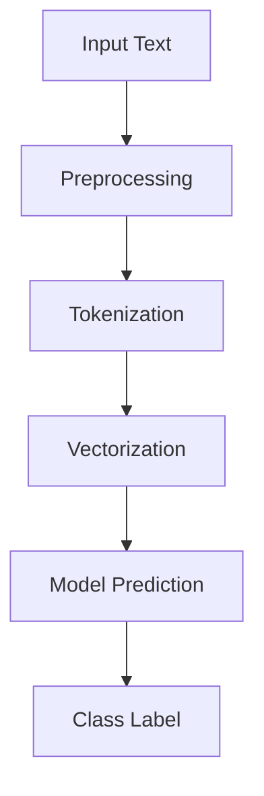

                 

### Introduction to Prompt Engineering in E-commerce: Intelligent Customer Service

> Keywords: Prompt Engineering, E-commerce, Customer Service, AI, Intelligent Systems

> Abstract: This article delves into the application of prompt engineering in the context of e-commerce, focusing on the enhancement of customer service through intelligent systems. We will explore the core concepts, methodologies, and practical implementations that drive this innovative approach to customer interaction.

## Chapter 1: Introduction to Prompt Engineering and Its Applications in E-commerce

### 1.1 Background of Prompt Engineering

#### 1.1.1 The Rise of E-commerce and Customer Service Challenges

E-commerce has experienced exponential growth over the past decade, transforming the way businesses operate and consumers shop. With the proliferation of online platforms, the demand for seamless and efficient customer service has skyrocketed. Traditional customer service methods, often characterized by long response times and limited interaction capabilities, are no longer sufficient to meet the high expectations of today's digital-savvy consumers.

#### 1.1.2 The Role of Prompt Engineering in Enhancing Customer Service

Prompt engineering offers a revolutionary solution to these challenges by leveraging artificial intelligence (AI) and natural language processing (NLP) technologies. At its core, prompt engineering involves designing and training AI models to generate responses to customer queries in real-time. By automating the customer service process, prompt engineering not only improves response times but also enhances the overall customer experience.

#### 1.1.3 Core Concepts and Terminology

To understand prompt engineering, it's essential to familiarize ourselves with some key concepts and terminology:

- **Prompt**: A prompt is a trigger or input that initiates a response from an AI model. In the context of customer service, prompts are typically customer queries or requests.
- **Model**: An AI model is a mathematical representation of a predictive or classification task. Models are trained on large datasets to learn patterns and generate responses.
- **Token**: In NLP, a token is a unit of text, such as a word or punctuation mark.
- **Embedding**: An embedding is a vector representation of a token, which allows AI models to understand the context and meaning of words.

## Chapter 2: Core Concepts of Prompt Engineering

### 2.1 Definition and Basic Principles of Prompt Engineering

Prompt engineering is the process of designing and training AI models to generate human-like responses to customer queries. The basic principles of prompt engineering include:

- **Data Collection**: Gathering a large dataset of customer queries and their corresponding responses.
- **Data Preprocessing**: Cleaning and formatting the data to remove noise and prepare it for training.
- **Model Selection**: Choosing the appropriate AI model architecture based on the task requirements.
- **Training**: Training the model on the preprocessed data to learn the patterns and relationships between queries and responses.
- **Evaluation**: Evaluating the performance of the trained model using metrics such as accuracy, response time, and user satisfaction.

### 2.2 Types of Prompts and Their Applications

There are several types of prompts commonly used in prompt engineering, each serving a specific purpose in customer service:

- **Query-Based Prompts**: These prompts are generated based on the customer's query and aim to provide direct and relevant responses.
- **Intent-Based Prompts**: These prompts are designed to capture the underlying intent of the customer's query and generate responses that address the user's needs.
- **Fallback Prompts**: These prompts are used when the AI model is unable to generate a suitable response, providing alternative options or asking the user for more information.

### 2.3 Designing Effective Prompts

#### 2.3.1 Key Factors for Effective Prompt Design

Designing effective prompts is crucial for ensuring the success of a prompt engineering system. Key factors to consider include:

- **Clarity**: Prompts should be clear and easy to understand, avoiding complex language and technical jargon.
- **Relevance**: Prompts should be relevant to the customer's query and provide accurate and useful information.
- **Consistency**: Prompts should be consistent across the system, ensuring a uniform customer experience.
- **Personalization**: Prompts should be tailored to the individual customer, taking into account their preferences, past interactions, and context.

#### 2.3.2 User-Centric Approach in Prompt Engineering

A user-centric approach is essential in prompt engineering to ensure that customer service systems are designed with the user's needs and preferences in mind. This approach involves:

- **User Research**: Conducting research to understand the needs, preferences, and pain points of the target audience.
- **User Testing**: Testing prompt designs with real users to gather feedback and make iterative improvements.
- **Continuous Improvement**: Regularly updating and refining prompt designs based on user feedback and performance metrics.

## Chapter 3: Algorithms and Techniques in Prompt Engineering

### 3.1 Overview of AI and Machine Learning Algorithms

Prompt engineering relies on a range of AI and machine learning algorithms to generate human-like responses. Some of the most commonly used algorithms include:

- **Recurrent Neural Networks (RNNs)**: RNNs are a type of neural network that can process sequential data, making them suitable for tasks such as generating responses to customer queries.
- **Transformer Models**: Transformer models, such as BERT and GPT, have revolutionized natural language processing by achieving state-of-the-art performance on various tasks, including prompt engineering.
- **Sequence-to-Sequence Models**: Sequence-to-sequence models are designed to translate input sequences (customer queries) into output sequences (responses).

### 3.2 Neural Networks and Deep Learning for Prompt Engineering

#### Neural Networks

Neural networks are the foundation of prompt engineering, enabling AI models to learn from data and generate responses. Key components of neural networks include:

- **Neurons**: Neurons are the basic building blocks of neural networks, responsible for processing and transmitting information.
- **Weights and Biases**: Weights and biases determine the strength of the connections between neurons and play a crucial role in the training process.
- **Activations**: Activations define the output of a neuron and determine whether the neuron is activated or not.

#### Deep Learning

Deep learning extends the concept of neural networks by adding multiple layers of neurons, enabling the model to learn complex patterns and relationships in the data. Key concepts in deep learning include:

- **Convolutional Neural Networks (CNNs)**: CNNs are specialized neural networks designed for processing and analyzing visual data, which can be applied to tasks such as image recognition and text analysis.
- **Recurrent Neural Networks (RNNs)**: RNNs are designed for processing sequential data, making them suitable for tasks such as generating responses to customer queries.

### 3.3 Text Classification and Sentiment Analysis in E-commerce

Text classification and sentiment analysis are essential components of prompt engineering, enabling AI models to categorize customer queries and determine their sentiment. Key techniques include:

- **Text Classification**: Text classification involves categorizing text data into predefined categories, such as product inquiries, order status updates, or complaints.
- **Sentiment Analysis**: Sentiment analysis involves determining the sentiment or emotional tone of a text, such as positive, negative, or neutral.

#### Mermaid Flowchart for Text Classification Algorithm

## Chapter 4: Mathematical Foundations and Formulas in Prompt Engineering

### 4.1 Basic Math Formulas and Their Applications

Prompt engineering relies on various mathematical formulas and principles to train and optimize AI models. Some of the key formulas include:

- **Activation Functions**: Activation functions determine whether a neuron is activated or not. Common activation functions include the sigmoid function and the rectified linear unit (ReLU).
- **Gradient Descent**: Gradient descent is an optimization algorithm used to minimize the loss function during the training of neural networks. The basic formula for gradient descent is:

  $$\theta_{\text{new}} = \theta_{\text{old}} - \alpha \cdot \nabla_{\theta}J(\theta)$$

  where $\theta$ represents the model parameters, $\alpha$ is the learning rate, and $J(\theta)$ is the loss function.

### 4.2 Detailed Explanation and Examples

#### 4.2.1 Example 1: Activation Functions

**Sigmoid Function**

$$\sigma(x) = \frac{1}{1 + e^{-x}}$$

The sigmoid function is commonly used in neural networks to map input values to a range between 0 and 1, making it suitable for tasks such as binary classification.

**ReLU Function**

$$f(x) = \max(0, x)$$

The rectified linear unit (ReLU) function is a popular activation function in deep learning due to its simplicity and effectiveness in preventing vanishing gradients.

#### 4.2.2 Example 2: Gradient Descent Algorithm

Consider a simple neural network with a single neuron and a sigmoid activation function:

$$\sigma(z) = \frac{1}{1 + e^{-z}}$$

where $z = \theta_1 \cdot x_1 + b_1$.

To train this network, we use the gradient descent algorithm to minimize the loss function:

$$J(\theta_1, b_1) = -\frac{1}{m}\sum_{i=1}^{m}y^{(i)}\cdot \ln(\sigma(z^{(i)})) + (1 - y^{(i)})\cdot \ln(1 - \sigma(z^{(i)}))$$

The gradient of the loss function with respect to $\theta_1$ and $b_1$ is:

$$\nabla_{\theta_1}J(\theta_1, b_1) = \frac{1}{m}\sum_{i=1}^{m}(\sigma(z^{(i)})(1 - \sigma(z^{(i)}))(z^{(i)} - y^{(i)})$$

$$\nabla_{b_1}J(\theta_1, b_1) = \frac{1}{m}\sum_{i=1}^{m}(\sigma(z^{(i)})(1 - \sigma(z^{(i)})))$$

Using the gradient descent algorithm, we update the parameters as follows:

$$\theta_1^{(t+1)} = \theta_1^{(t)} - \alpha \cdot \nabla_{\theta_1}J(\theta_1^{(t)}, b_1^{(t)})$$

$$b_1^{(t+1)} = b_1^{(t)} - \alpha \cdot \nabla_{b_1}J(\theta_1^{(t)}, b_1^{(t)})$$

where $\alpha$ is the learning rate.

## Chapter 5: System Analysis and Architecture Design

### 5.1 Problem Scene Introduction

In this chapter, we will analyze the problem scene of applying prompt engineering in e-commerce customer service, including the specific problems to be solved, the role of prompt engineering, and the overall goal of the system.

### 5.2 Project Introduction

We will introduce the project background, objectives, and the expected benefits of implementing prompt engineering in e-commerce customer service. This section will provide an overview of the project scope and the target audience.

### 5.3 System Function Design

We will design the core functions of the prompt engineering system, including data collection and preprocessing, model training and evaluation, and prompt generation and response. This section will provide a detailed description of each function and its role in the overall system.

### 5.4 System Architecture Design

We will design the system architecture using Mermaid diagrams to illustrate the components, their relationships, and the data flow. This section will cover the key components of the system, such as the AI model, the prompt generation module, and the customer interaction interface.

### 5.5 System Interface Design

We will design the system interfaces, including the API specifications, data exchange formats, and communication protocols. This section will provide a detailed description of the system interfaces and their roles in facilitating the interaction between different components.

### 5.6 System Interaction Design

We will design the system interaction using Mermaid sequence diagrams to illustrate the communication and data flow between the system components and the customers. This section will provide a detailed explanation of how the system interacts with customers to provide intelligent customer service.

## Chapter 6: Project Practice

### 6.1 Environment Installation

In this section, we will guide you through the process of setting up the development environment for the prompt engineering project. This will include installing the necessary software, libraries, and tools required for implementing and training the AI models.

### 6.2 System Core Implementation

We will provide a detailed guide on implementing the core components of the prompt engineering system, including data collection and preprocessing, model training and evaluation, and prompt generation and response. This section will include step-by-step instructions and code examples to help you get started.

### 6.3 Code Application and Analysis

We will analyze the core code of the prompt engineering system, explaining the key concepts and techniques used in the implementation. This section will include code snippets and examples to help you understand how the system works and how to optimize its performance.

### 6.4 Practical Case Analysis and Explanation

We will present practical case studies and analyze the results of applying prompt engineering in real-world e-commerce customer service scenarios. This section will provide insights into the effectiveness of prompt engineering and its impact on customer satisfaction and business performance.

### 6.5 Project Summary

In this final section, we will summarize the key findings and lessons learned from the project. This will include a discussion of the challenges faced, the solutions implemented, and the overall success of the project.

## Chapter 7: Best Practices, Summary, and Future Directions

### 7.1 Best Practices

We will discuss the best practices for implementing prompt engineering in e-commerce customer service, including tips for designing effective prompts, selecting appropriate algorithms, and optimizing system performance.

### 7.2 Summary

We will summarize the main topics covered in the article, highlighting the key concepts, methodologies, and practical applications of prompt engineering in e-commerce customer service.

### 7.3 Future Directions

We will discuss the future directions and potential advancements in prompt engineering, including new algorithms, techniques, and applications that can further enhance the effectiveness of intelligent customer service systems.

## Conclusion

Prompt engineering is a powerful tool for enhancing e-commerce customer service through intelligent systems. By leveraging AI and NLP technologies, prompt engineering enables businesses to provide fast, accurate, and personalized responses to customer queries, resulting in improved customer satisfaction and business performance. As we continue to explore and develop new algorithms and techniques, the future of prompt engineering in e-commerce customer service looks promising.

## References

This section will provide a list of references and resources for further reading on prompt engineering, e-commerce customer service, and related topics. It will include academic papers, books, online courses, and other relevant materials that can help you deepen your understanding of the subject.

### Author Information

*Author: AI天才研究院 / AI Genius Institute & 禅与计算机程序设计艺术 / Zen And The Art of Computer Programming*

