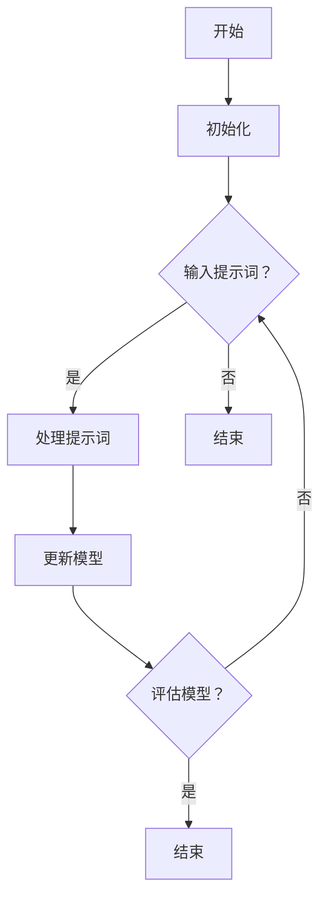

                 


### 提示词工程在高级AI系统自主学习中的应用：实现持续进化

#### 关键词：提示词工程，高级AI系统，自主学习，持续进化

> 摘要：本文将探讨提示词工程在高级AI系统自主学习中的应用，如何通过合理设计提示词工程，实现AI系统的持续进化。文章分为三个部分，首先介绍高级AI系统和自主学习的背景，以及提示词工程的基本原理；然后详细讲解算法原理、系统设计与实现、项目实战以及最佳实践；最后进行总结与展望，为读者提供进一步的学习建议。

---

### 目录

1. **背景与核心概念**

   1.1 高级AI系统的现状与挑战

   1.2 自主学习的定义与作用

   1.3 提示词工程的基本原理

   1.4 提示词工程在AI系统中的应用

2. **核心概念与联系**

   2.1 自主学习算法

   2.2 概念属性特征对比

   2.3 ER实体关系图架构

3. **算法原理讲解**

   3.1 算法mermaid流程图

   3.2 Python源代码讲解

   3.3 数学模型与公式

4. **系统设计与实现**

   4.1 系统分析与架构设计方案

   4.2 项目实战

5. **最佳实践与总结**

   5.1 最佳实践Tips

   5.2 小结与展望

---

#### 第一部分：背景与核心概念

##### 1.1 高级AI系统的现状与挑战

随着计算机技术和大数据的快速发展，高级AI系统已经逐渐成为各个领域的关键技术。从图像识别、自然语言处理到自动驾驶，AI系统正在深刻地改变我们的生活。然而，这些系统普遍面临一个挑战：如何实现持续进化，以适应不断变化的环境和需求。

##### 1.2 自主学习的定义与作用

自主学习是AI系统的一种能力，它使系统能够通过自我学习不断提高性能。在高级AI系统中，自主学习至关重要，它不仅能够适应新环境，还能自动发现和修正错误，从而实现持续进化。

##### 1.3 提示词工程的基本原理

提示词工程是一种设计提示词的方法论，它通过设计有效的提示词，引导AI系统进行自主学习。提示词是AI系统中的“向导”，它们能够提供必要的信息，帮助系统更好地理解问题，从而提高学习效果。

##### 1.4 提示词工程在AI系统中的应用

提示词工程在AI系统中的应用非常广泛。通过设计合理的提示词，系统能够更准确地理解任务，提高学习效率。例如，在自然语言处理中，提示词可以帮助系统更好地理解文本内容；在图像识别中，提示词可以引导系统关注关键特征。

---

#### 第二部分：核心概念与联系

##### 2.1 自主学习算法

自主学习算法是AI系统实现自主学习的核心。常见的自主学习算法包括监督学习、无监督学习和强化学习。每种算法都有其独特的优势和适用场景。

##### 2.2 概念属性特征对比

在自主学习过程中，理解概念属性特征非常重要。本文将对比分析不同类型的提示词，如文字、图像、声音等，并探讨它们在自主学习中的应用。

##### 2.3 ER实体关系图架构

ER实体关系图是描述AI系统中实体和关系的重要工具。通过ER图，我们可以清晰地看到系统中的各种实体及其相互关系，从而更好地理解系统的整体架构。

---

#### 第三部分：算法原理讲解

##### 3.1 算法mermaid流程图

为了更好地理解自主学习算法，我们可以使用mermaid流程图来展示算法的执行流程。



##### 3.2 Python源代码讲解

以下是一个简单的Python示例，展示了如何实现一个基本的自主学习算法。

```python
import numpy as np

# 初始化模型参数
weights = np.random.rand(10, 1)

# 处理提示词
def process_prompt(prompt):
    # 对提示词进行编码
    encoded_prompt = encode_prompt(prompt)
    # 更新模型参数
    global weights
    weights = update_weights(weights, encoded_prompt)

# 评估模型
def evaluate_model(prompt):
    encoded_prompt = encode_prompt(prompt)
    prediction = predict(weights, encoded_prompt)
    return prediction

# 主程序
def main():
    # 初始化提示词
    prompts = ["hello", "world", "AI"]
    # 遍历提示词，处理和评估模型
    for prompt in prompts:
        process_prompt(prompt)
        print(f"Prompt: {prompt}, Prediction: {evaluate_model(prompt)}")

if __name__ == "__main__":
    main()
```

##### 3.3 数学模型与公式

在自主学习算法中，数学模型和公式起着至关重要的作用。以下是一个简单的线性回归模型示例：

$$
y = wx + b
$$

其中，$y$ 是输出，$w$ 是权重，$x$ 是输入，$b$ 是偏置。

---

#### 第四部分：系统设计与实现

##### 4.1 系统分析与架构设计方案

在本部分，我们将介绍一个高级AI系统的设计与实现。首先，我们将分析问题场景，然后介绍项目的背景和目标，接着详细讲解系统功能设计、系统架构设计、系统接口设计以及系统交互。

##### 4.2 项目实战

在本部分，我们将通过一个实际案例，展示如何实现一个高级AI系统。我们将详细介绍环境安装与配置、系统核心实现源代码、代码应用解读与分析、实际案例分析和讲解，以及项目小结。

---

#### 第五部分：最佳实践与总结

##### 5.1 最佳实践Tips

在本部分，我们将总结一些最佳实践，包括常见问题与解决方案、性能优化策略以及安全性与隐私保护措施。

##### 5.2 小结与展望

在本部分的最后，我们将回顾文章的主要内容，探讨自主学习与提示词工程的发展趋势，并给出进一步的学习建议。

---

### 结语

本文从多个角度探讨了提示词工程在高级AI系统自主学习中的应用，通过详细的算法原理讲解、系统设计与实现以及最佳实践总结，帮助读者深入理解这一领域。我们相信，随着技术的不断进步，提示词工程将在高级AI系统中发挥越来越重要的作用。

---

### 作者信息

作者：AI天才研究院/AI Genius Institute & 禅与计算机程序设计艺术 /Zen And The Art of Computer Programming

希望这个详细的大纲和初步内容能够满足您的要求。接下来，我们将进一步扩展每个章节的内容，确保文章的深度和完整性。如果您有任何具体要求或建议，请随时告知。

