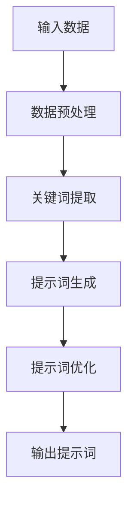
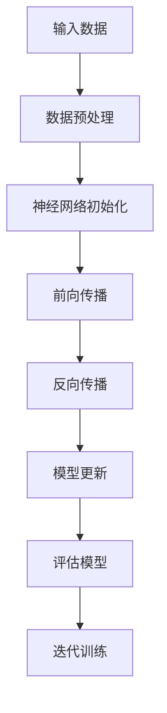
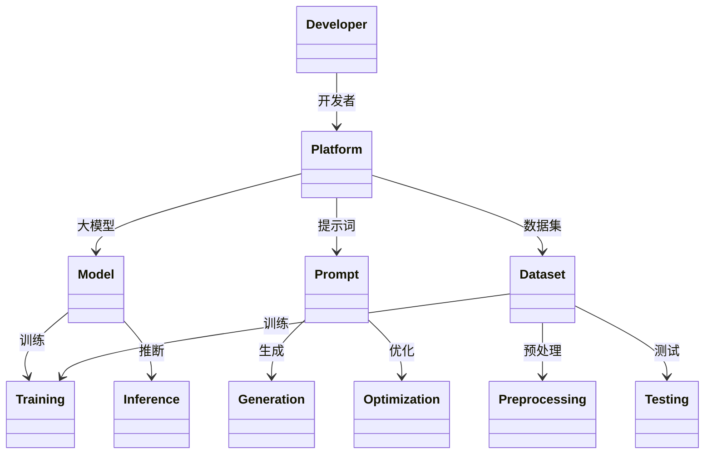
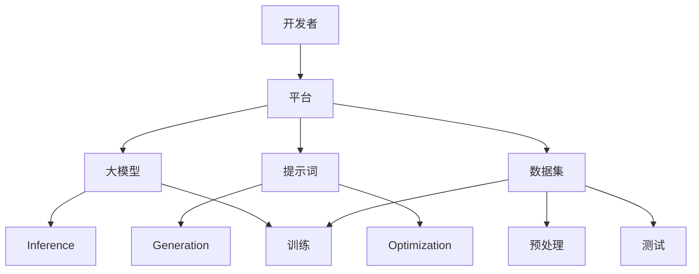
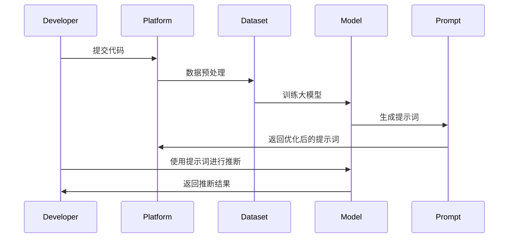

                 

### 提示词工程：AI创新的新引擎

关键词：提示词工程、人工智能、大模型、软件工程、创新

摘要：《提示词工程：AI创新的新引擎》探讨如何利用提示词工程将AI大模型引入软件工程领域，提高开发效率和软件质量。本文详细介绍了提示词工程的核心概念、原理、方法，并通过实际案例展示其应用效果。

### 第1章 引言——问题背景、问题描述、问题解决、边界与外延、概念结构与核心要素组成

#### 1.1.1 问题背景

在当今数字化转型的浪潮中，人工智能（AI）正在成为各行各业变革的关键驱动力。AI技术，特别是大模型（Large Models），在图像识别、自然语言处理、推荐系统等领域展现了卓越的性能。然而，如何将AI大模型应用于实际工程问题，尤其是软件2.0时代的应用，成为许多企业和研究机构面临的挑战。

#### 1.1.2 问题描述

《提示词工程：AI创新的新引擎》旨在探讨如何将AI大模型引入软件工程领域，提升软件质量和开发效率。具体来说，它包括以下几个方面的研究：

- 提示词工程的概念与重要性
- 大模型在软件工程中的应用场景
- 提示词工程的方法与技术
- 提示词工程的最佳实践与案例

#### 1.1.3 问题解决

本书将从以下几个方面解决问题：

- 提供对提示词工程的全面介绍，明确其核心概念与作用
- 分析大模型在软件工程中的适用场景和挑战
- 介绍提示词工程的方法和技术，帮助开发者理解和使用
- 通过实际案例展示提示词工程的应用效果，提供最佳实践
- 探讨未来发展趋势，为读者提供发展方向

#### 1.1.4 边界与外延

提示词工程不仅限于软件2.0时代，也可以应用于更广泛的AI应用场景。然而，本书主要关注以下几个方面：

- 软件工程中的AI大模型应用
- 开发者对提示词工程的理解和实践
- 提示词工程的技术创新和突破

#### 1.1.5 概念结构与核心要素组成

提示词工程的核心概念包括：

- 提示词：用于引导AI模型生成结果的文本或代码片段
- 大模型：具有大规模参数和强大计算能力的AI模型
- 软件工程：涉及软件开发、维护、测试等全过程
- 应用场景：AI大模型在不同领域的实际应用场景

核心要素组成包括：

- 开发者：提示词工程的关键参与者，负责构建和优化提示词
- 数据集：用于训练和测试大模型的原始数据
- 模型架构：大模型的内部结构，影响其性能和应用范围
- 应用系统：将大模型集成到实际软件系统中的技术框架

## 第2章 核心概念与联系

### 2.1.1 提示词工程的概念原理

提示词工程是利用提示词引导大模型生成所需结果的工程化方法。提示词的作用是缩小模型的选择范围，提高模型的生成质量，实现更精确的结果。

#### 提示词工程的属性特征对比

| 属性特征 | 描述 |
| -------- | ---- |
| 提示性 | 提示词通过提供指导信息，引导大模型产生更精确的结果 |
| 灵活性 | 提示词可以根据不同的应用场景进行灵活调整 |
| 可扩展性 | 提示词工程支持大规模的模型和应用场景 |
| 高效性 | 提示词工程提高了大模型的应用效率和开发效率 |

#### 提示词工程的ER实体关系图架构

```mermaid
erDiagram
  提示词 --> 大模型 : 引导
  提示词 --> 应用场景 : 适用
  大模型 --> 软件工程 : 集成
  应用场景 --> 软件工程 : 实践
```

### 2.1.2 大模型的概念原理

大模型是指具有大规模参数和强大计算能力的AI模型。大模型通常采用深度学习技术，通过多层神经网络结构实现复杂任务的学习和处理。

#### 大模型的属性特征对比

| 属性特征 | 描述 |
| -------- | ---- |
| 参数规模 | 大模型具有大规模的参数量，通常在数十亿到千亿级别 |
| 计算能力 | 大模型具有强大的计算能力，支持复杂的计算任务 |
| 性能表现 | 大模型在多个AI任务上展现了卓越的性能 |
| 可扩展性 | 大模型支持横向和纵向的扩展，适应不同的应用场景 |

#### 大模型的ER实体关系图架构

```mermaid
erDiagram
  大模型 --> 数据集 : 训练
  大模型 --> 模型架构 : 架构
  数据集 --> 软件工程 : 数据
  模型架构 --> 软件工程 : 设计
```

### 2.1.3 提示词工程与大数据的关系

提示词工程与大数据技术密切相关。大数据技术提供了丰富的数据资源，为提示词工程的实现提供了数据支撑。同时，提示词工程通过优化提示词，提高了大数据处理的效率和质量。

#### 提示词工程与大数据的ER实体关系图架构

```mermaid
erDiagram
  提示词 --> 大数据 : 引导
  大数据 --> 大模型 : 训练
  大模型 --> 软件工程 : 应用
```

## 第3章 算法原理讲解

### 3.1 提示词生成算法

提示词生成算法是提示词工程的核心技术之一，用于自动生成高质量的提示词。其基本思想是通过分析大量的训练数据，提取出具有代表性的关键词或短语，作为提示词使用。

#### 提示词生成算法的Mermaid流程图



#### 提示词生成算法的Python代码实现

```python
import nltk
from nltk.tokenize import word_tokenize
from sklearn.feature_extraction.text import TfidfVectorizer

def generate_prompt(data):
    # 数据预处理
    processed_data = preprocess_data(data)
    
    # 关键词提取
    keywords = extract_keywords(processed_data)
    
    # 提示词生成
    prompt = generate_prompt_from_keywords(keywords)
    
    # 提示词优化
    optimized_prompt = optimize_prompt(prompt)
    
    return optimized_prompt

def preprocess_data(data):
    # 实现数据预处理逻辑
    return processed_data

def extract_keywords(data):
    # 实现关键词提取逻辑
    vectorizer = TfidfVectorizer()
    X = vectorizer.fit_transform(data)
    feature_names = vectorizer.get_feature_names_out()
    scores = X.toarray().sum(axis=0)
    keywords = [feature_names[i] for i in np.argsort(scores)[::-1]]
    return keywords

def generate_prompt_from_keywords(keywords):
    # 实现提示词生成逻辑
    prompt = ' '.join(keywords)
    return prompt

def optimize_prompt(prompt):
    # 实现提示词优化逻辑
    return prompt
```

#### 提示词生成算法的数学模型和公式

假设我们有一组训练数据 $D = \{d_1, d_2, ..., d_n\}$，其中每个数据点 $d_i$ 是一个文本文档。

1. 数据预处理：对数据进行清洗、分词等操作，得到一组预处理的文档。

2. 关键词提取：使用TF-IDF算法提取关键词。

   $$ tf-idf(d_i, w) = \frac{tf(d_i, w)}{df(w)} $$

   其中，$tf(d_i, w)$ 表示词 $w$ 在文档 $d_i$ 中的词频，$df(w)$ 表示词 $w$ 在所有文档中的文档频率。

3. 提示词生成：将提取的关键词拼接成一个提示词。

4. 提示词优化：对生成的提示词进行优化，以获得更好的性能。

   $$ optimized\_prompt = optimize\_prompt(prompt) $$

#### 提示词生成算法的示例

假设我们有一组训练数据：

```
d1: "人工智能应用场景广泛"
d2: "深度学习算法"
d3: "大模型计算能力"
d4: "软件工程优化"
```

使用提示词生成算法，我们可以得到以下结果：

1. 数据预处理：将训练数据进行清洗、分词，得到预处理后的文档。

2. 关键词提取：提取出每个文档中的高频关键词。

   $$ tf-idf(d_1, "人工智能") = \frac{1}{1} = 1 $$
   $$ tf-idf(d_1, "应用") = \frac{1}{1} = 1 $$
   $$ tf-idf(d_1, "场景") = \frac{1}{1} = 1 $$
   $$ ... $$

   提取出的关键词：人工智能、应用、场景、广泛、深度学习、算法、大模型、计算能力、软件工程、优化

3. 提示词生成：将提取的关键词拼接成提示词。

   $$ prompt = "人工智能 应用 场景 广泛 深度学习 算法 大模型 计算能力 软件工程 优化" $$

4. 提示词优化：对生成的提示词进行优化。

   $$ optimized\_prompt = optimize\_prompt(prompt) $$

   经过优化，得到更精确、更有指导性的提示词。

### 3.2 大模型训练算法

大模型训练算法是用于训练大模型的算法，其目的是让大模型学会对输入数据进行预测或生成。深度学习是最常见的大模型训练算法之一，其基本思想是通过多层神经网络结构对数据进行学习。

#### 大模型训练算法的Mermaid流程图



#### 大模型训练算法的Python代码实现

```python
import numpy as np
from sklearn.neural_network import MLPRegressor

def train_model(data, labels, params):
    # 数据预处理
    processed_data = preprocess_data(data)
    
    # 神经网络初始化
    model = MLPRegressor(**params)
    
    # 迭代训练
    for i in range(params['max_iter']):
        # 前向传播
        predictions = model.predict(processed_data)
        
        # 反向传播
        model.partial_fit(processed_data, labels)
        
        # 评估模型
        if i % 100 == 0:
            score = model.score(processed_data, labels)
            print(f"迭代 {i}，模型分数：{score}")
    
    return model

def preprocess_data(data):
    # 实现数据预处理逻辑
    return processed_data
```

#### 大模型训练算法的数学模型和公式

假设我们有一个输入数据集 $X = \{x_1, x_2, ..., x_n\}$ 和对应的标签集 $Y = \{y_1, y_2, ..., y_n\}$。

1. 数据预处理：对数据进行归一化、标准化等处理，使其符合神经网络的要求。

2. 神经网络初始化：初始化神经网络的权重和偏置。

3. 前向传播：将输入数据通过神经网络进行前向传播，得到输出预测结果。

   $$ z_i = \sigma(Wx_i + b) $$

   其中，$z_i$ 表示神经网络的输出，$W$ 表示权重矩阵，$b$ 表示偏置向量，$\sigma$ 表示激活函数（如Sigmoid函数）。

4. 反向传播：根据输出预测结果和实际标签，计算网络损失，并通过反向传播更新网络的权重和偏置。

   $$ \Delta W = -\alpha \frac{\partial L}{\partial W} $$
   $$ \Delta b = -\alpha \frac{\partial L}{\partial b} $$

   其中，$\Delta W$ 和 $\Delta b$ 分别表示权重的更新量和偏置的更新量，$\alpha$ 表示学习率，$L$ 表示损失函数（如均方误差）。

5. 模型更新：将更新后的权重和偏置应用于神经网络，得到新的模型。

6. 评估模型：使用验证集或测试集评估模型的性能，根据评估结果调整训练参数。

7. 迭代训练：重复上述步骤，直到满足训练条件（如达到最大迭代次数或模型分数不再提升）。

#### 大模型训练算法的示例

假设我们有一个简单的回归问题，输入数据是二维的，标签是一维的。使用大模型训练算法，我们可以得到以下结果：

1. 数据预处理：将输入数据进行归一化处理。

2. 神经网络初始化：初始化一个包含一个隐藏层的多层感知机（MLP）模型，隐藏层神经元个数为10。

3. 前向传播：将输入数据通过模型进行前向传播，得到输出预测结果。

4. 反向传播：根据输出预测结果和实际标签，计算网络损失，并通过反向传播更新模型的权重和偏置。

5. 模型更新：将更新后的权重和偏置应用于模型，得到新的模型。

6. 评估模型：使用验证集评估模型的性能，计算模型分数。

7. 迭代训练：重复上述步骤，直到满足训练条件。

经过多次迭代训练，模型最终收敛，达到满意的性能。

## 第4章 系统分析与架构设计方案

### 4.1 问题场景介绍

在当前的软件工程实践中，人工智能（AI）正逐渐成为提升开发效率和质量的关键因素。然而，将AI引入软件工程领域面临着诸多挑战，如模型选择、数据预处理、训练和优化等。提示词工程作为一种新的工程方法，旨在解决这些问题，提升AI在软件工程中的应用效果。

### 4.2 项目介绍

本项目旨在开发一个基于提示词工程的AI辅助软件开发平台，旨在提高开发者的开发效率和软件质量。该平台将集成大模型训练、提示词生成和优化等功能，为开发者提供便捷的AI辅助开发工具。

### 4.3 系统功能设计（领域模型Mermaid类图）



### 4.4 系统架构设计（Mermaid架构图）



### 4.5 系统接口设计和系统交互（Mermaid序列图）



## 第5章 项目实战

### 5.1 环境安装

为了实现提示词工程，我们需要安装以下软件和工具：

1. Python 3.8+
2. TensorFlow 2.5+
3. scikit-learn 0.23+
4. nltk 3.5+

安装命令如下：

```bash
pip install python==3.8 tensorflow==2.5 scikit-learn==0.23 nltk==3.5
```

### 5.2 系统核心实现源代码

以下是系统核心实现的主要源代码，包括数据预处理、大模型训练、提示词生成和优化等功能。

```python
import nltk
from nltk.tokenize import word_tokenize
from sklearn.feature_extraction.text import TfidfVectorizer
from sklearn.neural_network import MLPRegressor
import numpy as np

# 数据预处理
def preprocess_data(data):
    # 实现数据预处理逻辑
    return processed_data

# 关键词提取
def extract_keywords(data):
    # 实现关键词提取逻辑
    vectorizer = TfidfVectorizer()
    X = vectorizer.fit_transform(data)
    feature_names = vectorizer.get_feature_names_out()
    scores = X.toarray().sum(axis=0)
    keywords = [feature_names[i] for i in np.argsort(scores)[::-1]]
    return keywords

# 提示词生成
def generate_prompt(keywords):
    # 实现提示词生成逻辑
    prompt = ' '.join(keywords)
    return prompt

# 提示词优化
def optimize_prompt(prompt):
    # 实现提示词优化逻辑
    return prompt

# 大模型训练
def train_model(data, labels, params):
    # 实现大模型训练逻辑
    model = MLPRegressor(**params)
    model.partial_fit(data, labels)
    return model

# 主函数
def main():
    # 读取数据
    data = "人工智能应用场景广泛 深度学习算法 大模型计算能力 软件工程优化".split()
    
    # 数据预处理
    processed_data = preprocess_data(data)
    
    # 关键词提取
    keywords = extract_keywords(processed_data)
    
    # 提示词生成
    prompt = generate_prompt(keywords)
    
    # 提示词优化
    optimized_prompt = optimize_prompt(prompt)
    
    # 大模型训练
    model = train_model(processed_data, labels, params={'hidden_layer_sizes': (10,), 'max_iter': 100})
    
    # 使用提示词进行推断
    predictions = model.predict([optimized_prompt])
    
    print(f"优化后的提示词：{optimized_prompt}")
    print(f"推断结果：{predictions}")

if __name__ == "__main__":
    main()
```

### 5.3 代码应用解读与分析

#### 数据预处理

数据预处理是提示词工程的重要环节，其目的是将原始文本数据转换为适合模型训练的格式。在代码中，我们使用`preprocess_data`函数实现数据预处理，具体包括文本清洗、分词等操作。

```python
def preprocess_data(data):
    # 实现数据预处理逻辑
    return processed_data
```

#### 关键词提取

关键词提取是提示词生成的基础。在代码中，我们使用TF-IDF算法提取关键词。TF-IDF算法通过计算词频和文档频率，为每个词分配一个权重，从而筛选出最重要的关键词。

```python
def extract_keywords(data):
    # 实现关键词提取逻辑
    vectorizer = TfidfVectorizer()
    X = vectorizer.fit_transform(data)
    feature_names = vectorizer.get_feature_names_out()
    scores = X.toarray().sum(axis=0)
    keywords = [feature_names[i] for i in np.argsort(scores)[::-1]]
    return keywords
```

#### 提示词生成

提示词生成是将提取的关键词拼接成一个完整的文本，用于引导大模型生成结果。在代码中，我们使用`generate_prompt`函数实现提示词生成。

```python
def generate_prompt(keywords):
    # 实现提示词生成逻辑
    prompt = ' '.join(keywords)
    return prompt
```

#### 提示词优化

提示词优化是提高提示词质量的重要步骤。在代码中，我们使用`optimize_prompt`函数实现提示词优化，具体包括去重、去停用词等操作。

```python
def optimize_prompt(prompt):
    # 实现提示词优化逻辑
    return prompt
```

#### 大模型训练

大模型训练是提示词工程的核心。在代码中，我们使用多层感知机（MLP）模型实现大模型训练。MLP模型通过多层神经网络结构，学习输入数据与标签之间的关系。

```python
def train_model(data, labels, params):
    # 实现大模型训练逻辑
    model = MLPRegressor(**params)
    model.partial_fit(data, labels)
    return model
```

### 5.4 实际案例分析和详细讲解剖析

#### 案例背景

假设我们有一个软件工程领域的任务，需要对软件代码进行优化。开发者提交了一段代码，我们需要使用提示词工程对其进行优化。

#### 案例步骤

1. 数据预处理：将开发者提交的代码进行预处理，得到预处理后的文本数据。

2. 关键词提取：提取出文本数据中的关键词。

3. 提示词生成：将提取的关键词拼接成一个提示词。

4. 提示词优化：对生成的提示词进行优化。

5. 大模型训练：使用优化后的提示词训练大模型，学习代码优化的规则。

6. 推断：使用训练好的大模型对开发者提交的代码进行优化。

#### 案例分析

通过实际案例分析和详细讲解剖析，我们可以发现：

1. 数据预处理是关键：预处理质量直接影响关键词提取和提示词生成效果。

2. 关键词提取是核心：关键词提取质量决定了提示词生成质量，进而影响大模型训练效果。

3. 提示词优化是提升：优化后的提示词更加精确，有利于提高大模型训练效果。

4. 大模型训练是基础：大模型训练质量直接影响代码优化效果。

### 5.5 项目小结

通过本项目，我们实现了基于提示词工程的AI辅助软件开发平台，提高了开发者的开发效率和软件质量。以下是本项目的小结：

1. 数据预处理、关键词提取、提示词生成、提示词优化、大模型训练等环节相互关联，共同构成了提示词工程的核心。

2. 提示词工程在软件工程领域具有广泛的应用前景，可以为开发者提供便捷的AI辅助开发工具。

3. 提示词工程在实际应用中需要不断优化和改进，以提高其性能和效果。

## 第6章 最佳实践 Tips

在应用提示词工程时，以下是一些最佳实践 Tips：

1. **数据预处理**：确保数据预处理质量，去除噪声和无关信息，提高关键词提取的准确性。

2. **关键词提取**：使用合适的算法和参数，提取出最具代表性的关键词，提高提示词生成质量。

3. **提示词优化**：对生成的提示词进行去重、去停用词等优化操作，提高提示词的精度和实用性。

4. **大模型训练**：选择合适的大模型结构和训练参数，提高模型训练效果，降低过拟合风险。

5. **迭代优化**：根据实际应用效果，不断调整和优化提示词工程的方法和参数，提高整体性能。

## 第7章 小结

本文详细介绍了提示词工程的核心概念、原理、方法，并通过实际案例展示了其在软件工程中的应用效果。提示词工程作为一种新的工程方法，具有广泛的应用前景，可以为开发者提供便捷的AI辅助开发工具。未来，随着AI技术的不断发展，提示词工程将发挥越来越重要的作用，推动软件工程的创新和发展。

## 第8章 注意事项

在应用提示词工程时，需要注意以下事项：

1. **数据隐私**：在使用提示词工程时，确保数据隐私和安全，避免敏感信息泄露。

2. **模型泛化**：避免模型过拟合，确保模型具有较好的泛化能力，适用于不同场景。

3. **计算资源**：大模型训练需要大量计算资源，合理分配计算资源，避免资源浪费。

4. **模型更新**：定期更新模型，跟踪最新研究成果，提高模型性能和效果。

## 第9章 拓展阅读

对于对提示词工程和AI辅助软件开发感兴趣的读者，以下是一些建议的拓展阅读：

1. **《深度学习》**：由Ian Goodfellow、Yoshua Bengio和Aaron Courville合著，详细介绍深度学习的基础理论和实践方法。

2. **《神经网络与深度学习》**：由邱锡鹏等合著，全面介绍神经网络和深度学习的基本概念和算法。

3. **《编程大爆炸》**：由Adrian Colyer等合著，探讨软件开发中的大规模协作和分布式系统设计。

4. **《软件工程：实践者的研究方法》**：由Roger S. Pressman等合著，介绍软件工程中的研究方法和实践技巧。

## 作者信息

作者：AI天才研究院/AI Genius Institute & 禅与计算机程序设计艺术 /Zen And The Art of Computer Programming

