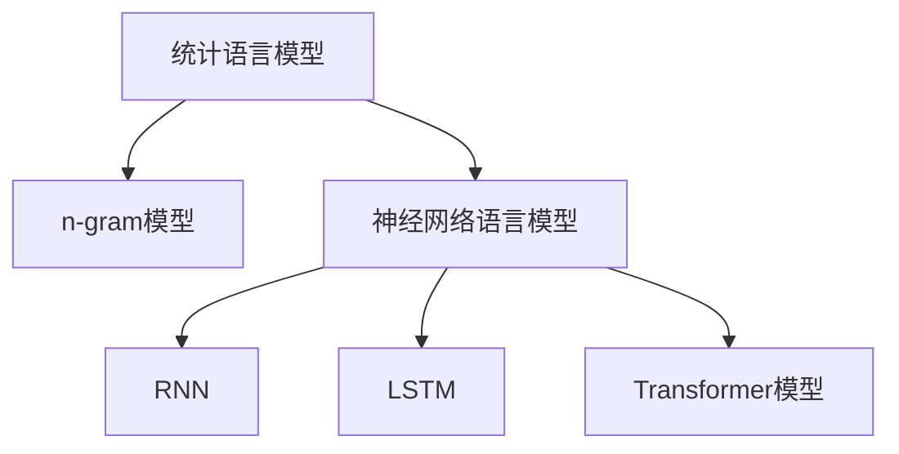
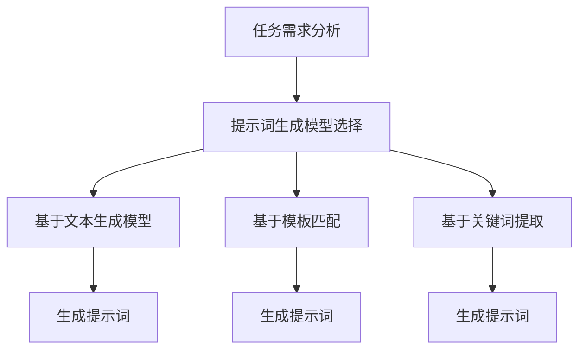
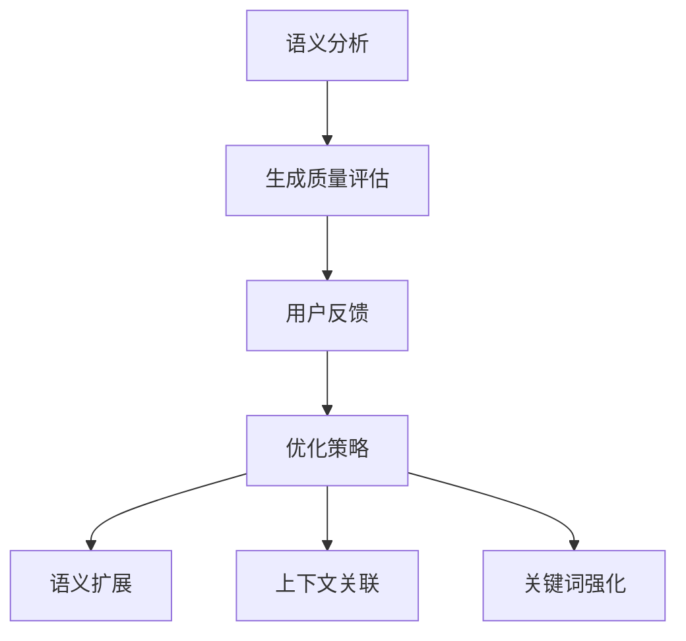
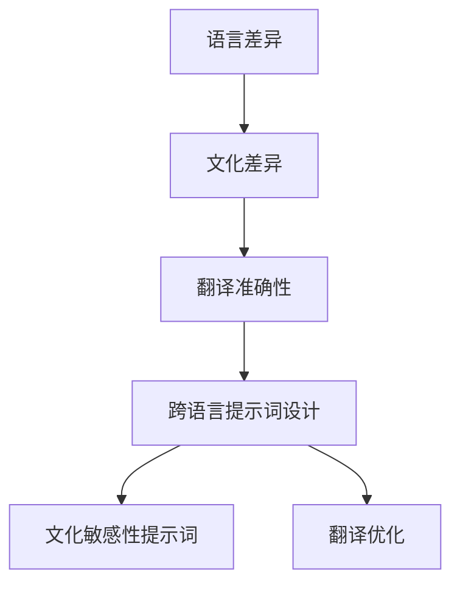
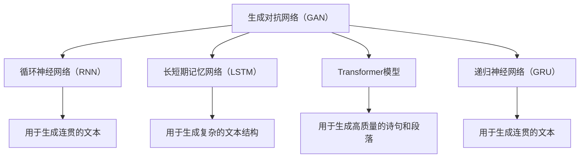
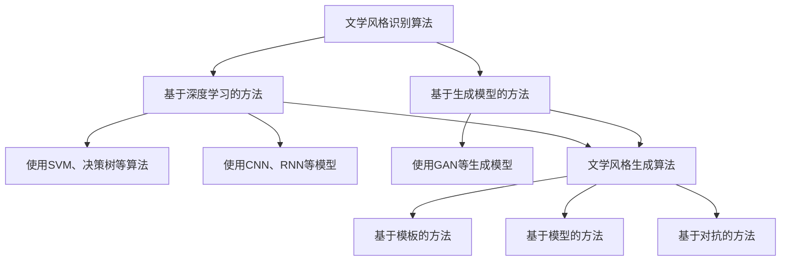
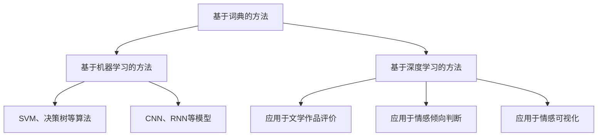
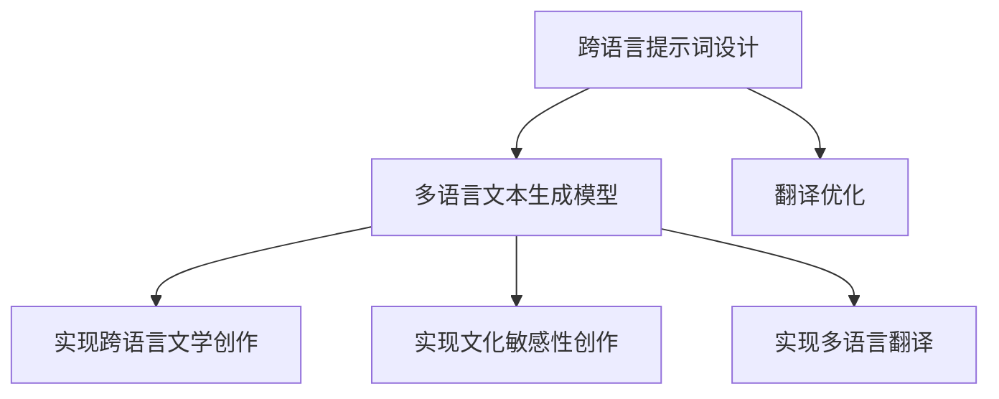
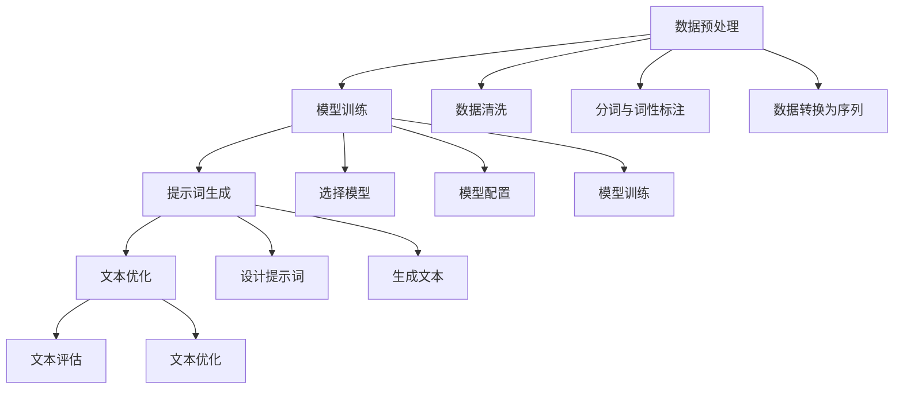

                 

### 引言：AI多语言文学创作的问题与挑战

#### 1.1 AI在文学创作中的应用现状

随着人工智能技术的快速发展，AI在文学创作中的应用已经逐渐成为研究热点。当前，AI在文学创作中的应用主要体现在以下几个方面：

1. **自动写作辅助**：AI可以通过自然语言处理技术，辅助人类创作者生成文章、诗歌等文学作品。例如，谷歌的WordSmith工具和OpenAI的GPT模型等。
   
2. **文学风格迁移**：通过机器学习算法，AI可以将一种风格的文章转换成另一种风格。例如，将现代小说的风格转换为经典文学的风格。

3. **情感分析**：AI可以对文学作品进行情感分析，判断作品中的情感倾向和情感强度。

4. **文学生成**：AI可以完全自主地生成全新的文学作品，如诗歌、小说等。例如，微软的Z Huang模型和OpenAI的GPT-3模型等。

然而，尽管AI在文学创作中展现出了巨大的潜力，但也面临着一系列问题和挑战：

- **语言理解的局限性**：AI目前对语言的深层含义和语境的理解还不够成熟，导致生成的作品有时会出现逻辑不通或者不符合人类价值观的情况。

- **文化差异的处理**：不同语言和文化之间的差异使得AI在生成跨文化作品时面临巨大挑战。

- **创意的激发**：AI是否能真正激发出人类创作者的创意，这是一个尚未解决的问题。

- **质量保证**：如何确保AI生成的文学作品在质量和艺术价值上达到人类创作者的水平，也是一个亟待解决的问题。

#### 1.2 提示词工程的核心概念

提示词工程（Prompt Engineering）是近年来在人工智能领域兴起的一个研究方向，它旨在通过设计有效的提示词，提升AI系统在各种任务中的性能，特别是在文学创作方面。

**核心概念：**
- **提示词（Prompt）**：提示词是提供给AI系统的一段文本，用于引导AI进行特定任务。例如，在文学创作中，提示词可以是某段话、一句话或一个主题。

- **提示词工程（Prompt Engineering）**：提示词工程是设计和优化提示词的一门技术，通过研究和实践，找到最适合特定任务的提示词，从而提升AI系统的性能。

**目的：**
- **提高创作效率**：通过有效的提示词，AI可以更快、更准确地完成文学创作任务。

- **提升创作质量**：优化的提示词可以帮助AI生成更加高质量、符合人类价值观的文学作品。

- **解决跨语言创作挑战**：在多语言文学创作中，提示词工程可以帮助AI更好地理解和生成不同语言和文化的作品。

**应用场景：**
- **自动写作辅助**：通过设计有效的提示词，AI可以帮助人类创作者快速生成文章、段落或故事。

- **文学风格迁移**：提示词可以引导AI将一种风格的文本转换为另一种风格。

- **文学生成**：提示词可以帮助AI生成全新的、高质量的文学作品。

#### 1.3 提示词工程在多语言文学创作中的应用

在多语言文学创作中，AI面临着语言和文化差异带来的巨大挑战。提示词工程通过以下方式提升AI的多语言文学创作能力：

- **跨语言提示词设计**：设计适用于不同语言的提示词，帮助AI更好地理解多种语言的语境和含义。

- **文化敏感性提示词**：设计能够体现不同文化特色的提示词，使AI生成的作品更具有文化内涵和艺术价值。

- **多语言风格转换**：通过提示词引导AI进行不同语言风格之间的转换，从而生成更加多样化的文学作品。

- **提高创作效率和质量**：优化的提示词可以帮助AI更快、更准确地生成多语言文学作品，同时确保作品的质量和艺术价值。

#### 1.4 本书结构安排与学习目标

本书旨在通过系统的介绍和案例分析，帮助读者深入了解提示词工程在AI多语言文学创作中的应用。

**章节安排：**

- **第1章**：引言，介绍AI在文学创作中的应用现状和提示词工程的核心概念。

- **第2章**：提示词工程基础，介绍语言模型、提示词生成算法和提示词优化技术。

- **第3章**：多语言文学创作中的AI算法，介绍文学风格识别与生成、文学情感分析等算法。

- **第4章**：提示词工程实践，介绍提示词工程的实际应用案例。

- **第5章**：多语言文学创作中的应用场景，介绍多语言文学创作在媒体、教育、文学翻译和其他领域的应用。

- **第6章**：提示词工程前沿技术，介绍当前前沿技术和未来发展趋势。

- **第7章**：总结与展望，对全书内容进行总结，展望提示词工程的未来发展。

**学习目标：**

- **理解AI在文学创作中的应用现状**：通过第1章的学习，读者可以了解AI在文学创作中的应用和面临的挑战。

- **掌握提示词工程的核心技术和方法**：通过第2章到第6章的学习，读者可以系统地掌握提示词工程的基础知识、前沿技术和应用场景。

- **具备实际应用能力**：通过第4章和第5章的案例分析和实践，读者可以学会如何在实际项目中应用提示词工程，提升AI多语言文学创作能力。

通过本书的学习，读者不仅可以深入了解提示词工程的理论知识，还可以掌握实际应用技能，为未来的研究和应用打下坚实的基础。

### 第2章 提示词工程基础

#### 2.1 语言模型基础

语言模型（Language Model）是自然语言处理领域的一个重要基础，它用于预测自然语言中的下一个单词或字符。语言模型的核心思想是通过对大量文本数据进行统计和分析，学习出语言的概率分布，从而能够对新的文本进行预测和生成。

**核心概念：**
- **N元语言模型**：基于前N个单词或字符的统计模型，用于预测下一个单词或字符。N越小，模型的复杂度越低，但预测能力也会相应减弱。
- **神经网络语言模型**：基于神经网络的结构，通过多层神经网络对语言数据进行学习，可以捕捉到更加复杂的语言特征。

**原理：**
- **统计语言模型**：通过统计文本数据中的词频和语法结构，预测下一个单词或字符。常见的统计语言模型有N元语法模型和n-gram模型。
- **神经网络语言模型**：通过神经网络结构对语言数据进行深度学习，可以捕捉到更加复杂的语言特征和上下文信息。常见的神经网络语言模型有循环神经网络（RNN）、长短期记忆网络（LSTM）和Transformer模型。

**特点：**
- **N元语法模型**：简单易实现，但预测能力有限。
- **神经网络语言模型**：可以捕捉到复杂的语言特征，但计算复杂度较高。

**常见语言模型及其特点：**
1. **n-gram模型**：基于前N个单词或字符的统计模型，简单易实现，但预测能力有限。
2. **循环神经网络（RNN）**：能够捕捉到序列数据中的长期依赖关系，但在处理长序列时存在梯度消失问题。
3. **长短期记忆网络（LSTM）**：在RNN的基础上引入门控机制，能够更好地捕捉到长期依赖关系。
4. **Transformer模型**：基于自注意力机制，能够处理任意长度的序列数据，是目前最先进的语言模型之一。

**Mermaid流程图：**


#### 2.2 提示词生成算法

提示词生成算法（Prompt Generation Algorithm）是提示词工程的核心组成部分，其主要目标是根据特定任务需求，生成有效的提示词。有效的提示词能够引导AI系统更好地理解任务需求，提高AI系统的创作能力和创作质量。

**核心概念：**
- **提示词生成**：根据任务需求，生成用于引导AI系统进行特定任务的文本。
- **生成算法**：用于生成提示词的一系列算法和技术。

**原理：**
- **文本生成算法**：基于文本生成模型（如GPT、BERT等）生成提示词。
- **模板匹配**：通过预设的模板，匹配任务需求，生成提示词。
- **关键词提取**：从任务描述中提取关键信息，生成提示词。

**步骤：**
1. **任务需求分析**：分析任务的具体需求，确定需要生成的提示词类型。
2. **提示词生成模型选择**：选择合适的文本生成模型或模板匹配算法。
3. **提示词生成**：根据任务需求和分析结果，生成提示词。
4. **提示词优化**：对生成的提示词进行优化，提高其有效性和准确性。

**常见生成算法：**
1. **基于文本生成模型**：如GPT、BERT等，通过深度学习模型生成高质量的提示词。
2. **基于模板匹配**：通过预设的模板，快速生成提示词。
3. **基于关键词提取**：从任务描述中提取关键信息，生成提示词。

**Mermaid流程图：**


#### 2.3 提示词优化技术

提示词优化技术（Prompt Optimization Techniques）是提升提示词质量和有效性的关键环节。通过优化提示词，可以进一步提高AI系统在文学创作中的表现。

**核心概念：**
- **提示词优化**：对已生成的提示词进行改进和调整，提高其有效性和准确性。
- **优化目标**：提升提示词的语义相关性、生成质量和用户体验。

**原理：**
- **语义分析**：通过语义分析技术，理解提示词的含义和上下文信息。
- **生成质量评估**：通过评估指标，如BLEU、ROUGE等，评估生成文本的质量。
- **用户反馈**：根据用户反馈，对提示词进行调整和优化。

**方法：**
1. **基于语义分析的优化**：通过深度学习模型，对提示词进行语义分析，识别和理解其含义，从而进行优化。
2. **基于生成质量评估的优化**：通过评估指标，对生成文本的质量进行评估，根据评估结果对提示词进行调整。
3. **基于用户反馈的优化**：收集用户对生成文本的反馈，根据反馈结果，对提示词进行调整和优化。

**策略：**
1. **语义扩展**：扩展提示词的语义范围，使其能够引导AI生成更丰富的内容。
2. **上下文关联**：增强提示词与上下文之间的关联，提高生成文本的连贯性和一致性。
3. **关键词强化**：突出提示词中的关键信息，使其更加突出和显著。

**Mermaid流程图：**


#### 2.4 提示词工程在多语言环境中的应用

在多语言环境中，提示词工程面临着特殊的挑战，如语言和文化差异、翻译准确性等。针对这些挑战，提示词工程采取了一系列策略和方法，以提高AI在多语言文学创作中的表现。

**核心概念：**
- **多语言提示词工程**：针对不同语言和文化，设计有效的提示词，提升AI在多语言文学创作中的能力。
- **多语言环境**：涉及多种语言和文化，需要处理语言和文化差异。

**挑战：**
1. **语言差异**：不同语言之间的语法、词汇和表达方式存在差异，导致AI在生成文本时难以理解和使用。
2. **文化差异**：不同文化背景下的价值观、习俗和表达方式不同，影响AI生成文本的文化内涵和艺术价值。
3. **翻译准确性**：AI生成的文本需要准确翻译成其他语言，保证跨语言交流的一致性和准确性。

**策略：**
1. **跨语言提示词设计**：设计适用于多种语言的提示词，考虑不同语言的语法和表达方式。
2. **文化敏感性提示词**：设计能够体现不同文化特色的提示词，使AI生成文本更具有文化内涵和艺术价值。
3. **翻译优化**：对生成的文本进行翻译优化，确保跨语言交流的准确性和一致性。

**案例分析：**
1. **中文与英文的文学创作**：设计适用于中文和英文的提示词，通过语义分析和翻译优化，提升跨语言文学创作的质量。
2. **中文与日文的文学创作**：考虑中文和日文的语法差异和文化背景，设计适用于两者的提示词，实现跨语言文学创作。

**Mermaid流程图：**


#### 2.5 小结

本章介绍了提示词工程的基础知识，包括语言模型基础、提示词生成算法、提示词优化技术和多语言提示词工程。通过对这些内容的了解，读者可以掌握提示词工程的核心技术和方法，为后续章节的学习和应用打下坚实基础。

**重点知识回顾：**
1. **语言模型基础**：了解N元语法模型、神经网络语言模型及其特点。
2. **提示词生成算法**：掌握基于文本生成模型、模板匹配和关键词提取的生成算法。
3. **提示词优化技术**：了解基于语义分析、生成质量评估和用户反馈的优化策略。
4. **多语言提示词工程**：掌握跨语言提示词设计、文化敏感性提示词和翻译优化的策略。

**进一步学习方向：**
1. 深入学习语言模型和提示词生成算法的原理和实现。
2. 探究提示词优化技术的应用场景和效果。
3. 研究多语言提示词工程在不同语言和文化中的应用。

### 第3章 多语言文学创作中的AI算法

#### 3.1 文学创作中的AI算法概述

在文学创作领域，人工智能算法发挥着越来越重要的作用。这些算法不仅可以帮助人类创作者生成高质量的作品，还可以探索新的文学风格和创作方式。本节将介绍AI在文学创作中的应用，以及常见的一些AI算法。

**AI在文学创作中的应用：**
1. **自动写作**：AI可以通过自然语言处理技术，自动生成文章、诗歌和小说等文学作品。例如，OpenAI的GPT-3模型可以生成高质量的文本，模拟人类写作风格。
2. **文学风格迁移**：AI可以将一种风格的文本转换为另一种风格。例如，将现代小说转换为古典文学风格，或进行跨语言风格迁移。
3. **文学情感分析**：AI可以对文学作品进行情感分析，判断作品中的情感倾向和情感强度。这对于理解文学作品的意义和创作目的具有重要意义。
4. **文学生成**：AI可以完全自主地生成全新的文学作品，如诗歌、小说和剧本等。例如，微软的Z Huang模型可以生成独特的诗歌和散文。

**常见的AI文学创作算法：**
1. **生成对抗网络（GAN）**：GAN是一种无监督学习算法，通过生成器和判别器的对抗训练，生成高质量的文本。GAN在文学创作中可以用于生成独特的文本风格和创作新的文学作品。
2. **循环神经网络（RNN）**：RNN是一种基于序列数据的神经网络模型，可以捕捉文本数据中的长期依赖关系。RNN在文学创作中可以用于生成连贯的文本和预测下一个单词。
3. **长短期记忆网络（LSTM）**：LSTM是RNN的一种改进模型，通过门控机制可以更好地捕捉长期依赖关系。LSTM在文学创作中可以用于生成复杂的文本结构和创作风格。
4. **Transformer模型**：Transformer是一种基于自注意力机制的神经网络模型，可以处理任意长度的序列数据。Transformer在文学创作中可以用于生成高质量的诗句和段落。
5. **递归神经网络（GRU）**：GRU是LSTM的另一种改进模型，通过门控机制可以更好地捕捉长期依赖关系。GRU在文学创作中可以用于生成连贯的文本和预测下一个单词。

**Mermaid流程图：**


#### 3.2 文学风格识别与生成

文学风格识别与生成是AI在文学创作中的重要应用之一。通过识别不同文学风格的特点，AI可以生成具有特定风格的文学作品。

**文学风格识别算法：**
1. **基于特征的识别方法**：通过提取文本的特征（如词频、语法结构等），使用机器学习算法进行分类。例如，可以使用支持向量机（SVM）、决策树等算法。
2. **基于深度学习的方法**：使用深度学习模型（如卷积神经网络（CNN）、循环神经网络（RNN）等）对文本进行特征提取和分类。这些方法可以捕捉到文本中的深层特征，提高识别的准确性。
3. **基于生成模型的方法**：使用生成对抗网络（GAN）等生成模型，通过对抗训练生成具有特定风格的文本。这种方法可以产生高质量的文本，但需要大量的训练数据和计算资源。

**文学风格生成算法：**
1. **基于模板的方法**：通过预设的文学风格模板，生成符合特定风格的文本。这种方法简单易实现，但生成的文本可能缺乏创新性。
2. **基于模型的方法**：使用训练好的文本生成模型（如GPT、BERT等），根据特定的文学风格特征生成文本。这种方法可以生成高质量的文本，但需要大量的训练数据和计算资源。
3. **基于对抗的方法**：使用生成对抗网络（GAN）等生成模型，通过对抗训练生成具有特定风格的文本。这种方法可以生成高质量的、多样化的文本，但需要大量的训练数据和计算资源。

**Mermaid流程图：**


#### 3.3 文学情感分析

文学情感分析是研究AI如何理解和分析文学作品中的情感信息。通过对情感的分析，可以更好地理解文学作品的主题、情感倾向和创作目的。

**情感分析算法：**
1. **基于词典的方法**：通过使用情感词典，对文本中的词汇进行情感标注。这种方法简单易实现，但可能存在主观性和准确性问题。
2. **基于机器学习的方法**：使用机器学习算法（如SVM、决策树等）对文本进行情感分类。这种方法可以处理复杂的情感信息，提高分类的准确性。
3. **基于深度学习的方法**：使用深度学习模型（如CNN、RNN等）对文本进行情感分析。这种方法可以捕捉到文本中的深层情感特征，提高分类的准确性。

**应用场景：**
1. **文学作品评价**：通过情感分析，可以评估文学作品的质量和受众反响，为创作提供反馈。
2. **情感倾向判断**：通过情感分析，可以判断文学作品中的情感倾向，了解作品的主题和创作意图。
3. **情感可视化**：通过情感分析，可以将文学作品中的情感信息可视化，帮助读者更好地理解作品。

**案例：**
- **莎士比亚文学作品情感分析**：通过对莎士比亚的文学作品进行情感分析，可以了解其作品中的情感倾向和创作风格。
- **现代文学作品情感分析**：通过对现代文学作品进行情感分析，可以探索现代文学的情感趋势和特点。

**Mermaid流程图：**


#### 3.4 多语言文学创作算法的应用

多语言文学创作算法的应用是当前研究的热点之一。随着全球化和多语言交流的日益普及，如何利用AI技术实现高质量的多语言文学创作具有重要意义。

**挑战：**
1. **语言差异**：不同语言之间的语法、词汇和表达方式存在差异，需要设计适用于多种语言的算法。
2. **文化差异**：不同文化背景下的价值观、习俗和表达方式不同，需要考虑文化差异，生成具有文化内涵的文学作品。
3. **翻译准确性**：AI生成的文本需要准确翻译成其他语言，确保跨语言交流的一致性和准确性。

**解决方案：**
1. **跨语言提示词设计**：设计适用于多种语言的提示词，引导AI生成符合多种语言和文化特点的文本。
2. **多语言文本生成模型**：使用训练好的多语言文本生成模型（如mBERT、XLM等），生成高质量的多语言文学作品。
3. **翻译优化**：对生成的文本进行翻译优化，确保跨语言交流的准确性和一致性。

**应用：**
1. **跨语言文学创作**：通过跨语言提示词设计和多语言文本生成模型，实现中英文之间的文学创作。
2. **文化敏感性创作**：通过考虑不同文化差异，生成具有文化内涵的多语言文学作品。
3. **多语言翻译**：通过翻译优化，确保AI生成的文本在不同语言之间的一致性和准确性。

**Mermaid流程图：**


#### 3.5 小结

本章介绍了多语言文学创作中的AI算法，包括文学风格识别与生成、文学情感分析和多语言文学创作算法的应用。通过对这些算法的理解和应用，AI可以更好地理解和生成多语言文学作品，为文学创作带来新的可能性。

**重点知识回顾：**
1. **AI在文学创作中的应用**：了解自动写作、文学风格迁移、文学情感分析和文学生成等应用。
2. **常见的AI文学创作算法**：掌握GAN、RNN、LSTM、Transformer和GRU等算法的基本原理和应用。
3. **文学风格识别与生成**：了解基于特征、深度学习和生成模型的方法，以及文学风格生成算法。
4. **文学情感分析**：掌握基于词典、机器学习和深度学习的方法，以及情感分析的应用。
5. **多语言文学创作算法**：了解跨语言提示词设计、多语言文本生成模型和翻译优化策略。

**进一步学习方向：**
1. 深入学习AI文学创作算法的原理和实现。
2. 探究不同算法在文学创作中的应用效果。
3. 研究多语言文学创作算法在不同语言和文化中的应用。

### 第4章 提示词工程实践

#### 4.1 提示词工程实践环境搭建

为了实践提示词工程，我们需要搭建一个合适的开发环境。以下是搭建提示词工程实践环境的基本步骤：

**所需软件与工具：**
1. **编程语言**：Python是提示词工程中最常用的编程语言，它拥有丰富的自然语言处理库和框架。
2. **自然语言处理库**：如NLTK、spaCy、TensorFlow和PyTorch等，用于文本处理、模型训练和优化。
3. **版本控制工具**：如Git，用于代码管理和协作开发。
4. **文本编辑器**：如Visual Studio Code，提供强大的编程功能和插件支持。

**环境搭建步骤：**
1. **安装Python**：访问Python官方网站（https://www.python.org/）下载并安装Python，选择合适的版本（如Python 3.8或更高版本）。
2. **安装自然语言处理库**：通过pip工具安装所需的自然语言处理库，例如：
   ```bash
   pip install nltk spacy tensorflow torch
   ```
3. **安装文本编辑器**：下载并安装Visual Studio Code（https://code.visualstudio.com/），配置Python开发环境。
4. **安装版本控制工具**：下载并安装Git（https://git-scm.com/），用于代码管理和协作开发。

**注意事项：**
1. 确保Python和自然语言处理库的版本兼容。
2. 配置好文本编辑器的Python插件，如Pylance和Jupyter Notebook。
3. 在实际项目中，可能需要安装额外的库和依赖项，根据项目需求进行安装。

通过以上步骤，我们可以搭建一个基本的提示词工程实践环境，为后续的实战案例做好准备。

#### 4.2 提示词工程实战案例

在本节中，我们将通过一个具体的提示词工程实战案例，展示如何应用提示词工程技术和方法，提升AI文学创作的质量。以下是案例的详细解读：

**案例背景：**
- **任务需求**：生成一首具有古风风格的五言律诗。
- **数据集**：使用中国古代五言律诗数据集作为训练数据，该数据集包含大量的五言律诗文本。

**步骤 1：数据预处理**
1. **数据清洗**：去除文本中的标点符号、特殊字符和停用词，保持文本的简洁和规范。
2. **分词与词性标注**：使用自然语言处理库（如spaCy）对文本进行分词和词性标注，为后续模型训练提供准确的词汇信息。
3. **数据转换为序列**：将清洗和分词后的文本转换为序列数据，为模型训练做准备。

**步骤 2：模型训练**
1. **选择模型**：选择适合文学创作的模型，如Transformer模型或LSTM模型。考虑到Transformer模型在文本生成方面的强大能力，我们选择使用Transformer模型。
2. **模型配置**：配置Transformer模型的参数，如词汇表大小、嵌入维度、序列长度等。
3. **模型训练**：使用训练数据集对Transformer模型进行训练，优化模型的参数和性能。

**步骤 3：提示词生成**
1. **设计提示词**：根据任务需求，设计一个能够引导AI生成古风五言律诗的提示词。例如：“春日和暖风，江南水乡，绿柳轻摇，红杏枝头。”
2. **生成文本**：将设计的提示词输入到训练好的Transformer模型中，生成一首古风五言律诗。

**步骤 4：文本优化**
1. **文本评估**：使用BLEU、ROUGE等评估指标，评估生成文本的质量和风格。
2. **文本优化**：根据评估结果，对生成文本进行修改和优化，提高其质量和艺术价值。

**案例解读：**
1. **数据预处理**：数据预处理是模型训练的基础，通过清洗、分词和词性标注，确保数据的质量和规范性。
2. **模型训练**：选择合适的模型进行训练，优化模型参数，使其能够生成高质量的文本。
3. **提示词设计**：设计有效的提示词，引导AI生成符合任务需求的文本。
4. **文本优化**：通过评估和修改，进一步提高生成文本的质量和艺术价值。

**Mermaid流程图：**


**Python代码示例：**
```python
import torch
from transformers import GPT2LMHeadModel, GPT2Tokenizer

# 准备模型和 tokenizer
model_name = "gpt2"
tokenizer = GPT2Tokenizer.from_pretrained(model_name)
model = GPT2LMHeadModel.from_pretrained(model_name)

# 设计提示词
prompt = "春日和暖风，江南水乡，绿柳轻摇，红杏枝头。"

# 生成文本
input_ids = tokenizer.encode(prompt, return_tensors='pt')
outputs = model.generate(input_ids, max_length=50, num_return_sequences=1)

# 解码生成文本
generated_text = tokenizer.decode(outputs[0], skip_special_tokens=True)

print(generated_text)
```

**案例小结：**
通过以上实战案例，我们展示了如何应用提示词工程技术和方法，生成一首具有古风风格的五言律诗。案例的成功在于数据预处理、模型训练、提示词设计和文本优化等多个环节的协同工作，为AI文学创作提供了有效的解决方案。

#### 4.3 提示词工程中的问题与挑战

在提示词工程的实践中，我们可能会遇到各种问题与挑战，这些问题不仅会影响AI文学创作的质量，还可能限制提示词工程的应用范围。以下是一些常见的问题和相应的解决方案：

**1. 提示词设计困难：**
- **问题**：设计有效的提示词是一个复杂的过程，需要深入理解任务需求和目标，但往往缺乏具体的指导。
- **解决方案**：通过任务分析、用户反馈和专家指导，逐步优化提示词设计。使用现有的提示词生成算法（如GPT-2、BERT等）辅助设计，提高提示词的质量。

**2. 模型训练不足：**
- **问题**：模型训练数据不足或质量不高，导致模型性能不佳，生成文本质量低。
- **解决方案**：收集和整理高质量的训练数据，采用数据增强技术（如数据清洗、数据扩充等）提高数据质量。使用预训练模型（如GPT-3、BERT等）作为基础，通过迁移学习提高模型在特定任务上的性能。

**3. 文本生成质量不高：**
- **问题**：生成的文本缺乏连贯性、创造性和艺术价值，无法满足高质量文学创作的需求。
- **解决方案**：优化提示词设计，增强模型对上下文的理解能力。使用多种评估指标（如BLEU、ROUGE、Perplexity等）评估生成文本的质量，并根据评估结果进行调整。

**4. 跨语言创作挑战：**
- **问题**：不同语言和文化之间的差异，使得跨语言文学创作面临巨大的挑战。
- **解决方案**：设计跨语言提示词，考虑语言和文化差异。使用多语言模型（如mBERT、XLM等）进行训练，提高跨语言文学创作的性能。

**5. 用户反馈处理：**
- **问题**：用户反馈的处理不及时或不准确，影响AI文学创作的改进和优化。
- **解决方案**：建立高效的用户反馈机制，快速收集和处理用户反馈。通过机器学习和自然语言处理技术，分析和理解用户反馈，指导提示词优化和模型改进。

通过以上问题的识别和解决方案，我们可以更好地应对提示词工程中的挑战，提升AI文学创作的质量和应用效果。

#### 4.4 提示词工程的最佳实践

在提示词工程的实践中，为了确保AI文学创作的质量和效率，我们可以遵循一系列最佳实践。这些最佳实践不仅有助于解决常见问题，还能提升整体创作能力。

**1. 设计高质量的提示词：**
- **目标**：高质量的提示词应具备明确的任务指导性和丰富的上下文信息。
- **策略**：
  - **任务明确**：提示词应准确描述任务需求，避免模糊和不明确的描述。
  - **上下文丰富**：提示词应包含与任务相关的上下文信息，有助于模型理解和生成。
  - **灵活调整**：根据实际情况，适时调整提示词，确保其适应性和有效性。

**2. 使用预训练模型和迁移学习：**
- **目标**：利用预训练模型和迁移学习技术，提高模型在特定任务上的性能。
- **策略**：
  - **选择合适的预训练模型**：根据任务需求，选择适合的预训练模型（如GPT-2、BERT等）。
  - **迁移学习**：在预训练模型的基础上，进行迁移学习，调整模型参数，提高特定任务的性能。

**3. 数据清洗和预处理：**
- **目标**：确保数据的质量和规范性，为模型训练提供高质量的数据。
- **策略**：
  - **去除噪声**：去除文本中的标点符号、特殊字符和停用词，保持文本的简洁和规范。
  - **分词与词性标注**：使用自然语言处理库（如spaCy）对文本进行分词和词性标注，为模型训练提供准确的词汇信息。

**4. 评估和优化生成文本：**
- **目标**：通过评估和优化，确保生成文本的质量和艺术价值。
- **策略**：
  - **多指标评估**：使用BLEU、ROUGE、Perplexity等指标，全面评估生成文本的质量。
  - **用户反馈**：收集用户反馈，分析生成文本的优缺点，指导后续优化。

**5. 跨语言和跨文化创作：**
- **目标**：提高AI在跨语言和跨文化文学创作中的性能。
- **策略**：
  - **跨语言提示词设计**：设计适用于多种语言的提示词，考虑语言和文化差异。
  - **多语言模型训练**：使用多语言数据集和预训练模型，提高跨语言文学创作的性能。

**最佳实践案例：**
- **案例 1：古风五言律诗创作**：通过设计高质量的提示词，使用预训练模型和迁移学习技术，生成一首具有古风风格的五言律诗。
- **案例 2：跨语言小说创作**：利用多语言模型和跨语言提示词设计，生成中英文对照的小说片段，提高跨语言文学创作的质量。

通过以上最佳实践，我们可以有效提升AI文学创作的质量和效率，为创作提供有力的支持。

#### 4.5 小结

本章通过实践环境和实战案例，详细介绍了提示词工程的实践过程。我们首先讲解了如何搭建提示词工程实践环境，然后通过一个具体的实战案例，展示了提示词工程在AI文学创作中的应用。接着，我们探讨了提示词工程中常见的问题与挑战，并提出了相应的解决方案。最后，通过最佳实践，总结了提升AI文学创作质量和效率的策略。

**重点知识回顾：**
1. **实践环境搭建**：介绍了Python、自然语言处理库、版本控制工具和文本编辑器的安装和配置。
2. **实战案例**：通过一个古风五言律诗创作案例，展示了提示词工程的具体应用过程。
3. **问题与挑战**：分析了提示词工程中常见的问题，如提示词设计困难、模型训练不足等，并提出了相应的解决方案。
4. **最佳实践**：总结了提升AI文学创作质量和效率的最佳实践策略。

**进一步学习方向：**
1. 深入学习自然语言处理技术和模型训练方法，提高模型性能和创作质量。
2. 探究不同应用场景下提示词工程的最佳实践，积累更多实践经验。
3. 研究多语言和跨文化文学创作中的提示词工程应用，提高AI文学创作的多样性和艺术价值。

### 第5章 多语言文学创作中的应用场景

#### 5.1 多语言文学创作在媒体中的应用

多语言文学创作在媒体领域具有重要的应用价值。随着全球化的发展，媒体内容的多样性和跨语言传播变得越来越重要。AI技术可以显著提升多语言文学创作的效率和质量，从而满足媒体行业的需求。

**应用场景：**
1. **多语言新闻创作**：AI可以通过翻译、摘要和内容生成等技术，快速生成多种语言的新闻稿件。例如，谷歌新闻使用AI技术自动翻译和生成多语言新闻，提高了内容传播的效率和准确性。
2. **多语言评论与反馈**：在社交媒体平台上，AI可以自动生成多种语言的评论和反馈，促进跨语言交流。例如，Facebook的AI评论生成器可以帮助用户在多种语言之间进行交流。
3. **多语言广告文案创作**：AI可以生成针对不同语言和文化背景的广告文案，提高广告的吸引力和转化率。例如，亚马逊使用AI技术生成多语言广告文案，提高产品的全球销售。

**挑战与解决方案：**
1. **语言和文化差异**：不同语言和文化之间存在差异，影响AI生成文本的质量。解决方案包括设计跨语言提示词、使用多语言数据集进行训练，以及进行文化敏感性的调整。
2. **翻译准确性**：AI生成的文本需要准确翻译成其他语言，确保跨语言交流的一致性。解决方案包括使用高质量的翻译模型、进行翻译优化，以及引入人类审核。

**案例：**
- **案例 1：谷歌新闻的多语言自动翻译**：谷歌新闻使用AI技术自动翻译和生成多语言新闻稿件，实现了全球新闻的快速传播和获取。
- **案例 2：Facebook的多语言评论生成**：Facebook的AI评论生成器可以帮助用户在多种语言之间进行交流，促进了跨语言社交互动。

#### 5.2 多语言文学创作在教育与学习中的应用

多语言文学创作在教育领域有着广泛的应用，特别是在语言教学和文化交流方面。通过AI技术，可以生成多样化的教学资源和学习材料，提高学生的学习兴趣和语言能力。

**应用场景：**
1. **多语言教材创作**：AI可以生成针对不同语言水平的教材，包括阅读材料、练习题和测试题等。例如，Coursera等在线教育平台使用AI技术生成多语言教材，满足不同学习者的需求。
2. **跨文化交流项目**：AI可以帮助学生创作跨文化交流的文学作品，如诗歌、故事和剧本等。这种项目可以促进学生对不同文化的理解和尊重。
3. **个性化学习辅导**：AI可以生成个性化的学习辅导材料，根据学生的语言水平和学习进度，提供针对性的学习建议和练习。

**挑战与解决方案：**
1. **语言和文化差异**：AI生成教材需要考虑不同语言和文化背景，确保内容的准确性和适用性。解决方案包括使用多语言数据集进行训练、引入文化敏感性专家进行审核。
2. **个性化需求**：每位学生的学习需求和进度不同，AI需要能够灵活应对个性化需求。解决方案包括采用个性化推荐算法、利用数据挖掘技术分析学生学习行为。

**案例：**
- **案例 1：多语言教材的自动生成**：使用AI技术，自动生成针对不同语言水平的教材，提高了教材的多样性和适应性。
- **案例 2：跨文化交流项目**：通过AI生成的跨文化交流文学作品，促进了学生对不同文化的了解和交流。

#### 5.3 多语言文学创作在文学翻译中的应用

多语言文学创作在文学翻译领域具有重要的应用价值，可以显著提高翻译效率和质量。AI技术可以通过翻译辅助、风格匹配和自动化翻译等方式，解决传统翻译方法面临的挑战。

**应用场景：**
1. **文学翻译辅助**：AI可以帮助翻译人员快速翻译大量的文学文本，如小说、诗歌和剧本等。例如，谷歌翻译和DeepL等翻译工具可以提供高效的翻译服务。
2. **风格匹配**：AI可以自动匹配原文和翻译文本的风格，确保翻译的文学价值和艺术性。例如，通过风格匹配技术，将中文小说翻译成英文时，保持其文学风格和语言特点。
3. **自动化翻译**：AI可以完全自主地翻译文学作品，生成高质量的多语言版本。例如，OpenAI的GPT-3模型可以生成高质量的自动翻译文本。

**挑战与解决方案：**
1. **语言和文化差异**：不同语言和文化之间存在差异，影响翻译的质量和准确性。解决方案包括使用多语言数据集进行训练、引入文化敏感性专家进行审核。
2. **文学风格保持**：AI需要能够理解和保持原文的文学风格和艺术价值。解决方案包括设计风格匹配算法、引入文学风格识别技术。

**案例：**
- **案例 1：谷歌翻译的多语言文学翻译**：谷歌翻译通过AI技术提供高效、准确的文学翻译服务，满足全球用户的需求。
- **案例 2：DeepL的多语言文学翻译**：DeepL通过先进的AI技术，提供高质量的文学翻译，保持原文的文学风格和艺术价值。

#### 5.4 多语言文学创作在其他领域的应用

多语言文学创作在其他领域也有着广泛的应用，如娱乐、文化和商业等。AI技术可以生成多样化的文学作品，满足不同领域的需求。

**应用场景：**
1. **娱乐内容创作**：AI可以生成电影剧本、电视剧剧本和游戏剧情等娱乐内容，提供创新的娱乐体验。例如，Netflix使用AI技术生成原创电影剧本，丰富了内容库。
2. **文化产品创作**：AI可以创作诗歌、散文、小说等文学作品，用于出版、展览和演出等文化活动。例如，亚马逊Kindle出版社使用AI技术生成原创文学作品，丰富了出版资源。
3. **商业文案创作**：AI可以生成广告文案、营销材料和企业文化手册等商业文案，提高市场营销的效果和企业形象。例如，企业使用AI技术生成个性化广告文案，提高客户参与度。

**挑战与解决方案：**
1. **内容创新**：AI生成的内容需要具有创新性和吸引力，满足用户需求。解决方案包括引入创意算法、使用大数据分析用户偏好。
2. **质量保证**：AI生成的内容需要经过严格的质量控制，确保其准确性和艺术价值。解决方案包括引入人类审核、采用多指标评估体系。

**案例：**
- **案例 1：Netflix的电影剧本生成**：Netflix通过AI技术生成原创电影剧本，丰富了内容库，提高了观众的观看体验。
- **案例 2：亚马逊Kindle出版社的文学创作**：亚马逊Kindle出版社使用AI技术生成原创文学作品，丰富了出版资源，满足了读者的阅读需求。

#### 5.5 小结

本章详细介绍了多语言文学创作在媒体、教育、文学翻译和其他领域的应用。通过AI技术的应用，我们可以实现高效、高质量的多语言文学创作，满足不同领域的需求。然而，这些应用场景也面临一系列挑战，如语言和文化差异、内容创新和质量保证等。通过不断探索和优化，我们可以进一步提升AI在多语言文学创作中的表现，推动文学创作的创新和发展。

**重点知识回顾：**
1. **多语言文学创作在媒体中的应用**：介绍了多语言新闻创作、多语言评论与反馈和多语言广告文案创作等应用。
2. **多语言文学创作在教育与学习中的应用**：介绍了多语言教材创作、跨文化交流项目和个人化学习辅导等应用。
3. **多语言文学创作在文学翻译中的应用**：介绍了文学翻译辅助、风格匹配和自动化翻译等应用。
4. **多语言文学创作在其他领域的应用**：介绍了娱乐内容创作、文化产品创作和商业文案创作等应用。

**进一步学习方向：**
1. 探究多语言文学创作在不同领域的具体应用场景和解决方案。
2. 深入研究AI在多语言文学创作中的创新和技术突破。
3. 探索多语言文学创作对文化多样性和全球交流的影响。

### 第6章 提示词工程前沿技术

#### 6.1 前沿技术概述

提示词工程作为人工智能领域的一个重要分支，近年来取得了显著的进展。随着自然语言处理技术和深度学习模型的不断发展，提示词工程在多语言文学创作中的应用也变得更加广泛和深入。本章将介绍当前提示词工程领域的前沿技术，探讨这些技术对文学创作的影响。

**当前前沿技术：**
1. **基于自注意力机制的Transformer模型**：Transformer模型通过自注意力机制，可以捕捉到文本中的长期依赖关系，显著提高了文本生成的质量和效率。该模型在多语言文学创作中具有广泛的应用，如文本生成、风格迁移和情感分析。
2. **生成对抗网络（GAN）**：GAN通过生成器和判别器的对抗训练，可以生成高质量、多样化的文本。GAN在文学创作中的应用包括生成原创故事、诗歌和剧本等。
3. **多模态学习**：多模态学习结合了文本、图像和音频等多种数据类型，可以生成更加丰富和真实的文学创作。例如，通过结合图像和文本，可以生成具有视觉效果的文学作品。
4. **联邦学习**：联邦学习通过分布式训练，保护用户数据的隐私，同时提高模型在多语言文学创作中的性能。该技术适用于涉及隐私保护的多语言文学创作任务。

**影响：**
1. **提升创作效率**：前沿技术如Transformer模型和GAN，使得AI在文本生成和风格迁移方面取得了显著进展，大大提高了文学创作的效率。
2. **丰富创作形式**：多模态学习和联邦学习等技术的引入，使得文学创作不再局限于文本，可以结合图像、音频等多种形式，创造出全新的艺术作品。
3. **保障数据隐私**：联邦学习技术为多语言文学创作提供了数据隐私保障，使得个人数据在文学创作中得以安全利用。

#### 6.2 新兴提示词生成算法

在提示词工程领域，新兴的提示词生成算法不断涌现，为多语言文学创作提供了更多可能性。以下将介绍几种新兴的提示词生成算法，并讨论其实际应用。

**1. 自适应提示词生成算法**：自适应提示词生成算法可以根据文本内容和用户需求，动态调整提示词的生成策略。该算法的核心思想是利用历史数据和用户反馈，不断优化提示词生成模型。

**应用场景：**自适应提示词生成算法可以应用于个性化文学创作，如根据用户兴趣生成定制化的小说、故事和诗歌等。

**2. 增量式提示词生成算法**：增量式提示词生成算法通过对已有文本进行分析，逐步生成新的提示词。这种算法特别适用于长期和多步骤的文学创作任务，如撰写长篇小说或剧本。

**应用场景：**增量式提示词生成算法可以应用于连载小说创作和剧本撰写，确保文本的连贯性和创意性。

**3. 基于强化学习的提示词生成算法**：基于强化学习的提示词生成算法通过奖励机制，不断优化提示词的生成策略。这种算法可以更好地捕捉到文本生成过程中的目标和需求。

**应用场景：**基于强化学习的提示词生成算法可以应用于创意文学创作，如生成具有特定情感或主题的文学作品。

**4. 对抗性提示词生成算法**：对抗性提示词生成算法结合生成对抗网络（GAN）的技术，通过生成器和判别器的对抗训练，生成高质量、多样化的提示词。

**应用场景：**对抗性提示词生成算法可以应用于多种文学创作任务，如故事创作、诗歌生成和剧本编写等。

#### 6.3 提示词工程的未来发展

提示词工程作为人工智能领域的一个重要研究方向，其未来发展具有广阔的前景。以下将探讨提示词工程的未来发展趋势和潜在挑战。

**发展趋势：**
1. **个性化与自适应**：随着用户需求和个人化内容的兴起，个性化与自适应的提示词生成将成为趋势。通过结合用户行为数据和机器学习算法，可以生成更加符合用户需求的提示词。
2. **多模态融合**：多模态融合技术的发展，将使得文本生成与图像、声音等多种形式的数据结合，创造出更加丰富和真实的文学创作。
3. **联邦学习与隐私保护**：联邦学习技术的应用，将实现数据隐私保护和模型性能提升的双赢。在涉及隐私保护的多语言文学创作任务中，联邦学习将发挥重要作用。

**潜在挑战：**
1. **数据隐私**：在多语言文学创作中，如何保障用户数据的隐私，是一个亟待解决的问题。未来需要发展更加安全的数据处理和隐私保护技术。
2. **创作质量**：如何保证AI生成的文学作品的创作质量和艺术价值，是一个长期的挑战。需要通过不断优化算法和引入人类反馈，提高文学创作的质量和艺术性。
3. **文化差异**：在多语言环境中，如何处理文化差异，生成具有文化内涵和艺术价值的文学作品，是一个重要的研究课题。需要设计更加精细和多样化的提示词工程策略。

#### 6.4 小结

本章介绍了当前提示词工程领域的前沿技术，包括Transformer模型、生成对抗网络（GAN）、多模态学习和联邦学习等。同时，探讨了新兴的提示词生成算法和提示词工程的未来发展。随着人工智能技术的不断进步，提示词工程在多语言文学创作中的应用将变得更加广泛和深入，为文学创作带来新的可能性。

**重点知识回顾：**
1. **前沿技术**：了解Transformer模型、GAN、多模态学习和联邦学习等前沿技术在文学创作中的应用。
2. **新兴算法**：掌握自适应提示词生成算法、增量式提示词生成算法、基于强化学习的提示词生成算法和对抗性提示词生成算法。
3. **未来趋势**：探讨提示词工程的个性化与自适应、多模态融合和联邦学习的发展趋势。

**进一步学习方向：**
1. 深入研究前沿技术在多语言文学创作中的应用效果。
2. 探索新兴提示词生成算法的优化和扩展。
3. 研究文化差异对多语言文学创作的影响，设计更加精细的提示词工程策略。

### 第7章 总结与展望

#### 7.1 全书内容总结

《提示词工程：优化AI多语言文学创作能力》系统地介绍了提示词工程在AI多语言文学创作中的应用，涵盖了从基础到前沿技术的全面内容。全书分为七个章节，分别从引言、基础、多语言文学创作中的AI算法、实践、应用场景、前沿技术到总结与展望，逐步展开。

- **第1章** 引言，介绍了AI在文学创作中的应用现状和提示词工程的核心概念。
- **第2章** 提示词工程基础，详细讲解了语言模型基础、提示词生成算法和提示词优化技术。
- **第3章** 多语言文学创作中的AI算法，介绍了文学风格识别与生成、文学情感分析和多语言文学创作算法的应用。
- **第4章** 提示词工程实践，通过环境搭建和实战案例，展示了提示词工程的具体应用。
- **第5章** 多语言文学创作中的应用场景，探讨了媒体、教育、文学翻译和其他领域的应用。
- **第6章** 提示词工程前沿技术，介绍了当前前沿技术、新兴提示词生成算法和未来发展。
- **第7章** 总结与展望，对全书内容进行了总结，并展望了提示词工程的未来发展。

**核心价值：**
提示词工程在AI多语言文学创作中的核心价值体现在以下几个方面：

1. **提升创作效率**：通过有效的提示词设计，可以显著提高AI在文学创作中的生成速度和质量。
2. **增强创作质量**：优化的提示词可以帮助AI生成更加高质量、符合人类价值观的文学作品。
3. **解决跨语言创作挑战**：通过设计跨语言和跨文化的提示词，可以解决多语言文学创作中的语言和文化差异问题。
4. **实现个性化创作**：个性化与自适应的提示词生成算法，可以满足不同用户的需求，实现个性化文学创作。

#### 7.2 提示词工程的发展趋势

提示词工程作为人工智能领域的一个新兴研究方向，其发展迅速且充满潜力。以下将探讨提示词工程的发展趋势：

**1. 个性化与自适应**：随着用户需求的多样化和个性化，提示词工程将朝着个性化与自适应的方向发展。通过结合用户行为数据和机器学习算法，可以生成更加符合用户需求的提示词。

**2. 多模态融合**：多模态融合技术的发展，将使得文本生成与图像、声音等多种形式的数据结合，创造出更加丰富和真实的文学创作。

**3. 联邦学习与隐私保护**：联邦学习技术的应用，将实现数据隐私保护和模型性能提升的双赢。在涉及隐私保护的多语言文学创作任务中，联邦学习将发挥重要作用。

**4. 文学风格和情感分析**：随着自然语言处理技术的进步，AI在文学风格和情感分析方面的能力将进一步提高，有助于生成更具风格化和情感化的文学作品。

**5. 智能化与自动化**：通过引入更多先进的算法和优化技术，提示词工程将朝着更加智能化和自动化的方向发展，实现文学创作的全自动化。

#### 7.3 研究展望与挑战

提示词工程在未来的发展中仍面临一系列挑战和机遇：

**研究展望：**

1. **跨语言和文化创作**：深入研究如何设计跨语言和跨文化的提示词，提高AI在多语言文学创作中的表现。
2. **个性化与自适应**：探索更加个性化与自适应的提示词生成算法，实现文学创作的个性化需求。
3. **多模态融合**：结合图像、声音等多模态数据，创造出更加丰富和真实的文学创作。
4. **联邦学习**：研究联邦学习在隐私保护和多语言文学创作中的应用，实现数据隐私和模型性能的优化。

**挑战：**

1. **数据隐私**：如何在保证数据隐私的同时，充分利用用户数据提高AI的文学创作能力，是一个重要的研究课题。
2. **创作质量**：如何保证AI生成的文学作品的创作质量和艺术价值，是一个长期的挑战。
3. **算法优化**：随着算法的复杂度增加，如何优化算法性能，提高模型的效率，是一个亟待解决的问题。

#### 7.4 小结

通过本书的深入探讨，我们系统地了解了提示词工程在AI多语言文学创作中的应用，从基础到前沿技术，从实践到应用场景，为读者提供了一个全面的学习框架。提示词工程作为人工智能领域的一个重要分支，其未来发展充满了无限可能。我们鼓励读者继续探索和研究，为AI文学创作的发展贡献自己的智慧和力量。

**学习重点回顾：**
1. **理解提示词工程的核心概念和原理**：掌握提示词、提示词工程、语言模型等核心概念。
2. **掌握提示词生成算法和优化技术**：了解常见算法和策略，如基于文本生成模型、模板匹配、语义分析等。
3. **实践提示词工程**：通过实战案例，学习如何设计和优化提示词，提升AI文学创作能力。
4. **探索前沿技术和应用场景**：了解前沿技术如Transformer、GAN、多模态学习和联邦学习，以及其在文学创作中的应用。

**进一步研究方向与建议：**
1. **深入研究多语言和文化创作**：探索跨语言和跨文化创作中的挑战和解决方案，提高AI文学创作的多样性。
2. **优化算法性能**：研究如何优化算法性能，提高模型的效率和准确性。
3. **结合用户反馈**：结合用户反馈，不断改进提示词设计和生成算法，实现更加个性化和高质量的文学创作。  
4. **开展多领域应用研究**：探索提示词工程在媒体、教育、文学翻译和其他领域的应用，推动AI文学创作的广泛应用。

