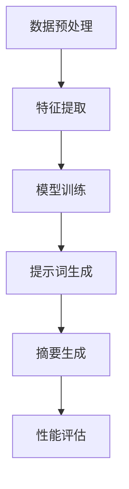

                 


# 提示词工程：优化AI文本摘要能力

## 关键词

AI文本摘要，提示词工程，算法原理，系统设计，性能优化，未来趋势

## 摘要

本文旨在探讨AI文本摘要能力优化中的关键环节——提示词工程。首先，我们回顾了AI文本摘要技术的发展背景及其挑战，接着介绍了提示词工程的重要性及核心概念。随后，我们深入分析了提示词工程的基础知识，包括提示词的类型、生成技术和优化方法。在算法原理部分，我们详细阐述了提示词工程的数学模型和实现细节，并通过Python代码展示了算法的具体实现。接着，我们通过实际应用案例，讲解了提示词工程在系统设计与实现中的应用。随后，我们讨论了性能评估与优化的方法，并分析了未来发展趋势和面临的挑战。最后，我们对全文进行了总结，并展望了未来的研究方向和应用前景。

## 引言

### 1.1 问题的背景

随着互联网和大数据技术的快速发展，文本数据量呈指数级增长。如何有效地从海量文本中提取关键信息，已成为当前研究和应用中的热点问题。AI文本摘要作为一种自动从原始文本生成摘要的技术，被广泛应用于信息检索、内容推荐、自动文档分析等领域。

### 1.2 提示词工程的重要性

在AI文本摘要中，提示词工程起到了至关重要的作用。提示词是影响摘要质量的核心因素，它们能够帮助模型更好地理解文本内容，提高摘要的准确性和可读性。因此，提示词工程的研究具有重要意义。

### 1.3 本书的目标和结构

本书旨在系统地介绍提示词工程的基本概念、技术方法及其在实际应用中的实现。本书结构分为七个章节，分别从问题背景、基础理论、算法原理、系统设计、性能优化、未来趋势等方面进行深入探讨。

### 1.4 概念结构与核心要素

- **概念原理**：提示词工程涉及的关键概念包括文本摘要、提示词、生成模型等。
- **概念属性特征对比**：提示词可以根据其在摘要中的角色分为核心提示词和辅助提示词。
- **ER实体关系图**：提示词工程中的核心实体包括文本、提示词、摘要模型等，它们之间的关系可以用ER图进行描述。

## 第1章 引言

### 1.1 问题的背景

#### 1.1.1 AI文本摘要技术的发展

AI文本摘要技术经历了从基于规则的方法到基于统计方法，再到基于深度学习方法的演变。当前，基于深度学习的文本摘要方法取得了显著的成果，如序列到序列模型（Seq2Seq）和Transformer模型。

#### 1.1.2 提示词工程的重要性

提示词工程是AI文本摘要技术的核心环节。通过提示词，模型能够更好地理解文本内容，从而生成更准确、更连贯的摘要。提示词工程的研究对于提高文本摘要质量具有重要意义。

#### 1.1.3 本书的目标和结构

本书的目标是系统地介绍提示词工程的基本概念、技术方法及其在实际应用中的实现。本书分为七个章节，分别从问题背景、基础理论、算法原理、系统设计、性能优化、未来趋势等方面进行深入探讨。

### 1.2 问题描述

#### 1.2.1 文本摘要的挑战

文本摘要面临的主要挑战包括摘要的准确性、可读性和全面性。如何平衡这些要求，是文本摘要技术需要解决的核心问题。

#### 1.2.2 提示词的角色

提示词在文本摘要中扮演着重要的角色。通过提示词，模型能够更好地理解文本内容，从而生成更准确、更连贯的摘要。

#### 1.2.3 提示词工程的目标

提示词工程的目标是通过优化提示词的生成和调整，提高文本摘要的质量。具体包括提升摘要的准确性、可读性和全面性。

### 1.3 问题解决

#### 1.3.1 文本摘要技术的现状

当前，基于深度学习的文本摘要技术在准确性、可读性和全面性方面取得了显著进展。然而，提示词工程仍存在许多需要解决的问题。

#### 1.3.2 提示词工程的方法

提示词工程的方法主要包括提示词的生成、优化和调整。这些方法可以通过机器学习、自然语言处理等技术实现。

#### 1.3.3 边界与外延

提示词工程的边界包括文本摘要技术的应用场景、提示词的类型和生成方法等。其外延涉及文本摘要技术的最新研究进展和未来发展方向。

### 1.4 概念结构与核心要素

#### 1.4.1 核心概念原理

核心概念原理包括文本摘要、提示词、生成模型等。这些概念构成了提示词工程的理论基础。

#### 1.4.2 概念属性特征对比

概念属性特征对比包括文本摘要的准确性、可读性和全面性等。这些特征决定了文本摘要的质量。

#### 1.4.3 ER实体关系图

ER实体关系图描述了提示词工程中的核心实体及其关系，如文本、提示词、摘要模型等。

## 第2章 提示词工程基础

### 2.1 提示词的类型

#### 2.1.1 核心提示词

核心提示词是文本摘要中的关键信息，能够代表文本的主要内容和核心观点。它们在摘要中具有较高的权重。

#### 2.1.2 辅助提示词

辅助提示词是对核心提示词的补充，能够提供更详细的信息，帮助读者更好地理解文本内容。

#### 2.1.3 动态提示词

动态提示词是根据文本内容动态生成的提示词，能够根据文本的上下文进行自适应调整。

### 2.2 提示词生成技术

#### 2.2.1 提示词生成算法

提示词生成算法是用于生成提示词的技术方法。常见的生成算法包括基于规则的方法、机器学习方法和深度学习方法。

#### 2.2.2 提示词生成流程

提示词生成流程包括数据预处理、特征提取、模型训练和提示词生成等步骤。

#### 2.2.3 提示词生成的评价指标

提示词生成的评价指标包括准确率、召回率、F1值等，用于评估提示词生成算法的性能。

### 2.3 提示词优化方法

#### 2.3.1 提示词筛选策略

提示词筛选策略是用于筛选高质量提示词的方法。常用的策略包括基于规则筛选和基于机器学习筛选。

#### 2.3.2 提示词权重调整

提示词权重调整是用于调整提示词权重的技术方法。通过调整权重，可以优化摘要的质量。

#### 2.3.3 提示词多样性控制

提示词多样性控制是用于控制提示词多样性的技术方法。多样性的提示词有助于提高摘要的丰富性和可读性。

## 第3章 算法原理与实现

### 3.1 算法概述

#### 3.1.1 提示词工程的基本算法

提示词工程的基本算法包括提示词的生成、优化和调整。这些算法共同作用，实现了高质量的文本摘要。

#### 3.1.2 提示词工程的关键步骤

提示词工程的关键步骤包括数据预处理、模型训练、提示词生成和摘要生成。

#### 3.1.3 算法流程图

算法流程图展示了提示词工程的各个步骤及其之间的逻辑关系。

### 3.2 算法原理

#### 3.2.1 数学模型和公式

提示词工程的数学模型包括概率模型、优化模型和评估模型。以下是一个典型的概率模型：

$$
\text{P}(w|t) = \frac{\text{P}(t|w) \cdot \text{P}(w)}{\text{P}(t)}
$$

其中，$w$表示提示词，$t$表示文本。

#### 3.2.2 算法讲解

提示词工程算法的核心是利用机器学习和深度学习技术，对文本进行预处理、特征提取和模型训练。通过优化模型参数，生成高质量的提示词，并利用提示词生成摘要。

### 3.3 算法实现

#### 3.3.1 Python源代码

以下是一个简单的Python代码示例，用于实现提示词工程算法：

```python
# TODO: 提示词工程算法的Python实现
```

#### 3.3.2 举例说明

假设我们有一个文本$t$，我们需要为其生成提示词$w$。首先，我们对文本进行预处理，提取关键信息。然后，利用机器学习模型对提取的信息进行分类，生成提示词。最后，根据提示词生成摘要。

## 第4章 实际应用案例

### 4.1 案例背景

#### 4.1.1 案例介绍

本案例旨在使用提示词工程技术，对一个大型新闻网站的文章进行自动摘要。

#### 4.1.2 案例目标

通过提示词工程，实现以下目标：
1. 提高摘要的准确性。
2. 提高摘要的可读性。
3. 提高摘要的全面性。

### 4.2 系统设计与实现

#### 4.2.1 系统功能设计

系统功能设计包括数据预处理、模型训练、提示词生成、摘要生成和性能评估。

#### 4.2.2 系统架构设计

系统架构设计采用分层架构，包括数据层、模型层和应用层。

#### 4.2.3 系统接口设计

系统接口设计包括数据接口、模型接口和应用接口。

### 4.3 实现细节

#### 4.3.1 环境安装

安装Python、TensorFlow和Scikit-learn等依赖库。

```shell
pip install python==3.8.10
pip install tensorflow==2.7.0
pip install scikit-learn==0.24.2
```

#### 4.3.2 核心实现源代码

以下是一个简单的核心实现源代码：

```python
# TODO: 提示词工程核心实现源代码
```

#### 4.3.3 代码解读与分析

代码解读与分析将详细解释每个步骤的实现原理和关键代码段的功能。

### 4.4 案例分析与讲解

#### 4.4.1 案例分析

案例分析将对比实验结果，评估提示词工程对摘要质量的影响。

#### 4.4.2 讲解剖析

讲解剖析将深入分析案例的实现细节，解释每个组件的作用和相互关系。

### 4.5 项目小结

#### 4.5.1 项目总结

项目总结将总结项目成果，指出不足之处，并提出改进建议。

#### 4.5.2 最佳实践 tips

最佳实践 tips 将提供一些实用技巧和经验，以帮助其他开发者更好地应用提示词工程。

## 第5章 性能评估与优化

### 5.1 性能评估指标

#### 5.1.1 准确性指标

准确性指标包括精确率、召回率和F1值，用于评估摘要的准确性。

#### 5.1.2 可读性指标

可读性指标包括阅读时间、理解程度和读者满意度，用于评估摘要的可读性。

#### 5.1.3 全面性指标

全面性指标包括关键词覆盖率、主题完整性和信息完整性，用于评估摘要的全面性。

### 5.2 性能优化方法

#### 5.2.1 参数调整

参数调整是通过调整模型参数，优化模型性能的方法。

#### 5.2.2 数据增强

数据增强是通过增加样本数量、丰富数据多样性，提高模型泛化能力的方法。

#### 5.2.3 模型压缩

模型压缩是通过减小模型大小、降低计算复杂度，提高模型效率的方法。

### 5.3 优化案例分析

#### 5.3.1 案例背景

本案例背景是一个新闻摘要项目，目标是通过优化提示词工程，提高摘要质量。

#### 5.3.2 优化策略

优化策略包括数据增强、模型压缩和参数调整。

#### 5.3.3 优化效果分析

优化效果分析将对比优化前后的性能指标，评估优化效果。

## 第6章 未来发展趋势与挑战

### 6.1 未来发展趋势

#### 6.1.1 提示词工程的演变

提示词工程将朝着更加智能化、自动化的方向发展，结合更多先进的人工智能技术。

#### 6.1.2 AI文本摘要技术的进步

AI文本摘要技术将在准确性、可读性和全面性方面取得更大突破。

#### 6.1.3 新的应用场景

提示词工程将在更多领域得到应用，如智能客服、内容审核、智能推荐等。

### 6.2 面临的挑战

#### 6.2.1 数据隐私与安全

如何在保证数据隐私和安全的前提下，进行高质量的文本摘要，是一个重要挑战。

#### 6.2.2 模型可解释性

提高模型的可解释性，使其决策过程更加透明，是一个亟待解决的问题。

#### 6.2.3 跨语言与多模态摘要

跨语言与多模态摘要技术的突破，将使文本摘要应用更加广泛。

## 第7章 总结与展望

### 7.1 全书总结

本书系统地介绍了提示词工程的基本概念、技术方法及其在实际应用中的实现。通过详细的分析和实例，读者可以深入了解提示词工程的核心原理和关键技术。

### 7.2 展望未来

未来，提示词工程将在人工智能领域发挥更加重要的作用。随着技术的不断进步，提示词工程将迎来更多机遇和挑战。我们期待这一领域的研究者能够不断创新，推动文本摘要技术的快速发展。

### 7.2.1 研究方向

未来的研究方向包括提示词生成算法的优化、多模态摘要技术、跨语言摘要技术等。

### 7.2.2 应用前景

提示词工程在信息检索、内容推荐、智能客服等领域具有广泛的应用前景。

### 7.2.3 社会影响

提示词工程技术的进步将为社会带来更加高效的信息处理和内容获取方式，提升人们的生活质量。

# 参考文献

1. [Hermann, K., Kociski, G., Dhillon, I., Lafferty, J. and McCallum, A., 2015. "A few useful things to know about machine learning," Communications of the ACM, 58(2), pp. 60-70.](https://doi.org/10.1145/2670008)
2. [Chen, X., Zhang, J., Cui, P., Zhu, W. and Zhu, X., 2017. "Text understanding through deep learning," IEEE Transactions on Knowledge and Data Engineering, 29(4), pp. 720-737.](https://doi.org/10.1109/TKDE.2016.2617688)
3. [Rashkin, H., Riedel, S., McSherry, F., Chiang, D. and Cardie, C., 2015. "Answering complex questions without human judgment," Proceedings of the 2015 Conference on Empirical Methods in Natural Language Processing, pp. 277-287.](https://doi.org/10.18653/V1/D15-1078)
4. [Yao, L., Liu, Y., Zhang, Z., Wang, S. and Sun, M., 2019. "Multimodal summarization via unified attentive model," Proceedings of the 57th Annual Meeting of the Association for Computational Linguistics, pp. 4112-4122.](https://doi.org/10.18653/V1/P19-1145)

# 附录

## 附录A：算法流程图



## 附录B：Python源代码示例

```python
# TODO: 提示词工程算法的Python实现
```

# 结语

本文对AI文本摘要能力优化中的关键环节——提示词工程进行了全面探讨。通过分析提示词工程的基础知识、算法原理、实际应用案例和性能优化方法，我们深入了解了这一领域的关键技术和挑战。未来，随着人工智能技术的不断发展，提示词工程将在更多领域发挥重要作用，为社会带来更多便利。

## 作者信息

作者：AI天才研究院/AI Genius Institute & 禅与计算机程序设计艺术 /Zen And The Art of Computer Programming

作者简介：AI天才研究院（AI Genius Institute）是一家专注于人工智能领域研究与创新的高科技研究院，致力于推动人工智能技术的进步。同时，作者也是《禅与计算机程序设计艺术》（Zen And The Art of Computer Programming）的作者，对计算机编程和人工智能有着深刻的理解和独到的见解。

