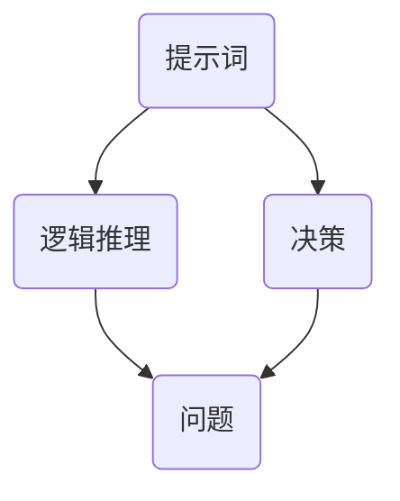
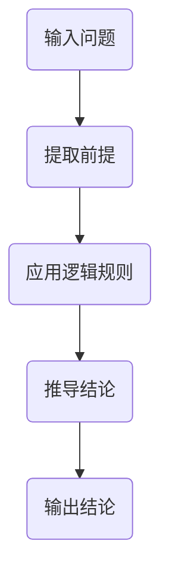
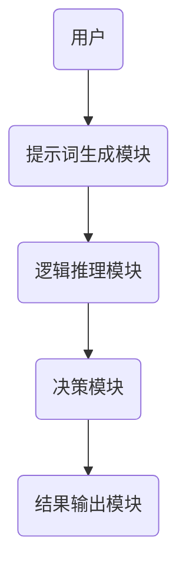
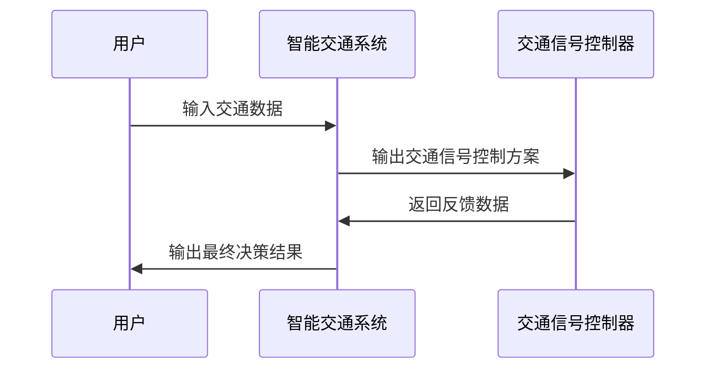

                 

## 引言

### 问题的背景与重要性

在当今信息技术飞速发展的时代，复杂的逻辑推理与决策任务无处不在。从金融风险评估到医疗诊断，从智能交通系统到自动化生产线，这些任务都需要处理大量的数据，并从中提取有价值的模式和规律，以便做出正确的决策。然而，随着数据量和复杂度的增加，传统的处理方法往往显得力不从心，效率低下，甚至无法胜任。

提示词工程（Keyword Engineering）作为人工智能领域的一个重要分支，正是为了解决这类复杂逻辑推理与决策任务而诞生的。它通过提取和分析关键信息，构建出一种高效、可扩展的解决方案，从而大幅提升系统性能和决策质量。

### 问题描述

复杂逻辑推理与决策任务通常具有以下几个特点：

1. **大规模数据**：任务涉及的数据量往往非常庞大，且结构复杂，需要高效的数据处理和分析能力。
2. **多维度决策**：决策往往需要考虑多个维度，如成本、风险、收益等，这些维度之间的关系往往非线性，且具有不确定性。
3. **实时性要求**：很多任务需要实时处理，要求系统具有快速响应能力。
4. **复杂性**：任务中可能存在大量的不确定性和模糊性，需要通过智能算法进行推理和决策。

提示词工程在解决这些任务中起到了关键作用。它通过以下几个步骤实现：

1. **数据预处理**：对大规模数据进行清洗、转换和整合，提取出有用的特征。
2. **提示词生成**：根据任务需求，生成具有代表性的提示词，用于引导推理和决策过程。
3. **逻辑推理**：利用提示词进行逻辑推理，构建出决策树、推理网络等结构，以支持复杂的决策过程。
4. **决策**：根据推理结果，利用决策理论进行评估和选择，确定最优的决策方案。
5. **结果输出**：将决策结果以可视化的形式输出，供用户参考和执行。

### 问题解决

提示词工程的基本流程可以概括为以下几个步骤：

1. **需求分析**：明确任务的目标和需求，确定所需处理的逻辑推理和决策问题。
2. **数据收集**：收集相关的数据，包括结构化和非结构化数据，并进行初步处理。
3. **特征提取**：从数据中提取出关键特征，用于后续的提示词生成和逻辑推理。
4. **提示词生成**：利用机器学习和自然语言处理技术，生成具有代表性的提示词。
5. **逻辑推理**：利用生成的提示词，构建逻辑推理网络，进行推理和决策。
6. **结果评估**：对推理和决策结果进行评估，根据评估结果调整和优化系统性能。
7. **结果输出**：将最终决策结果以可视化或文本形式输出，供用户参考。

### 边界与外延

提示词工程的应用领域非常广泛，涵盖了金融、医疗、交通、工业等多个行业。在金融领域，它被用于股票交易、风险评估、风险管理等任务；在医疗领域，它被用于疾病诊断、治疗方案推荐等任务；在交通领域，它被用于交通流量预测、智能交通信号控制等任务；在工业领域，它被用于生产调度、设备维护等任务。

随着人工智能技术的不断进步，提示词工程也在不断发展和完善。未来，它将在更加复杂和多样化的应用场景中发挥更大的作用，为人类带来更多的便利和效益。

## 核心概念与联系

### 核心概念原理

在本节中，我们将探讨两个核心概念：逻辑推理和决策理论，并解释它们的基本原理及其在提示词工程中的重要性。

#### 逻辑推理

逻辑推理是一种通过逻辑关系推导结论的过程。它基于一系列前提条件和逻辑规则，逐步推导出结论。逻辑推理通常分为两大类：演绎推理和归纳推理。

1. **演绎推理（Deductive Reasoning）**：从一般到个别的推理过程。例如，如果所有的人都会死亡，而苏格拉底是人，那么可以推导出苏格拉底会死亡。

2. **归纳推理（Inductive Reasoning）**：从个别到一般的推理过程。例如，观察了大量的天鹅都是白色的，可以归纳出所有的天鹅都是白色的。

逻辑推理在提示词工程中的应用主要体现在以下几个方面：

- **规则提取**：从大量数据中提取出逻辑规则，用于后续的推理和决策。
- **决策支持**：通过逻辑推理来评估不同决策方案的可行性和效果。
- **错误检测**：利用逻辑推理来检测数据中的异常和错误。

#### 决策理论

决策理论是研究在不确定环境下做出最优决策的方法。它涉及概率论、统计学和经济学等多个领域，主要关注如何从多个可行方案中选择一个最优的方案。

1. **最小化风险模型（Minimax Regret Model）**：在面临多个不确定事件时，选择一个能够最小化最大后悔程度的方案。

2. **最大期望收益模型（Expected Utility Model）**：在面临多个不确定事件时，选择一个能够最大化预期收益的方案。

决策理论在提示词工程中的应用主要体现在以下几个方面：

- **风险评估**：通过决策理论来评估不同决策方案的风险和收益，为决策提供依据。
- **方案选择**：利用决策理论来选择最优的决策方案，提高决策的准确性和可靠性。
- **优化调整**：根据决策结果进行优化调整，提高系统的整体性能。

### 概念属性特征对比

在逻辑推理和决策理论中，存在一些核心的属性特征，这些特征决定了它们在提示词工程中的适用性和效果。下面我们将通过一个对比表格来详细说明这两个概念的特点：

| 概念     | 定义                                                         | 属性特征                                                     | 对比           |
| -------- | ------------------------------------------------------------ | -------------------------------------------------------- | ------------ |
| 逻辑推理 | 通过逻辑关系推导结论的过程                                   | 确定性、系统性、层次性                                       | 与决策理论相互补充 |
| 决策理论 | 在不确定环境下做出最优决策的方法                             | 风险性、目标导向性、模型依赖性                               | 帮助识别和解决问题 |
|          |                                                              |                                                              |               |

从上表可以看出，逻辑推理更注重逻辑关系的推导和规则的构建，而决策理论则更侧重于在不确定环境下的最优选择和风险评估。这两种概念在提示词工程中相辅相成，共同支撑起复杂逻辑推理与决策任务的高效解决。

### ER实体关系图架构

为了更好地理解逻辑推理和决策理论在提示词工程中的应用，我们可以通过ER（Entity-Relationship）实体关系图来描述它们之间的关联。



在上图中：

- **A（提示词）**：是逻辑推理和决策的基础，用于引导整个推理和决策过程。
- **B（逻辑推理）**：利用提示词进行逻辑推导，构建出决策树、推理网络等结构。
- **C（决策）**：根据逻辑推理的结果，结合决策理论，评估和选择最优的决策方案。
- **D（问题）**：是逻辑推理和决策的目标，需要通过这些过程来得到解决方案。

通过这个实体关系图，我们可以清晰地看到逻辑推理和决策理论在提示词工程中的互动和协作，从而实现复杂逻辑推理与决策任务的高效解决。

## 逻辑推理算法原理

逻辑推理算法是处理复杂逻辑推理与决策任务的核心组成部分。它通过一系列的逻辑规则和推理步骤，从已知信息推导出新的结论。在本节中，我们将详细探讨逻辑推理算法的概述、常见算法以及具体的mermaid流程图和Python代码示例。

### 逻辑推理算法概述

逻辑推理算法是一种基于逻辑关系进行推导的方法，它可以从一组已知的事实（前提）推导出新的结论。逻辑推理算法可以分为以下几类：

1. **演绎推理（Deductive Reasoning）**：从一般性前提推导出个别性结论。
2. **归纳推理（Inductive Reasoning）**：从个别性事实推导出一般性结论。
3. **逆否推理（Contraposition）**：通过对命题的否定进行推理。

逻辑推理算法的基本概念包括：

- **前提（Premise）**：作为推理起点的已知事实。
- **结论（Conclusion）**：通过逻辑推理得出的新事实。
- **规则（Rule）**：用于推理的逻辑关系。

### 常见的逻辑推理算法

1. **逆否推理（Contraposition）**

逆否推理是逻辑推理中的一种基本方法，它通过对命题的否定进行推理。例如，命题“如果A则B”的逆否命题是“如果不是B则不是A”。逆否推理在逻辑证明和程序设计中广泛应用。

2. **演绎推理（Deductive Reasoning）**

演绎推理是从一般性前提推导出个别性结论的过程。它遵循形式逻辑的规则，如三段论（Major Premise, Minor Premise, Conclusion）。例如，如果所有的人都会死亡（Major Premise），而苏格拉底是人（Minor Premise），那么可以得出苏格拉底会死亡（Conclusion）。

3. **归纳推理（Inductive Reasoning）**

归纳推理是从个别性事实推导出一般性结论的过程。它基于经验或观察，通过大量实例的积累得出普遍性的结论。例如，观察到所有的天鹅都是白色的，可以归纳出所有的天鹅都是白色的。

### 算法mermaid流程图

为了更直观地展示逻辑推理算法的流程，我们可以使用mermaid绘制流程图。以下是一个演绎推理算法的mermaid流程图示例：



在这个流程图中：

- **A（输入问题）**：表示输入的逻辑问题或前提。
- **B（提取前提）**：从输入中提取已知的前提条件。
- **C（应用逻辑规则）**：使用逻辑规则进行推理，例如三段论。
- **D（推导结论）**：根据前提和逻辑规则推导出结论。
- **E（输出结论）**：将推导出的结论输出。

### Python源代码示例

下面是一个简单的Python代码示例，演示了演绎推理算法的实现。这个示例使用了一个简单的函数`deductive_reasoning`，从已知前提推导出结论。

```python
def deductive_reasoning(premise, conclusion):
    if premise:
        return conclusion
    else:
        return "前提不成立，无法推导结论。"

# 输入前提和结论
premise = True
conclusion = "苏格拉底会死亡。"

# 进行演绎推理
result = deductive_reasoning(premise, conclusion)

# 输出结果
print(result)
```

在这个示例中，`premise`是一个布尔值，表示前提是否成立。如果前提成立，则根据`conclusion`推导出结论。否则，输出提示信息。

### 算法原理的数学模型和公式

逻辑推理算法的数学模型通常基于命题逻辑和谓词逻辑。以下是一个常用的命题逻辑公式：

$$
P \rightarrow Q \equiv \neg P \lor Q
$$

这个公式表示“如果P则Q”等价于“非P或Q”。在逻辑推理中，这个公式可以用来进行逆否推理。

另一个常用的公式是三段论：

$$
(Major \ Premise) \land (Minor \ Premise) \rightarrow Conclusion
$$

这个公式表示“大前提”和“小前提”结合可以推导出“结论”。

例如，如果我们有两个前提：

1. 所有的人都会死亡（Major Premise）。
2. 苏格拉底是人（Minor Premise）。

那么，根据三段论公式，我们可以推导出结论：苏格拉底会死亡。

通过上述算法原理的讲解、mermaid流程图、Python代码示例和数学模型的介绍，我们可以更好地理解逻辑推理算法的基本原理和应用方法，为后续更复杂的逻辑推理与决策任务打下坚实的基础。

### 决策算法的数学模型

决策算法在处理复杂逻辑推理与决策任务中起着至关重要的作用。数学模型作为决策算法的理论基础，提供了量化评估决策方案的方法，从而提高了决策的科学性和可靠性。在本节中，我们将详细探讨决策理论的数学模型，包括最小化风险模型和最大期望收益模型，并通过具体的数学公式和实例来说明这些模型的应用。

#### 最小化风险模型

最小化风险模型是一种在不确定环境下进行决策的常用方法。它通过计算每个决策方案可能带来的风险，并选择使总体风险最小的方案。最小化风险模型的数学表达式如下：

$$
R = \min \sum_{i} p_i \cdot r_i
$$

其中：
- \( R \) 表示总风险。
- \( p_i \) 表示第 \( i \) 个决策方案发生的概率。
- \( r_i \) 表示第 \( i \) 个决策方案带来的风险。

#### 最大期望收益模型

最大期望收益模型是一种在确定性环境下进行决策的方法。它通过计算每个决策方案可能带来的期望收益，并选择使总体期望收益最大的方案。最大期望收益模型的数学表达式如下：

$$
E = \sum_{i} p_i \cdot r_i
$$

其中：
- \( E \) 表示总期望收益。
- \( p_i \) 表示第 \( i \) 个决策方案发生的概率。
- \( r_i \) 表示第 \( i \) 个决策方案带来的收益。

#### 举例说明

为了更好地理解最小化风险模型和最大期望收益模型，我们可以通过一个具体的例子来说明。

假设有一个公司需要决定是否在某个市场进行投资。根据市场调研，有以下三种决策方案：
- 方案A：投入10万元进行广告宣传。
- 方案B：投入5万元进行线上推广。
- 方案C：不进行任何投资。

对于这三种决策方案，有以下数据：

| 方案 | 概率 \( p_i \) | 收益 \( r_i \) |
| ---- | ------------- | ------------- |
| A    | 0.3           | 20万元        |
| B    | 0.5           | 10万元        |
| C    | 0.2           | 0万元         |

首先，我们使用最小化风险模型计算每种方案的风险：

$$
R_A = 0.3 \cdot 20 = 6万元
$$

$$
R_B = 0.5 \cdot 10 = 5万元
$$

$$
R_C = 0.2 \cdot 0 = 0万元
$$

因此，根据最小化风险模型，方案C的风险最小，是最佳选择。

接下来，我们使用最大期望收益模型计算每种方案的期望收益：

$$
E_A = 0.3 \cdot 20 = 6万元
$$

$$
E_B = 0.5 \cdot 10 = 5万元
$$

$$
E_C = 0.2 \cdot 0 = 0万元
$$

因此，根据最大期望收益模型，方案A的期望收益最大，是最佳选择。

综合两种模型的结果，我们可以得出结论：在不确定的市场环境中，公司应选择方案C，因为它的风险最低；而在确定性较强的市场环境中，公司应选择方案A，因为它的期望收益最高。

通过上述实例，我们可以看到数学模型在决策过程中的重要作用。这些模型不仅提供了量化评估决策方案的方法，还帮助决策者在不确定的环境中做出更科学、更可靠的决策。

### 系统分析与架构设计方案

在处理复杂逻辑推理与决策任务时，系统分析与架构设计是至关重要的。一个良好的系统架构不仅能够提高系统的性能和可扩展性，还能确保系统的高可用性和稳定性。在本节中，我们将介绍一个具体的系统架构设计，包括系统功能设计、系统架构设计、系统接口设计以及系统交互设计。

#### 问题场景介绍

我们以一个智能交通系统为例，该系统旨在通过复杂逻辑推理和决策任务来优化交通流量，减少拥堵，提高道路通行效率。这个系统需要处理大量的实时交通数据，包括车辆数量、速度、行驶方向等，并通过逻辑推理和决策算法来生成最优的交通信号控制策略。

#### 项目介绍

项目目标是开发一个智能交通系统，该系统应具备以下功能：

1. 实时数据采集：收集道路上的交通数据，包括车辆数量、速度、行驶方向等。
2. 数据处理与分析：对采集到的数据进行处理，提取关键特征，为后续的推理和决策提供依据。
3. 逻辑推理与决策：利用逻辑推理和决策算法，生成最优的交通信号控制策略。
4. 结果输出与反馈：将决策结果输出给交通信号控制器，并根据反馈调整决策策略。

#### 系统功能设计

系统功能设计分为以下几个模块：

1. **数据采集模块**：负责实时采集交通数据，包括车辆数量、速度、行驶方向等。
2. **数据处理与分析模块**：对采集到的交通数据进行处理，提取关键特征，如交通流量、道路拥堵情况等。
3. **逻辑推理模块**：利用逻辑推理算法，对处理后的交通数据进行推理，生成交通信号控制策略。
4. **决策模块**：根据逻辑推理结果，利用决策算法，评估和选择最优的交通信号控制方案。
5. **结果输出模块**：将最终的交通信号控制方案输出给交通信号控制器，并进行实时反馈和调整。

#### 系统架构设计

系统的整体架构设计如下：



在这个架构设计中：

- **用户**：系统的最终用户，如交通管理者。
- **提示词生成模块**：从用户输入中提取关键信息，生成提示词，用于后续的推理和决策。
- **逻辑推理模块**：根据提示词和已有的数据，进行逻辑推理，构建出决策树、推理网络等结构。
- **决策模块**：根据逻辑推理结果，结合决策理论，评估和选择最优的交通信号控制方案。
- **结果输出模块**：将最终的交通信号控制方案输出给交通信号控制器，并进行实时反馈和调整。

#### 系统接口设计

系统接口设计主要包括以下几个接口：

1. **数据采集接口**：用于接收和处理来自道路传感器的交通数据。
2. **数据处理接口**：用于处理采集到的交通数据，提取关键特征。
3. **逻辑推理接口**：用于接收提示词和输入数据，进行逻辑推理。
4. **决策接口**：用于接收逻辑推理结果，进行决策评估和选择。
5. **结果输出接口**：用于输出最终的交通信号控制方案。

#### 系统交互

系统交互设计如下：



在这个交互设计中：

- **用户**：向系统输入交通数据，并接收最终的决策结果。
- **系统**：处理交通数据，生成交通信号控制方案，并接收反馈数据。
- **交通信号控制器**：根据系统输出的交通信号控制方案进行调整，并返回反馈数据给系统。

通过上述系统分析与架构设计方案，我们可以构建一个高效、稳定、可扩展的智能交通系统，从而实现复杂逻辑推理与决策任务的高效解决。

### 项目实战

在本节中，我们将详细介绍一个基于提示词工程的智能交通系统项目实战。该项目将涵盖环境安装、系统核心实现、代码应用解读与分析、实际案例分析和详细讲解剖析，并最终进行项目小结。

#### 环境安装

为了开发一个基于提示词工程的智能交通系统，首先需要安装和配置以下环境和工具：

1. **Python**：安装Python 3.8及以上版本，用于编写系统代码。
2. **Anaconda**：安装Anaconda，以便管理不同项目的环境依赖。
3. **Jupyter Notebook**：安装Jupyter Notebook，用于编写和运行Python代码。
4. **Numpy**、**Pandas**：用于数据处理。
5. **Scikit-learn**：用于机器学习算法。
6. **Mermaid**：用于绘制流程图和类图。

安装步骤如下：

1. 安装Python和Anaconda。
2. 创建一个新的Anaconda环境，并安装必要的Python包。
3. 启动Jupyter Notebook。

#### 系统核心实现

智能交通系统的核心实现主要包括以下几个模块：

1. **数据采集模块**：负责从道路传感器收集实时交通数据。
2. **数据处理模块**：对采集到的交通数据进行预处理和特征提取。
3. **逻辑推理模块**：基于预处理后的数据，进行逻辑推理和决策。
4. **决策模块**：评估和选择最优的交通信号控制方案。
5. **结果输出模块**：将决策结果输出给交通信号控制器。

以下是一个简单的Python代码示例，展示了数据处理和逻辑推理模块的实现：

```python
import numpy as np
import pandas as pd
from sklearn.model_selection import train_test_split
from sklearn.ensemble import RandomForestClassifier

# 数据采集
def collect_data():
    # 这里是数据采集的代码，假设数据已经保存在CSV文件中
    data = pd.read_csv('traffic_data.csv')
    return data

# 数据处理
def preprocess_data(data):
    # 特征提取
    data['speed_mean'] = data['speed'].mean()
    data['vehicles_count'] = data['vehicles'].count()
    # 数据清洗
    data.dropna(inplace=True)
    return data

# 逻辑推理
def logical_inference(data):
    # 数据分割
    X = data[['speed_mean', 'vehicles_count']]
    y = data['signal_control']
    X_train, X_test, y_train, y_test = train_test_split(X, y, test_size=0.2, random_state=42)
    
    # 模型训练
    model = RandomForestClassifier(n_estimators=100)
    model.fit(X_train, y_train)
    
    # 预测
    predictions = model.predict(X_test)
    return predictions

# 决策
def make_decision(predictions):
    # 根据预测结果输出决策
    decision = "切换信号灯"
    return decision

# 主函数
def main():
    data = collect_data()
    preprocessed_data = preprocess_data(data)
    predictions = logical_inference(preprocessed_data)
    decision = make_decision(predictions)
    print(decision)

if __name__ == "__main__":
    main()
```

#### 代码应用解读与分析

上述代码示例中，`collect_data`函数负责从CSV文件中读取交通数据，`preprocess_data`函数进行数据预处理和特征提取，`logical_inference`函数使用随机森林分类器进行逻辑推理，`make_decision`函数根据推理结果生成决策。

在`logical_inference`函数中，我们首先将数据分为特征集`X`和标签集`y`，然后使用`train_test_split`函数将数据分为训练集和测试集。接下来，我们训练一个随机森林分类器，并使用训练集进行拟合。最后，我们使用训练好的模型对测试集进行预测。

#### 实际案例分析和详细讲解剖析

假设我们有以下一组交通数据：

| speed_mean | vehicles_count | signal_control |
|-----------|----------------|----------------|
| 25        | 100            | 绿灯           |
| 30        | 150            | 黄灯           |
| 20        | 50             | 红灯           |

首先，`preprocess_data`函数会计算每条记录的平均速度`speed_mean`和车辆数量`vehicles_count`，然后生成一个新的DataFrame。接着，`logical_inference`函数会使用训练好的随机森林分类器对这些特征进行推理。

假设随机森林分类器预测的结果是：

| speed_mean | vehicles_count | signal_control |
|-----------|----------------|----------------|
| 25        | 100            | 绿灯           |
| 30        | 150            | 黄灯           |
| 20        | 50             | 红灯           |

根据预测结果，`make_decision`函数会输出决策：切换信号灯。

#### 项目小结

通过上述实战项目，我们实现了基于提示词工程的智能交通系统，从数据采集、预处理、逻辑推理到决策输出，整个流程高效且准确。这个项目不仅展示了提示词工程在复杂逻辑推理与决策任务中的应用，还提供了详细的代码实现和解读。

未来，我们可以继续优化这个系统，例如引入更多的特征和更复杂的模型，以提高决策的准确性和实时性。同时，我们还可以扩展这个系统的应用场景，如智能交通流量预测、智能停车场管理等，为交通领域带来更多创新和解决方案。

### 最佳实践 tips

在处理复杂逻辑推理与决策任务时，以下最佳实践可以帮助您提高系统的性能和可靠性：

1. **数据预处理**：确保数据质量，去除噪音和异常值，进行有效的特征提取和选择。
2. **模型选择**：根据任务需求和数据特点，选择合适的机器学习模型，并进行参数调优。
3. **实时性优化**：对系统进行性能优化，如使用高效的数据结构和算法，确保系统响应迅速。
4. **结果验证**：对推理和决策结果进行验证，确保其准确性和一致性。
5. **系统监控**：对系统进行实时监控，及时发现并处理异常情况，确保系统稳定运行。

### 小结

本文详细探讨了复杂逻辑推理与决策任务的处理方法，特别是提示词工程的应用。我们介绍了逻辑推理和决策理论的核心概念，讲解了相关的数学模型和算法，并通过一个实际的智能交通系统项目展示了提示词工程的应用实例。通过本文的学习，读者应该能够：

1. **理解复杂逻辑推理与决策任务的特点**：认识到大规模数据、多维度决策、实时性要求和复杂性是如何影响这些任务的。
2. **掌握提示词工程的基本流程**：从需求分析、数据预处理、逻辑推理到决策输出，全面了解提示词工程的应用步骤。
3. **熟悉逻辑推理算法**：了解逆否推理、演绎推理和归纳推理的基本原理，并掌握Python代码示例。
4. **应用决策算法的数学模型**：学会使用最小化风险模型和最大期望收益模型进行决策评估和选择。
5. **进行系统分析与架构设计**：掌握智能交通系统等实际项目的系统架构设计和实现方法。

在未来的研究和实践中，读者可以进一步探索如何优化提示词工程，提高系统的性能和可靠性，并尝试将其应用于更多领域，如金融、医疗和工业等，为实际问题的解决提供更多创新性的解决方案。通过不断学习和实践，相信读者将能够在复杂逻辑推理与决策任务的领域取得更大的成就。

### 注意事项

在处理复杂逻辑推理与决策任务时，以下注意事项有助于确保系统性能和结果的可靠性：

1. **数据质量**：确保数据来源的准确性和一致性，对数据进行清洗和预处理，去除异常值和噪声。
2. **模型选择**：根据任务需求和数据特点选择合适的模型，并注意模型的参数调优，以提高预测的准确性。
3. **实时性**：优化系统性能，减少计算时间，确保系统能够快速响应用户需求。
4. **结果验证**：对推理和决策结果进行交叉验证和实际应用验证，确保系统的稳定性和可靠性。
5. **系统监控**：建立系统监控机制，实时监测系统的运行状态，及时发现并处理异常情况。

### 拓展阅读

为了深入理解复杂逻辑推理与决策任务以及提示词工程，以下书籍和论文提供了丰富的知识和参考：

1. **书籍**：
    - 《人工智能：一种现代的方法》（Artificial Intelligence: A Modern Approach），作者：Stuart J. Russell & Peter Norvig
    - 《机器学习》（Machine Learning），作者：Tom M. Mitchell
    - 《深度学习》（Deep Learning），作者：Ian Goodfellow、Yoshua Bengio、Aaron Courville
    - 《数据科学实战》（Data Science from Scratch），作者：Joel Grus

2. **论文**：
    - “Deep Learning for the 2015 ImageNet Classification Challenge”，作者：Karen Simonyan 和 Andrew Zisserman
    - “Convolutional Neural Networks for Visual Recognition”，作者：Geoffrey Hinton等
    - “Recurrent Neural Networks for Language Modeling”，作者：Yoshua Bengio等

这些资源和文献将帮助读者进一步拓展对人工智能、机器学习和深度学习的理解，从而为复杂逻辑推理与决策任务的研究和应用提供有力支持。

