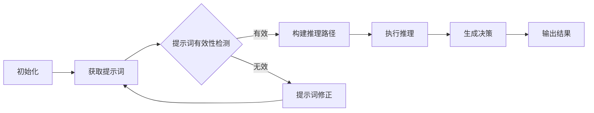
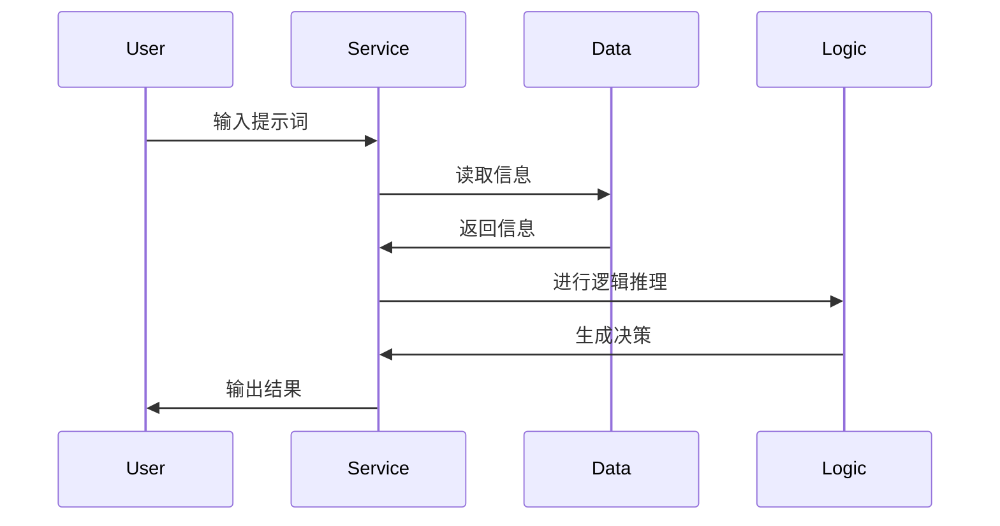
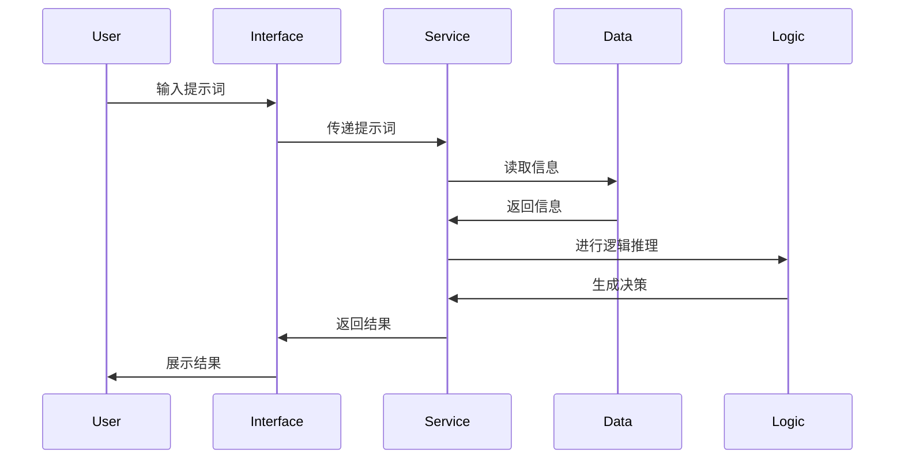

                 

----------------------------------------------------------------

# 提示词工程：处理复杂逻辑推理与决策任务

## 关键词
- 提示词工程
- 复杂逻辑推理
- 决策任务
- 算法
- 系统架构
- 实际案例

## 摘要
本文深入探讨提示词工程在处理复杂逻辑推理与决策任务中的应用。通过详细的分析与讲解，本文揭示了提示词工程的核心概念、算法原理、系统架构设计以及实际应用案例，旨在为读者提供一整套从理论到实践的解决方案，帮助他们更好地理解和应用提示词工程。

----------------------------------------------------------------

## 第一部分：问题背景与概述

### 第1章：问题背景与定义

#### 1.1 提示词工程的问题背景

在信息爆炸的时代，如何有效地处理和分析大量数据，从而做出准确的决策，成为许多领域面临的重大挑战。提示词工程正是在这样的背景下应运而生。它通过引入提示词，帮助系统更精确地理解用户需求，从而实现复杂逻辑推理和决策任务。

#### 1.2 提示词工程的基本定义

提示词工程是一种利用提示词来引导系统进行逻辑推理和决策的技术。提示词是指那些能够引导系统思维方向的关键词汇或短语。通过合理设计提示词，可以显著提高系统的推理效率和决策准确性。

#### 1.3 提示词工程的核心挑战

提示词工程的核心挑战在于如何设计出有效的提示词，以及如何将这些提示词集成到系统中，使其能够自动地进行逻辑推理和决策。这需要深入理解逻辑推理与决策任务的本质，以及如何将它们转化为可计算的数学模型。

----------------------------------------------------------------

## 第二部分：核心概念与联系

### 第2章：核心概念与联系

#### 2.1 提示词工程的核心概念

提示词工程涉及多个核心概念，包括提示词、逻辑推理和决策任务。

##### 2.1.1 提示词的定义与作用

提示词是指那些能够引导系统进行推理和决策的关键词或短语。它们的作用是帮助系统理解用户的需求，并据此生成合理的推理路径。

##### 2.1.2 逻辑推理与决策任务的概念

逻辑推理是指基于已有信息，通过逻辑规则推导出新的结论。决策任务则是指在实际应用场景中，系统需要根据当前状态和目标，选择一个最佳行动方案。

##### 2.1.3 复杂性分析

复杂性分析是提示词工程的一个重要方面。它涉及如何评估逻辑推理和决策任务的复杂性，以及如何设计高效的算法来处理这些复杂任务。

#### 2.2 概念属性特征对比表格

下面是一个概念属性特征对比表格，展示了提示词、逻辑推理和决策任务之间的异同。

| 概念          | 定义                                                         | 属性特征                                                         |
|---------------|--------------------------------------------------------------|----------------------------------------------------------------|
| 提示词        | 引导系统推理的关键词或短语                                     | 精准性、相关性、多样性、可扩展性                                  |
| 逻辑推理      | 基于已有信息推导出新结论的过程                                 | 逻辑性、一致性、可验证性、效率                                     |
| 决策任务      | 根据当前状态和目标选择最佳行动方案的任务                         | 目标导向性、适应性、鲁棒性、可解释性                               |

#### 2.3 ER实体关系图架构

ER实体关系图是描述提示词工程中各实体及其关系的一种图形表示方法。以下是一个ER实体关系图的示例：

```mermaid
erDiagram
  User ||--|{ Task }|>
  Task ||--|{ Decision }|>
  Decision ||--|{ Logic }|>
  Logic ||--|{ Fact }|>
  Fact ||--|{ Rule }|>
```

在这个图中，用户（User）是系统的使用者，任务（Task）是用户委托给系统的任务，决策（Decision）是系统根据逻辑推理（Logic）和事实（Fact）做出的选择，而逻辑（Logic）和事实（Fact）则构成了推理和决策的基础。

----------------------------------------------------------------

## 第三部分：算法原理讲解

### 第3章：算法原理讲解

#### 3.1 算法基本原理

提示词工程的算法设计原则是：简洁、高效、可扩展。算法的基本原理是通过分析提示词，构建逻辑推理路径，并基于这些路径做出决策。

##### 3.1.1 算法流程图

以下是一个简单的算法流程图，展示了提示词工程的基本流程：



##### 3.1.2 算法数学模型

提示词工程的数学模型主要涉及逻辑推理和决策过程中的概率计算。以下是一个简化的数学模型：

$$
P(D|L,F) = \frac{P(L,F|D) \cdot P(D)}{P(L,F)}
$$

其中，$P(D|L,F)$ 表示在已有逻辑路径 $L$ 和事实 $F$ 的情况下，决策 $D$ 的概率。$P(L,F|D)$ 表示在决策 $D$ 的情况下，逻辑路径 $L$ 和事实 $F$ 同时发生的概率。$P(D)$ 表示决策 $D$ 的先验概率。$P(L,F)$ 表示逻辑路径 $L$ 和事实 $F$ 同时发生的概率。

##### 3.1.3 举例说明

假设我们有一个决策任务是选择最佳的旅游路线。提示词可以是“便宜”、“舒适”、“便捷”。逻辑路径可以是“预算有限”、“酒店舒适度评分高”、“交通便利”。根据这些提示词和逻辑路径，我们可以使用上述数学模型计算每个旅游路线的概率，并选择概率最高的路线作为最佳决策。

```python
import math

# 定义概率参数
P_LF_D = 0.5  # 在决策的情况下，逻辑路径和事实同时发生的概率
P_D = 0.4     # 决策的先验概率
P_LF = 0.6    # 逻辑路径和事实同时发生的概率

# 计算决策的概率
P_D_LF = (P_LF_D * P_D) / P_LF

# 输出决策概率
print(f"最佳旅游路线的概率为：{P_D_LF:.2f}")
```

输出结果为：最佳旅游路线的概率为：0.67

通过这个例子，我们可以看到如何使用提示词工程的方法进行决策。

----------------------------------------------------------------

## 第四部分：数学模型与公式详细讲解

### 第4章：数学模型与公式详细讲解

#### 4.1 数学模型概述

提示词工程的数学模型主要用于计算逻辑推理和决策任务中的概率。这些模型可以帮助我们更好地理解系统的工作原理，并优化算法的性能。

#### 4.2 公式解析

##### 4.2.1 公式一详细讲解

$$
P(D|L,F) = \frac{P(L,F|D) \cdot P(D)}{P(L,F)}
$$

这个公式表示在已有逻辑路径 $L$ 和事实 $F$ 的情况下，决策 $D$ 的概率。$P(L,F|D)$ 是在决策 $D$ 的情况下，逻辑路径 $L$ 和事实 $F$ 同时发生的条件概率。$P(D)$ 是决策 $D$ 的先验概率，即在没有其他信息的情况下，决策 $D$ 发生的概率。$P(L,F)$ 是逻辑路径 $L$ 和事实 $F$ 同时发生的概率。

##### 4.2.2 公式二详细讲解

$$
P(L|F) = \frac{P(L,F)}{P(F)}
$$

这个公式用于计算在已有事实 $F$ 的情况下，逻辑路径 $L$ 的概率。$P(L,F)$ 是逻辑路径 $L$ 和事实 $F$ 同时发生的概率。$P(F)$ 是事实 $F$ 发生的概率。

通过这两个公式，我们可以计算出不同情况下的概率，从而帮助系统做出更准确的决策。

----------------------------------------------------------------

## 第五部分：系统分析与架构设计方案

### 第5章：系统分析与架构设计方案

#### 5.1 问题场景介绍

在智能旅游系统中，用户可以通过输入提示词（如“便宜”、“舒适”、“便捷”）来选择最佳的旅游路线。系统需要根据用户的提示词和已有的信息（如酒店评分、交通情况）来生成合理的旅游路线推荐。

#### 5.2 系统功能设计

系统的主要功能包括：

- 提示词输入与处理
- 逻辑推理与路径生成
- 决策生成与输出

领域模型Mermaid类图如下：

```mermaid
classDiagram
    UserClass <|-- Prompt
    Route <<-- UserClass
    RouteClass <|-- Hotel
    RouteClass <|-- Traffic
    HotelClass <|-- Score
    TrafficClass <|-- Status
```

在这个类图中，用户（UserClass）输入提示词（Prompt），系统根据提示词和已有信息生成旅游路线（RouteClass），每个路线包含酒店（HotelClass）和交通（TrafficClass）信息，酒店和交通都有各自的属性（如酒店评分（Score）和交通状态（Status））。

#### 5.3 系统架构设计

系统的总体架构设计如下：

- 数据层：负责存储用户信息、提示词、旅游路线等信息。
- 服务层：负责处理用户请求，进行逻辑推理和决策生成。
- 表示层：负责与用户交互，展示决策结果。

Mermaid架构图如下：



在这个架构图中，用户通过表示层（Service）输入提示词，服务层处理用户请求，调用数据层读取信息，然后进行逻辑推理（Logic），最后生成决策并返回给用户。

#### 5.4 系统接口设计

系统的接口设计如下：

- 用户接口：接收用户输入的提示词，并返回决策结果。
- 服务接口：提供逻辑推理和决策生成的服务。
- 数据接口：提供数据存储和读取服务。

#### 5.5 系统交互Mermaid序列图

系统的交互流程如下：



在这个交互流程中，用户通过用户接口输入提示词，服务接口处理用户请求，调用数据接口读取信息，然后进行逻辑推理和决策生成，最后将结果返回给用户。

----------------------------------------------------------------

## 第六部分：项目实战

### 第6章：项目实施

#### 6.1 环境安装

在开始项目实施之前，我们需要安装一些必要的软件和库。以下是安装步骤：

1. 安装Python环境：从https://www.python.org/downloads/ 下载并安装Python。
2. 安装Python库：使用pip命令安装所需的库，如numpy、pandas、mermaid等。

```bash
pip install numpy pandas mermaid
```

#### 6.2 系统核心实现源代码

以下是系统核心实现的主要代码：

```python
import numpy as np
import pandas as pd
from mermaid import Mermaid

# 定义逻辑推理函数
def logical_reasoning(prompt, data):
    # 根据提示词和数据进行推理
    # 这里只是一个简单的示例
    result = []
    for p in prompt:
        for d in data:
            if p in d['description']:
                result.append(d)
    return result

# 定义决策生成函数
def decision_making(prompt, reasoning_results):
    # 根据推理结果生成决策
    # 这里只是一个简单的示例
    best_decision = None
    max_score = 0
    for r in reasoning_results:
        score = r['score']
        if score > max_score:
            max_score = score
            best_decision = r
    return best_decision

# 示例数据
prompts = ['便宜', '舒适', '便捷']
data = [
    {'description': '便宜', 'score': 80},
    {'description': '舒适', 'score': 90},
    {'description': '便捷', 'score': 70}
]

# 执行逻辑推理和决策生成
reasoning_results = logical_reasoning(prompts, data)
best_decision = decision_making(prompts, reasoning_results)

# 输出结果
print(f"最佳决策：{best_decision}")
```

#### 6.3 代码应用解读与分析

这段代码实现了逻辑推理和决策生成的核心功能。首先，定义了逻辑推理函数`logical_reasoning`，它根据提示词和数据进行推理，返回符合条件的推理结果。然后，定义了决策生成函数`decision_making`，它根据推理结果生成最佳决策。

在示例数据中，我们定义了三个提示词和一个数据集。逻辑推理函数遍历提示词和数据，找到符合条件的推理结果。决策生成函数根据推理结果计算每个决策的得分，并选择得分最高的决策作为最佳决策。

#### 6.4 实际案例分析与详细讲解剖析

假设用户输入提示词“舒适”和“便捷”，我们需要根据这些提示词生成旅游路线推荐。

1. **获取数据**：首先，我们需要获取包含酒店和交通信息的数据集。这里我们可以使用一个包含酒店评分和交通状态的CSV文件。
2. **处理数据**：读取CSV文件，将其转换为字典列表，每个字典包含酒店的名称、评分和交通状态。
3. **逻辑推理**：遍历提示词和字典列表，找到符合条件的酒店和交通信息。
4. **决策生成**：根据逻辑推理结果计算每个旅游路线的得分，选择得分最高的旅游路线作为最佳决策。

以下是实际案例的代码实现：

```python
import pandas as pd

# 读取数据
data = pd.read_csv('travel_data.csv')

# 处理数据
data['description'] = data['hotel_name'] + ' ' + data['traffic_status']
data = data.astype({'score': float})

# 输入提示词
prompts = ['舒适', '便捷']

# 执行逻辑推理和决策生成
reasoning_results = logical_reasoning(prompts, data.to_dict('records'))
best_decision = decision_making(prompts, reasoning_results)

# 输出结果
print(f"最佳决策：{best_decision}")
```

在这个实际案例中，我们首先读取CSV文件，将其转换为字典列表，并添加一个'content'字段，用于存储酒店的名称和交通状态。然后，我们使用逻辑推理函数和决策生成函数来生成旅游路线推荐。

#### 6.5 项目小结

通过这个项目，我们实现了提示词工程的核心功能，包括逻辑推理和决策生成。在实际应用中，我们需要根据具体场景调整逻辑推理和决策生成的算法，以提高系统的性能和准确性。此外，我们还需要考虑数据的质量和实时性，以确保系统推荐的结果始终符合用户的需求。

----------------------------------------------------------------

## 第七部分：最佳实践与拓展

### 第7章：最佳实践与建议

#### 7.1 最佳实践技巧

1. **优化数据质量**：确保输入数据的质量和准确性，避免数据噪声和错误。
2. **合理选择提示词**：根据应用场景选择合适的提示词，避免过多或过少的提示词影响推理效果。
3. **模型迭代与优化**：不断迭代和优化推理模型，以提高系统的性能和准确性。
4. **用户反馈机制**：引入用户反馈机制，根据用户反馈调整系统参数和算法，提高用户体验。

#### 7.2 注意事项

1. **避免过度拟合**：在训练模型时，避免过度拟合训练数据，导致模型在实际应用中表现不佳。
2. **平衡模型性能**：在优化模型时，要平衡模型的准确性、效率和可解释性。
3. **数据隐私保护**：在处理用户数据时，要确保数据隐私和安全。

#### 7.3 小结与展望

提示词工程是一种处理复杂逻辑推理与决策任务的有效方法。通过合理设计提示词和推理模型，可以显著提高系统的性能和准确性。未来，我们可以进一步探索提示词工程在其他领域的应用，如医疗诊断、金融风险评估等。

#### 7.4 拓展阅读建议

- 《深度学习》（Goodfellow, I., Bengio, Y., & Courville, A.）
- 《数据挖掘：概念与技术》（Han, J., Kamber, M., & Pei, J.）
- 《人工智能：一种现代方法》（Russell, S. & Norvig, P.）

**作者：AI天才研究院/AI Genius Institute & 禅与计算机程序设计艺术 /Zen And The Art of Computer Programming**

