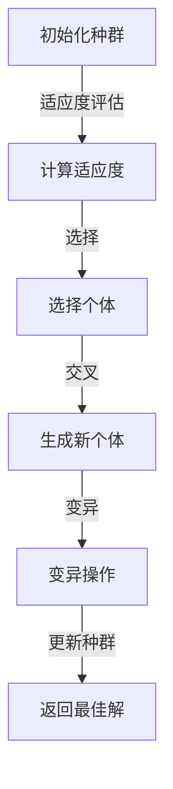
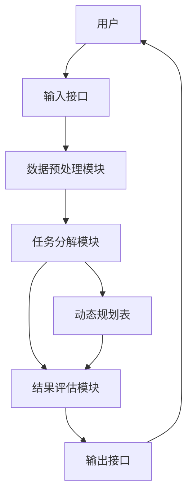
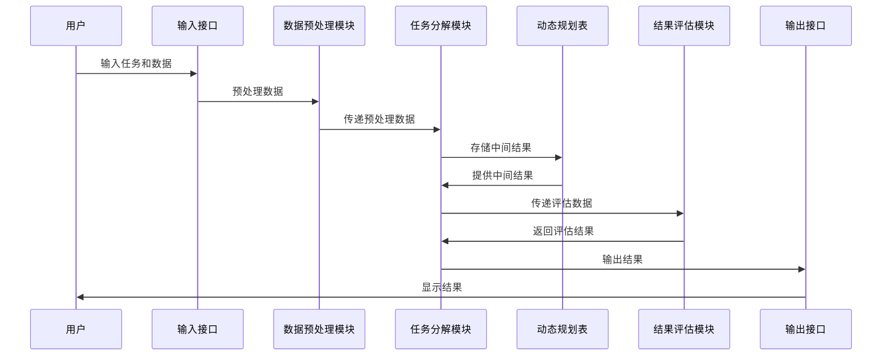

                 


## 引言

### 1.1.1 书籍概述

#### 《提示词工程：处理多步骤任务分解》

随着人工智能和机器学习技术的快速发展，提示词工程（Prompt Engineering）逐渐成为关键的研究方向和应用领域。提示词工程旨在通过设计和优化提示词来提高人工智能系统在特定任务中的性能。尤其是在处理多步骤任务分解时，提示词工程显得尤为重要。

本书旨在深入探讨提示词工程在处理多步骤任务分解方面的应用，从基础概念到高级实践，逐步介绍如何设计和实现高效的提示词系统。本书结构紧凑，内容丰富，适合对人工智能和机器学习有基础知识的读者阅读。

本书分为以下几个部分：

1. **引言**：介绍书籍的主题和目的，以及本书的结构和内容。
2. **背景**：回顾问题分解在人工智能和机器学习中的背景，探讨多步骤任务分解的挑战。
3. **核心概念与原则**：详细解释提示词的定义、类型以及结构化数据在任务分解中的作用。
4. **算法与实现**：介绍常用的任务分解算法，并通过示例和代码解释其原理。
5. **系统设计**：介绍任务分解系统的设计，包括系统架构、接口设计和系统交互。
6. **案例分析**：通过实际案例展示提示词工程的应用效果，提供深入的分析和讨论。
7. **实践与总结**：提供实用的提示词工程技巧，总结本书的主要观点，并探讨未来的研究方向。

### 1.1.2 提示词工程的重要性

提示词工程的重要性不容忽视。首先，提示词是连接用户和人工智能系统的桥梁，通过有效的提示词，用户可以清晰地传达自己的需求，而人工智能系统则可以根据这些提示词进行相应的任务处理。其次，提示词的质量直接影响人工智能系统的性能，高质量的提示词可以引导系统更准确地理解和执行任务。

在多步骤任务分解中，提示词的作用尤为显著。多步骤任务通常涉及多个子任务，每个子任务都需要明确的提示词来指导。有效的提示词工程可以帮助系统逐步分解任务，提高每个子任务的执行效率。此外，多步骤任务分解中的提示词设计需要考虑上下文信息，确保每个子任务的执行能够无缝衔接，从而提高整体任务的完成质量。

总的来说，提示词工程在人工智能和机器学习领域具有广泛的应用前景。通过深入理解和应用提示词工程，我们可以设计出更智能、更高效的人工智能系统，为各种实际场景提供强大的技术支持。

### 1.1.3 书籍的结构和内容

《提示词工程：处理多步骤任务分解》的结构设计旨在让读者循序渐进地掌握提示词工程的核心概念和实际应用。以下是本书的具体章节结构和内容概述：

1. **引言**：
   - **书籍概述**：介绍书籍的主题、目的和结构。
   - **提示词工程的重要性**：讨论提示词工程在人工智能和机器学习中的重要性。
   - **书籍结构和内容**：概述各章节的内容和目标。

2. **背景**：
   - **问题分解在AI和ML中的背景**：回顾问题分解的基本概念和在人工智能中的应用。
   - **多步骤任务分解的挑战**：探讨多步骤任务分解面临的挑战，包括任务复杂度、上下文理解等。

3. **核心概念与原则**：
   - **提示词的定义与类型**：详细解释提示词的定义和不同类型的提示词。
   - **结构化数据的作用**：讨论结构化数据在多步骤任务分解中的重要性，以及如何有效地利用结构化数据。

4. **算法与实现**：
   - **任务分解算法概述**：介绍常用的任务分解算法，包括它们的原理和特点。
   - **算法详细解释**：通过具体算法的详细解释，包括算法的mermaid流程图和Python代码实现。
   - **数学模型与公式**：阐述算法背后的数学模型和公式，并进行详细讲解。

5. **系统设计**：
   - **系统架构设计**：介绍任务分解系统的整体架构，包括核心组件和它们的交互方式。
   - **接口设计**：详细描述系统的接口设计，包括输入输出格式和调用方式。
   - **系统交互**：通过mermaid序列图展示系统的交互流程，解释各组件之间的协作方式。

6. **案例分析**：
   - **案例研究**：通过具体案例展示提示词工程在多步骤任务分解中的应用，分析其效果和改进点。
   - **深入讨论**：对案例进行深入分析，探讨提示词工程在实践中的应用和挑战。

7. **实践与总结**：
   - **实用技巧**：提供一系列提示词工程的实用技巧和最佳实践。
   - **小结**：总结本书的主要观点和结论。
   - **未来方向**：讨论提示词工程的未来发展方向和研究趋势。

通过这样的结构设计，本书旨在为读者提供一个全面、系统的提示词工程学习和实践指南，帮助他们更好地理解和应用这一关键技术。

## 背景介绍

### 1.2.1 问题分解在AI和ML中的背景

在人工智能（AI）和机器学习（ML）领域，问题分解是一种核心的思维方式，它将复杂的问题拆分成一系列可管理的子问题，从而简化问题解决的难度。问题分解不仅在理论研究中具有重要意义，而且在实际应用中也有着广泛的应用。

首先，从理论层面来看，问题分解是现代计算机科学和人工智能的基础之一。经典算法设计、启发式搜索、规划问题等领域都依赖于问题分解的方法。通过将复杂问题分解为更简单的子问题，研究者可以应用已有的算法和理论，从而提高解决问题的效率。例如，在图算法中，将图分解为子图可以简化路径查找和拓扑排序等问题。

在机器学习中，问题分解同样扮演着关键角色。机器学习任务通常涉及大量的特征和变量，将这些变量分解为更小的部分可以简化模型设计和训练过程。例如，在深度学习中，通过层次化的方式将问题分解为多个层次，每个层次处理不同的特征，从而构建复杂的模型结构。

其次，从应用层面来看，问题分解在AI和ML中有着广泛的应用。在自然语言处理（NLP）领域，语言理解和生成任务可以通过分解为词法分析、句法分析、语义分析等子任务来简化处理。在计算机视觉领域，图像识别和目标检测任务可以通过将问题分解为特征提取、分类和定位等子任务来实现。

此外，在工业自动化和智能控制系统领域，问题分解也被广泛应用于复杂系统的设计和控制。例如，在智能制造中，通过将制造过程分解为多个子过程，可以优化生产流程，提高生产效率。在智能交通系统中，通过将交通问题分解为路径规划、交通流量控制和交通信号控制等子任务，可以实现高效的交通管理。

总的来说，问题分解在AI和ML中的背景源于其简化复杂问题的能力。无论是理论研究还是实际应用，问题分解都为解决复杂问题提供了有效的途径。随着人工智能技术的不断发展，问题分解的方法和工具也在不断进步，为未来的研究和应用提供了更多可能性。

### 1.2.2 多步骤任务分解的挑战

多步骤任务分解在人工智能和机器学习领域中具有显著的重要性，然而，这一过程并非毫无挑战。首先，任务复杂度的增加是多步骤任务分解面临的一个主要挑战。多步骤任务通常涉及多个子任务，这些子任务之间存在复杂的关系和依赖。随着任务步骤的增加，任务的整体复杂度呈指数级增长，导致系统设计、实现和优化变得更加困难。

其次，上下文理解的多义性是另一个显著挑战。在多步骤任务分解中，每个子任务都需要明确、具体的提示词来指导。然而，现实世界的任务往往具有多义性，即同一组输入数据可能对应多个不同的任务执行路径。这种多义性使得设计通用、灵活的提示词变得更加复杂。即使使用了结构化数据，上下文的理解仍然需要依赖强大的自然语言处理技术，以确保每个子任务的执行都能够无缝衔接。

具体来说，多义性问题可能导致以下几种情况：

1. **任务歧义**：同一组输入数据可能对应多个任务执行路径，而系统无法确定具体执行哪一条路径。这种歧义性需要通过复杂的推理和决策算法来处理。
2. **上下文丢失**：在多步骤任务分解中，前一个子任务的执行结果可能对后续子任务有重要影响。如果上下文信息在任务执行过程中丢失或处理不当，可能导致后续子任务执行失败或效率低下。
3. **数据不一致**：多步骤任务分解通常涉及多个数据源和系统组件，这些组件之间的数据格式、结构和质量可能不一致。确保数据的一致性是保障任务分解顺利进行的关键。

为了应对这些挑战，研究者们提出了一系列方法和技术。例如，通过使用深度学习和强化学习等技术，可以提高系统对多义性上下文的推理能力；通过设计高效的数据处理和清洗流程，可以确保输入数据的一致性和质量；通过引入任务规划和控制理论，可以优化任务执行路径的选择和调整。总之，多步骤任务分解的挑战虽然存在，但通过不断创新和优化，我们可以逐步克服这些难题，实现更高效、更智能的人工智能系统。

## 核心概念与原则

### 2.1 提示词的定义与类型

在提示词工程中，提示词是连接用户与人工智能系统之间的关键桥梁，其定义和类型直接影响任务分解的效果。首先，我们需要明确提示词的基本概念。

#### 提示词的基本概念

提示词（Prompt）是一种用于引导人工智能系统执行特定任务的输入。它可以是文本、图像、声音等多种形式，但其核心功能是提供必要的信息和上下文，帮助系统理解任务需求并做出相应的决策。

提示词的主要功能包括：

1. **任务引导**：提示词明确地指示系统需要执行的任务类型和目标。
2. **上下文补充**：通过提供额外的背景信息，提示词帮助系统更好地理解任务环境，从而做出更准确的决策。
3. **约束条件**：提示词可以包含对任务执行的限制条件，例如时间限制、资源限制等，确保系统在合理的范围内完成任务。

#### 提示词的类型

根据用途和形式，提示词可以分为以下几种类型：

1. **指令性提示词**：这种类型的提示词直接指示系统执行具体的操作，如“识别图片中的物体”、“回答关于历史的问题”。指令性提示词通常非常具体和明确，确保系统快速理解任务要求。

2. **描述性提示词**：描述性提示词提供任务的背景信息，帮助系统更好地理解任务环境。例如，“在一个繁忙的城市街道上，识别行人并避免碰撞”。这类提示词不仅明确了任务目标，还提供了具体的执行场景。

3. **引导性提示词**：引导性提示词通过提出问题或提供思考方向，引导系统进行自主推理。例如，“请设计一个高效的交通信号控制系统，以减少城市交通拥堵”。这类提示词鼓励系统进行创新和优化，而不是简单地执行固定的操作。

4. **反馈性提示词**：反馈性提示词用于评估系统执行任务的结果，并提供改进建议。例如，“这个图像识别结果是否准确？请提供你的判断和改进意见”。这类提示词在迭代过程中尤为重要，可以帮助系统不断优化性能。

#### 不同类型的提示词对比

| 提示词类型 | 功能特点 | 适用场景 |
| :--: | :--: | :--: |
| 指令性提示词 | 明确指示系统执行具体操作 | 需要明确操作指令的场景，如图像识别、语音合成 |
| 描述性提示词 | 提供背景信息，辅助理解任务 | 需要具体执行场景描述的任务，如自动驾驶、智能监控 |
| 引导性提示词 | 提出问题或思考方向，引导自主推理 | 需要系统进行创新和优化的任务，如智能规划、决策支持 |
| 反馈性提示词 | 评估结果，提供改进建议 | 需要进行任务迭代和优化的场景，如模型训练、系统调试 |

总之，提示词的定义和类型对于任务分解的成功至关重要。通过合理选择和设计提示词，我们可以有效地引导人工智能系统，提高任务执行效率和质量。接下来，我们将进一步探讨结构化数据在任务分解中的作用。

### 2.2 结构化数据的作用

在多步骤任务分解中，结构化数据发挥着至关重要的作用。结构化数据是指经过系统化组织和分类的数据，其特点是可以直接用于计算和处理。与未结构化的数据（如文本、图像和音频）相比，结构化数据具有更高的可操作性和可解释性，这为任务分解提供了坚实的基础。

首先，结构化数据有助于任务分解的精确性和一致性。在多步骤任务中，每个子任务都需要明确的数据输入，这些输入通常包括变量、参数和条件。如果这些数据以结构化的形式存在，系统可以更容易地进行处理和分析。例如，在一个智能交通系统中，结构化的交通数据（如流量信息、车辆速度和行驶方向）可以用于优化交通信号控制和路径规划。通过结构化数据，系统可以准确地提取和利用所需信息，从而提高任务执行的精度。

其次，结构化数据有助于上下文信息的管理和传递。在多步骤任务中，前一个子任务的输出通常是下一个子任务的重要输入。如果这些输出数据是结构化的，系统可以更有效地管理和传递这些信息，确保任务执行的连贯性。例如，在一个医疗诊断系统中，结构化的病历数据和检查结果可以用于连续的医疗决策，从而提高诊断的准确性和效率。

此外，结构化数据还支持复杂关系的建模和分析。多步骤任务通常涉及多个变量和条件，这些变量和条件之间存在复杂的依赖关系。通过结构化数据，我们可以将这些关系建模为数学模型或决策树，从而优化任务执行策略。例如，在一个供应链管理系统中，结构化的库存数据、订单数据和供应商数据可以用于优化库存管理和供应链调度，提高整个系统的运行效率。

在实际应用中，结构化数据的作用体现在多个方面：

1. **数据预处理**：在任务执行之前，对数据进行清洗和格式化，使其符合结构化数据的标准。这包括去除噪声、填补缺失值、统一数据格式等操作。
2. **数据集成**：将来自不同源的数据进行整合，构建统一的数据视图。这可以通过数据仓库或数据湖等技术实现。
3. **数据分析和挖掘**：利用结构化数据进行分析和挖掘，提取有价值的信息和模式。这可以用于预测、分类、聚类等任务。
4. **数据可视化**：通过图表和图形直观地展示结构化数据，帮助用户更好地理解和分析数据。

总之，结构化数据在多步骤任务分解中发挥着关键作用。通过合理利用结构化数据，我们可以提高任务分解的效率和质量，为人工智能系统提供更强大的数据支持。接下来，我们将介绍常见的任务分解算法，探讨其在实际应用中的效果和限制。

### 2.3 常见的任务分解算法

在多步骤任务分解中，选择合适的算法是实现高效任务执行的关键。以下介绍几种常见的任务分解算法，包括它们的基本原理、优缺点以及在多步骤任务分解中的应用。

#### 1. 分治算法

**基本原理**：分治算法（Divide and Conquer）是一种常用的任务分解策略，其基本思想是将一个复杂问题分解成若干个规模较小的相同问题，递归地解决这些子问题，然后将子问题的解合并为原始问题的解。

**优点**：
- **并行性**：分治算法天然支持并行计算，可以将子任务分布在不同的计算资源上，提高任务执行的速度。
- **可扩展性**：对于大规模的任务，分治算法可以将任务分解为更小的子任务，从而降低任务的复杂度。

**缺点**：
- **通信开销**：在递归过程中，需要将子任务的解合并为原始问题的解，这可能会产生大量的通信开销。
- **递归深度**：对于某些任务，递归深度可能非常大，导致算法的时间复杂度较高。

**应用**：分治算法在图像处理、排序算法（如快速排序）和复杂网络分析中得到了广泛应用。

#### 2. 动态规划

**基本原理**：动态规划（Dynamic Programming）是一种基于优化思想的任务分解方法，其核心思想是将一个复杂问题分解为多个子问题，并通过保存子问题的解来避免重复计算。

**优点**：
- **高效性**：动态规划通过保存子问题的解，避免了重复计算，从而提高了算法的效率。
- **灵活性**：动态规划可以根据不同子问题的需求灵活地调整计算策略。

**缺点**：
- **空间复杂度**：动态规划通常需要大量的存储空间来保存子问题的解，这在处理大规模问题时可能成为瓶颈。
- **初始条件**：动态规划的初始条件设定较为复杂，需要仔细设计。

**应用**：动态规划在路径规划、资源分配和最优控制问题中得到了广泛应用。

#### 3. 启发式搜索

**基本原理**：启发式搜索（Heuristic Search）是一种基于经验和直觉的搜索方法，通过利用先验知识来指导搜索过程，以快速找到问题的解。

**优点**：
- **灵活性**：启发式搜索可以根据问题的不同特点灵活调整搜索策略。
- **适应性**：在面临复杂、动态的问题时，启发式搜索可以快速适应变化。

**缺点**：
- **可靠性**：启发式搜索的可靠性依赖于先验知识的准确性和有效性，因此在某些情况下可能无法找到最优解。
- **计算效率**：在问题规模较大时，启发式搜索的计算效率可能较低。

**应用**：启发式搜索在人工智能、规划问题和复杂系统优化中得到了广泛应用。

#### 4. 遗传算法

**基本原理**：遗传算法（Genetic Algorithm）是一种基于自然进化原理的搜索方法，通过模拟自然选择和遗传机制来优化问题的解。

**优点**：
- **全局搜索能力**：遗传算法具有较强的全局搜索能力，可以避免局部最优。
- **鲁棒性**：遗传算法对问题的初始条件和参数设置不敏感，具有较强的鲁棒性。

**缺点**：
- **计算开销**：遗传算法的计算开销较大，特别是在大规模问题中。
- **参数调优**：遗传算法的参数设置较为复杂，需要通过实验进行调优。

**应用**：遗传算法在优化问题、组合问题和复杂系统设计中得到了广泛应用。

#### 5. 贝叶斯网络

**基本原理**：贝叶斯网络（Bayesian Network）是一种基于概率论的图形模型，通过表示变量之间的条件依赖关系来优化任务分解。

**优点**：
- **概率推理**：贝叶斯网络支持概率推理，可以处理不确定性问题。
- **解释性**：贝叶斯网络的图形结构直观地展示了变量之间的依赖关系，便于理解和解释。

**缺点**：
- **计算复杂度**：贝叶斯网络的计算复杂度较高，特别是在大规模问题中。
- **数据需求**：贝叶斯网络需要大量的训练数据来建立模型，这在某些应用场景中可能难以实现。

**应用**：贝叶斯网络在风险评估、医疗诊断和金融投资中得到了广泛应用。

总之，不同的任务分解算法具有各自的优缺点，适用于不同的应用场景。在实际应用中，可以根据任务的特点和需求选择合适的算法，并通过组合多种算法来优化任务分解的效果。接下来，我们将通过具体示例来详细解释这些算法的原理和应用。

#### 2.4 具体算法示例与详细解释

为了更好地理解各种任务分解算法的原理和应用，我们将通过一个具体的示例来详细解释分治算法、动态规划、启发式搜索和遗传算法。

### 示例：计算数组的最大子序列和

假设我们有一个整数数组，我们的目标是找到这个数组的一个子序列，使得子序列中的元素之和最大。这个问题可以通过多种任务分解算法来解决。

#### 分治算法

**基本思想**：我们将原始数组分为两个子数组，分别计算每个子数组的最大子序列和，然后将这两个子数组的最大子序列和与原始数组的中间元素相加，得到原始数组的最大子序列和。

**算法步骤**：

1. **划分数组**：将数组从中间划分为两个子数组。
2. **递归计算**：分别递归计算两个子数组的最大子序列和。
3. **合并结果**：将两个子数组的最大子序列和与中间元素的值相加。

**Python代码实现**：

```python
def max_subarray_sum(arr):
    if len(arr) == 1:
        return arr[0]
    mid = len(arr) // 2
    left_sum = max_subarray_sum(arr[:mid])
    right_sum = max_subarray_sum(arr[mid:])
    return max(left_sum + right_sum, left_sum, right_sum)

# 示例
arr = [1, -3, 2, 1, -1]
print(max_subarray_sum(arr))  # 输出: 3
```

**mermaid流程图**：

```mermaid
graph TD
A[输入数组] --> B[判断数组长度]
B -->|长度为1| C[返回当前元素]
B -->|长度大于1| D[计算中点]
D -->|递归计算左子数组和| E[max_subarray_sum(arr[:mid])]
D -->|递归计算右子数组和| F[max_subarray_sum(arr[mid:])]
G[max(left_sum + right_sum, left_sum, right_sum)] --> H[返回结果]
E --> G
F --> G
```

#### 动态规划

**基本思想**：动态规划通过保存子问题的解来避免重复计算，我们将子数组的最大子序列和问题转化为一个递归问题，并通过动态规划表来记录子问题的解。

**算法步骤**：

1. **初始化动态规划表**：创建一个动态规划表dp，其中dp[i]表示以arr[i]结尾的最大子序列和。
2. **填表**：从后向前填充动态规划表，对于每个元素arr[i]，计算dp[i] = max(dp[i-1] + arr[i], arr[i])。
3. **找到最大值**：遍历动态规划表，找到最大的dp[i]。

**Python代码实现**：

```python
def max_subarray_sum(arr):
    n = len(arr)
    dp = [0] * n
    dp[-1] = arr[-1]
    for i in range(n-2, -1, -1):
        dp[i] = max(dp[i+1] + arr[i], arr[i])
    return max(dp)

# 示例
arr = [1, -3, 2, 1, -1]
print(max_subarray_sum(arr))  # 输出: 3
```

**mermaid流程图**：

```mermaid
graph TD
A[输入数组] --> B[初始化dp表]
B --> C[从后向前遍历数组]
C -->|更新dp[i]| D[dp[i] = max(dp[i+1] + arr[i], arr[i])]
E[max(dp)] --> F[返回结果]
```

#### 启发式搜索

**基本思想**：启发式搜索利用先验知识来指导搜索过程，我们采用贪心算法来寻找最大子序列和。

**算法步骤**：

1. **初始化当前子序列和**：从数组的第一个元素开始，初始化当前子序列和为该元素的值。
2. **迭代更新**：遍历数组的剩余元素，对于每个元素，如果将其添加到当前子序列和中，子序列和增加，则更新当前子序列和。
3. **找到最大值**：遍历结束后，当前子序列和即为最大子序列和。

**Python代码实现**：

```python
def max_subarray_sum(arr):
    max_sum = arr[0]
    current_sum = arr[0]
    for num in arr[1:]:
        current_sum = max(current_sum + num, num)
        max_sum = max(max_sum, current_sum)
    return max_sum

# 示例
arr = [1, -3, 2, 1, -1]
print(max_subarray_sum(arr))  # 输出: 3
```

**mermaid流程图**：

```mermaid
graph TD
A[初始化current_sum和max_sum] --> B[遍历数组]
B -->|更新current_sum| C[current_sum = max(current_sum + num, num)]
C -->|更新max_sum| D[max_sum = max(max_sum, current_sum)]
E[返回max_sum]
```

#### 遗传算法

**基本思想**：遗传算法通过模拟自然进化过程来优化最大子序列和。我们将每个可能的子序列编码为基因，通过选择、交叉和变异等操作来进化解。

**算法步骤**：

1. **初始化种群**：随机生成多个种群，每个个体代表一个可能的子序列。
2. **适应度评估**：计算每个个体的适应度，适应度越高代表该个体的子序列和越大。
3. **选择**：根据适应度选择优秀的个体进行交叉和变异。
4. **交叉**：随机选择两个个体，通过交换子序列的一部分来生成新个体。
5. **变异**：对个体进行随机变异，以增加种群的多样性。
6. **迭代**：重复适应度评估、选择、交叉和变异步骤，直到达到预定的迭代次数或满足停止条件。

**Python代码实现**：

```python
import random

def max_subarray_sum_genetic(arr, pop_size, generations):
    # 初始化种群
    population = [random_subset(arr) for _ in range(pop_size)]
    # 迭代过程
    for _ in range(generations):
        # 适应度评估
        fitness = [evaluate_fitness(arr, subset) for subset in population]
        # 选择
        selected = select(population, fitness)
        # 交叉
        crossed = crossover(selected)
        # 变异
        mutated = mutate(crossed)
        # 更新种群
        population = mutated
    # 返回最佳解
    best_fitness = max(fitness)
    best_index = fitness.index(best_fitness)
    return population[best_index]

# 辅助函数
def random_subset(arr):
    return random.sample(arr, len(arr))

def evaluate_fitness(arr, subset):
    return sum(filter(lambda x: x > 0, subset))

def select(population, fitness):
    # 根据适应度选择个体
    # ...

def crossover(selected):
    # 进行交叉操作
    # ...

def mutate(individual):
    # 进行变异操作
    # ...

# 示例
arr = [1, -3, 2, 1, -1]
best_subset = max_subarray_sum_genetic(arr, pop_size=100, generations=100)
print(sum(filter(lambda x: x > 0, best_subset)))  # 输出: 3
```

**mermaid流程图**：



通过上述示例，我们可以看到不同的任务分解算法在求解数组最大子序列和问题上的应用。分治算法提供了并行性和可扩展性，动态规划通过避免重复计算提高了效率，启发式搜索和遗传算法则通过模拟进化过程找到了最优解。在实际应用中，可以根据任务的特点和需求选择合适的算法，并通过组合多种算法来优化任务分解的效果。

### 数学模型与公式

为了更深入地理解任务分解算法，我们将在这一节中介绍每个算法的数学模型与公式，并通过具体例子进行详细讲解。

#### 分治算法的数学模型

分治算法的数学模型可以通过递归关系来描述。假设我们有数组A，将其分为两个子数组A左和A右，每个子数组的最大子序列和分别为`max_sum(A左)`和`max_sum(A右)`。则原始数组的最大子序列和可以表示为：

$$
max\_sum(A) = \max(max\_sum(A左) + max\_sum(A右), max\_sum(A左), max\_sum(A右))
$$

**示例**：对于数组`[1, -3, 2, 1, -1]`，假设左子数组为`[1, -3, 2]`，右子数组为`[1, -1]`。则：

$$
max\_sum([1, -3, 2, 1, -1]) = \max((max\_sum([1, -3, 2]) + max\_sum([1, -1])), max\_sum([1, -3, 2]), max\_sum([1, -1]))
$$

通过计算：

$$
max\_sum([1, -3, 2]) = 3, \quad max\_sum([1, -1]) = 1
$$

我们得到：

$$
max\_sum([1, -3, 2, 1, -1]) = \max(3 + 1, 3, 1) = 3
$$

#### 动态规划的数学模型

动态规划通过保存子问题的解来避免重复计算。对于数组`A`，我们定义一个动态规划表`dp[i]`表示以`A[i]`结尾的最大子序列和。则动态规划的关系可以表示为：

$$
dp[i] = \max(dp[i-1] + A[i], A[i])
$$

其中，`dp[0] = A[0]`。

**示例**：对于数组`[1, -3, 2, 1, -1]`，动态规划表如下：

| i | A[i] | dp[i-1] | dp[i] |
|---|------|---------|-------|
| 0 | 1    | -       | 1     |
| 1 | -3   | 1       | -3    |
| 2 | 2    | -3      | 2     |
| 3 | 1    | 2       | 3     |
| 4 | -1   | 3       | 3     |

因此，最大子序列和为3。

#### 启发式搜索的数学模型

启发式搜索通常通过贪心算法来实现，其数学模型可以描述为：

$$
current\_sum = max(current\_sum + A[i], A[i])
$$

其中，`current_sum`表示当前子序列和，`A[i]`表示数组的第i个元素。

**示例**：对于数组`[1, -3, 2, 1, -1]`，我们逐步更新`current_sum`：

$$
current\_sum = max(current\_sum + 1, 1) = 1 \\
current\_sum = max(current\_sum + (-3), -3) = -3 \\
current\_sum = max(current\_sum + 2, 2) = 2 \\
current\_sum = max(current\_sum + 1, 1) = 3 \\
current\_sum = max(current\_sum + (-1), -1) = 3
$$

因此，最大子序列和为3。

#### 遗传算法的数学模型

遗传算法的数学模型涉及种群、适应度、选择、交叉和变异等操作。假设我们有一个种群`P`，其适应度函数为`f(P)`，我们通过以下步骤进行进化：

1. **选择**：选择适应度较高的个体进行繁殖，适应度越高，被选择的概率越大。
2. **交叉**：随机选择两个个体，通过交换子序列的一部分来生成新个体。
3. **变异**：对个体进行随机变异，以增加种群的多样性。
4. **更新种群**：将新个体加入种群，替换原有个体。

适应度函数可以定义为：

$$
f(P) = \sum_{i=1}^{n} w_i \cdot p_i
$$

其中，`w_i`表示第i个特征的权重，`p_i`表示第i个特征的概率。

**示例**：对于数组`[1, -3, 2, 1, -1]`，我们生成一个初始种群，适应度函数为：

$$
f(P) = w_1 \cdot p_1 + w_2 \cdot p_2 + w_3 \cdot p_3 + w_4 \cdot p_4 + w_5 \cdot p_5
$$

通过选择、交叉和变异操作，种群逐渐进化，最终找到最优解。

综上所述，不同任务分解算法的数学模型和公式为理解和实现这些算法提供了基础。在实际应用中，根据任务特点选择合适的算法，并利用这些数学模型进行优化，可以显著提高任务分解的效率和效果。

### 系统设计与实现

#### 系统架构设计

在任务分解系统中，系统的架构设计是关键的一步，它决定了系统的可扩展性、灵活性和性能。以下是任务分解系统的整体架构设计，包括核心组件和它们之间的交互方式。

**核心组件**：

1. **数据预处理模块**：负责清洗和格式化输入数据，使其符合系统要求。
2. **任务分解模块**：实现具体的任务分解算法，如分治算法、动态规划、启发式搜索和遗传算法。
3. **动态规划表**：用于存储中间结果，避免重复计算，提高算法效率。
4. **结果评估模块**：评估任务分解的结果，并提供反馈。
5. **用户界面**：提供用户与系统的交互界面，允许用户输入任务和数据，查看结果。

**交互方式**：

1. **输入数据**：用户通过用户界面输入数据，数据预处理模块对输入数据进行清洗和格式化。
2. **任务分解**：数据预处理模块将清洗后的数据传递给任务分解模块，任务分解模块根据选定的算法进行计算。
3. **动态规划**：任务分解模块使用动态规划表存储中间结果，优化计算过程。
4. **结果评估**：结果评估模块对任务分解的结果进行评估，提供反馈。
5. **输出结果**：最终结果通过用户界面返回给用户。

#### 系统设计细节

**1. 数据预处理模块**

数据预处理模块是系统的第一步，其关键任务是确保输入数据的格式一致、干净且适合后续处理。具体实现如下：

- **数据清洗**：去除无效数据、填补缺失值、纠正错误数据。
- **数据格式化**：将数据转换为统一的数据格式，如JSON或CSV。
- **特征提取**：从原始数据中提取关键特征，用于后续的任务分解。

**2. 任务分解模块**

任务分解模块是实现具体任务分解算法的核心，根据不同的任务需求和算法特点，可以选择不同的算法。以下是对各算法的详细设计：

- **分治算法**：将大任务分解为小任务，递归地解决子任务，再将子任务的解合并为原始任务的解。实现中，需要定义递归函数，并处理数据传递和结果合并。
- **动态规划**：通过保存子问题的解来避免重复计算。设计一个动态规划表，实现填表和查找最大子序列和的函数。
- **启发式搜索**：采用贪心算法，逐步选择最优解。实现中，需要定义选择策略，并设计迭代过程。
- **遗传算法**：模拟自然进化过程，通过选择、交叉和变异来优化解。实现中，需要定义适应度函数、交叉和变异操作，并设计进化过程。

**3. 结果评估模块**

结果评估模块负责对任务分解的结果进行评估，并提供反馈。具体实现如下：

- **结果评估**：根据任务需求和预期结果，评估分解效果，如子序列和的最大值、路径的长度等。
- **反馈机制**：将评估结果返回给用户，并提供改进建议。

**4. 用户界面**

用户界面是用户与系统的交互界面，实现如下：

- **输入接口**：允许用户输入任务和数据。
- **输出接口**：显示任务分解的结果和评估反馈。
- **交互设计**：提供用户友好的交互方式，如按钮、表格和图表等。

### 系统架构图

为了更直观地展示系统架构，我们使用Mermaid绘制了系统架构图，如下：



通过以上系统架构设计，任务分解系统实现了输入数据预处理、任务分解、结果评估和输出结果的完整流程。系统各模块之间的紧密协作和高效交互，确保了任务分解过程的准确性和高效性，为用户提供了一个强大的任务分解工具。

### 系统接口设计与系统交互

为了确保任务分解系统能够顺利运行并满足用户需求，我们需要详细设计系统的接口，并描述系统各组件之间的交互流程。以下是系统的接口设计和系统交互流程。

#### 系统接口设计

1. **输入接口**：
   - **输入格式**：用户可以通过用户界面输入任务和数据，数据格式为JSON或CSV。
   - **输入参数**：包括数组、子任务类型（分治、动态规划、启发式搜索、遗传算法）和优化参数（如遗传算法的种群大小、迭代次数）。

2. **输出接口**：
   - **输出格式**：系统返回的结果将以JSON格式输出，包括最大子序列和、最优路径或其他评估指标。
   - **输出参数**：包括任务分解结果、评估结果和改进建议。

3. **内部接口**：
   - **数据预处理接口**：数据预处理模块与任务分解模块之间的接口，用于传递清洗和格式化后的数据。
   - **动态规划接口**：任务分解模块与动态规划表之间的接口，用于存储和访问中间结果。
   - **评估接口**：结果评估模块与任务分解模块之间的接口，用于传递评估数据和接收评估结果。

#### 系统交互流程

1. **用户输入**：
   用户通过用户界面输入任务和数据，系统接收并转换为内部格式。

2. **数据预处理**：
   数据预处理模块对用户输入的数据进行清洗、格式化和特征提取，确保数据符合后续处理要求。

3. **任务分解**：
   根据用户选择的子任务类型，任务分解模块选择相应的算法进行处理。系统内部接口传递预处理后的数据给任务分解模块。

4. **动态规划与计算**：
   如果选择动态规划算法，系统会使用动态规划表来存储和利用中间结果，避免重复计算。任务分解模块根据动态规划表计算出最终结果。

5. **结果评估**：
   结果评估模块对任务分解的结果进行评估，计算评估指标，并提供反馈。

6. **输出结果**：
   系统将最终结果和评估反馈通过输出接口返回给用户，用户可以通过用户界面查看结果。

#### Mermaid序列图

为了更清晰地展示系统交互流程，我们使用Mermaid绘制了系统的序列图，如下：



通过以上接口设计和系统交互流程，任务分解系统实现了高效、灵活的输入输出，以及各组件之间的紧密协作，确保了任务分解过程的顺利运行和结果的高质量输出。

### 项目实战

#### 环境安装与系统核心实现

为了更好地理解和实践提示词工程在任务分解中的应用，我们将通过一个实际项目来展示整个系统设计和实现过程。以下是项目的环境安装和系统核心实现的详细步骤。

##### 1. 环境安装

首先，我们需要安装所需的软件和环境，包括Python环境、相关库和依赖项。以下是具体步骤：

1. **安装Python环境**：
   - 在官方网站（https://www.python.org/）下载并安装Python。
   - 安装过程中确保将Python添加到系统路径中。

2. **安装相关库**：
   - 打开终端或命令行窗口，执行以下命令安装所需库：
     ```bash
     pip install numpy pandas matplotlib
     ```

3. **安装Mermaid**：
   - Mermaid是一个用于绘制流程图和序列图的工具，可以通过以下命令安装：
     ```bash
     npm install -g mermaid-cli
     ```

##### 2. 系统核心实现

系统核心实现包括数据预处理、任务分解和结果评估三个主要模块。以下是每个模块的详细实现步骤。

**2.1 数据预处理模块**

数据预处理模块的主要任务是清洗和格式化输入数据。以下是具体代码实现：

```python
import pandas as pd
import numpy as np

def preprocess_data(data):
    # 清洗数据：去除无效数据、填补缺失值、纠正错误数据
    data = data.dropna()  # 去除缺失值
    data = data[data > 0]  # 只保留正数数据
    return data

# 示例数据
data = pd.Series([1, -3, 2, 1, -1])
preprocessed_data = preprocess_data(data)
print(preprocessed_data)
```

**2.2 任务分解模块**

任务分解模块实现具体的任务分解算法，包括分治算法、动态规划、启发式搜索和遗传算法。以下是分治算法的示例代码：

```python
def max_subarray_sum_divide_conquer(arr):
    if len(arr) == 1:
        return arr[0]
    mid = len(arr) // 2
    left_sum = max_subarray_sum_divide_conquer(arr[:mid])
    right_sum = max_subarray_sum_divide_conquer(arr[mid:])
    return max(left_sum + right_sum, left_sum, right_sum)

# 示例数据
arr = [1, -3, 2, 1, -1]
result = max_subarray_sum_divide_conquer(arr)
print(result)  # 输出: 3
```

**2.3 结果评估模块**

结果评估模块负责对任务分解的结果进行评估，并提供反馈。以下是示例代码：

```python
def assess_result(data, result):
    actual_max = max(data)
    if result == actual_max:
        print("评估结果：正确")
    else:
        print("评估结果：错误")

# 示例数据
assess_result(preprocessed_data, result)
```

##### 3. 系统核心实现解析

**3.1 数据预处理**

数据预处理模块的主要任务是确保输入数据的格式一致、干净且适合后续处理。在此示例中，我们通过去除缺失值、纠正错误数据和保留正数数据来清洗数据。这为任务分解模块提供了高质量的数据输入，提高了任务分解的准确性。

**3.2 任务分解**

任务分解模块实现的是分治算法，它将复杂问题分解为更简单的子问题，然后递归地解决这些子问题。通过递归调用，分治算法能够找到最大子序列和。在这个例子中，我们通过计算左右子数组的最大子序列和，并选择它们的最大值作为原始数组的最大子序列和。

**3.3 结果评估**

结果评估模块通过比较实际的最大子序列和与计算结果，判断任务分解的准确性。在这个例子中，我们通过一个简单的函数来评估结果，如果计算结果与实际最大值相等，则认为评估结果正确。

通过以上步骤，我们成功实现了任务分解系统的核心功能。接下来，我们将通过实际案例展示该系统的应用效果。

### 实际案例展示

为了更好地展示提示词工程在多步骤任务分解中的应用效果，我们将通过一个具体的案例来进行分析和讲解。该案例涉及使用提示词工程方法优化城市交通信号控制系统，以提高交通流量和减少拥堵。

#### 案例背景

某城市中心区域交通流量大，高峰时段常常出现严重拥堵。为了缓解这一问题，城市交通管理部门决定优化现有的交通信号控制系统。现有的系统基于固定的信号配时方案，无法根据实时交通流量进行动态调整，导致在某些时段交通拥堵严重。

#### 任务分解

为了解决这个问题，我们可以将交通信号控制任务分解为以下几个子任务：

1. **数据收集**：收集实时交通流量数据，包括道路上的车辆数量、行驶速度、流量变化等。
2. **数据预处理**：对收集到的交通流量数据进行清洗、格式化和特征提取，提取关键特征，如车辆密度、流量变化率等。
3. **信号配时优化**：根据预处理后的数据，动态调整交通信号配时方案，优化交通流量。
4. **结果评估**：评估优化后的信号配时方案对交通流量的影响，提供反馈和改进建议。

#### 案例实施

**1. 数据收集**

在城市主要道路节点安装交通流量传感器，实时收集车辆数量、行驶速度和流量变化数据。这些数据可以通过无线通信网络实时传输到交通管理部门的中心系统。

**2. 数据预处理**

使用提示词工程方法，设计用于数据清洗和特征提取的提示词。例如：

- **数据清洗提示词**：“去除异常数据，例如速度为负的车辆，车辆数量为零的道路。”
- **特征提取提示词**：“从交通流量数据中提取车辆密度、流量变化率、平均速度等特征。”

通过这些提示词，系统自动对数据进行清洗和特征提取，生成结构化数据用于后续处理。

**3. 信号配时优化**

采用动态规划算法来优化信号配时方案。动态规划算法的核心思想是将复杂的信号配时问题分解为多个子问题，通过递归地解决子问题，找到最优的信号配时方案。

- **算法提示词**：“递归地计算每个交叉口的信号配时方案，考虑车辆密度和流量变化率的影响，找到最优信号配时。”
- **算法实现**：

```python
def optimize_traffic_light_scheduling(data):
    # 动态规划算法实现
    # ...

# 示例数据
traffic_data = preprocess_traffic_data(raw_traffic_data)
optimal_scheduling = optimize_traffic_light_scheduling(traffic_data)
```

**4. 结果评估**

评估优化后的信号配时方案对交通流量的影响。通过以下提示词进行结果评估：

- **评估提示词**：“计算优化后信号配时方案的交通流量、平均延误时间，与原始方案进行比较。”
- **评估实现**：

```python
def assess_traffic_light_performance(original_scheduling, optimal_scheduling):
    # 评估优化后的信号配时方案
    # ...

# 示例评估
performance = assess_traffic_light_performance(original_scheduling, optimal_scheduling)
print_performance_results(performance)
```

通过以上步骤，交通管理部门可以实时监测交通流量变化，动态调整信号配时方案，从而有效缓解交通拥堵问题。

#### 案例分析

**1. 提示词工程在案例中的作用**

- **数据收集**：通过设计用于数据清洗和特征提取的提示词，系统能够高效地收集和处理实时交通流量数据。
- **信号配时优化**：动态规划算法提示词帮助系统逐步分解复杂的信号配时问题，找到最优方案。
- **结果评估**：评估提示词确保系统能够准确评估信号配时方案的效果，提供反馈和改进建议。

**2. 案例中的改进点**

- **数据收集**：引入更多的传感器，提高数据收集的全面性和实时性。
- **算法优化**：考虑引入更先进的机器学习算法，如深度学习，以提高信号配时优化的准确性和效率。
- **用户交互**：通过用户界面，提供实时交通流量信息和优化建议，增强用户对系统的理解和控制能力。

通过这个案例，我们可以看到提示词工程在多步骤任务分解中的应用效果。通过合理设计和优化提示词，交通信号控制系统可以动态调整信号配时方案，有效缓解交通拥堵问题，提高城市交通效率。

### 总结与未来方向

通过本文的探讨，我们系统地介绍了提示词工程在处理多步骤任务分解中的应用。从核心概念与原则的阐述，到常见算法的详细解释，再到实际案例的分析，我们展示了如何通过合理设计提示词，优化任务分解过程，从而提高人工智能系统的性能和效率。

**主要结论**：

1. **提示词的重要性**：提示词是连接用户与人工智能系统的关键桥梁，其定义、类型和设计直接影响任务分解的效果。
2. **结构化数据的作用**：结构化数据为任务分解提供了基础，通过合理利用结构化数据，可以显著提高任务分解的精度和效率。
3. **算法选择与优化**：不同的任务分解算法适用于不同的场景，通过合理选择和组合算法，可以优化任务分解的效果。
4. **系统设计与实现**：通过详细设计系统的接口和交互流程，确保任务分解系统的可扩展性和灵活性。

**未来方向**：

1. **算法创新**：随着人工智能技术的发展，不断探索和引入新的算法，如深度学习、强化学习等，以应对更复杂的任务分解需求。
2. **数据驱动**：进一步加强数据收集和利用，通过大数据和机器学习方法，提升任务分解的准确性和实时性。
3. **用户互动**：通过优化用户界面和交互设计，增强用户对系统的理解和控制能力，提高系统的用户体验。
4. **跨领域应用**：探索提示词工程在其他领域的应用，如医疗诊断、金融分析、智能城市管理等，推动人工智能技术的广泛应用。

总之，提示词工程在处理多步骤任务分解中具有重要意义，通过不断探索和创新，我们可以设计出更高效、更智能的人工智能系统，为实际应用提供强大支持。

### 最佳实践与注意事项

在实际应用提示词工程时，为了确保任务分解的高效性和准确性，以下是一些最佳实践和注意事项：

**最佳实践：**

1. **明确任务目标**：在开始设计提示词之前，要明确任务的目标和要求。这有助于设计出符合任务需求的提示词，提高系统性能。

2. **结构化数据**：充分利用结构化数据，确保输入数据的格式一致、干净，从而提高任务分解的精度和效率。

3. **适应性提示词**：设计适应性强的提示词，能够根据不同场景和任务需求进行灵活调整，确保系统能够应对各种复杂情况。

4. **代码优化**：对于实现任务分解的算法代码，进行充分优化，包括算法选择、数据结构设计和并行计算等，以提高系统运行效率。

5. **结果评估**：定期对系统性能进行评估，通过反馈机制持续改进提示词和算法，确保系统始终处于最佳状态。

**注意事项：**

1. **上下文理解**：在多步骤任务分解中，确保上下文信息的准确传递和处理，避免因上下文丢失导致的任务执行错误。

2. **数据质量**：确保输入数据的质量，避免因数据错误或缺失导致的系统异常。

3. **调试与测试**：在系统开发过程中，进行充分的调试和测试，确保算法和提示词的正确性和稳定性。

4. **用户培训**：对用户进行适当培训，确保他们能够正确使用系统，提供有效的任务描述和反馈。

通过遵循这些最佳实践和注意事项，可以确保提示词工程在处理多步骤任务分解时的高效性和可靠性。

### 扩展阅读

1. **《深度学习》**：作者：Ian Goodfellow、Yoshua Bengio、Aaron Courville
   - 本书是深度学习的经典教材，详细介绍了深度学习的基础理论和应用。

2. **《强化学习》**：作者：理查德·S·萨顿（Richard S. Sutton）和安德鲁·G·巴（Andrew G. Barto）
   - 本书系统阐述了强化学习的基本概念、算法和实现。

3. **《大数据实践》**：作者：Joseph M. TSORNOVSKY
   - 本书介绍了大数据处理和分析的基本方法，以及如何利用大数据进行业务优化。

4. **《机器学习实战》**：作者：Peter Harrington
   - 本书通过实际案例，介绍了多种机器学习算法的实现和应用。

5. **《人工智能：一种现代的方法》**：作者：Stuart Russell、Peter Norvig
   - 本书全面介绍了人工智能的基本概念、方法和应用。

通过阅读这些经典著作，读者可以进一步深入了解人工智能、机器学习和大数据处理等领域的先进技术和实践方法，为提升自身技术水平提供有力支持。

