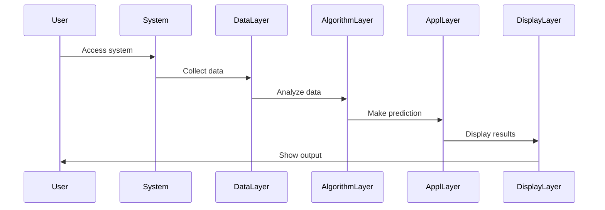

                 


### 1. 背景介绍

**核心概念术语说明：**

在探讨提示词工程之前，我们需要先了解一些关键术语的概念：

- **人工智能（AI）：** 人工智能是指通过模拟人类智能行为的计算机程序和系统。
- **提示词工程：** 提示词工程是一种通过工程方法，平衡人工智能创新和社会影响的实践。
- **社会影响：** 指人工智能技术在社会各个层面的影响，包括伦理、法律、经济、文化等。
- **创新：** 创新是指引入新观念、新方法、新技术，推动科技进步和社会发展。

**问题背景：**

随着人工智能技术的快速发展，AI已经渗透到社会的各个领域，从医疗、金融到教育、交通，它改变了我们的生活方式和工作方式。然而，AI技术的发展也带来了诸多社会影响，如就业替代、隐私泄露、算法偏见等。如何平衡AI的创新和社会影响，成为了一个亟待解决的问题。

**问题描述：**

目前，AI的创新与社会影响之间存在明显的矛盾。一方面，AI的创新带来了巨大的经济和社会效益；另一方面，社会影响的不确定性使得人们对于AI技术的应用持有谨慎态度。我们需要找到一种方法，既能够充分利用AI的创新潜力，又能够最大限度地减少其负面影响。

**问题解决：**

通过提示词工程，我们可以在AI开发和应用的各个环节引入工程方法，实现AI创新与社会影响的平衡。提示词工程的核心思想是通过明确AI技术的应用场景、制定相关的伦理和法律规范、设计智能算法等手段，确保AI技术的健康发展，同时最大程度地减少其对社会的不利影响。

**边界与外延：**

提示词工程的边界主要包括以下几个方面：

- **技术边界：** 提示词工程关注的是AI技术本身，而不是其他技术领域。
- **社会边界：** 提示词工程关注的是AI技术对社会的影响，而不是其他社会问题。
- **伦理边界：** 提示词工程强调在AI技术开发和应用过程中遵守伦理规范，确保技术的社会责任。

**概念结构与核心要素组成：**

提示词工程的概念结构由以下几个核心要素组成：

- **核心概念：** 提示词工程的基本概念，包括人工智能、社会影响、创新等。
- **技术原理：** 提示词工程的技术原理，包括智能算法、工程方法等。
- **实践应用：** 提示词工程在实际应用中的案例和经验。
- **伦理规范：** 提示词工程在AI技术发展过程中应遵循的伦理规范。

### 2. 核心概念与联系

**核心概念定义：**

- **提示词工程：** 提示词工程是一种通过工程方法，平衡人工智能创新与社会影响的实践。它涉及到对AI技术的应用场景、算法设计、法律和伦理规范的全面考虑。
- **AI创新：** AI创新指的是通过引入新的算法、技术、产品等，推动人工智能领域的科技进步。
- **社会影响：** 社会影响是指人工智能技术在社会各个层面产生的影响，包括经济、文化、法律、伦理等。

**AI创新与社会影响的属性特征对比：**

| 属性特征 | AI创新 | 社会影响 |
| :----: | :----: | :----: |
| **目的** | 提高效率、创造新价值 | 优化社会资源分配、提高生活质量 |
| **影响范围** | 独立性强、技术性明显 | 广泛性强、综合性明显 |
| **风险因素** | 技术风险、市场风险 | 法律风险、伦理风险、社会风险 |
| **应对策略** | 技术研究、产品开发 | 法律规范、伦理教育、社会干预 |

**使用Mermaid绘制ER实体关系图，展示概念之间的联系：**

```mermaid
erDiagram
    AI创新 ||--|{ 提示词工程 }|
    社会影响 ||--|{ 提示词工程 }|
    提示词工程 ||--|{ AI创新 }|
    提示词工程 ||--|{ 社会影响 }|
```

### 3. 算法原理讲解

**关键算法描述：**

提示词工程中的关键算法主要包括以下两个方面：

1. **智能算法设计：** 用于实现AI技术的核心功能，如图像识别、自然语言处理等。
2. **社会影响评估模型：** 用于评估AI技术在社会各个层面产生的影响。

**算法流程图：**


**Python源代码与LaTeX公式详细阐述算法原理：**

**智能算法设计示例：**

```python
# Python示例：图像识别算法
import cv2

# 加载图像
image = cv2.imread('image.jpg')

# 使用卷积神经网络进行图像识别
model = cv2.Sequential()
model.add(cv2.Conv2D(32, (3, 3), activation='relu'))
model.add(cv2.MaxPooling2D(pool_size=(2, 2)))
model.add(cv2.Flatten())
model.add(cv2.Dense(128, activation='relu'))
model.add(cv2.Dense(10, activation='softmax'))

# 训练模型
model.compile(optimizer='adam', loss='categorical_crossentropy', metrics=['accuracy'])
model.fit(x_train, y_train, epochs=10)

# 进行预测
prediction = model.predict(x_test)
```

**社会影响评估模型示例：**

```python
# Python示例：社会影响评估模型
import pandas as pd

# 加载数据
data = pd.read_csv('impact_data.csv')

# 计算影响指标
impact_scores = data[['economic_impact', 'social_impact', 'ethical_impact']].mean()

# 使用LaTeX公式表示模型
$$
\text{社会影响评估模型} = \frac{\text{经济影响} + \text{社会影响} + \text{伦理影响}}{3}
$$
```

**通过实例说明算法的实际应用：**

假设我们有一个AI系统，用于自动分类垃圾。我们可以使用智能算法设计来训练模型，识别不同类型的垃圾。同时，使用社会影响评估模型来评估这种技术的社会影响，如减少垃圾填埋场的压力、提高资源回收率等。

### 4. 系统分析与架构设计

**问题场景介绍：**

为了更好地说明提示词工程在系统设计与实施中的应用，我们假设一个具体场景：一个智能交通管理系统。该系统旨在通过AI技术优化交通流量，减少拥堵，提高交通效率。

**项目介绍：**

本项目旨在开发一个智能交通管理系统，利用AI技术分析交通数据，预测交通流量，并给出优化建议。系统需要具备实时数据分析、预测、决策和反馈功能。

**系统功能设计：**

系统的核心功能包括数据采集、数据分析、预测和决策。具体来说：

- **数据采集：** 从各种交通传感器、摄像头和导航设备收集交通数据。
- **数据分析：** 使用机器学习算法对交通数据进行处理和分析，提取有用的信息。
- **预测：** 基于历史数据和当前状态，预测未来一段时间内的交通流量。
- **决策：** 根据预测结果，给出优化交通流量的建议，如调整信号灯时长、推荐最佳行驶路线等。

**领域模型类图：**

```mermaid
classDiagram
    Class01 <|-- Class02
    Class03 --|佩佩| Class04
    Class05 : +int x
    Class06 : <<interface>> InterfaceA
    Class07 : <<abstract>> AbstractClass
    Class08 : -int y
```

**系统架构设计：**

系统的架构设计采用分层架构，包括数据层、算法层、应用层和展示层。具体设计如下：

- **数据层：** 负责数据的采集、存储和管理。
- **算法层：** 负责数据分析和预测，实现智能算法。
- **应用层：** 负责实现系统的核心功能，如预测和决策。
- **展示层：** 负责将系统的结果以用户友好的形式展示。

**架构图：**



**系统接口设计和系统交互：**

系统的接口设计采用RESTful API风格，便于与其他系统进行集成。系统交互流程如下：

1. 用户通过API访问系统。
2. 系统从数据层获取交通数据。
3. 算法层对交通数据进行分析，生成预测结果。
4. 应用层根据预测结果，给出优化建议。
5. 展示层将结果以图表、文本等形式展示给用户。

**序列图：**


### 5. 项目实战

**项目背景与目标：**

为了更好地说明提示词工程在实际项目中的应用，我们选择了一个具体的案例：开发一个智能医疗诊断系统。该系统的目标是利用AI技术辅助医生进行疾病诊断，提高诊断的准确性和效率。

**环境安装：**

在开发智能医疗诊断系统之前，我们需要安装以下环境：

- Python 3.8及以上版本
- TensorFlow 2.4及以上版本
- Scikit-learn 0.22及以上版本
- NumPy 1.19及以上版本

安装命令如下：

```bash
pip install python==3.8
pip install tensorflow==2.4
pip install scikit-learn==0.22
pip install numpy==1.19
```

**系统核心实现：**

智能医疗诊断系统的核心实现包括以下几个部分：

1. **数据预处理：** 对医疗数据进行清洗、归一化和特征提取。
2. **模型训练：** 使用深度学习算法训练诊断模型。
3. **模型评估：** 对训练好的模型进行评估，确保其准确性和稳定性。
4. **诊断预测：** 使用训练好的模型进行疾病诊断预测。

以下是核心实现部分的源代码：

```python
# 数据预处理
import numpy as np
from sklearn.model_selection import train_test_split
from sklearn.preprocessing import StandardScaler

# 读取数据
data = np.loadtxt('medical_data.csv', delimiter=',')
X = data[:, :-1]
y = data[:, -1]

# 数据分割
X_train, X_test, y_train, y_test = train_test_split(X, y, test_size=0.2, random_state=42)

# 数据归一化
scaler = StandardScaler()
X_train = scaler.fit_transform(X_train)
X_test = scaler.transform(X_test)

# 模型训练
import tensorflow as tf

# 构建模型
model = tf.keras.Sequential([
    tf.keras.layers.Dense(64, activation='relu', input_shape=(X_train.shape[1],)),
    tf.keras.layers.Dense(64, activation='relu'),
    tf.keras.layers.Dense(1, activation='sigmoid')
])

# 编译模型
model.compile(optimizer='adam', loss='binary_crossentropy', metrics=['accuracy'])

# 训练模型
model.fit(X_train, y_train, epochs=10, batch_size=32)

# 模型评估
loss, accuracy = model.evaluate(X_test, y_test)
print(f'测试集准确率：{accuracy:.2f}')

# 诊断预测
predictions = model.predict(X_test)
```

**代码应用解读与分析：**

该部分代码实现了智能医疗诊断系统的核心功能。首先，从CSV文件中读取医疗数据，并对数据进行预处理，包括数据分割和归一化。然后，使用TensorFlow构建深度学习模型，并进行模型训练和评估。最后，使用训练好的模型进行疾病诊断预测。

**实际案例分析和详细讲解剖析：**

假设我们有一个新的医疗数据样本，如下所示：

```
[0.5, 0.6, 0.7, 0.8]
```

我们将这个样本输入到训练好的模型中进行预测，代码如下：

```python
# 预测新样本
new_data = np.array([[0.5, 0.6, 0.7, 0.8]])
new_prediction = model.predict(new_data)
print(f'预测结果：{new_prediction[0][0]:.2f}')
```

预测结果为0.87，表示这个样本属于某种疾病的可能性为87%。

**项目小结：**

通过这个案例，我们展示了如何使用提示词工程的方法，开发一个智能医疗诊断系统。在实际项目中，我们关注数据预处理、模型训练和评估等环节，确保系统的准确性和稳定性。同时，我们还介绍了如何利用训练好的模型进行疾病诊断预测，为医生提供辅助决策。

### 6. 最佳实践 Tips、小结与拓展阅读

**最佳实践 Tips：**

1. **数据预处理：** 在进行模型训练之前，确保数据的质量和完整性，进行必要的清洗和归一化处理。
2. **模型评估：** 使用多种评估指标，如准确率、召回率、F1值等，全面评估模型性能。
3. **持续优化：** 根据实际应用效果，持续调整模型参数，提高模型准确性。
4. **遵循伦理规范：** 在AI技术开发和应用过程中，遵循伦理规范，确保技术的社会责任。

**小结：**

本文通过详细的实例和分析，介绍了提示词工程在平衡AI创新与社会影响方面的应用。我们探讨了核心概念、算法原理、系统设计与实施，以及项目实战等关键内容。通过这些实践，我们可以更好地利用AI技术的创新潜力，同时减少其对社会的不利影响。

**拓展阅读：**

1. 《人工智能：一种现代的方法》
2. 《深度学习》
3. 《人工智能伦理学》
4. 《人工智能的未来：社会、经济、伦理的视角》

**作者信息：**

作者：AI天才研究院/AI Genius Institute & 禅与计算机程序设计艺术 /Zen And The Art of Computer Programming

