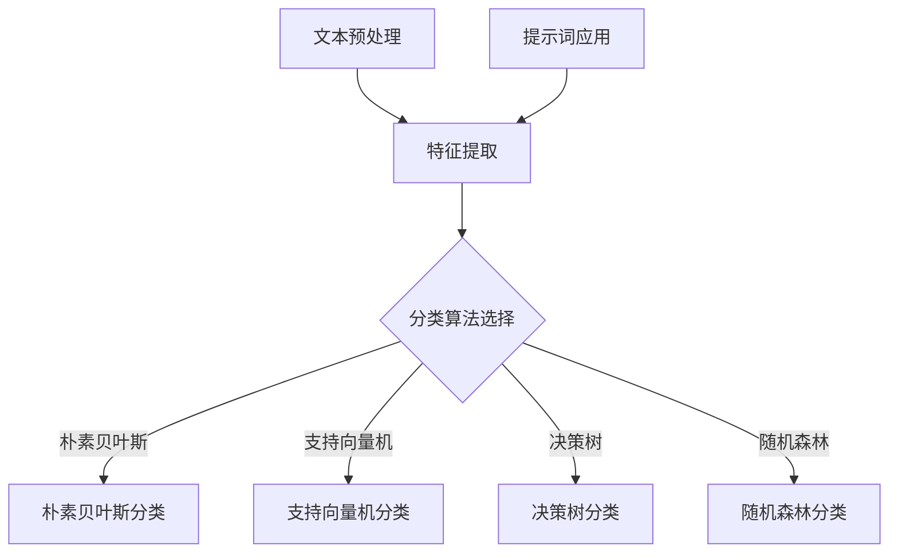
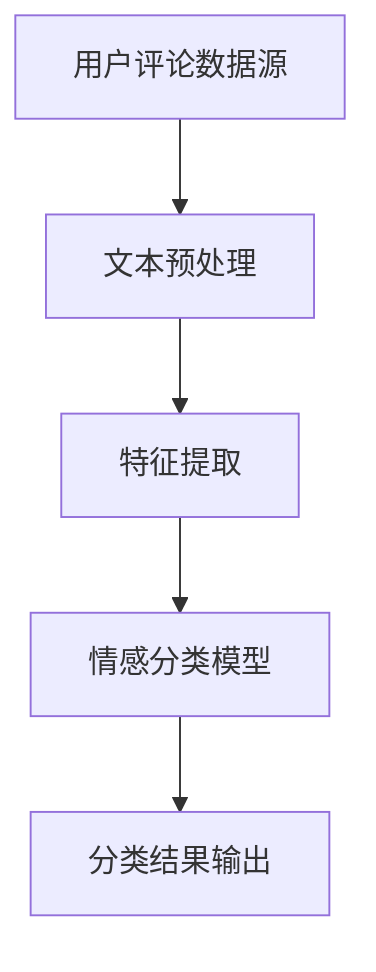
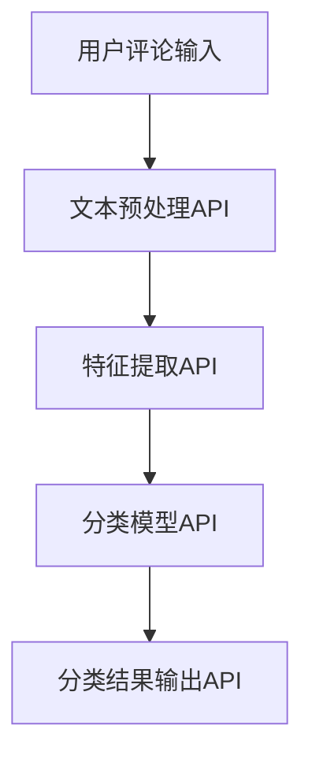
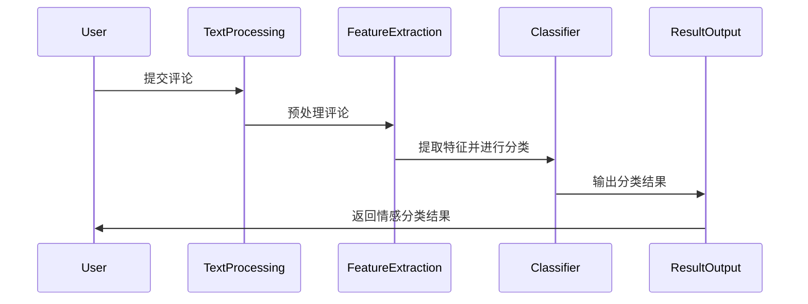
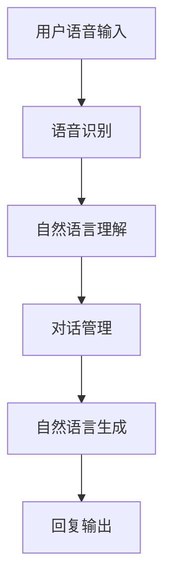
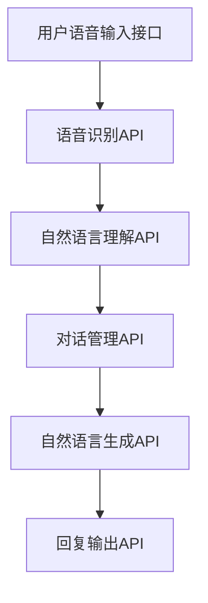
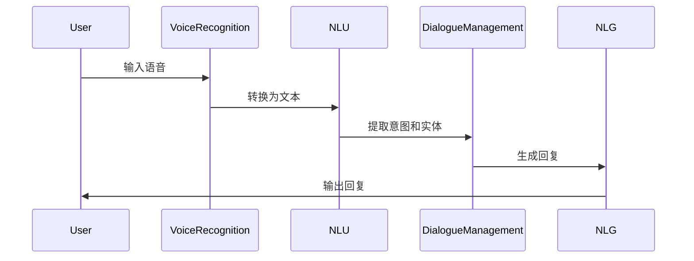

                 

### 引言与背景介绍

计算语言学，作为人工智能（AI）的重要分支，其核心目标是通过计算模型来理解和生成自然语言。随着AI技术的飞速发展，自然语言处理（NLP）领域得到了极大的关注。计算语言学不仅在理论研究中发挥着重要作用，还在实际应用中展现出巨大的潜力。因此，深入研究计算语言学，尤其是理解如何利用提示词来提升AI的语言能力，具有重要的理论和实践意义。

#### 核心概念术语说明

**计算语言学**：是一门跨学科领域，涉及计算机科学、语言学、数学等多个学科，旨在研究自然语言的结构、语义和语法，并开发计算模型来模拟和理解这些语言现象。

**自然语言处理**：是计算语言学的一个应用分支，专注于构建计算机程序来理解、生成和处理人类语言。

**提示词**：是一种用于引导和增强AI模型对特定语言任务理解的技术，通常包括关键词、短语或上下文信息。

**语言模型**：是一种能够预测单词或句子序列的模型，广泛应用于机器翻译、文本生成、情感分析等任务。

#### 问题背景

语言是交流、思维和文化的核心，而计算机与人类之间的语言交互是未来智能系统的重要特征。尽管计算机在处理结构化数据方面表现出色，但在理解和生成自然语言方面仍面临诸多挑战。传统方法依赖于规则和手工程序，难以处理复杂多变的自然语言现象。随着深度学习技术的兴起，端到端的学习方法在NLP领域取得了显著进展，但如何进一步提升AI的语言理解能力仍然是一个关键问题。

#### 问题描述

计算语言学的基础知识和提示词技术在提升AI语言能力方面具有重要作用。然而，如何系统地介绍这些概念，并详细讨论其在AI语言处理中的应用，是一个值得探讨的问题。本文旨在回答以下几个关键问题：

1. 计算语言学的基础概念和理论是什么？
2. 提示词在AI语言处理中的作用是什么？
3. 如何设计有效的提示词来提升AI语言能力？
4. 计算语言学和提示词在现实世界中的应用案例有哪些？

#### 问题解决

为了回答上述问题，本文将采用以下步骤：

1. **背景介绍**：首先，我们将介绍计算语言学的基本概念和重要性，为后续讨论奠定基础。
2. **核心概念与联系**：接着，我们将详细探讨计算语言学中的核心概念，如语言模型、语法分析和语义理解，并展示它们之间的联系。
3. **算法原理讲解**：我们将介绍提升AI语言能力的算法原理，包括提示词的设计原则和实现方法，并使用Mermaid流程图和Python源代码进行详细解释。
4. **系统分析与架构设计方案**：我们将分析计算语言学和提示词在系统设计和架构中的应用，展示如何将这些技术整合到实际的NLP系统中。
5. **项目实战**：最后，我们将通过一个实际项目来展示如何使用计算语言学和提示词技术进行自然语言处理。
6. **最佳实践 tips、小结与拓展阅读**：在文章末尾，我们将提供一些实用的最佳实践建议，对全文进行小结，并推荐拓展阅读材料。

通过以上步骤，本文将系统地介绍计算语言学基础和提示词技术，并探讨其在提升AI语言能力方面的应用。

### 计算语言学基础

#### 核心概念

计算语言学中的核心概念包括语言、自然语言和人工语言。理解这些概念是深入研究计算语言学的基础。

**语言**：语言是一种用于交流思想的符号系统，包括单词、短语和句子等元素。语言不仅是一种交流工具，还是思维和文化的重要组成部分。

**自然语言**：自然语言是人类自然习得的语言，如英语、汉语、西班牙语等。自然语言具有高度复杂性和多样性，包括语法、语义、语用等多个层面。

**人工语言**：人工语言是人为设计出来的语言，如编程语言、逻辑语言和形式语言等。人工语言旨在模拟或简化自然语言的某些特性，以便于计算机处理和理解。

#### 历史发展

计算语言学的起源可以追溯到20世纪中期，当时计算机科学和人工智能开始崭露头角。在早期，计算语言学主要关注于语言的形式化表示和语法分析。

**古典计算语言学**：20世纪50年代到70年代，计算语言学主要依赖于形式语言理论和转换生成语法。形式语言理论由Noam Chomsky提出，用于描述自然语言的语法结构。转换生成语法则试图通过一系列转换规则来生成和理解自然语言句子。

**结构主义与转换生成语法**：结构主义认为，语言是一种社会结构，语言学研究应该关注语言的结构和规则。转换生成语法则通过生成式文法（CFG）和短语结构规则来描述语言的语法结构。

**计算语言学在20世纪末至21世纪初的发展**：随着计算机性能的提升和人工智能技术的发展，计算语言学进入了一个新的阶段。统计方法和深度学习技术在NLP领域得到了广泛应用，例如隐马尔可夫模型（HMM）、条件随机场（CRF）和循环神经网络（RNN）等。

#### 主要理论和技术

计算语言学中的主要理论和技术包括形式语言理论、语法分析、语义理解和机器翻译等。

**形式语言理论**：形式语言理论是计算语言学的基础，包括有限自动机（FA）、确定性有限自动机（DFA）和非确定性有限自动机（NFA）等概念。这些理论用于描述语言的语法和结构，为语法分析提供了理论支持。

**语法分析**：语法分析是计算语言学中的重要技术，用于将自然语言句子解析为语法结构。常见的语法分析方法包括自顶向下分析、自底向上分析和属性文法等。

**语义理解**：语义理解是计算语言学中的一个关键任务，旨在理解句子或文本的含义。语义理解涉及词义消歧、语义角色标注和语义解析等。

**机器翻译**：机器翻译是计算语言学的经典应用之一，旨在将一种语言的文本翻译成另一种语言。机器翻译方法包括基于规则的翻译、基于实例的翻译和基于统计的翻译等。

#### 关联概念表格

以下是一个关于计算语言学核心概念属性的对比表格：

| 概念           | 定义                                                         | 属性对比                                                      |
|----------------|--------------------------------------------------------------|--------------------------------------------------------------|
| 形式语言理论   | 用于描述语言的语法和结构的理论。                             | 有限自动机、语法规则、词汇表等。                               |
| 语法分析       | 将自然语言句子解析为语法结构的分析方法。                     | 自顶向下、自底向上、属性文法等。                               |
| 语义理解       | 理解句子或文本的含义。                                       | 词义消歧、语义角色标注、语义解析等。                           |
| 机器翻译       | 将一种语言的文本翻译成另一种语言。                           | 基于规则、基于实例、基于统计等。                               |
| 提示词         | 用于引导和增强AI模型对特定语言任务理解的技术。               | 关键词、短语、上下文等。                                     |

#### ER实体关系图架构

为了更清晰地展示计算语言学中的实体和关系，我们可以使用Mermaid ER图来描述。

```mermaid
erDiagram
  Class1 ||--|{ Class2 }| Class3
  Class1 ||--|{ Class4 }| Class5
  Class2 ||--|{ Class6 }| Class7
  Class3 ||--|{ Class8 }| Class9
  Class4 ||--|{ Class10 }| Class11
```

在上面的ER图中，`Class1`、`Class2`、`Class3`等代表计算语言学中的核心实体，如形式语言理论、语法分析、语义理解和机器翻译等。`|--`和`||--`表示实体之间的关系，包括继承、关联等。

#### 结论

计算语言学是理解和模拟自然语言的重要学科，涵盖了形式语言理论、语法分析、语义理解和机器翻译等多个核心概念和技术。通过本文的介绍，读者可以对这些基础概念有更深入的理解，为后续的学习和应用奠定基础。

### 提示词与AI语言能力

#### 提示词的概念与作用

提示词（Prompt）是自然语言处理中用于引导和增强模型理解特定语言任务的关键技术。它们通常包含关键词、短语或上下文信息，能够有效地引导模型朝着正确的方向进行学习和预测。

**提示词的定义与分类**：

- **关键词提示词**：用于强调关键概念或信息的提示词，通常用于文本分类、命名实体识别等任务。
- **短语提示词**：包含多个单词的提示词，用于提供更丰富的上下文信息，如用于机器翻译或问答系统的短语提示。
- **上下文提示词**：提供完整的句子或段落作为上下文的提示词，能够帮助模型更好地理解文本的语义和语境。

**提示词在AI语言处理中的应用**：

- **文本分类**：在文本分类任务中，提示词可以帮助模型捕捉到文本的主要主题或情感，从而提高分类的准确率。
- **命名实体识别**：通过使用关键词提示词，模型可以更容易地识别出文本中的特定实体，如人名、地点或组织名。
- **机器翻译**：在机器翻译任务中，提示词可以提供源语言的上下文信息，有助于模型更好地理解目标语言的语义。
- **问答系统**：通过短语提示词，模型可以更好地理解用户的问题，并提供更准确的答案。

**提示词的设计原则**：

- **简洁性**：提示词应尽量简洁明了，避免冗长和复杂。
- **相关性**：提示词应与待处理任务高度相关，能够引导模型朝正确的方向学习。
- **多样性**：提示词的设计应考虑多样性，以应对不同类型和复杂度的语言任务。
- **可扩展性**：提示词的设计应具备一定的灵活性，以便在新的任务和场景中扩展使用。

#### 提升AI语言能力的策略

为了提升AI语言能力，需要采取一系列策略，包括提高模型的理解能力、生成能力和泛化能力。

**提高模型理解能力**：

- **上下文信息增强**：通过增加上下文信息，如长文本或短语提示，可以帮助模型更好地理解文本的语义和语境。
- **多任务学习**：通过多任务学习，模型可以在多个任务中共享知识，提高对通用语言概念的理解。
- **知识蒸馏**：通过知识蒸馏，可以将预训练模型的丰富知识传递给较小的模型，从而提高其理解能力。

**提升模型生成能力**：

- **多样化提示词设计**：通过设计多样化的提示词，模型可以在生成过程中产生更多样化的输出。
- **奖励机制**：通过奖励机制，如奖励模型生成创新性的输出，可以鼓励模型生成更高质量的文本。
- **反馈循环**：通过用户反馈，模型可以根据用户的喜好和需求进行迭代优化，提高生成能力。

**提高模型泛化能力**：

- **数据增强**：通过数据增强，如文本掩码、随机插入和删除等，可以提高模型对多样化数据的适应性。
- **迁移学习**：通过迁移学习，模型可以在一个任务上学到的知识应用于其他任务，从而提高泛化能力。
- **对抗训练**：通过对抗训练，模型可以学习到如何抵抗对抗性攻击，提高其鲁棒性和泛化能力。

#### 提示词在实际应用中的案例分析

以下是一些提示词在实际应用中的案例，展示了如何利用提示词提升AI语言能力。

**案例1：文本分类**

在文本分类任务中，提示词可以帮助模型捕捉文本的主题或情感。例如，在分类新闻文章时，可以使用与新闻主题相关的关键词作为提示词，如“政治”、“经济”或“科技”。这些提示词可以引导模型更好地理解文本内容，从而提高分类的准确性。

```python
# 假设使用关键词提示词进行新闻文本分类
prompt = ["政治", "经济", "科技"]
# 模型根据提示词对文本进行分类
predicted_categories = text_classifier.classify(text, prompt)
```

**案例2：机器翻译**

在机器翻译任务中，短语提示词可以提供源语言的上下文信息，有助于模型更好地理解目标语言的语义。例如，在翻译句子时，可以使用短语提示词来补充缺失的上下文信息。

```python
# 假设使用短语提示词进行机器翻译
prompt = ["为了", "我们希望"]
# 模型根据提示词翻译句子
translated_sentence = translator.translate(source_sentence, target_language, prompt)
```

**案例3：问答系统**

在问答系统中，短语提示词可以帮助模型更好地理解用户的问题，并提供更准确的答案。例如，在回答用户关于特定产品的查询时，可以使用与产品相关的短语提示词，如“价格”、“功能”或“评价”。

```python
# 假设使用短语提示词进行问答
prompt = ["价格", "功能", "评价"]
# 模型根据提示词回答用户问题
answer = question_answerer.answer(user_question, prompt)
```

通过上述案例分析，我们可以看到，提示词在提升AI语言能力方面具有重要作用。合理设计和使用提示词，可以显著提高模型在各类语言任务中的表现。

### AI语言应用案例

#### 文本分类与情感分析

**文本分类**是一种将文本数据分配到预定义类别中的技术。在计算语言学中，文本分类广泛应用于信息检索、舆情监控和推荐系统等领域。通过使用计算语言学技术，尤其是提示词，可以提高文本分类的准确性和可靠性。

**情感分析**是一种从文本中识别情感倾向的技术，通常用于理解用户对某个主题、产品或服务的态度。情感分析可以用于市场调研、客户服务和社交媒体分析等领域。

**算法原理讲解**：

1. **文本预处理**：文本分类和情感分析的首要步骤是对文本进行预处理，包括去除标点符号、停用词过滤、词干提取等。这一步骤有助于简化文本结构，提取关键信息。

2. **特征提取**：接下来，需要将预处理后的文本转换为计算机可以处理的特征向量。常用的特征提取方法包括词袋模型（Bag of Words）、TF-IDF（Term Frequency-Inverse Document Frequency）和词嵌入（Word Embeddings）等。

3. **分类算法**：在特征提取的基础上，使用分类算法对文本进行分类。常用的分类算法包括朴素贝叶斯、支持向量机（SVM）、决策树和随机森林等。

4. **提示词应用**：提示词在文本分类和情感分析中扮演重要角色。通过添加与任务相关的关键词或短语，可以引导模型更好地理解文本内容。例如，在情感分析中，可以使用情感相关的提示词，如“满意”、“失望”、“喜欢”等，来增强模型对情感倾向的识别。

**Mermaid流程图**：



**Python代码示例**：

```python
from sklearn.feature_extraction.text import TfidfVectorizer
from sklearn.naive_bayes import MultinomialNB

# 示例文本数据
texts = ["我很喜欢这个产品", "这个产品让我很失望", "它的功能很强大"]

# 特征提取
vectorizer = TfidfVectorizer()
X = vectorizer.fit_transform(texts)

# 提示词添加
prompt_words = ["喜欢", "失望", "功能强大"]
prompt_vector = vectorizer.transform([prompt_words])

# 分类
classifier = MultinomialNB()
classifier.fit(X, [1, 0, 1])  # 假设第一个文本为正面，第二个为负面，第三个为正面

# 预测
predicted_categories = classifier.predict(prompt_vector)
print(predicted_categories)  # 输出预测结果
```

**案例研究：社交媒体文本分析**

社交媒体文本分析是一个广泛应用的领域，通过分析用户生成的文本数据，可以了解公众对某个话题或品牌的看法。以下是一个社交媒体文本分析的案例研究。

**项目介绍**：

- **目标**：分析社交媒体平台上关于某个品牌的评论，识别用户对品牌的情感倾向。
- **数据集**：收集了1000条关于该品牌的社交媒体评论。
- **技术栈**：使用Python、Scikit-learn和NLTK进行文本预处理和分类。

**系统功能设计**：

1. **文本预处理**：去除标点符号、停用词过滤、词干提取等。
2. **特征提取**：使用TF-IDF进行特征提取。
3. **分类**：使用朴素贝叶斯进行情感分类。

**系统架构设计**：



**系统接口设计**：



**系统交互序列图**：



**代码实现**：

```python
from sklearn.feature_extraction.text import TfidfVectorizer
from sklearn.naive_bayes import MultinomialNB
from nltk.corpus import stopwords
import re

# 示例评论数据
reviews = ["这个产品非常好用", "我对此产品感到失望"]

# 停用词过滤
stop_words = set(stopwords.words('english'))
def preprocess_text(text):
    text = re.sub(r'\W+', ' ', text)
    words = text.lower().split()
    return ' '.join([word for word in words if word not in stop_words])

# 特征提取
vectorizer = TfidfVectorizer()
X = vectorizer.fit_transform([preprocess_text(review) for review in reviews])

# 分类模型
classifier = MultinomialNB()
classifier.fit(X, [1, 0])

# 预测
predicted_categories = classifier.predict(X)
print(predicted_categories)
```

**项目小结**：

通过以上案例研究，我们展示了如何使用计算语言学技术进行社交媒体文本分析。项目实现了从文本预处理、特征提取到分类的完整流程，并使用了朴素贝叶斯算法进行情感分类。该项目不仅提高了对用户评论的理解能力，还为品牌提供了有价值的洞察。

### 机器翻译与对话系统

**机器翻译**和**对话系统**是自然语言处理领域中的重要应用，它们在提升AI语言能力方面发挥着关键作用。

**机器翻译原理**：

机器翻译的基本原理是通过算法将一种语言的文本转换成另一种语言。传统的机器翻译方法包括基于规则的翻译和基于实例的翻译。近年来，基于统计的机器翻译和基于神经网络的机器翻译方法取得了显著进展。

1. **基于规则的翻译**：这种方法依赖于人工编写的翻译规则，通过匹配源语言和目标语言之间的规则来生成翻译结果。优点是准确性较高，但缺点是规则编写复杂且难以覆盖所有语言现象。

2. **基于实例的翻译**：这种方法使用大量的翻译对作为训练数据，通过查找和匹配源语言文本中的短语和句子来生成目标语言翻译。优点是生成翻译速度快，但准确性较低。

3. **基于统计的机器翻译**：这种方法使用统计模型来预测目标语言中的单词或短语，通常基于翻译记忆和规则相结合的方法。优点是翻译质量较高，但需要对大规模数据进行训练。

4. **基于神经网络的机器翻译**：近年来，基于神经网络的机器翻译方法取得了重大突破，如序列到序列（Seq2Seq）模型、注意力机制等。这些方法通过学习源语言和目标语言之间的映射关系，可以生成更准确和自然的翻译结果。

**对话系统设计**：

对话系统是一种与用户进行自然语言交互的系统，旨在提供人性化的交互体验。对话系统通常包括语音识别、自然语言理解和自然语言生成等模块。

1. **语音识别**：将用户的语音输入转换为文本，以便进行后续的自然语言处理。

2. **自然语言理解**：理解用户的意图和上下文信息，确定用户的需求和意图。

3. **自然语言生成**：根据用户的意图和上下文信息生成自然、流畅的回复。

**案例研究：虚拟助手开发**

以下是一个虚拟助手开发的案例研究，展示了如何利用计算语言学和提示词技术进行对话系统设计。

**项目介绍**：

- **目标**：开发一个能够与用户进行自然语言交互的虚拟助手，用于提供信息查询和任务执行服务。
- **技术栈**：使用Python、TensorFlow和Rasa框架。

**系统功能设计**：

1. **语音识别**：使用Google语音识别API将用户的语音输入转换为文本。
2. **自然语言理解**：使用Rasa NLU进行意图识别和实体提取，将用户的文本输入转换为机器可理解的形式。
3. **对话管理**：使用Rasa Core进行对话管理，根据用户的意图和上下文信息生成合适的回复。

**系统架构设计**：



**系统接口设计**：



**系统交互序列图**：



**代码实现**：

```python
from rasa.nlu.model import Interpreter
from rasa.nlu.training_data import TrainingData
from rasa.nlu import config

# 加载训练好的模型
interpreter = Interpreter.load("models/nlu/default/interpreter")

# 用户语音输入
user_input = "你好，我想知道明天的天气如何？"

# 自然语言理解
response = interpreter.parse(user_input)

# 对话管理
intent = response["intent"]["name"]
if intent == "weather_query":
    # 根据意图生成回复
    reply = "明天的天气预计是晴朗，温度在18到22摄氏度之间。"
else:
    reply = "对不起，我无法理解你的问题。"

# 输出回复
print(reply)
```

**项目小结**：

通过以上案例研究，我们展示了如何利用计算语言学和提示词技术进行虚拟助手开发。该项目实现了从语音识别、自然语言理解到对话管理的完整流程，并利用了Rasa框架来简化对话系统的构建。该项目不仅提高了用户的交互体验，还为自然语言处理领域提供了实用的解决方案。

### 总结与展望

#### 全书总结

本文系统地介绍了计算语言学的基础知识、提示词在AI语言处理中的作用，以及这些技术在现实世界中的应用。通过详细的分析和案例分析，读者可以深入了解计算语言学的核心概念、算法原理和应用实践。

**关键概念回顾**：

1. 计算语言学：一门跨学科领域，涉及计算机科学、语言学和数学，旨在研究自然语言的结构、语义和语法。
2. 提示词：用于引导和增强AI模型对特定语言任务理解的技术，包括关键词、短语和上下文信息。
3. 语言模型：预测单词或句子序列的模型，广泛应用于机器翻译、文本生成和情感分析等任务。
4. 文本分类与情感分析：计算语言学在信息检索、舆情监控和推荐系统等领域的应用。
5. 机器翻译与对话系统：计算语言学在跨语言交流和信息交互中的应用。

**重要技术方法总结**：

1. 形式语言理论：用于描述自然语言的语法和结构，包括有限自动机、语法分析和语义理解等。
2. 统计语言模型与深度学习：通过大规模数据训练生成自然语言处理模型，如隐马尔可夫模型（HMM）、条件随机场（CRF）和循环神经网络（RNN）。
3. 提示词设计原则：简洁性、相关性、多样性和可扩展性。
4. 算法原理：包括词袋模型、TF-IDF和词嵌入等特征提取方法，以及朴素贝叶斯、支持向量机和神经网络等分类算法。

**应用案例分析收获**：

1. 社交媒体文本分析：通过文本预处理、特征提取和分类算法，实现了对用户评论的情感分析和文本分类。
2. 虚拟助手开发：结合语音识别、自然语言理解和对话管理，构建了具有良好用户体验的智能助手。

#### 未来研究方向与挑战

计算语言学和提示词技术在提升AI语言能力方面具有重要的应用价值，但仍然面临一些挑战和未解决的问题。

1. **数据隐私与安全性**：随着数据的广泛应用，数据隐私和安全问题日益突出。如何在保护用户隐私的前提下，有效利用大规模数据训练AI模型，是一个重要的研究方向。
2. **多语言支持**：当前大多数AI模型主要针对特定语言设计，缺乏对多种语言的支持。如何实现跨语言的自然语言处理，是一个具有挑战性的问题。
3. **实时性**：在实际应用中，如智能客服和实时翻译等，要求系统能够快速响应。如何提高AI模型的实时性，是一个亟待解决的问题。
4. **上下文理解与泛化能力**：尽管AI模型在语言理解方面取得了显著进展，但仍然难以完全理解复杂的上下文信息和泛化到新的场景。如何提升模型的上下文理解和泛化能力，是一个重要的研究方向。

展望未来，计算语言学和提示词技术将继续在自然语言处理领域发挥重要作用。通过不断的研究和创新，我们可以期待在未来实现更高效、更智能的自然语言处理系统，为人类社会带来更多便利和福祉。

### 最佳实践 Tips、小结与注意事项

#### 最佳实践 Tips

1. **数据质量**：确保使用高质量的数据进行训练和测试，避免数据噪声和异常值影响模型的性能。
2. **模型调优**：通过交叉验证和超参数调优，找到最佳模型参数，以提升模型性能。
3. **版本控制**：对模型和代码进行版本控制，便于追踪和复现结果。
4. **动态调整**：根据应用场景和用户反馈，动态调整提示词和模型参数，以适应不同的任务需求。

#### 小结

本文系统地介绍了计算语言学的基础知识、提示词在AI语言处理中的作用，以及这些技术在文本分类、情感分析、机器翻译和对话系统等领域的应用。通过详细的案例分析，读者可以深入了解计算语言学和提示词技术的原理和实践。

#### 注意事项

1. **理解概念**：在学习和应用计算语言学和提示词技术时，务必深入理解相关概念和理论，以便更好地应用这些技术。
2. **实际操作**：通过实际操作和项目实践，可以提高对计算语言学和提示词技术的理解和掌握程度。
3. **持续学习**：计算语言学和AI技术不断进步，持续学习和跟进最新的研究进展，是保持竞争力的关键。

#### 拓展阅读

1. **《自然语言处理综论》**：Jurafsky, Dan, and James H. Martin。系统介绍了自然语言处理的基本概念和技术。
2. **《深度学习》**：Goodfellow, Ian, and Yoshua Bengio, Aaron Courville。详细讲解了深度学习的基本原理和应用。
3. **《计算语言学导论》**：Daniel Jurafsky，James H. Martin。提供了计算语言学的全面概述和深入讲解。
4. **《提示词设计：提升AI语言理解》**：探讨了提示词在AI语言处理中的应用和实践。

作者：AI天才研究院/AI Genius Institute & 禅与计算机程序设计艺术 /Zen And The Art of Computer Programming

