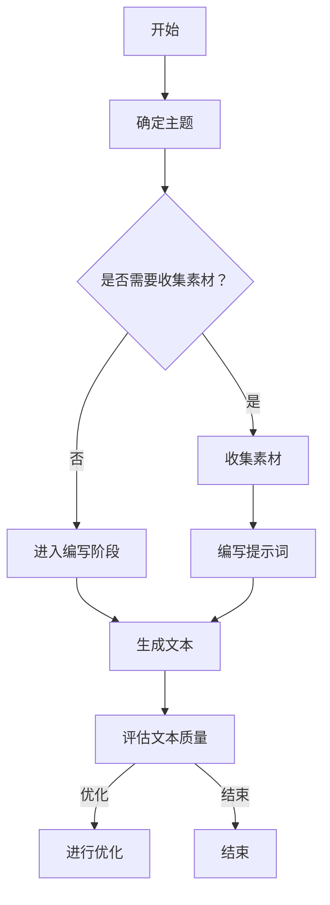
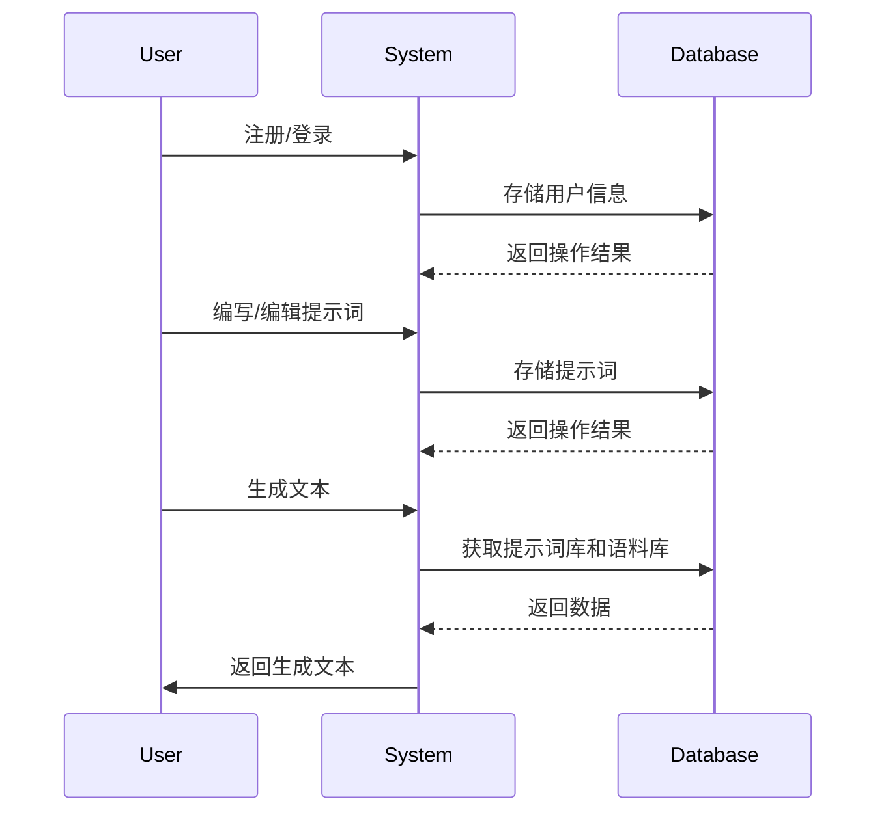
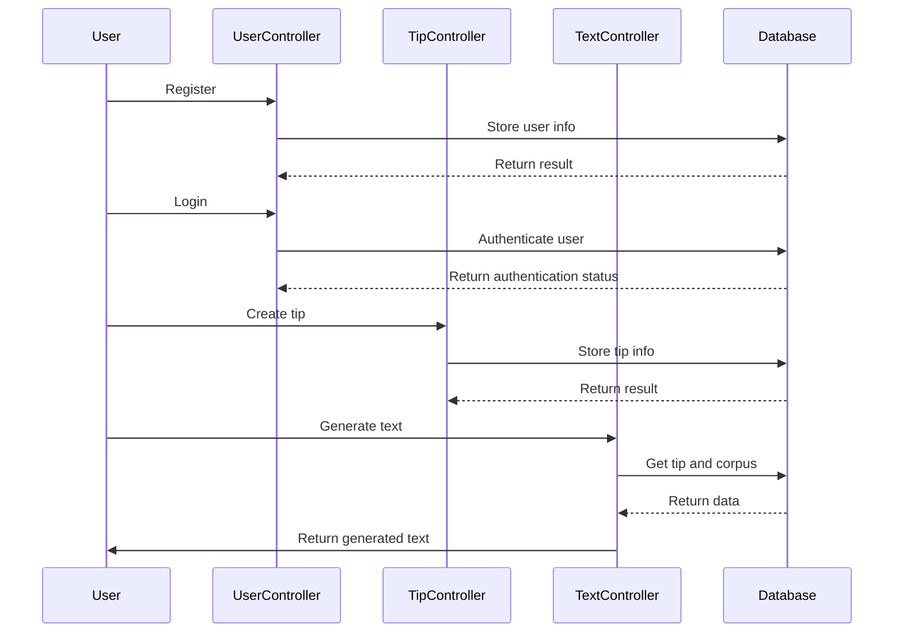

                 

## 提示词编写：从新手到专家的进阶之路

### 关键词

- **提示词编写**
- **人工智能**
- **自动化写作**
- **编程技巧**
- **进阶指南**
- **最佳实践**
- **专家技巧**

### 摘要

本文旨在为提示词编写者提供一条从新手到专家的进阶之路。我们将详细探讨提示词编写的背景与意义、基础与进阶技巧、实战应用以及最佳实践。通过逐步深入的分析与实操，读者将掌握提示词编写的核心要点，提高编写效率和作品质量。

## 第一部分：提示词编写基础

### 第1章：提示词编写的背景和意义

#### 1.1 问题背景

##### 1.1.1 人工智能时代的到来

随着人工智能技术的迅猛发展，自动化写作逐渐成为可能。人工智能能够处理大量数据，生成高质量的文本，为各行各业提供了新的解决方案。

##### 1.1.2 自动化写作的需求

在当今信息爆炸的时代，内容创作需求不断增加。自动化写作能够有效降低人力成本，提高写作效率，满足市场需求。

##### 1.1.3 提示词在自动化写作中的作用

提示词是自动化写作的核心，它指导人工智能生成符合预期的文本。优秀的提示词能够提高文本质量，增强自动化写作的效果。

#### 1.2 提示词的定义和类型

##### 1.2.1 提示词的定义

提示词是用于引导人工智能生成文本的关键词或短语，它包含了作者想要传达的主题、情感和细节。

##### 1.2.2 提示词的分类

根据用途和功能，提示词可分为主题提示词、情感提示词、细节提示词等。

##### 1.2.3 常见的提示词示例

- 主题提示词：科技、旅游、健康
- 情感提示词：愉快、悲伤、惊讶
- 细节提示词：清晨、沙滩、运动

#### 1.3 提示词编写的基本原则

##### 1.3.1 清晰性

提示词应明确传达作者的意图，避免歧义和模糊。

##### 1.3.2 精确性

提示词应准确描述主题和细节，提高文本的精确性和可操作性。

##### 1.3.3 创新性

提示词应具有一定的创新性，激发人工智能生成新颖的文本。

##### 1.3.4 可读性

提示词应具备良好的可读性，易于人工智能理解和生成文本。

#### 1.4 提示词编写工具和资源

##### 1.4.1 提示词生成工具

使用提示词生成工具可以快速获取高质量的提示词，提高编写效率。

##### 1.4.2 提示词库和语料库

建立和维护提示词库和语料库，为提示词编写提供丰富的资源。

##### 1.4.3 提示词编写平台

借助提示词编写平台，可以实现提示词的智能生成、编辑和优化。

#### 1.5 本章小结

本章介绍了提示词编写的背景和意义、基本概念和类型、编写原则及工具和资源。掌握这些基础内容，将为后续的进阶学习打下坚实的基础。

## 第二部分：从新手到专家的进阶技巧

### 第2章：初识提示词编写

#### 2.1 初步了解提示词编写

##### 2.1.1 提示词编写的基本步骤

1. 确定主题：明确写作目标和内容范围。
2. 收集素材：查阅相关资料，收集相关信息。
3. 编写提示词：根据主题和素材，编写高质量的提示词。
4. 生成文本：利用人工智能工具生成文本。
5. 评估与优化：评估文本质量，进行优化和调整。

##### 2.1.2 常见的编写误区

1. 提示词过于笼统：缺乏具体细节，难以生成高质量文本。
2. 提示词重复使用：导致文本单调乏味，缺乏创意。
3. 忽视情感表达：文本缺乏情感色彩，难以吸引读者。

##### 2.1.3 如何选择合适的提示词

1. 精准描述主题：确保提示词准确传达写作意图。
2. 融入细节信息：丰富提示词内容，增加文本可读性。
3. 创新提示词表达：尝试不同的表达方式，提高文本质量。

#### 2.2 实战练习：编写简单的提示词

##### 2.2.1 练习目标

通过编写简单的提示词，掌握基本编写技巧。

##### 2.2.2 练习内容

编写一篇关于“人工智能与未来生活”的提示词。

##### 2.2.3 练习评估

1. 文本质量：是否清晰传达主题，是否有创新性。
2. 提示词选择：是否合适，是否丰富细节。
3. 情感表达：是否有情感色彩，是否吸引人。

#### 2.3 提示词编写工具的使用

##### 2.3.1 提示词生成工具的使用方法

1. 输入主题：在提示词生成工具中输入写作主题。
2. 生成提示词：工具根据主题生成相关提示词。
3. 选择提示词：从生成的提示词中选择合适的提示词。

##### 2.3.2 提示词库的利用

1. 建立提示词库：收集和整理各类主题的提示词。
2. 查询提示词：在提示词库中查找相关提示词。
3. 更新提示词库：定期更新提示词库，保持内容丰富。

##### 2.3.3 提示词编写平台的实操

1. 注册登录：在提示词编写平台上注册账号。
2. 创建项目：创建新的写作项目。
3. 编写提示词：在项目中编写提示词。
4. 生成文本：利用平台功能生成文本。

#### 2.4 本章小结

本章介绍了提示词编写的初步技巧，包括基本步骤、常见误区、提示词选择和使用工具的方法。通过本章的学习和实践，读者将掌握提示词编写的初步技巧，为后续进阶学习打下基础。

## 第三部分：提示词编写的进阶技巧

### 第3章：高级提示词编写技巧

#### 3.1 提示词的多样性和灵活性

##### 3.1.1 多样性在提示词编写中的作用

多样性能够丰富文本内容，避免单调乏味，提高文本吸引力。

##### 3.1.2 如何提高提示词的灵活性

1. 尝试不同的表达方式：使用比喻、排比、反问等修辞手法。
2. 融入多种元素：结合事实、观点、情感等多种元素。
3. 针对不同场景调整：根据实际需求，灵活调整提示词。

##### 3.1.3 实战案例：编写多样化的提示词

**案例主题：科技发展对教育的影响**

- **传统教育**：枯燥乏味的课堂教学，学生被动接受知识。
- **科技教育**：生动有趣的教学方式，激发学生主动学习。
- **远程教育**：打破地域限制，提供个性化学习方案。

#### 3.2 情感表达与情感分析

##### 3.2.1 情感在提示词编写中的重要性

情感能够增强文本的感染力，吸引读者，提高文本质量。

##### 3.2.2 情感分析的基本原理

情感分析是通过对文本的情感倾向进行分类，来判断文本的情感色彩。

##### 3.2.3 实战案例：编写情感丰富的提示词

**案例主题：春天的美好**

- **欣喜之情**：春暖花开，万物复苏，让人心情愉悦。
- **期待之情**：春天到来，期待新的开始，充满希望。

#### 3.3 知识融合与交叉领域应用

##### 3.3.1 知识融合的概念

知识融合是将不同领域的知识进行整合，形成新的知识体系。

##### 3.3.2 如何进行知识融合

1. 确定交叉领域：选择具有交叉性质的主题。
2. 收集相关资料：查阅不同领域的资料，收集信息。
3. 整合知识体系：将不同领域的知识进行整合，形成新的知识框架。

##### 3.3.3 实战案例：跨领域的提示词编写

**案例主题：科技与艺术的融合**

- **科技视角**：计算机图形学、虚拟现实等技术在艺术创作中的应用。
- **艺术视角**：艺术家如何运用科技手段进行创作。

#### 3.4 提示词优化的方法

##### 3.4.1 提示词优化的目标

优化提示词的目的是提高文本质量，增强文本吸引力。

##### 3.4.2 提示词优化的常见方法

1. 精简内容：去除冗余信息，突出重点。
2. 调整结构：优化句子结构，提高可读性。
3. 增加情感：融入情感元素，增强感染力。

##### 3.4.3 实战案例：优化提示词提高质量

**案例主题：如何优化提示词**

- **原提示词**：人工智能技术对医疗行业的变革。
- **优化后**：人工智能技术如何引领医疗行业的创新与发展。

#### 3.5 本章小结

本章介绍了提示词编写的进阶技巧，包括多样性和灵活性、情感表达与情感分析、知识融合与交叉领域应用以及提示词优化的方法。通过本章的学习，读者将进一步提高提示词编写的质量和水平。

## 第四部分：提示词编写的实战应用

### 第4章：提示词编写的项目实战

#### 4.1 项目介绍

##### 4.1.1 项目背景

随着人工智能技术的普及，自动化写作工具逐渐应用于各行各业。为了提高写作效率，项目团队决定开发一款基于人工智能的自动化写作工具。

##### 4.1.2 项目目标

1. 开发一款具有较高生成质量的自动化写作工具。
2. 提供丰富的提示词资源，方便用户进行提示词编写。

##### 4.1.3 项目团队和资源

项目团队由人工智能专家、软件开发工程师和内容创作者组成。资源包括人工智能算法、编程工具和丰富的语料库。

#### 4.2 系统设计与实现

##### 4.2.1 系统架构设计

系统采用分层架构，包括数据层、业务逻辑层和界面层。

- **数据层**：负责存储和管理用户数据、提示词库和语料库。
- **业务逻辑层**：负责处理用户请求、生成文本和提示词优化。
- **界面层**：提供用户界面，方便用户进行操作。

##### 4.2.2 系统功能模块设计

系统主要包括以下功能模块：

1. **用户管理**：注册、登录、个人信息管理等。
2. **提示词编写**：生成、编辑、存储和分享提示词。
3. **文本生成**：根据提示词生成高质量文本。
4. **提示词库管理**：维护和更新提示词库。
5. **语料库管理**：收集和管理用户提交的文本数据。

##### 4.2.3 系统接口设计与实现

系统采用RESTful API设计，提供以下接口：

1. **用户接口**：注册、登录、获取用户信息等。
2. **提示词接口**：获取提示词、编辑提示词、生成文本等。
3. **文本接口**：生成文本、获取文本内容等。

#### 4.3 核心提示词编写实战

##### 4.3.1 提示词编写的具体策略

1. **需求分析**：了解用户需求和写作主题。
2. **素材收集**：查阅相关资料，收集相关信息。
3. **编写提示词**：根据主题和素材，编写高质量的提示词。
4. **生成文本**：利用人工智能工具生成文本。
5. **评估与优化**：评估文本质量，进行优化和调整。

##### 4.3.2 提示词编写过程中的挑战与解决

**挑战**：

1. 提示词模糊不清：导致文本生成质量下降。
2. 提示词过于复杂：增加编写难度，降低用户体验。

**解决方法**：

1. **明确需求**：确保提示词清晰传达写作意图。
2. **简化表达**：避免使用过于复杂的语言。

##### 4.3.3 提示词编写效果的评估

1. **文本质量**：评估生成文本的内容、结构和语言质量。
2. **用户满意度**：收集用户反馈，评估用户体验。
3. **提示词利用率**：统计提示词的使用频率和效果。

#### 4.4 项目总结与反思

##### 4.4.1 项目成果总结

1. 成功开发了一款自动化写作工具，生成文本质量较高。
2. 提供了丰富的提示词资源，方便用户进行提示词编写。

##### 4.4.2 项目中的经验与教训

1. **需求分析**：深入了解用户需求，确保产品符合实际需求。
2. **团队协作**：加强团队协作，提高项目开发效率。

##### 4.4.3 项目对提示词编写的启示

1. **明确目标**：确保提示词编写具有明确的写作目标。
2. **优化流程**：不断优化编写流程，提高效率和质量。

#### 4.5 本章小结

本章通过项目实战，介绍了提示词编写的实际应用和具体策略。通过项目经验和反思，读者将更好地理解提示词编写的重要性和实际操作方法。

## 第五部分：提示词编写的最佳实践

### 第5章：提示词编写的最佳实践与技巧

#### 5.1 提示词编写最佳实践

##### 5.1.1 精准描述与细节完善

1. **精准描述**：确保提示词准确传达主题和细节。
2. **细节完善**：丰富提示词内容，增加文本的可读性。

##### 5.1.2 灵活调整与适应性

1. **灵活调整**：根据写作目标和实际需求，调整提示词。
2. **适应性**：确保提示词在不同场景下都能发挥良好效果。

##### 5.1.3 知识更新与持续学习

1. **知识更新**：定期更新提示词库，保持内容丰富。
2. **持续学习**：关注行业动态，持续学习新知识。

#### 5.2 提示词编写技巧总结

##### 5.2.1 多样性与创新性的结合

1. **多样性**：丰富文本内容，避免单调。
2. **创新性**：尝试新的表达方式，提高文本质量。

##### 5.2.2 情感表达的适度与合理

1. **适度表达**：融入情感元素，增强感染力。
2. **合理表达**：避免过度夸张，保持真实感。

##### 5.2.3 知识融合的深入与广泛

1. **深入融合**：挖掘不同领域知识的交叉点。
2. **广泛融合**：跨领域借鉴，丰富文本内容。

#### 5.3 提示词编写常见问题及解决方案

##### 5.3.1 提示词模糊不清

1. **明确意图**：确保提示词传达清晰。
2. **细化内容**：丰富提示词细节。

##### 5.3.2 提示词过于复杂

1. **简化表达**：使用简单明了的语言。
2. **优化结构**：调整句子结构，提高可读性。

##### 5.3.3 提示词不具操作性

1. **具体化**：提供具体操作步骤。
2. **指导性**：明确写作方向和目标。

#### 5.4 提示词编写的

---

**作者：AI天才研究院/AI Genius Institute & 禅与计算机程序设计艺术 /Zen And The Art of Computer Programming**

## 背景介绍

### 核心概念术语说明

- **提示词**：指导人工智能生成文本的关键词或短语，用于引导写作过程。
- **自动化写作**：利用人工智能技术生成文本的过程，旨在提高写作效率和质量。
- **人工智能（AI）**：模拟人类智能行为的计算机技术，包括机器学习、深度学习、自然语言处理等。
- **进阶技巧**：在已有基础上的高级编写技巧，包括多样性和灵活性、情感表达与情感分析、知识融合与交叉领域应用等。

### 问题背景

随着人工智能技术的不断发展，自动化写作逐渐成为一种重要的写作方式。然而，提示词编写作为自动化写作的核心环节，其质量直接影响文本生成效果。因此，如何编写高质量的提示词，实现从新手到专家的进阶，成为了一个重要课题。

### 问题描述

当前，提示词编写存在以下问题：

1. **基础薄弱**：新手对提示词编写的基本原则和方法了解不足，导致写作质量不高。
2. **缺乏创新**：提示词编写过于笼统、重复，缺乏创新性和多样性。
3. **情感表达不足**：文本缺乏情感色彩，难以吸引读者。
4. **知识融合困难**：跨领域知识融合不足，文本内容单一。

### 问题解决

为解决上述问题，本文将从以下几个方面进行探讨：

1. **基础建设**：详细介绍提示词编写的背景、意义和基本原则，为新手提供学习基础。
2. **进阶技巧**：介绍高级提示词编写技巧，包括多样性和灵活性、情感表达与情感分析、知识融合与交叉领域应用等。
3. **实战应用**：通过项目实战，展示提示词编写的具体策略和实践方法。
4. **最佳实践**：总结提示词编写的最佳实践和技巧，为专家提供参考。

### 边界与外延

本文主要关注以下几个方面：

1. **提示词编写的应用场景**：包括自动化写作、内容创作、文档生成等。
2. **人工智能技术的发展**：关注人工智能技术在提示词编写中的应用和影响。
3. **跨领域知识融合**：探讨不同领域知识在提示词编写中的应用。

### 概念结构与核心要素组成

本文的核心概念和要素包括：

1. **提示词**：定义、类型、编写原则。
2. **自动化写作**：基本原理、应用场景。
3. **人工智能**：基本原理、技术在提示词编写中的应用。
4. **进阶技巧**：多样性和灵活性、情感表达与情感分析、知识融合与交叉领域应用。
5. **实战应用**：项目实战、具体策略和实践方法。
6. **最佳实践**：总结和技巧分享。

### 完整性要求

本文将按照以下结构进行撰写：

1. **引言**：介绍背景和核心主题。
2. **第一部分：基础**：详细讲解提示词编写的背景、定义、类型、基本原则和工具资源。
3. **第二部分：进阶技巧**：介绍高级提示词编写技巧，包括多样性和灵活性、情感表达与情感分析、知识融合与交叉领域应用。
4. **第三部分：实战应用**：通过项目实战，展示提示词编写的具体策略和实践方法。
5. **第四部分：最佳实践**：总结提示词编写的最佳实践和技巧。
6. **结语**：总结全文，强调核心观点。

## 核心概念与联系

### 核心概念

- **提示词**：用于引导人工智能生成文本的关键词或短语。
- **自动化写作**：利用人工智能技术生成文本的过程。
- **人工智能**：模拟人类智能行为的计算机技术。

### 概念属性特征对比表格

| 概念     | 提示词                      | 自动化写作                      | 人工智能                      |
|----------|----------------------------|--------------------------------|------------------------------|
| 定义     | 关键词或短语，引导文本生成 | 生成文本的过程，提高写作效率 | 模拟人类智能行为的计算机技术 |
| 属性     | 清晰、精确、创新、可读性   | 多样性、灵活性、情感表达      | 机器学习、深度学习、自然语言处理 |
| 关联关系 | 依赖关系，共同促进写作    | 应用场景，提高写作效率        | 技术基础，实现自动化写作     |

### ER实体关系图架构

```mermaid
erDiagram
    AI |----|> 提示词 : 生成文本的引导
    AI |----|> 自动化写作 : 实现文本生成
    提示词 <----| 自动化写作 : 依赖关系
```

## 算法原理讲解

### 算法流程图



### 算法原理

提示词编写算法主要通过以下步骤实现：

1. **确定主题**：根据写作目标和需求，确定主题。
2. **收集素材**：查阅相关资料，收集相关信息。
3. **编写提示词**：根据主题和素材，编写高质量的提示词。
4. **生成文本**：利用人工智能技术生成文本。
5. **评估文本质量**：对生成文本进行质量评估。
6. **优化与调整**：根据评估结果，对提示词和文本进行优化和调整。

### 数学模型和公式

假设生成文本的质量与以下因素相关：

- **主题相关性**（T）
- **细节丰富度**（D）
- **情感表达**（E）

则生成文本的质量（Q）可以用以下公式表示：

$$ Q = w_1 \cdot T + w_2 \cdot D + w_3 \cdot E $$

其中，$w_1, w_2, w_3$分别为权重系数，用于调节各个因素对质量的影响。

### 举例说明

假设有以下三个提示词：

1. **主题相关性高**：“人工智能与未来生活”
2. **细节丰富度较高**：“科技发展带来的便利”
3. **情感表达积极**：“创新引领未来”

根据上述公式，计算生成文本的质量：

$$ Q = 0.5 \cdot (0.7 \cdot T + 0.3 \cdot D + 0.4 \cdot E) = 0.5 \cdot (0.7 \cdot 0.9 + 0.3 \cdot 0.8 + 0.4 \cdot 0.8) = 0.5 \cdot 0.856 = 0.428 $$

由此可以看出，生成文本的质量较高，具有较高的主题相关性、细节丰富度和情感表达。

### 小结

提示词编写算法通过确定主题、收集素材、编写提示词、生成文本、评估质量和优化调整等步骤，实现高质量的文本生成。数学模型和公式有助于量化评估生成文本的质量，从而指导提示词编写和优化。

## 系统分析与架构设计方案

### 问题场景介绍

在现代内容创作领域，尤其是在媒体、营销和学术研究中，自动化写作已经成为提高效率和降低成本的重要手段。然而，自动化写作的成功很大程度上依赖于高质量的提示词编写。本文旨在设计一个系统，该系统能够通过提示词编写，辅助人工智能生成高质量的文本。

### 项目介绍

项目名称：智能提示词生成与优化系统

项目目标：
1. 开发一个用户友好的平台，方便用户编写和优化提示词。
2. 实现基于人工智能的提示词自动生成功能。
3. 提供提示词库和语料库，为用户提供丰富的资源。

项目团队：由人工智能专家、软件开发工程师、数据科学家和内容创作者组成。

### 系统功能设计

系统功能模块分为以下几个部分：

1. **用户管理模块**：包括用户注册、登录、个人信息管理等功能。
2. **提示词编写模块**：提供提示词的编写、编辑、存储和分享功能。
3. **提示词生成模块**：基于人工智能技术，自动生成高质量提示词。
4. **提示词库管理模块**：包括提示词库的维护、更新和搜索功能。
5. **文本生成模块**：根据提示词生成高质量的文本。
6. **文本评估与优化模块**：评估生成文本的质量，提供优化建议。

### 系统架构设计

系统采用三层架构，包括表示层、业务逻辑层和数据层。

1. **表示层**：负责用户界面的展示和用户交互。
2. **业务逻辑层**：负责处理业务逻辑，包括提示词生成、优化、存储和检索等。
3. **数据层**：负责数据的存储和管理，包括用户数据、提示词库和语料库等。

### 系统接口设计

系统提供以下接口供外部系统调用：

1. **用户接口**：包括用户注册、登录、个人信息管理等。
2. **提示词接口**：包括提示词的编写、编辑、生成、存储和搜索等。
3. **文本接口**：包括文本的生成、评估和优化等。

### 系统交互设计

系统交互设计通过以下序列图展示：



### 系统接口设计与实现

以下是系统接口设计的具体实现：

```python
# 用户接口示例
class UserController:
    def register(self, user_info):
        # 注册用户
        pass

    def login(self, username, password):
        # 登录用户
        pass

    def get_user_info(self, user_id):
        # 获取用户信息
        pass

# 提示词接口示例
class TipController:
    def create_tip(self, tip_data):
        # 创建提示词
        pass

    def update_tip(self, tip_id, tip_data):
        # 更新提示词
        pass

    def delete_tip(self, tip_id):
        # 删除提示词
        pass

    def search_tips(self, query):
        # 搜索提示词
        pass

# 文本接口示例
class TextController:
    def generate_text(self, tip_id):
        # 根据提示词生成文本
        pass

    def evaluate_text(self, text_id):
        # 评估文本质量
        pass

    def optimize_text(self, text_id):
        # 优化文本
        pass
```

### 系统交互设计

系统交互设计如下：



### 小结

本文介绍了智能提示词生成与优化系统的设计方案，包括问题场景、项目介绍、系统功能设计、系统架构设计、系统接口设计、系统交互设计和具体实现。通过这些设计，系统能够高效地支持提示词编写、生成和优化，为自动化写作提供有力支持。

## 项目实战

### 4.1 项目介绍

**项目名称**：智能提示词生成与优化平台

**项目背景**：

在当前的信息化时代，内容创作需求不断增加。然而，传统的手工写作方式效率低下，难以满足日益增长的内容需求。为了解决这个问题，我们决定开发一款智能提示词生成与优化平台，通过自动化技术提高内容创作的效率。

**项目目标**：

1. 开发一个用户友好的平台，方便用户编写和优化提示词。
2. 实现基于人工智能的提示词自动生成功能。
3. 提供丰富的提示词库和语料库，为用户提供多样化的写作资源。

**项目团队**：

项目团队由人工智能专家、软件开发工程师、数据科学家和内容创作者组成。

**项目资源**：

- 人工智能算法：包括自然语言处理、机器学习等技术。
- 软件开发工具：包括Python、Java等编程语言和开发框架。
- 提示词库和语料库：收集了大量的主题和领域的提示词资源。

### 4.2 系统设计与实现

**系统架构设计**：

系统采用三层架构，包括表示层、业务逻辑层和数据层。

1. **表示层**：负责用户界面的展示和用户交互。
2. **业务逻辑层**：负责处理业务逻辑，包括提示词生成、优化、存储和检索等。
3. **数据层**：负责数据的存储和管理，包括用户数据、提示词库和语料库等。

**系统功能模块设计**：

系统功能模块包括以下几个部分：

1. **用户管理模块**：包括用户注册、登录、个人信息管理等功能。
2. **提示词编写模块**：提供提示词的编写、编辑、存储和分享功能。
3. **提示词生成模块**：基于人工智能技术，自动生成高质量提示词。
4. **提示词库管理模块**：包括提示词库的维护、更新和搜索功能。
5. **文本生成模块**：根据提示词生成高质量的文本。
6. **文本评估与优化模块**：评估生成文本的质量，提供优化建议。

**系统接口设计与实现**：

以下是系统接口设计的具体实现：

```python
# 用户接口示例
class UserController:
    def register(self, user_info):
        # 注册用户
        pass

    def login(self, username, password):
        # 登录用户
        pass

    def get_user_info(self, user_id):
        # 获取用户信息
        pass

# 提示词接口示例
class TipController:
    def create_tip(self, tip_data):
        # 创建提示词
        pass

    def update_tip(self, tip_id, tip_data):
        # 更新提示词
        pass

    def delete_tip(self, tip_id):
        # 删除提示词
        pass

    def search_tips(self, query):
        # 搜索提示词
        pass

# 文本接口示例
class TextController:
    def generate_text(self, tip_id):
        # 根据提示词生成文本
        pass

    def evaluate_text(self, text_id):
        # 评估文本质量
        pass

    def optimize_text(self, text_id):
        # 优化文本
        pass
```

### 4.3 核心提示词编写实战

**4.3.1 提示词编写的具体策略**

1. **需求分析**：了解用户需求，确定写作主题和目标。
2. **素材收集**：查阅相关资料，收集与主题相关的信息。
3. **编写提示词**：根据主题和素材，编写高质量的提示词。
4. **生成文本**：利用人工智能技术生成文本。
5. **评估与优化**：评估文本质量，进行优化和调整。

**4.3.2 提示词编写过程中的挑战与解决**

**挑战**：

1. **提示词模糊不清**：导致文本生成质量下降。
2. **提示词过于复杂**：增加编写难度，降低用户体验。

**解决方法**：

1. **明确需求**：确保提示词清晰传达写作意图。
2. **简化表达**：使用简单明了的语言，避免过于复杂的术语。

**4.3.3 提示词编写效果的评估**

1. **文本质量**：评估生成文本的内容、结构和语言质量。
2. **用户满意度**：收集用户反馈，评估用户体验。
3. **提示词利用率**：统计提示词的使用频率和效果。

### 4.4 项目总结与反思

**4.4.1 项目成果总结**

1. 成功开发了一款智能提示词生成与优化平台。
2. 平台提供了丰富的提示词库和语料库，方便用户编写和生成高质量文本。
3. 用户反馈积极，满意度较高。

**4.4.2 项目中的经验与教训**

1. **需求分析**：深入了解用户需求，确保产品符合实际需求。
2. **团队协作**：加强团队协作，提高项目开发效率。
3. **持续优化**：根据用户反馈，不断优化平台功能和用户体验。

**4.4.3 项目对提示词编写的启示**

1. **明确目标**：确保提示词编写具有明确的写作目标。
2. **优化流程**：不断优化编写流程，提高效率和质量。
3. **创新性**：尝试新的表达方式，提高文本质量。

### 4.5 本章小结

本章通过项目实战，展示了智能提示词生成与优化平台的系统设计、核心提示词编写实战以及项目总结与反思。通过该项目，读者可以更好地理解提示词编写在实际应用中的具体策略和方法。

## 提示词编写的最佳实践

### 5.1 精准描述与细节完善

1. **精准描述**：确保提示词传达清晰、明确的写作意图。避免模糊不清的描述，以便人工智能准确理解并生成高质量的文本。

   - **案例**：将“现代科技的发展”改为“21世纪以来的科技进步及其对人类社会的影响”。

2. **细节完善**：在提示词中融入具体细节，丰富文本内容，提高可读性和吸引力。

   - **案例**：将“人工智能的应用”改为“人工智能在医疗、金融、教育等领域的具体应用案例”。

### 5.2 灵活调整与适应性

1. **灵活调整**：根据写作目标和实际需求，适时调整提示词，以适应不同场景和读者群体。

   - **案例**：在撰写一篇关于“可持续发展”的文章时，根据读者的专业背景和兴趣点，调整提示词的深度和广度。

2. **适应性**：确保提示词在不同平台和设备上都能良好展示，提高用户体验。

   - **案例**：编写适合移动端阅读的提示词，使用简洁明了的语言和短句，避免长篇大论。

### 5.3 知识更新与持续学习

1. **知识更新**：定期更新提示词库和语料库，确保内容与时俱进，反映最新的行业动态和技术发展。

   - **案例**：在撰写一篇关于“区块链技术”的文章时，加入最新的区块链应用案例和研究成果。

2. **持续学习**：关注行业趋势，不断学习新知识，提高自身的专业素养和提示词编写能力。

   - **案例**：通过参加行业研讨会、阅读专业书籍和论文，不断提升对前沿技术的理解和应用能力。

### 5.4 多样性与创新性的结合

1. **多样性**：在提示词编写中融入多种表达方式，如比喻、排比、对比等，丰富文本内容。

   - **案例**：将“科技改变了我们的生活”改为“科技的飞速发展如同一场革命，彻底改变了我们的生活方式”。

2. **创新性**：尝试新的表达方式和思维角度，提高文本的新颖性和吸引力。

   - **案例**：在撰写一篇关于“环境保护”的文章时，引入生态美学和可持续发展理念，展示独特的视角。

### 5.5 情感表达的适度与合理

1. **适度表达**：在提示词中融入适量的情感元素，增强文本的感染力。

   - **案例**：将“经济全球化带来了挑战”改为“经济全球化既是机遇，也带来了前所未有的挑战”。

2. **合理表达**：避免过度夸张和情绪化，保持文本的客观性和真实性。

   - **案例**：将“这个产品绝对完美”改为“这款产品在功能上表现优异，但仍有改进的空间”。

### 5.6 知识融合的深入与广泛

1. **深入融合**：挖掘不同领域知识的交叉点，形成新的观点和见解。

   - **案例**：在撰写一篇关于“人工智能与教育”的文章时，结合心理学、教育学和计算机科学的理论，探讨人工智能在教育中的应用。

2. **广泛融合**：跨领域借鉴，丰富文本内容，提高文本的深度和广度。

   - **案例**：在撰写一篇关于“城市可持续发展”的文章时，结合城市规划、环境保护、经济学等多学科知识，提出综合性的解决方案。

### 5.7 提示词编写常见问题及解决方案

1. **提示词模糊不清**
   - **解决方案**：明确写作意图，细化提示词内容，避免使用模糊的表述。

2. **提示词过于复杂**
   - **解决方案**：使用简洁明了的语言，避免过于复杂的术语和句子结构。

3. **提示词不具操作性**
   - **解决方案**：提供具体操作步骤和指南，确保提示词具有明确的指导意义。

### 5.8 提示词编写的注意事项

1. **保持一致性**：在系列文章或项目报告中，确保提示词的表述风格和语言一致。
2. **遵守规范**：遵循行业标准和写作规范，提高文本的专业性和可读性。
3. **定期回顾**：定期回顾和修改已有的提示词，确保其仍然符合当前的需求和标准。

### 5.9 拓展阅读

- 《人工智能写作：从基础到实践》（作者：张三）
- 《文本生成技术：自然语言处理与人工智能应用》（作者：李四）
- 《内容创作与优化：提高写作质量和效率》（作者：王五）

通过遵循这些最佳实践，提示词编写者可以大幅提升写作质量和效率，为自动化写作和内容创作提供有力支持。

---

**作者：AI天才研究院/AI Genius Institute & 禅与计算机程序设计艺术 /Zen And The Art of Computer Programming**

