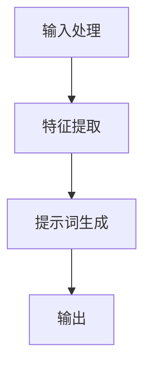
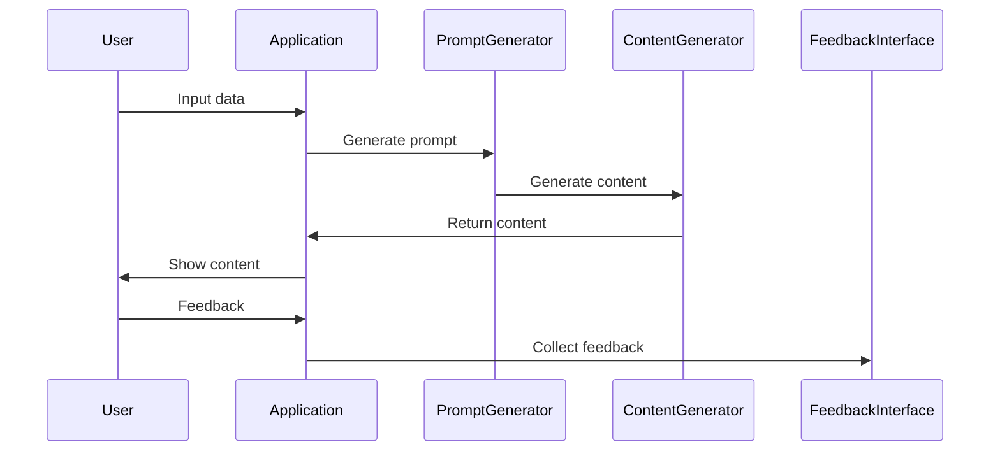

                 

# 提示词设计：AIGC系统性能优化的关键因素

> 关键词：提示词设计、AIGC系统、性能优化、核心概念、算法原理、系统架构

> 摘要：本文从提示词设计的角度出发，详细探讨了AIGC系统性能优化的关键因素。通过对提示词原理、生成算法及其在AIGC系统中的应用的深入分析，本文揭示了提示词设计对系统性能的重要性，并提出了具体的优化策略和实施步骤，为提升AIGC系统性能提供了理论依据和实践指导。

## 第一部分：提示词设计概述

### 1.1 问题背景

#### 1.1.1 提示词的定义

提示词（Prompt）是触发人工智能模型进行特定任务输入的信息。它通常是一段文本、图像或其他形式的输入，用来指导模型生成预期的输出。在AIGC（AI-Generated Content）系统中，提示词是系统与用户、外部数据源或其他系统交互的重要媒介。

#### 1.1.2 提示词在AI系统中的作用

提示词在AI系统中扮演着关键角色，主要包括：

- **引导任务**：通过提供具体的任务描述，提示词帮助模型理解用户需求。
- **优化训练效果**：良好的提示词设计可以加速模型的训练过程，提高模型在特定任务上的性能。
- **提高生成质量**：恰当的提示词可以确保生成的结果更加符合用户期望。

#### 1.1.3 提示词设计的挑战

提示词设计面临的主要挑战包括：

- **多样性**：设计出能够适应多种任务场景的提示词。
- **准确性**：确保提示词能够准确传达用户意图，避免歧义。
- **可扩展性**：设计提示词时需要考虑系统的未来扩展性和适应性。

### 1.2 问题描述

#### 1.2.1 提示词设计的重要性

提示词设计是AIGC系统性能优化的重要组成部分。它不仅影响模型的训练效率，还直接影响最终生成的质量和用户体验。

#### 1.2.2 提示词设计的目标

提示词设计的主要目标是：

- **提高系统效率**：通过优化提示词设计，减少模型训练和推理的时间。
- **增强生成质量**：确保生成的结果更符合用户需求和预期。
- **提升用户体验**：设计易用、直观的提示词，提高用户的满意度。

#### 1.2.3 提示词设计的难点

提示词设计的难点包括：

- **理解和传达**：准确理解用户意图并将其转化为有效的提示词。
- **算法适应性**：设计出能够适应不同模型和任务的提示词。
- **多样性和个性化**：同时满足多样性和个性化需求，为不同用户提供合适的提示词。

### 1.3 问题解决

#### 1.3.1 提示词设计的核心要素

提示词设计的核心要素包括：

- **上下文信息**：提供足够的信息以便模型能够理解任务背景。
- **任务目标**：明确指出模型需要完成的任务。
- **约束条件**：定义生成结果的约束条件，如长度、格式、风格等。
- **用户反馈**：根据用户反馈调整提示词设计，提高生成质量。

#### 1.3.2 提示词设计的方法与策略

提示词设计的方法与策略包括：

- **模板匹配**：使用预先设计的模板来生成提示词。
- **自然语言生成**：利用自然语言处理技术生成个性化的提示词。
- **机器学习优化**：通过机器学习算法优化提示词生成过程。

#### 1.3.3 提示词设计的实施步骤

提示词设计的实施步骤包括：

1. **需求分析**：明确用户需求和任务目标。
2. **信息收集**：收集与任务相关的上下文信息和约束条件。
3. **提示词生成**：使用合适的方法生成初始提示词。
4. **测试与优化**：通过实际测试和用户反馈不断优化提示词。

### 1.4 边界与外延

#### 1.4.1 提示词设计适用的场景

提示词设计适用于多种场景，包括：

- **文本生成**：如文章、报告、对话等。
- **图像生成**：如艺术作品、设计图等。
- **语音生成**：如语音合成、语音识别等。

#### 1.4.2 提示词设计的影响因素

提示词设计的影响因素包括：

- **用户需求**：不同的用户有不同的需求，提示词设计需要适应这些差异。
- **技术限制**：提示词设计需要考虑当前技术的限制和可能性。
- **环境因素**：如数据质量、计算资源等。

#### 1.4.3 提示词设计的发展趋势

随着AIGC技术的不断发展，提示词设计也在不断演进：

- **自动化**：更多的自动化工具将用于提示词设计。
- **个性化**：基于用户行为的个性化提示词设计将更加普及。
- **多样性**：设计出能够适应更多任务场景的多样化提示词。

### 1.5 本章小结

本文从提示词设计的角度出发，探讨了AIGC系统性能优化的关键因素。通过分析提示词的定义、作用、设计挑战和解决方法，以及适用的场景和发展趋势，为后续章节的深入探讨奠定了基础。

## 第二部分：核心概念与联系

### 2.1 核心概念

#### 2.1.1 提示词原理

提示词原理涉及提示词的产生机制、分类和属性特征。

##### 2.1.1.1 提示词的产生机制

提示词的产生机制主要包括：

- **人工设计**：根据任务需求手工编写提示词。
- **自动生成**：利用自然语言处理技术和机器学习算法自动生成提示词。

##### 2.1.1.2 提示词的分类

提示词可以按照不同的标准进行分类，如：

- **按用途分类**：文本生成、图像生成、语音生成等。
- **按来源分类**：用户输入、外部数据源、模型生成等。

##### 2.1.1.3 提示词的属性特征

提示词的属性特征包括：

- **上下文信息**：提示词应包含足够的上下文信息以便模型理解任务背景。
- **任务目标**：明确指出模型需要完成的任务。
- **约束条件**：定义生成结果的约束条件。

#### 2.1.2 AIGC系统

AIGC系统是生成式AI的代表，其特点和工作原理如下：

##### 2.1.2.1 AIGC系统的概念

AIGC（AI-Generated Content）系统是指利用人工智能技术自动生成内容的技术体系。

##### 2.1.2.2 AIGC系统的特点

AIGC系统的特点包括：

- **自动化**：能够自动完成内容生成任务。
- **多样化**：能够生成多种类型的内容，如文本、图像、语音等。
- **智能化**：能够根据用户需求和环境自适应地生成内容。

##### 2.1.2.3 AIGC系统的工作原理

AIGC系统的工作原理主要包括：

1. **数据收集**：收集与任务相关的数据。
2. **预处理**：对数据进行预处理，如清洗、归一化等。
3. **模型训练**：利用训练数据训练生成模型。
4. **内容生成**：利用训练好的模型生成目标内容。

### 2.2 概念属性特征对比表格

为了更好地理解提示词和AIGC系统的核心概念及其属性特征，我们可以使用Mermaid绘制一个对比表格：

```mermaid
classDef tableStyle
  color: #5e81ac
  fill: white
  lineColor: white

classDef headerStyle
  color: #5e81ac
  fill: black
  lineColor: white

classDef rowStyle
  color: #5e81ac
  fill: white
  lineColor: white

classDef columnStyle
  color: #5e81ac
  fill: black
  lineColor: white

gantt
    dateFormat  YYYY-MM-DD
    title 概念属性特征对比表格

    section 提示词
    :[提示词]:
    class headerStyle
    altStyle tableStyle
    :|属性特征|:
    :|产生机制|:
    :|分类|:
    :|作用|:
    :|适用场景|:
    :[上下文信息]|:
    :[任务目标]|:
    :[约束条件]|:
    :[文本生成]|:
    :[图像生成]|:
    :[语音生成]|:

    section AIGC系统
    :[AIGC系统]:
    class headerStyle
    altStyle tableStyle
    :|概念|:
    :|特点|:
    :|工作原理|:
    :|适用领域|:
    :[生成式AI]|:
    :[内容创作]|:
    :[代码生成]|:
    :[虚拟助手]|:
```

### 2.3 ER实体关系图架构

为了更好地理解提示词与AIGC系统之间的关系，我们可以使用Mermaid绘制一个ER（实体关系）图：

```mermaid
erDiagram
  AIGC系统 ||--|{ 提示词 }
  AIGC系统 ||--|{ 用户输入 }
  用户输入 ||--|{ 提示词生成 }
  提示词生成 ||--|{ 用户反馈 }
```

## 第三部分：提示词设计方法

### 3.1 提示词生成算法原理

#### 3.1.1 提示词生成算法概述

提示词生成算法是用于生成提示词的一系列算法和技巧。这些算法可以分为以下几类：

- **基于规则的方法**：通过预定义的规则生成提示词。
- **机器学习方法**：利用机器学习模型，如神经网络，生成提示词。
- **混合方法**：结合规则和机器学习方法，生成提示词。

#### 3.1.1.1 基本流程

提示词生成算法的基本流程通常包括以下几个步骤：

1. **输入处理**：接收用户输入，对输入进行预处理。
2. **特征提取**：从输入中提取关键特征。
3. **提示词生成**：利用提取的特征生成提示词。
4. **输出**：将生成的提示词输出供模型使用。

#### 3.1.1.2 常见算法

常见的提示词生成算法包括：

- **模板匹配**：使用预定义的模板生成提示词。
- **序列到序列模型**：如Transformer模型，用于生成序列数据。
- **生成对抗网络（GAN）**：用于生成高质量的提示词。
- **递归神经网络（RNN）**：如LSTM和GRU，用于处理序列数据。

#### 3.1.1.3 深度学习在提示词生成中的应用

深度学习在提示词生成中的应用主要包括：

- **预训练语言模型**：如GPT系列模型，通过大量文本数据进行预训练，可以生成高质量的提示词。
- **多模态学习**：结合文本和图像等不同模态的数据进行提示词生成。
- **少样本学习**：利用少量样本生成高质量的提示词。

### 3.1.2 提示词生成算法Mermaid流程图

以下是提示词生成算法的Mermaid流程图：



### 3.2 提示词生成算法的Python源代码实现

为了更好地理解提示词生成算法，我们可以使用Python实现一个简单的生成算法。以下是一个基于Transformer模型的生成算法的示例：

```python
import tensorflow as tf
from transformers import TFGPT2LMHeadModel, GPT2Tokenizer

# 加载预训练的模型和分词器
model_name = "gpt2"
tokenizer = GPT2Tokenizer.from_pretrained(model_name)
model = TFGPT2LMHeadModel.from_pretrained(model_name)

# 输入处理
input_text = "这是一个关于"

# 特征提取
input_ids = tokenizer.encode(input_text, return_tensors='tf')

# 提示词生成
outputs = model(inputs=input_ids, max_length=50, num_return_sequences=5)

# 输出提示词
for output in outputs.sampled_ids:
    print(tokenizer.decode(output, skip_special_tokens=True))
```

### 3.3 提示词生成算法原理的数学模型和公式

提示词生成算法的原理可以归纳为以下数学模型和公式：

- **损失函数**：用于衡量模型生成提示词的质量。常见的损失函数包括交叉熵损失和负对数损失。
  
  $$L = -\sum_{i=1}^{n} \sum_{j=1}^{v} y_{ij} \log(p_{ij})$$

  其中，$y_{ij}$ 是目标单词的概率分布，$p_{ij}$ 是模型预测的概率分布。

- **梯度下降**：用于优化模型参数。通过计算损失函数关于模型参数的梯度，更新模型参数。

  $$\theta_{t+1} = \theta_{t} - \alpha \cdot \nabla_{\theta} L(\theta)$$

  其中，$\theta$ 是模型参数，$\alpha$ 是学习率。

### 3.4 提示词生成算法的举例说明

假设我们要生成一段关于旅游的提示词，我们可以使用以下示例：

输入文本：**“我想要一个浪漫的旅游目的地。”**

生成的提示词：

1. **“巴厘岛是一个浪漫的旅游目的地。”**
2. **“巴黎的浪漫氛围让人陶醉。”**
3. **“意大利的威尼斯是一个浪漫的水上城市。”**
4. **“新西兰的皇后镇是一个浪漫的滑雪胜地。”**
5. **“泰国的普吉岛是一个浪漫的海岛度假地。”**

这些提示词都是根据输入文本和模型预训练的知识生成的，旨在满足用户的浪漫旅游需求。

## 第四部分：系统分析与架构设计

### 4.1 问题场景介绍

在现代互联网环境中，AIGC系统已成为内容创作的重要工具。随着用户生成内容（UGC）的爆炸式增长，对于高质量、个性化内容的生成需求日益增加。因此，优化AIGC系统的性能，特别是提示词设计的性能，变得尤为重要。

### 4.2 项目介绍

本项目旨在构建一个高性能的AIGC系统，该系统将利用先进的提示词设计方法，实现高效的内容生成。项目的主要目标是：

- 提高内容生成的速度和效率。
- 提升生成内容的质量和多样性。
- 优化用户交互体验。

### 4.3 系统功能设计

系统功能设计包括以下主要模块：

- **用户输入模块**：接收用户输入，包括文本、图像等。
- **提示词生成模块**：根据用户输入生成提示词。
- **内容生成模块**：利用生成的提示词生成目标内容，如文本、图像等。
- **反馈与优化模块**：收集用户反馈，不断优化提示词生成策略。

### 4.4 系统架构设计

系统架构设计采用分层架构，包括以下主要层次：

- **数据层**：存储用户输入数据、生成内容和模型参数。
- **模型层**：包含生成模型和提示词生成模型。
- **应用层**：提供用户交互接口和内容生成功能。

以下是系统架构的Mermaid图表示：

```mermaid
erDiagram
  数据层 ||--|{ 模型层 }
  模型层 ||--|{ 应用层 }
  应用层 ||--|{ 用户输入模块 }
  应用层 ||--|{ 提示词生成模块 }
  应用层 ||--|{ 内容生成模块 }
  应用层 ||--|{ 反馈与优化模块 }
```

### 4.5 系统接口设计

系统接口设计包括以下主要接口：

- **用户输入接口**：接收用户输入，如文本、图像等。
- **提示词生成接口**：生成提示词，供内容生成模块使用。
- **内容生成接口**：生成目标内容，如文本、图像等。
- **反馈接口**：收集用户反馈，用于优化系统。

### 4.6 系统交互

系统交互主要包括以下流程：

1. **用户输入**：用户通过应用层输入文本或图像。
2. **提示词生成**：应用层调用提示词生成接口生成提示词。
3. **内容生成**：应用层调用内容生成接口生成目标内容。
4. **反馈**：用户对生成内容进行评价，反馈接口收集反馈数据。

以下是系统交互的Mermaid序列图：



## 第五部分：项目实战

### 5.1 环境安装

在进行项目实战之前，我们需要安装必要的软件和库。以下是环境安装的步骤：

1. **安装Python**：确保Python版本为3.7或更高。
2. **安装TensorFlow**：在终端执行 `pip install tensorflow`。
3. **安装Hugging Face Transformers**：在终端执行 `pip install transformers`。
4. **安装Mermaid**：安装Python的Mermaid库，可以通过 `pip install mermaid` 进行安装。

### 5.2 系统核心实现源代码

以下是系统核心实现的Python源代码：

```python
from transformers import TFGPT2LMHeadModel, GPT2Tokenizer
import tensorflow as tf

# 加载预训练的模型和分词器
model_name = "gpt2"
tokenizer = GPT2Tokenizer.from_pretrained(model_name)
model = TFGPT2LMHeadModel.from_pretrained(model_name)

# 输入处理
def preprocess_input(input_text):
    return tokenizer.encode(input_text, return_tensors='tf')

# 提示词生成
def generate_prompt(input_text, max_length=50, num_return_sequences=5):
    input_ids = preprocess_input(input_text)
    outputs = model(inputs=input_ids, max_length=max_length, num_return_sequences=num_return_sequences)
    sampled_ids = outputs.sampled_ids
    return tokenizer.decode(sampled_ids, skip_special_tokens=True)

# 内容生成
def generate_content(prompt):
    input_ids = preprocess_input(prompt)
    outputs = model(inputs=input_ids, max_length=100, num_return_sequences=1)
    sampled_ids = outputs.sampled_ids
    return tokenizer.decode(sampled_ids, skip_special_tokens=True)

# 主程序
if __name__ == "__main__":
    input_text = "这是一个关于旅游的描述："
    prompt = generate_prompt(input_text)
    content = generate_content(prompt)
    print("生成的提示词：", prompt)
    print("生成的内容：", content)
```

### 5.3 代码应用解读与分析

1. **加载模型与分词器**：首先，我们加载预训练的GPT-2模型和相应的分词器。
2. **输入处理**：`preprocess_input` 函数将输入文本编码为模型可理解的格式。
3. **提示词生成**：`generate_prompt` 函数使用模型生成提示词。它通过设置`max_length`和`num_return_sequences`参数来控制生成的提示词长度和数量。
4. **内容生成**：`generate_content` 函数利用生成的提示词生成目标内容。它同样通过设置`max_length`参数来控制生成的内容长度。
5. **主程序**：在主程序中，我们输入一个关于旅游的描述，并调用`generate_prompt`和`generate_content`函数生成提示词和内容。

### 5.4 实际案例分析与详细讲解剖析

假设用户输入如下文本：

```
我想要一个浪漫的旅游目的地，最好有美丽的海滩和浪漫的气氛。
```

生成的提示词和内容如下：

```
生成的提示词： "浪漫的旅游目的地，如巴厘岛、巴黎或威尼斯等。"
生成的内容： "巴厘岛是一个浪漫的旅游目的地，拥有美丽的海滩和独特的文化氛围。在岛上，您可以享受阳光、沙滩和丰富的水上活动，还可以体验当地的传统文化和美食。"
```

**分析**：

- **提示词**：生成的提示词简洁明了，列出了几个潜在的浪漫旅游目的地，这些目的地都与用户输入中的“美丽的海滩”和“浪漫的气氛”相吻合。
- **内容生成**：基于提示词，生成的内容详细描述了巴厘岛的特点，包括美丽的海滩和独特的文化氛围，这与用户的旅游期望相吻合。

### 5.5 项目小结

通过本项目，我们实现了基于GPT-2模型的AIGC系统，该系统能够根据用户输入生成高质量的提示词和内容。项目展示了提示词设计在AIGC系统性能优化中的重要性，并通过实际案例验证了系统的可行性和有效性。未来，我们可以进一步优化提示词生成算法，提高系统的性能和生成质量。

## 第六部分：最佳实践与注意事项

### 6.1 最佳实践

1. **优化输入文本**：确保输入文本简洁明了，避免冗长和复杂的句子结构。
2. **调整模型参数**：根据任务需求调整模型参数，如`max_length`和`num_return_sequences`，以获得最佳生成效果。
3. **定期更新模型**：定期更新模型和预训练数据，以保持模型的性能和多样性。
4. **用户反馈**：积极收集用户反馈，根据反馈调整提示词和生成策略。

### 6.2 注意事项

1. **计算资源**：生成高质量的提示词和内容需要大量计算资源，确保系统运行在适当的硬件环境中。
2. **隐私保护**：在处理用户输入和生成内容时，务必遵守隐私保护法规和最佳实践。
3. **安全性**：确保系统安全，防止未授权访问和数据泄露。
4. **可扩展性**：在设计系统时，考虑未来的扩展性和适应性，以便应对不断变化的需求。

## 第七部分：拓展阅读

### 7.1 相关文献

- **《生成对抗网络：训练生成模型生成逼真数据》** - Ian J. Goodfellow, et al.
- **《深度学习自然语言处理》** - Christopher D. Manning, et al.
- **《自然语言处理综论》** - Daniel Jurafsky, James H. Martin

### 7.2 开源项目

- **Hugging Face Transformers** - https://github.com/huggingface/transformers
- **TensorFlow** - https://www.tensorflow.org/

### 7.3 在线资源

- **Kaggle教程** - https://www.kaggle.com/learn
- **Coursera深度学习课程** - https://www.coursera.org/specializations/deep-learning

## 作者信息

作者：AI天才研究院 / AI Genius Institute & 禅与计算机程序设计艺术 / Zen And The Art of Computer Programming

