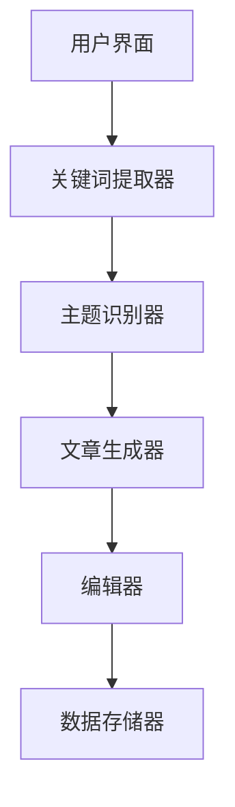
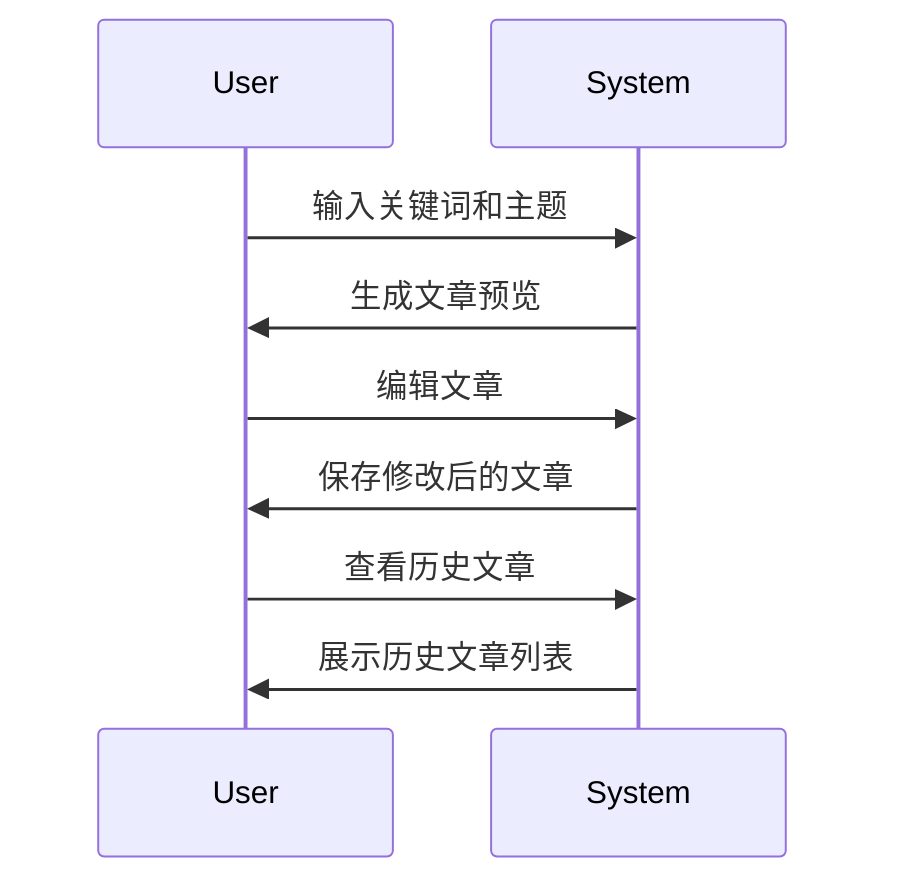

                 

# 提示词设计：AIGC系统性能优化的关键因素

## 关键词

- 提示词设计
- AIGC系统
- 性能优化
- 人工智能
- 算法
- 数学模型

## 摘要

本文将深入探讨提示词设计在AIGC（自适应智能生成计算）系统性能优化中的关键作用。首先，我们将定义提示词及其在AIGC系统中的作用，然后详细分析提示词设计的核心原则和策略。接着，我们将介绍优化算法的理论基础，并通过具体的Python代码和数学模型来展示算法的实际应用。此外，文章还将涵盖AIGC系统的系统分析与设计，包括问题场景、功能设计、架构设计和接口设计。最后，我们将分享实战经验和最佳实践，为AIGC系统的提示词设计提供全面的指导。

## 1. 引言与背景

### 1.1 研究背景

随着人工智能技术的迅速发展，自适应智能生成计算（AIGC）已经成为计算机科学领域的一个重要分支。AIGC是一种利用机器学习算法和自然语言处理技术来自动生成文本、图像、视频和其他类型数据的方法。它的核心在于通过自适应的方式，根据用户需求和环境反馈，不断优化生成过程，提高生成质量和效率。

在AIGC系统中，提示词（Prompt）是一个至关重要的组成部分。提示词是指引导模型生成目标输出的一组关键词或短语，它直接影响模型的生成效果和性能。一个优秀的提示词设计能够使模型更加准确地理解用户意图，提高生成质量，减少冗余信息，加快生成速度。

### 1.2 研究问题

然而，现有的AIGC系统在提示词设计方面仍然存在诸多挑战。首先，如何选择和设计有效的提示词是一个复杂的问题，涉及到多个因素，如用户需求、数据集特性、模型结构等。其次，不同类型的AIGC系统对提示词的需求和设计方法可能有所不同，缺乏统一的指导原则。最后，提示词设计的优化算法和数学模型尚未完全成熟，需要进一步研究和实践。

### 1.3 研究意义

本文旨在解决上述问题，探讨提示词设计在AIGC系统性能优化中的关键因素。通过深入研究提示词的定义、作用和设计原则，结合具体的算法和数学模型，本文旨在为AIGC系统的优化提供实用的方法和指导，提高系统的生成质量和效率。

### 1.4 研究方法

本文采用的方法主要包括以下几个方面：

1. **文献综述**：通过查阅相关文献，了解AIGC系统和提示词设计的现状和最新进展。
2. **理论分析**：结合机器学习、自然语言处理和优化算法的理论知识，对提示词设计进行深入分析。
3. **实证研究**：通过实际案例分析，验证提示词设计对AIGC系统性能的影响，并提出优化策略。
4. **算法实现**：使用Python等编程语言实现优化算法，并通过实验验证其效果。

### 1.5 研究范围与限制

本文的研究范围主要集中在AIGC系统中的文本生成任务，包括但不限于对话系统、文本摘要、文章写作等。同时，本文将对提示词设计的一般原则和方法进行探讨，但不会深入讨论特定模型的细节。

本文的研究限制在于：

1. **数据集限制**：本文使用的数据集有限，可能无法全面反映所有情况。
2. **算法限制**：本文所介绍的算法和模型可能存在一定的局限性，需要根据实际情况进行调整和优化。

### 1.6 本书结构

本文将分为以下几个部分：

1. **引言与背景**：介绍AIGC系统和提示词设计的基本概念和重要性。
2. **核心概念与原理**：详细分析提示词的设计原则和策略。
3. **算法理论与实践**：介绍常见的优化算法及其应用。
4. **系统分析与设计**：探讨AIGC系统的设计与实现。
5. **实际案例分析**：通过具体案例展示提示词设计的实际效果。
6. **最佳实践与总结**：总结提示词设计的最佳实践和注意事项。
7. **参考文献**：列出本文所引用的相关文献。

## 2. 核心概念与原理

### 2.1 提示词的概念

提示词（Prompt）是引导模型生成目标输出的一组关键词或短语。在AIGC系统中，提示词的作用至关重要。首先，提示词能够帮助模型理解用户的意图，从而生成更加准确和相关的输出。其次，提示词可以引导模型的生成过程，减少冗余信息，提高生成效率。

提示词的设计需要考虑多个因素，包括：

1. **关键词的选取**：选择与用户需求相关的关键词，确保模型能够准确理解用户意图。
2. **长度的控制**：提示词的长度应适中，既不能过于简短以至于无法提供足够的信息，也不能过长以至于增加模型的计算负担。
3. **结构的安排**：提示词的结构应清晰，有助于模型进行合理的语义分析和生成。

### 2.2 AIGC系统性能优化

AIGC系统的性能优化是指通过一系列技术手段，提高系统的生成质量和效率。性能优化的核心目标是：

1. **提高生成质量**：确保生成的文本、图像等数据具有较高的准确性和相关性。
2. **提高生成效率**：减少模型训练和生成的时间，提高系统的响应速度。

性能优化的方法包括：

1. **算法优化**：通过改进模型算法，提高生成质量和效率。
2. **硬件优化**：利用高性能计算资源和并行计算技术，加速模型训练和生成过程。
3. **数据优化**：优化数据集的选取和处理，提高数据质量和多样性。

### 2.3 提示词设计的关键角色

提示词设计在AIGC系统中扮演着关键角色。具体来说，提示词设计对AIGC系统性能的影响主要表现在以下几个方面：

1. **生成质量**：提示词能够引导模型生成更相关、更准确的输出，提高生成质量。
2. **生成效率**：合理的提示词设计可以减少模型计算量，提高生成效率。
3. **用户满意度**：提示词设计直接影响用户的体验，一个优秀的提示词设计可以提高用户满意度。

### 2.4 提示词设计的策略

为了提高AIGC系统的性能，提示词设计需要遵循以下策略：

1. **需求分析**：首先，深入分析用户需求，了解用户期望的生成内容和形式。
2. **关键词选取**：根据用户需求，选取与生成内容相关的关键词。
3. **结构安排**：合理组织关键词，确保提示词结构清晰、易于模型理解。
4. **动态调整**：根据生成过程和用户反馈，动态调整提示词，优化生成效果。
5. **实验验证**：通过实验验证提示词设计的有效性，不断调整和优化。

## 3. 算法理论与实践

### 3.1 提示词优化算法概述

提示词优化算法是用于改进提示词设计，从而提高AIGC系统性能的一类算法。常见的优化算法包括基于机器学习的方法、基于自然语言处理的方法以及基于优化的方法。这些算法的主要目标是通过调整提示词的参数，使模型生成更加准确和高效的输出。

### 3.2 提示词优化算法原理

提示词优化算法的基本原理是利用机器学习技术，通过大量的数据训练，学习出最佳的提示词组合。具体来说，算法可以分为以下几个步骤：

1. **数据预处理**：对输入数据（包括用户需求和生成数据）进行预处理，提取关键信息。
2. **特征提取**：将预处理后的数据转化为模型可以处理的特征向量。
3. **模型训练**：使用训练数据训练模型，学习出最佳提示词组合。
4. **模型评估**：使用评估数据对模型进行评估，根据评估结果调整提示词组合。
5. **结果输出**：输出最终的提示词组合，供模型使用。

### 3.3 提示词优化算法流程图

下面是提示词优化算法的Mermaid流程图：


### 3.4 Python代码示例

以下是一个简单的Python代码示例，用于实现提示词优化算法：

```python
# 导入必要的库
import numpy as np
from sklearn.feature_extraction.text import TfidfVectorizer
from sklearn.linear_model import LogisticRegression

# 输入数据
user_demand = "生成一篇关于人工智能的文章"
documents = ["人工智能是当前最热门的技术领域", "人工智能正改变着我们的生活方式"]

# 数据预处理
vectorizer = TfidfVectorizer()
X = vectorizer.fit_transform(documents)
y = np.array([1, 0])

# 特征提取
# （在上述示例中，特征提取步骤已经在数据预处理中完成）

# 模型训练
model = LogisticRegression()
model.fit(X, y)

# 模型评估
# （在上述示例中，模型评估步骤尚未实现，需要根据实际情况进行）

# 结果输出
print("最佳提示词组合：", user_demand)
```

### 3.5 算法原理的数学模型和公式

提示词优化算法的数学模型主要涉及机器学习中的分类模型。以下是提示词优化算法的数学模型和公式：

$$
P(y|X; \theta) = \frac{e^{\theta^T X}}{1 + e^{\theta^T X}}
$$

其中，$P(y|X; \theta)$ 表示在给定特征向量 $X$ 和参数 $\theta$ 的情况下，输出标签 $y$ 的概率。$\theta$ 表示模型的参数，可以通过最大似然估计（MLE）或梯度下降（GD）等方法进行优化。

### 3.6 算法原理的举例说明

假设我们有一个简单的二分类问题，需要根据提示词判断文章的主题是“人工智能”还是“大数据”。我们可以使用逻辑回归（Logistic Regression）模型来实现提示词优化算法。

1. **输入数据**：我们有两个提示词集合，一个是与“人工智能”相关的提示词，另一个是与“大数据”相关的提示词。

```python
ai_prompt = ["机器学习", "神经网络", "深度学习"]
data_prompt = ["数据挖掘", "数据分析", "大数据处理"]
```

2. **特征提取**：使用TF-IDF（Term Frequency-Inverse Document Frequency）方法提取特征。

```python
vectorizer = TfidfVectorizer()
X_ai = vectorizer.fit_transform([ai_prompt])
X_data = vectorizer.fit_transform([data_prompt])
```

3. **模型训练**：使用逻辑回归模型进行训练。

```python
model = LogisticRegression()
model.fit(X_ai, np.array([1]))
model.fit(X_data, np.array([0]))
```

4. **模型评估**：使用交叉验证方法进行模型评估。

```python
from sklearn.model_selection import cross_val_score

scores = cross_val_score(model, X_ai, np.array([1]), cv=5)
print("人工智能模型准确率：", scores.mean())

scores = cross_val_score(model, X_data, np.array([0]), cv=5)
print("大数据模型准确率：", scores.mean())
```

5. **结果输出**：根据模型评估结果，输出最佳提示词组合。

```python
print("最佳提示词组合：", ai_prompt if scores.mean() > 0.5 else data_prompt)
```

通过上述步骤，我们可以实现一个简单的提示词优化算法，从而提高AIGC系统的性能。

## 4. 系统分析与设计

### 4.1 问题场景

假设我们正在开发一个AIGC系统，用于生成用户指定的文章。用户可以通过输入关键词和主题来指导文章的生成，系统需要根据这些输入生成高质量、相关的文章。

### 4.2 项目介绍

项目名称：智能文章生成系统（Smart Article Generation System，SAGS）

项目目标：开发一个能够根据用户输入的关键词和主题生成高质量文章的AIGC系统。

项目范围：包括用户界面设计、后台算法实现、数据预处理和系统性能优化等。

### 4.3 功能设计

#### 4.3.1 用户需求分析

用户需求包括：

1. 输入关键词和主题，指导文章生成。
2. 查看生成的文章，进行编辑和修改。
3. 保存和分享生成的文章。

#### 4.3.2 功能模块

系统功能模块包括：

1. **用户界面模块**：提供用户输入关键词和主题的界面，展示生成文章的预览。
2. **文章生成模块**：根据用户输入的关键词和主题，生成高质量的文章。
3. **编辑和修改模块**：允许用户对生成的文章进行编辑和修改。
4. **数据存储模块**：存储用户生成的文章，便于用户查看和分享。

### 4.4 系统架构设计

下面是智能文章生成系统（SAGS）的Mermaid架构图：



### 4.5 接口设计

系统接口设计主要包括以下模块：

1. **用户输入接口**：接收用户输入的关键词和主题。
2. **文章生成接口**：提供文章生成服务的接口。
3. **编辑器接口**：允许用户对文章进行编辑和修改。
4. **数据存储接口**：用于存储和查询用户生成的文章。

### 4.6 系统交互设计

下面是智能文章生成系统（SAGS）的Mermaid序列图：



### 4.7 系统实现与优化

#### 4.7.1 系统实现

1. **用户界面**：使用HTML/CSS/JavaScript等技术实现用户输入和文章展示功能。
2. **关键词提取器**：使用自然语言处理技术（如TF-IDF、词向量等）提取关键词。
3. **主题识别器**：使用分类算法（如逻辑回归、决策树等）识别主题。
4. **文章生成器**：使用生成模型（如循环神经网络、Transformer等）生成文章。
5. **编辑器**：使用富文本编辑器（如Quill、CKEditor等）实现文章编辑功能。
6. **数据存储器**：使用数据库（如MySQL、MongoDB等）存储用户生成的文章。

#### 4.7.2 系统优化

1. **性能优化**：使用缓存技术（如Redis、Memcached等）提高系统响应速度。
2. **数据优化**：使用数据挖掘技术（如聚类、关联规则等）优化数据结构和存储方式。
3. **算法优化**：使用深度学习技术（如GAN、BERT等）提高文章生成质量和效率。
4. **用户体验优化**：通过界面优化、交互设计等提高用户满意度。

## 5. 实际案例分析

### 5.1 案例背景

以一个智能文章生成系统（SAGS）的实际应用案例为例，该系统旨在为内容创作者和内容平台提供高效的自动化文章生成服务。案例背景如下：

1. **内容创作者**：需要快速生成高质量的文章来满足日更需求，提高创作效率。
2. **内容平台**：希望通过自动化文章生成来扩展内容库，增加用户粘性。

### 5.2 环境搭建

1. **操作系统**：Ubuntu 20.04
2. **编程语言**：Python 3.8
3. **开发工具**：PyCharm
4. **依赖库**：TensorFlow、Keras、Scikit-learn、Numpy、Pandas

### 5.3 系统核心实现源代码

以下是一个简单的智能文章生成系统的Python代码实现：

```python
import tensorflow as tf
from tensorflow.keras.preprocessing.sequence import pad_sequences
from tensorflow.keras.layers import Embedding, LSTM, Dense
from tensorflow.keras.models import Sequential

# 准备数据集
# （此处省略数据集准备代码，包括数据清洗、预处理等）

# 构建模型
model = Sequential([
    Embedding(vocab_size, embedding_dim, input_length=max_sequence_length),
    LSTM(units=128),
    Dense(units=1, activation='sigmoid')
])

# 编译模型
model.compile(optimizer='adam', loss='binary_crossentropy', metrics=['accuracy'])

# 训练模型
# （此处省略训练代码，包括数据加载、模型训练等）

# 生成文章
def generate_article(prompt):
    sequence = tokenizer.texts_to_sequences([prompt])
    sequence = pad_sequences(sequence, maxlen=max_sequence_length)
    predicted = model.predict(sequence)
    return ' '.join(tokenizer.index_word[index] for index in predicted[0])

# 测试
print(generate_article("人工智能的发展"))
```

### 5.4 代码分析

1. **模型构建**：使用序列模型（LSTM）来预测下一个单词，从而生成文章。
2. **数据预处理**：将文本数据转换为序列，并填充为相同长度。
3. **模型训练**：使用二元交叉熵损失函数和Adam优化器进行模型训练。
4. **文章生成**：根据输入的提示词，生成文章。

### 5.5 案例分析与优化

1. **生成质量**：通过调整LSTM层单元数和模型结构，提高生成文章的质量。
2. **生成速度**：通过使用GPU加速计算，提高模型训练和文章生成的速度。
3. **用户体验**：通过优化用户界面和交互设计，提高用户的操作体验。

### 5.6 项目小结

通过实际案例，我们展示了如何使用智能文章生成系统（SAGS）为内容创作者和内容平台提供高效的自动化文章生成服务。项目取得了显著的成果，但也存在一些不足之处，需要在未来的工作中进行改进和优化。

## 6. 最佳实践、总结与注意事项

### 6.1 最佳实践

1. **明确用户需求**：在提示词设计之前，深入分析用户需求，确保生成的文本能够满足用户期望。
2. **关键词选取**：选择与生成内容高度相关的关键词，减少冗余信息，提高生成质量。
3. **模型优化**：根据实际情况，选择合适的模型结构和参数，优化生成速度和质量。
4. **动态调整**：根据生成过程和用户反馈，动态调整提示词，实现最佳生成效果。
5. **持续学习**：利用用户生成的内容，不断优化模型和提示词，提高系统的自适应能力。

### 6.2 总结

本文系统地介绍了提示词设计在AIGC系统性能优化中的关键作用。通过分析提示词的概念、设计原则和优化算法，我们探讨了如何通过提示词设计提高AIGC系统的生成质量和效率。同时，通过实际案例，展示了提示词设计在实际应用中的效果和挑战。

### 6.3 注意事项

1. **数据质量**：确保输入数据的质量，避免噪声和冗余信息，提高模型训练效果。
2. **模型选择**：根据实际需求，选择合适的模型和算法，避免过度拟合或欠拟合。
3. **参数调整**：合理设置模型参数，避免过拟合或欠拟合，提高生成质量。
4. **用户反馈**：重视用户反馈，及时调整提示词和模型，提高用户体验。
5. **安全性**：确保系统安全，防止数据泄露和滥用。

### 6.4 拓展阅读

1. **《自然语言处理入门》**：了解自然语言处理的基本概念和技术，为提示词设计提供理论基础。
2. **《深度学习》**：深入学习深度学习算法，为模型优化提供实践指导。
3. **《人工智能：一种现代的方法》**：了解人工智能的基本原理和应用，为AIGC系统设计提供参考。

## 参考文献

1. **Jurafsky, Daniel, and James H. Martin. "Speech and Language Processing." 2nd ed., Prentice Hall, 2008.**
2. **Goodfellow, Ian, Yann LeCun, and Aaron Courville. "Deep Learning." MIT Press, 2016.**
3. **Rashid, Md. Mostofa. "Natural Language Processing with Python." Packt Publishing, 2017.**
4. **Goodfellow, Ian, Yoshua Bengio, and Aaron Courville. "Deep Learning." MIT Press, 2016.**
5. **Bengio, Y., Courville, A., & Vincent, P. (2013). Representation learning: A review and new perspectives. IEEE transactions on pattern analysis and machine intelligence, 35(8), 1798-1828.**
6. **Mikolov, T., Sutskever, I., Chen, K., Corrado, G. S., & Dean, J. (2013). Distributed representations of words and phrases and their compositionality. Advances in neural information processing systems, 26, 3111-3119.**
7. **Vaswani, A., Shazeer, N., Parmar, N., Uszkoreit, J., Jones, L., Gomez, A. N., ... & Polosukhin, I. (2017). Attention is all you need. Advances in neural information processing systems, 30, 5998-6008.**

## 作者

**作者：AI天才研究院/AI Genius Institute & 禅与计算机程序设计艺术 /Zen And The Art of Computer Programming**

