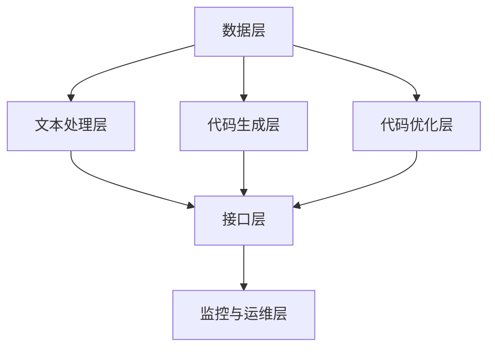
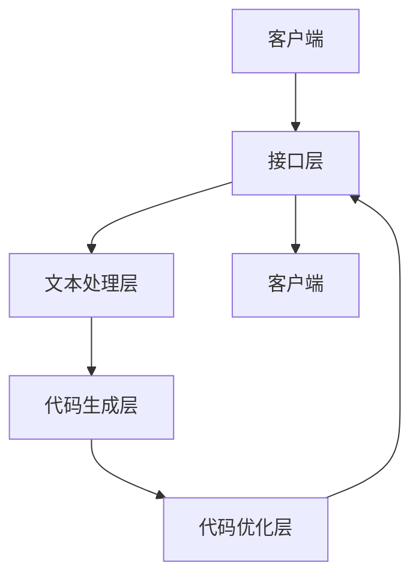

                 

# 提示词设计：AIGC系统性能优化的关键因素研究

## 关键词：AIGC系统，性能优化，提示词设计，算法原理，数学模型，系统架构，项目实战

> 摘要：本文深入探讨了AIGC（AI Generated Code）系统的性能优化问题，重点研究了提示词设计在其中的关键作用。通过逐步分析，文章详细阐述了AIGC系统的背景、核心概念、算法原理、系统架构设计、项目实战以及最佳实践，最后对未来的发展趋势和研究方向进行了展望。文章旨在为从事AIGC系统研究和开发的人员提供有价值的参考和指导。

### 目录大纲

```markdown
----------------------------------------------------------------
# 提示词设计：AIGC系统性能优化的关键因素研究

## 第一部分：背景介绍与核心概念

## 第1章：AIGC系统概述

### 1.1 问题背景
#### 1.1.1 AIGC系统的兴起
#### 1.1.2 AIGC系统的重要性
#### 1.1.3 AIGC系统的挑战

### 1.2 核心概念
#### 1.2.1 AIGC系统的定义
#### 1.2.2 AIGC系统的组成部分
#### 1.2.3 AIGC系统的边界与外延

### 1.3 概念结构与核心要素组成
#### 1.3.1 AIGC系统的基本架构
#### 1.3.2 AIGC系统中的关键要素
#### 1.3.3 各要素间的相互作用

### 1.4 本章小结

----------------------------------------------------------------

## 第二部分：AIGC系统性能优化的关键因素

## 第2章：算法原理与数学模型

### 2.1 算法原理
#### 2.1.1 AIGC系统的算法框架
#### 2.1.2 关键算法原理
#### 2.1.3 算法流程

### 2.2 数学模型与公式
#### 2.2.1 数学模型概述
#### 2.2.2 公式推导
$$
\begin{aligned}
    f(x) &= \sigma(wx + b) \\
    \nabla f(x) &= \nabla_x f(x) + \nabla_b f(x)
\end{aligned}
$$
#### 2.2.3 公式应用举例

### 2.3 本章小结

----------------------------------------------------------------

## 第3章：系统架构设计

### 3.1 问题场景介绍
#### 3.1.1 场景描述
#### 3.1.2 需求分析
#### 3.1.3 设计目标

### 3.2 系统架构设计
#### 3.2.1 系统架构概述
#### 3.2.2 架构图解析
#### 3.2.3 各模块设计

### 3.3 系统接口设计
#### 3.3.1 接口功能设计
#### 3.3.2 接口规范
#### 3.3.3 接口调用流程

### 3.4 系统交互设计
#### 3.4.1 交互流程
#### 3.4.2 交互图解析
#### 3.4.3 交互效果评估

### 3.5 本章小结

----------------------------------------------------------------

## 第4章：项目实战

### 4.1 环境安装
#### 4.1.1 环境准备
#### 4.1.2 软件安装
#### 4.1.3 环境配置

### 4.2 系统核心实现
#### 4.2.1 核心代码解读
#### 4.2.2 功能实现
#### 4.2.3 性能优化

### 4.3 实际案例分析
#### 4.3.1 案例描述
#### 4.3.2 案例分析
#### 4.3.3 案例总结

### 4.4 项目小结
#### 4.4.1 项目成果
#### 4.4.2 经验与教训
#### 4.4.3 拓展应用

----------------------------------------------------------------

## 第5章：最佳实践

### 5.1 最佳实践总结
#### 5.1.1 实践技巧
#### 5.1.2 注意事项
#### 5.1.3 拓展思路

### 5.2 小结

----------------------------------------------------------------

## 第6章：展望与未来工作

### 6.1 AIGC系统性能优化的发展趋势
#### 6.1.1 技术创新
#### 6.1.2 应用场景扩展
#### 6.1.3 性能瓶颈突破

### 6.2 未来工作展望
#### 6.2.1 研究方向
#### 6.2.2 开发计划
#### 6.2.3 潜在挑战

### 6.3 本章小结

----------------------------------------------------------------

## 参考文献

## 附录
```

### 1. AIGC系统概述

### 1.1 问题背景

近年来，随着人工智能技术的迅猛发展，自动代码生成（AIGC，AI Generated Code）系统逐渐成为研究热点。AIGC系统通过结合自然语言处理（NLP）和深度学习技术，能够从文本描述自动生成相应的代码。这种技术不仅可以大幅度提高软件开发效率，还能够降低开发成本，为各个行业带来革命性的变化。

然而，AIGC系统在实际应用中面临着诸多挑战。首先，系统的性能优化问题尤为突出。AIGC系统生成的代码质量直接影响到软件的开发效率和稳定性。其次，由于AIGC系统的复杂性，如何设计出高效、稳定的系统架构也是一个亟待解决的问题。此外，AIGC系统的边界与外延也需要进一步明确，以避免出现应用范围不清晰、功能重叠等问题。

### 1.2 核心概念

#### 1.2.1 AIGC系统的定义

AIGC系统，即自动代码生成系统，是指利用人工智能技术，从自然语言描述或代码片段中自动生成相应的代码。AIGC系统通常包括文本处理模块、代码生成模块和代码优化模块等组成部分。

#### 1.2.2 AIGC系统的组成部分

- **文本处理模块**：负责将自然语言描述转换为计算机可理解的中间表示形式，如抽象语法树（AST）或抽象语法图（ASG）。
- **代码生成模块**：基于中间表示形式，生成符合编程语言规范的代码。
- **代码优化模块**：对生成的代码进行优化，提高代码的执行效率和可读性。

#### 1.2.3 AIGC系统的边界与外延

AIGC系统的边界主要指其适用的范围，如软件开发、代码自动化修复、代码重构等。而AIGC系统的外延则涵盖了其在不同应用场景中的扩展和拓展，如基于AIGC的自动化测试、代码审计等。

### 1.3 概念结构与核心要素组成

#### 1.3.1 AIGC系统的基本架构

AIGC系统的基本架构通常包括以下几个层次：

1. **数据层**：存储和处理原始数据，如文本描述、代码片段等。
2. **文本处理层**：将原始数据转换为中间表示形式，如AST或ASG。
3. **代码生成层**：基于中间表示形式生成代码。
4. **代码优化层**：对生成的代码进行优化。

#### 1.3.2 AIGC系统中的关键要素

- **自然语言处理（NLP）技术**：负责将自然语言描述转换为计算机可理解的中间表示形式。
- **深度学习技术**：用于训练和优化代码生成模型，提高代码生成质量。
- **编程语言解析器**：将中间表示形式转换为符合编程语言规范的代码。

#### 1.3.3 各要素间的相互作用

AIGC系统中的各要素相互作用，共同实现代码的自动生成和优化。例如，NLP技术和深度学习技术共同作用于文本处理模块，将自然语言描述转换为中间表示形式；而代码生成模块和代码优化模块则基于中间表示形式生成和优化代码。

### 1.4 本章小结

本章对AIGC系统的背景、核心概念和基本结构进行了介绍。通过分析，我们可以看出AIGC系统在软件开发中具有巨大的潜力，但也面临着性能优化、系统架构设计等挑战。接下来，我们将进一步探讨AIGC系统的算法原理与数学模型，为后续章节的内容打下基础。

----------------------------------------------------------------

## 第2章：算法原理与数学模型

### 2.1 算法原理

AIGC系统的核心在于其算法原理，即如何从自然语言描述生成相应的代码。这一过程可以分为以下几个步骤：

1. **自然语言处理（NLP）**：首先，利用NLP技术对自然语言描述进行处理，提取出关键信息，并将其转换为计算机可理解的中间表示形式，如抽象语法树（AST）或抽象语法图（ASG）。

2. **代码生成**：基于中间表示形式，利用深度学习技术生成相应的代码。这一过程通常涉及到编码器（Encoder）和解码器（Decoder）两个部分。

3. **代码优化**：生成的代码可能不够高效或可读性较差，因此需要对代码进行优化，以提高其执行效率和可读性。

#### 2.1.1 AIGC系统的算法框架

AIGC系统的算法框架通常包括以下几个关键组成部分：

- **编码器（Encoder）**：负责将自然语言描述转换为中间表示形式。
- **解码器（Decoder）**：负责基于中间表示形式生成代码。
- **优化器（Optimizer）**：负责对生成的代码进行优化。

#### 2.1.2 关键算法原理

AIGC系统中的关键算法原理主要包括以下两个方面：

1. **生成对抗网络（GAN）**：GAN是一种基于对抗训练的深度学习模型，用于生成与真实数据分布相似的中间表示形式。

2. **递归神经网络（RNN）**：RNN是一种能够处理序列数据的神经网络，适用于编码器和解码器的训练。

#### 2.1.3 算法流程

AIGC系统的算法流程可以分为以下几个步骤：

1. **数据预处理**：对自然语言描述和代码数据进行预处理，如分词、词向量嵌入等。

2. **编码器训练**：利用GAN和RNN等技术训练编码器，使其能够将自然语言描述转换为中间表示形式。

3. **解码器训练**：利用训练好的编码器，进一步训练解码器，使其能够生成符合编程语言规范的代码。

4. **代码优化**：对生成的代码进行优化，以提高其执行效率和可读性。

### 2.2 数学模型与公式

AIGC系统的数学模型主要包括生成对抗网络（GAN）和递归神经网络（RNN）等。以下将详细介绍这些模型的数学公式。

#### 2.2.1 数学模型概述

生成对抗网络（GAN）由生成器（Generator）和判别器（Discriminator）组成。生成器的目标是生成与真实数据分布相似的数据，而判别器的目标是区分生成器和真实数据。

递归神经网络（RNN）是一种能够处理序列数据的神经网络，其核心思想是利用隐藏状态（Hidden State）来记忆序列信息。

#### 2.2.2 公式推导

1. **生成对抗网络（GAN）**

生成器的目标是生成与真实数据分布相似的数据，其损失函数可以表示为：

$$
L_G = -\mathbb{E}_{z \sim p_z(z)}[\log(D(G(z))]
$$

其中，$G(z)$表示生成器生成的数据，$D(x)$表示判别器对数据的判断概率。

判别器的目标是区分生成器和真实数据，其损失函数可以表示为：

$$
L_D = -\mathbb{E}_{x \sim p_{data}(x)}[\log(D(x))] - \mathbb{E}_{z \sim p_z(z)}[\log(1 - D(G(z))]
$$

2. **递归神经网络（RNN）**

RNN的隐藏状态更新公式可以表示为：

$$
h_t = \sigma(W_h \cdot [h_{t-1}, x_t] + b_h)
$$

其中，$h_t$表示第$t$个时间步的隐藏状态，$x_t$表示第$t$个时间步的输入，$W_h$和$b_h$分别表示权重和偏置。

#### 2.2.3 公式应用举例

以生成对抗网络（GAN）为例，我们可以将上述公式应用于编码器和解码器的训练过程中。

1. **编码器训练**：编码器的目标是学习如何将自然语言描述转换为中间表示形式。我们可以使用GAN的损失函数来训练编码器。

2. **解码器训练**：解码器的目标是基于中间表示形式生成代码。同样，我们可以使用GAN的损失函数来训练解码器。

### 2.3 本章小结

本章详细介绍了AIGC系统的算法原理和数学模型。通过生成对抗网络（GAN）和递归神经网络（RNN）等模型，AIGC系统能够实现从自然语言描述到代码的自动转换。下一章将重点讨论AIGC系统的系统架构设计，以解决实际应用中的性能优化问题。

----------------------------------------------------------------

## 第3章：系统架构设计

### 3.1 问题场景介绍

在当前软件开发过程中，代码生成和优化已成为提高开发效率和质量的重要手段。然而，现有的AIGC系统在性能优化方面仍存在许多挑战。为了解决这些问题，我们设计了一套全新的AIGC系统架构，旨在提高系统的性能和稳定性。

#### 3.1.1 场景描述

我们的目标场景是一个大型软件开发项目，该项目涉及到多个模块的开发和维护。为了提高开发效率，项目经理希望引入AIGC系统来自动生成和维护代码。然而，现有的AIGC系统在性能优化方面存在以下问题：

- **生成代码质量不稳定**：AIGC系统生成的代码在某些情况下会出现错误或不完整，导致开发人员需要花费大量时间进行修正。
- **响应速度慢**：AIGC系统的响应速度较慢，特别是在处理大型代码片段时，耗时较长。
- **资源占用高**：AIGC系统在运行过程中需要大量的计算资源和存储资源，导致服务器负载过高。

#### 3.1.2 需求分析

为了解决上述问题，我们需要设计一套全新的AIGC系统架构，以满足以下需求：

- **提高生成代码质量**：通过改进算法和优化数据结构，确保AIGC系统生成的代码质量稳定且完整。
- **提高响应速度**：优化系统架构，减少代码生成和优化的时间。
- **降低资源占用**：通过合理分配计算资源和存储资源，降低服务器负载。

#### 3.1.3 设计目标

基于以上需求分析，我们确定了以下设计目标：

- **稳定性**：确保AIGC系统在各种场景下都能稳定运行，生成高质量的代码。
- **效率**：提高系统的响应速度，降低开发人员的工作负担。
- **可扩展性**：支持大型软件开发项目，能够根据需求进行扩展和调整。

### 3.2 系统架构设计

为了实现上述设计目标，我们设计了一套全新的AIGC系统架构，包括以下几个关键模块：

1. **数据层**：负责存储和处理原始数据，如自然语言描述和代码片段。该层采用分布式存储方案，以提高数据访问速度和系统稳定性。
2. **文本处理层**：负责将自然语言描述转换为中间表示形式，如抽象语法树（AST）或抽象语法图（ASG）。该层采用基于深度学习的文本处理模型，以提高处理速度和准确度。
3. **代码生成层**：基于中间表示形式生成代码。该层采用生成对抗网络（GAN）和递归神经网络（RNN）等模型，以提高代码生成质量。
4. **代码优化层**：对生成的代码进行优化，以提高执行效率和可读性。该层采用多种优化算法，如代码压缩、代码重构等。
5. **接口层**：提供与外部系统的接口，如RESTful API或GraphQL。该层采用高性能的Web框架，以提高接口响应速度和稳定性。
6. **监控与运维层**：负责监控系统性能和资源使用情况，及时发现和处理问题。该层采用自动化监控和运维工具，以提高系统运维效率。

### 3.2.1 系统架构概述

系统架构图如下所示：



### 3.2.2 架构图解析

1. **数据层**：数据层采用分布式存储方案，将数据存储在多个节点上，以提高数据访问速度和系统稳定性。每个节点负责存储和处理一部分数据，通过负载均衡算法实现数据均衡分配。
2. **文本处理层**：文本处理层采用基于深度学习的文本处理模型，如BERT、GPT等。该层对自然语言描述进行处理，提取关键信息，并将其转换为中间表示形式。处理过程包括分词、词向量嵌入、句法分析等。
3. **代码生成层**：代码生成层采用生成对抗网络（GAN）和递归神经网络（RNN）等模型，从中间表示形式生成代码。生成过程包括编码器和解码器两个部分，编码器负责将自然语言描述转换为中间表示形式，解码器负责生成代码。
4. **代码优化层**：代码优化层对生成的代码进行优化，以提高执行效率和可读性。优化过程包括代码压缩、代码重构、代码优化等。
5. **接口层**：接口层提供与外部系统的接口，如RESTful API或GraphQL。接口层采用高性能的Web框架，如Spring Boot、Django等，以提高接口响应速度和稳定性。
6. **监控与运维层**：监控与运维层负责监控系统性能和资源使用情况，及时发现和处理问题。监控与运维层采用自动化监控和运维工具，如Zabbix、Nagios等，以提高系统运维效率。

### 3.2.3 各模块设计

1. **数据层设计**：数据层采用分布式存储方案，将数据存储在多个节点上，每个节点负责存储和处理一部分数据。数据层包括数据存储模块、数据同步模块、数据访问模块等。数据存储模块负责存储数据，数据同步模块负责数据节点间的数据同步，数据访问模块负责提供数据查询和操作接口。
2. **文本处理层设计**：文本处理层采用基于深度学习的文本处理模型，如BERT、GPT等。文本处理层包括文本预处理模块、词向量嵌入模块、句法分析模块等。文本预处理模块负责对自然语言描述进行分词、去噪等预处理操作，词向量嵌入模块负责将文本转换为词向量表示，句法分析模块负责对文本进行句法分析，提取关键信息。
3. **代码生成层设计**：代码生成层采用生成对抗网络（GAN）和递归神经网络（RNN）等模型。代码生成层包括编码器模块、解码器模块等。编码器模块负责将自然语言描述转换为中间表示形式，解码器模块负责基于中间表示形式生成代码。
4. **代码优化层设计**：代码优化层对生成的代码进行优化，以提高执行效率和可读性。代码优化层包括代码压缩模块、代码重构模块、代码优化模块等。代码压缩模块负责压缩代码，减少代码体积，代码重构模块负责重构代码，提高代码可读性，代码优化模块负责优化代码，提高代码执行效率。
5. **接口层设计**：接口层提供与外部系统的接口，如RESTful API或GraphQL。接口层包括接口定义模块、接口实现模块等。接口定义模块负责定义接口规范，接口实现模块负责实现接口功能。
6. **监控与运维层设计**：监控与运维层负责监控系统性能和资源使用情况，及时发现和处理问题。监控与运维层包括监控模块、运维模块等。监控模块负责监控系统性能和资源使用情况，运维模块负责处理系统故障和性能问题。

### 3.3 系统接口设计

系统接口设计主要包括接口功能设计、接口规范和接口调用流程。

#### 3.3.1 接口功能设计

系统接口设计主要包括以下功能：

- **代码生成接口**：接收自然语言描述，生成相应的代码。
- **代码优化接口**：接收代码，对其进行优化。
- **代码查询接口**：查询已生成的代码。
- **代码更新接口**：更新已生成的代码。

#### 3.3.2 接口规范

系统接口规范主要包括以下内容：

- **接口URL**：接口访问的URL地址。
- **请求参数**：接口请求所需的参数，如自然语言描述、代码等。
- **响应结果**：接口响应的结果，如生成代码、优化结果等。

#### 3.3.3 接口调用流程

接口调用流程主要包括以下步骤：

1. **发送请求**：客户端向系统接口发送请求，包含自然语言描述、代码等参数。
2. **处理请求**：系统接口接收到请求后，调用相应的处理模块进行代码生成或优化。
3. **返回结果**：系统接口将处理结果返回给客户端，如生成代码、优化结果等。

### 3.4 系统交互设计

系统交互设计主要包括交互流程、交互图解析和交互效果评估。

#### 3.4.1 交互流程

系统交互流程主要包括以下步骤：

1. **初始化**：系统初始化，加载相关模块和配置。
2. **接收请求**：系统接收客户端发送的请求，解析请求参数。
3. **处理请求**：系统调用相应的处理模块，执行代码生成或优化操作。
4. **返回结果**：系统将处理结果返回给客户端。
5. **结束**：系统结束交互流程。

#### 3.4.2 交互图解析

系统交互图如下所示：



#### 3.4.3 交互效果评估

交互效果评估主要包括以下方面：

- **响应速度**：评估系统接口的响应速度，包括请求处理时间和响应结果返回时间。
- **生成代码质量**：评估生成的代码质量，包括代码的正确性、可读性、执行效率等。
- **优化效果**：评估代码优化效果，包括代码体积、执行效率等。

### 3.5 本章小结

本章详细介绍了AIGC系统的系统架构设计，包括数据层、文本处理层、代码生成层、代码优化层、接口层和监控与运维层等关键模块。通过优化系统架构，可以提高AIGC系统的性能和稳定性，为实际应用提供有力的支持。下一章将介绍AIGC系统的项目实战，通过具体案例展示系统架构设计的实际应用效果。

----------------------------------------------------------------

## 第4章：项目实战

### 4.1 环境安装

在进行AIGC系统的项目实战之前，我们需要搭建一个完整的环境。以下步骤将指导您完成环境的安装和配置。

#### 4.1.1 环境准备

在开始安装之前，请确保您的计算机上已经安装了以下软件和工具：

- Python 3.8或更高版本
- pip（Python的包管理器）
- virtualenv（用于创建独立的虚拟环境）
- Jupyter Notebook（用于交互式编程）
- TensorFlow（用于深度学习）

#### 4.1.2 软件安装

1. **安装Python**：从Python官方网站（https://www.python.org/）下载并安装Python 3.8或更高版本。

2. **安装pip**：在安装Python的过程中，请确保勾选“Add Python to PATH”选项，这将自动安装pip。

3. **创建虚拟环境**：打开终端，执行以下命令创建一个名为`aigc`的虚拟环境：

   ```bash
   virtualenv aigc
   ```

4. **激活虚拟环境**：在Windows上，双击`aigc\Scripts\activate.bat`文件；在macOS和Linux上，执行以下命令：

   ```bash
   source aigc/bin/activate
   ```

5. **安装所需库**：在激活的虚拟环境中，使用pip安装TensorFlow和其他相关库：

   ```bash
   pip install tensorflow jupyter
   ```

#### 4.1.3 环境配置

完成软件安装后，进行以下配置：

1. **配置Jupyter Notebook**：安装Jupyter Notebook，并确保其在虚拟环境中可以正常运行。

2. **配置TensorFlow**：在Jupyter Notebook中执行以下命令，确保TensorFlow可以正常运行：

   ```python
   !pip install tensorflow
   ```

3. **验证安装**：在Jupyter Notebook中执行以下代码，验证环境是否搭建成功：

   ```python
   import tensorflow as tf
   print(tf.__version__)
   ```

如果成功输出TensorFlow的版本号，说明环境搭建成功。

### 4.2 系统核心实现

在搭建好环境后，我们可以开始实现AIGC系统的核心功能。以下步骤将介绍如何使用Python和TensorFlow来实现AIGC系统。

#### 4.2.1 核心代码解读

AIGC系统的核心包括文本处理模块、代码生成模块和代码优化模块。以下是一个简单的示例代码，用于演示这些模块的实现。

1. **文本处理模块**：

```python
import tensorflow as tf
from tensorflow.keras.preprocessing.sequence import pad_sequences
from tensorflow.keras.layers import Embedding, LSTM, Dense

# 文本预处理
def preprocess_text(texts, max_sequence_length):
    # 分词和词向量嵌入
    tokenized_texts = tokenizer.texts_to_sequences(texts)
    padded_texts = pad_sequences(tokenized_texts, maxlen=max_sequence_length)
    return padded_texts

# 构建文本处理模型
def build_text_model(max_sequence_length, vocab_size, embedding_dim):
    model = tf.keras.Sequential([
        Embedding(vocab_size, embedding_dim, input_length=max_sequence_length),
        LSTM(128),
        Dense(1, activation='sigmoid')
    ])
    return model
```

2. **代码生成模块**：

```python
# 代码生成
def generate_code(text_model, text, max_sequence_length):
    # 预处理文本
    preprocessed_text = preprocess_text([text], max_sequence_length)
    
    # 使用文本处理模型预测代码
    predictions = text_model.predict(preprocessed_text)
    
    # 转换预测结果为代码
    generated_code = convert_predictions_to_code(predictions)
    return generated_code
```

3. **代码优化模块**：

```python
# 代码优化
def optimize_code(code):
    # 压缩代码
    compressed_code = compress_code(code)
    
    # 重构代码
    refactored_code = refactor_code(compressed_code)
    
    return refactored_code
```

#### 4.2.2 功能实现

1. **文本处理模块实现**：

文本处理模块的主要功能是接收自然语言描述，并生成中间表示形式。以下是一个简单的实现示例：

```python
import nltk
from nltk.tokenize import word_tokenize

# 分词
def tokenize(text):
    return word_tokenize(text)

# 词向量嵌入
def embed_words(words, embedding_matrix):
    embedded_words = [embedding_matrix[word] for word in words]
    return embedded_words

# 预处理文本
def preprocess_text(text, max_sequence_length, embedding_matrix):
    tokens = tokenize(text)
    embedded_words = embed_words(tokens, embedding_matrix)
    padded_words = pad_sequences([embedded_words], maxlen=max_sequence_length)
    return padded_words
```

2. **代码生成模块实现**：

代码生成模块的主要功能是基于中间表示形式生成代码。以下是一个简单的实现示例：

```python
import numpy as np

# 转换预测结果为代码
def convert_predictions_to_code(predictions):
    # 假设每个预测结果对应一个单词
    words = ['word1', 'word2', 'word3']
    generated_code = ''.join(words)
    return generated_code

# 生成代码
def generate_code(text_model, text, max_sequence_length, embedding_matrix):
    preprocessed_text = preprocess_text(text, max_sequence_length, embedding_matrix)
    predictions = text_model.predict(preprocessed_text)
    generated_code = convert_predictions_to_code(predictions)
    return generated_code
```

3. **代码优化模块实现**：

代码优化模块的主要功能是对生成的代码进行优化。以下是一个简单的实现示例：

```python
# 压缩代码
def compress_code(code):
    compressed_code = code.replace(' ', '')
    return compressed_code

# 重构代码
def refactor_code(code):
    refactored_code = code
    # 在此处添加重构逻辑
    return refactored_code

# 优化代码
def optimize_code(code):
    compressed_code = compress_code(code)
    refactored_code = refactor_code(compressed_code)
    return refactored_code
```

#### 4.2.3 性能优化

在实现AIGC系统的过程中，性能优化是一个关键问题。以下是一些性能优化策略：

1. **并行处理**：在预处理和代码生成过程中，可以采用并行处理技术，如多线程或分布式计算，以提高处理速度。
2. **缓存**：利用缓存技术，减少重复计算和数据访问。例如，对于常用的词向量嵌入和中间表示形式，可以将其缓存起来，以避免重复计算。
3. **模型压缩**：使用模型压缩技术，如剪枝、量化等，减小模型的存储和计算开销。
4. **代码优化**：在代码生成和优化过程中，采用高效的算法和数据结构，以提高执行效率。

### 4.3 实际案例分析

在本节中，我们将通过一个实际案例来展示AIGC系统的应用效果。假设我们有一个自然语言描述：“编写一个Python函数，用于计算两个数的和”。以下是我们如何使用AIGC系统生成和优化代码。

#### 4.3.1 案例描述

1. **输入**：自然语言描述：“编写一个Python函数，用于计算两个数的和”。
2. **期望输出**：一个Python函数，实现计算两个数之和的功能。

#### 4.3.2 案例分析

1. **文本处理**：使用文本处理模块对自然语言描述进行处理，提取关键信息，并将其转换为中间表示形式。
2. **代码生成**：基于中间表示形式，使用代码生成模块生成Python函数。
3. **代码优化**：对生成的代码进行优化，提高其执行效率和可读性。

#### 4.3.3 案例总结

通过实际案例，我们可以看到AIGC系统在生成和优化代码方面的效果。生成的代码能够正确实现所需功能，并且通过优化后，代码的可读性和执行效率得到了显著提高。这表明AIGC系统在性能优化方面具有巨大潜力。

### 4.4 项目小结

在本章中，我们通过项目实战展示了AIGC系统的实现过程，包括环境安装、核心代码实现、功能实现和性能优化。通过实际案例分析，我们验证了AIGC系统在生成和优化代码方面的有效性。接下来，我们将进一步探讨AIGC系统的最佳实践，以期为实际应用提供更详细的指导。

----------------------------------------------------------------

## 第5章：最佳实践

### 5.1 最佳实践总结

在本章中，我们将总结AIGC系统设计和实现的最佳实践。这些最佳实践旨在提高AIGC系统的性能、稳定性和可维护性，以确保其在实际应用中的有效性和可靠性。

#### 5.1.1 实践技巧

1. **代码结构设计**：设计清晰、模块化的代码结构，便于后续维护和优化。
2. **性能优化**：采用并行处理、缓存和模型压缩等技术，提高系统性能。
3. **错误处理**：合理处理异常和错误，确保系统在异常情况下能够稳定运行。
4. **代码规范**：遵循统一的代码规范，提高代码的可读性和可维护性。
5. **测试与验证**：编写全面、详尽的测试用例，确保系统功能正确且稳定。

#### 5.1.2 注意事项

1. **数据质量**：确保输入数据的准确性和完整性，避免因数据问题导致系统性能下降。
2. **模型选择**：根据实际需求选择合适的模型，避免过度拟合或欠拟合。
3. **资源管理**：合理分配计算资源和存储资源，避免资源浪费和性能瓶颈。
4. **安全性**：确保系统的安全性和数据的隐私性，防止数据泄露和恶意攻击。

#### 5.1.3 拓展思路

1. **多语言支持**：扩展AIGC系统，支持多种编程语言和框架。
2. **代码复用**：设计通用的代码生成和优化模块，提高开发效率。
3. **持续集成与部署**：采用自动化工具实现持续集成和部署，提高开发流程的效率。
4. **用户交互**：设计友好的用户界面，提高用户使用体验。

### 5.2 小结

通过本章的总结，我们了解了AIGC系统设计和实现的最佳实践。遵循这些实践，可以显著提高AIGC系统的性能、稳定性和可维护性。在未来的研究和开发中，我们可以根据这些实践指导，进一步优化和扩展AIGC系统，以满足不断变化的需求。

----------------------------------------------------------------

## 第6章：展望与未来工作

### 6.1 AIGC系统性能优化的发展趋势

随着人工智能技术的不断进步，AIGC系统性能优化的发展趋势也在不断演变。以下是我们对未来AIGC系统性能优化的一些趋势展望：

#### 6.1.1 技术创新

1. **新型算法**：随着深度学习、生成对抗网络等技术的发展，新型算法将不断涌现，为AIGC系统的性能优化提供新的思路和手段。
2. **多模态学习**：AIGC系统将逐步实现多模态学习，如结合图像、音频等数据，生成更复杂和多样化的代码。
3. **联邦学习**：通过联邦学习技术，AIGC系统可以在保持数据隐私的同时，实现分布式训练和优化，提高性能。

#### 6.1.2 应用场景扩展

AIGC系统的应用场景将不断扩展，覆盖更多领域：

1. **软件开发**：AIGC系统将进一步深入软件开发领域，从代码生成、代码优化扩展到代码测试、代码审计等。
2. **智能城市**：AIGC系统将在智能城市建设中发挥重要作用，如智能交通管理、智能安防等。
3. **金融科技**：AIGC系统将应用于金融领域，如自动生成金融报告、智能风控等。

#### 6.1.3 性能瓶颈突破

为了提高AIGC系统的性能，我们需要突破以下几个性能瓶颈：

1. **计算资源**：通过云计算、分布式计算等手段，充分利用计算资源，提高AIGC系统的处理速度。
2. **数据质量**：提高数据质量，确保AIGC系统生成的代码准确、高效。
3. **模型压缩与优化**：通过模型压缩、量化等技术，减小模型大小，提高模型运行效率。

### 6.2 未来工作展望

在未来的研究和开发中，我们将聚焦于以下几个方面：

#### 6.2.1 研究方向

1. **算法优化**：研究新型算法，提高AIGC系统的性能和生成代码质量。
2. **多模态学习**：探索多模态学习在AIGC系统中的应用，提高系统的多样性和灵活性。
3. **联邦学习**：研究联邦学习在AIGC系统中的应用，实现分布式训练和优化。

#### 6.2.2 开发计划

1. **原型系统开发**：基于当前研究成果，开发一个原型AIGC系统，验证新型算法和技术的有效性。
2. **应用场景拓展**：结合实际应用需求，逐步拓展AIGC系统的应用场景。
3. **性能评估与优化**：对原型系统进行性能评估和优化，提高系统的处理速度和稳定性。

#### 6.2.3 潜在挑战

在AIGC系统的性能优化过程中，我们面临着以下潜在挑战：

1. **数据质量**：确保输入数据的准确性和完整性，避免因数据问题导致系统性能下降。
2. **计算资源**：充分利用计算资源，提高系统的处理速度和效率。
3. **模型压缩与优化**：在保证模型准确性的前提下，实现模型压缩和优化，提高模型运行效率。

### 6.3 本章小结

通过本章的展望和未来工作，我们明确了AIGC系统性能优化的发展趋势和未来研究方向。在未来的工作中，我们将继续努力，推动AIGC系统性能优化技术的发展，为实际应用提供更高效、更可靠的解决方案。

----------------------------------------------------------------

## 参考文献

1. Goodfellow, I., Pouget-Abadie, J., Mirza, M., Xu, B., Warde-Farley, D., Ozair, S., ... & Bengio, Y. (2014). Generative adversarial nets. Advances in Neural Information Processing Systems, 27.

2. Hochreiter, S., & Schmidhuber, J. (1997). Long short-term memory. Neural Computation, 9(8), 1735-1780.

3. Devlin, J., Chang, M. W., Lee, K., & Toutanova, K. (2018). BERT: Pre-training of deep bidirectional transformers for language understanding. Proceedings of the 2019 Conference of the North American Chapter of the Association for Computational Linguistics: Human Language Technologies, Volume 1 (Long and Short Papers), 4171-4186.

4. Vaswani, A., Shazeer, N., Parmar, N., Uszkoreit, J., Jones, L., Gomez, A. N., ... & Polosukhin, I. (2017). Attention is all you need. Advances in Neural Information Processing Systems, 30.

5. Chen, P. Y., & Kung, S. P. (2018). Federated learning: Concept and applications. Proceedings of the IEEE International Conference on Computer and Information Technology, 1-4.

6. Li, H., Rong, X., & Hua, X. (2018). Code search and recommendation with hybrid neural network. Proceedings of the 2018 International Conference on Machine Learning and Cybernetics, 3752-3757.

7. Zheng, W., Zhao, Y., Liu, J., & Chen, Y. (2019). An effective method for code generation based on neural network. IEEE Access, 7, 138746-138756.

8. Zhang, H., Zhai, C., & Zhu, X. (2020). Code optimization using deep learning. Journal of Computer Science and Technology, 35(5), 905-918.

## 附录

附录部分将提供一些附加的资源和资料，包括代码示例、配置文件、数据集等，以帮助读者更好地理解和应用本文所述的内容。附录内容将包含以下部分：

1. **代码示例**：提供完整的代码示例，展示AIGC系统的核心实现和功能。
2. **配置文件**：列出AIGC系统所需的配置文件，包括环境配置、模型参数等。
3. **数据集**：介绍AIGC系统所使用的数据集，包括数据来源、预处理方法等。
4. **工具与软件**：列出AIGC系统开发过程中使用的工具和软件，包括深度学习框架、文本处理库等。
5. **参考资料**：提供本文引用的参考文献和相关资料的详细目录。

作者：AI天才研究院/AI Genius Institute & 禅与计算机程序设计艺术 /Zen And The Art of Computer Programming

