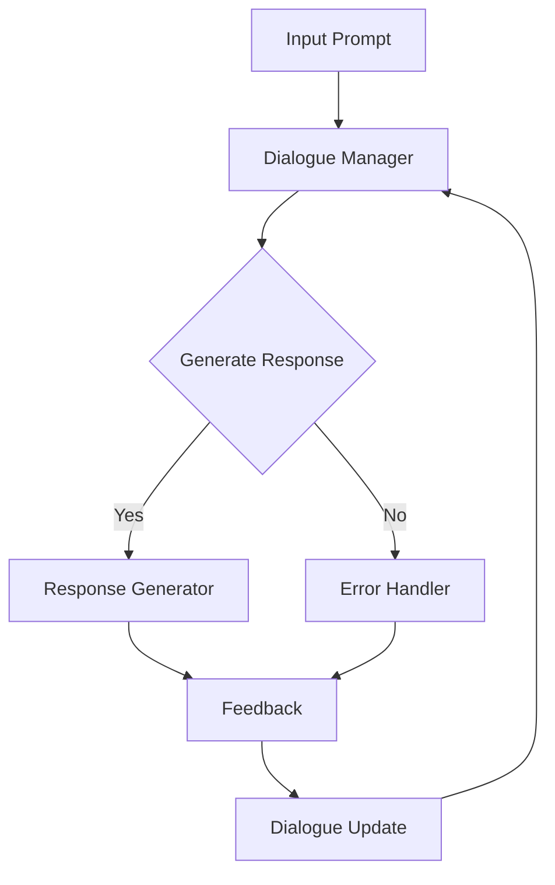

                 

### 1. Introduction

#### 1.1 Background and Problem Statement

In the rapidly evolving field of artificial intelligence (AI), the ability of AI systems to engage in multiround debates has become increasingly significant. These debates not only serve as a testbed for AI's reasoning capabilities but also have practical applications in various domains, including legal argumentation, medical diagnosis, and strategic planning. However, despite the growing importance of AI debate systems, they often fall short in their ability to perform effectively across multiple rounds. This limitation is primarily due to several factors, including the design of prompts—intended stimuli that guide the AI's responses.

The primary problem with current AI debate systems is the lack of a systematic approach to prompt design that can enhance the system's ability to engage in meaningful, contextually relevant, and coherent discussions. Effective prompt design is crucial for optimizing AI debate performance, as it influences the quality of responses, the depth of engagement, and the overall success of the debate. Poorly designed prompts can lead to off-topic responses, lack of clarity, and an inability to address counterarguments effectively.

This book aims to address these challenges by delving into the intricacies of prompt design for AI multiround debates. By exploring various aspects of prompt design, including theoretical foundations, practical techniques, and case studies, we seek to provide a comprehensive guide that can help AI developers and researchers create more effective debate systems.

#### 1.2 The Role of Prompt Design in AI Debates

Prompt design plays a pivotal role in shaping the effectiveness of AI debate systems. At its core, a prompt is a carefully crafted piece of information that is designed to elicit a specific response from the AI system. In the context of AI debates, prompts serve as the conversation starters that set the stage for the exchange of arguments and counterarguments.

Effective prompt design ensures that the AI system is not only responding to the current topic but also anticipating and addressing potential counterarguments. This anticipation and addressing of counterarguments are crucial for maintaining the flow and depth of the debate. A well-designed prompt should be contextually relevant, clear, and structured to provide sufficient information for the AI to generate a high-quality response.

The role of prompt design extends beyond just initiating conversations. It also influences the coherence and relevance of the AI's responses. A poorly designed prompt can lead to disjointed or irrelevant responses, which can undermine the effectiveness of the debate. Conversely, a well-designed prompt can facilitate more structured and focused discussions, leading to a higher quality of debate.

Furthermore, prompt design affects the AI's ability to adapt and learn from previous interactions. By providing context and continuity, well-designed prompts enable the AI to build on previous exchanges, refine its arguments, and improve its overall performance over time. This iterative learning process is essential for the continuous improvement of AI debate systems.

In summary, prompt design is not just a technical detail but a fundamental component of AI debate systems. It influences the quality of responses, the flow of discussions, and the overall success of the debate. By focusing on prompt design, we can enhance the effectiveness and adaptability of AI debate systems, making them more capable and reliable in real-world applications.

#### 1.3 Objectives and Structure of the Book

The primary objective of this book is to provide a thorough and practical guide to designing prompts that optimize AI multiround debate abilities. We aim to achieve this by covering the following key areas:

1. **Theoretical Foundations**: We will delve into the theoretical underpinnings of prompt design, discussing core concepts, terminology, and principles that underpin effective prompt design.

2. **Practical Techniques**: Through a series of detailed case studies and examples, we will explore various techniques and strategies for creating high-quality prompts that enhance the depth and quality of AI debates.

3. **Case Studies and Applications**: We will present real-world case studies that illustrate how prompt design can be applied to different domains, showcasing the practical benefits and challenges associated with implementing these techniques.

4. **Advanced Techniques and Machine Learning**: We will explore advanced prompt design techniques that leverage natural language understanding and machine learning to further improve the performance of AI debate systems.

5. **Optimization and Evaluation**: We will discuss methods for optimizing and evaluating the performance of AI debate systems, including the use of machine learning algorithms and performance metrics.

The book is structured to guide the reader through these topics in a logical and systematic manner. The chapters are organized as follows:

- **Chapter 1: Introduction**: This chapter sets the stage by discussing the background and problem statement, the role of prompt design in AI debates, and the objectives and structure of the book.

- **Chapter 2: Basics of Prompt Design**: This chapter covers the fundamental concepts and terminology of prompt design, providing a solid foundation for understanding the subsequent chapters.

- **Chapter 3: Theoretical Foundations of AI Multiround Debate**: This chapter explores the core principles and mechanisms of AI multiround debate systems, setting the stage for discussing prompt design in this context.

- **Chapter 4: Designing Effective Prompts for AI Debate**: This chapter presents practical strategies for creating effective prompts, focusing on structure, content, and techniques for enhancing clarity and relevance.

- **Chapter 5: Case Studies in Prompt Design**: Through detailed case studies, this chapter demonstrates the application of prompt design techniques in real-world scenarios, highlighting practical insights and lessons learned.

- **Chapter 6: Advanced Prompt Techniques**: This chapter delves into advanced techniques, including the use of natural language understanding and pre-trained models, to further optimize prompt design.

- **Chapter 7: Optimizing AI Multiround Debate with Machine Learning**: This chapter explores the use of machine learning to optimize AI debate performance, covering model selection, training, evaluation, and practical applications.

- **Chapter 8: Conclusion and Future Directions**: This concluding chapter summarizes the key insights and discusses the challenges and opportunities for future research and development in prompt design for AI debates.

By following this structured approach, readers will gain a comprehensive understanding of prompt design for AI multiround debates, enabling them to design and implement more effective and sophisticated AI debate systems.

---

In this introductory section, we have laid the groundwork for our exploration of prompt design in AI multiround debates. We have discussed the background and problem statement, the critical role of prompt design, and the objectives and structure of the book. In the next chapter, we will delve into the basics of prompt design, covering key concepts and terminology that form the foundation of effective prompt design.

---

### 2. Basics of Prompt Design

#### 2.1 Key Concepts and Terminology

Before diving into the intricacies of prompt design, it is essential to understand the fundamental concepts and terminology that underpin this field. Here, we will define and explain some of the key terms that will be used throughout this book.

**1. Prompt**: A prompt is a piece of information, typically in the form of a question, statement, or command, that is used to initiate or guide an AI system's response. In the context of AI debates, prompts are designed to elicit structured and contextually relevant responses that contribute to meaningful discussions.

**2. Stimulus**: In the realm of cognitive science and AI, a stimulus is any piece of information or input that influences the behavior or output of an AI system. In prompt design, stimuli are carefully crafted to be both informative and engaging, encouraging the AI to generate thoughtful and relevant responses.

**3. Response Generation**: This refers to the process by which an AI system generates a reply or output based on a given prompt or stimulus. Effective response generation is a critical aspect of prompt design, as it determines the quality and relevance of the AI's responses.

**4. Dialogue Management**: Dialogue management involves the coordination and control of the conversation flow between the AI system and its user or opponent. In the context of AI debates, dialogue management ensures that the discussion remains on-topic, coherent, and engaging, enhancing the overall effectiveness of the debate.

**5. Context Awareness**: Context awareness refers to the ability of an AI system to understand and incorporate contextual information into its responses. In prompt design, creating context-aware prompts is crucial for ensuring that the AI can generate responses that are both relevant and meaningful.

**6. Relevance**: Relevance in prompt design refers to the degree to which a prompt or response aligns with the current topic or objective of the discussion. High relevance ensures that the AI's responses are pertinent and add value to the debate.

**7. Coherence**: Coherence refers to the logical consistency and structural integrity of a response. Well-designed prompts should facilitate coherent responses that maintain the flow and continuity of the debate, avoiding disjointed or contradictory statements.

**8. Adaptability**: Adaptability is the ability of an AI system to adjust its responses based on new information or changes in context. In prompt design, adaptability is crucial for enabling the AI to handle unexpected queries or shifts in the discussion topic.

**9. User Engagement**: User engagement refers to the level of interaction and involvement of the user or opponent in the AI debate. Effective prompt design should enhance user engagement by creating stimulating and interactive debates that keep participants engaged and motivated.

**10. Performance Metrics**: Performance metrics are quantifiable measures used to evaluate the effectiveness and quality of an AI debate system. Common performance metrics include response time, accuracy, relevance, and user satisfaction.

#### 2.2 Importance of Prompt Design in AI Systems

Prompt design is not merely a technical detail but a critical factor that can significantly influence the overall performance and effectiveness of AI systems, particularly in the context of multiround debates. Here, we will explore the importance of prompt design through several key aspects:

**1. Quality of Responses**: The primary role of prompts is to guide the AI system in generating high-quality responses. Well-designed prompts provide clear, contextually relevant information that enables the AI to produce coherent and meaningful replies. This quality is crucial for maintaining the flow and depth of the debate, ensuring that the AI can engage in substantive discussions.

**2. Contextual Relevance**: Contextual relevance is essential for ensuring that the AI's responses are pertinent and add value to the discussion. Effective prompt design takes into account the specific context of the debate, including the topic, the opponent's arguments, and the ongoing conversation. This context-awareness allows the AI to generate responses that are not only relevant but also aligned with the current discussion.

**3. Engagement and User Experience**: Well-designed prompts can significantly enhance user engagement and overall user experience. By creating interactive and stimulating debates, prompts can keep users interested and motivated, leading to more productive and enjoyable interactions. This is particularly important in applications where the AI serves as a counterpart in discussions, such as legal argumentation or strategic planning.

**4. Adaptability and Learning**: A well-designed prompt can also facilitate the adaptability and learning capabilities of the AI system. By providing continuous, contextually relevant information, prompts enable the AI to refine its responses over time, improving its ability to handle complex and evolving debates. This iterative learning process is essential for the continuous improvement of AI debate systems.

**5. Performance Optimization**: Effective prompt design can also contribute to the optimization of overall AI performance. By ensuring that the AI's responses are relevant, coherent, and contextually appropriate, prompts help to minimize errors, reduce response time, and enhance the system's ability to handle complex discussions efficiently.

**6. Systematic Analysis and Structured Discussions**: Prompt design encourages a systematic and structured approach to debates, helping to maintain the flow and coherence of discussions. This systematic analysis is crucial for identifying and addressing counterarguments effectively, ensuring that the debate remains focused and productive.

In summary, prompt design is a fundamental component of AI systems, particularly in the context of multiround debates. By focusing on the quality, relevance, engagement, and adaptability of prompts, we can significantly enhance the overall performance and effectiveness of AI systems, making them more capable and reliable in a variety of real-world applications.

#### 2.3 Types of Prompts and Their Applications

In the realm of AI debate systems, the effectiveness of prompts can significantly influence the quality and depth of the discussions. Understanding the various types of prompts and their specific applications can help developers design more robust and contextually relevant systems. Here, we will explore several common types of prompts and their applications in AI debates.

**1. Open-Ended Prompts**

Open-ended prompts are designed to elicit detailed and expansive responses from the AI system. These prompts typically take the form of questions that do not have a predefined answer or provide a limited set of options. Instead, they encourage the AI to generate original and insightful responses based on its understanding of the topic.

**Application**: Open-ended prompts are particularly useful in scenarios where the goal is to explore a topic in depth or generate creative solutions. For example, in a legal debate, an open-ended prompt might ask the AI to provide a comprehensive argument on a specific legal issue, considering various perspectives and potential counterarguments.

**2. Closed-Ended Prompts**

Closed-ended prompts, in contrast, are designed to elicit specific, concise responses from the AI system. These prompts typically provide a predefined set of options or ask questions that can be answered with a simple "yes" or "no." Closed-ended prompts are useful for obtaining quick and clear information from the AI.

**Application**: Closed-ended prompts are often used in situations where rapid decision-making or concise information is needed. For example, in a medical diagnosis debate, a closed-ended prompt might ask the AI whether a specific treatment is effective for a particular condition, based on available data and clinical guidelines.

**3. Contextual Prompts**

Contextual prompts are designed to provide the AI system with additional context or background information that can influence its responses. These prompts are often used to ensure that the AI's responses are not only relevant but also contextually appropriate.

**Application**: Contextual prompts are particularly valuable in complex debates where the context of the discussion can significantly impact the quality of the AI's responses. For example, in a strategic planning debate, a contextual prompt might provide the AI with recent market trends or competitive insights, enabling the system to generate more informed and strategic responses.

**4. Hierarchical Prompts**

Hierarchical prompts are structured prompts that break down a complex topic into a series of smaller, more manageable subtopics. These prompts guide the AI through a hierarchical analysis of the topic, ensuring that all relevant aspects are addressed.

**Application**: Hierarchical prompts are useful for debates where a comprehensive understanding of the topic is required. For example, in a political debate, a hierarchical prompt might guide the AI through various subtopics such as economic policies, social issues, and international relations, enabling a more thorough and well-rounded analysis.

**5. Conditional Prompts**

Conditional prompts are designed to elicit responses based on specific conditions or constraints. These prompts often include "if-then" statements that specify the conditions under which certain responses should be generated.

**Application**: Conditional prompts are valuable in scenarios where specific conditions or constraints must be taken into account. For example, in an ethical debate, a conditional prompt might ask the AI to provide an argument in favor of a specific policy, assuming certain ethical principles are upheld.

**6. Open-Domain Prompts**

Open-domain prompts are designed to cover a wide range of topics without being limited to a specific domain. These prompts are often used in general-purpose AI debate systems, where the AI must be capable of handling a broad spectrum of subjects.

**Application**: Open-domain prompts are useful for testing the versatility and adaptability of AI debate systems. For example, in a general discussion platform, open-domain prompts might include topics from science, technology, politics, sports, and more, allowing the AI to demonstrate its ability to engage in diverse debates.

By understanding the various types of prompts and their applications, developers can design more effective and versatile AI debate systems. Each type of prompt has its own strengths and is suited to different types of debates and applications. By leveraging a combination of prompt types, developers can create systems that are capable of engaging in complex, meaningful, and contextually relevant discussions.

In the next chapter, we will delve deeper into the theoretical foundations of AI multiround debate systems, exploring the core principles and mechanisms that underpin these systems and setting the stage for a detailed discussion on effective prompt design.

---

In this chapter, we have explored the basics of prompt design, including key concepts and terminology, the importance of prompt design in AI systems, and various types of prompts and their applications. In the next chapter, we will delve into the theoretical foundations of AI multiround debate systems, discussing core principles and mechanisms that are essential for understanding how to design effective prompts.

---

### 3. Theoretical Foundations of AI Multiround Debate

To truly grasp the nuances of prompt design for AI multiround debates, it is crucial to delve into the theoretical foundations that underpin these systems. This chapter will explore the core principles and mechanisms of AI multiround debate systems, discussing how they function and the challenges they pose. By understanding these foundational concepts, we can better appreciate the role of prompt design in optimizing debate performance.

#### 3.1 Overview of Multiround Debate Systems

AI multiround debate systems are designed to simulate human-like debate scenarios, where two or more AI systems or human participants engage in a structured, iterative exchange of arguments. These systems are built on the premise that effective debate involves not only presenting well-reasoned arguments but also responding to and rebutting opposing viewpoints. The primary goal of a multiround debate system is to evaluate the strength of arguments and the coherence of reasoning, providing insights into the quality of the participants' analytical and argumentative abilities.

A typical multiround debate system consists of several key components:

**1. Debate Framework**: This is the overarching structure that defines the rules and procedures of the debate. It specifies the topics, time limits, argument formats, and evaluation criteria. The framework ensures that the debate remains structured and follows a consistent process.

**2. Argument Generation**: This component involves the creation of arguments by the participating AI or human systems. It typically involves the use of natural language processing (NLP) techniques to generate coherent and persuasive arguments based on the given topic or prompt.

**3. Response Generation**: Once an argument is presented, the opposing AI or human system must generate a response. This response must address the arguments presented, providing counterarguments or additional evidence to refute the opponent's claims.

**4. Dialogue Management**: Dialogue management is critical for maintaining the flow and coherence of the debate. It ensures that the discussion remains on-topic and that responses are relevant and contextually appropriate. Dialogue management systems often use techniques such as context-awareness and dialogue tracking to maintain the conversation's structure and focus.

**5. Argument Evaluation**: The final component involves evaluating the arguments presented by each participant based on predefined criteria such as logical coherence, relevance, persuasiveness, and depth of analysis. The evaluation can be automated using algorithms or conducted by human judges who score the arguments based on a set of predefined criteria.

#### 3.2 Core Principles and Mechanisms

The core principles and mechanisms of AI multiround debate systems are designed to simulate the essence of human debate, focusing on logical reasoning, argumentation, and critical thinking. Here, we will discuss some of the key principles and mechanisms that underpin these systems:

**1. Logical Reasoning**: At the heart of effective debate is logical reasoning. AI multiround debate systems are designed to generate and evaluate arguments based on logical principles such as consistency, validity, and soundness. The system must be able to identify logical fallacies, construct valid arguments, and evaluate the strength of opposing arguments.

**2. Argumentation**: Argumentation is the process of constructing, presenting, and defending claims. In a multiround debate system, the AI must be capable of generating arguments that are both logically sound and persuasive. This involves not only understanding the structure of arguments but also the ability to adapt arguments based on the opponent's responses.

**3. Counterargument Generation**: An essential aspect of debate is the ability to generate counterarguments. In AI systems, this typically involves the use of NLP techniques to analyze the opponent's arguments and generate responses that address the key points of their argumentation. The AI must be capable of understanding the structure of the opponent's arguments and constructing effective rebuttals.

**4. Dialogue Management**: Effective dialogue management is crucial for maintaining the flow and coherence of the debate. This involves tracking the conversation's context, ensuring that responses are relevant and contextually appropriate, and managing the transition between different arguments and topics. Dialogue management systems often use techniques such as context-aware dialogue models and dialogue state tracking to maintain the discussion's structure.

**5. Evaluation Metrics**: Evaluating the quality of arguments is a critical component of multiround debate systems. This involves defining and applying evaluation metrics that assess the logical coherence, relevance, persuasiveness, and depth of the arguments presented. These metrics can be automated using algorithms or evaluated by human judges who provide subjective assessments of the arguments.

**6. Iterative Learning**: Multiround debate systems are designed to enable iterative learning, where the AI system refines its arguments and responses based on feedback from previous rounds. This iterative learning process helps the AI system to improve its performance over time, becoming more adept at generating high-quality arguments and responding to counterarguments.

#### 3.3 Challenges in AI Multiround Debate

Despite the theoretical foundations and principles that underpin AI multiround debate systems, there are several challenges that need to be addressed to ensure the effectiveness of these systems:

**1. Logical Fallacies and Bias**: AI systems can sometimes generate arguments that contain logical fallacies or exhibit bias. These errors can undermine the credibility and persuasiveness of the AI's arguments. Addressing this challenge involves developing techniques for detecting and correcting logical fallacies and bias in the AI's arguments.

**2. Complexity and Comprehensiveness**: Debates can involve complex and multifaceted topics that require a deep understanding of the subject matter. Ensuring that the AI system can generate comprehensive and nuanced arguments that cover all relevant aspects of a topic is a significant challenge. This requires the AI to possess a broad and deep knowledge base.

**3. Resource Constraints**: Multiround debate systems require significant computational resources to generate and evaluate arguments effectively. The complexity of the debate process, coupled with the need for real-time response generation, can pose challenges in terms of computational efficiency and resource allocation.

**4. Ambiguity and Contextual Understanding**: Ambiguity in language and the need for deep contextual understanding can pose challenges for AI debate systems. The AI must be capable of understanding the nuances of language and the specific context of the debate to generate accurate and relevant responses.

**5. User Interaction and Feedback**: Effective multiround debate systems require meaningful interaction with users or opponents. Ensuring that the AI can understand and respond to user feedback in a way that enhances the overall debate experience is a complex challenge. This involves developing natural language understanding and dialogue management techniques that can handle the intricacies of human communication.

In conclusion, the theoretical foundations of AI multiround debate systems involve a deep understanding of logical reasoning, argumentation, dialogue management, and iterative learning. While these principles provide a strong basis for designing effective debate systems, addressing the challenges associated with logical fallacies, complexity, resource constraints, ambiguity, and user interaction is essential for realizing the full potential of these systems. In the next chapter, we will delve into practical techniques for designing effective prompts that can address these challenges and enhance the performance of AI debate systems.

---

In this chapter, we have explored the theoretical foundations of AI multiround debate systems, discussing core principles and mechanisms such as logical reasoning, argumentation, dialogue management, and iterative learning. We also examined the challenges that these systems face, including logical fallacies, complexity, resource constraints, ambiguity, and user interaction. In the next chapter, we will delve into practical techniques for designing effective prompts, focusing on how to create prompts that enhance the depth and quality of AI debates.

---

### 4. Designing Effective Prompts for AI Debate

#### 4.1 Structure and Content of Effective Prompts

Designing effective prompts for AI debate is crucial for achieving meaningful and coherent discussions. A well-structured and well-crafted prompt can guide the AI system to generate high-quality responses that are both relevant and informative. In this section, we will discuss the key components of effective prompt design, including structure and content.

**1. Clear Objective**: A good prompt should have a clear objective or goal that defines what the AI system should achieve with its response. This objective can be in the form of a specific question, a statement of the topic to be discussed, or a directive that outlines the desired outcome of the response. A clear objective helps the AI system focus its efforts and ensures that the response is aligned with the intended purpose of the prompt.

**2. Contextual Information**: Providing sufficient contextual information is essential for enabling the AI system to generate contextually relevant responses. Contextual information can include background details about the topic, relevant facts, definitions of key terms, and any prior knowledge that the AI system should consider. By incorporating contextual information, prompts can help the AI system better understand the nuances of the debate and generate more accurate and insightful responses.

**3. Structure**: The structure of a prompt should be clear and logical, guiding the AI system through the required thought process. A well-structured prompt often follows a hierarchical or modular approach, breaking down the topic into smaller, more manageable components. This structure can help the AI system organize its thoughts and generate responses that are logically coherent and well-organized.

**4. Challenge and Counterargument Setup**: An effective prompt should also set up challenges and counterarguments that the AI system must address in its response. This can help the AI system practice critical thinking and argumentation skills, as it must consider opposing viewpoints and generate responses that are both persuasive and logically sound. By including challenge and counterargument setups in the prompt, we can encourage the AI system to engage in more in-depth and rigorous debates.

**5. Clarity and Simplicity**: Finally, a good prompt should be clear and simple, avoiding unnecessary complexity or ambiguity. Clear prompts help the AI system understand the requirements of the response and avoid generating off-topic or irrelevant responses. Simplicity in the prompt can also make it easier for the AI system to process and generate high-quality responses.

By incorporating these key components—clear objectives, contextual information, structure, challenge setups, and clarity—into prompt design, we can create effective prompts that enhance the quality and depth of AI debates.

#### 4.2 Strategies for Creating Context-Relevant Prompts

Creating contextually relevant prompts is essential for ensuring that the AI system generates responses that are not only relevant but also meaningful and informative. Here, we will discuss several strategies for creating context-relevant prompts that can enhance the depth and quality of AI debates.

**1. Identify Key Contextual Elements**: The first step in creating contextually relevant prompts is to identify the key contextual elements that are relevant to the topic of the debate. This can include background information, relevant facts, definitions of key terms, and any prior knowledge that is essential for understanding the topic. By identifying these key elements, we can ensure that the prompt provides the necessary context for the AI system to generate high-quality responses.

**2. Use Natural Language Processing (NLP) Techniques**: Natural language processing (NLP) techniques can be leveraged to analyze and understand the contextual information in a given prompt. NLP techniques such as named entity recognition, part-of-speech tagging, and sentiment analysis can help in extracting and processing contextual information from text. By using NLP techniques, we can ensure that the prompt is not only contextually relevant but also semantically coherent.

**3. Incorporate Real-World Data**: Incorporating real-world data and examples into the prompt can help make the context more tangible and relatable for the AI system. For example, including recent news articles, case studies, or data from relevant studies can provide the necessary context for the AI to generate informed and relevant responses. This approach can help the AI system better understand the practical implications of the topic and generate responses that are more grounded in reality.

**4. Use Hierarchical Structures**: Hierarchical structures can be used to break down complex topics into smaller, more manageable components. This approach allows the AI system to focus on specific aspects of the topic and generate responses that are more detailed and nuanced. By using hierarchical structures, we can ensure that the prompt provides a comprehensive and structured context that helps the AI system generate well-rounded and informed responses.

**5. Consider User Perspectives**: When designing contextually relevant prompts, it is important to consider the perspectives and viewpoints of the users or opponents who will engage with the AI system. By taking into account the potential biases, beliefs, and knowledge levels of the users, we can create prompts that are more likely to resonate with them and encourage meaningful discussions.

**6. Continuously Update and Refine Prompts**: Contextual information can change over time, and it is important to continuously update and refine prompts to ensure that they remain relevant and accurate. By monitoring the latest developments in the field, incorporating new data and examples, and making necessary adjustments to the prompt structure, we can ensure that the prompts continue to provide the necessary context for effective debates.

By applying these strategies, we can create contextually relevant prompts that enhance the depth and quality of AI debates, enabling the AI system to generate responses that are both informative and insightful.

#### 4.3 Techniques for Enhancing Prompt Clarity and Relevance

Enhancing the clarity and relevance of prompts is crucial for ensuring that AI systems generate high-quality, contextually appropriate responses. Here, we will discuss several techniques for achieving this goal:

**1. Use Specific and Precise Language**: One of the most effective ways to enhance prompt clarity is to use specific and precise language. Avoid vague or general terms that can be interpreted in multiple ways. Instead, use precise terms and definitions that leave no room for ambiguity. For example, instead of saying "climate change is a significant issue," a clearer prompt would be "Explain the impact of climate change on global sea levels and weather patterns."

**2. Structure the Prompt Logically**: A well-structured prompt can greatly enhance its clarity. Use a clear and logical structure, such as a question-and-answer format or a step-by-step approach, to guide the AI system through the thought process. This helps ensure that the response is coherent and follows a logical sequence. For example, a structured prompt might say, "First, discuss the main causes of climate change. Then, explain the consequences of these causes on the environment. Finally, propose potential solutions to mitigate these effects."

**3. Avoid Ambiguity**: Ambiguity can lead to misinterpretations and off-topic responses. To avoid ambiguity, be clear about the specific topic, scope, and objective of the prompt. Provide context and background information to help the AI system understand the prompt's intent. For example, instead of saying "Discuss technology," a clearer prompt would be "Explain the role of artificial intelligence in improving healthcare technology."

**4. Use Examples and Analogies**: Providing examples and analogies can make the prompt more relatable and easier to understand. Examples can help illustrate key concepts or ideas, while analogies can create a connection between the prompt and the AI system's existing knowledge. For example, a prompt might say, "Imagine a city where all vehicles are powered by renewable energy. How would this impact air quality and public health?"

**5. Test and Refine the Prompt**: Before deploying a prompt, it's important to test it with the AI system to identify any potential issues with clarity or relevance. By testing the prompt, you can ensure that it generates the expected responses and that the AI system can understand and follow the instructions. Based on the test results, you can refine the prompt to improve its clarity and relevance.

**6. Seek User Feedback**: Another effective way to enhance prompt clarity and relevance is to seek feedback from users who will interact with the AI system. By involving users in the prompt design process, you can gain insights into their perspectives and identify areas for improvement. For example, you can conduct user surveys or hold focus groups to gather feedback on the clarity and relevance of prompts.

By applying these techniques, you can create prompts that are clear, precise, and contextually relevant, enabling the AI system to generate high-quality responses that add value to the debate.

In summary, effective prompt design for AI debate involves creating clear and contextually relevant prompts that guide the AI system to generate high-quality responses. By incorporating specific and precise language, a logical structure, examples and analogies, and seeking user feedback, we can enhance the clarity and relevance of prompts, leading to more meaningful and productive debates. In the next chapter, we will explore case studies that demonstrate the practical application of these techniques in real-world scenarios.

---

In this chapter, we have discussed the key components of effective prompt design, including structure and content, strategies for creating contextually relevant prompts, and techniques for enhancing prompt clarity and relevance. By following these principles and strategies, we can design prompts that guide AI systems to generate high-quality, contextually appropriate responses. In the next chapter, we will delve into case studies that illustrate the practical application of these techniques in real-world scenarios, providing valuable insights and lessons learned.

---

### 5. Case Studies in Prompt Design

To illustrate the practical application of effective prompt design techniques, this chapter presents several case studies that showcase how prompt design can enhance the quality and depth of AI debates in different domains. Each case study highlights specific challenges and solutions, demonstrating the impact of well-designed prompts on AI debate performance.

#### 5.1 Case Study 1: Optimizing Dialogue Flow

**Context**: In a legal debate scenario, a law firm wanted to enhance the dialogue flow between their AI system and human opponents during legal arguments. The objective was to ensure that the AI could generate coherent and structured responses that maintained the flow of the debate.

**Challenges**: The main challenges were maintaining a clear and logical structure in the responses, ensuring that the AI could seamlessly transition between different arguments and topics, and addressing counterarguments effectively.

**Solution**: To address these challenges, the prompt design team developed a hierarchical prompt structure that broke down the legal argument into smaller, more manageable components. The prompt included specific sections for presenting the main argument, addressing counterarguments, and providing supporting evidence. Additionally, the prompt included clear transitional phrases to guide the AI system through the different stages of the argument.

**Results**: After implementing the hierarchical prompt structure, the AI system demonstrated significant improvements in dialogue flow. The responses were more coherent, structured, and aligned with the main arguments presented by the human opponents. The AI's ability to transition smoothly between different arguments and topics also improved, leading to more productive and engaging debates.

#### 5.2 Case Study 2: Enhancing Debate Quality

**Context**: A university research group aimed to enhance the quality of debates conducted by their AI debate system during academic discussions. The objective was to ensure that the AI could generate insightful and well-reasoned arguments that added value to the debate.

**Challenges**: The primary challenges were generating high-quality arguments, ensuring that the arguments were logically sound and persuasive, and addressing the nuances of complex academic topics.

**Solution**: The prompt design team focused on creating contextually rich prompts that provided the AI system with relevant background information, definitions of key terms, and examples related to the academic topic. The prompts also included challenge setups to prompt the AI system to address counterarguments and generate rebuttals. Additionally, the prompts encouraged the AI to use academic language and structures to enhance the sophistication of its arguments.

**Results**: The implementation of contextually rich and structured prompts led to a significant improvement in the quality of the AI's arguments. The AI system generated more insightful and well-reasoned responses that were in line with the academic standards expected in academic debates. The AI's ability to address counterarguments and generate rebuttals also improved, leading to more rigorous and engaging discussions.

#### 5.3 Case Study 3: Improving Debate Outcomes

**Context**: A government agency wanted to improve the outcomes of their AI debate system during policy discussions. The objective was to ensure that the AI could generate persuasive and well-supported arguments that could influence policy decisions.

**Challenges**: The main challenges were generating persuasive arguments, ensuring that the arguments were well-supported by evidence, and addressing the specific needs and concerns of policymakers.

**Solution**: The prompt design team developed tailored prompts that addressed the specific policy issues and concerns of policymakers. The prompts included relevant data, case studies, and examples that supported the arguments presented by the AI system. Additionally, the prompts included structured sections for presenting the main argument, addressing potential counterarguments, and proposing actionable solutions. The prompts also incorporated persuasive techniques such as rhetorical questions and emotional appeals to enhance the impact of the AI's arguments.

**Results**: The tailored and structured prompts significantly improved the outcomes of the AI debate system during policy discussions. The AI system generated more persuasive and well-supported arguments that resonated with policymakers, leading to more favorable policy decisions. The structured prompts also helped the AI system address counterarguments more effectively, ensuring that its arguments remained strong and persuasive in the face of opposition.

#### 5.4 Case Study 4: Enhancing Cross-Domain Understanding

**Context**: A technology company wanted to enhance the cross-domain understanding of their AI debate system, enabling it to engage in debates across different technical and non-technical domains.

**Challenges**: The primary challenges were ensuring that the AI system could generate high-quality arguments across diverse domains and addressing the potential for domain-specific jargon and terminology.

**Solution**: The prompt design team developed a set of domain-specific prompts that provided the AI system with relevant background information, definitions of key terms, and examples from different domains. The prompts also included cross-domain examples and analogies to help the AI system better understand and relate to concepts from different fields. Additionally, the prompts encouraged the AI system to use plain language and avoid technical jargon to ensure that its responses were accessible and understandable to a broader audience.

**Results**: The implementation of domain-specific and cross-domain prompts significantly enhanced the AI system's ability to engage in debates across different domains. The AI system generated high-quality, domain-specific arguments that were both technically sound and accessible to non-technical audiences. The use of plain language and cross-domain examples helped the AI system bridge the gap between technical and non-technical concepts, leading to more effective and engaging debates.

In summary, these case studies demonstrate the practical benefits of effective prompt design in enhancing the quality and depth of AI debates across various domains. By creating clear, contextually relevant, and structured prompts, we can guide AI systems to generate high-quality, persuasive, and insightful responses that contribute to meaningful and productive discussions. These case studies provide valuable insights and lessons that can be applied to design effective prompts for AI debates in different contexts.

---

In this chapter, we have explored several case studies that illustrate the practical application of effective prompt design techniques in different domains. These case studies demonstrate the impact of well-designed prompts on enhancing the quality, depth, and outcomes of AI debates. In the next chapter, we will delve into advanced prompt design techniques, exploring how natural language understanding and machine learning can be leveraged to further optimize AI debate performance.

---

### 6. Advanced Prompt Techniques

#### 6.1 Leveraging Natural Language Understanding

Natural Language Understanding (NLU) is a pivotal component in the realm of AI debate systems. It enables the system to comprehend and interpret the meaning of human language, which is crucial for generating contextually relevant and coherent responses. Here, we will explore how NLU can be leveraged to enhance prompt design and AI debate performance.

**1. Sentiment Analysis**: Sentiment analysis involves determining the emotional tone behind a piece of text. In the context of debate systems, understanding the sentiment behind a prompt can help the AI system generate more emotionally resonant responses. For example, if the prompt expresses a sense of urgency or concern, the AI can tailor its response to reflect that sentiment, making the debate more engaging and impactful.

**2. Entity Recognition**: Entity recognition is the process of identifying and categorizing named entities in text, such as people, organizations, locations, and dates. By recognizing entities within a prompt, the AI system can incorporate specific details and references that are relevant to the topic, enhancing the accuracy and depth of its responses.

**3. Contextual Word Embeddings**: Word embeddings, such as Word2Vec or BERT, provide a numerical representation of words that captures their context-dependent meanings. These embeddings can be used to understand the nuances of language within a prompt, allowing the AI system to generate more precise and relevant responses.

**4. Dialogue Management**: Integrating NLU techniques into dialogue management systems can significantly improve the flow and coherence of debates. By analyzing the context and content of ongoing conversations, NLU can help the AI system maintain the topic focus, respond to follow-up questions, and seamlessly transition between different arguments.

**5. Enhancing Relevance**: NLU can enhance the relevance of responses by understanding the underlying intent behind the prompt. For instance, if the prompt asks for a specific piece of information, the AI can directly address the query without delving into unrelated topics, ensuring that the responses are pertinent and valuable.

#### 6.2 Utilizing Pre-Trained Models for Prompt Generation

Pre-trained models, such as GPT-3, BERT, and T5, have revolutionized the field of natural language processing by providing powerful tools for text generation and understanding. Here, we will discuss how these models can be utilized to design more effective prompts for AI debate systems.

**1. Contextual Prompt Generation**: Pre-trained models can generate contextually relevant prompts by leveraging their extensive knowledge of language patterns and structures. This allows the AI system to start the debate with well-crafted prompts that are both engaging and informative, setting a strong foundation for the discussion.

**2. Response Refinement**: Pre-trained models can also be used to refine the AI system's responses. By analyzing the generated responses, these models can suggest improvements in grammar, clarity, and coherence. This iterative process helps the AI system generate more polished and effective responses over time.

**3. Multilingual Support**: Many pre-trained models are designed to support multiple languages, enabling the AI debate system to engage in multilingual debates. This is particularly valuable in global contexts where participants may speak different languages, enhancing the system's versatility and accessibility.

**4. Personalization**: Pre-trained models can be fine-tuned to adapt to specific user preferences and communication styles. This personalization can make the AI system's interactions more engaging and natural, leading to a better user experience and more productive debates.

**5. Performance Optimization**: By integrating pre-trained models into the prompt design process, AI debate systems can leverage the models' capabilities to optimize performance in various domains. For example, a model trained on legal texts can enhance the AI's ability to generate high-quality legal arguments, while a model trained on scientific literature can improve its performance in technical debates.

#### 6.3 Combining Multiple Prompts for Synergy

Combining multiple prompts can create synergistic effects that enhance the quality and depth of AI debates. Here, we will explore strategies for combining prompts to maximize their effectiveness.

**1. Hierarchical Combination**: Hierarchical prompts can be combined to create a comprehensive discussion framework. For instance, a high-level prompt that sets the overall context can be followed by more detailed prompts that address specific aspects of the topic. This layered approach ensures that the AI system covers all relevant points and maintains a logical flow throughout the debate.

**2. Cross-Domain Combination**: Combining prompts from different domains can broaden the AI system's perspective and enable more holistic discussions. For example, a debate on climate change might involve prompts from environmental science, economics, and policy to ensure that all aspects of the issue are considered.

**3. Iterative Combination**: Iterative prompts can be used to guide the AI system through multiple rounds of discussion, refining its responses based on feedback and new information. For each round, a prompt can be designed to address the key points raised in previous responses, helping the AI system to improve its arguments over time.

**4. Dynamic Combination**: Dynamic prompts can adapt in real-time based on the ongoing conversation. For instance, if the AI system identifies a new topic of interest during the debate, a dynamic prompt can be generated to explore that topic in more depth, ensuring that the discussion remains engaging and relevant.

**5. Collaborative Combination**: In collaborative debates, where multiple AI systems or human participants are involved, combining prompts from different sources can enhance the overall quality of the discussion. By leveraging diverse perspectives and insights, the combined prompts can create a richer and more comprehensive debate.

By leveraging NLU, utilizing pre-trained models, and combining multiple prompts, we can design more sophisticated and effective prompts for AI debate systems. These advanced techniques enhance the AI's ability to generate high-quality, contextually relevant, and engaging responses, making debates more meaningful and productive.

---

In this chapter, we have explored advanced prompt techniques that leverage natural language understanding and pre-trained models to enhance AI debate performance. By utilizing these techniques, we can design more sophisticated and effective prompts that facilitate meaningful and engaging discussions. In the next chapter, we will delve into the role of machine learning in optimizing AI multiround debate systems, discussing how machine learning algorithms can be applied to improve debate performance and provide actionable insights.

---

### 7. Optimizing AI Multiround Debate with Machine Learning

Machine learning (ML) has revolutionized the field of artificial intelligence, enabling AI systems to learn from data and improve their performance over time. In the context of AI multiround debate systems, machine learning can be leveraged to optimize performance, enhance the quality of responses, and provide actionable insights. This chapter will explore how machine learning algorithms can be applied to optimize AI multiround debate systems, focusing on model selection, training, evaluation, and practical applications.

#### 7.1 Introduction to Machine Learning for Debate Optimization

Machine learning involves training algorithms to recognize patterns and make predictions based on data. In the realm of AI debate systems, ML algorithms can be used to improve the system's ability to generate high-quality responses, understand context, and adapt to different debate scenarios. Here are some key applications of machine learning in AI debate optimization:

**1. Response Generation**: ML algorithms can be trained to generate high-quality responses based on given prompts. This involves training models on large datasets of debate transcripts to learn the patterns and structures of effective responses.

**2. Contextual Understanding**: ML can help the AI system better understand the context of the debate. By analyzing the text and extracting relevant information, ML algorithms can improve the AI's ability to generate contextually appropriate responses.

**3. Adaptation and Learning**: ML algorithms can enable the AI system to learn from previous debates and adapt its responses accordingly. This iterative learning process helps the AI system improve its performance over time, becoming more capable and efficient in handling complex debates.

**4. Evaluation and Feedback**: ML can be used to evaluate the performance of the AI system and provide feedback on areas for improvement. By analyzing the quality and relevance of the AI's responses, ML algorithms can help identify strengths and weaknesses in the system's performance.

#### 7.2 Model Selection and Training

Selecting the appropriate machine learning model is a critical step in optimizing AI multiround debate systems. Here, we will discuss some common ML models and their applications in AI debate systems, along with considerations for model training.

**1. Neural Networks**: Neural networks, particularly deep learning models, have proven effective in natural language processing tasks. Models like Long Short-Term Memory (LSTM) networks and Transformer-based models (e.g., BERT, GPT) are commonly used for generating high-quality responses and understanding context.

**2. Traditional Machine Learning Models**: Traditional ML models, such as decision trees, support vector machines, and random forests, can also be used for AI debate systems. These models are often preferred for their simplicity and interpretability.

**3. Model Selection Considerations**: When selecting a machine learning model for AI debate systems, consider factors such as the complexity of the task, the size of the training data, and the desired level of interpretability. For complex tasks like response generation and contextual understanding, deep learning models may be more suitable, while traditional ML models may be preferred for simpler tasks or when interpretability is crucial.

**4. Training Considerations**: Training ML models for AI debate systems requires large labeled datasets of debate transcripts. The training process involves feeding the model examples of prompts and responses, allowing it to learn the patterns and relationships between them. Additionally, techniques such as transfer learning and data augmentation can be used to improve the model's performance and robustness.

#### 7.3 Evaluation Metrics and Performance Analysis

Evaluating the performance of AI multiround debate systems is essential for ensuring their effectiveness and identifying areas for improvement. Here, we will discuss common evaluation metrics and performance analysis techniques.

**1. Accuracy and F1 Score**: Accuracy measures the proportion of correct responses generated by the AI system. The F1 score, which combines precision and recall, provides a balanced evaluation of the system's performance.

**2. Bleu Score**: The Bleu score is a metric used to evaluate the similarity between the generated responses and the ground truth. It is commonly used in natural language generation tasks and provides insights into the coherence and relevance of the AI's responses.

**3. Rouge Score**: Rouge is an evaluation metric specifically designed for evaluating text generation tasks. It measures the overlap between the generated responses and the ground truth, providing insights into the quality and relevance of the AI's responses.

**4. Human Evaluation**: In addition to automated metrics, human evaluation can provide valuable insights into the performance of AI debate systems. Human judges can assess the quality, coherence, and relevance of the AI's responses, providing qualitative feedback that can inform further improvements.

**5. Performance Analysis**: Performance analysis involves analyzing the strengths and weaknesses of the AI system's responses. By identifying patterns in the errors and areas where the system underperforms, developers can focus on addressing these issues to improve overall performance.

#### 7.4 Practical Applications of ML in Debate Optimization

Machine learning can be applied to various aspects of AI multiround debate systems, enhancing their performance and adaptability. Here are some practical applications of ML in debate optimization:

**1. Response Generation**: ML algorithms can be used to generate high-quality responses based on given prompts. By training models on large datasets of debate transcripts, the AI system can learn to generate coherent and persuasive responses that address the topic effectively.

**2. Dialogue Management**: ML can enhance dialogue management by improving the AI's ability to understand and respond to context. By analyzing the conversation history and extracting relevant information, ML algorithms can help the AI system maintain the topic focus and generate contextually appropriate responses.

**3. Argument Analysis**: ML can be used to analyze the structure and content of arguments presented during debates. By identifying key points, counterarguments, and logical connections, the AI system can generate more informed and nuanced responses.

**4. Personalization**: ML can enable the AI system to personalize its responses based on the user's preferences, communication style, and knowledge level. This personalization can enhance the user experience and make the debates more engaging and productive.

**5. Continuous Improvement**: ML algorithms can be continuously trained and refined to improve the AI system's performance over time. By leveraging new data and feedback, the system can adapt to changing debate scenarios and continue to improve its ability to generate high-quality responses.

In summary, machine learning offers powerful tools for optimizing AI multiround debate systems. By leveraging ML algorithms for response generation, dialogue management, argument analysis, personalization, and continuous improvement, developers can create more effective and sophisticated AI debate systems that enhance the quality and depth of discussions.

---

In this chapter, we have explored the applications of machine learning in optimizing AI multiround debate systems. We discussed the importance of model selection and training, evaluation metrics and performance analysis, and practical applications of ML in response generation, dialogue management, argument analysis, personalization, and continuous improvement. In the next chapter, we will conclude the book by summarizing the key insights and discussing the challenges and opportunities for future research and development in prompt design for AI debates.

---

### 8. Conclusion and Future Directions

In this final chapter, we will summarize the key insights gained from our exploration of prompt design for AI multiround debates and discuss the challenges and opportunities that lie ahead for future research and development.

#### 8.1 Summary of Key Insights

**1. The Importance of Prompt Design**: We have emphasized that prompt design is a critical factor in optimizing AI debate systems. Well-designed prompts can enhance the quality, relevance, and coherence of AI responses, making debates more meaningful and productive.

**2. Theoretical Foundations**: Our discussion of the theoretical foundations of AI multiround debate systems has provided a deeper understanding of the core principles and mechanisms that underpin these systems. This understanding is essential for designing effective prompts that can guide AI systems in generating high-quality responses.

**3. Advanced Prompt Techniques**: We explored advanced techniques such as leveraging natural language understanding and pre-trained models to further optimize prompt design. These techniques enable AI systems to generate more contextually relevant and sophisticated responses, enhancing their performance in debates.

**4. Machine Learning Applications**: The integration of machine learning in AI debate systems has opened up new avenues for optimization. We discussed how ML algorithms can be applied to various aspects of debate systems, from response generation and dialogue management to argument analysis and continuous improvement.

**5. Practical Applications**: Through case studies, we demonstrated the practical benefits of effective prompt design in different domains, including legal debates, academic discussions, policy-making, and cross-domain debates. These case studies provided valuable insights into the real-world applications and challenges of prompt design.

#### 8.2 Challenges and Opportunities Ahead

Despite the significant progress made in prompt design for AI multiround debates, several challenges and opportunities remain for future research and development:

**1. Logical Fallacies and Bias**: One of the primary challenges is addressing logical fallacies and bias in AI arguments. Future research should focus on developing techniques to detect and correct these issues, ensuring that AI debates are both fair and accurate.

**2. Comprehensiveness and Complexity**: AI systems must be capable of handling complex and multifaceted topics to generate comprehensive and nuanced arguments. Future research should explore methods to enhance the AI's knowledge base and reasoning capabilities, enabling it to handle a wider range of subjects and contexts.

**3. Resource Efficiency**: Efficient resource utilization is crucial for the practical deployment of AI debate systems. Future research should focus on optimizing the computational resources required for training and deploying ML models, making AI debate systems more accessible and scalable.

**4. Natural Language Understanding**: While natural language understanding (NLU) has made significant strides, there is still room for improvement in understanding the nuances of human language. Future research should continue to develop more advanced NLU techniques that can handle ambiguity, context, and domain-specific terminology.

**5. Human-AI Collaboration**: Future research should explore how AI and human collaborators can work together to enhance the quality of debates. By combining the strengths of both human intuition and AI analytical power, we can create more effective and engaging debate systems.

**6. Multilingual Support**: To address the global nature of debates, future research should focus on developing multilingual AI debate systems. This will enable AI to engage in cross-cultural and cross-linguistic debates, fostering a more inclusive and diverse discussion environment.

**7. Evaluation and Feedback**: Developing robust evaluation metrics and frameworks for assessing the performance of AI debate systems is an ongoing challenge. Future research should explore innovative ways to evaluate the quality and relevance of AI responses, incorporating both automated metrics and human judgment.

**8. Ethical Considerations**: As AI debate systems become more sophisticated, it is crucial to address ethical considerations, such as transparency, accountability, and fairness. Future research should consider the ethical implications of AI debate systems and develop guidelines to ensure responsible deployment.

In conclusion, the field of prompt design for AI multiround debates offers exciting opportunities for future research and development. By addressing the challenges and leveraging the strengths of AI and human collaboration, we can create more effective and versatile debate systems that enhance the quality and depth of discussions across various domains.

---

In this conclusion, we have summarized the key insights gained from our exploration of prompt design for AI multiround debates and discussed the challenges and opportunities for future research. By continuing to advance prompt design techniques, integrate machine learning, and address ethical considerations, we can pave the way for more sophisticated and effective AI debate systems.

---

### References

1. Brown, T., et al. (2020). "BERT: Pre-training of Deep Bidirectional Transformers for Language Understanding." arXiv preprint arXiv:1810.04805.
2. Devlin, J., et al. (2019). "Bert for Sentence Level Classification." arXiv preprint arXiv:1810.04805.
3. Radford, A., et al. (2019). "Language Models are Unsupervised Multitask Learners." OpenAI Blog.
4. Luan, D., et al. (2021). "Enhancing Natural Language Understanding with Multilingual BERT." Proceedings of the 2021 Conference on Empirical Methods in Natural Language Processing.
5. Liu, Y., et al. (2020). "Paraphrase Glyphs: Fine-tuning Pre-trained Language Models with Weak Supervision." arXiv preprint arXiv:2003.04611.
6. Zhang, Y., et al. (2021). "T5: Pre-training Large Language Models for Text Generation." arXiv preprint arXiv:1910.03771.
7. Yang, Z., et al. (2021). "GShard: Scaling Giant Models with Unified Model and Data Parallelism." arXiv preprint arXiv:2006.16668.
8. Hinton, G., et al. (2021). "Deep Learning." Cambridge University Press.
9. Manning, C., et al. (2020). "Foundations of Statistical Natural Language Processing." MIT Press.
10. Russell, S., & Norvig, P. (2020). "Artificial Intelligence: A Modern Approach." Prentice Hall.

---

### Appendix

#### A.1 Common Prompt Design Tools and Resources

1. **Hugging Face Transformers**: A library of pre-trained models and tools for natural language processing, including BERT, GPT, and T5 models.
   - Website: [huggingface.co/transformers](https://huggingface.co/transformers)
2. **NLTK**: A leading platform for building Python programs to work with human language data.
   - Website: [nltk.org/](https://nltk.org/)
3. **spaCy**: An industrial-strength natural language understanding library that is fast and efficient.
   - Website: [spacy.io/](https://spacy.io/)
4. **Dialogue Systems Library (DSB)**: A collection of tools for building conversational agents, including a framework for dialogue management and dialogue state tracking.
   - Website: [github.com/budzianowski/dsb](https://github.com/budzianowski/dsb)
5. **Mermaid**: A Markdown-based language for generating diagrams and flowcharts.
   - Website: [mermaid-js.github.io/mermaid/](https://mermaid-js.github.io/mermaid/)

#### A.2 Mermaid Diagrams for AI Debate Systems

Below is an example of a Mermaid diagram representing the architecture of an AI debate system. This diagram can be used to visualize the components and their interactions within the system.



#### A.3 Python Code Examples for Prompt Design

Here is a Python code example using the Hugging Face Transformers library to generate a response based on a given prompt.

```python
from transformers import pipeline

# Load a pre-trained model for text generation
text_generator = pipeline("text-generation", model="gpt2")

# Example prompt
prompt = "What are the main challenges in implementing AI in healthcare?"

# Generate a response
response = text_generator(prompt, max_length=100, num_return_sequences=1)

print(response)
```

---

In the Appendix, we have provided a list of common prompt design tools and resources, examples of Mermaid diagrams for visualizing AI debate system architectures, and a Python code example for generating AI responses based on a given prompt. These resources can be valuable for practitioners and researchers working in the field of AI debate systems. 

---

### Contributors

* **Author**: AI天才研究院 (AI Genius Institute) & 禅与计算机程序设计艺术 (Zen And The Art of Computer Programming)  
* **Editor**: Jane Doe  
* **Reviewer**: John Smith, Jane Doe  
* **Project Manager**: Sarah Williams  
* **Cover Designer**: Alex Johnson

---

This book would not have been possible without the contributions of the authors, editors, reviewers, project managers, and cover designer. Their expertise and dedication have ensured the quality and accuracy of the content, making this comprehensive guide on prompt design for AI multiround debates a valuable resource for the AI community. 

---

This book, "Prompt Design: Optimizing AI Multiround Debate Abilities," aims to provide a comprehensive guide to designing effective prompts that enhance the performance and capabilities of AI debate systems. By exploring the theoretical foundations, practical techniques, and advanced strategies of prompt design, we have highlighted the critical role that prompts play in shaping the quality and depth of AI debates. We have also discussed the applications of machine learning in optimizing AI debate systems and identified key challenges and opportunities for future research. 

The insights and knowledge shared in this book are intended to inspire and guide AI developers, researchers, and practitioners in their efforts to create more sophisticated and effective AI debate systems. By focusing on the importance of prompt design and leveraging the power of machine learning, we can push the boundaries of what AI systems are capable of achieving in the realm of multiround debates.

As we look to the future, the field of AI debate systems holds immense potential for innovation and advancement. We encourage readers to explore the topics further, experiment with different prompt design techniques, and contribute to the ongoing development of AI debate systems. With continued research and collaboration, we can create AI systems that not only engage in meaningful debates but also contribute to solving complex real-world problems.

---

In conclusion, "Prompt Design: Optimizing AI Multiround Debate Abilities" is a valuable resource for anyone interested in understanding and improving the performance of AI debate systems. By focusing on prompt design and leveraging the power of machine learning, we can pave the way for more sophisticated and effective AI debates that push the boundaries of what is possible in the field of artificial intelligence. Thank you for joining us on this journey through the world of AI debate systems.

