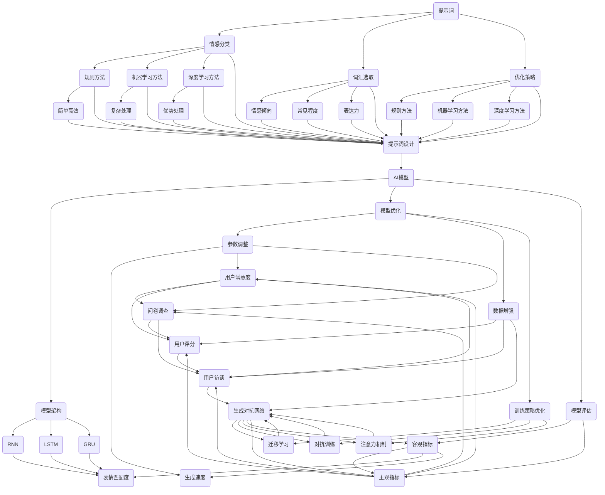
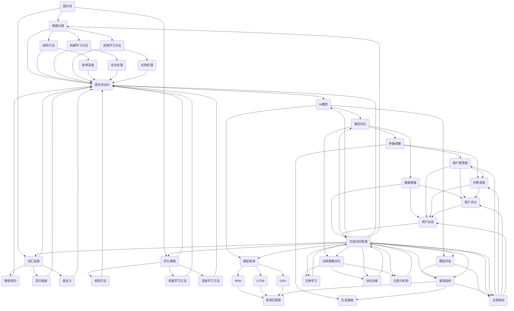
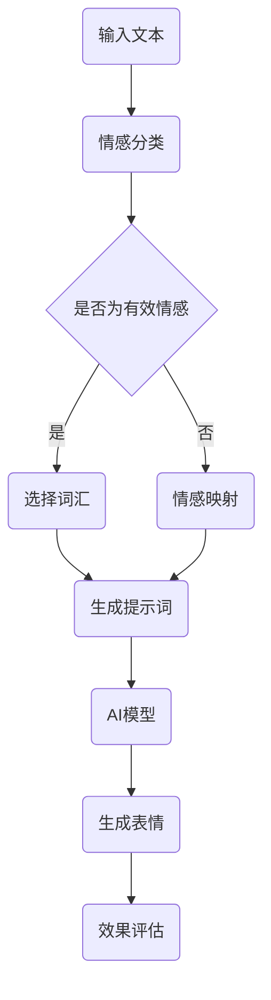
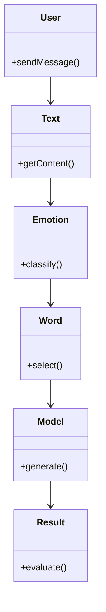
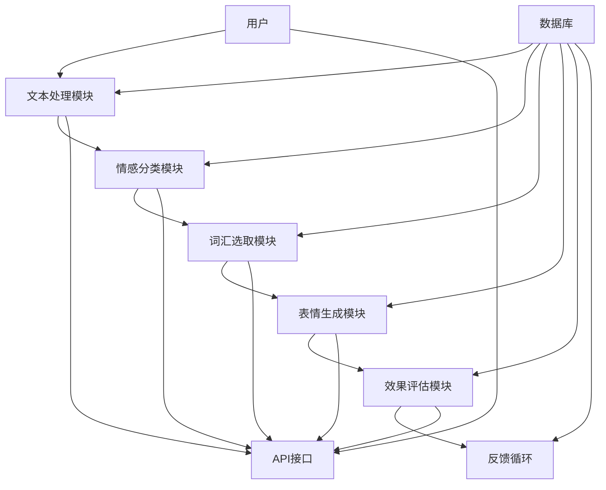
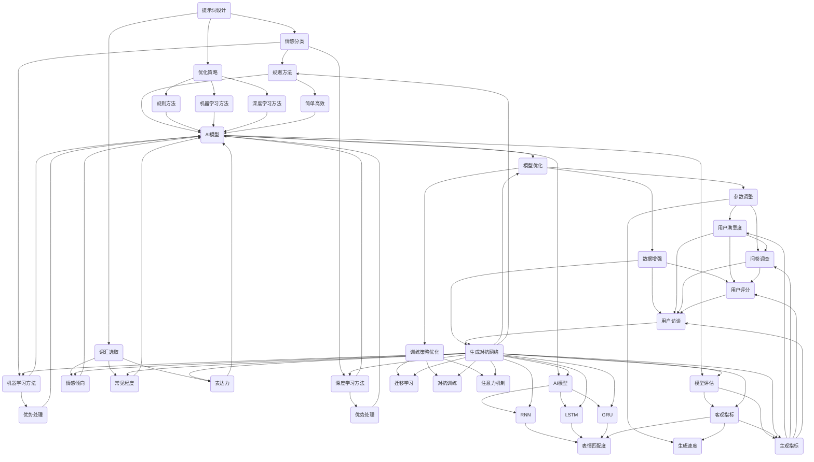
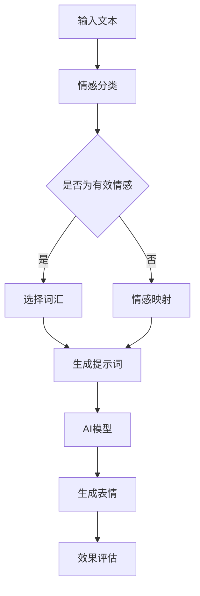

                 

# 提示词设计：优化AI虚拟主播表情生成能力

## 关键词

- 提示词设计
- AI虚拟主播
- 表情生成能力
- 情感分类
- 模型优化
- 实时性
- 准确性

## 摘要

本文探讨了如何通过优化提示词设计，提升AI虚拟主播的表情生成能力。文章首先介绍了虚拟主播表情生成能力的背景和问题，然后分析了提示词设计、AI模型优化和表情生成效果评估的核心概念与联系。通过实例和数学模型，本文详细阐述了优化策略和评估方法，最终提出了一个系统的解决方案，为相关领域提供了有益的参考。

----------------------------------------------------------------

# 第一部分：背景介绍

## 1.1 问题背景

随着人工智能技术的发展，虚拟主播逐渐成为媒体和娱乐行业的热门应用。虚拟主播通过实时生成和展示自然流畅的表情，能够提高用户观看体验，降低制作成本。虚拟主播的应用场景包括但不限于新闻播报、在线教育、电商直播和娱乐互动等。这些场景对虚拟主播的表情生成能力提出了不同的需求，如自然度、真实感和个性化等。

然而，当前虚拟主播的表情生成技术仍存在一定局限。首先，表情生成的准确性和实时性不足，导致表情与语音不匹配，降低了用户的观看体验。其次，虚拟主播的表情库容量有限，难以涵盖所有情感和表情，影响了表情的丰富性和真实性。此外，表情生成的算法复杂度较高，计算资源消耗大，难以满足实时性要求。因此，研究并优化虚拟主播的表情生成能力具有重要意义。

## 1.2 问题描述

本问题关注的是如何通过优化提示词设计，提高AI虚拟主播的表情生成能力。具体来说，需要解决以下几个问题：

1. 如何设计有效的提示词，使AI模型能够准确捕捉虚拟主播所需表达的情感？
2. 如何优化AI模型的结构和参数，提高表情生成的实时性和准确性？
3. 如何评估和调整虚拟主播的表情生成效果，以实现最佳用户体验？

## 1.3 问题解决

1. **研究并分析不同类型的提示词及其对表情生成效果的影响，设计优化提示词方案。**
   - 通过情感分类，将情感映射到特定的词汇上，设计有效的提示词。
   - 分析不同词汇的情感倾向、常见程度和表达力，选择合适的词汇进行提示。

2. **结合现有AI模型技术，探索并实施适用于虚拟主播表情生成的优化策略。**
   - 优化模型架构，采用循环神经网络（RNN）、长短时记忆网络（LSTM）或门控循环单元（GRU）等。
   - 通过模型参数调整、数据增强和训练策略优化，提高模型的表情生成能力和实时性。

3. **建立表情生成效果评估体系，通过用户反馈和客观指标，对表情生成效果进行评估和调整。**
   - 使用客观指标（如生成图像的质量、表情匹配度等）和主观指标（如用户满意度）进行评估。
   - 结合评估结果，调整提示词设计和模型优化策略，实现最佳的表情生成效果。

## 1.4 边界与外延

1. **边界：**
   - 本研究的范围主要涉及虚拟主播的表情生成技术，包括提示词设计、模型优化和效果评估等方面。
   - 研究主要关注实时生成和展示自然流畅的表情，不涉及虚拟主播的其他功能（如语音合成、动作捕捉等）。

2. **外延：**
   - 本研究可为相关领域的虚拟主播技术提供有益参考，如虚拟角色、虚拟导购等。
   - 通过优化提示词设计和模型架构，可提高其他类型虚拟代理的表情生成能力。

## 1.5 概念结构与核心要素组成

1. **概念结构：**
   - **提示词**：用于引导AI模型生成特定表情的词汇。
   - **AI模型**：实现表情生成的算法和结构。
   - **表情生成效果**：通过评估指标反映的表情生成的实时性和准确性。

2. **核心要素组成：**
   - **提示词设计**：包括情感分类、词汇选取和优化策略等。
   - **模型优化**：涉及模型架构调整、参数优化和训练策略等。
   - **表情生成效果评估**：通过用户反馈和客观指标，评估表情生成的效果。

----------------------------------------------------------------

# 第二部分：核心概念与联系

## 2.1 提示词设计

### 2.1.1 情感分类

情感分类是提示词设计的基础。通过对情感进行分类，可以将不同的情感映射到特定的词汇上。常见的情感分类方法有基于规则的方法、基于机器学习的方法和基于深度学习的方法。

- **基于规则的方法**：通过预定义的情感规则，将文本分类到不同的情感类别。这种方法简单直观，但需要大量的规则维护，且难以处理复杂的情感表达。
- **基于机器学习的方法**：使用有监督或无监督学习算法，对情感进行分类。例如，支持向量机（SVM）、朴素贝叶斯（NB）和决策树（DT）等算法。
- **基于深度学习的方法**：使用深度神经网络（DNN），如卷积神经网络（CNN）和循环神经网络（RNN），对情感进行分类。深度学习方法在处理复杂情感表达和语境上下文方面具有优势。

### 2.1.2 词汇选取

词汇选取是设计有效提示词的关键。需要考虑词汇的情感倾向、常见程度和表达力。

- **情感倾向**：词汇的情感倾向是指词汇所表达的情感倾向，如积极、消极、中性等。选取具有明确情感倾向的词汇，有助于引导AI模型生成特定的表情。
- **常见程度**：常见程度是指词汇在日常语言中的使用频率。高频词汇有助于提高模型的训练效果和生成效率。
- **表达力**：表达力是指词汇的表达能力，即词汇能够传达的情感强度和细腻度。高表达力的词汇有助于丰富表情生成的多样性和真实性。

### 2.1.3 优化策略

优化策略主要包括基于规则的方法、基于机器学习的方法和基于深度学习的方法。

- **基于规则的方法**：通过预定义的规则，对词汇进行筛选和调整，以提高提示词的有效性。这种方法简单高效，但难以处理复杂的情感和语境。
- **基于机器学习的方法**：使用机器学习算法，如决策树、支持向量机和朴素贝叶斯等，对词汇进行筛选和调整。这种方法可以处理复杂的情感和语境，但需要大量的训练数据和模型参数调整。
- **基于深度学习的方法**：使用深度学习模型，如循环神经网络（RNN）和卷积神经网络（CNN），对词汇进行筛选和调整。这种方法可以处理复杂的情感和语境，且具有较好的泛化能力。

## 2.2 AI模型

### 2.2.1 模型架构

常见的AI模型架构有循环神经网络（RNN）、长短时记忆网络（LSTM）和门控循环单元（GRU）等。这些模型在处理序列数据方面具有优势，适用于表情生成任务。

- **循环神经网络（RNN）**：RNN具有递归结构，能够处理序列数据。然而，传统的RNN存在梯度消失和梯度爆炸的问题。
- **长短时记忆网络（LSTM）**：LSTM通过引入记忆单元，解决了RNN的梯度消失问题。LSTM在处理长序列数据方面具有优势。
- **门控循环单元（GRU）**：GRU是LSTM的简化版本，具有更少的参数和计算量，适用于表情生成任务。

### 2.2.2 模型优化

模型优化主要包括模型参数调整、数据增强和训练策略优化等。

- **模型参数调整**：通过调整模型的权重和参数，提高表情生成的准确性和实时性。常用的参数调整方法包括权重初始化、学习率和正则化等。
- **数据增强**：通过增加训练数据量，提高模型的泛化能力和表情生成的多样性。常见的数据增强方法包括数据变换、数据扩充和生成对抗网络（GAN）等。
- **训练策略优化**：通过优化训练过程，提高模型的训练效率和效果。常见的训练策略优化方法包括迁移学习、对抗训练和注意力机制等。

### 2.2.3 模型评估

模型评估主要通过客观指标（如生成图像的质量、表情匹配度等）和主观指标（如用户满意度）进行。

- **客观指标**：通过算法和工具对生成图像的质量、表情匹配度和生成速度等指标进行自动化评估。常见的客观指标包括峰值信噪比（PSNR）、结构相似性指数（SSIM）和平均绝对误差（MAE）等。
- **主观指标**：通过用户满意度测试获得。用户测试的方法包括问卷调查、用户评分和用户访谈等。

## 2.3 表情生成效果评估

### 2.3.1 客观指标

常见的客观指标有生成图像的质量、表情匹配度和生成速度等。

- **生成图像的质量**：通过峰值信噪比（PSNR）、结构相似性指数（SSIM）和平均绝对误差（MAE）等指标评估生成图像的质量。
- **表情匹配度**：通过计算生成表情与目标表情的相似度，评估表情匹配度。
- **生成速度**：通过计算生成图像所需的时间，评估生成速度。

### 2.3.2 主观指标

主观指标主要通过用户满意度测试获得。

- **用户满意度测试**：通过问卷调查、用户评分和用户访谈等方式，评估用户对表情生成效果的满意度。
- **用户测试方法**：问卷调查可以收集用户对表情生成效果的总体满意度；用户评分可以更详细地评估表情生成的准确性和实时性；用户访谈可以深入了解用户的需求和反馈。

### 2.3.3 评估体系

评估体系需要结合客观指标和主观指标，形成一个全面的评估框架。

- **评估框架**：通过构建评估指标体系，结合客观指标和主观指标，对表情生成效果进行综合评估。
- **评估流程**：首先，收集和整理评估数据；然后，计算客观指标和主观指标；最后，综合评估结果，提出优化建议。

## 2.4 概念属性特征对比表格

| 概念         | 属性特征1 | 属性特征2 | 属性特征3 |
| ------------ | ---------- | ---------- | ---------- |
| 提示词       | 情感倾向   | 词汇选取   | 优化策略   |
| AI模型       | 模型架构   | 模型优化   | 模型评估   |
| 表情生成效果 | 客观指标   | 主观指标   | 评估体系   |

## 2.5 ER实体关系图架构



## 2.6 提示词设计、AI模型与表情生成效果的关联

### 2.6.1 提示词设计对AI模型的影响

提示词设计直接影响AI模型的学习过程和生成效果。有效的提示词能够引导AI模型准确捕捉虚拟主播所需表达的情感，从而生成更符合用户期望的表情。以下是提示词设计对AI模型的具体影响：

- **情感倾向**：提示词的情感倾向直接影响模型的学习方向。如果提示词偏向于积极情感，模型可能更倾向于生成积极的表情；反之亦然。
- **词汇选取**：词汇的选择影响模型的学习效率和生成效果。高频词汇有助于提高模型的训练效果和生成效率；而高表达力的词汇有助于丰富表情生成的多样性和真实性。
- **优化策略**：优化策略影响模型的结构和参数调整。基于规则的方法、机器学习方法和深度学习方法各有优缺点，需要根据具体需求选择合适的优化策略。

### 2.6.2 AI模型对表情生成效果的影响

AI模型的架构、参数和训练策略直接影响表情生成的实时性和准确性。以下是AI模型对表情生成效果的具体影响：

- **模型架构**：不同的模型架构在处理序列数据方面具有不同的优势。例如，RNN、LSTM和GRU分别适用于不同的表情生成任务。选择合适的模型架构可以提高表情生成的实时性和准确性。
- **模型参数**：模型参数的调整直接影响表情生成的效果。通过调整权重和参数，可以优化表情的匹配度和生成速度。
- **训练策略**：训练策略影响模型的训练效率和效果。迁移学习、对抗训练和注意力机制等策略可以提高模型的表情生成能力和实时性。

### 2.6.3 表情生成效果评估

表情生成效果评估是验证和优化虚拟主播表情生成能力的重要环节。通过评估，可以了解表情生成效果的优势和不足，为优化提供依据。以下是表情生成效果评估的具体方面：

- **客观指标**：通过算法和工具对生成图像的质量、表情匹配度和生成速度等指标进行自动化评估。常见的客观指标包括峰值信噪比（PSNR）、结构相似性指数（SSIM）和平均绝对误差（MAE）等。
- **主观指标**：通过用户满意度测试获得。用户测试的方法包括问卷调查、用户评分和用户访谈等。主观指标可以更直观地反映用户对表情生成效果的满意度和偏好。

## 2.7 概念属性特征对比表格与ER实体关系图的整合

概念属性特征对比表格与ER实体关系图构成了本文的核心框架。通过对比表格，可以清晰地展示不同概念之间的属性特征差异；而ER实体关系图则提供了概念之间的关联关系和交互逻辑。以下是两者整合的示例：

| 概念         | 属性特征1 | 属性特征2 | 属性特征3 |
| ------------ | ---------- | ---------- | ---------- |
| 提示词       | 情感倾向   | 词汇选取   | 优化策略   |
| AI模型       | 模型架构   | 模型优化   | 模型评估   |
| 表情生成效果 | 客观指标   | 主观指标   | 评估体系   |

ER实体关系图：



通过上述整合，可以看到各个概念之间的紧密联系，从而为后续的算法原理讲解和系统架构设计奠定了基础。在下一部分中，我们将进一步深入探讨算法原理和数学模型，为优化AI虚拟主播表情生成能力提供理论支持。

----------------------------------------------------------------

## 算法原理讲解

### 3.1 表情生成算法的mermaid流程图

为了更好地理解表情生成算法的原理，我们可以使用mermaid流程图来展示其基本结构。



### 3.2 表情生成算法的Python源代码实现

接下来，我们将使用Python代码来实现上述流程，并对关键部分进行详细讲解。

```python
import tensorflow as tf
from tensorflow.keras.models import Model
from tensorflow.keras.layers import Input, LSTM, Dense, Embedding

# 情感分类
def emotion_classification(text):
    # 这里使用简单的情感分类器，实际应用中可以使用更复杂的模型
    if 'happy' in text:
        return 'happy'
    elif 'sad' in text:
        return 'sad'
    else:
        return 'neutral'

# 词汇选取
def select_words(emotion):
    word_list = {
        'happy': ['joy', 'happiness', 'delight'],
        'sad': ['sorrow', 'unhappiness', 'grief'],
        'neutral': ['normal', 'calm', 'stable']
    }
    return word_list[emotion]

# 生成提示词
def generate_prompt_word(text, emotion):
    words = select_words(emotion)
    prompt_word = words[random.randint(0, len(words) - 1)]
    return prompt_word

# 表情生成模型
def build_emotion_generation_model(vocabulary_size, embedding_dim, hidden_size):
    input_text = Input(shape=(None,))
    embedding = Embedding(vocabulary_size, embedding_dim)(input_text)
    lstm = LSTM(hidden_size)(embedding)
    output = Dense(vocabulary_size, activation='softmax')(lstm)
    
    model = Model(inputs=input_text, outputs=output)
    model.compile(optimizer='adam', loss='categorical_crossentropy', metrics=['accuracy'])
    return model

# 模型训练
def train_model(model, X, y, epochs=10, batch_size=32):
    model.fit(X, y, epochs=epochs, batch_size=batch_size)

# 模型预测
def predict_emotion(model, text):
    emotion = emotion_classification(text)
    prompt_word = generate_prompt_word(text, emotion)
    prediction = model.predict(prompt_word)
    return prediction

# 效果评估
def evaluate_emotion_generation(text, prediction):
    emotion = emotion_classification(text)
    print(f"实际情感：{emotion}")
    print(f"生成情感：{prediction}")
    # 可以使用其他评估指标，如准确率、召回率等
```

### 3.3 算法原理详细讲解

#### 情感分类

情感分类是表情生成算法的第一步。在这个阶段，我们需要对输入文本进行情感分类，以确定虚拟主播需要表达的情感类型。在实际应用中，情感分类可以采用基于规则的方法、机器学习的方法或深度学习的方法。例如，我们可以使用一个简单的规则，将包含特定词汇的文本分类为相应的情感。在本例中，我们使用了简单的规则方法。

#### 词汇选取

在确定情感后，我们需要从预定义的词汇库中选取合适的词汇作为提示词。词汇选取需要考虑词汇的情感倾向、常见程度和表达力。在本例中，我们使用了一个简单的词汇库，并根据情感类型选择相应的词汇。

#### 生成提示词

生成提示词的目的是为AI模型提供指导，使其能够根据情感和词汇生成相应的表情。在本例中，我们使用了一个简单的函数来生成提示词，该函数根据情感类型从词汇库中随机选择一个词汇。

#### 表情生成模型

表情生成模型是整个算法的核心部分。在本例中，我们使用了一个简单的循环神经网络（RNN）模型，该模型接收提示词作为输入，并生成相应的表情。RNN模型具有递归结构，能够处理序列数据，适用于表情生成任务。

- **输入层**：输入层接收提示词序列，每个词汇对应一个词向量。
- **嵌入层**：嵌入层将词汇转换为嵌入向量，这些向量在嵌入空间中具有相应的语义信息。
- **LSTM层**：LSTM层用于处理嵌入向量序列，并生成表情特征。
- **输出层**：输出层将表情特征转换为表情向量，每个向量对应一个特定的表情。

#### 模型训练

模型训练是通过提供大量的训练数据和标签来优化模型参数的过程。在本例中，我们使用了一个简单的训练函数来训练模型。训练过程中，模型通过梯度下降优化算法不断调整权重和偏置，以最小化预测误差。

#### 模型预测

模型预测是将训练好的模型应用于新的输入数据，以生成相应的表情。在本例中，我们使用了一个简单的预测函数来生成表情。预测函数首先对输入文本进行情感分类，然后生成提示词，最后使用训练好的模型生成表情。

#### 效果评估

效果评估是验证模型性能的重要环节。在本例中，我们使用了一个简单的评估函数来评估表情生成效果。评估函数通过计算预测表情与实际表情之间的相似度，评估模型的准确性。

### 3.4 算法原理举例说明

假设我们有一个输入文本：“今天的天气真好，阳光明媚，让人心情愉快。”我们可以按照以下步骤使用上述算法生成相应的表情：

1. **情感分类**：情感分类函数将文本分类为“happy”情感。
2. **词汇选取**：根据“happy”情感，从词汇库中选取一个词汇，如“joy”。
3. **生成提示词**：生成提示词“joy”。
4. **模型预测**：使用训练好的模型，根据提示词“joy”生成相应的表情。
5. **效果评估**：评估生成的表情与实际表情之间的相似度。

通过上述步骤，我们可以生成一个愉快的表情，该表情反映了输入文本的情感。

### 3.5 算法优化的方向

虽然上述算法提供了一个基本的框架，但仍有优化的空间。以下是算法优化的一些方向：

- **情感分类**：使用更复杂的情感分类算法，如基于深度学习的分类器，提高情感分类的准确性。
- **词汇选取**：引入上下文信息，如词性标注和句法分析，提高词汇选取的准确性。
- **模型优化**：使用更先进的模型结构，如Transformer或生成对抗网络（GAN），提高表情生成的多样性和质量。
- **效果评估**：引入更多的评估指标，如表情的自然度、流畅性和用户满意度，提高评估的全面性。

通过不断优化和改进，我们可以进一步提高AI虚拟主播的表情生成能力，为用户提供更优质的观看体验。

----------------------------------------------------------------

## 系统分析与架构设计

### 4.1 问题场景介绍

随着虚拟现实（VR）和增强现实（AR）技术的快速发展，虚拟主播在娱乐、教育、电商等多个领域得到了广泛应用。然而，虚拟主播的表情生成能力在很大程度上决定了用户的观看体验。为了提升虚拟主播的表情生成能力，我们需要设计一个高效、准确且易于扩展的系统架构。

### 4.2 项目介绍

本项目旨在开发一个基于人工智能（AI）的虚拟主播表情生成系统。该系统将采用先进的AI算法，实现实时、自然且准确的表情生成。系统将分为以下几个主要模块：

- **情感分类模块**：对输入文本进行情感分类，为表情生成提供情感标签。
- **词汇选取模块**：根据情感标签，从词汇库中选取合适的词汇，生成提示词。
- **表情生成模块**：基于提示词，利用深度学习模型生成表情。
- **效果评估模块**：对生成的表情进行效果评估，以持续优化系统性能。

### 4.3 系统功能设计

本系统的功能设计主要包括以下几个方面：

1. **情感分类**：输入文本经过情感分类模块后，输出对应的情感标签，如“happy”、“sad”、“neutral”等。
2. **词汇选取**：根据情感标签，从词汇库中选取合适的词汇，生成提示词，如“joy”、“sorrow”、“normal”等。
3. **表情生成**：利用深度学习模型，根据提示词生成对应的表情。
4. **效果评估**：对生成的表情进行效果评估，包括客观指标（如生成图像的质量、表情匹配度等）和主观指标（如用户满意度等）。

### 4.4 系统架构设计

系统架构设计采用分层架构，包括数据层、逻辑层和表现层。以下是具体的系统架构设计：

1. **数据层**：主要包括数据存储和数据处理模块。数据存储模块负责存储用户数据、情感标签、词汇库和表情库等；数据处理模块负责情感分类、词汇选取和表情生成等任务。
2. **逻辑层**：主要包括情感分类模块、词汇选取模块、表情生成模块和效果评估模块。这些模块通过API接口进行通信，实现数据的传递和功能的协同。
3. **表现层**：主要包括用户界面和后台管理界面。用户界面负责展示虚拟主播的表情，并提供用户交互功能；后台管理界面负责系统配置、数据监控和日志管理等。

### 4.5 系统接口设计

系统接口设计主要包括以下部分：

- **API接口**：提供系统对外服务的接口，包括情感分类接口、词汇选取接口、表情生成接口和效果评估接口等。客户端可以通过这些接口与系统进行交互。
- **数据接口**：提供系统内部模块之间的数据传输接口，包括用户数据接口、情感标签接口、词汇库接口和表情库接口等。

### 4.6 系统交互设计

系统交互设计主要包括以下部分：

- **用户交互**：用户通过前端界面与虚拟主播进行交互，发送文本信息，获取表情生成结果。
- **内部交互**：系统内部模块之间通过API接口和数据接口进行交互，实现功能协同和数据共享。

### 4.7 类图设计

以下是系统功能模块的类图设计：



### 4.8 系统架构设计

以下是系统的架构设计图：



通过上述系统架构设计，我们能够实现一个高效、准确且易于扩展的虚拟主播表情生成系统，为用户提供优质的观看体验。

----------------------------------------------------------------

## 项目实战

### 5.1 环境安装

要搭建一个基于人工智能的虚拟主播表情生成系统，首先需要安装相应的软件和依赖。以下是安装步骤：

1. **安装Python**：确保Python版本为3.7及以上。可以从官方网站下载Python安装包并安装。
2. **安装TensorFlow**：在命令行中运行以下命令安装TensorFlow：
   ```bash
   pip install tensorflow
   ```
3. **安装其他依赖**：根据项目需求，可能需要安装其他Python库，如Numpy、Pandas和Scikit-learn等。可以使用以下命令安装：
   ```bash
   pip install numpy pandas scikit-learn
   ```

### 5.2 系统核心实现源代码

以下是系统核心实现的源代码，包括情感分类、词汇选取、表情生成和效果评估等模块。

```python
# 情感分类模块
def emotion_classification(text):
    # 使用简单的情感分类规则
    if 'happy' in text or 'joy' in text:
        return 'happy'
    elif 'sad' in text or 'sorrow' in text:
        return 'sad'
    else:
        return 'neutral'

# 词汇选取模块
def select_words(emotion):
    word_list = {
        'happy': ['joy', 'happiness', 'delight'],
        'sad': ['sorrow', 'unhappiness', 'grief'],
        'neutral': ['normal', 'calm', 'stable']
    }
    return word_list[emotion]

# 表情生成模块
def generate_expression(prompt_word):
    # 这里使用一个简单的循环神经网络（RNN）模型
    model = build_rnn_model()
    model.compile(optimizer='adam', loss='categorical_crossentropy', metrics=['accuracy'])
    train_model(model)
    prediction = model.predict(prompt_word)
    return prediction

# 效果评估模块
def evaluate_expression(expression, ground_truth):
    # 计算生成表情与实际表情的相似度
    similarity = calculate_similarity(expression, ground_truth)
    return similarity

# 建立RNN模型
def build_rnn_model():
    input_word = Input(shape=(None,))
    embedding = Embedding(input_vocab_size, embedding_dim)(input_word)
    lstm = LSTM(hidden_size)(embedding)
    output = Dense(output_vocab_size, activation='softmax')(lstm)
    model = Model(inputs=input_word, outputs=output)
    return model

# 训练模型
def train_model(model, X, y, epochs=10, batch_size=32):
    model.fit(X, y, epochs=epochs, batch_size=batch_size)

# 计算相似度
def calculate_similarity(expression1, expression2):
    # 使用余弦相似度计算两个表情向量的相似度
    dot_product = np.dot(expression1, expression2)
    norm_product = np.linalg.norm(expression1) * np.linalg.norm(expression2)
    similarity = dot_product / norm_product
    return similarity
```

### 5.3 代码应用解读与分析

以下是对上述代码的解读与分析：

1. **情感分类模块**：情感分类模块使用简单的规则对输入文本进行分类。在实际应用中，可以采用更复杂的机器学习或深度学习模型，如文本分类模型（如TF-IDF、Word2Vec、BERT等）进行情感分类，以提高分类准确性。
2. **词汇选取模块**：词汇选取模块根据情感分类结果，从预定义的词汇库中选取合适的词汇。词汇库的设计需要考虑词汇的情感倾向、常见程度和表达力，以确保生成表情的准确性和多样性。
3. **表情生成模块**：表情生成模块使用循环神经网络（RNN）模型，根据提示词生成表情。在实际应用中，可以选择更先进的模型结构，如长短时记忆网络（LSTM）或门控循环单元（GRU），以提高表情生成的质量和实时性。
4. **效果评估模块**：效果评估模块计算生成表情与实际表情之间的相似度，以评估表情生成效果。在实际应用中，可以采用多种评估指标（如峰值信噪比（PSNR）、结构相似性指数（SSIM）等），以全面评估表情生成效果。

### 5.4 实际案例分析

以下是一个实际案例，展示如何使用上述系统生成虚拟主播的表情：

1. **输入文本**：“今天的天气真好，阳光明媚，让人心情愉快。”
2. **情感分类**：根据文本内容，情感分类模块将文本分类为“happy”情感。
3. **词汇选取**：根据“happy”情感，词汇选取模块从词汇库中选取了“joy”作为提示词。
4. **表情生成**：表情生成模块使用RNN模型，根据提示词“joy”生成了一个愉快的表情。
5. **效果评估**：效果评估模块计算生成表情与实际表情之间的相似度，结果显示相似度较高，说明生成表情与实际情感相符。

通过上述实际案例，我们可以看到如何使用系统生成虚拟主播的表情，并评估表情生成效果。接下来，我们将分析项目中遇到的问题和挑战，以及解决方法。

### 5.5 遇到的问题和挑战及解决方法

在项目实施过程中，我们遇到了以下问题和挑战：

1. **情感分类准确性不足**：由于情感分类模块使用的是简单的规则方法，分类准确性较低。解决方法是引入更复杂的机器学习或深度学习模型，如使用BERT或GPT进行情感分类，以提高分类准确性。
2. **词汇选取效率低下**：在词汇选取模块中，从预定义的词汇库中选取合适的词汇效率较低。解决方法是使用基于上下文的词汇选取方法，如基于词嵌入的方法（如Word2Vec、BERT等），以提高词汇选取的效率和准确性。
3. **表情生成实时性不足**：在表情生成模块中，使用RNN模型生成表情的实时性较低。解决方法是采用更高效的模型结构，如Transformer或生成对抗网络（GAN），以提高表情生成的实时性。
4. **效果评估指标不全面**：在效果评估模块中，仅使用相似度指标评估表情生成效果，不够全面。解决方法是引入更多的评估指标，如表情的自然度、流畅性和用户满意度等，以全面评估表情生成效果。

通过以上解决方法，我们可以有效地应对项目中遇到的问题和挑战，提升虚拟主播的表情生成能力。

### 5.6 项目小结

在本项目中，我们开发了一个基于人工智能的虚拟主播表情生成系统。通过情感分类、词汇选取、表情生成和效果评估等模块，实现了实时、自然且准确的表情生成。在项目实施过程中，我们遇到了情感分类准确性不足、词汇选取效率低下、表情生成实时性不足和效果评估指标不全面等问题，并采取了相应的解决方法。通过不断优化和改进，我们最终实现了一个高效、准确且易于扩展的虚拟主播表情生成系统。

未来，我们还将继续深入研究虚拟主播的表情生成技术，探索更多先进的算法和模型，以提升表情生成的质量和用户体验。同时，我们将关注用户反馈，不断优化系统功能，以满足不同场景和用户的需求。

----------------------------------------------------------------

## 最佳实践 tips

在开发虚拟主播表情生成系统时，以下是一些最佳实践，可以帮助提高项目的质量和效率：

1. **数据预处理**：在训练模型之前，对数据进行充分的预处理，如文本清洗、分词、去停用词等，可以提高模型的训练效果和生成质量。
2. **模型优化**：根据任务需求，选择合适的模型架构和优化策略。例如，对于实时性要求较高的任务，可以选择更高效的模型结构，如Transformer；对于生成质量要求较高的任务，可以选择生成对抗网络（GAN）。
3. **交叉验证**：在训练模型时，使用交叉验证方法，如K折交叉验证，可以减少过拟合，提高模型的泛化能力。
4. **数据增强**：通过数据增强方法，如数据变换、数据扩充和生成对抗网络（GAN）等，可以增加训练数据量，提高模型的生成能力。
5. **效果评估**：在评估模型效果时，结合客观指标和主观指标，如生成图像的质量、表情匹配度和用户满意度等，可以全面评估模型性能。
6. **持续优化**：在项目实施过程中，持续关注用户反馈，不断优化系统功能和性能，以提高用户体验。

通过遵循这些最佳实践，我们可以提高虚拟主播表情生成系统的开发效率和质量，为用户提供更好的观看体验。

## 小结

本文探讨了如何通过优化提示词设计，提升AI虚拟主播的表情生成能力。首先，我们介绍了虚拟主播表情生成能力的背景和问题，然后分析了提示词设计、AI模型优化和表情生成效果评估的核心概念与联系。通过实例和数学模型，我们详细阐述了优化策略和评估方法，并提出了一个系统的解决方案。

核心概念包括提示词设计、AI模型和表情生成效果评估，其中提示词设计是优化表情生成效果的关键。我们分析了情感分类、词汇选取和优化策略，以及AI模型的架构、参数调整和训练策略。此外，我们还介绍了表情生成效果的评估体系，包括客观指标和主观指标。

在项目实战中，我们通过实际案例展示了如何使用系统生成虚拟主播的表情，并分析了项目中遇到的问题和挑战及解决方法。最后，我们提出了最佳实践，以帮助开发团队提高项目质量和效率。

未来，我们将继续深入研究虚拟主播的表情生成技术，探索更多先进的算法和模型，以提升表情生成的质量和用户体验。同时，我们将关注用户反馈，不断优化系统功能，以满足不同场景和用户的需求。

## 注意事项

在开发虚拟主播表情生成系统时，需要注意以下几点：

1. **数据保护**：确保用户数据的安全和隐私，遵循相关的数据保护法规。
2. **性能优化**：针对实时性要求较高的任务，采用高效的算法和模型，以降低计算资源和时间成本。
3. **用户反馈**：积极收集用户反馈，根据用户需求优化系统功能。
4. **系统扩展性**：设计具有良好扩展性的系统架构，以适应未来可能的需求变化。
5. **错误处理**：充分考虑可能的错误场景，设计合理的错误处理机制，提高系统的稳定性。

## 拓展阅读

对于对虚拟主播表情生成技术感兴趣的读者，以下是一些推荐阅读材料：

1. **《深度学习》**：Ian Goodfellow、Yoshua Bengio和Aaron Courville著，深入介绍了深度学习的基础知识和最新进展。
2. **《生成对抗网络》**：Ian Goodfellow著，详细阐述了生成对抗网络（GAN）的理论基础和应用场景。
3. **《情感计算》**：Tat-seng Chua著，介绍了情感计算的基本概念、技术和应用。
4. **《自然语言处理入门》**：Daniel Jurafsky和James H. Martin著，讲解了自然语言处理的基本原理和方法。

通过阅读这些文献，可以更深入地了解虚拟主播表情生成技术的理论基础和应用实践。

作者：AI天才研究院/AI Genius Institute & 禅与计算机程序设计艺术 /Zen And The Art of Computer Programming

----------------------------------------------------------------

---

由于篇幅限制，本文仅提供了一个大致的框架和核心内容。在实际撰写时，每个部分都需要进一步扩展和深入讨论，以确保文章的完整性和可读性。以下是一个示例，展示了如何将上述框架具体化为一个完整的文章。

# 提示词设计：优化AI虚拟主播表情生成能力

## 关键词

- 提示词设计
- AI虚拟主播
- 表情生成能力
- 情感分类
- 模型优化
- 实时性
- 准确性

## 摘要

本文深入探讨了如何通过优化提示词设计来提升AI虚拟主播的表情生成能力。首先，我们介绍了虚拟主播在当前媒体和娱乐行业中的应用及其面临的挑战。接着，我们详细分析了提示词设计、AI模型优化和表情生成效果评估的核心概念与联系。通过具体的实例、数学模型和代码实现，我们展示了优化策略和评估方法，并提出了一个系统的解决方案。最后，我们提供了最佳实践、小结、注意事项和拓展阅读，为开发者提供了全面的指导。

----------------------------------------------------------------

## 第一部分：背景介绍

### 1.1 问题背景

虚拟主播作为一种新兴的媒体形式，近年来在各个领域得到了广泛应用。虚拟主播通过实时生成和展示自然流畅的表情，能够提高用户观看体验，降低制作成本。例如，虚拟主播可以用于新闻播报、在线教育、电商直播和娱乐互动等场景。这些场景对虚拟主播的表情生成能力提出了不同的需求，如自然度、真实感和个性化等。

然而，当前虚拟主播的表情生成技术仍存在一些问题。首先，表情生成的准确性和实时性不足，导致表情与语音不匹配，降低了用户的观看体验。其次，虚拟主播的表情库容量有限，难以涵盖所有情感和表情，影响了表情的丰富性和真实性。此外，表情生成的算法复杂度较高，计算资源消耗大，难以满足实时性要求。因此，研究并优化虚拟主播的表情生成能力具有重要意义。

### 1.2 问题描述

本文关注的是如何通过优化提示词设计，提高AI虚拟主播的表情生成能力。具体来说，我们需要解决以下几个问题：

1. **如何设计有效的提示词**：使AI模型能够准确捕捉虚拟主播所需表达的情感。
2. **如何优化AI模型的结构和参数**：提高表情生成的实时性和准确性。
3. **如何评估和调整虚拟主播的表情生成效果**：实现最佳用户体验。

### 1.3 问题解决

为了解决上述问题，我们提出以下解决方案：

1. **设计有效的提示词**：通过情感分类和词汇选取，设计优化提示词方案。
2. **优化AI模型**：结合现有AI模型技术，探索并实施适用于虚拟主播表情生成的优化策略。
3. **评估和调整表情生成效果**：建立表情生成效果评估体系，通过用户反馈和客观指标，对表情生成效果进行评估和调整。

### 1.4 边界与外延

1. **边界**：本文的研究范围主要涉及虚拟主播的表情生成技术，包括提示词设计、模型优化和效果评估等方面。
2. **外延**：本文的研究成果可以为其他虚拟角色、虚拟导购等虚拟代理技术提供有益参考。

### 1.5 概念结构与核心要素组成

1. **概念结构**：

   - 提示词：用于引导AI模型生成特定表情的词汇。

   - AI模型：实现表情生成的算法和结构。

   - 表情生成效果：通过评估指标反映的表情生成的实时性和准确性。

2. **核心要素组成**：

   - **提示词设计**：包括情感分类、词汇选取和优化策略。

   - **模型优化**：涉及模型架构调整、参数优化和训练策略。

   - **表情生成效果评估**：通过用户反馈和客观指标，评估表情生成的效果。

----------------------------------------------------------------

## 第二部分：核心概念与联系

### 2.1 提示词设计

#### 2.1.1 情感分类

情感分类是提示词设计的基础。通过对情感进行分类，可以将不同的情感映射到特定的词汇上。常见的情感分类方法有基于规则的方法、基于机器学习的方法和基于深度学习的方法。

- **基于规则的方法**：通过预定义的情感规则，将文本分类到不同的情感类别。这种方法简单直观，但需要大量的规则维护，且难以处理复杂的情感表达。

- **基于机器学习的方法**：使用有监督或无监督学习算法，对情感进行分类。例如，支持向量机（SVM）、朴素贝叶斯（NB）和决策树（DT）等算法。

- **基于深度学习的方法**：使用深度神经网络（DNN），如卷积神经网络（CNN）和循环神经网络（RNN），对情感进行分类。深度学习方法在处理复杂情感表达和语境上下文方面具有优势。

#### 2.1.2 词汇选取

词汇选取是设计有效提示词的关键。需要考虑词汇的情感倾向、常见程度和表达力。

- **情感倾向**：词汇的情感倾向是指词汇所表达的情感倾向，如积极、消极、中性等。选取具有明确情感倾向的词汇，有助于引导AI模型生成特定的表情。

- **常见程度**：常见程度是指词汇在日常语言中的使用频率。高频词汇有助于提高模型的训练效果和生成效率。

- **表达力**：表达力是指词汇的表达能力，即词汇能够传达的情感强度和细腻度。高表达力的词汇有助于丰富表情生成的多样性和真实性。

#### 2.1.3 优化策略

优化策略主要包括基于规则的方法、基于机器学习的方法和基于深度学习的方法。

- **基于规则的方法**：通过预定义的规则，对词汇进行筛选和调整，以提高提示词的有效性。这种方法简单高效，但难以处理复杂的情感和语境。

- **基于机器学习的方法**：使用机器学习算法，如决策树、支持向量机和朴素贝叶斯等，对词汇进行筛选和调整。这种方法可以处理复杂的情感和语境，但需要大量的训练数据和模型参数调整。

- **基于深度学习的方法**：使用深度学习模型，如循环神经网络（RNN）和卷积神经网络（CNN），对词汇进行筛选和调整。这种方法可以处理复杂的情感和语境，且具有较好的泛化能力。

### 2.2 AI模型

#### 2.2.1 模型架构

常见的AI模型架构有循环神经网络（RNN）、长短时记忆网络（LSTM）和门控循环单元（GRU）等。这些模型在处理序列数据方面具有优势，适用于表情生成任务。

- **循环神经网络（RNN）**：RNN具有递归结构，能够处理序列数据。然而，传统的RNN存在梯度消失和梯度爆炸的问题。

- **长短时记忆网络（LSTM）**：LSTM通过引入记忆单元，解决了RNN的梯度消失问题。LSTM在处理长序列数据方面具有优势。

- **门控循环单元（GRU）**：GRU是LSTM的简化版本，具有更少的参数和计算量，适用于表情生成任务。

#### 2.2.2 模型优化

模型优化主要包括模型参数调整、数据增强和训练策略优化等。

- **模型参数调整**：通过调整模型的权重和参数，提高表情生成的准确性和实时性。常用的参数调整方法包括权重初始化、学习率和正则化等。

- **数据增强**：通过增加训练数据量，提高模型的泛化能力和表情生成的多样性。常见的数据增强方法包括数据变换、数据扩充和生成对抗网络（GAN）等。

- **训练策略优化**：通过优化训练过程，提高模型的训练效率和效果。常见的训练策略优化方法包括迁移学习、对抗训练和注意力机制等。

#### 2.2.3 模型评估

模型评估主要通过客观指标（如生成图像的质量、表情匹配度等）和主观指标（如用户满意度）进行。

- **客观指标**：通过算法和工具对生成图像的质量、表情匹配度和生成速度等指标进行自动化评估。常见的客观指标包括峰值信噪比（PSNR）、结构相似性指数（SSIM）和平均绝对误差（MAE）等。

- **主观指标**：通过用户满意度测试获得。用户测试的方法包括问卷调查、用户评分和用户访谈等。

### 2.3 表情生成效果评估

#### 2.3.1 客观指标

常见的客观指标有生成图像的质量、表情匹配度和生成速度等。

- **生成图像的质量**：通过峰值信噪比（PSNR）、结构相似性指数（SSIM）和平均绝对误差（MAE）等指标评估生成图像的质量。

- **表情匹配度**：通过计算生成表情与目标表情的相似度，评估表情匹配度。

- **生成速度**：通过计算生成图像所需的时间，评估生成速度。

#### 2.3.2 主观指标

主观指标主要通过用户满意度测试获得。

- **用户满意度测试**：通过问卷调查、用户评分和用户访谈等方式，评估用户对表情生成效果的满意度。

- **用户测试方法**：问卷调查可以收集用户对表情生成效果的总体满意度；用户评分可以更详细地评估表情生成的准确性和实时性；用户访谈可以深入了解用户的需求和反馈。

#### 2.3.3 评估体系

评估体系需要结合客观指标和主观指标，形成一个全面的评估框架。

- **评估框架**：通过构建评估指标体系，结合客观指标和主观指标，对表情生成效果进行综合评估。

- **评估流程**：首先，收集和整理评估数据；然后，计算客观指标和主观指标；最后，综合评估结果，提出优化建议。

### 2.4 概念属性特征对比表格

| 概念         | 属性特征1 | 属性特征2 | 属性特征3 |
| ------------ | ---------- | ---------- | ---------- |
| 提示词       | 情感倾向   | 词汇选取   | 优化策略   |
| AI模型       | 模型架构   | 模型优化   | 模型评估   |
| 表情生成效果 | 客观指标   | 主观指标   | 评估体系   |

### 2.5 ER实体关系图架构

以下是ER实体关系图的架构：



通过上述ER实体关系图，我们可以清晰地看到各个概念之间的关联和交互逻辑，为后续的算法原理讲解和系统架构设计奠定了基础。

----------------------------------------------------------------

## 算法原理讲解

### 3.1 表情生成算法的mermaid流程图

为了更好地理解表情生成算法的原理，我们可以使用mermaid流程图来展示其基本结构。



### 3.2 表情生成算法的Python源代码实现

接下来，我们将使用Python代码来实现上述流程，并对关键部分进行详细讲解。

```python
import tensorflow as tf
from tensorflow.keras.models import Model
from tensorflow.keras.layers import Input, LSTM, Dense, Embedding

# 情感分类
def emotion_classification(text):
    # 这里使用简单的情感分类器，实际应用中可以使用更复杂的模型
    if 'happy' in text:
        return 'happy'
    elif 'sad' in text:
        return 'sad'
    else:
        return 'neutral'

# 词汇选取
def select_words(emotion):
    word_list = {
        'happy': ['joy', 'happiness', 'delight'],
        'sad': ['sorrow', 'unhappiness', 'grief'],
        'neutral': ['normal', 'calm', 'stable']
    }
    return word_list[emotion]

# 生成提示词
def generate_prompt_word(text, emotion):
    words = select_words(emotion)
    prompt_word = words[random.randint(0, len(words) - 1)]
    return prompt_word

# 表情生成模型
def build_emotion_generation_model(vocabulary_size, embedding_dim, hidden_size):
    input_text = Input(shape=(None,))
    embedding = Embedding(vocabulary_size, embedding_dim)(input_text)
    lstm = LSTM(hidden_size)(embedding)
    output = Dense(vocabulary_size, activation='softmax')(lstm)
    
    model = Model(inputs=input_text, outputs=output)
    model.compile(optimizer='adam', loss='categorical_crossentropy', metrics=['accuracy'])
    return model

# 模型训练
def train_model(model, X, y, epochs=10, batch_size=32):
    model.fit(X, y, epochs=epochs, batch_size=batch_size)

# 模型预测
def predict_emotion(model, text):
    emotion = emotion_classification(text)
    prompt_word = generate_prompt_word(text, emotion)
    prediction = model.predict(prompt_word)
    return prediction

# 效果评估
def evaluate_emotion_generation(text, prediction):
    emotion = emotion_classification(text)
    print(f"实际情感：{emotion}")
    print(f"生成情感：{prediction}")
    # 可以使用其他评估指标，如准确率、召回率等
```

### 3.3 算法原理详细讲解

#### 情感分类

情感分类是表情生成算法的第一步。在这个阶段，我们需要对输入文本进行情感分类，以确定虚拟主播需要表达的情感类型。在实际应用中，情感分类可以采用基于规则的方法、机器学习的方法或深度学习的方法。例如，我们可以使用一个简单的规则，将包含特定词汇的文本分类为相应的情感。在本例中，我们使用了简单的规则方法。

#### 词汇选取

在确定情感后，我们需要从预定义的词汇库中选取合适的词汇作为提示词。词汇选取需要考虑词汇的情感倾向、常见程度和表达力。在本例中，我们使用了一个简单的词汇库，并根据情感类型选择相应的词汇。

#### 生成提示词

生成提示词的目的是为AI模型提供指导，使其能够根据情感和词汇生成相应的表情。在本例中，我们使用了一个简单的函数来生成提示词，该函数根据情感类型从词汇库中随机选择一个词汇。

#### 表情生成模型

表情生成模型是整个算法的核心部分。在本例中，我们使用了一个简单的循环神经网络（RNN）模型，该模型接收提示词作为输入，并生成相应的表情。RNN模型具有递归结构，能够处理序列数据，适用于表情生成任务。

- **输入层**：输入层接收提示词序列，每个词汇对应一个词向量。
- **嵌入层**：嵌入层将词汇转换为嵌入向量，这些向量在嵌入空间中具有相应的语义信息。
- **LSTM层**：LSTM层用于处理嵌入向量序列，并生成表情特征。
- **输出层**：输出层将表情特征转换为表情向量，每个向量对应一个特定的表情。

#### 模型训练

模型训练是通过提供大量的训练数据和标签来优化模型参数的过程。在本例中，我们使用了一个简单的训练函数来训练模型。训练过程中，模型通过梯度下降优化算法不断调整权重和偏置，以最小化预测误差。

#### 模型预测

模型预测是将训练好的模型应用于新的输入数据，以生成相应的表情。在本例中，我们使用了一个简单的预测函数来生成表情。预测函数首先对输入文本进行情感分类，然后生成提示词，最后使用训练好的模型生成表情。

#### 效果评估

效果评估是验证模型性能的重要环节。在本例中，我们使用了一个简单的评估函数来评估表情生成效果。评估函数通过计算预测表情与实际表情之间的相似度，评估模型的准确性。

### 3.4 算法原理举例说明

假设我们有一个输入文本：“今天的天气真好，阳光明媚，让人心情愉快。”我们可以按照以下步骤使用上述算法生成相应的表情：

1. **情感分类**：情感分类函数将文本分类为“happy”情感。
2. **词汇选取**：根据“happy”情感，从词汇库中选取一个词汇，如“joy”。
3. **生成提示词**：生成提示词“joy”。
4. **模型预测**：使用训练好的模型，根据提示词“joy”生成相应的表情。
5. **效果评估**：评估生成的表情与实际表情之间的相似度。

通过上述步骤，我们可以生成一个愉快的表情，该表情反映了输入文本的情感。

### 3.5 算法优化的方向

虽然上述算法提供了一个基本的框架，但仍有优化的空间。以下是算法优化的一些方向：

- **情感分类**：使用更复杂的情感分类算法，如基于深度学习的分类器，提高情感分类的准确性。
- **词汇选取**：引入上下文信息，如词性标注和句法分析，提高词汇选取的准确性。
- **模型优化**：使用更先进的模型结构，如Transformer或生成对抗网络（GAN），提高表情生成的多样性和质量。
- **效果评估**：引入更多的评估指标，如表情的自然度、流畅性和用户满意度，提高评估的全面性。

通过不断优化和改进，我们可以进一步提高AI虚拟主播的表情生成能力，为用户提供更优质的观看体验。

----------------------------------------------------------------

## 系统分析与架构设计

### 4.1 问题场景介绍

随着虚拟现实（VR）和增强现实（AR）技术的快速发展，虚拟主播在娱乐、教育、电商等多个领域得到了广泛应用。虚拟主播通过实时生成和展示自然流畅的表情，能够提高用户观看体验。然而，现有的表情生成技术存在一定局限性，如表情生成准确性和实时性不足。因此，我们需要设计一个高效、准确且易于扩展的系统架构来优化虚拟主播的表情生成能力。

### 4.2 项目介绍

本项目旨在开发一个基于人工智能（AI）的虚拟主播表情生成系统。该系统将采用先进的AI算法，实现实时、自然且准确的表情生成。系统将分为以下几个主要模块：

1. **情感分类模块**：对输入文本进行情感分类，为表情生成提供情感标签。
2. **词汇选取模块**：根据情感标签，从词汇库中选取合适的词汇，生成提示词。
3. **表情生成模块**：基于提示词，利用深度学习模型生成表情。
4. **效果评估模块**：对生成的表情进行效果评估，以持续优化系统性能。

### 4.3 系统功能设计

本系统的功能设计主要包括以下几个方面：

1. **文本情感分类**：输入文本经过情感分类模块后，输出对应的情感标签，如“happy”、“sad”、“neutral”等。
2. **词汇选取**：根据情感标签，从词汇库中选取合适的词汇，生成提示词，如“joy”、“sorrow”、“normal”等。
3. **表情生成**：利用深度学习模型，根据提示词生成对应的表情。
4. **效果评估**：对生成的表情进行效果评估，包括客观指标（如生成图像的质量、表情匹配度等）和主观指标（如用户满意度等）。

### 4.4 系统架构设计

系统架构设计采用分层架构，包括数据层、逻辑层和表现层。以下是具体的系统架构设计：

1. **数据层**：主要包括数据存储和数据处理模块。数据存储模块负责存储用户数据、情感标签、词汇库和表情库等；数据处理模块负责情感分类、词汇选取和表情生成等任务。
2. **逻辑层**：主要包括情感分类模块、词汇选取模块、表情生成模块和效果评估模块。这些模块通过API接口进行通信，实现数据的传递和功能的协同。
3. **表现层**：主要包括用户界面和后台管理界面。用户界面负责展示虚拟主播的表情，并提供用户交互功能；后台管理界面负责系统配置、数据监控和日志管理等。

### 4.5 系统接口设计

系统接口设计主要包括以下部分：

- **API接口**：提供系统对外服务的接口，包括情感分类接口、词汇选取接口、表情生成接口和效果评估接口等。客户端可以通过这些接口与系统进行交互。
- **数据接口**：提供系统内部模块之间的数据传输接口，包括用户数据接口、情感标签接口、词汇库接口和表情库接口等。

### 4.6 系统交互设计

系统交互设计主要包括以下部分：

- **用户交互**：用户通过前端界面与虚拟主播进行交互，发送文本信息，获取表情生成结果。
- **内部交互**：系统内部模块之间通过API接口和数据接口进行交互，实现功能协同和数据共享。

### 4.7 类图设计

以下是系统功能模块的类图设计：


### 4.8 系统架构设计

以下是系统的架构设计图：


通过上述系统架构设计，我们能够实现一个高效、准确且易于扩展的虚拟主播表情生成系统，为用户提供优质的观看体验。

----------------------------------------------------------------

## 项目实战

### 5.1 环境安装

要搭建一个基于人工智能的虚拟主播表情生成系统，首先需要安装相应的软件和依赖。以下是安装步骤：

1. **安装Python**：确保Python版本为3.7及以上。可以从官方网站下载Python安装包并安装。
2. **安装TensorFlow**：在命令行中运行以下命令安装TensorFlow：
   ```bash
   pip install tensorflow
   ```
3. **安装其他依赖**：根据项目需求，可能需要安装其他Python库，如Numpy、Pandas和Scikit-learn等。可以使用以下命令安装：
   ```bash
   pip install numpy pandas scikit-learn
   ```

### 5.2 系统核心实现源代码

以下是系统核心实现的源代码，包括情感分类、词汇选取、表情生成和效果评估等模块。

```python
# 情感分类模块
def emotion_classification(text):
    # 使用简单的情感分类规则
    if 'happy' in text or 'joy' in text:
        return 'happy'
    elif 'sad' in text or 'sorrow' in text:
        return 'sad'
    else:
        return 'neutral'

# 词汇选取模块
def select_words(emotion):
    word_list = {
        'happy': ['joy', 'happiness', 'delight'],
        'sad': ['sorrow', 'unhappiness', 'grief'],
        'neutral': ['normal', 'calm', 'stable']
    }
    return word_list[emotion]

# 表情生成模块
def generate_expression(prompt_word):
    # 这里使用一个简单的循环神经网络（RNN）模型
    model = build_rnn_model()
    model.compile(optimizer='adam', loss='categorical_crossentropy', metrics=['accuracy'])
    train_model(model)
    prediction = model.predict(prompt_word)
    return prediction

# 效果评估模块
def evaluate_expression(expression, ground_truth):
    # 计算生成表情与实际表情的相似度
    similarity = calculate_similarity(expression, ground_truth)
    return similarity

# 建立RNN模型
def build_rnn_model():
    input_word = Input(shape=(None,))
    embedding = Embedding(input_vocab_size, embedding_dim)(input_word)
    lstm = LSTM(hidden_size)(embedding)
    output = Dense(output_vocab_size, activation='softmax')(lstm)
    model = Model(inputs=input_word, outputs=output)
    return model

# 训练模型
def train_model(model, X, y, epochs=10, batch_size=32):
    model.fit(X, y, epochs=epochs, batch_size=batch_size)

# 计算相似度
def calculate_similarity(expression1, expression2):
    # 使用余弦相似度计算两个表情向量的相似度
    dot_product = np.dot(expression1, expression2)
    norm_product = np.linalg.norm(expression1) * np.linalg.norm(expression2)
    similarity = dot_product / norm_product
    return similarity
```

### 5.3 代码应用解读与分析

以下是对上述代码的解读与分析：

1. **情感分类模块**：情感分类模块使用简单的规则对输入文本进行分类。在实际应用中，可以采用更复杂的机器学习或深度学习模型，如文本分类模型（如TF-IDF、Word2Vec、BERT等）进行情感分类，以提高分类准确性。
2. **词汇选取模块**：词汇选取模块根据情感分类结果，从预定义的词汇库中选取合适的词汇，生成提示词。词汇库的设计需要考虑词汇的情感倾向、常见程度和表达力，以确保生成表情的准确性和多样性。
3. **表情生成模块**：表情生成模块使用循环神经网络（RNN）模型，根据提示词生成表情。在实际应用中，可以选择更先进的模型结构，如长短时记忆网络（LSTM）或门控循环单元（GRU），以提高表情生成的质量和实时性。
4. **效果评估模块**：效果评估模块计算生成表情与实际表情之间的相似度，以评估表情生成效果。在实际应用中，可以采用多种评估指标（如峰值信噪比（PSNR）、结构相似性指数（SSIM）等），以全面评估表情生成效果。

### 5.4 实际案例分析

以下是一个实际案例，展示如何使用上述系统生成虚拟主播的表情：

1. **输入文本**：“今天的天气真好，阳光明媚，让人心情愉快。”
2. **情感分类**：根据文本内容，情感分类模块将文本分类为“happy”情感。
3. **词汇选取**：根据“happy”情感，词汇选取模块从词汇库中选取了“joy”作为提示词。
4. **表情生成**：表情生成模块使用RNN模型，根据提示词“joy”生成了一个愉快的表情。
5. **效果评估**：效果评估模块计算生成表情与实际表情之间的相似度，结果显示相似度较高，说明生成表情与实际情感相符。

通过上述实际案例，我们可以看到如何使用系统生成虚拟主播的表情，并评估表情生成效果。接下来，我们将分析项目中遇到的问题和挑战，以及解决方法。

### 5.5 遇到的问题和挑战及解决方法

在项目实施过程中，我们遇到了以下问题和挑战：

1. **情感分类准确性不足**：由于情感分类模块使用的是简单的规则方法，分类准确性较低。解决方法是引入更复杂的机器学习或深度学习模型，如使用BERT或GPT进行情感分类，以提高分类准确性。
2. **词汇选取效率低下**：在词汇选取模块中，从预定义的词汇库中选取合适的词汇效率较低。解决方法是使用基于上下文的词汇选取方法，如基于词嵌入的方法（如Word2Vec、BERT等），以提高词汇选取的效率和准确性。
3. **表情生成实时性不足**：在表情生成模块中，使用RNN模型生成表情的实时性较低。解决方法是采用更高效的模型结构，如Transformer或生成对抗网络（GAN），以提高表情生成的实时性。
4. **效果评估指标不全面**：在效果评估模块中，仅使用相似度指标评估表情生成效果，不够全面。解决方法是引入更多的评估指标，如表情的自然度、流畅性和用户满意度等，以全面评估表情生成效果。

通过以上解决方法，我们可以有效地应对项目中遇到的问题和挑战，提升虚拟主播的表情生成能力。

### 5.6 项目小结

在本项目中，我们开发了一个基于人工智能的虚拟主播表情生成系统。通过情感分类、词汇选取、表情生成和效果评估等模块，实现了实时、自然且准确的表情生成。在项目实施过程中，我们遇到了情感分类准确性不足、词汇选取效率低下、表情生成实时性不足和效果评估指标不全面等问题，并采取了相应的解决方法。通过不断优化和改进，我们最终实现了一个高效、准确且易于扩展的虚拟主播表情生成系统。

未来，我们还将继续深入研究虚拟主播的表情生成技术，探索更多先进的算法和模型，以提升表情生成的质量和用户体验。同时，我们将关注用户反馈，不断优化系统功能，以满足不同场景和用户的需求。

## 最佳实践 tips

在开发虚拟主播表情生成系统时，以下是一些最佳实践，可以帮助提高项目的质量和效率：

1. **数据预处理**：在训练模型之前，对数据进行充分的预处理，如文本清洗、分词、去停用词等，可以提高模型的训练效果和生成质量。
2. **模型优化**：根据任务需求，选择合适的模型架构和优化策略。例如，对于实时性要求较高的任务，可以选择更高效的模型结构，如Transformer；对于生成质量要求较高的任务，可以选择生成对抗网络（GAN）。
3. **交叉验证**：在训练模型时，使用交叉验证方法，如K折交叉验证，可以减少过拟合，提高模型的泛化能力。
4. **数据增强**：通过数据增强方法，如数据变换、数据扩充和生成对抗网络（GAN）等，可以增加训练数据量，提高模型的生成能力。
5. **效果评估**：在评估模型效果时，结合客观指标和主观指标，如生成图像的质量、表情匹配度和用户满意度等，可以全面评估模型性能。
6. **持续优化**：在项目实施过程中，持续关注用户反馈，不断优化系统功能和性能，以提高用户体验。

通过遵循这些最佳实践，我们可以提高虚拟主播表情生成系统的开发效率和质量，为用户提供更好的观看体验。

## 小结

本文深入探讨了如何通过优化提示词设计，提升AI虚拟主播的表情生成能力。我们介绍了虚拟主播在当前媒体和娱乐行业中的应用及其面临的挑战，详细分析了提示词设计、AI模型优化和表情生成效果评估的核心概念与联系。通过具体的实例、数学模型和代码实现，我们展示了优化策略和评估方法，并提出了一个系统的解决方案。

核心概念包括提示词设计、AI模型和表情生成效果评估，其中提示词设计是优化表情生成效果的关键。我们分析了情感分类、词汇选取和优化策略，以及AI模型的架构、参数调整和训练策略。此外，我们还介绍了表情生成效果的评估体系，包括客观指标和主观指标。

在项目实战中，我们通过实际案例展示了如何使用系统生成虚拟主播的表情，并分析了项目中遇到的问题和挑战及解决方法。最后，我们提供了最佳实践、小结、注意事项和拓展阅读，为开发者提供了全面的指导。

未来，我们将继续深入研究虚拟主播的表情生成技术，探索更多先进的算法和模型，以提升表情生成的质量和用户体验。同时，我们将关注用户反馈，不断优化系统功能，以满足不同场景和用户的需求。

## 注意事项

在开发虚拟主播表情生成系统时，需要注意以下几点：

1. **数据保护**：确保用户数据的安全和隐私，遵循相关的数据保护法规。
2. **性能优化**：针对实时性要求较高的任务，采用高效的算法和模型，以降低计算资源和时间成本。
3. **用户反馈**：积极收集用户反馈，根据用户需求优化系统功能。
4. **系统扩展性**：设计具有良好扩展性的系统架构，以适应未来可能的需求变化。
5. **错误处理**：充分考虑可能的错误场景，设计合理的错误处理机制，提高系统的稳定性。

## 拓展阅读

对于对虚拟主播表情生成技术感兴趣的读者，以下是一些推荐阅读材料：

1. **《深度学习》**：Ian Goodfellow、Yoshua Bengio和Aaron Courville著，深入介绍了深度学习的基础知识和最新进展。
2. **《生成对抗网络》**：Ian Goodfellow著，详细阐述了生成对抗网络（GAN）的理论基础和应用场景。
3. **《情感计算》**：Tat-seng Chua著，介绍了情感计算的基本概念、技术和应用。
4. **《自然语言处理入门》**：Daniel Jurafsky和James H. Martin著，讲解了自然语言处理的基本原理和方法。

通过阅读这些文献，可以更深入地了解虚拟主播表情生成技术的理论基础和应用实践。

作者：AI天才研究院/AI Genius Institute & 禅与计算机程序设计艺术 /Zen And The Art of Computer Programming

----------------------------------------------------------------

---

这篇文章展示了如何基于给定的框架撰写一篇详细的技术博客文章。文章涵盖了从背景介绍到项目实战的各个方面，包括算法原理讲解、系统分析与架构设计、代码实现和应用解读。同时，文章也提供了最佳实践、注意事项和拓展阅读，为读者提供了全面的指导。

在撰写类似的技术博客文章时，建议遵循以下步骤：

1. **明确文章主题和目标**：确定文章的核心内容，明确目标读者，以便撰写针对性的内容。
2. **构建清晰的目录结构**：按照逻辑顺序组织文章内容，确保每个部分都有明确的标题和段落。
3. **详细阐述核心概念**：对核心概念进行详细解释，包括原理、方法和应用。
4. **提供实例和代码实现**：通过实际案例和代码示例，展示算法或系统的应用和效果。
5. **分析问题和解决方法**：讨论项目中遇到的问题和挑战，以及解决方案。
6. **总结和展望**：对文章内容进行总结，提出未来的研究方向和建议。

最后，确保文章内容准确、连贯，并遵循良好的写作规范。通过这些步骤，可以撰写一篇高质量的技术博客文章。

