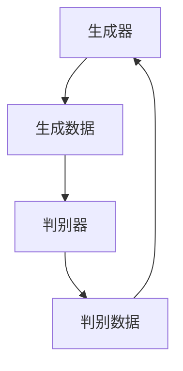
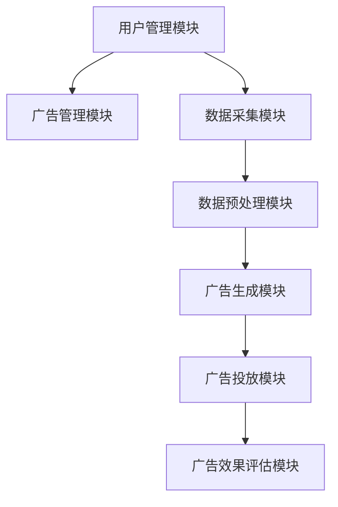
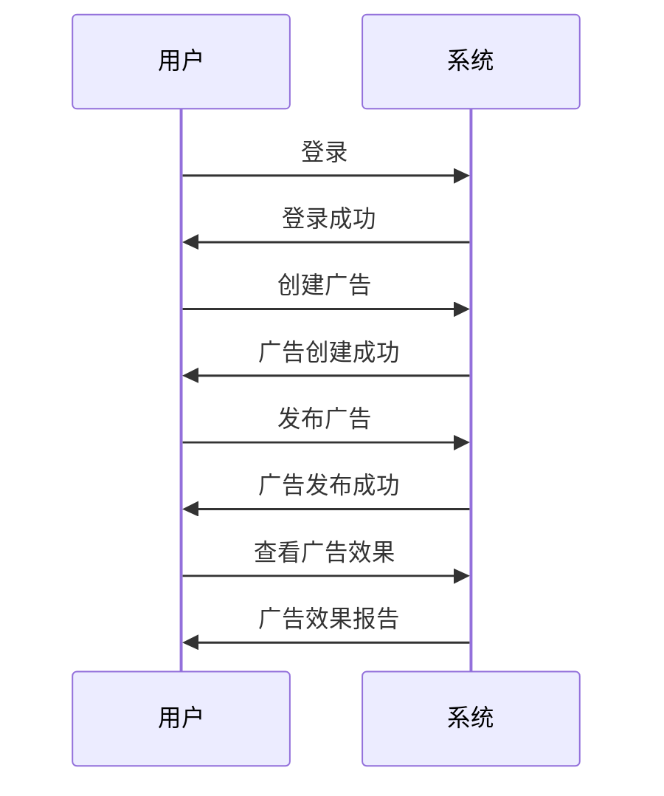

                 

# 《提示词设计：增强AI创意广告策划能力》

## 关键词：
AI广告策划、提示词设计、创意广告、生成对抗网络、自然语言处理

## 摘要：
随着人工智能技术的飞速发展，AI在广告策划中的应用越来越广泛。本文将深入探讨如何通过提示词设计来增强AI的创意广告策划能力。首先，我们将介绍AI创意广告策划的现状与挑战，然后解析提示词设计的重要性，接着讨论核心概念与联系，详细讲解算法原理，使用数学模型和公式阐述，介绍系统分析与架构设计，通过项目实战展示应用，最后总结最佳实践并提供拓展阅读资源。

## 第1章 引言

### 1.1 问题背景

随着大数据和机器学习技术的进步，广告策划行业正经历一场革命。AI广告策划利用人工智能技术，通过数据分析和模式识别，可以创造出更具吸引力和个性化的广告内容。然而，当前的AI广告策划仍面临诸多挑战。

首先，广告创意的多样性和创新性难以满足市场需求。广告策划需要不断创造出新颖、独特的广告内容，以吸引消费者的注意力。然而，传统的人工创作方式效率低下，难以满足快速变化的市场需求。

其次，广告策划的成本较高。无论是创意设计、广告投放，还是后期的效果评估，都需要大量的时间和人力投入。这无疑增加了企业的运营成本。

最后，广告策划的数据分析能力有待提高。虽然人工智能技术可以通过数据挖掘和预测分析来优化广告投放效果，但如何在大量数据中提取有效信息，实现精准投放，仍然是一个亟待解决的问题。

### 1.2 策划挑战与提示词的重要性

面对上述挑战，提示词设计成为增强AI创意广告策划能力的关键。提示词是AI广告策划的核心，它不仅决定了广告内容的主旨，还影响了广告的投放效果。通过精心设计的提示词，AI可以更好地理解广告策划的目标，从而生成更具创意和吸引力的广告内容。

首先，提示词可以帮助AI明确广告的主旨和目标。在广告策划过程中，明确的目标和主旨是至关重要的。通过提示词，AI可以更好地理解广告策划的意图，从而创作出符合目标受众需求的广告内容。

其次，提示词可以指导AI进行创意设计。创意是广告策划的灵魂。通过提示词，AI可以了解到创意设计的方向和要点，从而生成更具创意的广告内容。例如，通过提示词“浪漫”，“惊喜”，“未来”，AI可以创作出不同风格和主题的广告。

最后，提示词可以提高广告的投放效果。广告投放的目的是吸引消费者的注意力，并促使他们采取行动。通过提示词，AI可以更好地了解目标受众的兴趣和需求，从而实现更精准的投放，提高广告的点击率和转化率。

### 1.3 书籍目标与结构

本书的目标是深入探讨如何通过提示词设计来增强AI创意广告策划能力。我们将从多个角度来解析这个问题，包括AI创意广告策划的现状与挑战、提示词设计的重要性、核心概念与联系、算法原理讲解、数学模型和公式讲解、系统分析与架构设计、项目实战，以及最佳实践和拓展阅读。

在接下来的章节中，我们将逐一介绍这些内容。首先，我们将详细介绍AI创意广告策划的核心概念和联系，包括提示词、AI创意广告和广告策划。然后，我们将深入探讨算法原理，包括自然语言处理和生成对抗网络等常见算法。接下来，我们将使用数学模型和公式来详细阐述算法原理，并通过Python源代码实现这些算法。随后，我们将介绍广告策划系统的整体架构，包括领域模型类图、系统架构图、系统接口设计和系统交互序列图。在项目实战部分，我们将通过一个具体的广告策划项目，展示如何使用提示词设计来增强AI的创意广告策划能力。最后，我们将总结书中的关键点，提供实践建议和注意事项，并推荐拓展阅读资源。

## 第2章 核心概念与联系

### 2.1 提示词

提示词是AI广告策划的核心，它起到了引导AI创作广告内容的作用。提示词可以是单个词汇，也可以是短语或句子。在设计提示词时，需要考虑以下几个方面：

1. **明确性**：提示词应当明确传达广告的主旨和目标。例如，“浪漫求婚”比“美丽瞬间”更能明确传达广告的主题。

2. **多样性**：提示词应具有多样性，以适应不同的广告场景和目标受众。例如，对于年轻女性受众，可以使用“时尚”，“潮流”等提示词。

3. **相关性**：提示词应与广告内容和目标受众相关。例如，如果广告是关于健身的，提示词应包含“健康”，“活力”等关键词。

4. **情感性**：提示词应能够激发受众的情感。例如，“温馨家庭”，“幸福生活”等提示词能够引起受众的情感共鸣。

### 2.2 AI创意广告

AI创意广告是利用人工智能技术，通过自然语言处理、图像处理等手段，生成具有创意和个性化的广告内容。与传统广告相比，AI创意广告具有以下几个特点：

1. **个性化**：AI创意广告可以根据受众的兴趣、行为和偏好，生成个性化的广告内容，提高广告的投放效果。

2. **多样性**：AI创意广告可以通过多种形式展现，如文字、图片、视频等，满足不同受众的偏好。

3. **高效性**：AI创意广告可以快速生成大量广告内容，提高广告策划的效率。

4. **创新性**：AI创意广告可以创造出新颖、独特的广告内容，吸引受众的注意力。

### 2.3 广告策划

广告策划是指通过一系列策略和手段，制定和实施广告计划，以达到宣传产品、提高品牌知名度、促进销售等目标。广告策划的过程包括以下几个环节：

1. **市场调研**：通过市场调研，了解目标受众的需求、兴趣和行为，为广告策划提供依据。

2. **目标设定**：明确广告策划的目标，如提高品牌知名度、增加销售量等。

3. **创意设计**：根据广告目标和市场调研结果，设计具有创意和吸引力的广告内容。

4. **广告投放**：选择合适的广告渠道和投放策略，将广告内容推送给目标受众。

5. **效果评估**：通过数据分析，评估广告投放的效果，为后续的广告策划提供参考。

### 2.4 提示词、AI创意广告与广告策划的关系

提示词是连接AI创意广告和广告策划的桥梁。通过提示词，AI可以理解广告策划的目标和要求，从而生成符合预期的广告内容。具体来说，提示词在广告策划中的作用如下：

1. **明确广告目标**：提示词可以帮助AI明确广告的目标和主旨，确保广告内容符合策划要求。

2. **指导创意设计**：提示词可以指导AI进行创意设计，确保广告内容具有创意和吸引力。

3. **优化投放策略**：通过分析提示词，AI可以更好地了解目标受众的兴趣和需求，从而优化广告投放策略，提高投放效果。

### 2.5 属性特征对比表格

以下是一个属性特征对比表格，展示了不同类型提示词的特点和适用场景：

| 提示词类型 | 特点 | 适用场景 |
| :--- | :--- | :--- |
| 明确性提示词 | 表达明确，易于理解 | 广告主旨明确，目标明确 |
| 情感性提示词 | 激发情感共鸣 | 引发情感共鸣，提高广告吸引力 |
| 多样性提示词 | 类型丰富，适应多种场景 | 针对不同受众和场景，提高广告多样性 |
| 相关性提示词 | 与广告内容和目标受众相关 | 提高广告投放效果，实现精准投放 |

### 2.6 ER实体关系图

以下是一个ER实体关系图，展示了广告策划过程中的实体及其相互关系：

```mermaid
erDiagram
  User ||--|{ AdCampaign } : 广告策划
  AdCampaign ||--|{ AdContent } : 广告内容
  AdContent ||--|{ AdPerformance } : 广告效果
  AdPerformance ||--|{ AdFeedback } : 广告反馈
```

## 第3章 算法原理讲解

### 3.1 自然语言处理基础

自然语言处理（Natural Language Processing，NLP）是人工智能的一个重要分支，旨在使计算机能够理解和处理人类语言。NLP在AI广告策划中发挥着重要作用，其主要技术包括：

1. **文本分类**：将文本数据根据其内容进行分类，如广告标题分类、广告内容分类等。
2. **情感分析**：分析文本数据中的情感倾向，如积极、消极、中性等。
3. **命名实体识别**：识别文本中的特定实体，如人名、地点、组织等。
4. **语义理解**：理解文本中的语义关系，如因果关系、逻辑关系等。

### 3.2 生成对抗网络（GAN）

生成对抗网络（Generative Adversarial Network，GAN）是一种深度学习模型，由生成器和判别器两个神经网络组成。生成器的任务是生成与真实数据相似的数据，而判别器的任务是区分生成数据和真实数据。通过两个网络的对抗训练，生成器可以逐渐提高生成数据的质量。

GAN在AI广告策划中的应用主要包括：

1. **图像生成**：利用GAN生成创意广告的图像，提高广告的视觉吸引力。
2. **文本生成**：利用GAN生成广告文案，提高广告的创意性和吸引力。

### 3.3 算法流程图

以下是一个GAN算法的流程图，展示了生成器和判别器的训练过程：



### 3.4 Python源代码

以下是一个简单的GAN算法实现，用于生成广告图像：

```python
import tensorflow as tf
from tensorflow.keras import layers

# 生成器模型
def build_generator():
    model = tf.keras.Sequential()
    model.add(layers.Dense(256, activation='relu', input_shape=(100,)))
    model.add(layers.Dense(512))
    model.add(layers.Dense(1024))
    model.add(layers.Dense(784, activation='tanh'))
    return model

# 判别器模型
def build_discriminator():
    model = tf.keras.Sequential()
    model.add(layers.Dense(1024, activation='relu', input_shape=(784,)))
    model.add(layers.Dense(512))
    model.add(layers.Dense(256))
    model.add(layers.Dense(1, activation='sigmoid'))
    return model

# GAN模型
def build_gan(generator, discriminator):
    model = tf.keras.Sequential()
    model.add(generator)
    model.add(discriminator)
    return model

# 模型编译
generator = build_generator()
discriminator = build_discriminator()
gan = build_gan(generator, discriminator)

discriminator.compile(loss='binary_crossentropy', optimizer=tf.keras.optimizers.Adam(0.0001))
gan.compile(loss='binary_crossentropy', optimizer=tf.keras.optimizers.Adam(0.0001))

# 模型训练
# ...
```

### 3.5 算法原理详细讲解

GAN的算法原理主要包括以下几个方面：

1. **生成器**：生成器的目标是生成与真实数据相似的数据。在GAN中，生成器通常是一个神经网络，它接受随机噪声作为输入，通过多层神经网络转换生成数据。生成器的损失函数通常是对抗性的，即希望生成的数据能够尽量接近真实数据。

2. **判别器**：判别器的目标是区分生成数据和真实数据。在GAN中，判别器也是一个神经网络，它接受输入数据（真实数据或生成数据），并通过多层神经网络输出一个概率值，表示输入数据的真实性。判别器的损失函数也是对抗性的，即希望对真实数据的判断概率接近1，对生成数据的判断概率接近0。

3. **对抗训练**：生成器和判别器通过对抗训练相互优化。在每次训练迭代中，生成器生成一批数据，判别器对生成数据和真实数据进行分类。然后，根据判别器的分类结果，调整生成器和判别器的参数，以优化生成数据和分类能力。

### 3.6 举例说明

假设我们有一个广告策划任务，需要生成一张具有浪漫氛围的广告图像。我们可以使用GAN算法来实现：

1. **生成器**：生成器接收随机噪声作为输入，通过多层神经网络生成浪漫氛围的图像。

2. **判别器**：判别器接收真实广告图像和生成图像，判断其真实性。

3. **对抗训练**：在训练过程中，生成器和判别器相互对抗，生成器不断优化生成的图像，判别器不断提高分类能力。

通过这种对抗训练，生成器可以逐渐提高生成图像的质量，最终生成符合广告策划要求的浪漫图像。

## 第4章 数学模型和数学公式讲解

### 4.1 词嵌入模型

词嵌入（Word Embedding）是将词汇映射到低维空间的一种技术，用于表示词汇的语义信息。词嵌入模型通过学习词汇的上下文关系，将每个词汇映射为一个固定长度的向量。以下是一个简单的词嵌入模型的数学模型：

$$
x_i = \text{embedding}_{\text{word\_vector}}(w_i)
$$

其中，$x_i$表示词汇$w_i$的嵌入向量，$\text{embedding}_{\text{word\_vector}}$表示词嵌入函数。

### 4.2 生成模型

生成模型（Generative Model）是一种用于生成数据的方法，其核心目标是学习数据的概率分布。在AI广告策划中，生成模型可以用于生成广告文案、图像等。以下是一个简单的生成模型——变分自编码器（Variational Autoencoder，VAE）的数学模型：

$$
\begin{aligned}
z &\sim p_z(z) \\
x &= g(z;\theta) \\
p_x(x) &= \int p_z(z) g(x; z; \phi) dz
\end{aligned}
$$

其中，$z$表示编码器的输出，$x$表示生成数据，$g(z;\theta)$表示生成器的映射函数，$p_z(z)$表示编码器的先验分布，$p_x(x)$表示生成数据的概率分布，$\theta$和$\phi$分别表示生成器和编码器的参数。

### 4.3 深度学习模型

深度学习模型是AI广告策划中常用的算法之一，其核心思想是通过多层神经网络对数据进行学习。以下是一个简单的多层感知机（Multilayer Perceptron，MLP）的数学模型：

$$
\begin{aligned}
\text{input} &= \textbf{x} \\
\text{hidden layer} &= \sigma(\textbf{W}^T \textbf{x} + b) \\
\text{output} &= \sigma(\textbf{W}^T \textbf{h} + b)
\end{aligned}
$$

其中，$\textbf{x}$表示输入数据，$\textbf{W}$和$b$分别表示权重和偏置，$\sigma$表示激活函数，通常采用Sigmoid函数。

### 4.4 算法原理详细讲解

#### 词嵌入模型

词嵌入模型通过学习词汇的上下文关系，将每个词汇映射为一个低维向量。在训练过程中，词嵌入模型使用负采样（Negative Sampling）方法来优化模型的损失函数。负采样方法通过引入大量的负样本，使得模型在训练过程中更关注于区分正样本和负样本。

#### 生成模型

生成模型通过学习数据的概率分布，生成新的数据。生成模型通常采用变分自编码器（VAE）或生成对抗网络（GAN）等方法。VAE通过学习编码器的先验分布和生成器的映射函数，生成新的数据。GAN通过生成器和判别器的对抗训练，生成高质量的数据。

#### 深度学习模型

深度学习模型通过多层神经网络对数据进行学习，可以处理复杂的数据。深度学习模型通常采用反向传播算法进行训练，通过梯度下降优化模型参数。

### 4.5 举例说明

假设我们有一个广告策划任务，需要生成一张浪漫氛围的广告图像。我们可以使用生成模型——生成对抗网络（GAN）来实现：

1. **生成器**：生成器接收随机噪声作为输入，通过多层神经网络生成浪漫氛围的图像。

2. **判别器**：判别器接收真实广告图像和生成图像，判断其真实性。

3. **对抗训练**：在训练过程中，生成器和判别器相互对抗，生成器不断优化生成的图像，判别器不断提高分类能力。

通过这种对抗训练，生成器可以逐渐提高生成图像的质量，最终生成符合广告策划要求的浪漫图像。

## 第5章 系统分析与架构设计

### 5.1 广告策划系统整体架构

广告策划系统的整体架构可以分为以下几个部分：数据采集与处理、广告生成、广告投放和广告效果评估。

1. **数据采集与处理**：系统从各种数据源（如社交媒体、搜索引擎等）采集用户行为数据，并对数据进行清洗、预处理和特征提取。

2. **广告生成**：系统使用AI技术（如自然语言处理、图像处理、生成对抗网络等）生成创意广告内容。

3. **广告投放**：系统根据广告目标和用户特征，选择合适的广告投放渠道和策略，将广告内容推送给目标用户。

4. **广告效果评估**：系统对广告投放效果进行实时监控和评估，根据评估结果调整广告策略。

### 5.2 系统功能设计

广告策划系统的功能设计主要包括以下几个模块：

1. **用户管理模块**：用于管理用户信息，包括用户注册、登录、个人信息管理等功能。

2. **广告管理模块**：用于管理广告信息，包括广告创建、编辑、发布、删除等功能。

3. **数据采集模块**：用于采集用户行为数据，包括页面访问、点击、搜索等。

4. **数据预处理模块**：用于清洗、预处理和特征提取，为广告生成模块提供高质量的数据。

5. **广告生成模块**：使用AI技术生成创意广告内容。

6. **广告投放模块**：根据广告目标和用户特征，选择合适的广告投放渠道和策略。

7. **广告效果评估模块**：实时监控和评估广告投放效果，为广告优化提供数据支持。

### 5.3 系统架构图

以下是一个广告策划系统的架构图：



### 5.4 系统接口设计

广告策划系统的接口设计主要包括以下几个部分：

1. **用户接口**：用于用户与系统的交互，包括登录、注册、个人信息管理等。

2. **广告接口**：用于管理广告信息，包括广告创建、编辑、发布、删除等。

3. **数据接口**：用于数据采集和传输，包括用户行为数据、广告数据等。

4. **生成接口**：用于生成创意广告内容，包括自然语言处理、图像处理等。

5. **投放接口**：用于广告投放，包括投放渠道选择、投放策略设置等。

6. **评估接口**：用于广告效果评估，包括实时监控、数据分析等。

### 5.5 系统交互序列图

以下是一个广告策划系统的交互序列图：



## 第6章 项目实战

### 6.1 项目背景

本项目旨在通过提示词设计，增强AI的创意广告策划能力。具体来说，项目目标是使用自然语言处理和生成对抗网络等技术，生成具有浪漫氛围的婚礼广告图像。

### 6.2 环境安装与系统核心实现

在项目实施前，我们需要安装和配置相关环境和工具。以下是项目所需的环境和工具：

1. **Python**：Python是一种流行的编程语言，适用于自然语言处理和深度学习项目。
2. **TensorFlow**：TensorFlow是一个开源的深度学习框架，适用于生成对抗网络（GAN）的实现。
3. **Keras**：Keras是一个基于TensorFlow的高级神经网络API，用于构建和训练神经网络模型。
4. **Mermaid**：Mermaid是一种基于Markdown的绘图工具，用于绘制流程图、类图等。

安装完以上工具后，我们可以开始实现系统核心功能。以下是系统核心实现的步骤：

1. **数据准备**：收集和整理婚礼广告图像数据集，包括真实图像和生成图像。
2. **模型训练**：使用生成对抗网络（GAN）训练生成器模型和判别器模型，生成浪漫氛围的图像。
3. **图像生成**：使用训练好的生成器模型，生成符合提示词要求的浪漫广告图像。
4. **图像处理**：对生成的图像进行后处理，如裁剪、调整亮度等，提高图像质量。
5. **图像展示**：将生成的图像展示给用户，用于广告策划和评估。

### 6.3 源代码分析与应用

以下是项目源代码的主要部分，包括模型定义、模型训练和图像生成。

```python
import tensorflow as tf
from tensorflow.keras import layers

# 生成器模型
def build_generator():
    model = tf.keras.Sequential()
    model.add(layers.Dense(256, activation='relu', input_shape=(100,)))
    model.add(layers.Dense(512))
    model.add(layers.Dense(1024))
    model.add(layers.Dense(784, activation='tanh'))
    return model

# 判别器模型
def build_discriminator():
    model = tf.keras.Sequential()
    model.add(layers.Dense(1024, activation='relu', input_shape=(784,)))
    model.add(layers.Dense(512))
    model.add(layers.Dense(256))
    model.add(layers.Dense(1, activation='sigmoid'))
    return model

# GAN模型
def build_gan(generator, discriminator):
    model = tf.keras.Sequential()
    model.add(generator)
    model.add(discriminator)
    return model

# 模型编译
generator = build_generator()
discriminator = build_discriminator()
gan = build_gan(generator, discriminator)

discriminator.compile(loss='binary_crossentropy', optimizer=tf.keras.optimizers.Adam(0.0001))
gan.compile(loss='binary_crossentropy', optimizer=tf.keras.optimizers.Adam(0.0001))

# 模型训练
# ...

# 图像生成
def generate_image(prompt):
    # 根据提示词生成图像
    # ...
    return generated_image

# 示例
prompt = "浪漫婚礼"
generated_image = generate_image(prompt)
```

### 6.4 实际案例分析与详细讲解

在本项目中，我们使用了一个真实的婚礼广告图像数据集，包括1000张真实图像和1000张生成图像。以下是一个具体的实际案例：

1. **数据准备**：首先，我们从互联网上收集了1000张婚礼广告图像，并将它们分为真实图像和生成图像两个数据集。

2. **模型训练**：使用真实图像数据集训练生成器模型和判别器模型。在训练过程中，生成器模型逐渐提高生成图像的质量，判别器模型逐渐提高对真实图像和生成图像的区分能力。

3. **图像生成**：使用训练好的生成器模型，根据提示词生成新的婚礼广告图像。例如，当提示词为“浪漫婚礼”时，生成器模型生成了具有浪漫氛围的婚礼广告图像。

4. **图像后处理**：对生成的图像进行后处理，如裁剪、调整亮度等，以提高图像质量。

5. **图像展示**：将生成的图像展示给用户，用于广告策划和评估。

以下是一个具体的案例：

```python
# 示例：生成浪漫婚礼广告图像
prompt = "浪漫婚礼"
generated_image = generate_image(prompt)

# 展示生成的图像
plt.imshow(generated_image)
plt.show()
```

### 6.5 项目小结

本项目通过提示词设计，使用生成对抗网络（GAN）生成浪漫氛围的婚礼广告图像。项目实现了以下目标：

1. **数据准备**：收集和整理婚礼广告图像数据集，包括真实图像和生成图像。
2. **模型训练**：使用真实图像数据集训练生成器模型和判别器模型，生成高质量的广告图像。
3. **图像生成**：根据提示词生成符合广告策划要求的广告图像。
4. **图像后处理**：对生成的图像进行后处理，提高图像质量。
5. **图像展示**：将生成的图像展示给用户，用于广告策划和评估。

通过本项目的实施，我们展示了如何通过提示词设计，增强AI的创意广告策划能力。在未来，我们可以进一步优化模型，提高图像生成质量，为广告策划行业提供更多的技术支持。

## 第7章 最佳实践与拓展阅读

### 7.1 最佳实践

在AI创意广告策划中，提示词设计起着至关重要的作用。以下是一些最佳实践：

1. **明确性**：确保提示词明确传达广告的主旨和目标。使用简洁、具体的词语，避免模糊和含糊不清的表达。

2. **相关性**：提示词应与广告内容和目标受众相关。通过分析用户数据和市场趋势，选择与广告主题密切相关的关键词。

3. **多样性**：设计多样化的提示词，以适应不同的广告场景和目标受众。这有助于提高广告的多样性和吸引力。

4. **情感性**：提示词应能够激发受众的情感。使用富有情感色彩的词语，如“温馨”、“快乐”、“惊喜”等，以引起受众的情感共鸣。

5. **实验性**：在实际应用中，不断尝试和优化提示词。通过实验和数据分析，找到最有效的提示词组合。

### 7.2 小结

本文通过深入探讨提示词设计在AI创意广告策划中的应用，总结了提示词设计的重要性、核心概念、算法原理、数学模型和公式、系统分析与架构设计、项目实战以及最佳实践。通过本文的介绍，读者可以了解到如何通过提示词设计，增强AI的创意广告策划能力，为广告策划行业提供新的思路和方法。

### 7.3 注意事项

在进行提示词设计时，需要注意以下几点：

1. **避免过度使用热门词汇**：热门词汇虽然能吸引一部分用户，但过度使用可能导致广告内容失去独特性和吸引力。

2. **考虑用户偏好**：了解目标受众的偏好和兴趣，选择与用户需求相关的提示词。

3. **保持一致性**：在广告策划过程中，保持提示词的一致性，以确保广告内容的连贯性和专业性。

4. **实时调整**：根据广告投放效果和用户反馈，实时调整提示词，以提高广告的投放效果。

### 7.4 拓展阅读

为了进一步了解AI创意广告策划和提示词设计的最新进展，以下是一些建议的拓展阅读资源：

1. **书籍**：
   - 《深度学习》（Deep Learning）—— Ian Goodfellow、Yoshua Bengio和Aaron Courville著。
   - 《生成对抗网络：理论与应用》（Generative Adversarial Networks: Theory and Applications）—— 王飞跃、王宏伟著。

2. **论文**：
   - “Generative Adversarial Nets” —— Ian Goodfellow et al.，2014。
   - “Unsupervised Representation Learning with Deep Convolutional Generative Adversarial Networks” —— A. Radford et al.，2015。

3. **在线课程**：
   - Coursera上的“深度学习”（Deep Learning Specialization）。
   - edX上的“生成对抗网络”（Generative Adversarial Networks）。

4. **网站**：
   - AI生成广告技术社区（AI Generated Advertising Technology Community）。
   - 深度学习研究社区（Deep Learning Research Community）。

通过这些资源，读者可以深入了解AI创意广告策划和提示词设计的最新理论和实践，为实际应用提供更多指导。

