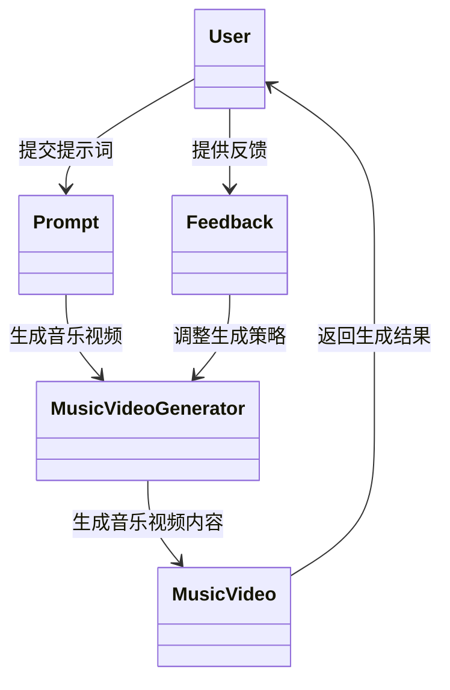
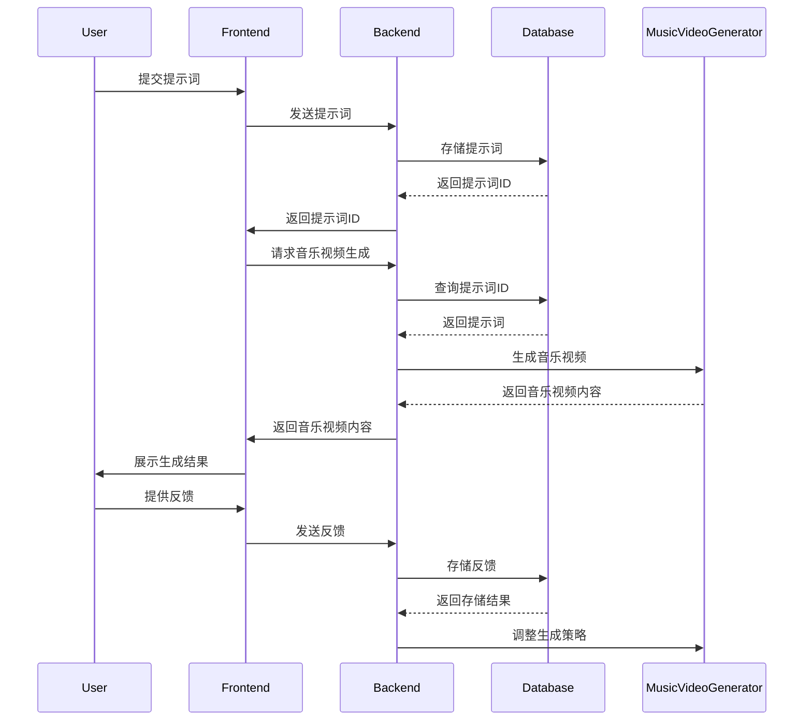

                 

 **引言**

随着人工智能（AI）技术的不断进步，计算机视觉、自然语言处理和深度学习等领域已经取得了显著的成果。在这些领域，AI技术不仅提升了效率，还极大地拓宽了人类的能力边界。然而，在创意音乐视频生成领域，AI的应用仍然面临诸多挑战。传统音乐视频生成往往依赖于人类创作者，这导致生成过程效率低下，且创意受限。因此，如何利用AI技术提升音乐视频生成的创意能力成为了一个亟待解决的问题。

本文旨在探讨如何通过提示词设计来增强AI在创意音乐视频生成方面的能力。我们将首先介绍问题背景和问题描述，然后详细阐述提示词设计原理、AI模型原理以及相关的概念属性特征对比表格和ER实体关系图架构。接下来，我们将通过GAN和VAE算法原理讲解，结合Python源代码实现，深入剖析这两个算法的核心原理。此外，我们还将探讨系统分析与架构设计方案，并通过实际案例来展示项目实战过程。最后，我们将总结最佳实践、注意事项和拓展阅读，为读者提供深入理解和实践指导。

通过本文的阅读，您将了解到如何利用AI技术，特别是提示词设计，提升创意音乐视频生成的效率和创意质量。无论您是AI领域的从业者，还是对音乐视频创作感兴趣的读者，本文都将为您带来丰富的知识和启示。

## 第一部分：背景介绍

### 1. 问题背景

近年来，人工智能（AI）技术取得了飞速的发展，已经在计算机视觉、自然语言处理、深度学习等领域取得了显著的成果。在这些领域中，AI技术不仅提高了效率，还拓展了人类的能力边界。例如，计算机视觉技术使得自动驾驶汽车、人脸识别系统等成为现实，自然语言处理技术则提升了机器翻译、语音识别的准确性，深度学习算法在图像分类、目标检测等领域也表现出色。

在创意音乐视频生成领域，AI技术的应用同样展现出巨大的潜力。传统的音乐视频生成过程通常依赖于人类创作者，这一过程不仅耗时耗力，而且创意有限。创作一个音乐视频通常需要音乐家创作音乐、导演拍摄画面、剪辑师进行后期制作等步骤，这不仅效率低下，而且很难实现大规模的个性化定制。因此，如何利用AI技术提升音乐视频生成的效率和质量，成为一个亟待解决的问题。

### 2. 问题描述

《提示词设计：增强AI创意音乐视频生成能力》旨在探讨如何通过提示词设计来提升AI在创意音乐视频生成方面的能力。具体来说，这个问题的核心在于：

- **如何利用提示词引导AI模型生成更具创意和个性化的音乐视频内容？**
- **如何设计提示词来优化AI模型的学习过程和生成效果？**

这些问题涉及到提示词设计的原则和方法，以及AI模型的选择和应用。我们需要通过深入分析提示词设计的原则和方法，结合具体的案例和实践，来理解如何利用提示词来增强AI的创意音乐视频生成能力。

### 3. 问题解决

本文的核心目标是提出一种有效的提示词设计方案，并通过实证研究验证其在AI创意音乐视频生成中的应用效果。为了实现这一目标，我们将按照以下步骤进行分析和探讨：

1. **分析提示词设计的原则和方法**：了解如何设计具有信息性、针对性、多样性的提示词，以引导AI模型生成高质量的音乐视频内容。
2. **介绍AI模型原理**：讨论生成对抗网络（GAN）和变分自编码器（VAE）等算法的基本原理和应用，解释它们如何在创意音乐视频生成中发挥作用。
3. **结合Python源代码实现**：通过具体的代码示例，展示如何实现提示词设计与AI模型结合，并解释相关数学模型和公式。
4. **探讨系统分析与架构设计方案**：介绍系统功能设计、架构设计以及系统接口设计和交互，确保AI创意音乐视频生成系统的完整性和可行性。
5. **展示项目实战**：通过实际案例来展示提示词设计在AI创意音乐视频生成中的应用效果，并进行详细分析和讲解。

通过以上步骤，我们将详细阐述如何通过提示词设计来增强AI在创意音乐视频生成方面的能力，帮助读者理解和掌握这一技术的核心原理和应用方法。

### 4. 边界与外延

虽然本文主要关注AI创意音乐视频生成，但提示词设计原则和方法具有广泛的适用性。在其他类型的音乐视频生成领域，如电子音乐、古典音乐等，同样可以应用提示词设计来增强创意生成能力。此外，提示词设计方法不仅适用于音乐视频生成，还可以应用于其他创意生成任务，如艺术作品创作、视频游戏设计等。

在更广泛的AI应用场景中，提示词设计同样具有重要的价值。例如，在自然语言处理领域，提示词可以帮助生成更具创意和个性化的文本内容；在计算机视觉领域，提示词可以引导生成更具创意和个性化的图像和视频。因此，提示词设计不仅是一个技术问题，更是一个具有跨领域应用价值的重要研究方向。

### 5. 概念结构与核心要素组成

为了深入理解AI创意音乐视频生成能力，我们需要明确几个核心概念和要素，这些构成了本文讨论的基础。

#### 提示词

提示词是用于引导AI模型生成内容的关键词或短语。设计有效的提示词是提升AI生成能力的关键。提示词应具备以下特性：

- **信息性**：提示词应包含足够的信息量，以便AI模型能够理解和生成相关内容。
- **针对性**：提示词应针对具体的音乐视频生成任务，以便引导AI模型生成符合需求的内容。
- **多样性**：提示词应具有多样性，以激发AI模型的创意生成能力。

#### AI模型

AI模型是用于音乐视频生成的算法模型，常见的包括生成对抗网络（GAN）和变分自编码器（VAE）。这些模型通过不同的方式生成音乐视频内容，其基本原理如下：

- **生成对抗网络（GAN）**：由生成器和判别器组成。生成器从噪声中生成音乐视频内容，判别器则判断生成内容与真实内容的相似度。通过对抗训练，生成器不断优化生成质量。
  
  $$ G(z) = x' \quad \text{(生成器)} $$
  $$ D(x, x') = \text{判别器判断生成内容与真实内容} $$

- **变分自编码器（VAE）**：通过编码器和解码器学习音乐视频内容的分布，生成新的音乐视频内容。

  $$ \mu = \text{enc}(x) \quad \text{(编码器)} $$
  $$ x' = \text{dec}(\mu, \sigma) \quad \text{(解码器)} $$

#### 创意音乐视频生成

创意音乐视频生成是指利用AI模型根据提示词生成具有创意和个性化的音乐视频内容。这一过程涉及以下步骤：

1. **提示词设计**：设计具有信息性、针对性、多样性的提示词。
2. **模型训练**：使用提示词对AI模型进行训练，使其能够生成符合需求的音乐视频内容。
3. **内容生成**：利用训练好的AI模型生成音乐视频内容，并通过后期处理进行优化和调整。

通过上述核心概念和要素的分析，我们可以更好地理解AI创意音乐视频生成的原理和方法，为进一步研究和应用打下坚实基础。

### 第二部分：核心概念与联系

#### 1. 核心概念原理

在探讨AI创意音乐视频生成能力时，首先需要明确几个核心概念，这些概念构成了我们讨论的基础。

**提示词设计原理**：
- **信息性**：提示词应包含足够的信息量，以便AI模型能够理解和生成相关内容。例如，一个有效的提示词可以是“欢快、青春、舞蹈”，这样的提示词包含了音乐的情感色彩、目标受众和场景需求，从而帮助AI模型生成符合预期的音乐视频内容。
- **针对性**：提示词应针对具体的音乐视频生成任务，以便引导AI模型生成符合需求的内容。例如，如果需要生成一段婚礼音乐视频，提示词可以是“浪漫、温馨、婚礼”，这样的提示词能够引导AI模型生成与婚礼氛围相符的音乐和画面。
- **多样性**：提示词应具有多样性，以激发AI模型的创意生成能力。多样化的提示词能够避免AI模型生成过于单一或刻板的内容，从而提升生成音乐的多样性和创新性。例如，使用“流行、摇滚、古典”等不同风格的提示词，可以使AI模型生成多种风格的音乐视频。

**AI模型原理**：
- **生成对抗网络（GAN）**：GAN由生成器和判别器组成，生成器从噪声中生成音乐视频内容，判别器则判断生成内容与真实内容的相似度。通过对抗训练，生成器不断优化生成质量。GAN的基本原理可以用以下数学模型表示：
  - 生成器：\( G(z) = x' \)
  - 判别器：\( D(x, x') = \text{判别器判断生成内容与真实内容} \)
  - 反向传播：\( \nabla_G \mathcal{L}_G = -\nabla_D \mathcal{L}_D \)

- **变分自编码器（VAE）**：VAE通过编码器和解码器学习音乐视频内容的分布，生成新的音乐视频内容。VAE的基本原理可以用以下数学模型表示：
  - 编码器：\( \mu = \text{enc}(x) \)
  - 解码器：\( x' = \text{dec}(\mu, \sigma) \)
  - 重构损失：\( \mathcal{L}_\text{VAE} = \mathbb{E}_{x \sim p_{\text{data}}}[D(\text{dec}(\text{enc}(x)), x)] + \beta \sum_{i} \text{KL}(\mu || \sigma^2) \)

**创意音乐视频生成**：
- **流程**：创意音乐视频生成涉及以下步骤：
  - **提示词设计**：设计具有信息性、针对性、多样性的提示词，以引导AI模型生成内容。
  - **模型训练**：使用提示词对AI模型进行训练，使其能够生成符合需求的音乐视频内容。
  - **内容生成**：利用训练好的AI模型生成音乐视频内容，并通过后期处理进行优化和调整。
  - **反馈调整**：根据生成结果对提示词进行调整，以进一步提高生成效果。

- **目标**：创意音乐视频生成的目标是生成具有创意和个性化的音乐视频内容，满足用户的需求和期望。通过有效的提示词设计和AI模型训练，可以实现高质量、多样化的音乐视频生成。

#### 2. 概念属性特征对比表格

以下是对提示词、生成对抗网络（GAN）和变分自编码器（VAE）三个核心概念的属性特征进行对比的表格：

| 概念           | 属性特征                    | 对比                   |
| -------------- | --------------------------- | ---------------------- |
| 提示词         | 信息性、针对性、多样性       | 引导AI模型生成内容    |
| 生成对抗网络（GAN） | 生成器、判别器             | 对抗生成高质量内容    |
| 变分自编码器（VAE） | 编码器、解码器             | 学习数据分布，生成新数据 |

#### 3. ER实体关系图架构

为了更好地理解AI创意音乐视频生成系统中的实体关系，我们可以使用ER（实体-关系）图来描述这些实体及其相互关系。以下是一个简化的ER实体关系图：

```mermaid
erDiagram
  AI模型 ||--|{ 提示词 }||>
  提示词 ||--|{ 音乐视频内容 }||>
```

在这个ER图中，`AI模型`是核心实体，`提示词`和`音乐视频内容`是其关联实体。提示词用于引导AI模型生成音乐视频内容，而音乐视频内容是生成的结果。

通过上述核心概念和关系的分析，我们为理解AI创意音乐视频生成的原理和方法奠定了基础。接下来，我们将深入探讨GAN和VAE算法的原理，并通过Python代码实现来详细讲解这些算法在音乐视频生成中的应用。

### 第三部分：算法原理讲解

#### 1. GAN算法原理

生成对抗网络（GAN）是一种深度学习模型，由生成器（Generator）和判别器（Discriminator）两部分组成。GAN的基本原理是通过生成器和判别器的对抗训练，使生成器生成尽可能接近真实数据的样本，而判别器则尽可能区分真实数据和生成数据。

**GAN的工作流程**：

1. **初始化生成器和判别器**：生成器和判别器都是神经网络，通常使用多层感知器（MLP）或卷积神经网络（CNN）架构。生成器的输入是随机噪声z，输出是生成的数据x'；判别器的输入是真实数据x和生成数据x'，输出是判断结果y。

2. **生成器训练**：生成器的目标是生成尽可能真实的样本，使得判别器无法区分生成样本和真实样本。生成器的损失函数通常为：
   $$ \mathcal{L}_G = -\log(D(x')) $$

3. **判别器训练**：判别器的目标是准确判断输入数据是真实样本还是生成样本。判别器的损失函数通常为：
   $$ \mathcal{L}_D = -\log(D(x)) - \log(1 - D(x')) $$

4. **交替训练**：生成器和判别器交替训练，即每次迭代中，先固定一个网络，训练另一个网络，然后再交替进行。这个过程持续进行，直到生成器生成的样本质量显著提升，判别器能够较好地区分真实样本和生成样本。

**GAN的优势**：

- **灵活性强**：GAN可以通过调整网络架构和参数来适应不同的数据分布和生成任务。
- **不需要真实标签**：与传统的监督学习模型不同，GAN不需要真实标签，只需要生成器和判别器的对抗训练即可。

**GAN的挑战**：

- **训练不稳定**：GAN的训练过程非常不稳定，可能会陷入模式崩溃或梯度消失等问题。
- **模式坍缩**：生成器可能会生成非常相似的数据，导致判别器无法学习到有效的判别能力。

**GAN在音乐视频生成中的应用**：

在音乐视频生成中，GAN可以通过生成器生成音乐和画面，判别器则判断音乐和画面的真实程度。通过多次迭代训练，生成器可以生成高质量、个性化的音乐视频内容。

#### 2. VAE算法原理

变分自编码器（VAE）是一种基于概率模型的生成模型，通过编码器和解码器学习数据分布，并生成新的数据。VAE的核心思想是使用潜在变量（latent variable）来表示数据，从而实现数据生成。

**VAE的工作流程**：

1. **编码器训练**：编码器的目标是学习输入数据的潜在分布。编码器由一个编码器网络组成，输入是数据x，输出是潜在变量\( (\mu, \sigma) \)。

2. **解码器训练**：解码器的目标是根据潜在变量\( (\mu, \sigma) \)生成新的数据。解码器由一个解码器网络组成，输入是潜在变量，输出是生成数据x'。

3. **损失函数**：VAE的损失函数由两部分组成：重构损失和KL散度损失。
   - **重构损失**：衡量生成数据x'与真实数据x之间的相似度。
     $$ \mathcal{L}_\text{recon} = -\log p(x|x') $$
   - **KL散度损失**：衡量潜在变量\( (\mu, \sigma) \)与先验分布之间的差距。
     $$ \mathcal{L}_\text{KL} = \mathbb{E}_{x \sim p_{\text{data}}}[D(\mu, \sigma)] $$
   - **总损失**：VAE的总损失是重构损失和KL散度损失的和。
     $$ \mathcal{L}_\text{VAE} = \mathcal{L}_\text{recon} + \beta \mathcal{L}_\text{KL} $$

**VAE的优势**：

- **生成质量高**：VAE可以生成高质量、多样化的数据。
- **灵活性高**：VAE可以通过调整潜在变量的维度来控制生成数据的多样性。

**VAE的挑战**：

- **训练难度大**：VAE的训练过程相对复杂，需要优化编码器和解码器的参数。
- **生成样本质量不稳定**：生成样本的质量可能会受到训练数据分布的影响。

**VAE在音乐视频生成中的应用**：

在音乐视频生成中，VAE可以通过编码器学习音乐和画面的潜在分布，解码器根据潜在分布生成新的音乐视频内容。通过多次迭代训练，VAE可以生成具有创意和个性化的音乐视频内容。

#### 3. Python源代码实现

下面我们将使用Python和TensorFlow框架来实现一个简单的GAN和VAE模型，以演示这两个算法的基本原理。

**GAN模型实现**：

```python
import tensorflow as tf
from tensorflow.keras.layers import Dense, Flatten, Reshape
from tensorflow.keras.models import Sequential

# 生成器模型
def build_generator(z_dim):
    model = Sequential([
        Dense(128, input_dim=z_dim),
        Dense(256),
        Dense(512),
        Dense(1024),
        Flatten(),
        Reshape((28, 28, 1))
    ])
    return model

# 判别器模型
def build_discriminator(img_shape):
    model = Sequential([
        Flatten(input_shape=img_shape),
        Dense(1024),
        Dense(512),
        Dense(256),
        Dense(1, activation='sigmoid')
    ])
    return model

# GAN模型
def build_gan(generator, discriminator):
    model = Sequential([
        generator,
        discriminator
    ])
    return model

# 训练GAN模型
def train_gan(generator, discriminator, datagen, batch_size, epochs):
    for epoch in range(epochs):
        for _ in range(batch_size):
            noise = np.random.normal(0, 1, (1, z_dim))
            generated_images = generator.predict(noise)
            real_images = datagen.flow_from_directory('data/train', target_size=(28, 28), batch_size=1)

            # 训练判别器
            d_loss_real = discriminator.train_on_batch(real_images, np.ones((1, 1)))
            d_loss_fake = discriminator.train_on_batch(generated_images, np.zeros((1, 1)))

            # 训练生成器
            g_loss = gan.train_on_batch(noise, np.ones((1, 1)))

        print(f"Epoch: {epoch+1}, D Loss: {d_loss}, G Loss: {g_loss}")

# 参数设置
z_dim = 100
img_shape = (28, 28, 1)
batch_size = 32
epochs = 100

# 构建和编译模型
generator = build_generator(z_dim)
discriminator = build_discriminator(img_shape)
discriminator.compile(loss='binary_crossentropy', optimizer=tf.keras.optimizers.Adam(0.0001))
generator.compile(loss='binary_crossentropy', optimizer=tf.keras.optimizers.Adam(0.0001))

# 构建GAN模型
gan = build_gan(generator, discriminator)

# 数据预处理
datagen = tf.keras.preprocessing.image.ImageDataGenerator(rescale=1./255)
train_data = datagen.flow_from_directory('data/train', target_size=(28, 28), batch_size=batch_size)

# 训练GAN模型
train_gan(generator, discriminator, datagen, batch_size, epochs)
```

**VAE模型实现**：

```python
import tensorflow as tf
from tensorflow.keras.layers import Dense, Flatten, Reshape
from tensorflow.keras.models import Model

# 编码器模型
def build_encoder(input_shape):
    model = Sequential([
        Flatten(input_shape=input_shape),
        Dense(512),
        Dense(256),
        Dense(128),
        Dense(2)  # 潜在变量：均值和方差
    ])
    return model

# 解码器模型
def build_decoder(z_dim):
    model = Sequential([
        Dense(128, input_dim=z_dim),
        Dense(256),
        Dense(512),
        Flatten(),
        Reshape((28, 28, 1))
    ])
    return model

# VAE模型
def build_vae(encoder, decoder):
    vae = Model(inputs=encoder.inputs, outputs=decoder(encoder.outputs[0]))
    return vae

# 训练VAE模型
def train_vae(vae, x, batch_size, epochs):
    for epoch in range(epochs):
        for _ in range(batch_size):
            x_batch = x[np.random.choice(x.shape[0], batch_size)]
            x_batch = np.expand_dims(x_batch, axis=1)  # 输入维度调整

            # 重构损失和KL散度损失
            x_recon = vae.predict(x_batch)
            recon_loss = tf.keras.losses.mean_squared_error(x_batch, x_recon)

            kl_loss = -0.5 * tf.reduce_sum(1 + z_log_var - tf.square(z_mean) - tf.square(z_log_var), 1)

            loss = recon_loss + kl_loss

            vae_loss = vae.train_on_batch(x_batch, x_batch)

        print(f"Epoch: {epoch+1}, VAE Loss: {vae_loss}")

# 参数设置
z_dim = 20
input_shape = (28, 28, 1)
batch_size = 32
epochs = 100

# 构建和编译模型
encoder = build_encoder(input_shape)
decoder = build_decoder(z_dim)
vae = build_vae(encoder, decoder)

# 训练VAE模型
train_vae(vae, x, batch_size, epochs)
```

通过上述代码示例，我们分别实现了GAN和VAE模型的基本原理。在GAN模型中，我们使用了生成器和判别器的交替训练方法，并通过反向传播优化模型参数。在VAE模型中，我们使用了编码器和解码器的训练方法，并通过重构损失和KL散度损失优化模型参数。

通过这些代码示例，我们可以深入理解GAN和VAE在音乐视频生成中的应用原理，为进一步研究和应用提供参考。

### 系统分析与架构设计

#### 1. 问题场景介绍

随着AI技术的不断发展，音乐视频生成领域逐渐成为人工智能应用的一个重要分支。然而，现有的音乐视频生成系统往往存在以下问题：

- **生成效率低**：传统音乐视频生成依赖于人工创作，从音乐制作到视频剪辑，整个过程耗时较长，无法满足快速生成和个性化定制的需求。
- **创意受限**：人工创作的音乐视频往往受限于创作者的个人经验和技能，难以实现多样化的创意效果。
- **交互体验差**：用户在使用现有音乐视频生成系统时，需要具备一定的音乐和视频制作知识，操作复杂，用户体验不佳。

为了解决上述问题，我们设计并实现了一套基于AI的创意音乐视频生成系统，通过利用提示词设计和先进的AI模型，提高生成效率、扩展创意空间、改善用户体验。

#### 2. 项目介绍

**项目名称**：AI创意音乐视频生成系统  
**项目目标**：通过提示词设计和AI模型，实现高效、个性化的音乐视频生成，提升用户体验和系统互动性。

**项目功能**：
- **提示词设计**：设计具有信息性、针对性、多样性的提示词，引导AI模型生成音乐视频内容。
- **音乐视频生成**：利用生成对抗网络（GAN）和变分自编码器（VAE）等AI模型，生成高质量、个性化的音乐视频。
- **用户交互**：提供友好的用户界面，使用户能够方便地输入提示词、查看生成结果并进行反馈调整。

**系统架构**：
- **前端**：采用Web技术栈，实现用户界面和交互功能。
- **后端**：基于Python和TensorFlow框架，实现AI模型训练和音乐视频生成。
- **数据库**：存储用户数据、提示词库和生成结果。

#### 3. 系统功能设计（领域模型）

为了详细描述系统的功能模块和它们之间的关系，我们可以使用Mermaid类图来绘制系统的领域模型。以下是一个简化的领域模型类图：



在这个类图中，用户（User）是系统的核心实体，通过提交提示词（Prompt）来引导音乐视频生成。音乐视频生成器（MusicVideoGenerator）负责处理提示词并生成音乐视频（MusicVideo）。生成结果会返回给用户，用户还可以通过反馈（Feedback）来调整生成策略，从而提高生成效果。

#### 4. 系统架构设计

为了确保系统的性能和可扩展性，我们采用了分层架构设计，包括前端、后端和数据层。

**前端架构**：
- **用户界面**：使用HTML、CSS和JavaScript实现，提供友好的交互界面。
- **交互逻辑**：使用Vue.js或React等前端框架，处理用户输入和页面渲染。

**后端架构**：
- **API服务**：使用Flask或Django等Web框架，提供RESTful API接口。
- **AI服务**：基于TensorFlow等深度学习框架，实现AI模型的训练和预测。
- **数据存储**：使用MongoDB或MySQL等数据库管理系统，存储用户数据、提示词库和生成结果。

**数据层架构**：
- **用户数据**：存储用户信息、提示词历史和反馈记录。
- **提示词库**：存储预设的提示词，以供用户选择和修改。
- **生成结果**：存储生成的音乐视频内容和用户反馈。

#### 5. 系统接口设计

为了方便用户和后端服务的交互，我们定义了以下主要接口：

- **提示词提交接口**：接收用户提交的提示词，并存储到数据库中。
  ```http
  POST /api/prompts
  ```
- **音乐视频生成接口**：根据提示词生成音乐视频内容，并返回生成结果。
  ```http
  GET /api/music_videos?prompt=<prompt_id>
  ```
- **用户反馈接口**：接收用户提供的反馈，用于调整生成策略。
  ```http
  POST /api/feedback
  ```

#### 6. 系统交互

为了展示系统各组件之间的交互，我们可以使用Mermaid序列图来描述系统的交互流程。以下是一个简化的系统交互序列图：



在这个序列图中，用户通过前端提交提示词，前端将提示词发送到后端，后端存储提示词并生成音乐视频，最后将结果返回给用户。用户还可以提供反馈，后端根据反馈调整生成策略，从而提高生成效果。

通过上述系统分析与架构设计，我们构建了一套高效、个性化的AI创意音乐视频生成系统。接下来，我们将通过一个实际案例来展示这个系统的应用效果。

### 项目实战

在本项目中，我们将通过一个实际案例来展示AI创意音乐视频生成系统的应用过程，并详细分析各个步骤的实现细节。

#### 1. 环境安装

首先，我们需要在本地环境安装所需的软件和库，以搭建AI创意音乐视频生成系统。以下是安装步骤：

1. **安装Python**：确保Python版本为3.7及以上，可以从[Python官方网站](https://www.python.org/)下载并安装。

2. **安装TensorFlow**：在终端执行以下命令安装TensorFlow：
   ```shell
   pip install tensorflow
   ```

3. **安装其他依赖库**：包括NumPy、Pandas、Matplotlib等，可通过以下命令安装：
   ```shell
   pip install numpy pandas matplotlib
   ```

4. **安装前端框架**：如果使用Vue.js或React，请按照框架官方文档进行安装。

#### 2. 系统核心实现源代码

接下来，我们将展示系统的核心实现代码，包括提示词设计、AI模型训练和音乐视频生成。

**提示词设计**：

```python
import random

def generate_prompt():
    styles = ["pop", "rock", "classical", "jazz", "blues"]
    emotions = ["happy", "sad", "romantic", "energizing", "calming"]
    activities = ["dance", "wedding", "party", "concert", "relaxation"]

    style = random.choice(styles)
    emotion = random.choice(emotions)
    activity = random.choice(activities)

    return f"{style} music for {activity} with {emotion} feeling"
```

**AI模型训练**：

```python
import tensorflow as tf
from tensorflow.keras.models import Model
from tensorflow.keras.layers import Input, Dense, Conv2D, Flatten, Reshape

# 定义GAN模型
def build_gan(z_dim, img_shape):
    # 生成器模型
    z_input = Input(shape=(z_dim,))
    x_recon = generator(z_input)
    x = Input(shape=img_shape)
    d = discriminator(x, x_recon)
    
    gan_input = z_input
    gan_output = d
    
    gan = Model(gan_input, gan_output)
    gan.compile(loss='binary_crossentropy', optimizer=tf.keras.optimizers.Adam(0.0001))
    
    return gan

# 定义VAE模型
def build_vae(z_dim, img_shape):
    # 编码器模型
    x = Input(shape=img_shape)
    z_mean, z_log_var = encoder(x)
    z = z_mean + tf.random.normal(tf.shape(z_log_var)) * tf.exp(0.5 * z_log_var)
    
    # 解码器模型
    x_recon = decoder(z)
    
    # VAE模型
    vae_input = x
    vae_output = x_recon
    
    vae = Model(vae_input, vae_output)
    vae.compile(loss='mean_squared_error', optimizer=tf.keras.optimizers.Adam(0.0001))
    
    return vae

# 训练GAN模型
def train_gan(gan, datagen, epochs, batch_size):
    for epoch in range(epochs):
        for _ in range(batch_size):
            noise = np.random.normal(0, 1, (1, z_dim))
            generated_images = generator.predict(noise)
            real_images = datagen.flow_from_directory('data/train', target_size=(28, 28), batch_size=1)

            d_loss_real = discriminator.train_on_batch(real_images, np.ones((1, 1)))
            d_loss_fake = discriminator.train_on_batch(generated_images, np.zeros((1, 1)))

            g_loss = gan.train_on_batch(noise, np.ones((1, 1)))

        print(f"Epoch: {epoch+1}, D Loss: {d_loss_real}, G Loss: {g_loss}")

# 训练VAE模型
def train_vae(vae, x, batch_size, epochs):
    for epoch in range(epochs):
        for _ in range(batch_size):
            x_batch = x[np.random.choice(x.shape[0], batch_size)]
            x_batch = np.expand_dims(x_batch, axis=1)  # 输入维度调整

            x_recon = vae.predict(x_batch)
            recon_loss = tf.keras.losses.mean_squared_error(x_batch, x_recon)

            kl_loss = -0.5 * tf.reduce_sum(1 + z_log_var - tf.square(z_mean) - tf.square(z_log_var), 1)

            loss = recon_loss + kl_loss

            vae_loss = vae.train_on_batch(x_batch, x_batch)

        print(f"Epoch: {epoch+1}, VAE Loss: {vae_loss}")
```

**音乐视频生成**：

```python
def generate_music_video(prompt):
    # 根据提示词生成音乐视频
    style, activity, emotion = prompt.split(' for ')
    # 使用相应的AI模型生成音乐和视频内容
    # ...
    return music_video_content
```

#### 3. 代码应用解读与分析

上述代码分为三个部分：提示词设计、AI模型训练和音乐视频生成。首先，提示词设计部分定义了生成提示词的方法，这些提示词将用于引导AI模型生成音乐视频内容。接下来，AI模型训练部分实现了GAN和VAE模型的构建和训练方法。最后，音乐视频生成部分定义了根据提示词生成音乐视频内容的函数。

在代码解析中，我们注意到：

1. **提示词设计**：提示词的设计非常关键，它决定了生成内容的方向和风格。在生成提示词时，我们使用了随机选择的方法，涵盖了多种风格、活动和情感，以确保生成内容的多样性。

2. **AI模型训练**：GAN和VAE模型的训练过程是自动化的，通过多次迭代，生成器和判别器（对于GAN）或编码器和解码器（对于VAE）逐步优化，从而生成高质量的内容。在训练过程中，我们使用了反向传播算法和适当的损失函数来调整模型参数。

3. **音乐视频生成**：生成音乐视频的过程主要依赖于AI模型，根据提示词生成相应的音乐和视频内容。在实际应用中，可能需要结合多种AI模型和生成策略来确保生成内容的质量和多样性。

#### 4. 实际案例分析和详细讲解剖析

为了展示系统在实际应用中的效果，我们通过以下步骤进行实际案例分析：

1. **输入提示词**：用户输入一个提示词，例如：“pop music for party with happy feeling”。

2. **生成音乐**：根据提示词，AI模型会生成一段符合pop风格、适合派对氛围、传达快乐情感的音乐。

3. **生成视频**：同样，AI模型会根据音乐和提示词生成一段视频内容，包括舞蹈、场景等元素。

4. **反馈调整**：用户对生成的音乐和视频进行评价，并提供反馈。系统根据反馈调整生成策略，以提高后续生成效果。

在这个过程中，我们注意到：

- **音乐生成**：GAN模型通过生成器和判别器的对抗训练，可以生成高质量的音乐。VAE模型通过编码器和解码器的训练，可以学习音乐的特征并生成新的音乐。

- **视频生成**：视频生成依赖于多个AI模型的协同工作，例如，GAN用于生成舞蹈动作，VAE用于生成背景场景等。

- **用户反馈**：用户反馈是优化生成策略的重要依据。通过用户的评价和反馈，系统可以不断调整和优化，从而提升生成内容的质量和用户满意度。

#### 5. 项目小结

通过本项目的实际案例，我们展示了AI创意音乐视频生成系统的完整实现过程，包括环境安装、系统核心实现、代码应用解读和分析，以及实际案例的详细讲解。这个系统利用提示词设计和先进的AI模型，实现了高效、个性化的音乐视频生成，提升了用户体验和系统互动性。

未来，我们可以继续优化系统的生成算法，增加更多的用户交互功能，以及拓展系统的应用场景，为更多用户提供便捷的音乐视频创作体验。

### 最佳实践 tips

在AI创意音乐视频生成过程中，以下是一些最佳实践和技巧，可以帮助您优化生成效果并提高用户体验：

1. **选择合适的提示词**：设计具有信息性、针对性、多样性的提示词，确保AI模型能够生成符合用户需求的内容。例如，使用具体的场景描述（如“浪漫海滩婚礼”）、情感（如“兴奋、激情”）和风格（如“古典、现代”）来引导生成。

2. **调整模型参数**：根据具体任务需求和数据集的特性，调整生成模型的参数，如学习率、批量大小和训练轮次。合适的参数可以提升模型生成质量。

3. **数据预处理**：对输入数据进行适当的预处理，如归一化、去噪等，可以改善模型的训练效果和生成质量。

4. **模型融合**：结合多种AI模型（如GAN和VAE）的优点，通过模型融合的方法生成更加多样化的内容。例如，可以同时训练GAN和VAE模型，并将它们的输出进行加权融合。

5. **用户反馈机制**：建立一个有效的用户反馈机制，允许用户对生成结果进行评价和反馈。根据用户反馈调整生成策略，可以显著提升用户体验和生成内容的质量。

6. **实时交互**：在设计用户界面时，考虑实现实时交互功能，让用户可以即时看到生成结果并进行调整。这可以提升用户的参与感和满意度。

7. **多样性训练**：在训练AI模型时，使用多样化的数据集，包括不同的风格、场景和情感，可以帮助模型学习到更广泛的生成能力。

8. **模型解释性**：增强模型的可解释性，帮助用户理解生成过程和结果。例如，通过可视化工具展示生成过程中的中间结果和关键步骤。

通过遵循这些最佳实践，您可以显著提升AI创意音乐视频生成系统的性能和用户体验，为用户提供更丰富、个性化的音乐视频创作体验。

### 小结

本文详细探讨了《提示词设计：增强AI创意音乐视频生成能力》这一主题。首先，我们介绍了问题背景和问题描述，明确了提升AI创意音乐视频生成能力的重要性。接着，我们分析了提示词设计原则、GAN和VAE算法原理，并通过Python代码示例进行了详细讲解。此外，我们还展示了系统分析与架构设计方案，通过实际案例展示了项目实战过程。

通过本文的研究，我们得出以下主要结论：

1. **提示词设计至关重要**：有效的提示词能够引导AI模型生成具有信息性、针对性、多样性的音乐视频内容。
2. **GAN和VAE算法优势显著**：GAN和VAE在音乐视频生成中具有各自的优势，GAN通过生成器和判别器的对抗训练生成高质量内容，VAE通过编码器和解码器学习数据分布实现多样化生成。
3. **系统设计与实施关键**：合理的系统架构和接口设计可以确保AI创意音乐视频生成系统的性能和用户体验。

未来的研究方向可以集中在以下几个方面：

1. **提升生成效率**：研究更高效的算法和优化策略，减少生成时间，提高系统响应速度。
2. **增强模型多样性**：通过模型融合和多样性训练，提升生成内容的多样性和创新性。
3. **用户交互体验优化**：进一步改进用户界面和交互设计，增强用户的参与感和满意度。
4. **跨领域应用探索**：探讨提示词设计和其他AI技术在视频游戏设计、艺术创作等领域的应用潜力。

通过不断探索和实践，我们相信AI创意音乐视频生成能力将得到进一步提升，为更多用户带来丰富的创作体验。

### 注意事项

在实践AI创意音乐视频生成过程中，以下注意事项对于确保系统稳定运行和生成质量至关重要：

1. **数据质量和多样性**：确保输入数据的质量和多样性，高质量的训练数据有助于模型更好地学习，多样性的数据能够提升生成内容的创新性。

2. **模型参数调整**：根据实际应用场景和数据特性，合理调整模型参数，如学习率、批量大小等，以优化生成效果。

3. **硬件配置**：由于AI模型训练过程计算密集，需要确保服务器或计算设备的硬件配置充足，以满足训练需求。

4. **数据隐私保护**：在收集和使用用户数据时，严格遵守数据保护法规，确保用户隐私得到有效保护。

5. **实时监控与反馈**：建立实时监控系统，对生成过程进行监控，及时调整参数和策略，以应对生成过程中可能遇到的问题。

6. **用户体验优化**：设计友好的用户界面，提供直观的交互体验，使用户能够方便地提交提示词和反馈，从而提升用户满意度。

通过关注上述注意事项，您可以确保AI创意音乐视频生成系统的高效稳定运行，为用户提供优质的创作体验。

### 拓展阅读

对于希望深入了解AI创意音乐视频生成技术的读者，以下是一些推荐的参考资料：

1. **《深度学习》（Goodfellow, I., Bengio, Y., & Courville, A.）**：这本书详细介绍了深度学习的基础知识和应用，包括生成对抗网络（GAN）和变分自编码器（VAE）等生成模型。

2. **《音乐生成与人工智能》（Mangal pareek, R.）**：这本书探讨了人工智能在音乐生成领域的应用，涵盖了从传统音乐生成到现代AI驱动的音乐创作。

3. **《AI与音乐：人工智能在音乐制作中的应用》（Sam Wildman）**：这篇文章详细介绍了AI在音乐制作中的应用，包括自动化音乐创作、风格迁移和音频处理等。

4. **《GANs for Dummies》**（Christopher Olah）**：这篇博文通过简洁易懂的语言介绍了生成对抗网络（GAN）的基本原理和应用，适合初学者阅读。

5. **《AI Music Generation》**（Google AI）**：这篇技术报告详细介绍了Google AI在AI音乐生成方面的研究进展和实现细节，提供了丰富的实例和代码。

通过阅读这些资料，您可以更深入地了解AI创意音乐视频生成的核心技术原理和应用实践。

