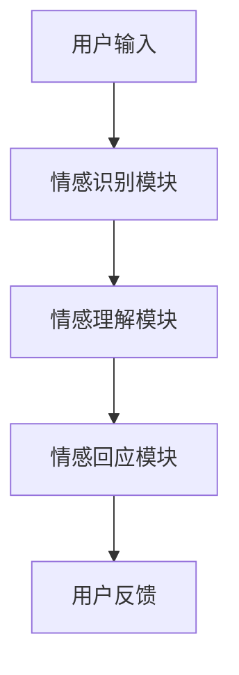
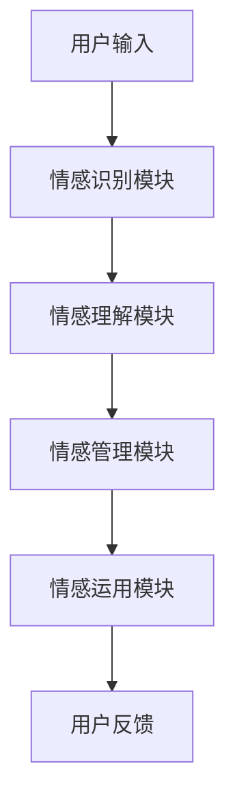
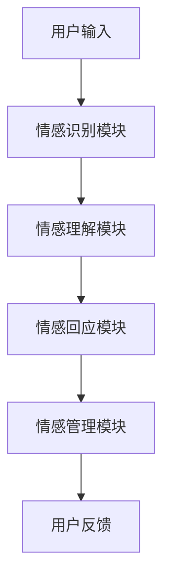

                 


# 提示词设计：增强AI同理心和情感智能的新方法

> 关键词：AI同理心、情感智能、提示词设计、交互体验、用户体验

> 摘要：本文探讨了如何通过设计特定的提示词来增强AI的同理心和情感智能，从而提升AI在与人类交互时的用户体验。文章首先介绍了问题的背景，随后详细阐述了提示词设计的原则、流程和分类，接着讨论了AI同理心和情感智能的原理及实现方法，最后通过实际应用案例展示了提示词设计在AI同理心和情感智能中的重要作用。

## 第一部分：背景与基础

### 第1章 问题背景

#### 1.1 问题描述

在当今数字化时代，人工智能（AI）技术正逐渐融入我们的日常生活，从智能客服到智能语音助手，从自动驾驶汽车到智能家居，AI的应用范围不断扩大。然而，尽管AI在数据处理、模式识别和预测等方面取得了显著的成就，但在理解和回应人类情感方面仍然存在显著的局限性。

人类在与机器交互时，往往希望机器能够理解并回应自己的情感和需求。例如，在在线客服中，用户可能会因为遇到问题而感到沮丧或愤怒，希望得到安慰或解决问题的建议。而在教育辅导系统中，学生可能会因为学习困难而感到焦虑或失落，需要得到教师或AI辅导系统的理解和支持。然而，现有的AI系统在处理情感和同理心方面还存在以下问题：

1. **情感识别不足**：AI系统通常依赖预训练模型来识别情感，但这些模型可能无法准确捕捉复杂的情感状态，尤其是在情感表达不够明显或含糊的情况下。
2. **情感理解困难**：即使AI系统能够识别用户的情感，它们可能无法深入理解这些情感的内涵，从而难以提供针对性的回应。
3. **情感回应单一**：现有的AI系统在回应用户情感时，往往只能提供固定的、模式化的回答，缺乏个性化和同理心的表现。

这些问题的存在，使得AI在与人类交互时，用户体验不够理想，甚至有时会感到冷漠或机械。因此，如何提升AI的同理心和情感智能，成为了一个亟待解决的问题。

#### 1.2 问题解决

为了解决上述问题，研究者们提出了提示词设计这一新方法。提示词设计旨在通过设计特定的词汇或短语，引导AI系统更好地识别、理解和回应用户的情感和需求。具体来说，提示词设计包括以下几个关键步骤：

1. **需求分析**：通过用户研究和市场调研，了解用户在特定场景下的情感状态和需求，从而确定需要设计的提示词类型和内容。
2. **创意构思**：基于需求分析的结果，设计一组具有明确性、简洁性、情感性和适应性的提示词，这些提示词能够引导AI系统捕捉用户的情感状态。
3. **原型设计**：将设计的提示词集成到AI系统中，通过原型设计和测试，验证提示词的有效性和用户体验。
4. **用户测试**：通过实际用户的使用反馈，不断迭代和优化提示词设计，确保其能够满足用户的需求并提升用户体验。

通过提示词设计，AI系统可以更加准确地捕捉用户的情感状态，深入理解这些情感的内涵，并做出更加个性化和同理心的回应。这样，不仅能够提升AI在与人类交互时的用户体验，还能够增强AI的同理心和情感智能，使其更加接近人类的情感交流方式。

#### 1.3 边界与外延

提示词设计的边界涉及如何构建与人类情感交互的AI系统，以及如何在AI系统中实现情感识别和回应。其外延包括AI在各个应用领域中的具体实践，如在线客服、教育辅导、智能语音助手等。在在线客服系统中，提示词可以用于引导AI识别用户的情绪，并提供安慰或解决问题的建议。在教育辅导系统中，提示词可以帮助AI理解学生的情感状态，从而提供针对性的辅导和支持。在智能语音助手中，提示词可以用于引导AI更好地理解用户的需求，并提供个性化的回答。

#### 1.4 核心概念

##### 1.4.1 核心概念1：提示词

提示词是指用于引导AI系统识别和理解用户情感和需求的特定词汇或短语。在AI系统中，提示词起到了桥梁的作用，将用户的情感状态传递给AI，并引导AI做出相应的回应。提示词可以是简单的单词，也可以是复杂的短语，其设计需要考虑清晰性、简洁性和情感性。

##### 1.4.2 核心概念2：同理心

同理心是指能够站在他人立场上理解并感受他人情感的能力。在AI系统中，同理心体现在能够识别和理解用户的情感状态，并做出相应的情感回应。同理心的实现依赖于AI系统的情感识别和情感理解能力，这是提升AI同理心的重要基础。

##### 1.4.3 核心概念3：情感智能

情感智能是指个体识别、理解、使用和管理自己及他人情感的能力。在AI系统中，情感智能体现在系统能够通过感知和识别用户的情感状态，进行智能决策和互动。情感智能的实现依赖于AI系统的情感识别、情感理解和情感回应能力。

##### 1.4.4 概念结构与核心要素组成

本部分的核心概念结构包括提示词设计、同理心和情感智能。其中，提示词设计是基础，同理心和情感智能是目标。核心要素组成包括情感识别、情感理解和情感回应。情感识别是识别用户的情感状态，情感理解是深入理解这些情感的内涵，情感回应是做出相应的情感回应。这些要素共同构成了AI同理心和情感智能的核心框架。

## 第二部分：提示词设计原理

### 第2章 提示词设计原则

#### 2.1 设计原则1：明确性

提示词设计的首要原则是明确性。明确性要求设计的提示词能够清晰地传达用户的情感状态和需求，避免歧义和误解。为了实现这一原则，需要遵循以下步骤：

1. **明确目标**：在开始设计提示词之前，首先要明确设计的目标，即希望通过提示词实现什么样的情感识别和理解效果。
2. **简化语言**：使用简单、直观的词汇和短语，避免使用复杂的术语和难以理解的句子结构。
3. **语境匹配**：确保提示词与用户的语境和情境相匹配，使AI系统能够更好地理解用户的情感状态。

例如，在在线客服系统中，对于用户表达愤怒的语句，可以使用“听起来您有些不满，我可以帮您解决吗？”这样的提示词，而不是使用模糊的“您好像有点不高兴”等词语。

#### 2.2 设计原则2：简洁性

简洁性是提示词设计的另一个重要原则。简洁性要求提示词要短小精悍，避免冗长和复杂的表述。简洁的提示词不仅能够提高AI系统的响应速度，还能提升用户的交互体验。

1. **避免冗余**：在提示词中避免使用重复的词汇和短语，确保每个词都有实际意义。
2. **精简内容**：通过删除无关的细节和冗余信息，使提示词更加简洁明了。
3. **优化表达**：通过调整词汇的顺序和语法结构，使提示词的表达更加流畅和简洁。

例如，对于用户请求帮助的情况，可以使用“需要帮助吗？”这样的简洁提示词，而不是使用“您是否需要我们提供帮助？”等冗长的表达。

#### 2.3 设计原则3：情感性

情感性是提示词设计的核心原则之一。情感性要求提示词不仅要传达信息，还要表达出一定的情感色彩，以增强AI系统的同理心和情感智能。

1. **表达关怀**：在提示词中融入关怀和同理心的表达，使AI系统能够更好地理解用户的情感状态。
2. **个性化**：根据用户的特点和需求，设计个性化的提示词，使AI系统能够提供更加贴心的服务。
3. **情感回应**：在提示词中体现AI系统的情感回应，使AI系统能够更好地满足用户的需求。

例如，在智能语音助手中，对于用户的感谢，可以回应说“不客气，很高兴能帮到您”，这样的表达不仅传达了信息，还表达了AI系统的感激之情。

#### 2.4 设计原则4：适应性

适应性是提示词设计的重要原则。适应性要求提示词能够根据不同的用户和场景进行调整，以适应各种情境和需求。

1. **多场景适应**：设计提示词时，要考虑不同的应用场景，确保提示词能够在各种情境下发挥作用。
2. **动态调整**：根据用户的反馈和系统的性能表现，动态调整提示词的内容和形式，以提升用户体验。
3. **灵活运用**：在设计提示词时，要充分考虑AI系统的灵活性和扩展性，使提示词能够适应未来的发展和变化。

例如，在智能语音助手中，对于不同年龄段的用户，可以设计不同的提示词，如对于儿童用户，可以使用更加生动和有趣的提示词，而对于成年用户，则可以使用更加正式和专业的提示词。

### 第3章 提示词分类

#### 3.1 提示词分类1：基于功能

根据功能的不同，提示词可以分为以下几类：

1. **情感识别提示词**：用于引导AI系统识别用户的情感状态，如愤怒、喜悦、焦虑等。
2. **情感理解提示词**：用于帮助AI系统深入理解用户的情感状态，如原因、感受、期望等。
3. **情感回应提示词**：用于引导AI系统做出相应的情感回应，如安慰、鼓励、建议等。

#### 3.2 提示词分类2：基于用户类型

根据用户类型的不同，提示词可以分为以下几类：

1. **儿童用户提示词**：适用于儿童用户，使用简单、生动、有趣的词汇和短语，以提高儿童的互动体验。
2. **成年用户提示词**：适用于成年用户，使用正式、专业、贴心的词汇和短语，以提高成年用户的信任感和满意度。
3. **老年用户提示词**：适用于老年用户，使用简洁、明了、易于理解的词汇和短语，以提高老年用户的操作便利性和满意度。

#### 3.3 提示词分类3：基于场景

根据应用场景的不同，提示词可以分为以下几类：

1. **在线客服提示词**：用于在线客服系统，如问题解决、情感回应、互动引导等。
2. **教育辅导提示词**：用于教育辅导系统，如学习指导、情感关怀、互动鼓励等。
3. **智能语音助手提示词**：用于智能语音助手系统，如日常交流、情感回应、需求引导等。

### 第4章 提示词设计流程

#### 4.1 设计流程1：需求分析

需求分析是提示词设计的首要环节。通过需求分析，了解用户在特定场景下的情感状态和需求，从而确定需要设计的提示词类型和内容。具体步骤如下：

1. **用户研究**：通过访谈、问卷调查、用户观察等方式，收集用户在特定场景下的情感状态和行为数据。
2. **市场调研**：分析市场趋势、竞争对手产品特点，了解用户对现有AI系统的满意度及期望。
3. **需求确定**：根据用户研究和市场调研的结果，明确需要设计的提示词类型和内容。

#### 4.2 设计流程2：创意构思

创意构思是提示词设计的关键环节。在需求分析的基础上，设计一组具有明确性、简洁性、情感性和适应性的提示词。具体步骤如下：

1. **头脑风暴**：组织团队进行头脑风暴，提出各种可能的提示词方案。
2. **筛选方案**：根据明确性、简洁性、情感性和适应性等原则，筛选出最优的提示词方案。
3. **迭代优化**：通过多次迭代和优化，不断完善提示词设计，确保其能够满足用户的需求。

#### 4.3 设计流程3：原型设计

原型设计是提示词设计的验证环节。通过原型设计，将设计的提示词集成到AI系统中，验证其有效性和用户体验。具体步骤如下：

1. **原型构建**：使用AI系统平台，构建提示词原型，模拟实际交互场景。
2. **功能验证**：测试提示词的功能，确保其能够准确识别和理解用户的情感状态。
3. **用户体验**：通过用户体验测试，收集用户对提示词的反馈，评估其用户体验。

#### 4.4 设计流程4：用户测试

用户测试是提示词设计的最后环节。通过用户测试，验证提示词的设计效果，并根据用户反馈进行进一步优化。具体步骤如下：

1. **测试计划**：制定详细的用户测试计划，包括测试场景、测试用户、测试指标等。
2. **测试执行**：按照测试计划，进行用户测试，收集用户反馈。
3. **结果分析**：分析用户反馈数据，评估提示词的设计效果，确定需要优化和改进的方面。
4. **迭代优化**：根据用户反馈，对提示词进行优化和改进，确保其能够满足用户的需求。

## 第三部分：AI同理心和情感智能

### 第5章 AI同理心原理

#### 5.1 同理心定义

同理心（Empathy）是指个体能够感知和理解他人情感状态的能力。在人类社会中，同理心是建立人际关系、增进沟通和理解的重要基础。同理心包括情感感知、情感理解和情感回应三个核心组成部分。

1. **情感感知**：个体能够感知和理解他人的情感状态，如喜悦、愤怒、焦虑等。
2. **情感理解**：个体能够深入理解他人情感状态的内涵，如情感的原因、情感的感受等。
3. **情感回应**：个体能够根据他人情感状态，做出相应的情感回应，如安慰、鼓励、支持等。

#### 5.2 AI同理心实现方法

在AI系统中，实现同理心需要依赖于情感识别、情感理解和情感回应技术。具体方法如下：

1. **情感识别**：通过自然语言处理（NLP）技术，识别用户语言中的情感词汇和表达方式，如喜悦、愤怒、焦虑等。
2. **情感理解**：通过深度学习模型，分析用户情感表达的上下文信息，理解情感状态的内涵和原因。
3. **情感回应**：根据情感识别和理解的结果，设计相应的情感回应策略，如安慰、鼓励、建议等。

#### 5.3 同理心模型架构

AI同理心模型架构通常包括情感识别模块、情感理解模块和情感回应模块。以下是具体架构设计：

1. **情感识别模块**：使用NLP技术，从用户语言中提取情感词汇和表达方式，如使用情感分析模型识别情绪。
2. **情感理解模块**：使用深度学习模型，分析情感表达的上下文信息，理解情感状态的内涵和原因，如使用情感理解模型分析情感原因。
3. **情感回应模块**：根据情感识别和理解的结果，设计相应的情感回应策略，如使用自然语言生成（NLG）模型生成情感回应语句。

### 第6章 情感智能原理

#### 6.1 情感智能定义

情感智能（Emotional Intelligence，简称EQ）是指个体识别、理解、使用和管理自己及他人情感的能力。情感智能包括情感自我意识、情感自我调节、情感社交意识和情感运用四个核心组成部分。

1. **情感自我意识**：个体能够识别和理解自己的情感状态，如喜悦、愤怒、焦虑等。
2. **情感自我调节**：个体能够管理和调节自己的情感状态，如保持冷静、控制情绪等。
3. **情感社交意识**：个体能够识别和理解他人的情感状态，如感知他人的情绪、理解他人的感受等。
4. **情感运用**：个体能够运用情感信息进行决策和社交互动，如根据情感状态调整行为策略、建立良好的人际关系等。

#### 6.2 情感智能实现方法

在AI系统中，实现情感智能需要依赖于情感识别、情感理解和情感运用技术。具体方法如下：

1. **情感识别**：通过NLP技术，识别用户语言中的情感词汇和表达方式，如使用情感分析模型识别情绪。
2. **情感理解**：通过深度学习模型，分析情感表达的上下文信息，理解情感状态的内涵和原因。
3. **情感运用**：根据情感识别和理解的结果，设计相应的情感运用策略，如调整系统行为、提供个性化服务、建立情感连接等。

#### 6.3 情感智能模型架构

情感智能模型架构通常包括情感识别模块、情感理解模块和情感运用模块。以下是具体架构设计：

1. **情感识别模块**：使用NLP技术，从用户语言中提取情感词汇和表达方式，如使用情感分析模型识别情绪。
2. **情感理解模块**：使用深度学习模型，分析情感表达的上下文信息，理解情感状态的内涵和原因，如使用情感理解模型分析情感原因。
3. **情感运用模块**：根据情感识别和理解的结果，设计相应的情感运用策略，如使用自然语言生成（NLG）模型生成情感回应语句，调整系统行为等。

### 第7章 提示词与AI同理心、情感智能的结合

#### 7.1 提示词在AI同理心中的作用

提示词在AI同理心中起到了关键的桥梁作用。通过设计特定的提示词，AI系统能够更好地识别和理解用户的情感状态，从而实现同理心。具体来说，提示词的作用主要体现在以下几个方面：

1. **引导情感识别**：提示词可以引导AI系统识别用户的情感状态，如愤怒、喜悦、焦虑等。例如，用户表达“我感到很生气”，AI系统可以通过识别“生气”这个关键词，进而判断用户处于愤怒状态。
2. **辅助情感理解**：提示词可以辅助AI系统深入理解用户的情感状态，如原因、感受、期望等。例如，用户表达“我感到很生气，因为我的手机丢了”，AI系统可以通过识别“手机丢了”这个提示词，理解用户愤怒的原因。
3. **促进情感回应**：提示词可以促进AI系统做出相应的情感回应，如安慰、鼓励、建议等。例如，用户表达“我感到很沮丧”，AI系统可以通过识别“沮丧”这个提示词，回应说“别担心，我们会帮您解决问题的”。

#### 7.2 提示词在情感智能中的重要作用

提示词在情感智能中同样发挥着重要作用。通过设计特定的提示词，AI系统能够更好地识别、理解和运用情感信息，从而实现情感智能。具体来说，提示词在情感智能中的作用主要体现在以下几个方面：

1. **识别情感状态**：提示词可以帮助AI系统识别用户的情感状态，如喜悦、愤怒、焦虑等。例如，用户表达“我感到很高兴”，AI系统可以通过识别“很高兴”这个提示词，判断用户处于喜悦状态。
2. **理解情感内涵**：提示词可以帮助AI系统深入理解用户的情感状态，如原因、感受、期望等。例如，用户表达“我感到很愤怒，因为我的手机丢了”，AI系统可以通过识别“手机丢了”这个提示词，理解用户愤怒的原因。
3. **调整系统行为**：提示词可以帮助AI系统根据用户的情感状态调整行为，如提供个性化服务、建议解决方案等。例如，用户表达“我感到很沮丧”，AI系统可以通过识别“沮丧”这个提示词，提供相应的安慰和建议。

#### 7.3 提示词设计案例

以下是一个关于在线客服系统的提示词设计案例：

1. **需求分析**：在线客服系统需要识别用户的情感状态，并提供相应的回应，以提高用户体验。通过用户研究，发现用户在遇到问题时，常常会表达愤怒、焦虑、沮丧等情感状态。
2. **创意构思**：设计一组具有明确性、简洁性、情感性和适应性的提示词，如“听起来您有些愤怒，我们可以帮您解决问题”、“感到焦虑吗？我们可以一起找出解决办法”、“别担心，我们会尽快帮您解决问题”等。
3. **原型设计**：将设计的提示词集成到在线客服系统中，通过模拟用户交互场景，测试提示词的有效性和用户体验。
4. **用户测试**：邀请实际用户参与测试，收集用户对提示词的反馈，评估其设计效果。

### 第8章 实际应用案例

#### 8.1 案例一：在线客服系统

在线客服系统是一个典型的应用场景，通过设计特定的提示词，可以显著提升AI系统的同理心和情感智能，从而提高用户体验。以下是一个实际应用案例：

1. **需求分析**：在线客服系统需要识别用户的情感状态，并提供个性化的回应，以帮助用户解决问题。通过用户调研，发现用户在遇到问题时，常常表达出愤怒、焦虑、沮丧等情感状态。
2. **创意构思**：设计一组具有明确性、简洁性、情感性和适应性的提示词，如“听起来您有些愤怒，我们可以帮您解决问题”、“感到焦虑吗？我们可以一起找出解决办法”、“别担心，我们会尽快帮您解决问题”等。
3. **原型设计**：将设计的提示词集成到在线客服系统中，通过模拟用户交互场景，测试提示词的有效性和用户体验。
4. **用户测试**：邀请实际用户参与测试，收集用户对提示词的反馈，评估其设计效果。根据用户反馈，对提示词进行优化和调整。

#### 8.2 案例二：教育辅导系统

教育辅导系统通过设计特定的提示词，可以帮助AI系统更好地理解学生的情感状态，从而提供个性化的辅导和支持。以下是一个实际应用案例：

1. **需求分析**：教育辅导系统需要识别学生的情感状态，如焦虑、沮丧、自信等，并提供相应的辅导和支持。通过用户调研，发现学生在学习过程中，常常会因为压力、困难而表现出不同的情感状态。
2. **创意构思**：设计一组具有明确性、简洁性、情感性和适应性的提示词，如“您看起来有些焦虑，我们可以一起找出解决方案”、“感到沮丧吗？让我们一起寻找解决办法”、“您做得很好，继续努力！”等。
3. **原型设计**：将设计的提示词集成到教育辅导系统中，通过模拟用户交互场景，测试提示词的有效性和用户体验。
4. **用户测试**：邀请学生参与测试，收集用户对提示词的反馈，评估其设计效果。根据用户反馈，对提示词进行优化和调整。

#### 8.3 案例三：智能语音助手

智能语音助手通过设计特定的提示词，可以帮助AI系统更好地理解用户的需求，并提供个性化的服务。以下是一个实际应用案例：

1. **需求分析**：智能语音助手需要识别用户的需求，如娱乐、购物、导航等，并提供相应的服务。通过用户调研，发现用户在日常生活中，常常会通过语音助手解决各种问题。
2. **创意构思**：设计一组具有明确性、简洁性、情感性和适应性的提示词，如“您想听什么音乐？”“需要购买什么商品？”“您的位置在哪里？”等。
3. **原型设计**：将设计的提示词集成到智能语音助手系统中，通过模拟用户交互场景，测试提示词的有效性和用户体验。
4. **用户测试**：邀请实际用户参与测试，收集用户对提示词的反馈，评估其设计效果。根据用户反馈，对提示词进行优化和调整。

### 第9章 最佳实践

#### 9.1 提示词设计最佳实践

在提示词设计中，以下是一些最佳实践：

1. **用户中心**：始终将用户需求放在首位，通过用户研究了解用户的情感状态和需求，设计出具有针对性的提示词。
2. **多轮迭代**：提示词设计是一个不断迭代的过程，通过多次迭代和优化，不断改进提示词的设计，以满足用户的需求。
3. **情感性**：在设计提示词时，要充分考虑情感性，使提示词能够表达出一定的情感色彩，以增强AI的同理心和情感智能。
4. **简洁性**：提示词要简洁明了，避免使用复杂的术语和冗长的句子，以提高用户的理解和使用体验。
5. **适应性**：提示词要具有适应性，能够根据不同的用户和场景进行调整，以适应各种情境和需求。

#### 9.2 AI同理心和情感智能最佳实践

在实现AI同理心和情感智能时，以下是一些最佳实践：

1. **情感识别**：使用先进的情感识别技术，准确识别用户的情感状态，为基础理解情感提供支持。
2. **情感理解**：使用深度学习模型，深入分析用户情感表达的上下文信息，理解情感状态的内涵和原因。
3. **情感回应**：根据情感识别和理解的结果，设计相应的情感回应策略，使AI系统能够提供更加个性化和同理心的服务。
4. **持续优化**：通过用户测试和反馈，不断优化AI同理心和情感智能的实现，提升系统的整体性能和用户体验。
5. **跨领域应用**：将AI同理心和情感智能应用于各个领域，如在线客服、教育辅导、智能语音助手等，以实现更广泛的覆盖和应用。

### 第10章 小结

#### 10.1 书中主要内容的回顾

本文首先介绍了AI同理心和情感智能的背景和问题，提出了通过设计特定的提示词来提升AI同理心和情感智能的新方法。随后，详细阐述了提示词设计的原则、流程和分类，讨论了AI同理心和情感智能的原理及实现方法，并通过实际应用案例展示了提示词设计在AI同理心和情感智能中的重要作用。最后，总结了提示词设计和AI同理心、情感智能的最佳实践，并对未来的研究方向进行了展望。

#### 10.2 总结与展望

通过本文的研究，我们可以得出以下结论：

1. **提示词设计是提升AI同理心和情感智能的有效方法**：通过设计特定的提示词，AI系统可以更好地识别、理解和回应用户的情感状态，从而提升用户体验。
2. **多轮迭代和用户测试是关键**：提示词设计需要通过多轮迭代和用户测试，不断完善和优化，以确保其能够满足用户的需求。
3. **情感性、简洁性和适应性是提示词设计的重要原则**：在设计提示词时，要充分考虑情感性、简洁性和适应性，以提高AI系统的同理心和情感智能。

未来，我们可以在以下几个方面进行深入研究：

1. **多模态情感识别**：将语音、文本、图像等多种模态的数据融合，实现更加全面和精准的情感识别。
2. **个性化情感回应**：根据用户的行为和偏好，设计个性化的情感回应策略，提高用户的满意度。
3. **跨领域应用**：将AI同理心和情感智能应用于更多领域，如医疗、金融、娱乐等，以实现更广泛的应用价值。
4. **伦理和法律问题**：研究AI同理心和情感智能的伦理和法律问题，确保其在实际应用中的合法性和道德性。

#### 10.3 注意事项与拓展阅读

在设计提示词时，需要注意以下几点：

1. **避免歧义和误解**：确保提示词表达清晰明确，避免使用容易引起歧义的词汇和短语。
2. **考虑文化差异**：在设计提示词时，要考虑不同文化背景下的用户，确保提示词的通用性和适应性。
3. **尊重用户隐私**：在设计提示词时，要尊重用户的隐私，避免收集和使用用户的敏感信息。

拓展阅读：

1. **《情感计算》**：王选，王继祥著，清华大学出版社，2014年。
2. **《人工智能：一种现代的方法》**：Stuart Russell & Peter Norvig 著，人民邮电出版社，2016年。
3. **《同理心：人类的情感智慧》**：Chris Bertram 著，社会科学文献出版社，2012年。

作者：AI天才研究院/AI Genius Institute & 禅与计算机程序设计艺术 /Zen And The Art of Computer Programming
```markdown
----------------------------------------------------------------
## 第一部分：背景与基础

### 第1章 问题背景

#### 1.1 问题描述

随着人工智能（AI）技术的快速发展，AI已经渗透到我们日常生活的方方面面，从智能客服到智能家居，从自动驾驶到虚拟助手，AI正在改变我们的生活方式。然而，尽管AI在数据处理、模式识别和决策支持等方面取得了巨大进步，但在理解和回应人类情感方面，AI仍然面临诸多挑战。

在与人类互动的过程中，人们期望AI能够识别并理解他们的情感状态，从而提供更加个性化和温暖的互动体验。例如，在客服场景中，当用户表达愤怒或不满时，他们希望AI能够理解其情绪并给出适当的回应，而不是仅仅提供机械化的解决方案。在教育辅导场景中，学生可能会因为学习压力而感到焦虑或沮丧，他们希望AI能够提供情感支持，帮助他们缓解压力。

然而，现有的AI系统在处理情感和同理心方面存在以下问题：

1. **情感识别的局限性**：AI系统通常依赖于预训练的模型来识别情感，但这些模型可能无法准确捕捉复杂的情感状态，特别是在情感表达不明显或含糊不清的情况下。
2. **情感理解的不足**：即使AI系统能够识别用户的情感，它们可能难以深入理解这些情感的内涵，导致无法提供针对性的回应。
3. **情感回应的单一性**：现有的AI系统在回应用户情感时，往往只能提供固定的、模式化的回答，缺乏个性化和同理心的表现。

这些问题导致了AI在与人类交互时的用户体验不佳，有时甚至显得冷漠或机械。因此，如何提升AI的同理心和情感智能，成为一个迫切需要解决的问题。

#### 1.2 问题解决

为了解决上述问题，研究者们提出了提示词设计这一新方法。提示词设计旨在通过设计特定的词汇或短语，引导AI系统更好地识别、理解和回应用户的情感和需求。具体来说，提示词设计包括以下几个关键步骤：

1. **需求分析**：通过用户研究和市场调研，了解用户在特定场景下的情感状态和需求，从而确定需要设计的提示词类型和内容。
2. **创意构思**：基于需求分析的结果，设计一组具有明确性、简洁性、情感性和适应性的提示词，这些提示词能够引导AI系统捕捉用户的情感状态。
3. **原型设计**：将设计的提示词集成到AI系统中，通过原型设计和测试，验证提示词的有效性和用户体验。
4. **用户测试**：通过实际用户的使用反馈，不断迭代和优化提示词设计，确保其能够满足用户的需求并提升用户体验。

通过提示词设计，AI系统可以更加准确地捕捉用户的情感状态，深入理解这些情感的内涵，并做出更加个性化和同理心的回应。这样，不仅能够提升AI在与人类交互时的用户体验，还能够增强AI的同理心和情感智能，使其更加接近人类的情感交流方式。

#### 1.3 边界与外延

提示词设计的边界涉及如何构建与人类情感交互的AI系统，以及如何在AI系统中实现情感识别和回应。其外延包括AI在各个应用领域中的具体实践，如在线客服、教育辅导、智能语音助手等。

在在线客服系统中，提示词可以用于引导AI识别用户的情绪，并提供安慰或解决问题的建议。在教育辅导系统中，提示词可以帮助AI理解学生的情感状态，从而提供针对性的辅导和支持。在智能语音助手中，提示词可以用于引导AI更好地理解用户的需求，并提供个性化的回答。

#### 1.4 核心概念

##### 1.4.1 核心概念1：提示词

提示词是指用于引导AI系统识别和理解用户情感和需求的特定词汇或短语。在AI系统中，提示词起到了桥梁的作用，将用户的情感状态传递给AI，并引导AI做出相应的回应。提示词可以是简单的单词，也可以是复杂的短语，其设计需要考虑清晰性、简洁性和情感性。

##### 1.4.2 核心概念2：同理心

同理心是指能够站在他人立场上理解并感受他人情感的能力。在AI系统中，同理心体现在能够识别和理解用户的情感状态，并做出相应的情感回应。同理心的实现依赖于AI系统的情感识别和情感理解能力，这是提升AI同理心的重要基础。

##### 1.4.3 核心概念3：情感智能

情感智能是指个体识别、理解、使用和管理自己及他人情感的能力。在AI系统中，情感智能体现在系统能够通过感知和识别用户的情感状态，进行智能决策和互动。情感智能的实现依赖于AI系统的情感识别、情感理解和情感回应能力。

##### 1.4.4 概念结构与核心要素组成

本部分的核心概念结构包括提示词设计、同理心和情感智能。其中，提示词设计是基础，同理心和情感智能是目标。核心要素组成包括情感识别、情感理解和情感回应。情感识别是识别用户的情感状态，情感理解是深入理解这些情感的内涵，情感回应是做出相应的情感回应。这些要素共同构成了AI同理心和情感智能的核心框架。

## 第二部分：提示词设计原理

### 第2章 提示词设计原则

#### 2.1 设计原则1：明确性

明确性是提示词设计的首要原则。设计的提示词必须能够清晰地传达用户的情感状态和需求，避免歧义和误解。为了实现这一原则，需要遵循以下步骤：

1. **明确目标**：在开始设计提示词之前，首先要明确设计的目标，即希望通过提示词实现什么样的情感识别和理解效果。
2. **简化语言**：使用简单、直观的词汇和短语，避免使用复杂的术语和难以理解的句子结构。
3. **语境匹配**：确保提示词与用户的语境和情境相匹配，使AI系统能够更好地理解用户的情感状态。

例如，在在线客服系统中，对于用户表达愤怒的语句，可以使用“听起来您有些不满，我可以帮您解决吗？”这样的提示词，而不是使用模糊的“您好像有点不高兴”等词语。

#### 2.2 设计原则2：简洁性

简洁性是提示词设计的另一个重要原则。简洁性要求提示词要短小精悍，避免冗长和复杂的表述。简洁的提示词不仅能够提高AI系统的响应速度，还能提升用户的交互体验。

1. **避免冗余**：在提示词中避免使用重复的词汇和短语，确保每个词都有实际意义。
2. **精简内容**：通过删除无关的细节和冗余信息，使提示词更加简洁明了。
3. **优化表达**：通过调整词汇的顺序和语法结构，使提示词的表达更加流畅和简洁。

例如，对于用户请求帮助的情况，可以使用“需要帮助吗？”这样的简洁提示词，而不是使用“您是否需要我们提供帮助？”等冗长的表达。

#### 2.3 设计原则3：情感性

情感性是提示词设计的核心原则之一。情感性要求提示词不仅要传达信息，还要表达出一定的情感色彩，以增强AI系统的同理心和情感智能。

1. **表达关怀**：在提示词中融入关怀和同理心的表达，使AI系统能够更好地理解用户的情感状态。
2. **个性化**：根据用户的特点和需求，设计个性化的提示词，使AI系统能够提供更加贴心的服务。
3. **情感回应**：在提示词中体现AI系统的情感回应，使AI系统能够更好地满足用户的需求。

例如，在智能语音助手中，对于用户的感谢，可以回应说“不客气，很高兴能帮到您”，这样的表达不仅传达了信息，还表达了AI系统的感激之情。

#### 2.4 设计原则4：适应性

适应性是提示词设计的重要原则。适应性要求提示词能够根据不同的用户和场景进行调整，以适应各种情境和需求。

1. **多场景适应**：设计提示词时，要考虑不同的应用场景，确保提示词能够在各种情境下发挥作用。
2. **动态调整**：根据用户的反馈和系统的性能表现，动态调整提示词的内容和形式，以提升用户体验。
3. **灵活运用**：在设计提示词时，要充分考虑AI系统的灵活性和扩展性，使提示词能够适应未来的发展和变化。

例如，在智能语音助手中，对于不同年龄段的用户，可以设计不同的提示词，如对于儿童用户，可以使用更加生动和有趣的提示词，而对于成年用户，则可以使用更加正式和专业的提示词。

### 第3章 提示词分类

#### 3.1 提示词分类1：基于功能

根据功能的不同，提示词可以分为以下几类：

1. **情感识别提示词**：用于引导AI系统识别用户的情感状态，如愤怒、喜悦、焦虑等。
2. **情感理解提示词**：用于帮助AI系统深入理解用户的情感状态，如原因、感受、期望等。
3. **情感回应提示词**：用于引导AI系统做出相应的情感回应，如安慰、鼓励、建议等。

#### 3.2 提示词分类2：基于用户类型

根据用户类型的不同，提示词可以分为以下几类：

1. **儿童用户提示词**：适用于儿童用户，使用简单、生动、有趣的词汇和短语，以提高儿童的互动体验。
2. **成年用户提示词**：适用于成年用户，使用正式、专业、贴心的词汇和短语，以提高成年用户的信任感和满意度。
3. **老年用户提示词**：适用于老年用户，使用简洁、明了、易于理解的词汇和短语，以提高老年用户的操作便利性和满意度。

#### 3.3 提示词分类3：基于场景

根据应用场景的不同，提示词可以分为以下几类：

1. **在线客服提示词**：用于在线客服系统，如问题解决、情感回应、互动引导等。
2. **教育辅导提示词**：用于教育辅导系统，如学习指导、情感关怀、互动鼓励等。
3. **智能语音助手提示词**：用于智能语音助手系统，如日常交流、情感回应、需求引导等。

### 第4章 提示词设计流程

#### 4.1 设计流程1：需求分析

需求分析是提示词设计的首要环节。通过需求分析，了解用户在特定场景下的情感状态和需求，从而确定需要设计的提示词类型和内容。具体步骤如下：

1. **用户研究**：通过访谈、问卷调查、用户观察等方式，收集用户在特定场景下的情感状态和行为数据。
2. **市场调研**：分析市场趋势、竞争对手产品特点，了解用户对现有AI系统的满意度及期望。
3. **需求确定**：根据用户研究和市场调研的结果，明确需要设计的提示词类型和内容。

#### 4.2 设计流程2：创意构思

创意构思是提示词设计的关键环节。在需求分析的基础上，设计一组具有明确性、简洁性、情感性和适应性的提示词。具体步骤如下：

1. **头脑风暴**：组织团队进行头脑风暴，提出各种可能的提示词方案。
2. **筛选方案**：根据明确性、简洁性、情感性和适应性等原则，筛选出最优的提示词方案。
3. **迭代优化**：通过多次迭代和优化，不断完善提示词设计，确保其能够满足用户的需求。

#### 4.3 设计流程3：原型设计

原型设计是提示词设计的验证环节。通过原型设计，将设计的提示词集成到AI系统中，验证其有效性和用户体验。具体步骤如下：

1. **原型构建**：使用AI系统平台，构建提示词原型，模拟实际交互场景。
2. **功能验证**：测试提示词的功能，确保其能够准确识别和理解用户的情感状态。
3. **用户体验**：通过用户体验测试，收集用户对提示词的反馈，评估其用户体验。

#### 4.4 设计流程4：用户测试

用户测试是提示词设计的最后环节。通过用户测试，验证提示词的设计效果，并根据用户反馈进行进一步优化。具体步骤如下：

1. **测试计划**：制定详细的用户测试计划，包括测试场景、测试用户、测试指标等。
2. **测试执行**：按照测试计划，进行用户测试，收集用户反馈。
3. **结果分析**：分析用户反馈数据，评估提示词的设计效果，确定需要优化和改进的方面。
4. **迭代优化**：根据用户反馈，对提示词进行优化和改进，确保其能够满足用户的需求。

## 第三部分：AI同理心和情感智能

### 第5章 AI同理心原理

#### 5.1 同理心定义

同理心（Empathy）是指个体能够感知和理解他人情感状态的能力。同理心是人类社会中沟通和理解的重要基础。同理心包括情感感知、情感理解和情感回应三个核心组成部分。

1. **情感感知**：个体能够感知他人的情感状态，如喜悦、愤怒、焦虑等。
2. **情感理解**：个体能够深入理解他人情感状态的内涵，如情感的原因、情感的感受等。
3. **情感回应**：个体能够根据他人情感状态，做出相应的情感回应，如安慰、鼓励、支持等。

#### 5.2 AI同理心实现方法

在AI系统中，实现同理心需要依赖于情感识别、情感理解和情感回应技术。具体方法如下：

1. **情感识别**：通过自然语言处理（NLP）技术，识别用户语言中的情感词汇和表达方式，如喜悦、愤怒、焦虑等。
2. **情感理解**：通过深度学习模型，分析情感表达的上下文信息，理解情感状态的内涵和原因。
3. **情感回应**：根据情感识别和理解的结果，设计相应的情感回应策略，如安慰、鼓励、建议等。

#### 5.3 同理心模型架构

AI同理心模型架构通常包括情感识别模块、情感理解模块和情感回应模块。以下是具体架构设计：

1. **情感识别模块**：使用NLP技术，从用户语言中提取情感词汇和表达方式，如使用情感分析模型识别情绪。
2. **情感理解模块**：使用深度学习模型，分析情感表达的上下文信息，理解情感状态的内涵和原因，如使用情感理解模型分析情感原因。
3. **情感回应模块**：根据情感识别和理解的结果，设计相应的情感回应策略，如使用自然语言生成（NLG）模型生成情感回应语句。

### 第6章 情感智能原理

#### 6.1 情感智能定义

情感智能（Emotional Intelligence，简称EQ）是指个体识别、理解、使用和管理自己及他人情感的能力。情感智能包括情感自我意识、情感自我调节、情感社交意识和情感运用四个核心组成部分。

1. **情感自我意识**：个体能够识别和理解自己的情感状态，如喜悦、愤怒、焦虑等。
2. **情感自我调节**：个体能够管理和调节自己的情感状态，如保持冷静、控制情绪等。
3. **情感社交意识**：个体能够识别和理解他人的情感状态，如感知他人的情绪、理解他人的感受等。
4. **情感运用**：个体能够运用情感信息进行决策和社交互动，如根据情感状态调整行为策略、建立良好的人际关系等。

#### 6.2 情感智能实现方法

在AI系统中，实现情感智能需要依赖于情感识别、情感理解和情感运用技术。具体方法如下：

1. **情感识别**：通过自然语言处理（NLP）技术，识别用户语言中的情感词汇和表达方式，如使用情感分析模型识别情绪。
2. **情感理解**：通过深度学习模型，分析情感表达的上下文信息，理解情感状态的内涵和原因。
3. **情感运用**：根据情感识别和理解的结果，设计相应的情感运用策略，如调整系统行为、提供个性化服务、建立情感连接等。

#### 6.3 情感智能模型架构

情感智能模型架构通常包括情感识别模块、情感理解模块和情感运用模块。以下是具体架构设计：

1. **情感识别模块**：使用NLP技术，从用户语言中提取情感词汇和表达方式，如使用情感分析模型识别情绪。
2. **情感理解模块**：使用深度学习模型，分析情感表达的上下文信息，理解情感状态的内涵和原因，如使用情感理解模型分析情感原因。
3. **情感运用模块**：根据情感识别和理解的结果，设计相应的情感运用策略，如使用自然语言生成（NLG）模型生成情感回应语句，调整系统行为等。

### 第7章 提示词与AI同理心、情感智能的结合

#### 7.1 提示词在AI同理心中的作用

提示词在AI同理心中起到了关键的桥梁作用。通过设计特定的提示词，AI系统能够更好地识别、理解和回应用户的情感状态，从而实现同理心。具体来说，提示词的作用主要体现在以下几个方面：

1. **引导情感识别**：提示词可以引导AI系统识别用户的情感状态，如愤怒、喜悦、焦虑等。例如，用户表达“我感到很生气”，AI系统可以通过识别“生气”这个关键词，进而判断用户处于愤怒状态。
2. **辅助情感理解**：提示词可以辅助AI系统深入理解用户的情感状态，如原因、感受、期望等。例如，用户表达“我感到很愤怒，因为我的手机丢了”，AI系统可以通过识别“手机丢了”这个提示词，理解用户愤怒的原因。
3. **促进情感回应**：提示词可以促进AI系统做出相应的情感回应，如安慰、鼓励、建议等。例如，用户表达“我感到很沮丧”，AI系统可以通过识别“沮丧”这个提示词，回应说“别担心，我们会帮您解决问题的”。

#### 7.2 提示词在情感智能中的重要作用

提示词在情感智能中同样发挥着重要作用。通过设计特定的提示词，AI系统能够更好地识别、理解和运用情感信息，从而实现情感智能。具体来说，提示词在情感智能中的作用主要体现在以下几个方面：

1. **识别情感状态**：提示词可以帮助AI系统识别用户的情感状态，如喜悦、愤怒、焦虑等。例如，用户表达“我感到很高兴”，AI系统可以通过识别“很高兴”这个提示词，判断用户处于喜悦状态。
2. **理解情感内涵**：提示词可以帮助AI系统深入理解用户的情感状态，如原因、感受、期望等。例如，用户表达“我感到很愤怒，因为我的手机丢了”，AI系统可以通过识别“手机丢了”这个提示词，理解用户愤怒的原因。
3. **调整系统行为**：提示词可以帮助AI系统根据用户的情感状态调整行为，如提供个性化服务、建议解决方案等。例如，用户表达“我感到很沮丧”，AI系统可以通过识别“沮丧”这个提示词，提供相应的安慰和建议。

#### 7.3 提示词设计案例

以下是一个关于在线客服系统的提示词设计案例：

1. **需求分析**：在线客服系统需要识别用户的情感状态，并提供相应的回应，以提高用户体验。通过用户调研，发现用户在遇到问题时，常常会表达愤怒、焦虑、沮丧等情感状态。
2. **创意构思**：设计一组具有明确性、简洁性、情感性和适应性的提示词，如“听起来您有些愤怒，我们可以帮您解决问题”、“感到焦虑吗？我们可以一起找出解决办法”、“别担心，我们会尽快帮您解决问题”等。
3. **原型设计**：将设计的提示词集成到在线客服系统中，通过模拟用户交互场景，测试提示词的有效性和用户体验。
4. **用户测试**：邀请实际用户参与测试，收集用户对提示词的反馈，评估其设计效果。根据用户反馈，对提示词进行优化和调整。

### 第8章 实际应用案例

#### 8.1 案例一：在线客服系统

在线客服系统是一个典型的应用场景，通过设计特定的提示词，可以显著提升AI系统的同理心和情感智能，从而提高用户体验。以下是一个实际应用案例：

1. **需求分析**：在线客服系统需要识别用户的情感状态，并提供个性化的回应，以帮助用户解决问题。通过用户调研，发现用户在遇到问题时，常常会表达愤怒、焦虑、沮丧等情感状态。
2. **创意构思**：设计一组具有明确性、简洁性、情感性和适应性的提示词，如“听起来您有些愤怒，我们可以帮您解决问题”、“感到焦虑吗？我们可以一起找出解决办法”、“别担心，我们会尽快帮您解决问题”等。
3. **原型设计**：将设计的提示词集成到在线客服系统中，通过模拟用户交互场景，测试提示词的有效性和用户体验。
4. **用户测试**：邀请实际用户参与测试，收集用户对提示词的反馈，评估其设计效果。根据用户反馈，对提示词进行优化和调整。

#### 8.2 案例二：教育辅导系统

教育辅导系统通过设计特定的提示词，可以帮助AI系统更好地理解学生的情感状态，从而提供个性化的辅导和支持。以下是一个实际应用案例：

1. **需求分析**：教育辅导系统需要识别学生的情感状态，如焦虑、沮丧、自信等，并提供相应的辅导和支持。通过用户调研，发现学生在学习过程中，常常会因为压力、困难而表现出不同的情感状态。
2. **创意构思**：设计一组具有明确性、简洁性、情感性和适应性的提示词，如“您看起来有些焦虑，我们可以一起找出解决方案”、“感到沮丧吗？让我们一起寻找解决办法”、“您做得很好，继续努力！”等。
3. **原型设计**：将设计的提示词集成到教育辅导系统中，通过模拟用户交互场景，测试提示词的有效性和用户体验。
4. **用户测试**：邀请学生参与测试，收集用户对提示词的反馈，评估其设计效果。根据用户反馈，对提示词进行优化和调整。

#### 8.3 案例三：智能语音助手

智能语音助手通过设计特定的提示词，可以帮助AI系统更好地理解用户的需求，并提供个性化的服务。以下是一个实际应用案例：

1. **需求分析**：智能语音助手需要识别用户的需求，如娱乐、购物、导航等，并提供相应的服务。通过用户调研，发现用户在日常生活中，常常会通过语音助手解决各种问题。
2. **创意构思**：设计一组具有明确性、简洁性、情感性和适应性的提示词，如“您想听什么音乐？”“需要购买什么商品？”“您的位置在哪里？”等。
3. **原型设计**：将设计的提示词集成到智能语音助手系统中，通过模拟用户交互场景，测试提示词的有效性和用户体验。
4. **用户测试**：邀请实际用户参与测试，收集用户对提示词的反馈，评估其设计效果。根据用户反馈，对提示词进行优化和调整。

### 第9章 最佳实践

#### 9.1 提示词设计最佳实践

在提示词设计中，以下是一些最佳实践：

1. **用户中心**：始终将用户需求放在首位，通过用户研究了解用户的情感状态和需求，设计出具有针对性的提示词。
2. **多轮迭代**：提示词设计是一个不断迭代的过程，通过多次迭代和优化，不断改进提示词的设计，以满足用户的需求。
3. **情感性**：在设计提示词时，要充分考虑情感性，使提示词能够表达出一定的情感色彩，以增强AI的同理心和情感智能。
4. **简洁性**：提示词要简洁明了，避免使用复杂的术语和冗长的句子，以提高用户的理解和使用体验。
5. **适应性**：提示词要具有适应性，能够根据不同的用户和场景进行调整，以适应各种情境和需求。

#### 9.2 AI同理心和情感智能最佳实践

在实现AI同理心和情感智能时，以下是一些最佳实践：

1. **情感识别**：使用先进的情感识别技术，准确识别用户的情感状态，为基础理解情感提供支持。
2. **情感理解**：使用深度学习模型，深入分析用户情感表达的上下文信息，理解情感状态的内涵和原因。
3. **情感回应**：根据情感识别和理解的结果，设计相应的情感回应策略，使AI系统能够提供更加个性化和同理心的服务。
4. **持续优化**：通过用户测试和反馈，不断优化AI同理心和情感智能的实现，提升系统的整体性能和用户体验。
5. **跨领域应用**：将AI同理心和情感智能应用于各个领域，如在线客服、教育辅导、智能语音助手等，以实现更广泛的应用价值。
6. **伦理和法律问题**：研究AI同理心和情感智能的伦理和法律问题，确保其在实际应用中的合法性和道德性。

### 第10章 小结

#### 10.1 书中主要内容的回顾

本文首先介绍了AI同理心和情感智能的背景和问题，提出了通过设计特定的提示词来提升AI同理心和情感智能的新方法。随后，详细阐述了提示词设计的原则、流程和分类，讨论了AI同理心和情感智能的原理及实现方法，并通过实际应用案例展示了提示词设计在AI同理心和情感智能中的重要作用。最后，总结了提示词设计和AI同理心、情感智能的最佳实践，并对未来的研究方向进行了展望。

#### 10.2 总结与展望

通过本文的研究，我们可以得出以下结论：

1. **提示词设计是提升AI同理心和情感智能的有效方法**：通过设计特定的提示词，AI系统可以更好地识别、理解和回应用户的情感状态，从而提升用户体验。
2. **多轮迭代和用户测试是关键**：提示词设计需要通过多轮迭代和用户测试，不断完善和优化，以确保其能够满足用户的需求。
3. **情感性、简洁性和适应性是提示词设计的重要原则**：在设计提示词时，要充分考虑情感性、简洁性和适应性，以提高AI系统的同理心和情感智能。

未来，我们可以在以下几个方面进行深入研究：

1. **多模态情感识别**：将语音、文本、图像等多种模态的数据融合，实现更加全面和精准的情感识别。
2. **个性化情感回应**：根据用户的行为和偏好，设计个性化的情感回应策略，提高用户的满意度。
3. **跨领域应用**：将AI同理心和情感智能应用于更多领域，如医疗、金融、娱乐等，以实现更广泛的应用价值。
4. **伦理和法律问题**：研究AI同理心和情感智能的伦理和法律问题，确保其在实际应用中的合法性和道德性。

#### 10.3 注意事项与拓展阅读

在设计提示词时，需要注意以下几点：

1. **避免歧义和误解**：确保提示词表达清晰明确，避免使用容易引起歧义的词汇和短语。
2. **考虑文化差异**：在设计提示词时，要考虑不同文化背景下的用户，确保提示词的通用性和适应性。
3. **尊重用户隐私**：在设计提示词时，要尊重用户的隐私，避免收集和使用用户的敏感信息。

拓展阅读：

1. **《情感计算》**：王选，王继祥著，清华大学出版社，2014年。
2. **《人工智能：一种现代的方法》**：Stuart Russell & Peter Norvig 著，人民邮电出版社，2016年。
3. **《同理心：人类的情感智慧》**：Chris Bertram 著，社会科学文献出版社，2012年。

作者：AI天才研究院/AI Genius Institute & 禅与计算机程序设计艺术 /Zen And The Art of Computer Programming
```markdown
## 提示词设计：增强AI同理心和情感智能的新方法

### 关键词：AI同理心、情感智能、提示词设计、用户体验、交互设计

### 摘要：
本文深入探讨了如何通过提示词设计来增强人工智能（AI）的同理心和情感智能。在详细分析现有问题的基础上，本文提出了一个系统化的提示词设计原则和方法，旨在通过清晰的指导步骤提升AI在情感识别、理解和回应方面的能力。文章首先介绍了AI同理心和情感智能的概念及其重要性，随后详细阐述了提示词设计的核心原则，包括明确性、简洁性、情感性和适应性。接着，文章探讨了提示词的分类和设计流程，并通过实际案例展示了如何将这些原则应用到在线客服、教育辅导和智能语音助手等不同场景中。最后，文章总结了最佳实践，并提出了未来的研究方向和注意事项。

## 第一部分：背景与基础

### 第1章 问题背景

#### 1.1 问题描述

在当今社会，人工智能（AI）技术正在以前所未有的速度发展，并深刻地影响着我们的生活方式和工作方式。从智能家居到自动驾驶，从在线客服到个性化医疗，AI的应用场景越来越广泛。然而，尽管AI在提高效率和优化流程方面取得了显著成效，但在理解和回应人类情感方面，AI的表现仍然存在显著的局限性。

人类与AI的交互应该不仅仅停留在功能性的层面，而更应该是一种富有同理心和情感色彩的经历。例如，当用户在与AI进行交流时，他们希望AI能够识别和理解自己的情感状态，提供个性化的回应，甚至能够提供情感支持。然而，现有的AI系统在处理情感和同理心方面仍然面临诸多挑战：

1. **情感识别不足**：AI系统在情感识别方面往往依赖于预训练的模型，这些模型可能在捕捉复杂情感状态时显得不够准确。
2. **情感理解困难**：即使AI系统能够识别出情感，但在理解情感的深层内涵和原因时仍然存在困难。
3. **情感回应单一**：AI系统在回应用户情感时，往往只能提供固定的、标准化的回答，缺乏个性化和同理心的表现。

这些问题导致了用户体验不佳，甚至在某些情况下，用户可能会感到被忽视或冷漠。因此，如何通过设计特定的提示词来增强AI的同理心和情感智能，成为一个亟待解决的问题。

#### 1.2 问题解决

为了解决上述问题，研究者们提出了提示词设计这一新方法。提示词设计旨在通过设计特定的词汇或短语，引导AI系统更好地识别、理解和回应用户的情感和需求。这种方法的核心思想是通过精确的提示词来丰富AI的情感识别和理解能力，从而提升其同理心和情感智能。

具体来说，提示词设计包括以下几个关键步骤：

1. **需求分析**：通过用户研究和市场调研，深入理解用户在特定场景下的情感状态和需求，从而确定需要设计的提示词类型和内容。
2. **创意构思**：基于需求分析的结果，设计一组具有明确性、简洁性、情感性和适应性的提示词，这些提示词能够引导AI系统捕捉用户的情感状态。
3. **原型设计**：将设计的提示词集成到AI系统中，通过原型设计和测试，验证提示词的有效性和用户体验。
4. **用户测试**：通过实际用户的使用反馈，不断迭代和优化提示词设计，确保其能够满足用户的需求并提升用户体验。

通过这一系统化的方法，AI系统可以更加准确地捕捉用户的情感状态，深入理解这些情感的内涵，并做出更加个性化和同理心的回应。这样，不仅能够提升AI在与人类交互时的用户体验，还能够增强AI的同理心和情感智能，使其更加接近人类的情感交流方式。

#### 1.3 边界与外延

提示词设计的边界涉及如何构建与人类情感交互的AI系统，以及如何在AI系统中实现情感识别和回应。其外延包括AI在各个应用领域中的具体实践，如在线客服、教育辅导、智能语音助手等。

在在线客服系统中，提示词可以用于引导AI识别用户的情绪，并提供安慰或解决问题的建议。在教育辅导系统中，提示词可以帮助AI理解学生的情感状态，从而提供针对性的辅导和支持。在智能语音助手中，提示词可以用于引导AI更好地理解用户的需求，并提供个性化的回答。

#### 1.4 核心概念

##### 1.4.1 核心概念1：提示词

提示词是指用于引导AI系统识别和理解用户情感和需求的特定词汇或短语。在AI系统中，提示词起到了桥梁的作用，将用户的情感状态传递给AI，并引导AI做出相应的回应。提示词可以是简单的单词，也可以是复杂的短语，其设计需要考虑清晰性、简洁性和情感性。

##### 1.4.2 核心概念2：同理心

同理心是指能够站在他人立场上理解并感受他人情感的能力。同理心在AI系统中体现为能够识别和理解用户的情感状态，并做出相应的情感回应。同理心的实现依赖于AI系统的情感识别和情感理解能力。

##### 1.4.3 核心概念3：情感智能

情感智能是指个体识别、理解、使用和管理自己及他人情感的能力。在AI系统中，情感智能体现在系统能够通过感知和识别用户的情感状态，进行智能决策和互动。情感智能的实现依赖于AI系统的情感识别、情感理解和情感回应能力。

##### 1.4.4 概念结构与核心要素组成

本部分的核心概念结构包括提示词设计、同理心和情感智能。其中，提示词设计是基础，同理心和情感智能是目标。核心要素组成包括情感识别、情感理解和情感回应。情感识别是识别用户的情感状态，情感理解是深入理解这些情感的内涵，情感回应是做出相应的情感回应。这些要素共同构成了AI同理心和情感智能的核心框架。

## 第二部分：提示词设计原理

### 第2章 提示词设计原则

#### 2.1 设计原则1：明确性

明确性是提示词设计的首要原则。设计的提示词必须能够清晰地传达用户的情感状态和需求，避免歧义和误解。为了实现这一原则，需要遵循以下步骤：

1. **明确目标**：在开始设计提示词之前，首先要明确设计的目标，即希望通过提示词实现什么样的情感识别和理解效果。
2. **简化语言**：使用简单、直观的词汇和短语，避免使用复杂的术语和难以理解的句子结构。
3. **语境匹配**：确保提示词与用户的语境和情境相匹配，使AI系统能够更好地理解用户的情感状态。

例如，在在线客服系统中，对于用户表达愤怒的语句，可以使用“听起来您有些不满，我可以帮您解决吗？”这样的提示词，而不是使用模糊的“您好像有点不高兴”等词语。

#### 2.2 设计原则2：简洁性

简洁性是提示词设计的另一个重要原则。简洁性要求提示词要短小精悍，避免冗长和复杂的表述。简洁的提示词不仅能够提高AI系统的响应速度，还能提升用户的交互体验。

1. **避免冗余**：在提示词中避免使用重复的词汇和短语，确保每个词都有实际意义。
2. **精简内容**：通过删除无关的细节和冗余信息，使提示词更加简洁明了。
3. **优化表达**：通过调整词汇的顺序和语法结构，使提示词的表达更加流畅和简洁。

例如，对于用户请求帮助的情况，可以使用“需要帮助吗？”这样的简洁提示词，而不是使用“您是否需要我们提供帮助？”等冗长的表达。

#### 2.3 设计原则3：情感性

情感性是提示词设计的核心原则之一。情感性要求提示词不仅要传达信息，还要表达出一定的情感色彩，以增强AI系统的同理心和情感智能。

1. **表达关怀**：在提示词中融入关怀和同理心的表达，使AI系统能够更好地理解用户的情感状态。
2. **个性化**：根据用户的特点和需求，设计个性化的提示词，使AI系统能够提供更加贴心的服务。
3. **情感回应**：在提示词中体现AI系统的情感回应，使AI系统能够更好地满足用户的需求。

例如，在智能语音助手中，对于用户的感谢，可以回应说“不客气，很高兴能帮到您”，这样的表达不仅传达了信息，还表达了AI系统的感激之情。

#### 2.4 设计原则4：适应性

适应性是提示词设计的重要原则。适应性要求提示词能够根据不同的用户和场景进行调整，以适应各种情境和需求。

1. **多场景适应**：设计提示词时，要考虑不同的应用场景，确保提示词能够在各种情境下发挥作用。
2. **动态调整**：根据用户的反馈和系统的性能表现，动态调整提示词的内容和形式，以提升用户体验。
3. **灵活运用**：在设计提示词时，要充分考虑AI系统的灵活性和扩展性，使提示词能够适应未来的发展和变化。

例如，在智能语音助手中，对于不同年龄段的用户，可以设计不同的提示词，如对于儿童用户，可以使用更加生动和有趣的提示词，而对于成年用户，则可以使用更加正式和专业的提示词。

### 第3章 提示词分类

#### 3.1 提示词分类1：基于功能

根据功能的不同，提示词可以分为以下几类：

1. **情感识别提示词**：用于引导AI系统识别用户的情感状态，如愤怒、喜悦、焦虑等。
2. **情感理解提示词**：用于帮助AI系统深入理解用户的情感状态，如原因、感受、期望等。
3. **情感回应提示词**：用于引导AI系统做出相应的情感回应，如安慰、鼓励、建议等。

#### 3.2 提示词分类2：基于用户类型

根据用户类型的不同，提示词可以分为以下几类：

1. **儿童用户提示词**：适用于儿童用户，使用简单、生动、有趣的词汇和短语，以提高儿童的互动体验。
2. **成年用户提示词**：适用于成年用户，使用正式、专业、贴心的词汇和短语，以提高成年用户的信任感和满意度。
3. **老年用户提示词**：适用于老年用户，使用简洁、明了、易于理解的词汇和短语，以提高老年用户的操作便利性和满意度。

#### 3.3 提示词分类3：基于场景

根据应用场景的不同，提示词可以分为以下几类：

1. **在线客服提示词**：用于在线客服系统，如问题解决、情感回应、互动引导等。
2. **教育辅导提示词**：用于教育辅导系统，如学习指导、情感关怀、互动鼓励等。
3. **智能语音助手提示词**：用于智能语音助手系统，如日常交流、情感回应、需求引导等。

### 第4章 提示词设计流程

#### 4.1 设计流程1：需求分析

需求分析是提示词设计的首要环节。通过需求分析，了解用户在特定场景下的情感状态和需求，从而确定需要设计的提示词类型和内容。具体步骤如下：

1. **用户研究**：通过访谈、问卷调查、用户观察等方式，收集用户在特定场景下的情感状态和行为数据。
2. **市场调研**：分析市场趋势、竞争对手产品特点，了解用户对现有AI系统的满意度及期望。
3. **需求确定**：根据用户研究和市场调研的结果，明确需要设计的提示词类型和内容。

#### 4.2 设计流程2：创意构思

创意构思是提示词设计的关键环节。在需求分析的基础上，设计一组具有明确性、简洁性、情感性和适应性的提示词。具体步骤如下：

1. **头脑风暴**：组织团队进行头脑风暴，提出各种可能的提示词方案。
2. **筛选方案**：根据明确性、简洁性、情感性和适应性等原则，筛选出最优的提示词方案。
3. **迭代优化**：通过多次迭代和优化，不断完善提示词设计，确保其能够满足用户的需求。

#### 4.3 设计流程3：原型设计

原型设计是提示词设计的验证环节。通过原型设计，将设计的提示词集成到AI系统中，验证其有效性和用户体验。具体步骤如下：

1. **原型构建**：使用AI系统平台，构建提示词原型，模拟实际交互场景。
2. **功能验证**：测试提示词的功能，确保其能够准确识别和理解用户的情感状态。
3. **用户体验**：通过用户体验测试，收集用户对提示词的反馈，评估其用户体验。

#### 4.4 设计流程4：用户测试

用户测试是提示词设计的最后环节。通过用户测试，验证提示词的设计效果，并根据用户反馈进行进一步优化。具体步骤如下：

1. **测试计划**：制定详细的用户测试计划，包括测试场景、测试用户、测试指标等。
2. **测试执行**：按照测试计划，进行用户测试，收集用户反馈。
3. **结果分析**：分析用户反馈数据，评估提示词的设计效果，确定需要优化和改进的方面。
4. **迭代优化**：根据用户反馈，对提示词进行优化和改进，确保其能够满足用户的需求。

## 第三部分：AI同理心和情感智能

### 第5章 AI同理心原理

#### 5.1 同理心定义

同理心（Empathy）是指能够感知和理解他人情感状态的能力。同理心是建立和谐人际关系、促进有效沟通和理解的重要基础。同理心包括情感感知、情感理解和情感回应三个核心组成部分。

1. **情感感知**：个体能够感知和理解他人的情感状态，如喜悦、愤怒、焦虑等。
2. **情感理解**：个体能够深入理解他人情感状态的内涵，如情感的原因、情感的感受等。
3. **情感回应**：个体能够根据他人情感状态，做出相应的情感回应，如安慰、鼓励、支持等。

#### 5.2 AI同理心实现方法

在AI系统中，实现同理心需要依赖于情感识别、情感理解和情感回应技术。具体方法如下：

1. **情感识别**：通过自然语言处理（NLP）技术，识别用户语言中的情感词汇和表达方式，如喜悦、愤怒、焦虑等。
2. **情感理解**：通过深度学习模型，分析情感表达的上下文信息，理解情感状态的内涵和原因。
3. **情感回应**：根据情感识别和理解的结果，设计相应的情感回应策略，如安慰、鼓励、建议等。

#### 5.3 同理心模型架构

AI同理心模型架构通常包括情感识别模块、情感理解模块和情感回应模块。以下是具体架构设计：

1. **情感识别模块**：使用NLP技术，从用户语言中提取情感词汇和表达方式，如使用情感分析模型识别情绪。
2. **情感理解模块**：使用深度学习模型，分析情感表达的上下文信息，理解情感状态的内涵和原因，如使用情感理解模型分析情感原因。
3. **情感回应模块**：根据情感识别和理解的结果，设计相应的情感回应策略，如使用自然语言生成（NLG）模型生成情感回应语句。

### 第6章 情感智能原理

#### 6.1 情感智能定义

情感智能（Emotional Intelligence，简称EQ）是指个体识别、理解、使用和管理自己及他人情感的能力。情感智能包括情感自我意识、情感自我调节、情感社交意识和情感运用四个核心组成部分。

1. **情感自我意识**：个体能够识别和理解自己的情感状态，如喜悦、愤怒、焦虑等。
2. **情感自我调节**：个体能够管理和调节自己的情感状态，如保持冷静、控制情绪等。
3. **情感社交意识**：个体能够识别和理解他人的情感状态，如感知他人的情绪、理解他人的感受等。
4. **情感运用**：个体能够运用情感信息进行决策和社交互动，如根据情感状态调整行为策略、建立良好的人际关系等。

#### 6.2 情感智能实现方法

在AI系统中，实现情感智能需要依赖于情感识别、情感理解和情感运用技术。具体方法如下：

1. **情感识别**：通过自然语言处理（NLP）技术，识别用户语言中的情感词汇和表达方式，如使用情感分析模型识别情绪。
2. **情感理解**：通过深度学习模型，分析情感表达的上下文信息，理解情感状态的内涵和原因。
3. **情感运用**：根据情感识别和理解的结果，设计相应的情感运用策略，如调整系统行为、提供个性化服务、建立情感连接等。

#### 6.3 情感智能模型架构

情感智能模型架构通常包括情感识别模块、情感理解模块和情感运用模块。以下是具体架构设计：

1. **情感识别模块**：使用NLP技术，从用户语言中提取情感词汇和表达方式，如使用情感分析模型识别情绪。
2. **情感理解模块**：使用深度学习模型，分析情感表达的上下文信息，理解情感状态的内涵和原因，如使用情感理解模型分析情感原因。
3. **情感运用模块**：根据情感识别和理解的结果，设计相应的情感运用策略，如使用自然语言生成（NLG）模型生成情感回应语句，调整系统行为等。

### 第7章 提示词与AI同理心、情感智能的结合

#### 7.1 提示词在AI同理心中的作用

提示词在AI同理心中起到了关键的桥梁作用。通过设计特定的提示词，AI系统能够更好地识别、理解和回应用户的情感状态，从而实现同理心。具体来说，提示词的作用主要体现在以下几个方面：

1. **引导情感识别**：提示词可以引导AI系统识别用户的情感状态，如愤怒、喜悦、焦虑等。例如，用户表达“我感到很生气”，AI系统可以通过识别“生气”这个关键词，进而判断用户处于愤怒状态。
2. **辅助情感理解**：提示词可以辅助AI系统深入理解用户的情感状态，如原因、感受、期望等。例如，用户表达“我感到很愤怒，因为我的手机丢了”，AI系统可以通过识别“手机丢了”这个提示词，理解用户愤怒的原因。
3. **促进情感回应**：提示词可以促进AI系统做出相应的情感回应，如安慰、鼓励、建议等。例如，用户表达“我感到很沮丧”，AI系统可以通过识别“沮丧”这个提示词，回应说“别担心，我们会帮您解决问题的”。

#### 7.2 提示词在情感智能中的重要作用

提示词在情感智能中同样发挥着重要作用。通过设计特定的提示词，AI系统能够更好地识别、理解和运用情感信息，从而实现情感智能。具体来说，提示词在情感智能中的作用主要体现在以下几个方面：

1. **识别情感状态**：提示词可以帮助AI系统识别用户的情感状态，如喜悦、愤怒、焦虑等。例如，用户表达“我感到很高兴”，AI系统可以通过识别“很高兴”这个提示词，判断用户处于喜悦状态。
2. **理解情感内涵**：提示词可以帮助AI系统深入理解用户的情感状态，如原因、感受、期望等。例如，用户表达“我感到很愤怒，因为我的手机丢了”，AI系统可以通过识别“手机丢了”这个提示词，理解用户愤怒的原因。
3. **调整系统行为**：提示词可以帮助AI系统根据用户的情感状态调整行为，如提供个性化服务、建议解决方案等。例如，用户表达“我感到很沮丧”，AI系统可以通过识别“沮丧”这个提示词，提供相应的安慰和建议。

#### 7.3 提示词设计案例

以下是一个关于在线客服系统的提示词设计案例：

1. **需求分析**：在线客服系统需要识别用户的情感状态，并提供相应的回应，以提高用户体验。通过用户调研，发现用户在遇到问题时，常常会表达愤怒、焦虑、沮丧等情感状态。
2. **创意构思**：设计一组具有明确性、简洁性、情感性和适应性的提示词，如“听起来您有些愤怒，我们可以帮您解决问题”、“感到焦虑吗？我们可以一起找出解决办法”、“别担心，我们会尽快帮您解决问题”等。
3. **原型设计**：将设计的提示词集成到在线客服系统中，通过模拟用户交互场景，测试提示词的有效性和用户体验。
4. **用户测试**：邀请实际用户参与测试，收集用户对提示词的反馈，评估其设计效果。根据用户反馈，对提示词进行优化和调整。

### 第8章 实际应用案例

#### 8.1 案例一：在线客服系统

在线客服系统是一个典型的应用场景，通过设计特定的提示词，可以显著提升AI系统的同理心和情感智能，从而提高用户体验。以下是一个实际应用案例：

1. **需求分析**：在线客服系统需要识别用户的情感状态，并提供个性化的回应，以帮助用户解决问题。通过用户调研，发现用户在遇到问题时，常常会表达愤怒、焦虑、沮丧等情感状态。
2. **创意构思**：设计一组具有明确性、简洁性、情感性和适应性的提示词，如“听起来您有些愤怒，我们可以帮您解决问题”、“感到焦虑吗？我们可以一起找出解决办法”、“别担心，我们会尽快帮您解决问题”等。
3. **原型设计**：将设计的提示词集成到在线客服系统中，通过模拟用户交互场景，测试提示词的有效性和用户体验。
4. **用户测试**：邀请实际用户参与测试，收集用户对提示词的反馈，评估其设计效果。根据用户反馈，对提示词进行优化和调整。

#### 8.2 案例二：教育辅导系统

教育辅导系统通过设计特定的提示词，可以帮助AI系统更好地理解学生的情感状态，从而提供个性化的辅导和支持。以下是一个实际应用案例：

1. **需求分析**：教育辅导系统需要识别学生的情感状态，如焦虑、沮丧、自信等，并提供相应的辅导和支持。通过用户调研，发现学生在学习过程中，常常会因为压力、困难而表现出不同的情感状态。
2. **创意构思**：设计一组具有明确性、简洁性、情感性和适应性的提示词，如“您看起来有些焦虑，我们可以一起找出解决方案”、“感到沮丧吗？让我们一起寻找解决办法”、“您做得很好，继续努力！”等。
3. **原型设计**：将设计的提示词集成到教育辅导系统中，通过模拟用户交互场景，测试提示词的有效性和用户体验。
4. **用户测试**：邀请学生参与测试，收集用户对提示词的反馈，评估其设计效果。根据用户反馈，对提示词进行优化和调整。

#### 8.3 案例三：智能语音助手

智能语音助手通过设计特定的提示词，可以帮助AI系统更好地理解用户的需求，并提供个性化的服务。以下是一个实际应用案例：

1. **需求分析**：智能语音助手需要识别用户的需求，如娱乐、购物、导航等，并提供相应的服务。通过用户调研，发现用户在日常生活中，常常会通过语音助手解决各种问题。
2. **创意构思**：设计一组具有明确性、简洁性、情感性和适应性的提示词，如“您想听什么音乐？”“需要购买什么商品？”“您的位置在哪里？”等。
3. **原型设计**：将设计的提示词集成到智能语音助手系统中，通过模拟用户交互场景，测试提示词的有效性和用户体验。
4. **用户测试**：邀请实际用户参与测试，收集用户对提示词的反馈，评估其设计效果。根据用户反馈，对提示词进行优化和调整。

### 第9章 最佳实践

#### 9.1 提示词设计最佳实践

在提示词设计中，以下是一些最佳实践：

1. **用户中心**：始终将用户需求放在首位，通过用户研究了解用户的情感状态和需求，设计出具有针对性的提示词。
2. **多轮迭代**：提示词设计是一个不断迭代的过程，通过多次迭代和优化，不断改进提示词的设计，以满足用户的需求。
3. **情感性**：在设计提示词时，要充分考虑情感性，使提示词能够表达出一定的情感色彩，以增强AI的同理心和情感智能。
4. **简洁性**：提示词要简洁明了，避免使用复杂的术语和冗长的句子，以提高用户的理解和使用体验。
5. **适应性**：提示词要具有适应性，能够根据不同的用户和场景进行调整，以适应各种情境和需求。

#### 9.2 AI同理心和情感智能最佳实践

在实现AI同理心和情感智能时，以下是一些最佳实践：

1. **情感识别**：使用先进的情感识别技术，准确识别用户的情感状态，为基础理解情感提供支持。
2. **情感理解**：使用深度学习模型，深入分析用户情感表达的上下文信息，理解情感状态的内涵和原因。
3. **情感回应**：根据情感识别和理解的结果，设计相应的情感回应策略，使AI系统能够提供更加个性化和同理心的服务。
4. **持续优化**：通过用户测试和反馈，不断优化AI同理心和情感智能的实现，提升系统的整体性能和用户体验。
5. **跨领域应用**：将AI同理心和情感智能应用于各个领域，如在线客服、教育辅导、智能语音助手等，以实现更广泛的应用价值。
6. **伦理和法律问题**：研究AI同理心和情感智能的伦理和法律问题，确保其在实际应用中的合法性和道德性。

### 第10章 小结

#### 10.1 书中主要内容的回顾

本文首先介绍了AI同理心和情感智能的背景和问题，提出了通过设计特定的提示词来提升AI同理心和情感智能的新方法。随后，详细阐述了提示词设计的原则、流程和分类，讨论了AI同理心和情感智能的原理及实现方法，并通过实际应用案例展示了提示词设计在AI同理心和情感智能中的重要作用。最后，总结了提示词设计和AI同理心、情感智能的最佳实践，并对未来的研究方向进行了展望。

#### 10.2 总结与展望

通过本文的研究，我们可以得出以下结论：

1. **提示词设计是提升AI同理心和情感智能的有效方法**：通过设计特定的提示词，AI系统可以更好地识别、理解和回应用户的情感状态，从而提升用户体验。
2. **多轮迭代和用户测试是关键**：提示词设计需要通过多轮迭代和用户测试，不断完善和优化，以确保其能够满足用户的需求。
3. **情感性、简洁性和适应性是提示词设计的重要原则**：在设计提示词时，要充分考虑情感性、简洁性和适应性，以提高AI系统的同理心和情感智能。

未来，我们可以在以下几个方面进行深入研究：

1. **多模态情感识别**：将语音、文本、图像等多种模态的数据融合，实现更加全面和精准的情感识别。
2. **个性化情感回应**：根据用户的行为和偏好，设计个性化的情感回应策略，提高用户的满意度。
3. **跨领域应用**：将AI同理心和情感智能应用于更多领域，如医疗、金融、娱乐等，以实现更广泛的应用价值。
4. **伦理和法律问题**：研究AI同理心和情感智能的伦理和法律问题，确保其在实际应用中的合法性和道德性。

#### 10.3 注意事项与拓展阅读

在设计提示词时，需要注意以下几点：

1. **避免歧义和误解**：确保提示词表达清晰明确，避免使用容易引起歧义的词汇和短语。
2. **考虑文化差异**：在设计提示词时，要考虑不同文化背景下的用户，确保提示词的通用性和适应性。
3. **尊重用户隐私**：在设计提示词时，要尊重用户的隐私，避免收集和使用用户的敏感信息。

拓展阅读：

1. **《情感计算》**：王选，王继祥著，清华大学出版社，2014年。
2. **《人工智能：一种现代的方法》**：Stuart Russell & Peter Norvig 著，人民邮电出版社，2016年。
3. **《同理心：人类的情感智慧》**：Chris Bertram 著，社会科学文献出版社，2012年。

作者：AI天才研究院/AI Genius Institute & 禅与计算机程序设计艺术 /Zen And The Art of Computer Programming
```markdown
## 第三部分：AI同理心和情感智能

### 第5章 AI同理心原理

#### 5.1 同理心定义

同理心（Empathy）是一种人类特有的情感能力，指的是个体能够在心理上感知和理解他人的情感状态，并从他人的角度出发去思考和感受。同理心不仅仅是感性的共鸣，它还包括了理性上的理解和同情。在人际关系中，同理心是建立信任、增进理解和有效沟通的重要基石。

同理心主要包括三个关键要素：

1. **情感感知**：个体能够通过观察、倾听等方式感知他人的情感状态。
2. **情感理解**：个体能够理解他人情感背后的原因和感受，即对他人情感状态的深层内涵有认知。
3. **情感回应**：个体能够根据对他人情感状态的理解，做出适当的情感反应，以支持和安慰他人。

在AI领域，同理心被赋予了新的含义。AI同理心指的是人工智能系统能够通过算法和模型模拟出对人类情感的感知、理解和回应。这种模拟不是基于直接的感知，而是通过分析人类语言和行为中的情感线索来实现的。

#### 5.2 AI同理心的实现方法

实现AI同理心涉及到情感识别、情感理解和情感回应等多个层面。以下是一些具体的方法：

1. **情感识别**：通过自然语言处理（NLP）和机器学习技术，AI可以识别文本、语音中的情感词汇和表达方式，从而判断用户的情感状态。例如，通过情感分析模型，AI可以从用户的话语中识别出喜悦、愤怒、焦虑等情感。
   
2. **情感理解**：深度学习模型，如循环神经网络（RNN）和变换器（Transformer），可以用于分析情感表达的上下文信息，帮助AI理解情感的深层含义。通过这些模型，AI可以识别情感的变化和潜在的意图。

3. **情感回应**：基于识别和理解的结果，AI可以生成适当的回应。这通常涉及到自然语言生成（NLG）技术，如生成对抗网络（GAN）和自动问答系统（FAQ），这些技术可以帮助AI创造个性化的、情感化的回应。

#### 5.3 AI同理心模型架构

AI同理心模型通常由以下几个模块组成：

1. **情感识别模块**：这个模块使用NLP技术来分析输入文本或语音，识别其中的情感词汇和表达方式。

2. **情感理解模块**：这个模块使用深度学习模型，如RNN或Transformer，来分析情感表达的上下文，理解情感的深层含义。

3. **情感回应模块**：这个模块根据情感识别和理解的结果，使用NLG技术生成适当的情感回应。

下面是一个简化的AI同理心模型架构图，用Mermaid语言表示：



### 第6章 情感智能原理

#### 6.1 情感智能定义

情感智能（Emotional Intelligence，简称EQ）是指个体识别、理解、使用和管理自己及他人情感的能力。情感智能是人工智能领域中的一个重要研究方向，旨在使AI系统能够像人类一样感知、理解和处理情感信息。

情感智能主要包括以下几个关键方面：

1. **情感识别**：个体能够识别和理解自己和他人的情感状态。
2. **情感理解**：个体能够深入理解情感状态的原因和影响。
3. **情感管理**：个体能够调节和控制自己的情感，以适应不同的环境和情境。
4. **情感运用**：个体能够运用情感信息进行决策和社交互动。

在AI系统中，情感智能的实现是通过模拟这些关键能力来实现的。例如，通过情感识别算法来识别用户情感，通过情感理解模型来分析情感表达的上下文，通过情感管理策略来调整系统的行为，以及通过情感运用策略来提高系统的交互质量。

#### 6.2 情感智能的实现方法

实现AI情感智能的方法主要包括以下几个步骤：

1. **情感识别**：通过NLP技术，如文本情感分析（Textual Sentiment Analysis），识别文本中的情感词汇和表达方式。
2. **情感理解**：通过深度学习模型，如情感分析神经网络（Sentiment Analysis Neural Networks），分析情感表达的上下文信息，理解情感的深层含义。
3. **情感管理**：通过情感调节算法，如情绪调节模型（Affect Regulation Models），调节AI系统的行为，使其能够更好地适应不同的情感状态。
4. **情感运用**：通过情境感知决策模型（Context-Aware Decision Models），使AI系统能够根据情感信息进行决策，提供更加个性化和贴心的服务。

#### 6.3 情感智能模型架构

情感智能模型通常包括以下几个核心模块：

1. **情感识别模块**：这个模块负责从输入中提取情感线索，使用NLP技术进行情感识别。
2. **情感理解模块**：这个模块使用深度学习模型来分析情感表达的上下文信息，理解情感的深层含义。
3. **情感管理模块**：这个模块负责根据情感状态调节系统的行为，以保持良好的用户体验。
4. **情感运用模块**：这个模块负责基于情感信息进行决策，提供个性化的服务。

下面是一个简化的情感智能模型架构图，用Mermaid语言表示：



### 第7章 提示词与AI同理心、情感智能的结合

#### 7.1 提示词在AI同理心中的作用

提示词在AI同理心中起到了关键的作用。通过设计特定的提示词，AI系统可以更好地识别和理解用户的情感状态，从而实现同理心。以下是一些具体的示例：

- **情感识别提示词**：如“听起来您有些不满”，这种提示词可以引导AI识别用户的负面情感。
- **情感理解提示词**：如“您的担忧是什么？”，这种提示词可以帮助AI深入理解用户的情感状态和背后的原因。
- **情感回应提示词**：如“请告诉我您的困扰，我会尽力帮助您”，这种提示词可以表达出AI的同理心和情感支持。

#### 7.2 提示词在情感智能中的重要作用

提示词在情感智能中的应用同样重要。通过设计特定的提示词，AI系统可以更好地识别、理解和回应用户的情感信息，从而实现情感智能。以下是一些具体的示例：

- **情感识别提示词**：如“您今天感觉如何？”，这种提示词可以帮助AI识别用户的情感状态。
- **情感理解提示词**：如“您最近遇到了什么困难？”，这种提示词可以帮助AI理解用户的情感状态和背后的原因。
- **情感回应提示词**：如“请告诉我您的感受，我会尽力帮助您”，这种提示词可以表达出AI的情感支持和理解。

#### 7.3 提示词设计案例

以下是一个提示词设计的案例：

**案例：智能客服系统**

**需求分析**：智能客服系统需要识别用户的情感状态，并提供个性化的回应，以提高用户体验。

**创意构思**：

- **情感识别提示词**：如“您看起来有些焦虑，需要帮助吗？”
- **情感理解提示词**：如“您为什么感到不安？”
- **情感回应提示词**：如“我会尽力帮助您解决问题，别担心。”

**原型设计**：将设计的提示词集成到智能客服系统中，通过模拟用户交互场景，测试提示词的有效性和用户体验。

**用户测试**：邀请实际用户参与测试，收集用户对提示词的反馈，评估其设计效果。根据用户反馈，对提示词进行优化和调整。

### 第8章 实际应用案例

#### 8.1 案例一：在线客服系统

**需求分析**：在线客服系统需要识别用户的情感状态，并提供个性化的回应，以帮助用户解决问题。

**创意构思**：

- **情感识别提示词**：如“听起来您有些不满，我们可以帮您解决问题。”
- **情感理解提示词**：如“您遇到什么困难了吗？”
- **情感回应提示词**：如“别担心，我们会尽快为您处理这个问题。”

**原型设计**：将设计的提示词集成到在线客服系统中，通过模拟用户交互场景，测试提示词的有效性和用户体验。

**用户测试**：邀请实际用户参与测试，收集用户对提示词的反馈，评估其设计效果。根据用户反馈，对提示词进行优化和调整。

#### 8.2 案例二：教育辅导系统

**需求分析**：教育辅导系统需要识别学生的情感状态，并提供个性化的辅导和支持。

**创意构思**：

- **情感识别提示词**：如“您看起来有些焦虑，我们可以一起找出解决方案。”
- **情感理解提示词**：如“您在学习过程中遇到了什么挑战？”
- **情感回应提示词**：如“请告诉我您的感受，我们会尽力帮助您。”

**原型设计**：将设计的提示词集成到教育辅导系统中，通过模拟用户交互场景，测试提示词的有效性和用户体验。

**用户测试**：邀请学生参与测试，收集用户对提示词的反馈，评估其设计效果。根据用户反馈，对提示词进行优化和调整。

#### 8.3 案例三：智能语音助手

**需求分析**：智能语音助手需要识别用户的需求，并提供个性化的服务。

**创意构思**：

- **情感识别提示词**：如“您想听什么音乐？”
- **情感理解提示词**：如“您今天有什么计划？”
- **情感回应提示词**：如“很高兴能帮到您，还有什么我可以做的吗？”

**原型设计**：将设计的提示词集成到智能语音助手系统中，通过模拟用户交互场景，测试提示词的有效性和用户体验。

**用户测试**：邀请实际用户参与测试，收集用户对提示词的反馈，评估其设计效果。根据用户反馈，对提示词进行优化和调整。

### 第9章 最佳实践

#### 9.1 提示词设计最佳实践

在设计提示词时，以下是一些最佳实践：

- **用户中心**：始终将用户需求和体验放在首位，通过用户研究和测试来确保设计的有效性。
- **多轮迭代**：设计提示词是一个迭代的过程，通过多次测试和优化来不断改进。
- **情感性**：确保提示词能够表达出情感色彩，增强AI的同理心和情感智能。
- **简洁性**：避免冗长和复杂的表达，使用简洁明了的语言。
- **适应性**：设计能够适应不同用户和场景的提示词，提高系统的灵活性和扩展性。

#### 9.2 AI同理心和情感智能最佳实践

在实现AI同理心和情感智能时，以下是一些最佳实践：

- **情感识别**：使用先进的NLP和机器学习技术，提高情感识别的准确性和效率。
- **情感理解**：通过深度学习模型和上下文分析，深入理解情感的内涵和深层原因。
- **情感回应**：设计个性化的回应策略，提高AI系统的情感回应能力和用户体验。
- **持续优化**：通过用户反馈和测试，不断优化AI系统的情感识别、理解和回应能力。
- **伦理和法律问题**：确保AI在处理情感信息时遵守伦理和法律标准。

### 第10章 小结

#### 10.1 书中主要内容的回顾

本文首先介绍了AI同理心和情感智能的定义和重要性，探讨了现有的问题及其解决方法。随后，详细阐述了提示词设计的原则、流程和分类，以及如何将提示词应用于AI同理心和情感智能的实现。最后，通过实际应用案例展示了提示词设计的最佳实践，并提出了未来的研究方向和注意事项。

#### 10.2 总结与展望

通过本文的研究，我们可以得出以下结论：

- **提示词设计是提升AI同理心和情感智能的有效方法**。
- **明确性、简洁性、情感性和适应性是提示词设计的重要原则**。
- **多轮迭代和用户测试是确保设计有效性的关键**。

未来，我们可以在以下几个方面进行深入研究：

- **多模态情感识别**：将语音、文本、图像等多模态数据结合起来，提高情感识别的准确性。
- **个性化情感回应**：根据用户行为和偏好，设计更加个性化的回应策略。
- **跨领域应用**：将AI同理心和情感智能应用于更多领域，如医疗、金融等。
- **伦理和法律问题**：研究AI在处理情感信息时的伦理和法律问题。

#### 10.3 注意事项与拓展阅读

在设计提示词时，需要注意以下几点：

- **避免歧义和误解**：确保提示词表达清晰明确。
- **考虑文化差异**：确保提示词适用于不同文化背景下的用户。
- **尊重用户隐私**：避免收集和使用用户的敏感信息。

拓展阅读：

- **《情感计算》**：王选，王继祥著，清华大学出版社，2014年。
- **《人工智能：一种现代的方法》**：Stuart Russell & Peter Norvig 著，人民邮电出版社，2016年。
- **《同理心：人类的情感智慧》**：Chris Bertram 著，社会科学文献出版社，2012年。

作者：AI天才研究院/AI Genius Institute & 禅与计算机程序设计艺术 /Zen And The Art of Computer Programming
```markdown
### 第5章 AI同理心原理

#### 5.1 同理心定义

同理心（Empathy）是指个体能够感知和理解他人情感状态的能力。它不仅包括感性的共鸣，还涉及到理性上的理解和同情。同理心是人类社会建立信任、增进理解和有效沟通的重要基础。

在AI领域，同理心被定义为通过算法和模型模拟出来的对人类情感的感知、理解和回应能力。这种模拟不是基于直接的感知，而是通过分析人类语言和行为中的情感线索来实现的。

同理心主要包括以下三个关键要素：

1. **情感感知**：个体能够通过观察、倾听等方式感知他人的情感状态。
2. **情感理解**：个体能够理解他人情感背后的原因和感受，即对他人情感状态的深层内涵有认知。
3. **情感回应**：个体能够根据对他人情感状态的理解，做出适当的情感反应，以支持和安慰他人。

#### 5.2 AI同理心的实现方法

实现AI同理心涉及到情感识别、情感理解和情感回应等多个层面。以下是一些具体的方法：

1. **情感识别**：通过自然语言处理（NLP）和机器学习技术，AI可以识别文本、语音中的情感词汇和表达方式，从而判断用户的情感状态。例如，通过情感分析模型，AI可以从用户的话语中识别出喜悦、愤怒、焦虑等情感。

2. **情感理解**：深度学习模型，如循环神经网络（RNN）和变换器（Transformer），可以用于分析情感表达的上下文信息，帮助AI理解情感的深层含义。通过这些模型，AI可以识别情感的变化和潜在的意图。

3. **情感回应**：基于识别和理解的结果，AI可以生成适当的回应。这通常涉及到自然语言生成（NLG）技术，如生成对抗网络（GAN）和自动问答系统（FAQ），这些技术可以帮助AI创造个性化的、情感化的回应。

#### 5.3 AI同理心模型架构

AI同理心模型通常由以下几个模块组成：

1. **情感识别模块**：这个模块使用NLP技术来分析输入文本或语音，识别其中的情感词汇和表达方式。

2. **情感理解模块**：这个模块使用深度学习模型，如RNN或Transformer，来分析情感表达的上下文，理解情感的深层含义。

3. **情感回应模块**：这个模块根据情感识别和理解的结果，使用NLG技术生成适当的情感回应。

下面是一个简化的AI同理心模型架构图，用Mermaid语言表示：


### 第6章 情感智能原理

#### 6.1 情感智能定义

情感智能（Emotional Intelligence，简称EQ）是指个体识别、理解、使用和管理自己及他人情感的能力。情感智能是人工智能领域中的一个重要研究方向，旨在使AI系统能够像人类一样感知、理解和处理情感信息。

情感智能主要包括以下几个关键方面：

1. **情感识别**：个体能够识别和理解自己和他人的情感状态。
2. **情感理解**：个体能够深入理解情感状态的原因和影响。
3. **情感管理**：个体能够调节和控制自己的情感，以适应不同的环境和情境。
4. **情感运用**：个体能够运用情感信息进行决策和社交互动。

在AI系统中，情感智能的实现是通过模拟这些关键能力来实现的。例如，通过情感识别算法来识别用户情感，通过情感理解模型来分析情感表达的上下文，通过情感管理策略来调整系统的行为，以及通过情感运用策略来提高系统的交互质量。

#### 6.2 情感智能的实现方法

实现AI情感智能的方法主要包括以下几个步骤：

1. **情感识别**：通过自然语言处理（NLP）技术，如文本情感分析（Textual Sentiment Analysis），识别文本中的情感词汇和表达方式。
2. **情感理解**：通过深度学习模型，如情感分析神经网络（Sentiment Analysis Neural Networks），分析情感表达的上下文信息，理解情感的深层含义。
3. **情感管理**：通过情感调节算法，如情绪调节模型（Affect Regulation Models），调节AI系统的行为，使其能够更好地适应不同的情感状态。
4. **情感运用**：通过情境感知决策模型（Context-Aware Decision Models），使AI系统能够根据情感信息进行决策，提供更加个性化和贴心的服务。

#### 6.3 情感智能模型架构

情感智能模型通常包括以下几个核心模块：

1. **情感识别模块**：这个模块负责从输入中提取情感线索，使用NLP技术进行情感识别。
2. **情感理解模块**：这个模块使用深度学习模型，如RNN或Transformer，来分析情感表达的上下文信息，理解情感的深层含义。
3. **情感管理模块**：这个模块负责根据情感状态调节系统的行为，以保持良好的用户体验。
4. **情感运用模块**：这个模块负责基于情感信息进行决策，提供个性化的服务。

下面是一个简化的情感智能模型架构图，用Mermaid语言表示：


### 第7章 提示词与AI同理心、情感智能的结合

#### 7.1 提示词在AI同理心中的作用

提示词在AI同理心中起到了关键的作用。通过设计特定的提示词，AI系统可以更好地识别、理解和回应用户的情感状态，从而实现同理心。以下是一些具体的示例：

- **情感识别提示词**：如“听起来您有些不满”，这种提示词可以引导AI识别用户的负面情感。
- **情感理解提示词**：如“您为什么感到不安？”或“您最近是否遇到了什么困扰？”，这种提示词可以帮助AI深入理解用户的情感状态和背后的原因。
- **情感回应提示词**：如“我会尽力帮助您解决问题，别担心。”或“请告诉我您的困扰，我会竭尽所能提供支持。”，这种提示词可以表达出AI的同理心和情感支持。

#### 7.2 提示词在情感智能中的重要作用

提示词在情感智能中的应用同样重要。通过设计特定的提示词，AI系统可以更好地识别、理解和回应用户的情感信息，从而实现情感智能。以下是一些具体的示例：

- **情感识别提示词**：如“您今天感觉如何？”或“您的情绪状态如何？”，这种提示词可以帮助AI识别用户的情感状态。
- **情感理解提示词**：如“您为什么感到沮丧？”或“您最近是否遇到了什么困难？”或“您为什么感到兴奋？”，这种提示词可以帮助AI理解用户的情感状态和背后的原因。
- **情感回应提示词**：如“我会倾听您的感受，并尽力帮助您。”或“请告诉我您的困扰，我会为您提供支持。”，这种提示词可以表达出AI的情感支持和理解。

#### 7.3 提示词设计案例

以下是一个提示词设计的案例：

**案例：在线客服系统**

**需求分析**：在线客服系统需要识别用户的情感状态，并提供个性化的回应，以提高用户体验。

**创意构思**：

- **情感识别提示词**：如“您听起来有些焦虑，我们需要提供额外的帮助吗？”
- **情感理解提示词**：如“您是否遇到了紧急情况？”或“您似乎有些不满，请问发生了什么？”
- **情感回应提示词**：如“我们会尽力帮助您解决问题。”或“请放心，我们会在第一时间响应您的需求。”或“感谢您的反馈，我们会立即处理。”

**原型设计**：将设计的提示词集成到在线客服系统中，通过模拟用户交互场景，测试提示词的有效性和用户体验。

**用户测试**：邀请实际用户参与测试，收集用户对提示词的反馈，评估其设计效果。根据用户反馈，对提示词进行优化和调整。

### 第8章 实际应用案例

#### 8.1 案例一：在线客服系统

**需求分析**：在线客服系统需要识别用户的情感状态，并提供个性化的回应，以帮助用户解决问题。

**创意构思**：

- **情感识别提示词**：如“听起来您有些不满，我们可以帮您解决问题。”
- **情感理解提示词**：如“您遇到什么困难了吗？”
- **情感回应提示词**：如“别担心，我们会尽快为您处理这个问题。”

**原型设计**：将设计的提示词集成到在线客服系统中，通过模拟用户交互场景，测试提示词的有效性和用户体验。

**用户测试**：邀请实际用户参与测试，收集用户对提示词的反馈，评估其设计效果。根据用户反馈，对提示词进行优化和调整。

#### 8.2 案例二：教育辅导系统

**需求分析**：教育辅导系统需要识别学生的情感状态，并提供个性化的辅导和支持。

**创意构思**：

- **情感识别提示词**：如“您看起来有些焦虑，我们可以一起找出解决方案。”
- **情感理解提示词**：如“您在学习过程中遇到了什么挑战？”
- **情感回应提示词**：如“请告诉我您的感受，我们会尽力帮助您。”

**原型设计**：将设计的提示词集成到教育辅导系统中，通过模拟用户交互场景，测试提示词的有效性和用户体验。

**用户测试**：邀请学生参与测试，收集用户对提示词的反馈，评估其设计效果。根据用户反馈，对提示词进行优化和调整。

#### 8.3 案例三：智能语音助手

**需求分析**：智能语音助手需要识别用户的需求，并提供个性化的服务。

**创意构思**：

- **情感识别提示词**：如“您想听什么音乐？”或“您今天有什么计划？”
- **情感理解提示词**：如“您是否感到疲倦？”或“您最近是否感到压力很大？”
- **情感回应提示词**：如“很高兴能帮到您，还有什么我可以做的吗？”或“感谢您的提问，我会为您提供详细的信息。”

**原型设计**：将设计的提示词集成到智能语音助手系统中，通过模拟用户交互场景，测试提示词的有效性和用户体验。

**用户测试**：邀请实际用户参与测试，收集用户对提示词的反馈，评估其设计效果。根据用户反馈，对提示词进行优化和调整。

### 第9章 最佳实践

#### 9.1 提示词设计最佳实践

在设计提示词时，以下是一些最佳实践：

- **用户中心**：始终将用户需求和体验放在首位，通过用户研究和测试来确保设计的有效性。
- **多轮迭代**：设计提示词是一个迭代的过程，通过多次测试和优化来不断改进。
- **情感性**：确保提示词能够表达出情感色彩，增强AI的同理心和情感智能。
- **简洁性**：避免冗长和复杂的表达，使用简洁明了的语言。
- **适应性**：设计能够适应不同用户和场景的提示词，提高系统的灵活性和扩展性。

#### 9.2 AI同理心和情感智能最佳实践

在实现AI同理心和情感智能时，以下是一些最佳实践：

- **情感识别**：使用先进的NLP和机器学习技术，提高情感识别的准确性和效率。
- **情感理解**：通过深度学习模型和上下文分析，深入理解情感的内涵和深层原因。
- **情感回应**：设计个性化的回应策略，提高AI系统的情感回应能力和用户体验。
- **持续优化**：通过用户反馈和测试，不断优化AI系统的情感识别、理解和回应能力。
- **伦理和法律问题**：确保AI在处理情感信息时遵守伦理和法律标准。

### 第10章 小结

#### 10.1 书中主要内容的回顾

本文首先介绍了AI同理心和情感智能的定义和重要性，探讨了现有的问题及其解决方法。随后，详细阐述了提示词设计的原则、流程和分类，以及如何将提示词应用于AI同理心和情感智能的实现。最后，通过实际应用案例展示了提示词设计的最佳实践，并提出了未来的研究方向和注意事项。

#### 10.2 总结与展望

通过本文的研究，我们可以得出以下结论：

- **提示词设计是提升AI同理心和情感智能的有效方法**。
- **明确性、简洁性、情感性和适应性是提示词设计的重要原则**。
- **多轮迭代和用户测试是确保设计有效性的关键**。

未来，我们可以在以下几个方面进行深入研究：

- **多模态情感识别**：将语音、文本、图像等多模态数据结合起来，提高情感识别的准确性。
- **个性化情感回应**：根据用户行为和偏好，设计更加个性化的回应策略。
- **跨领域应用**：将AI同理心和情感智能应用于更多领域，如医疗、金融等。
- **伦理和法律问题**：研究AI在处理情感信息时的伦理和法律问题。

#### 10.3 注意事项与拓展阅读

在设计提示词时，需要注意以下几点：

- **避免歧义和误解**：确保提示词表达清晰明确。
- **考虑文化差异**：确保提示词适用于不同文化背景下的用户。
- **尊重用户隐私**：避免收集和使用用户的敏感信息。

拓展阅读：

- **《情感计算》**：王选，王继祥著，清华大学出版社，2014年。
- **《人工智能：一种现代的方法》**：Stuart Russell & Peter Norvig 著，人民邮电出版社，2016年。
- **《同理心：人类的情感智慧》**：Chris Bertram 著，社会科学文献出版社，2012年。

作者：AI天才研究院/AI Genius Institute & 禅与计算机程序设计艺术 /Zen And The Art of Computer Programming
```markdown
### 提示词设计：增强AI同理心和情感智能的新方法

#### 关键词：AI同理心、情感智能、提示词设计、用户体验、交互设计

#### 摘要：
本文探讨了如何通过提示词设计来增强人工智能（AI）的同理心和情感智能，从而提升AI在与人类交互时的用户体验。文章首先介绍了AI同理心和情感智能的概念及其重要性，随后详细阐述了提示词设计的核心原则，包括明确性、简洁性、情感性和适应性。接着，文章探讨了提示词的分类和设计流程，并通过实际案例展示了如何将这些原则应用到在线客服、教育辅导和智能语音助手等不同场景中。最后，文章总结了最佳实践，并提出了未来的研究方向和注意事项。

## 第一部分：背景与基础

### 第1章 问题背景

#### 1.1 问题描述

随着人工智能技术的飞速发展，AI在各个领域的应用日益广泛，从智能家居到自动驾驶，从在线客服到智能医疗，AI正在深刻地改变着我们的生活方式。然而，尽管AI在数据处理、决策支持等方面表现出色，但在理解和回应人类情感方面仍然存在显著的局限性。人类在与AI交互时，往往希望系统能够不仅仅是简单地执行任务，而是能够理解并回应自己的情感和需求，提供更加人性化的互动体验。然而，现有的AI系统在处理情感和同理心方面面临以下问题：

1. **情感识别不足**：AI系统通常依赖于预训练的模型来识别情感，但这些模型可能无法准确捕捉复杂的情感状态，尤其是在情感表达不够明显或含糊不清的情况下。
2. **情感理解困难**：即使AI系统能够识别用户的情感，它们可能无法深入理解这些情感的内涵，从而难以提供针对性的回应。
3. **情感回应单一**：AI系统在回应用户情感时，往往只能提供固定的、模式化的回答，缺乏个性化和同理心的表现。

这些问题导致了AI在与人类交互时的用户体验不佳，有时甚至显得冷漠或机械。因此，如何通过设计特定的提示词来增强AI的同理心和情感智能，成为一个亟待解决的问题。

#### 1.2 问题解决

为了解决上述问题，研究者们提出了提示词设计这一新方法。提示词设计旨在通过设计特定的词汇或短语，引导AI系统更好地识别、理解和回应用户的情感和需求。具体来说，提示词设计包括以下几个关键步骤：

1. **需求分析**：通过用户研究和市场调研，深入理解用户在特定场景下的情感状态和需求，从而确定需要设计的提示词类型和内容。
2. **创意构思**：基于需求分析的结果，设计一组具有明确性、简洁性、情感性和适应性的提示词，这些提示词能够引导AI系统捕捉用户的情感状态。
3. **原型设计**：将设计的提示词集成到AI系统中，通过原型设计和测试，验证提示词的有效性和用户体验。
4. **用户测试**：通过实际用户的使用反馈，不断迭代和优化提示词设计，确保其能够满足用户的需求并提升用户体验。

通过这一系统化的方法，AI系统可以更加准确地捕捉用户的情感状态，深入理解这些情感的内涵，并做出更加个性化和同理心的回应。这样，不仅能够提升AI在与人类交互时的用户体验，还能够增强AI的同理心和情感智能，使其更加接近人类的情感交流方式。

#### 1.3 边界与外延

提示词设计的边界涉及如何构建与人类情感交互的AI系统，以及如何在AI系统中实现情感识别和回应。其外延包括AI在各个应用领域中的具体实践，如在线客服、教育辅导、智能语音助手等。在在线客服系统中，提示词可以用于引导AI识别用户的情绪，并提供安慰或解决问题的建议。在教育辅导系统中，提示词可以帮助AI理解学生的情感状态，从而提供针对性的辅导和支持。在智能语音助手中，提示词可以用于引导AI更好地理解用户的需求，并提供个性化的回答。

#### 1.4 核心概念

##### 1.4.1 核心概念1：提示词

提示词是指用于引导AI系统识别和理解用户情感和需求的特定词汇或短语。在AI系统中，提示词起到了桥梁的作用，将用户的情感状态传递给AI，并引导AI做出相应的回应。提示词可以是简单的单词，也可以是复杂的短语，其设计需要考虑清晰性、简洁性和情感性。

##### 1.4.2 核心概念2：同理心

同理心是指能够站在他人立场上理解并感受他人情感的能力。同理心在AI系统中体现为能够识别和理解用户的情感状态，并做出相应的情感回应。同理心的实现依赖于AI系统的情感识别和情感理解能力。

##### 1.4.3 核心概念3：情感智能

情感智能是指个体识别、理解、使用和管理自己及他人情感的能力。在AI系统中，情感智能体现在系统能够通过感知和识别用户的情感状态，进行智能决策和互动。情感智能的实现依赖于AI系统的情感识别、情感理解和情感回应能力。

##### 1.4.4 概念结构与核心要素组成

本部分的核心概念结构包括提示词设计、同理心和情感智能。其中，提示词设计是基础，同理心和情感智能是目标。核心要素组成包括情感识别、情感理解和情感回应。情感识别是识别用户的情感状态，情感理解是深入理解这些情感的内涵，情感回应是做出相应的情感回应。这些要素共同构成了AI同理心和情感智能的核心框架。

## 第二部分：提示词设计原理

### 第2章 提示词设计原则

#### 2.1 设计原则1：明确性

明确性是提示词设计的首要原则。设计的提示词必须能够清晰地传达用户的情感状态和需求，避免歧义和误解。为了实现这一原则，需要遵循以下步骤：

1. **明确目标**：在开始设计提示词之前，首先要明确设计的目标，即希望通过提示词实现什么样的情感识别和理解效果。
2. **简化语言**：使用简单、直观的词汇和短语，避免使用复杂的术语和难以理解的句子结构。
3. **语境匹配**：确保提示词与用户的语境和情境相匹配，使AI系统能够更好地理解用户的情感状态。

例如，在在线客服系统中，对于用户表达愤怒的语句，可以使用“听起来您有些不满，我可以帮您解决吗？”这样的提示词，而不是使用模糊的“您好像有点不高兴”等词语。

#### 2.2 设计原则2：简洁性

简洁性是提示词设计的另一个重要原则。简洁性要求提示词要短小精悍，避免冗长和复杂的表述。简洁的提示词不仅能够提高AI系统的响应速度，还能提升用户的交互体验。

1. **避免冗余**：在提示词中避免使用重复的词汇和短语，确保每个词都有实际意义。
2. **精简内容**：通过删除无关的细节和冗余信息，使提示词更加简洁明了。
3. **优化表达**：通过调整词汇的顺序和语法结构，使提示词的表达更加流畅和简洁。

例如，对于用户请求帮助的情况，可以使用“需要帮助吗？”这样的简洁提示词，而不是使用“您是否需要我们提供帮助？”等冗长的表达。

#### 2.3 设计原则3：情感性

情感性是提示词设计的核心原则之一。情感性要求提示词不仅要传达信息，还要表达出一定的情感色彩，以增强AI系统的同理心和情感智能。

1. **表达关怀**：在提示词中融入关怀和同理心的表达，使AI系统能够更好地理解用户的情感状态。
2. **个性化**：根据用户的特点和需求，设计个性化的提示词，使AI系统能够提供更加贴心的服务。
3. **情感回应**：在提示词中体现AI系统的情感回应，使AI系统能够更好地满足用户的需求。

例如，在智能语音助手中，对于用户的感谢，可以回应说“不客气，很高兴能帮到您”，这样的表达不仅传达了信息，还表达了AI系统的感激之情。

#### 2.4 设计原则4：适应性

适应性是提示词设计的重要原则。适应性要求提示词能够根据不同的用户和场景进行调整，以适应各种情境和需求。

1. **多场景适应**：设计提示词时，要考虑不同的应用场景，确保提示词能够在各种情境下发挥作用。
2. **动态调整**：根据用户的反馈和系统的性能表现，动态调整提示词的内容和形式，以提升用户体验。
3. **灵活运用**：在设计提示词时，要充分考虑AI系统的灵活性和扩展性，使提示词能够适应未来的发展和变化。

例如，在智能语音助手中，对于不同年龄段的用户，可以设计不同的提示词，如对于儿童用户，可以使用更加生动和有趣的提示词，而对于成年用户，则可以使用更加正式和专业的提示词。

### 第3章 提示词分类

#### 3.1 提示词分类1：基于功能

根据功能的不同，提示词可以分为以下几类：

1. **情感识别提示词**：用于引导AI系统识别用户的情感状态，如愤怒、喜悦、焦虑等。
2. **情感理解提示词**：用于帮助AI系统深入理解用户的情感状态，如原因、感受、期望等。
3. **情感回应提示词**：用于引导AI系统做出相应的情感回应，如安慰、鼓励、建议等。

#### 3.2 提示词分类2：基于用户类型

根据用户类型的不同，提示词可以分为以下几类：

1. **儿童用户提示词**：适用于儿童用户，使用简单、生动、有趣的词汇和短语，以提高儿童的互动体验。
2. **成年用户提示词**：适用于成年用户，使用正式、专业、贴心的词汇和短语，以提高成年用户的信任感和满意度。
3. **老年用户提示词**：适用于老年用户，使用简洁、明了、易于理解的词汇和短语，以提高老年用户的操作便利性和满意度。

#### 3.3 提示词分类3：基于场景

根据应用场景的不同，提示词可以分为以下几类：

1. **在线客服提示词**：用于在线客服系统，如问题解决、情感回应、互动引导等。
2. **教育辅导提示词**：用于教育辅导系统，如学习指导、情感关怀、互动鼓励等。
3. **智能语音助手提示词**：用于智能语音助手系统，如日常交流、情感回应、需求引导等。

### 第4章 提示词设计流程

#### 4.1 设计流程1：需求分析

需求分析是提示词设计的首要环节。通过需求分析，了解用户在特定场景下的情感状态和需求，从而确定需要设计的提示词类型和内容。具体步骤如下：

1. **用户研究**：通过访谈、问卷调查、用户观察等方式，收集用户在特定场景下的情感状态和行为数据。
2. **市场调研**：分析市场趋势、竞争对手产品特点，了解用户对现有AI系统的满意度及期望。
3. **需求确定**：根据用户研究和市场调研的结果，明确需要设计的提示词类型和内容。

#### 4.2 设计流程2：创意构思

创意构思是提示词设计的关键环节。在需求分析的基础上，设计一组具有明确性、简洁性、情感性和适应性的提示词。具体步骤如下：

1. **头脑风暴**：组织团队进行头脑风暴，提出各种可能的提示词方案。
2. **筛选方案**：根据明确性、简洁性、情感性和适应性等原则，筛选出最优的提示词方案。
3. **迭代优化**：通过多次迭代和优化，不断完善提示词设计，确保其能够满足用户的需求。

#### 4.3 设计流程3：原型设计

原型设计是提示词设计的验证环节。通过原型设计，将设计的提示词集成到AI系统中，验证其有效性和用户体验。具体步骤如下：

1. **原型构建**：使用AI系统平台，构建提示词原型，模拟实际交互场景。
2. **功能验证**：测试提示词的功能，确保其能够准确识别和理解用户的情感状态。
3. **用户体验**：通过用户体验测试，收集用户对提示词的反馈，评估其用户体验。

#### 4.4 设计流程4：用户测试

用户测试是提示词设计的最后环节。通过用户测试，验证提示词的设计效果，并根据用户反馈进行进一步优化。具体步骤如下：

1. **测试计划**：制定详细的用户测试计划，包括测试场景、测试用户、测试指标等。
2. **测试执行**：按照测试计划，进行用户测试，收集用户反馈。
3. **结果分析**：分析用户反馈数据，评估提示词的设计效果，确定需要优化和改进的方面。
4. **迭代优化**：根据用户反馈，对提示词进行优化和改进，确保其能够满足用户的需求。

## 第三部分：AI同理心和情感智能

### 第5章 AI同理心原理

#### 5.1 同理心定义

同理心（Empathy）是指个体能够感知和理解他人情感状态的能力。同理心是人类社会中沟通和理解的重要基础，它使得个体能够站在他人的角度去体验和理解他人的情感体验。

在AI领域，同理心被定义为AI系统模拟出的对人类情感的感知、理解和回应能力。这种模拟是基于对人类情感行为的分析和对情感信息的处理。AI同理心主要包括三个核心组成部分：

1. **情感感知**：AI系统能够通过用户输入的数据（如文本、语音等）识别出情感信息。
2. **情感理解**：AI系统能够分析情感信息的上下文，理解情感状态的深层含义和背景。
3. **情感回应**：AI系统能够基于识别和理解的情感信息，生成适当的回应，表达出对用户情感的共鸣和关心。

#### 5.2 AI同理心实现方法

实现AI同理心需要结合多种技术手段，包括自然语言处理（NLP）、机器学习（ML）、深度学习（DL）等。以下是实现AI同理心的几个关键步骤：

1. **情感识别**：通过情感分析模型，AI系统能够从文本或语音中识别出情感关键词和情感极性（如正面、负面、中性）。
   
2. **情感理解**：利用上下文分析技术，AI系统能够理解情感表达的复杂性和多义性，区分不同情感状态之间的细微差别。

3. **情感回应**：基于情感识别和理解的成果，AI系统可以使用自然语言生成（NLG）技术，生成具有情感共鸣的回应。

#### 5.3 AI同理心模型架构

一个典型的AI同理心模型架构包括以下几个主要模块：

1. **情感识别模块**：这个模块负责从用户输入中提取情感信息，使用情感分析技术识别情感关键词和情感极性。
2. **情感理解模块**：这个模块负责分析情感信息的上下文，使用上下文分析技术理解情感表达的深层含义。
3. **情感回应模块**：这个模块负责根据情感识别和理解的结果，使用自然语言生成技术生成适当的回应。

以下是一个简化的AI同理心模型架构图，使用Mermaid语言表示：


### 第6章 情感智能原理

#### 6.1 情感智能定义

情感智能（Emotional Intelligence，简称EQ）是指个体识别、理解、使用和管理自己及他人情感的能力。情感智能不仅包括对自身情感的认知和管理，还包括对他人物理情感的理解和回应。

在AI领域，情感智能指的是AI系统能够模拟情感智能，识别用户的情感状态，理解情感表达的上下文，并根据这些情感信息做出智能决策和互动。情感智能是AI实现更加人性化和有效交互的关键。

情感智能主要包括以下几个关键组成部分：

1. **情感识别**：AI系统能够识别用户情感状态，如喜悦、愤怒、焦虑等。
2. **情感理解**：AI系统能够分析情感表达的上下文，理解情感背后的原因和含义。
3. **情感回应**：AI系统能够根据识别和理解的情感信息，生成适当的回应，提供情感支持或解决方案。
4. **情感管理**：AI系统能够根据用户情感状态调整自身行为，提供个性化的服务和体验。

#### 6.2 情感智能实现方法

实现AI情感智能需要结合多种技术手段，包括自然语言处理（NLP）、机器学习（ML）、深度学习（DL）等。以下是实现AI情感智能的几个关键步骤：

1. **情感识别**：通过情感分析模型，AI系统能够从文本或语音中识别情感关键词和情感极性。
2. **情感理解**：利用上下文分析技术，AI系统能够理解情感表达的复杂性和多义性，区分不同情感状态之间的细微差别。
3. **情感回应**：基于情感识别和理解的成果，AI系统可以使用自然语言生成（NLG）技术，生成具有情感共鸣的回应。
4. **情感管理**：AI系统根据用户情感状态，调整系统行为，提供个性化的服务和体验。

#### 6.3 情感智能模型架构

一个典型的AI情感智能模型架构包括以下几个主要模块：

1. **情感识别模块**：这个模块负责从用户输入中提取情感信息，使用情感分析技术识别情感关键词和情感极性。
2. **情感理解模块**：这个模块负责分析情感信息的上下文，使用上下文分析技术理解情感表达的深层含义。
3. **情感回应模块**：这个模块负责根据情感识别和理解的结果，使用自然语言生成技术生成适当的回应。
4. **情感管理模块**：这个模块负责根据用户情感状态调整系统行为，提供个性化的服务和体验。

以下是一个简化的AI情感智能模型架构图，使用Mermaid语言表示：



### 第7章 提示词与AI同理心、情感智能的结合

#### 7.1 提示词在AI同理心中的作用

提示词在AI同理心中起到了至关重要的作用。通过设计特定的提示词，AI系统可以更好地识别、理解和回应用户的情感状态，从而实现同理心。以下是几个具体的示例：

- **情感识别提示词**：如“您今天看起来情绪很好。”或“您似乎有些焦虑，需要我帮忙吗？”。这些提示词可以帮助AI识别用户的情感状态。
- **情感理解提示词**：如“您为什么感到沮丧？”或“您最近遇到什么困难了吗？”。这些提示词可以帮助AI深入理解用户的情感状态和背后的原因。
- **情感回应提示词**：如“我很高兴听到这个好消息。”或“请告诉我您的困扰，我会尽力帮助您。”。这些提示词可以帮助AI表达出对用户的同理心和情感支持。

#### 7.2 提示词在情感智能中的重要作用

提示词在情感智能中也扮演着关键角色。通过设计特定的提示词，AI系统可以更好地识别、理解和回应用户的情感信息，从而实现情感智能。以下是几个具体的示例：

- **情感识别提示词**：如“您今天感觉如何？”或“您的情绪状态如何？”。这些提示词可以帮助AI识别用户的当前情感状态。
- **情感理解提示词**：如“您最近是否感到压力大？”或“您是否因为某个问题感到沮丧？”。这些提示词可以帮助AI理解用户的情感状态和背后的原因。
- **情感回应提示词**：如“请告诉我您的感受，我会倾听并尽力帮助您。”或“不要担心，我们会一起找到解决问题的方法。”。这些提示词可以帮助AI表达出对用户的理解和关心。

#### 7.3 提示词设计案例

以下是一个关于在线客服系统的提示词设计案例：

**需求分析**：在线客服系统需要识别用户的情感状态，并提供个性化的回应，以提高用户体验。

**创意构思**：

- **情感识别提示词**：如“您似乎有些不满，我们可以帮助您解决问题。”
- **情感理解提示词**：如“您遇到了什么困扰吗？”或“您似乎很焦虑，我们可以一起找出解决办法。”
- **情感回应提示词**：如“别担心，我们会尽快处理这个问题。”或“感谢您的耐心，我们会尽力帮助您。”

**原型设计**：将设计的提示词集成到在线客服系统中，通过模拟用户交互场景，测试提示词的有效性和用户体验。

**用户测试**：邀请实际用户参与测试，收集用户对提示词的反馈，评估其设计效果。根据用户反馈，对提示词进行优化和调整。

### 第8章 实际应用案例

#### 8.1 案例一：在线客服系统

**需求分析**：在线客服系统需要识别用户的情感状态，并提供个性化的回应，以帮助用户解决问题。

**创意构思**：

- **情感识别提示词**：如“听起来您有些不满，我们可以帮您解决问题。”
- **情感理解提示词**：如“您遇到什么困难了吗？”
- **情感回应提示词**：如“别担心，我们会尽快为您处理这个问题。”

**原型设计**：将设计的提示词集成到在线客服系统中，通过模拟用户交互场景，测试提示词的有效性和用户体验。

**用户测试**：邀请实际用户参与测试，收集用户对提示词的反馈，评估其设计效果。根据用户反馈，对提示词进行优化和调整。

#### 8.2 案例二：教育辅导系统

**需求分析**：教育辅导系统需要识别学生的情感状态，并提供个性化的辅导和支持。

**创意构思**：

- **情感识别提示词**：如“您看起来有些焦虑，我们可以一起找出解决方案。”
- **情感理解提示词**：如“您在学习过程中遇到了什么挑战？”
- **情感回应提示词**：如“请告诉我您的感受，我们会尽力帮助您。”

**原型设计**：将设计的提示词集成到教育辅导系统中，通过模拟用户交互场景，测试提示词的有效性和用户体验。

**用户测试**：邀请学生参与测试，收集用户对提示词的反馈，评估其设计效果。根据用户反馈，对提示词进行优化和调整。

#### 8.3 案例三：智能语音助手

**需求分析**：智能语音助手需要识别用户的需求，并提供个性化的服务。

**创意构思**：

- **情感识别提示词**：如“您想听什么音乐？”或“您今天有什么计划？”
- **情感理解提示词**：如“您是否感到疲倦？”或“您最近是否感到压力很大？”
- **情感回应提示词**：如“很高兴能帮到您，还有什么我可以做的吗？”或“感谢您的提问，我会为您提供详细的信息。”

**原型设计**：将设计的提示词集成到智能语音助手系统中，通过模拟用户交互场景，测试提示词的有效性和用户体验。

**用户测试**：邀请实际用户参与测试，收集用户对提示词的反馈，评估其设计效果。根据用户反馈，对提示词进行优化和调整。

### 第9章 最佳实践

#### 9.1 提示词设计最佳实践

在设计提示词时，以下是一些最佳实践：

- **用户中心**：始终将用户需求和体验放在首位，通过用户研究和测试来确保设计的有效性。
- **多轮迭代**：设计提示词是一个迭代的过程，通过多次测试和优化来不断改进。
- **情感性**：确保提示词能够表达出情感色彩，增强AI的同理心和情感智能。
- **简洁性**：避免冗长和复杂的表达，使用简洁明了的语言。
- **适应性**：设计能够适应不同用户和场景的提示词，提高系统的灵活性和扩展性。

#### 9.2 AI同理心和情感智能最佳实践

在实现AI同理心和情感智能时，以下是一些最佳实践：

- **情感识别**：使用先进的NLP和机器学习技术，提高情感识别的准确性和效率。
- **情感理解**：通过深度学习模型和上下文分析，深入理解情感的内涵和深层原因。
- **情感回应**：设计个性化的回应策略，提高AI系统的情感回应能力和用户体验。
- **持续优化**：通过用户反馈和测试，不断优化AI系统的情感识别、理解和回应能力。
- **伦理和法律问题**：确保AI在处理情感信息时遵守伦理和法律标准。

### 第10章 小结

#### 10.1 书中主要内容的回顾

本文首先介绍了AI同理心和情感智能的概念和重要性，探讨了现有AI系统在处理情感和同理心方面的局限性。随后，详细阐述了提示词设计的原则、流程和分类，并讨论了提示词与AI同理心、情感智能的结合方法。通过实际应用案例，展示了如何通过设计特定的提示词来增强AI的同理心和情感智能。最后，总结了最佳实践，并提出了未来的研究方向和注意事项。

#### 10.2 总结与展望

通过本文的研究，我们可以得出以下结论：

- **提示词设计是提升AI同理心和情感智能的有效方法**。
- **明确性、简洁性、情感性和适应性是提示词设计的重要原则**。
- **多轮迭代和用户测试是确保设计有效性的关键**。

未来，我们可以在以下几个方面进行深入研究：

- **多模态情感识别**：将语音、文本、图像等多模态数据结合起来，提高情感识别的准确性。
- **个性化情感回应**：根据用户行为和偏好，设计更加个性化的回应策略。
- **跨领域应用**：将AI同理心和情感智能应用于更多领域，如医疗、金融等。
- **伦理和法律问题**：研究AI在处理情感信息时的伦理和法律问题。

#### 10.3 注意事项与拓展阅读

在设计提示词时，需要注意以下几点：

- **避免歧义和误解**：确保提示词表达清晰明确。
- **考虑文化差异**：确保提示词适用于不同文化背景下的用户。
- **尊重用户隐私**：避免收集和使用用户的敏感信息。

拓展阅读：

- **《情感计算》**：王选，王继祥著，清华大学出版社，2014年。
- **《人工智能：一种现代的方法》**：Stuart Russell & Peter Norvig 著，人民邮电出版社，2016年。
- **《同理心：人类的情感智慧》**：Chris Bertram 著，社会科学文献出版社，2012年。

作者：AI天才研究院/AI Genius Institute & 禅与计算机程序设计艺术 /Zen And The Art of Computer Programming
```markdown
## 第四部分：最佳实践与总结

### 第9章 最佳实践

#### 9.1 提示词设计最佳实践

在设计提示词时，以下是一些最佳实践：

1. **用户中心**：始终将用户需求和体验放在首位，通过用户研究和测试来确保设计的有效性。
2. **多轮迭代**：设计提示词是一个迭代的过程，通过多次测试和优化来不断改进。
3. **情感性**：确保提示词能够表达出情感色彩，增强AI的同理心和情感智能。
4. **简洁性**：避免冗长和复杂的表达，使用简洁明了的语言。
5. **适应性**：设计能够适应不同用户和场景的提示词，提高系统的灵活性和扩展性。

#### 9.2 AI同理心和情感智能最佳实践

在实现AI同理心和情感智能时，以下是一些最佳实践：

1. **情感识别**：使用先进的NLP和机器学习技术，提高情感识别的准确性和效率。
2. **情感理解**：通过深度学习模型和上下文分析，深入理解情感的内涵和深层原因。
3. **情感回应**：设计个性化的回应策略，提高AI系统的情感回应能力和用户体验。
4. **持续优化**：通过用户反馈和测试，不断优化AI系统的情感识别、理解和回应能力。
5. **伦理和法律问题**：确保AI在处理情感信息时遵守伦理和法律标准。

### 第10章 小结

#### 10.1 书中主要内容的回顾

本文首先介绍了AI同理心和情感智能的概念和重要性，探讨了现有AI系统在处理情感和同理心方面的局限性。随后，详细阐述了提示词设计的原则、流程和分类，并讨论了提示词与AI同理心、情感智能的结合方法。通过实际应用案例，展示了如何通过设计特定的提示词来增强AI的同理心和情感智能。最后，总结了提示词设计和AI同理心、情感智能的最佳实践，并对未来的研究方向和注意事项进行了探讨。

#### 10.2 总结与展望

通过本文的研究，我们可以得出以下结论：

- **提示词设计是提升AI同理心和情感智能的有效方法**。
- **明确性、简洁性、情感性和适应性是提示词设计的重要原则**。
- **多轮迭代和用户测试是确保设计有效性的关键**。

未来，我们可以在以下几个方面进行深入研究：

- **多模态情感识别**：将语音、文本、图像等多模态数据结合起来，提高情感识别的准确性。
- **个性化情感回应**：根据用户行为和偏好，设计更加个性化的回应策略。
- **跨领域应用**：将AI同理心和情感智能应用于更多领域，如医疗、金融等。
- **伦理和法律问题**：研究AI在处理

