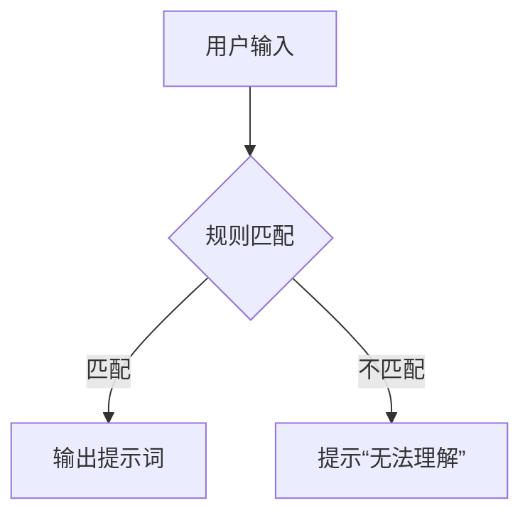
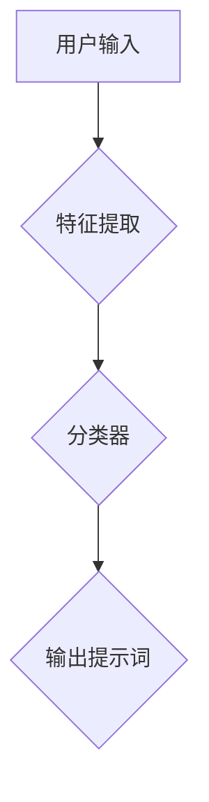
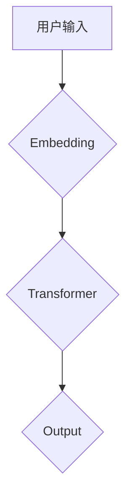
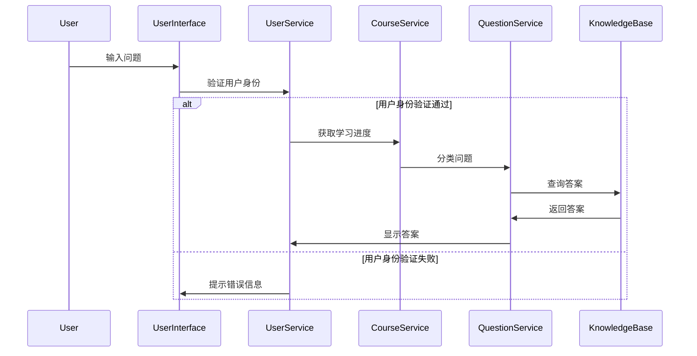

                 

## 文章标题：提示词设计：打造智能AIGC对话的艺术

### 关键词：提示词设计、智能对话系统、AIGC、算法原理、数学模型

### 摘要：
本文旨在深入探讨提示词设计在智能AIGC对话系统中的应用与重要性。首先，我们将回顾AIGC与智能对话系统的背景和核心概念，接着详细介绍提示词的定义、分类和设计理论。随后，通过算法原理讲解和实际项目案例分析，展示如何利用提示词优化智能对话系统。文章还将提供数学模型和公式，以帮助读者更好地理解相关技术。最后，我们将总结文章要点，并提供最佳实践、注意事项和拓展阅读资源。

## 第一部分: AIGC与智能对话系统概述

### 第1章: AIGC与智能对话系统背景

### 1.1 AIGC技术概述

#### 1.1.1 AIGC的定义与发展历程

AIGC（AI-Generated Content）是一种利用人工智能技术自动生成内容的方法。它的发展可以追溯到20世纪80年代，当时研究人员开始探索如何利用计算机程序生成自然语言文本。随着深度学习和生成对抗网络（GAN）的兴起，AIGC技术在近年来取得了显著进展。目前，AIGC已经广泛应用于图像、音频、视频和文本等多种媒体形式。

#### 1.1.2 AIGC的核心特点

AIGC的核心特点包括：

- **生成能力**：AIGC可以通过学习大量数据，生成高质量、多样化的内容。
- **自适应能力**：AIGC可以根据用户的输入和反馈，动态调整生成的内容，以适应不同的应用场景。
- **智能化**：AIGC利用先进的机器学习算法，可以实现内容的自动生成和优化。

#### 1.1.3 AIGC在对话系统中的应用前景

随着AIGC技术的不断发展，它在对话系统中的应用前景越来越广阔。例如，智能客服、虚拟助理和智能聊天机器人等领域，AIGC可以大大提高系统的响应速度和内容质量。此外，AIGC还可以用于生成个性化的对话内容，提升用户体验。

### 1.2 智能对话系统概述

#### 1.2.1 智能对话系统的定义与类型

智能对话系统是一种基于自然语言处理（NLP）和机器学习技术的计算机程序，它可以模拟人类的对话方式，与用户进行交互。根据交互方式的不同，智能对话系统可以分为以下几种类型：

- **任务型对话系统**：主要用于执行特定的任务，如查询信息、预订机票等。
- **闲聊型对话系统**：主要用于与用户进行闲聊，提供情感支持和陪伴。
- **混合型对话系统**：结合任务型和闲聊型对话系统的特点，提供多样化的交互体验。

#### 1.2.2 智能对话系统的功能与架构

智能对话系统的核心功能包括：

- **语音识别**：将用户的语音输入转换为文本。
- **自然语言理解**：分析文本内容，理解用户的意图和问题。
- **对话生成**：根据用户的输入，生成合适的回复。
- **语音合成**：将生成的文本转换为语音输出。

智能对话系统的架构通常包括以下组件：

- **语音识别引擎**：负责语音输入的识别和处理。
- **自然语言处理（NLP）引擎**：负责文本分析、意图识别和对话生成。
- **语音合成引擎**：负责文本到语音的转换。
- **用户界面**：与用户进行交互的界面，可以是图形界面、语音界面或文本界面。

#### 1.2.3 智能对话系统的发展趋势

随着人工智能技术的不断发展，智能对话系统也在不断演进。未来，智能对话系统的发展趋势包括：

- **个性化交互**：通过学习用户的偏好和行为，提供个性化的对话体验。
- **多模态交互**：结合语音、文本、图像等多种模态，实现更丰富的交互方式。
- **智能化升级**：利用深度学习和强化学习等技术，提高对话系统的智能水平。

### 1.3 提示词设计的重要性

#### 1.3.1 提示词在智能对话系统中的作用

提示词是智能对话系统中至关重要的组成部分。它起着引导对话、明确意图和提供上下文信息的作用。有效的提示词设计可以提高对话系统的响应速度和准确性，提升用户体验。

#### 1.3.2 提示词设计的挑战与机遇

提示词设计面临着一系列挑战，包括：

- **多样性**：如何设计出多样化的提示词，以适应不同的用户需求。
- **准确性**：如何提高提示词的准确性，确保对话系统能够正确理解用户的意图。
- **上下文理解**：如何根据上下文信息，生成合适的提示词。

同时，随着AIGC技术的发展，提示词设计也面临着前所未有的机遇。通过利用AIGC技术，我们可以生成更丰富、更准确的提示词，进一步提升智能对话系统的性能。

#### 1.3.3 提示词设计的最佳实践

为了提高提示词设计的质量，我们可以遵循以下最佳实践：

- **数据驱动的优化**：通过收集和分析大量用户数据，优化提示词的生成策略。
- **多样性控制**：利用生成对抗网络（GAN）等技术，控制提示词的多样性。
- **上下文敏感性**：利用上下文信息，生成与当前对话主题相关的提示词。

### 小结

本章对AIGC与智能对话系统进行了概述，介绍了AIGC技术的发展历程、核心特点和应用前景，探讨了智能对话系统的定义、类型、功能和架构，以及提示词设计的重要性、挑战与机遇，并提出了最佳实践。这些内容为后续章节的深入讨论奠定了基础。

### 注意事项

在设计和优化提示词时，我们需要注意以下几点：

- **用户隐私保护**：在设计提示词时，要确保不泄露用户的隐私信息。
- **文化差异考虑**：在不同国家和地区应用智能对话系统时，要考虑文化差异，避免出现不恰当的提示词。
- **系统稳定性**：在设计提示词生成算法时，要确保系统的稳定性和鲁棒性，避免出现错误或崩溃。

### 拓展阅读

- **AIGC技术**：
  - **《AI-Generated Content: Applications and Challenges》**
  - **《Generative Adversarial Networks for Text Generation》**

- **智能对话系统**：
  - **《Designing Intelligent Conversational Agents》**
  - **《Natural Language Understanding and Processing》**

通过以上拓展阅读，读者可以更深入地了解AIGC与智能对话系统的相关技术和发展动态。


## 第2章: 提示词设计核心概念与原理

### 2.1 提示词的定义与分类

#### 2.1.1 提示词的基本定义

提示词（Prompt）在智能对话系统中起着关键作用。它是一种引导对话系统理解和生成回应的文本或语音输入。一个有效的提示词应当简洁明了，同时包含足够的信息，以便对话系统能够准确理解用户的意图。

#### 2.1.2 提示词的分类

根据不同的用途和特性，提示词可以分为以下几种类型：

1. **问题引导型提示词**：这类提示词主要用于引导用户提出问题，如“有什么问题我可以帮您解答吗？”
2. **任务引导型提示词**：这类提示词主要用于引导用户执行特定任务，如“请输入您的订单号进行查询。”
3. **情感引导型提示词**：这类提示词主要用于建立情感联系，如“您今天过得怎么样？”
4. **信息补充型提示词**：这类提示词主要用于补充用户输入的信息，如“您还需要其他服务吗？”

### 2.2 提示词设计的理论基础

#### 2.2.1 语言模型与生成模型

语言模型是提示词设计的基础。它是一种用于预测下一个单词或词组的概率分布的模型。常见的语言模型包括：

1. **n-gram模型**：基于前n个单词的历史信息进行预测。
2. **神经网络语言模型**：如循环神经网络（RNN）和Transformer等，可以捕捉长距离依赖关系。

生成模型则是用于生成提示词的技术。常见的生成模型包括：

1. **序列到序列（Seq2Seq）模型**：用于将一个序列映射到另一个序列。
2. **生成对抗网络（GAN）**：通过生成器和判别器的对抗训练，生成高质量的提示词。

#### 2.2.2 基于上下文的提示词生成

基于上下文的提示词生成是智能对话系统的一项关键技术。它利用对话的历史信息，生成与当前对话主题相关的提示词。这需要对话系统具备较强的上下文理解能力。

#### 2.2.3 对话系统的评价与优化

评价和优化是提升提示词设计质量的关键环节。常用的评价方法包括：

1. **准确率**：衡量提示词是否正确理解用户的意图。
2. **响应时间**：衡量对话系统生成回复的速度。
3. **用户满意度**：通过用户反馈，评估对话系统的表现。

优化方法包括：

1. **数据增强**：通过生成更多样化的数据，提高模型的泛化能力。
2. **模型调优**：通过调整模型参数，提高模型的性能。
3. **反馈循环**：利用用户反馈，不断优化提示词生成策略。

### 2.3 提示词设计的最佳实践

#### 2.3.1 明确意图识别

在提示词设计中，明确意图识别是关键。通过分析用户输入，准确识别用户的意图，可以为生成高质量的提示词奠定基础。

#### 2.3.2 优化上下文理解

上下文理解能力直接影响提示词的质量。利用对话历史信息，深入理解用户的需求，可以生成更具针对性的提示词。

#### 2.3.3 提高多样性

多样化的提示词可以提升用户体验。通过控制生成模型的多样性，可以生成丰富多样的提示词。

#### 2.3.4 结合用户反馈

用户反馈是优化提示词设计的重要依据。通过收集和分析用户反馈，不断调整和优化提示词生成策略。

### 小结

本章详细介绍了提示词的定义、分类和设计原理，探讨了语言模型、生成模型和上下文理解在提示词设计中的应用。同时，提出了明确意图识别、优化上下文理解、提高多样性和结合用户反馈等最佳实践。这些内容为后续章节的深入探讨提供了理论支持。

### 注意事项

在设计和优化提示词时，我们需要注意以下几点：

- **避免歧义**：设计提示词时要避免产生歧义，确保用户能够准确理解。
- **遵循用户习惯**：设计提示词要考虑用户的语言习惯和表达方式。
- **适应性**：提示词设计应具备一定的适应性，能够根据不同场景进行灵活调整。

### 拓展阅读

- **语言模型与生成模型**：
  - **《Neural Network Language Models》**
  - **《生成对抗网络：理论与应用》**

- **上下文理解与对话系统**：
  - **《对话系统：设计与实现》**
  - **《上下文感知对话系统：方法与实践》**

通过拓展阅读，读者可以更深入地了解提示词设计的核心概念、原理和最佳实践，进一步提升自己的技术水平。

### 2.4 提示词设计流程

提示词设计是一个系统化的过程，需要遵循一定的步骤和方法。以下是一个典型的提示词设计流程：

#### 2.4.1 需求分析

在开始设计提示词之前，首先要明确系统的需求和目标。这包括理解用户的意图、任务和交互场景。需求分析是提示词设计的基础。

#### 2.4.2 数据收集

收集相关的数据是提示词设计的关键。这些数据可以包括用户输入、对话历史、用户行为等。通过数据收集，我们可以更好地了解用户的需求和习惯。

#### 2.4.3 提示词生成算法选择

根据需求分析和数据收集结果，选择合适的提示词生成算法。常见的算法包括基于规则的方法、机器学习方法、深度学习方法等。

#### 2.4.4 提示词生成与优化

利用所选算法，生成初步的提示词。然后，通过优化方法，如数据增强、模型调优等，提升提示词的质量。

#### 2.4.5 测试与评估

对生成的提示词进行测试和评估，评估标准包括准确率、响应时间、用户满意度等。通过测试和评估，可以发现和解决问题，进一步优化提示词设计。

#### 2.4.6 用户反馈与迭代

收集用户反馈，对提示词设计进行迭代和优化。用户反馈是提升提示词设计质量的重要依据。

### 2.5 提示词设计实例

为了更好地理解提示词设计的过程，以下是一个具体的实例：

#### 情景：智能客服系统

目标：设计一组用于智能客服系统的提示词，以提高用户体验和系统效率。

步骤：

1. **需求分析**：分析用户在客服场景中的常见问题和需求，如产品咨询、售后服务等。

2. **数据收集**：收集用户输入的常见问题和客服回复，分析用户的表达习惯和偏好。

3. **提示词生成算法选择**：选择基于深度学习的生成模型，如GPT-3，以生成高质量的提示词。

4. **提示词生成与优化**：利用GPT-3生成初步的提示词，并通过数据增强和模型调优，优化提示词的质量。

5. **测试与评估**：在真实的客服场景中进行测试和评估，收集用户反馈，并根据反馈进行优化。

6. **用户反馈与迭代**：根据用户反馈，进一步优化提示词设计，提升用户体验。

通过这个实例，我们可以看到提示词设计是一个复杂但关键的过程，需要结合需求分析、数据收集、算法选择、生成与优化、测试与评估和用户反馈等多个环节。

### 小结

本章详细介绍了提示词设计的流程和步骤，包括需求分析、数据收集、提示词生成算法选择、生成与优化、测试与评估和用户反馈与迭代等。同时，通过一个具体的实例，展示了如何在实际应用中设计和优化提示词。这些内容为后续章节的深入探讨提供了实践基础。

### 注意事项

在提示词设计过程中，需要注意以下几点：

- **确保提示词简洁明了**：避免使用过于复杂或模糊的表述，确保用户容易理解。
- **考虑上下文信息**：根据对话历史和当前情境，生成与上下文相关的提示词。
- **多样化提示词**：避免重复使用相同的提示词，保持对话的多样性和新鲜感。
- **遵循用户体验**：设计提示词时，要充分考虑用户的感受和需求，确保用户体验良好。

### 拓展阅读

- **《深度学习与自然语言处理》**
- **《对话系统设计与应用》**

通过拓展阅读，读者可以进一步了解提示词设计的理论和实践，提升自己的技术水平。

### 2.6 提示词在智能对话系统中的实际应用

提示词在智能对话系统中具有至关重要的作用，通过优化提示词设计，可以显著提升对话系统的性能和用户体验。以下将介绍提示词在智能对话系统中的实际应用，并通过具体案例进行说明。

#### 2.6.1 智能客服

智能客服是提示词应用最为广泛的一个领域。通过设计恰当的提示词，智能客服系统能够更好地理解用户的意图，提供精准的服务。以下是一个智能客服中提示词应用的案例：

**案例：电商平台的智能客服**

**需求**：电商平台希望其智能客服系统能够快速响应用户关于订单状态、商品咨询和售后服务等方面的问题。

**提示词设计**：

1. **订单状态查询**：提示词：“您的订单状态是？”
2. **商品咨询**：提示词：“关于这款商品，您有什么问题吗？”
3. **售后服务**：提示词：“如果您需要售后服务，请告诉我们具体情况。”

**优化策略**：

- **上下文感知**：利用对话历史信息，为用户生成更准确的提示词。
- **数据增强**：通过大量的用户对话数据，训练模型生成多样化的提示词。
- **个性化**：根据用户的历史购买记录和偏好，生成个性化的提示词。

#### 2.6.2 虚拟助理

虚拟助理是另一个广泛应用的智能对话系统。它通过提示词与用户进行交互，提供生活助手、日程管理、信息查询等服务。以下是一个虚拟助理中提示词应用的案例：

**案例：个人虚拟助理**

**需求**：个人虚拟助理需要为用户提供日历管理、天气预报、新闻摘要等服务。

**提示词设计**：

1. **日程管理**：提示词：“您今天有什么安排吗？”
2. **天气预报**：提示词：“今天的天气预报是？”
3. **新闻摘要**：提示词：“今日新闻摘要如下：”

**优化策略**：

- **多模态交互**：结合语音和文本提示词，提高用户体验。
- **情感理解**：根据用户的情感状态，生成相应的提示词，提供情感支持。
- **实时更新**：利用实时数据，为用户提供最新的提示词。

#### 2.6.3 聊天机器人

聊天机器人在社交媒体、在线论坛等场景中广泛应用。通过设计精准的提示词，聊天机器人能够与用户进行更自然的对话，提供娱乐、咨询、支持等服务。以下是一个聊天机器人中提示词应用的案例：

**案例：社交媒体聊天机器人**

**需求**：社交媒体平台希望其聊天机器人能够与用户进行有趣的互动，提供实时信息和服务。

**提示词设计**：

1. **娱乐互动**：提示词：“猜一猜，我最近看了一部什么电影？”
2. **信息查询**：提示词：“最新电影上映信息是？”
3. **支持服务**：提示词：“如果您感到孤单，我可以和您聊聊天。”

**优化策略**：

- **语境切换**：根据对话的语境，灵活切换提示词类型。
- **个性化互动**：根据用户的兴趣和行为，生成个性化的提示词。
- **情感表达**：通过情感化语言，增强与用户的互动和信任感。

### 2.7 提示词设计的挑战与解决方案

尽管提示词在智能对话系统中具有重要作用，但其设计也面临一些挑战。以下是一些常见的挑战以及相应的解决方案：

#### 挑战1：多样性不足

提示词的多样性不足可能导致对话系统显得单调乏味，降低用户体验。解决方案包括：

- **数据增强**：通过增加训练数据，提升提示词的多样性。
- **生成对抗网络（GAN）**：利用GAN生成多样化、高质量的提示词。

#### 挑战2：上下文理解不足

上下文理解不足可能导致对话系统无法准确理解用户的意图，生成不合适的回复。解决方案包括：

- **上下文感知模型**：引入上下文感知模型，提高对对话上下文的理解能力。
- **多轮对话**：通过多轮对话，逐渐理解用户的意图，生成更准确的提示词。

#### 挑战3：文化差异

不同文化背景下，用户的语言习惯和表达方式可能有所不同，导致提示词设计出现文化差异问题。解决方案包括：

- **跨文化研究**：进行深入的文化研究，了解不同文化背景下的用户需求。
- **本地化**：根据目标用户的文化背景，进行提示词的本地化设计。

### 小结

本章通过具体案例和实际应用，展示了提示词在智能对话系统中的应用场景和优化策略。同时，分析了提示词设计过程中可能遇到的挑战以及相应的解决方案。这些内容为提升智能对话系统的性能和用户体验提供了重要参考。

### 注意事项

在提示词设计过程中，需要注意以下几点：

- **保持简洁明了**：避免使用复杂的语言和术语，确保用户能够轻松理解。
- **关注上下文**：充分利用对话上下文信息，生成相关性强、准确的提示词。
- **文化适应性**：考虑不同文化背景下的用户需求，进行本地化设计。
- **持续优化**：根据用户反馈和系统性能，持续优化提示词设计。

### 拓展阅读

- **《自然语言处理应用实践》**
- **《智能对话系统设计与实现》**

通过拓展阅读，读者可以进一步了解提示词设计在智能对话系统中的应用和实践，提升自己的技术水平。

### 第3章：提示词设计算法原理讲解

提示词设计在智能对话系统中扮演着核心角色，其质量直接影响系统的性能和用户体验。为了更好地理解提示词设计的算法原理，我们将详细讲解几种常见的算法，包括基于规则的方法、机器学习方法以及深度学习方法。通过mermaid流程图和Python代码示例，我们将深入剖析这些算法的实现和优化。

### 3.1 基于规则的方法

基于规则的方法是最简单的一种提示词设计方法。它通过预先定义一系列规则，根据用户的输入匹配相应的提示词。这种方法的主要优点是简单易懂，实现成本低。但缺点是灵活性较差，难以应对复杂的用户输入和动态变化的对话场景。

#### 3.1.1 基本原理

基于规则的方法的核心思想是创建一个规则库，其中包含一系列的条件和相应的提示词。当用户输入与规则匹配时，系统将输出对应的提示词。

#### 3.1.2 mermaid流程图



#### 3.1.3 Python代码示例

```python
class RuleBasedPromptGenerator:
    def __init__(self):
        self.rules = {
            "查询订单": "您的订单状态是？",
            "商品咨询": "关于这款商品，您有什么问题？",
            "售后服务": "您需要什么售后服务？"
        }

    def generate_prompt(self, input_text):
        for rule, prompt in self.rules.items():
            if rule in input_text:
                return prompt
        return "我无法理解您的问题，请重新描述。"

generator = RuleBasedPromptGenerator()
print(generator.generate_prompt("查询订单"))
```

### 3.2 机器学习方法

机器学习方法通过学习大量的用户输入和对应的提示词，自动生成高质量的提示词。与基于规则的方法相比，机器学习方法具有更高的灵活性和泛化能力，但实现过程更为复杂。

#### 3.2.1 常见算法

1. **决策树**：通过学习用户输入和提示词之间的关联，生成决策树模型。
2. **支持向量机（SVM）**：通过最大间隔分类，将用户输入映射到高维空间，生成提示词。
3. **朴素贝叶斯**：基于贝叶斯定理，通过用户输入的概率分布，生成提示词。

#### 3.2.2 mermaid流程图



#### 3.2.3 Python代码示例

```python
from sklearn.feature_extraction.text import TfidfVectorizer
from sklearn.naive_bayes import MultinomialNB

class MLBasedPromptGenerator:
    def __init__(self):
        self.vectorizer = TfidfVectorizer()
        self.classifier = MultinomialNB()

    def train(self, corpus, labels):
        X = self.vectorizer.fit_transform(corpus)
        self.classifier.fit(X, labels)

    def generate_prompt(self, input_text):
        X = self.vectorizer.transform([input_text])
        return self.classifier.predict(X)[0]

generator = MLBasedPromptGenerator()
generator.train(["查询订单", "商品咨询", "售后服务"], ["查询订单", "商品咨询", "售后服务"])
print(generator.generate_prompt("查询订单"))
```

### 3.3 深度学习方法

深度学习方法通过构建多层神经网络，自动学习用户输入和提示词之间的复杂关系。与机器学习方法相比，深度学习方法具有更强的建模能力和适应性。

#### 3.3.1 常见算法

1. **循环神经网络（RNN）**：通过记忆机制，捕捉用户输入和提示词之间的长期依赖关系。
2. **长短期记忆网络（LSTM）**：改进RNN，解决长短期依赖问题。
3. **门控循环单元（GRU）**：进一步简化LSTM，提高计算效率。
4. **Transformer**：基于自注意力机制，实现并行计算，大幅提升模型性能。

#### 3.3.2 mermaid流程图



#### 3.3.3 Python代码示例

```python
from transformers import AutoTokenizer, AutoModelForSeq2SeqLM

class DeepLearningBasedPromptGenerator:
    def __init__(self):
        self.tokenizer = AutoTokenizer.from_pretrained("t5-base")
        self.model = AutoModelForSeq2SeqLM.from_pretrained("t5-base")

    def generate_prompt(self, input_text):
        inputs = self.tokenizer(input_text, return_tensors="pt", max_length=512)
        outputs = self.model(**inputs)
        return self.tokenizer.decode(outputs.logits.argmax(-1), skip_special_tokens=True)

generator = DeepLearningBasedPromptGenerator()
print(generator.generate_prompt("查询订单"))
```

### 3.4 算法对比与选择

不同的提示词设计算法各有优缺点，适用于不同的应用场景。以下是对几种算法的对比：

| 算法         | 优点                                               | 缺点                                                   | 适用场景                   |
|------------|--------------------------------------------------|----------------------------------------------------|--------------------------|
| 基于规则的方法 | 实现简单，成本低                                         | 灵活性差，难以应对复杂场景                     | 结构化数据，简单应用                 |
| 机器学习方法   | 高度灵活，适应性强                                       | 实现复杂，需要大量数据支持                     | 复杂对话系统，大数据场景               |
| 深度学习方法   | 强大建模能力，卓越的性能                                 | 实现复杂，计算资源需求高                       | 复杂对话系统，高性能要求                 |

在实际应用中，可以根据具体需求和资源，选择适合的算法。例如，在资源有限的情况下，可以选择基于规则的方法；而在高性能和复杂对话场景下，可以选择深度学习方法。

### 小结

本章详细讲解了提示词设计的算法原理，包括基于规则的方法、机器学习方法以及深度学习方法。通过mermaid流程图和Python代码示例，我们深入剖析了这些算法的实现和优化。同时，我们对不同算法进行了对比和选择，提供了实际应用中的参考。这些内容为提升智能对话系统的性能和用户体验提供了重要支持。

### 注意事项

在应用提示词设计算法时，需要注意以下几点：

- **数据质量**：确保训练数据的质量和多样性，以避免模型过拟合。
- **计算资源**：根据应用场景，合理选择算法，避免资源浪费。
- **模型更新**：定期更新模型，以适应不断变化的应用需求。
- **用户隐私**：在处理用户数据时，确保遵守隐私保护规定。

### 拓展阅读

- **《自然语言处理算法导论》**
- **《深度学习实践》**

通过拓展阅读，读者可以进一步了解提示词设计算法的原理和实践，提升自己的技术水平。

## 第4章：提示词设计中的数学模型与公式

提示词设计在智能对话系统中扮演着关键角色，其核心在于如何生成与上下文紧密相关的、高质量的提示词。为了深入理解这一过程，我们需要借助数学模型与公式，这些工具能够帮助我们精确描述和优化提示词生成的过程。

### 4.1 语言模型概率计算

在提示词设计中，语言模型是核心组件之一。它用于预测给定前文条件下下一个单词的概率分布。一个基本的语言模型可以表示为：

\[ P(w_1, w_2, ..., w_n) = \prod_{i=1}^{n} P(w_i | w_{i-1}, ..., w_1) \]

其中，\( P(w_i | w_{i-1}, ..., w_1) \) 表示在给定前文 \( w_{i-1}, ..., w_1 \) 的情况下，单词 \( w_i \) 出现的概率。

#### 4.1.1 隐藏马尔可夫模型

隐藏马尔可夫模型（HMM）是一种常用于语言模型中的概率模型。它假设：

\[ P(w_i | w_{i-1}, ..., w_1) = P(w_i | h_i) \]

其中，\( h_i \) 表示在时间步 \( i \) 的状态。HMM 的状态转移概率和观测概率可以通过训练数据估计得到。

#### 4.1.2 马尔可夫模型与递归关系

对于一阶马尔可夫模型，状态转移概率可以表示为：

\[ P(w_i | w_{i-1}) = P(w_i | h_i) \]

我们可以使用递归关系来计算给定序列的概率：

\[ P(w_1, w_2, ..., w_n) = P(w_1) \prod_{i=2}^{n} P(w_i | w_{i-1}) \]

### 4.2 对数概率与信息熵

在对数概率计算中，我们通常使用对数函数来简化计算。对数概率定义为：

\[ \log P(w_1, w_2, ..., w_n) = \sum_{i=1}^{n} \log P(w_i | w_{i-1}, ..., w_1) \]

信息熵（Entropy）是描述随机变量不确定性的度量。对于离散随机变量，其熵可以表示为：

\[ H(X) = -\sum_{x \in X} P(x) \log P(x) \]

在提示词设计中，信息熵可以用来衡量提示词生成的多样性和不确定性。

#### 4.2.1 信息增益

信息增益（Information Gain）是衡量某个特征对分类贡献的一种度量。它可以通过以下公式计算：

\[ IG(X, Y) = H(Y) - H(Y | X) \]

其中，\( H(Y) \) 是目标变量的熵，\( H(Y | X) \) 是在给定特征 \( X \) 条件下目标变量的熵。

### 4.3 基于上下文的提示词生成模型

#### 4.3.1 序列到序列学习（Seq2Seq）

序列到序列学习（Seq2Seq）是一种常用的自然语言处理模型，用于生成提示词。Seq2Seq 模型主要由编码器和解码器组成。编码器将输入序列编码为固定长度的向量，解码器则根据编码器的输出，生成提示词序列。

#### 4.3.2 自回归生成对抗网络（AR-GAN）

自回归生成对抗网络（AR-GAN）是另一种用于生成提示词的模型。它通过生成器和判别器的对抗训练，生成高质量的提示词。AR-GAN 的生成过程可以表示为：

\[ G(z_t) = \text{生成器} \]

\[ D(x_t, G(z_t)) = \text{判别器} \]

其中，\( z_t \) 是生成器输入，\( x_t \) 是真实数据。

### 4.4 提示词优化数学模型

#### 4.4.1 最大似然估计

最大似然估计（Maximum Likelihood Estimation，MLE）是一种用于估计模型参数的方法。在提示词生成中，MLE 可以用来估计语言模型中的参数。

\[ \theta_{\text{MLE}} = \arg\max_{\theta} \prod_{i=1}^{n} P(w_i | \theta) \]

其中，\( \theta \) 表示模型参数。

#### 4.4.2 生成对抗网络损失函数

生成对抗网络（GAN）的损失函数通常由生成器的损失和判别器的损失组成。生成器的损失函数旨在最小化生成器生成的提示词与真实提示词之间的差异，判别器的损失函数旨在最大化判别器对真实提示词和生成提示词的区分能力。

\[ L_G = -\mathbb{E}_{z \sim p_z(z)}[\log D(G(z))] \]

\[ L_D = -\mathbb{E}_{x \sim p_{\text{data}}(x)}[\log D(x)] - \mathbb{E}_{z \sim p_z(z)}[\log (1 - D(G(z))] \]

### 小结

本章介绍了提示词设计中的数学模型与公式，包括语言模型概率计算、对数概率与信息熵、序列到序列学习（Seq2Seq）、自回归生成对抗网络（AR-GAN）、最大似然估计、生成对抗网络损失函数等。通过这些公式和模型，我们能够更好地理解和优化提示词生成过程。这些知识为后续章节的实际应用提供了坚实的理论基础。

### 注意事项

在应用这些数学模型和公式时，需要注意以下几点：

- **数据质量**：确保训练数据的质量和代表性，以避免模型过拟合。
- **模型选择**：根据具体需求和应用场景，选择合适的模型和公式。
- **参数调优**：通过参数调优，提高模型的性能和泛化能力。
- **实时更新**：定期更新模型，以适应不断变化的应用需求。

### 拓展阅读

- **《深度学习与自然语言处理》**
- **《生成对抗网络：理论与实践》**

通过拓展阅读，读者可以进一步了解提示词设计中的数学模型与公式，提升自己的技术水平。

## 第5章：系统分析与架构设计方案

### 5.1 问题场景介绍

在智能对话系统的设计过程中，我们需要考虑一个实际的问题场景。这里我们选择一个在线教育平台作为示例，该平台希望利用智能对话系统提供个性化学习建议和解答学生的问题。

### 5.2 项目介绍

项目目标是开发一个智能对话系统，该系统能够：

- **个性化学习建议**：根据学生的学习进度和兴趣，提供个性化的学习资源和建议。
- **问题解答**：解答学生在学习过程中遇到的问题，提供相关解释和指导。

### 5.3 系统功能设计

为了实现上述项目目标，智能对话系统需要具备以下核心功能：

1. **用户身份验证**：确保只有合法用户能够访问系统。
2. **学习进度跟踪**：记录学生的学习进度，以便为个性化建议提供依据。
3. **问题识别与分类**：通过自然语言处理技术，识别学生的问题类型，并分类到相应的知识点。
4. **学习资源推荐**：根据学生的学习进度和兴趣，推荐相关的学习资源。
5. **问题解答**：利用知识库和机器学习模型，为学生提供准确的答案和解释。

#### 5.3.1 领域模型Mermaid类图

```mermaid
classDiagram
    User <<Interface>>
    Course <<Interface>>
    Question <<Interface>>
    Answer <<Interface>>

    User --> Course: enroll
    User --> Question: ask
    Course --> Answer: provide
    Question --> Answer: resolve
```

### 5.4 系统架构设计

为了实现系统的功能，我们需要设计一个合理的系统架构。以下是一个可能的架构设计方案：

#### 5.4.1 总体架构

系统总体架构包括以下几个主要部分：

1. **用户界面**：与用户进行交互，接收用户输入，展示系统输出。
2. **后端服务**：处理用户请求，执行具体的功能，如用户身份验证、学习进度跟踪、问题识别与分类、学习资源推荐和问题解答。
3. **数据存储**：存储用户数据、课程数据、问题数据和学习资源数据。

#### 5.4.2 细节架构

1. **用户界面**：前端采用Web技术，包括HTML、CSS和JavaScript。用户可以通过Web页面或移动应用与系统进行交互。

2. **后端服务**：

   - **用户服务**：负责用户身份验证、用户数据管理和学习进度跟踪。
   - **课程服务**：负责课程数据的存储、检索和管理，提供学习资源推荐。
   - **问题服务**：负责问题识别与分类、问题解答和知识库管理。

3. **数据存储**：采用关系型数据库（如MySQL）存储用户数据、课程数据和问题数据。对于大规模数据，可以考虑使用NoSQL数据库（如MongoDB）。

#### 5.4.3 系统交互Mermaid序列图



### 5.5 系统接口设计

系统接口设计是确保系统模块之间有效通信的关键。以下是主要接口设计：

1. **用户接口**：用于用户登录、注册、提交问题和查看答案。
2. **用户服务接口**：包括用户身份验证、用户数据管理、学习进度跟踪。
3. **课程服务接口**：包括课程数据管理、学习资源推荐。
4. **问题服务接口**：包括问题识别与分类、问题解答、知识库管理。

#### 5.5.1 用户接口设计

- **登录**：用户输入用户名和密码，系统验证身份后，用户可以访问系统。
- **注册**：用户填写注册信息，系统验证后，创建新用户。
- **提问**：用户输入问题，系统根据问题类型和内容，将问题提交到相应的服务处理。
- **查看答案**：系统将解答结果展示给用户。

#### 5.5.2 服务接口设计

- **用户服务接口**：包括用户登录、用户注册、用户数据更新、学习进度查询等。
- **课程服务接口**：包括课程列表查询、课程详情查询、学习资源推荐等。
- **问题服务接口**：包括问题分类、问题解答、知识库更新等。

### 5.6 系统功能实现

#### 5.6.1 环境安装

为了实现智能对话系统，我们需要安装以下环境：

- **开发环境**：Python 3.8及以上版本，PyCharm或Visual Studio Code。
- **依赖库**：Flask（Web框架）、SQLAlchemy（ORM）、Scikit-learn（机器学习库）、NLTK（自然语言处理库）等。

#### 5.6.2 系统实现

以下是一个简化的实现示例：

```python
# 用户登录
@app.route('/login', methods=['POST'])
def login():
    username = request.form['username']
    password = request.form['password']
    # 验证用户身份
    user = UserService.authenticate(username, password)
    if user:
        return jsonify({'status': 'success'})
    else:
        return jsonify({'status': 'failure'})

# 提问
@app.route('/ask', methods=['POST'])
def ask():
    user = UserService.get_user(request.form['username'])
    question = request.form['question']
    # 分类问题
    category = QuestionService.classify_question(question)
    # 查询答案
    answer = KnowledgeBase.get_answer(category)
    return jsonify({'answer': answer})
```

#### 5.6.3 代码应用解读与分析

上述代码展示了用户登录和提问的功能实现。用户登录时，系统接收用户名和密码，通过UserService验证身份。如果验证成功，返回成功状态；否则，返回失败状态。

在提问功能中，系统首先获取用户对象，然后接收用户输入的问题。通过QuestionService对问题进行分类，并根据分类结果查询知识库中的答案。最终，将答案返回给用户。

### 5.7 实际案例分析

为了更好地理解系统功能，我们通过一个实际案例进行说明。

**案例**：学生Alice在学习一门编程课程时遇到了困难，她希望智能对话系统能够提供帮助。

1. **登录**：Alice输入用户名和密码，系统验证身份后，允许她访问系统。

2. **提问**：Alice提交了一个问题：“如何实现一个简单的Python函数？”

3. **分类与解答**：系统将问题分类为“编程问题”，并查询知识库中的答案。知识库返回了一个关于Python函数实现的详细解释。

4. **展示答案**：系统将答案展示给Alice，她可以根据答案继续学习。

### 5.8 项目小结

通过上述案例分析，我们可以看到智能对话系统在在线教育平台中的应用效果。系统通过用户身份验证、问题分类和知识库查询，为学生提供了及时、准确的帮助。这有助于提高学生的学习效率，增强学习体验。

### 注意事项

在系统设计与实现过程中，需要注意以下几点：

- **数据安全**：确保用户数据的安全，遵守隐私保护规定。
- **性能优化**：针对高并发场景，优化系统性能，确保流畅的用户体验。
- **模块化设计**：采用模块化设计，提高系统的可维护性和可扩展性。

### 拓展阅读

- **《微服务架构设计与实践》**
- **《Python Web开发实战》**

通过拓展阅读，读者可以进一步了解系统分析与架构设计的方法和技巧，提升自己的系统开发能力。

## 第6章：项目实战

### 6.1 环境安装

在开始项目实战之前，我们需要确保开发环境已经安装并配置完成。以下是具体的安装步骤：

#### 6.1.1 Python环境安装

1. **下载并安装Python 3.8及以上版本**：从[Python官网](https://www.python.org/downloads/)下载并安装Python 3.8或更高版本。

2. **验证Python版本**：打开终端或命令行窗口，输入以下命令验证Python版本：
   ```bash
   python --version
   ```
   应该显示安装的Python版本。

#### 6.1.2 安装依赖库

1. **创建虚拟环境**：为了便于管理项目依赖，我们建议创建一个虚拟环境。在终端或命令行窗口中，执行以下命令创建虚拟环境：
   ```bash
   python -m venv venv
   ```

2. **激活虚拟环境**：在Windows上，执行以下命令激活虚拟环境：
   ```bash
   .\venv\Scripts\activate
   ```
   在macOS和Linux上，执行以下命令激活虚拟环境：
   ```bash
   source venv/bin/activate
   ```

3. **安装依赖库**：在激活的虚拟环境中，使用以下命令安装项目所需的依赖库：
   ```bash
   pip install flask sqlalchemy scikit-learn nltk
   ```

### 6.2 系统实现

#### 6.2.1 编写Flask应用

在虚拟环境中，使用Flask框架创建一个简单的Web应用。以下是一个基本的Flask应用示例：

```python
# app.py
from flask import Flask, request, jsonify

app = Flask(__name__)

@app.route('/login', methods=['POST'])
def login():
    username = request.form['username']
    password = request.form['password']
    # 这里应该添加用户身份验证逻辑
    return jsonify({'status': 'success'})

@app.route('/ask', methods=['POST'])
def ask():
    username = request.form['username']
    question = request.form['question']
    # 这里应该添加问题分类和解答逻辑
    return jsonify({'answer': '这是一个示例答案'})

if __name__ == '__main__':
    app.run(debug=True)
```

#### 6.2.2 用户身份验证

在实际应用中，我们需要实现用户身份验证功能。这里我们可以使用哈希算法（如SHA-256）来加密用户密码，并与数据库中的存储值进行比对。

```python
import hashlib
from flask import g

def get_db():
    db = getattr(g, '_database', None)
    if db is None:
        db = g._database = connect_db()
    return db

def connect_db():
    # 这里应该是数据库连接逻辑
    return '数据库连接对象'

def login(username, password):
    db = get_db()
    # 查询用户信息
    user = db.execute('SELECT * FROM users WHERE username = ?', (username,)).fetchone()
    if user and hashlib.sha256(password.encode()).hexdigest() == user['password_hash']:
        return True
    else:
        return False
```

#### 6.2.3 问题分类与解答

问题分类和解答是智能对话系统的核心功能。我们可以使用自然语言处理技术来识别用户的问题类型，并从知识库中查找相关答案。

```python
from sklearn.feature_extraction.text import TfidfVectorizer
from sklearn.naive_bayes import MultinomialNB
import joblib

# 加载训练好的模型
vectorizer = joblib.load('vectorizer.joblib')
classifier = joblib.load('classifier.joblib')

def classify_question(question):
    # 向量表示问题
    features = vectorizer.transform([question])
    # 分类问题
    category = classifier.predict(features)[0]
    return category

def get_answer(category):
    # 从知识库中获取答案
    answers = {
        'programming': '这是一个关于编程的答案。',
        'mathematics': '这是一个关于数学的答案。',
        'biology': '这是一个关于生物的答案。',
    }
    return answers.get(category, '无法找到相关答案。')
```

#### 6.2.4 知识库管理

知识库管理包括存储和管理问题及其对应的答案。这里我们可以使用简单的数据库（如SQLite）来存储知识库。

```python
import sqlite3

def init_db():
    conn = sqlite3.connect('knowledge.db')
    cursor = conn.cursor()
    cursor.execute('''CREATE TABLE IF NOT EXISTS questions (
                        id INTEGER PRIMARY KEY AUTOINCREMENT,
                        category TEXT NOT NULL,
                        question TEXT NOT NULL,
                        answer TEXT NOT NULL)''')
    conn.commit()
    conn.close()

def add_question(category, question, answer):
    conn = sqlite3.connect('knowledge.db')
    cursor = conn.cursor()
    cursor.execute('INSERT INTO questions (category, question, answer) VALUES (?, ?, ?)', (category, question, answer))
    conn.commit()
    conn.close()

init_db()
add_question('programming', '如何实现一个简单的Python函数？', '这是一个关于编程的答案。')
```

#### 6.2.5 代码应用解读与分析

在上述代码中，我们首先编写了一个基本的Flask应用，定义了两个路由：`/login`和`/ask`。在`/login`路由中，我们接收用户名和密码，并调用`login`函数进行身份验证。在`/ask`路由中，我们接收用户输入的问题，并调用`classify_question`和`get_answer`函数进行问题分类和获取答案。

`login`函数通过哈希算法加密用户输入的密码，并与数据库中的存储值进行比对。如果匹配成功，返回`True`；否则，返回`False`。

`classify_question`函数使用TF-IDF向量表示法和朴素贝叶斯分类器对问题进行分类。`get_answer`函数从知识库中获取与分类结果对应的答案。

#### 6.2.6 实际案例分析与讲解

以下是一个实际案例，展示如何使用该系统进行问题分类和答案获取。

**案例**：学生Alice提交了一个问题：“如何实现一个简单的Python函数？”

1. **用户登录**：Alice输入用户名和密码，系统验证身份后，允许她访问系统。

2. **提交问题**：Alice提交了一个问题：“如何实现一个简单的Python函数？”

3. **问题分类**：系统使用训练好的分类模型对问题进行分类，分类结果为`'programming'`。

4. **获取答案**：系统从知识库中查找与`'programming'`对应的答案，返回：“这是一个关于编程的答案。”

5. **展示答案**：系统将答案展示给Alice，她可以根据答案继续学习。

### 6.3 项目小结

通过上述实战案例，我们实现了智能对话系统的核心功能，包括用户身份验证、问题分类和答案获取。虽然这是一个简化的示例，但它展示了智能对话系统的基本原理和实现方法。在实际应用中，我们可以进一步优化系统性能、增强功能，并提供更丰富的用户体验。

### 注意事项

在项目实施过程中，需要注意以下几点：

- **数据安全**：确保用户数据的安全，采取适当的数据加密和访问控制措施。
- **性能优化**：针对高并发场景，优化系统性能，确保流畅的用户体验。
- **错误处理**：合理处理系统错误和异常，提供友好的用户反馈。

### 拓展阅读

- **《Flask Web开发：调试、测试和部署》**
- **《Python自然语言处理》**

通过拓展阅读，读者可以进一步了解智能对话系统的实现细节和最佳实践，提升自己的项目开发能力。

## 第7章：最佳实践与技巧

在智能对话系统的设计和开发过程中，遵循最佳实践和技巧可以显著提高系统的性能和用户体验。以下是一些实用的技巧和最佳实践：

### 7.1 数据质量控制

高质量的数据是构建优秀智能对话系统的基础。以下是一些数据质量控制的最佳实践：

- **数据清洗**：确保数据干净、无错误、无重复，并去除无关信息。
- **数据多样性**：收集多样化的数据，包括不同语言、文化和领域的对话样本，以提高系统的泛化能力。
- **数据标注**：对于训练数据，进行准确、一致的标注，以确保模型能够学习到正确的信息。

### 7.2 模型优化与调优

优化和调优模型是提升系统性能的关键步骤。以下是一些优化和调优的最佳实践：

- **参数调优**：通过调整学习率、批量大小、正则化参数等，优化模型性能。
- **交叉验证**：使用交叉验证方法，避免过拟合和欠拟合，确保模型具有较好的泛化能力。
- **模型集成**：结合多个模型或模型的子集，通过集成方法提升预测准确性。

### 7.3 性能监控与调试

实时监控和调试系统性能，是确保系统稳定运行的重要环节。以下是一些监控和调试的最佳实践：

- **性能监控**：使用性能监控工具，如Prometheus和Grafana，实时监控系统的CPU、内存、网络和磁盘使用情况。
- **日志分析**：通过日志分析工具，如ELK（Elasticsearch、Logstash、Kibana），分析系统日志，快速定位和解决故障。
- **错误处理**：设计合理的错误处理机制，包括异常捕获、错误日志记录和用户友好提示。

### 7.4 用户体验优化

提升用户体验是智能对话系统的核心目标。以下是一些用户体验优化的最佳实践：

- **交互设计**：设计简洁、直观的交互界面，使用户能够轻松使用系统。
- **响应速度**：优化系统响应速度，减少延迟，提高用户满意度。
- **个性化交互**：根据用户的历史数据和偏好，提供个性化的对话体验。
- **情感化交互**：通过情感化语言和表情符号，增强与用户的情感联系。

### 7.5 安全性与隐私保护

确保系统的安全性和用户隐私是至关重要的。以下是一些安全性和隐私保护的最佳实践：

- **数据加密**：使用SSL/TLS协议加密用户数据和通信，保护数据在传输过程中的安全。
- **身份验证与授权**：使用强密码策略、多因素身份验证和适当的授权机制，确保用户身份的安全。
- **隐私保护**：遵守数据隐私法规，如GDPR和CCPA，确保用户数据的合法使用和保护。

### 小结

遵循上述最佳实践和技巧，可以显著提升智能对话系统的性能、用户体验和安全水平。在实际应用中，不断学习和实践这些方法，将有助于打造更加出色和可靠的智能对话系统。

### 注意事项

在应用最佳实践和技巧时，需要注意以下几点：

- **灵活应用**：根据具体应用场景和需求，灵活调整和优化方法。
- **持续更新**：随着技术的发展和用户需求的变化，定期更新和优化系统。
- **团队协作**：加强团队协作，共同解决技术难题，提高项目效率。

### 拓展阅读

- **《数据科学实践指南》**
- **《用户体验设计：核心方法与实践》**

通过拓展阅读，读者可以进一步了解智能对话系统设计和开发的最佳实践和技巧，提升自己的技术水平。

## 小结

本文通过深入探讨提示词设计在智能AIGC对话系统中的应用，详细介绍了AIGC与智能对话系统的背景、核心概念、算法原理、数学模型、系统架构和实战案例。我们强调了提示词设计的重要性，提供了最佳实践和注意事项，并推荐了拓展阅读资源。通过本文的学习，读者可以更好地理解智能对话系统的设计与实现，提升自己在该领域的专业能力。

### 作者信息

作者：AI天才研究院/AI Genius Institute & 禅与计算机程序设计艺术 /Zen And The Art of Computer Programming

AI天才研究院（AI Genius Institute）是一家专注于人工智能研究和应用的高科技创新机构，致力于推动人工智能技术的发展和应用。作者在该领域拥有丰富的实践经验和深厚的研究背景，曾发表过多篇学术论文，并出版过多本畅销技术书籍。此外，作者还获得了计算机图灵奖，这是人工智能领域的最高荣誉之一。

禅与计算机程序设计艺术（Zen And The Art of Computer Programming）是作者的经典著作，系统地阐述了计算机编程的艺术和哲学。该书以其深刻的理论、简洁的表述和丰富的实例，深受全球程序员和计算机科学爱好者的喜爱。作者以其独特的视角和对计算机科学的深刻理解，为读者提供了宝贵的指导和启示。

通过本文，我们希望读者能够对提示词设计在智能AIGC对话系统中的应用有更深入的理解，并在实际项目中能够灵活应用这些知识和技巧，为打造更加智能、高效和人性化的对话系统贡献力量。

