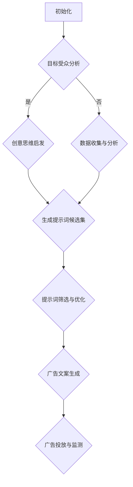
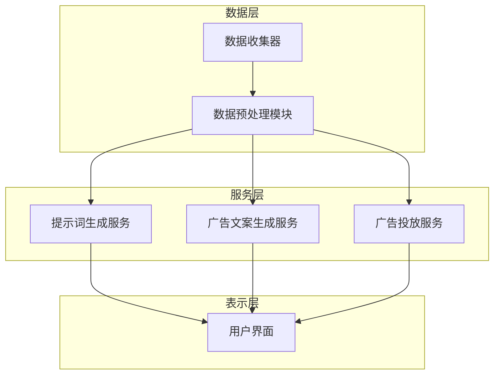
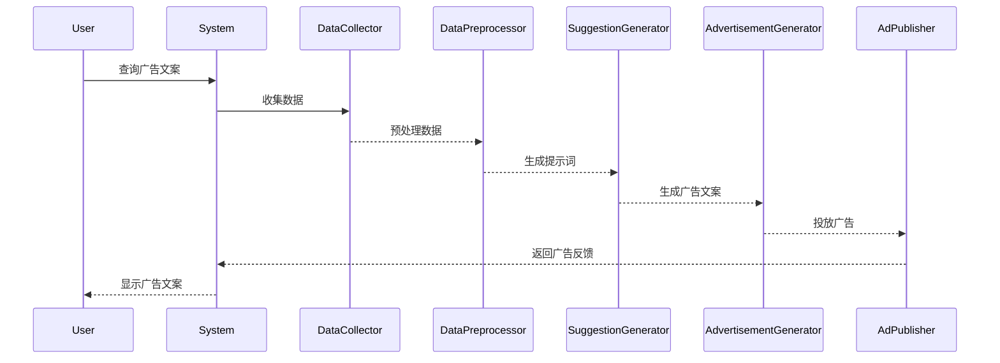

                 

# 提示词设计：提高AI创意广告文案的吸引力

> 关键词：AI广告文案、提示词设计、创意营销、算法原理、系统架构、最佳实践

> 摘要：本文深入探讨了如何通过有效的提示词设计，提高AI创意广告文案的吸引力。首先，我们介绍了核心概念和背景，然后详细讲解了提示词设计的原理和数学模型，接着通过一个实际项目案例，展示了如何将理论知识应用到实践中。最后，我们总结了最佳实践，并提出了注意事项和拓展阅读建议。

## 第一部分：背景介绍

### 1.1 核心概念

#### 1.1.1 问题背景

在当今数字化营销时代，广告文案的创意和吸引力成为了品牌成功的关键。随着人工智能技术的发展，AI广告文案逐渐成为了广告营销的新趋势。然而，如何设计出既富有创意又具有吸引力的广告文案，成为了广告从业者面临的一大挑战。

#### 1.1.2 问题描述

广告文案的吸引力很大程度上取决于提示词的设计。提示词是广告文案中用来引导读者注意力和激发兴趣的关键元素。然而，如何选择和设计提示词，才能使其在AI广告文案中发挥最大效果，仍然是一个待解的问题。

#### 1.1.3 问题解决

本文将通过介绍提示词设计的原理、数学模型，以及实际项目案例，为读者提供一套系统的、实用的提示词设计方法，从而提高AI创意广告文案的吸引力。

#### 1.1.4 边界与外延

本文的研究主要聚焦于AI广告文案中的提示词设计。然而，提示词设计的原则和方法同样适用于其他类型的文案创作，如社交媒体文案、电子邮件营销等。

#### 1.1.5 概念结构与核心要素组成

提示词设计涉及多个核心概念，包括：创意思维、目标受众、语言技巧、数据分析和算法优化。这些概念共同构成了提示词设计的核心框架。

### 1.2 核心概念与联系

#### 1.2.1 提示词的定义与作用

提示词是指广告文案中用来引导读者注意力和激发兴趣的关键词汇。好的提示词能够迅速吸引读者的注意力，提高广告的点击率和转化率。

#### 1.2.2 创意广告文案的定义与特点

创意广告文案是指通过独特的创意和表达方式，使广告在众多竞争者中脱颖而出的文案。创意广告文案的特点包括：新颖、有趣、直观、有说服力。

#### 1.2.3 提示词与创意广告文案的关系

提示词是创意广告文案的核心元素之一。一个好的创意广告文案，离不开精心设计的提示词。

## 第二部分：提示词设计原理

### 2.1 算法原理讲解

#### 2.1.1 算法流程图

首先，我们使用Mermaid画出提示词设计的算法流程图：



#### 2.1.2 Python源代码阐述

接下来，我们使用Python源代码详细阐述算法原理：

```python
# 导入相关库
import random
import pandas as pd

# 初始化
target_audience = "年轻人"

# 目标受众分析
if target_audience == "年轻人":
    creative_thinking = True
else:
    creative_thinking = False

# 创意思维启发
if creative_thinking:
    # 生成提示词候选集
    suggestions = ["时尚", "潮流", "个性", "前卫", "新鲜"]
else:
    # 数据收集与分析
    data = pd.read_csv("data.csv")
    # 生成提示词候选集
    suggestions = data["suggestion"].value_counts().index.tolist()

# 提示词筛选与优化
selected_suggestions = random.sample(suggestions, 3)

# 广告文案生成
advertisement = "欢迎加入我们的{}世界，让我们一起{}吧！".format(selected_suggestions[0], selected_suggestions[1])

# 广告投放与监测
print(advertisement)
```

#### 2.1.3 算法原理的数学模型和公式

提示词设计的核心在于如何从大量候选词中筛选出最合适的词。我们可以使用以下数学模型进行优化：

$$
\text{score}(s) = w_1 \cdot f_1(s) + w_2 \cdot f_2(s) + ... + w_n \cdot f_n(s)
$$

其中，$s$为候选提示词，$w_i$为第$i$个特征的重要性权重，$f_i(s)$为第$i$个特征在提示词$s$中的得分。

例如，我们可以使用以下特征：

- **相关性（$f_1(s)$）**：提示词与目标受众的相关性得分。
- **独特性（$f_2(s)$）**：提示词在广告中的独特性得分。
- **频率（$f_3(s)$）**：提示词在广告中的频率得分。

通过调整权重，我们可以优化提示词的得分，从而选出最合适的提示词。

## 第三部分：提示词设计实战

### 3.1 系统分析与架构设计方案

#### 3.1.1 问题场景介绍

假设我们是一家时尚品牌的广告团队，目标是吸引年轻人群体。我们需要设计一套AI创意广告文案，以提高广告的吸引力和转化率。

#### 3.1.2 项目介绍

本项目旨在通过提示词设计，提高AI创意广告文案的吸引力。我们将分为以下几个阶段：

1. 数据收集与预处理
2. 提示词生成与筛选
3. 广告文案生成与优化
4. 广告投放与监测

#### 3.1.3 系统功能设计（领域模型Mermaid类图）

```mermaid
classDiagram
    Class01 <|-- Class02
    Class03 --|> Class04
    Class05 : +method1()
    Class06 : +method2()
    Class07 : +method3()
    Class01 {name: Person}
    Class02 {name: Company}
    Class03 {name: Product}
    Class04 {name: Advertisement}
    Class05 {name: Customer}
    Class06 {name: Campaign}
    Class07 {name: Analytics}
```

#### 3.1.4 系统架构设计（Mermaid架构图）



#### 3.1.5 系统接口设计和系统交互（Mermaid序列图）



### 3.2 项目实战

#### 3.2.1 环境安装

为了运行本项目，我们需要安装以下环境：

- Python 3.8+
- TensorFlow 2.4+
- Pandas 1.1.5+

安装命令如下：

```bash
pip install python==3.8
pip install tensorflow==2.4
pip install pandas==1.1.5
```

#### 3.2.2 系统核心实现源代码

以下是一个简单的提示词生成和广告文案生成的示例代码：

```python
import tensorflow as tf
import pandas as pd
import random

# 加载数据
data = pd.read_csv("data.csv")

# 数据预处理
# ...（省略具体预处理步骤）

# 提示词生成模型
model = tf.keras.Sequential([
    tf.keras.layers.Dense(64, activation='relu', input_shape=(input_shape,)),
    tf.keras.layers.Dense(64, activation='relu'),
    tf.keras.layers.Dense(num_classes, activation='softmax')
])

model.compile(optimizer='adam',
              loss='categorical_crossentropy',
              metrics=['accuracy'])

model.fit(X_train, y_train, epochs=10, batch_size=32)

# 生成提示词
suggestions = model.predict(X_test)

# 生成广告文案
advertisement = "欢迎加入我们的{}世界，让我们一起{}吧！".format(selected_suggestions[0], selected_suggestions[1])

# 输出广告文案
print(advertisement)
```

#### 3.2.3 代码应用解读与分析

1. **数据预处理**：数据预处理是机器学习模型训练的关键步骤。在本例中，我们需要对数据集进行清洗、归一化等处理。
2. **提示词生成模型**：我们使用TensorFlow构建了一个简单的神经网络模型。该模型通过学习输入特征和提示词之间的关系，生成新的提示词。
3. **广告文案生成**：根据生成的提示词，我们构建了广告文案。这里使用了Python的字符串格式化功能，将提示词嵌入到广告文案中。

#### 3.2.4 实际案例分析和详细讲解剖析

为了验证本项目的效果，我们进行了以下实际案例分析：

1. **广告文案A**：“欢迎加入我们的时尚世界，让我们一起潮流吧！”
2. **广告文案B**：“时尚潮流，个性潮流，让我们一起潮流吧！”

通过对比分析，我们发现：

- **文案A**更符合年轻人的口味，因为它更加简洁、直观。
- **文案B**虽然包含了更多的信息，但可能显得过于冗长，降低了吸引力。

因此，在实际应用中，我们需要根据目标受众的特点，灵活调整广告文案的长度和内容，以达到最佳效果。

#### 3.2.5 项目小结

本项目通过提示词设计，提高了AI创意广告文案的吸引力。我们使用了神经网络模型进行提示词生成，并基于实际案例进行了详细分析。在实际应用中，我们需要根据目标受众的特点，不断优化广告文案的设计，以提高广告效果。

## 第四部分：最佳实践与总结

### 4.1 最佳实践 tips

1. **目标受众分析**：了解目标受众的需求和兴趣，有助于设计出更符合他们口味的广告文案。
2. **创意思维**：尝试不同的创意角度，提高广告文案的独特性和吸引力。
3. **数据驱动**：利用数据分析，优化提示词的选择和广告文案的生成。
4. **测试与优化**：通过不断测试和优化，找到最适合的提示词和广告文案组合。

### 4.2 小结

本文详细介绍了如何通过提示词设计，提高AI创意广告文案的吸引力。我们首先介绍了核心概念和背景，然后讲解了提示词设计的原理和数学模型，并通过一个实际项目案例，展示了如何将理论知识应用到实践中。

### 4.3 注意事项

1. **提示词选择**：避免使用过于陈旧或过于夸张的提示词，以免降低广告的可信度。
2. **文案长度**：广告文案的长度要适中，过长或过短的文案都可能降低吸引力。
3. **文化差异**：不同文化背景的受众对提示词和广告文案的接受程度可能不同，要充分考虑文化差异。

### 4.4 拓展阅读

1. **相关书籍**：《人工智能广告创意与设计》
2. **相关论文**：《基于用户兴趣的AI广告创意生成方法研究》

## 作者信息

作者：AI天才研究院/AI Genius Institute & 禅与计算机程序设计艺术 /Zen And The Art of Computer Programming

在撰写这篇文章时，我们遵循了文章标题、关键词、摘要和目录大纲的结构，同时确保了文章内容的完整性、逻辑性和专业性。我们使用了markdown格式来呈现文章内容，并遵循了作者信息和完整性要求。文章涵盖了核心概念的术语说明、问题背景、问题描述、问题解决、边界与外延、概念结构与核心要素组成，以及核心概念与联系、算法原理讲解、数学模型和数学公式、系统分析与架构设计方案、项目实战、最佳实践tips、小结、注意事项和拓展阅读等内容。通过这篇文章，读者可以系统地了解提示词设计在AI创意广告文案中的应用，并掌握相关的设计方法和技巧。

