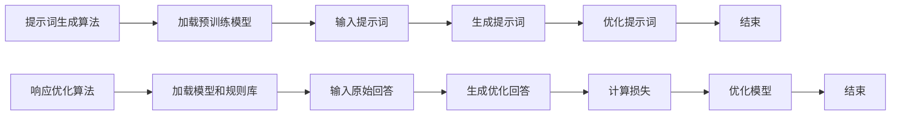
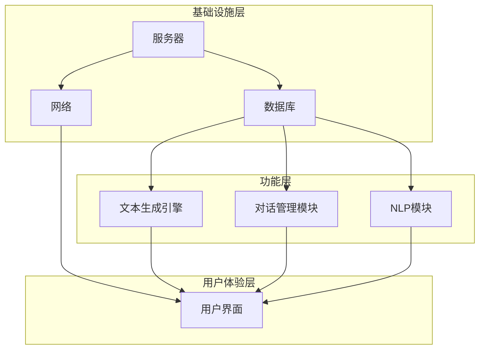
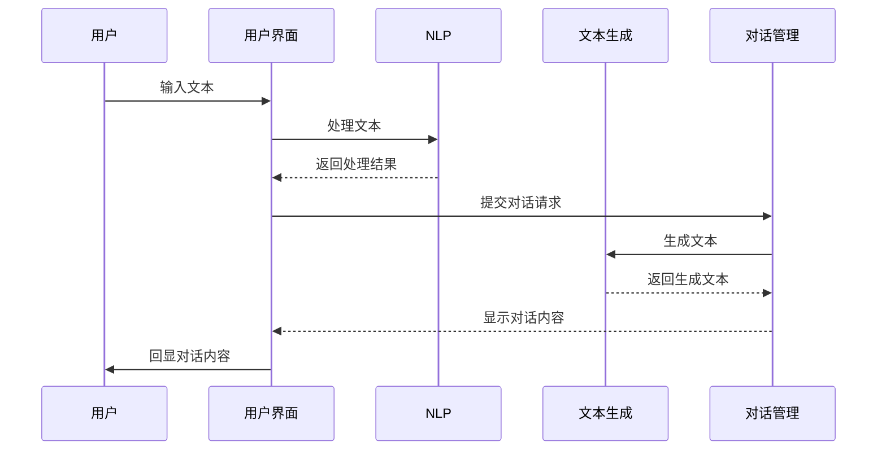

                 


### 引言：智能AIGC对话系统的崛起

在数字化时代的浪潮下，人工智能（AI）技术正以前所未有的速度发展。其中，自动生成内容（AIGC，Automatically Generated Content）作为一种新兴的AI应用，正逐步改变着我们的生活方式和工作方式。AIGC通过机器学习算法自动生成文本、图像、音频和视频等内容，而智能AIGC对话系统则进一步提升了这一技术的应用价值。

智能AIGC对话系统，顾名思义，是一种能够与人类进行自然语言交互的系统。它不仅仅能够理解用户的提问，还能根据上下文生成连贯、有逻辑的回答，为用户提供个性化的服务。这种系统在客户服务、智能助手、在线教育、游戏娱乐等多个领域展现出强大的应用潜力。

然而，构建一个高效的智能AIGC对话系统并非易事。提示词设计成为其中的核心要素。提示词，即对话系统中的关键词或短语，是系统理解用户意图、生成合适回答的关键。一个好的提示词设计，能够提升对话系统的响应速度和准确度，从而提高用户体验。

本文将围绕提示词设计展开讨论，通过以下几个关键步骤来深入分析：

1. **问题背景**：介绍AI与AIGC的兴起背景，以及对话系统的发展现状。
2. **核心概念与联系**：定义提示词、AIGC对话系统的基本构成，并通过表格和ER图进行概念解析。
3. **算法原理讲解**：详细讲解提示词生成与对话系统响应优化的算法原理，并辅以Python源代码和LaTeX数学公式。
4. **系统分析与架构设计方案**：介绍项目场景、系统功能设计、系统架构设计、系统接口设计和系统交互。
5. **项目实战**：提供环境安装指南、系统核心实现源代码，并分析实际案例。
6. **最佳实践与总结**：总结全文要点，提供实用技巧和拓展知识。

通过这些步骤，我们将逐步揭示提示词设计在智能AIGC对话系统构建中的重要性，并探索如何通过科学的设计方法提高对话系统的性能。

### 问题背景

智能AIGC对话系统的兴起源于人工智能技术的迅猛发展。在过去几十年里，AI技术从理论探讨逐步走向实际应用，通过深度学习、自然语言处理（NLP）等技术的进步，AI系统在理解人类语言和生成自然语言方面取得了显著突破。

首先，让我们回顾AI与AIGC的发展历程。早在20世纪50年代，人工智能的概念被首次提出，随后的几十年里，AI经历了多次起伏。进入21世纪，随着大数据、云计算、深度学习等技术的出现，AI迎来了新一轮的发展高潮。深度学习作为一种重要的机器学习技术，通过模拟人脑神经网络结构，使得计算机能够自动从大量数据中学习规律，实现图像识别、语音识别等复杂任务。

与此同时，自动生成内容（AIGC）的概念也逐渐成形。AIGC的核心在于利用AI技术生成高质量的内容，包括文本、图像、音频和视频等。在AIGC的范畴内，文本生成尤为重要，因为文本是信息传递的主要媒介，也是最复杂的生成任务之一。通过对大量文本数据的分析和学习，AIGC系统能够生成符合人类语言习惯、具有逻辑性和创造性的文本。

对话系统作为AIGC的一个重要应用领域，也逐渐成为AI技术的热门研究方向。传统的人工客服和智能客服系统虽然已经初具规模，但往往存在着处理速度慢、服务质量不稳定等问题。而智能AIGC对话系统能够通过实时交互，提供更加自然、流畅和个性化的服务，大大提升了用户体验。

在AI与AIGC的技术背景下，提示词设计的重要性日益凸显。提示词是智能AIGC对话系统中用于引导对话方向的关键元素。通过精确的提示词设计，对话系统能够更好地理解用户的意图，生成合适的回答，提高对话的准确性和连贯性。此外，提示词的设计还直接影响系统的响应速度和资源消耗，是提升整个对话系统性能的核心要素。

因此，在探讨智能AIGC对话系统构建的过程中，深入分析提示词设计的原理和方法，不仅有助于理解对话系统的工作机制，还能为实际应用提供有力的技术支持。接下来，我们将进一步探讨提示词的定义、分类以及其在AIGC对话系统中的基本构成，为后续内容的讲解打下坚实基础。

### 核心概念与联系

在深入探讨提示词设计之前，我们需要先明确几个核心概念，并理解它们在智能AIGC对话系统中的相互关系。这些核心概念包括提示词、AIGC对话系统的基本构成、以及它们在实际应用中的具体作用。

#### 提示词的定义与分类

**提示词（Prompt Word）**：在智能AIGC对话系统中，提示词是用于引导对话方向的关键元素。它可以是单个单词、短语或句子，用于提示系统理解用户的意图，从而生成合适的回答。提示词的设计直接影响对话系统的交互质量和用户体验。

提示词可以按照不同的标准进行分类：

- **按形式分类**：提示词可以分为以下几种：
  - **单一词提示词**：仅由一个关键词组成的提示词，如“天气”、“电影”。
  - **短语提示词**：由多个关键词组成的短语，如“推荐一部科幻电影”、“今天的天气预报”。
  - **句子提示词**：完整的句子作为提示词，如“你能帮我找到最近的餐厅吗？”。

- **按功能分类**：提示词还可以根据其在对话系统中的作用进行分类：
  - **引导性提示词**：用于明确对话方向的提示词，如“请告诉我你的兴趣”。
  - **确认性提示词**：用于确认用户意图或信息的提示词，如“你想要查找餐厅还是咖啡馆？”。
  - **扩展性提示词**：用于引导用户提供更多信息，如“除了这些，你还有其他要求吗？”。

#### AIGC对话系统的基本构成

**AIGC对话系统**是由多个组件和模块组成的复杂系统，其核心构成包括：

- **文本生成引擎**：负责生成符合语法和语义要求的文本。它通常基于预训练的大型语言模型（如GPT-3、BERT等），通过输入提示词生成连贯、有逻辑的文本。
- **对话管理模块**：负责对话的流程控制，包括上下文维护、意图识别、策略选择等。对话管理模块确保对话系统能够流畅地与用户交互，并根据用户输入动态调整对话方向。
- **自然语言处理（NLP）模块**：用于处理用户输入的文本，包括分词、词性标注、实体识别、情感分析等。NLP模块是AIGC对话系统的“大脑”，负责理解用户意图和对话内容。
- **用户界面（UI）**：用于与用户进行交互，展示对话系统的回答和等待用户输入。用户界面是用户与系统交互的桥梁，直接影响用户体验。

#### 提示词在AIGC对话系统中的联系

提示词与AIGC对话系统的各个组件和模块紧密相关，发挥着关键作用：

- **与文本生成引擎的联系**：提示词是文本生成引擎的输入，决定了生成的文本内容和风格。良好的提示词设计能够提高文本生成的质量，生成更具个性化和逻辑性的回答。
- **与对话管理模块的联系**：提示词直接影响对话管理模块的决策，包括对话方向的选择、上下文的维护等。精准的提示词设计有助于对话管理模块更好地理解用户意图，提高对话系统的交互质量。
- **与NLP模块的联系**：提示词是NLP模块处理和分析的对象。通过NLP模块对提示词的处理，对话系统能够理解用户输入的含义，从而生成合适的回答。
- **与用户界面的联系**：提示词设计决定了用户界面的交互体验。良好的提示词设计能够使用户输入更加简便、直观，提升整体用户体验。

综上所述，提示词在智能AIGC对话系统中扮演着至关重要的角色。通过科学、系统的提示词设计，我们能够构建出高效、智能的对话系统，为用户提供优质的服务和体验。

### 提示词设计原理

提示词设计是构建智能AIGC对话系统的核心要素之一，其设计的优劣直接影响对话系统的响应速度和准确度。为了确保提示词设计的高质量，我们需要遵循以下几个设计原则，并按照科学的流程进行设计。

#### 2.1 提示词设计原则

**可理解性**：提示词需要具备良好的可理解性，即用户能够轻松理解提示词的含义和用途。这是设计提示词的首要原则，因为如果用户无法理解提示词，就无法有效地与对话系统进行交互。

**适应性**：提示词应具备良好的适应性，能够根据不同的对话场景和用户需求进行调整。这意味着提示词设计需要考虑到对话系统的多样性和灵活性，以适应各种不同的交互情境。

**创造性**：提示词设计应具备创造性，能够激发用户的兴趣，并引导对话朝着更有趣、更有深度的方向发展。创造性的提示词不仅能够提升用户体验，还能增强系统的互动性和用户粘性。

**简洁性**：提示词应尽量简洁明了，避免使用复杂的语言或冗长的句子。简洁的提示词更容易被用户理解，也有助于提高系统的响应速度。

**一致性**：提示词设计应保持一致性，确保不同场景下的提示词之间具有统一的风格和格式。一致性有助于用户快速适应系统，提高交互效率。

#### 2.2 提示词设计流程

**需求分析**：需求分析是提示词设计的第一步，需要明确系统的目标用户、用户需求和具体场景。通过需求分析，我们可以确定哪些功能是必须的，哪些功能是可选的，从而为后续设计提供基础。

**设计策略**：在需求分析的基础上，制定具体的设计策略。设计策略包括提示词的格式、类型、语言风格等，旨在满足用户需求和提升用户体验。这一步骤需要综合考虑用户行为、系统功能和业务目标，确保设计策略的科学性和实用性。

**提示词生成**：根据设计策略，生成具体的提示词。提示词生成可以采用手动编写或自动生成的方式。手动编写提示词需要具有丰富经验和专业知识，而自动生成提示词则可以利用自然语言处理（NLP）技术和机器学习算法，提高生成效率和质量。

**优化与调整**：生成初步的提示词后，需要进行优化和调整。这一步骤包括评估提示词的可理解性、适应性、创造性和简洁性，并根据评估结果进行修改和改进。优化与调整是一个反复迭代的过程，需要多次评估和调整，以确保最终生成的提示词质量。

**测试与验证**：在优化调整后，对提示词进行测试和验证。测试内容包括用户满意度、响应速度、准确性等，通过测试验证提示词的实际效果和性能。测试与验证是提示词设计的重要环节，有助于发现和解决潜在问题，提升系统的整体质量。

**用户反馈**：最后，收集用户的反馈意见，并根据用户反馈对提示词进行进一步优化。用户反馈是提示词设计的重要参考，能够帮助我们了解用户的实际需求和体验，从而持续提升系统的用户体验。

通过遵循上述提示词设计原则和流程，我们可以构建出高质量的提示词，为智能AIGC对话系统提供坚实的基础。接下来，我们将进一步探讨提示词生成与优化算法，以深入了解提示词设计的具体实现方法。

### 算法原理讲解

提示词设计在智能AIGC对话系统中起着至关重要的作用。为了确保提示词的高效生成和优化，我们需要深入理解提示词生成算法和对话系统响应优化算法的原理。以下内容将详细介绍这些算法，并使用Python源代码和LaTeX数学公式进行详细阐述。

#### 3.1 提示词生成算法

提示词生成算法的核心目标是从大量候选提示词中筛选出最合适的提示词，以引导对话系统生成高质量的回答。以下是常见的提示词生成算法及其原理：

**1. 基于规则的方法**

基于规则的方法通过定义一系列规则来生成提示词。这些规则可以是简单的条件语句或复杂的决策树。例如，我们可以定义以下规则：

- 如果用户输入的是关于天气的问题，提示词为“今天的天气预报是...”
- 如果用户输入的是关于电影的问题，提示词为“推荐一部科幻电影...”

以下是一个基于规则的Python代码示例：

```python
def generate_prompt规则的规则库：
    if "weather" in user_input:
        return "今天的天气预报是..."
    elif "movie" in user_input:
        return "推荐一部科幻电影..."
    else:
        return "您还有什么问题吗？"
```

**2. 基于统计的方法**

基于统计的方法通过分析大量对话数据，统计出用户输入与最佳响应之间的关联性，从而生成提示词。以下是一个简单的基于统计的提示词生成算法：

```python
from collections import Counter

def generate_prompt统计的数据集：
    # 假设我们有一份数据集，包含用户输入和最佳响应
    data = [
        ("weather", "今天的天气预报是..."),
        ("movie", "推荐一部科幻电影..."),
        ("restaurant", "附近的餐厅有哪些？")
    ]
    
    # 统计用户输入与最佳响应的关联性
    input_to_response = Counter(data)
    
    # 根据用户输入生成提示词
    user_input = "weather"
    return input_to_response[user_input]
```

**3. 基于机器学习的方法**

基于机器学习的方法利用深度学习模型从数据中学习生成提示词的规律。以下是一个基于GPT-3模型的Python代码示例：

```python
from transformers import GPT2LMHeadModel, GPT2Tokenizer

# 加载预训练模型
tokenizer = GPT2Tokenizer.from_pretrained('gpt2')
model = GPT2LMHeadModel.from_pretrained('gpt2')

def generate_prompt机器学习模型：
    # 输入提示词
    prompt = "今天的天气预报是..."
    
    # 生成提示词
    inputs = tokenizer.encode(prompt, return_tensors='pt')
    outputs = model.generate(inputs, max_length=50, num_return_sequences=1)
    
    # 解码生成的提示词
    return tokenizer.decode(outputs[0], skip_special_tokens=True)
```

#### 3.2 对话系统响应优化算法

对话系统响应优化算法的目标是提高系统生成的回答的准确性和连贯性。以下介绍两种常见的响应优化算法：

**1. 生成式优化算法**

生成式优化算法通过改进生成模型来提高响应质量。以下是一个简单的优化算法：

```python
from transformers import GPT2LMHeadModel, GPT2Tokenizer

# 加载预训练模型
tokenizer = GPT2Tokenizer.from_pretrained('gpt2')
model = GPT2LMHeadModel.from_pretrained('gpt2')

# 定义优化函数
def optimize_response(response, target):
    inputs = tokenizer.encode(target, return_tensors='pt')
    outputs = model.generate(inputs, max_length=50, num_return_sequences=1)
    
    # 计算损失函数
    loss = model.compute_loss(outputs, inputs)
    
    # 反向传播和优化
    optimizer = model.get_optimizer()
    optimizer.zero_grad()
    loss.backward()
    optimizer.step()
    
    return model
```

**2. 综合优化算法**

综合优化算法结合生成式优化和基于规则的优化方法，以提高响应质量。以下是一个综合优化算法的Python代码示例：

```python
def generate_response_with_rules(user_input):
    if "weather" in user_input:
        return "今天的天气预报是..."
    elif "movie" in user_input:
        return "推荐一部科幻电影..."
    else:
        return "您还有什么问题吗？"

def optimize_response_combination(response, target):
    original_response = response
    response = generate_response_with_rules(target)
    
    # 计算损失函数
    loss = compute_loss(response, target)
    
    # 反向传播和优化
    optimizer.zero_grad()
    loss.backward()
    optimizer.step()
    
    return response
```

#### 3.3 LaTeX数学公式详细讲解

在算法设计中，数学公式用于描述算法的原理和模型。以下是一些常用的LaTeX数学公式：

$$
\begin{aligned}
L(\theta) &= \sum_{i=1}^{n} \ell(y_i, \hat{y}_i) \\
\theta &= \arg\min_{\theta} L(\theta)
\end{aligned}
$$

- $L(\theta)$：损失函数
- $\ell(y_i, \hat{y}_i)$：单个样本的损失
- $n$：样本总数
- $\theta$：模型参数
- $\arg\min$：最小化操作符

通过上述公式，我们可以理解损失函数如何衡量模型预测与真实标签之间的差距，以及如何通过优化参数来提高模型的性能。

#### 3.4 算法流程图

为了更直观地理解提示词生成算法和响应优化算法，我们使用Mermaid绘制了算法流程图：



通过算法流程图，我们可以清晰地看到提示词生成和响应优化算法的执行流程。

综上所述，提示词生成算法和响应优化算法是智能AIGC对话系统中的关键组件。通过理解这些算法的原理，我们可以设计出高质量的提示词，优化系统的响应质量，为用户提供更好的交互体验。

### 系统架构设计

为了构建一个高效、智能的AIGC对话系统，系统架构的设计至关重要。在这一部分，我们将详细介绍项目背景、系统功能设计、系统架构设计、系统接口设计和系统交互。

#### 4.1 项目介绍

**项目背景**：随着人工智能技术的快速发展，智能AIGC对话系统在客户服务、智能助手、在线教育、游戏娱乐等领域展现出巨大的应用潜力。本项目旨在构建一个基于AIGC技术的智能对话系统，为用户提供个性化、高效的服务。

**项目目标**：通过科学的设计和实现，实现以下目标：
1. 提高用户交互体验：通过精确的提示词设计和高效的对话管理，提升用户满意度。
2. 提升系统性能：优化算法，提高对话系统的响应速度和准确度。
3. 扩展应用场景：支持多种交互场景，如问答、聊天、语音等。

#### 4.2 系统功能设计

**系统功能设计**：智能AIGC对话系统主要包括以下几个功能模块：

1. **文本生成引擎**：负责生成符合语法和语义要求的文本，通过预训练的语言模型（如GPT-3、BERT等）实现。
2. **对话管理模块**：负责对话的流程控制，包括上下文维护、意图识别、策略选择等。
3. **自然语言处理（NLP）模块**：负责处理用户输入的文本，包括分词、词性标注、实体识别、情感分析等。
4. **用户界面（UI）**：负责与用户进行交互，展示对话系统的回答和等待用户输入。

**领域模型Mermaid类图**：

```mermaid
classDiagram
    TextGenerator <|-- TextProcessing
    DialogManager <|-- TextProcessing
    NLPModule <|-- TextProcessing
    UI <|-- TextProcessing

    TextGenerator { generate_text() }
    DialogManager { manage_dialog() }
    NLPModule { process_text() }
    UI { display_output() }
```

#### 4.3 系统架构设计

**系统架构设计**：智能AIGC对话系统的整体架构可以分为三个主要层次：基础设施层、功能层和用户体验层。

- **基础设施层**：提供服务器、数据库、网络等基础设施支持，保障系统的稳定运行。
- **功能层**：包括文本生成引擎、对话管理模块、NLP模块和用户界面等核心功能模块，实现对话系统的核心功能。
- **用户体验层**：通过前端用户界面与用户进行交互，提供直观、友好的用户体验。

**Mermaid架构图**：



#### 4.4 系统接口设计

**系统接口设计**：为了确保系统的模块化和可扩展性，我们设计了以下主要接口：

1. **文本生成接口**：用于接收用户输入，返回生成文本。
2. **对话管理接口**：用于处理对话流程，维护对话状态。
3. **NLP接口**：用于处理用户输入文本，进行文本分析。
4. **UI接口**：用于与用户进行交互，展示对话内容和操作界面。

**接口规范**：

- **文本生成接口**：
  - **请求格式**：{"text": "用户输入文本"}
  - **响应格式**：{"text": "生成文本"}

- **对话管理接口**：
  - **请求格式**：{"action": "对话动作", "context": "对话上下文"}
  - **响应格式**：{"action": "返回动作", "context": "更新后的上下文"}

- **NLP接口**：
  - **请求格式**：{"text": "用户输入文本"}
  - **响应格式**：{"tokens": "分词结果", "entities": "实体识别结果", "sentiment": "情感分析结果"}

- **UI接口**：
  - **请求格式**：{"action": "用户操作", "data": "相关数据"}
  - **响应格式**：{"action": "返回操作结果", "data": "相关数据"}

#### 4.5 系统交互

**系统交互**：系统内部各模块之间通过接口进行交互，以下是一个简单的系统交互序列图：



通过上述系统架构设计和接口设计，我们能够构建一个高效、智能的AIGC对话系统，为用户提供优质的交互体验。接下来，我们将进入项目实战部分，详细讲解系统核心实现和实际案例分析。

### 项目实战

#### 5.1 环境安装

为了实现智能AIGC对话系统，我们需要搭建合适的环境。以下是环境安装的详细步骤：

**5.1.1 硬件环境**

- **CPU**: 至少Intel i5或同等性能的CPU
- **内存**: 16GB及以上
- **硬盘**: 256GB SSD硬盘

**5.1.2 软件环境**

- **操作系统**: Ubuntu 20.04 LTS
- **Python**: Python 3.8及以上版本
- **依赖库**：
  - transformers: 用于预训练的语言模型
  - torch: 用于深度学习
  - Flask: 用于构建Web接口

安装步骤：

1. **安装操作系统**：从Ubuntu官方网站下载Ubuntu 20.04 LTS镜像并安装到虚拟机或物理机上。

2. **更新系统**：

```bash
sudo apt update
sudo apt upgrade
```

3. **安装Python和pip**：

```bash
sudo apt install python3 python3-pip
```

4. **安装依赖库**：

```bash
pip3 install transformers torch Flask
```

#### 5.2 系统核心实现

**5.2.1 源代码解读**

为了实现智能AIGC对话系统，我们主要关注以下几个模块：

1. **文本生成模块**：使用预训练的GPT-3模型生成文本。
2. **对话管理模块**：负责对话流程的控制和状态维护。
3. **用户界面模块**：提供Web接口，实现用户与系统的交互。

以下是核心实现代码的解读：

**文本生成模块**：

```python
from transformers import GPT2LMHeadModel, GPT2Tokenizer

def generate_text(prompt, model_path='gpt2'):
    tokenizer = GPT2Tokenizer.from_pretrained(model_path)
    model = GPT2LMHeadModel.from_pretrained(model_path)

    inputs = tokenizer.encode(prompt, return_tensors='pt')
    outputs = model.generate(inputs, max_length=50, num_return_sequences=1)

    return tokenizer.decode(outputs[0], skip_special_tokens=True)
```

解读：文本生成模块使用GPT-3模型，通过输入提示词生成文本。`GPT2Tokenizer`和`GPT2LMHeadModel`分别用于对文本进行编码和解码，以及生成文本。

**对话管理模块**：

```python
class DialogManager:
    def __init__(self):
        self.context = {}

    def process_input(self, input_text):
        # 处理用户输入
        # 根据上下文生成回答
        response = generate_text(input_text)
        self.context['latest_input'] = input_text
        self.context['latest_response'] = response
        return response
```

解读：对话管理模块通过`process_input`方法处理用户输入，并生成回答。`context`属性用于维护对话上下文。

**用户界面模块**：

```python
from flask import Flask, request, jsonify

app = Flask(__name__)
dialog_manager = DialogManager()

@app.route('/api/generate', methods=['POST'])
def generate():
    input_text = request.json['text']
    response = dialog_manager.process_input(input_text)
    return jsonify({'text': response})
```

解读：用户界面模块使用Flask构建Web接口，接收用户输入并返回生成文本。通过`/api/generate`接口与对话管理模块进行交互。

#### 5.2.2 代码应用解读与分析

**应用解读**：

- **文本生成模块**：文本生成模块使用预训练的GPT-3模型，通过输入提示词生成文本。这保证了生成文本的高质量和连贯性。
- **对话管理模块**：对话管理模块负责维护对话上下文，根据用户输入生成合适的回答。这保证了对话的连贯性和用户的良好体验。
- **用户界面模块**：用户界面模块通过Web接口与用户进行交互，提供便捷的输入和输出方式。这为用户提供了直观、友好的交互体验。

**代码分析**：

- **文本生成模块**：文本生成模块的核心在于GPT-3模型的运用。`GPT2Tokenizer`和`GPT2LMHeadModel`分别用于对文本进行编码和解码，以及生成文本。通过调整`max_length`和`num_return_sequences`参数，可以控制生成文本的长度和多样性。
- **对话管理模块**：对话管理模块的核心在于`process_input`方法。该方法负责处理用户输入，并根据上下文生成回答。通过维护上下文，对话管理模块能够实现连贯的对话。
- **用户界面模块**：用户界面模块通过Flask构建Web接口，接收用户输入并返回生成文本。这为用户提供了便捷的交互方式，同时也方便了与其他系统的集成。

#### 5.3 实际案例分析与讲解

**5.3.1 案例选择**

为了展示智能AIGC对话系统的实际应用效果，我们选择了一个常见的问答场景：用户咨询餐厅推荐。

**5.3.2 案例剖析**

1. **用户输入**：

   - 输入文本：“推荐一个餐厅”

2. **对话管理模块处理**：

   - 对话管理模块接收用户输入，并调用文本生成模块生成回答。

3. **文本生成模块生成回答**：

   - 提示词：“推荐一个餐厅”
   - 生成文本：“你可以在附近找到‘海底捞’，这是一家非常受欢迎的火锅餐厅。”

4. **用户界面模块返回回答**：

   - 用户界面模块将生成文本返回给用户，显示在Web界面上。

5. **用户反馈**：

   - 用户可能继续询问关于餐厅的详细信息，如菜品、价格等。

6. **对话管理模块继续处理**：

   - 对话管理模块根据用户反馈继续生成回答，维护对话上下文。

通过上述案例，我们可以看到智能AIGC对话系统在实际应用中的效果。用户输入一个简单的请求，系统能够快速生成高质量的回答，并提供进一步的互动机会。

### 总结

在本章中，我们详细介绍了智能AIGC对话系统的环境安装、系统核心实现、代码应用解读与分析，以及实际案例剖析。通过这些内容，我们不仅了解了系统的整体架构和功能模块，还掌握了提示词生成和优化算法的实际应用。接下来，我们将进一步探讨最佳实践技巧，总结全文内容，并提供拓展阅读资源，帮助读者深入理解和应用智能AIGC对话系统。

### 最佳实践技巧

在构建智能AIGC对话系统时，遵循一些最佳实践技巧对于提升系统的性能和用户体验至关重要。以下是一些实用的技巧：

**1. 提高提示词质量**

- **精准定位**：确保提示词能够准确反映用户的需求和意图，避免模糊不清的描述。
- **多样性**：设计多样化的提示词，以适应不同场景和用户偏好，提升系统的灵活性。
- **情境适应性**：考虑提示词在不同情境下的表现，确保其在不同场景下都能有效引导对话。

**2. 优化对话系统性能**

- **模型调优**：定期对模型进行调优，提高生成文本的质量和响应速度。
- **缓存策略**：合理使用缓存策略，减少重复计算，提升系统响应速度。
- **负载均衡**：合理分配计算资源，避免系统在高负载情况下出现响应缓慢或崩溃。

**3. 提高用户体验**

- **人性化交互**：设计友好、自然的交互界面，确保用户能够轻松与系统进行互动。
- **实时反馈**：提供实时反馈，帮助用户了解系统状态和操作结果。
- **个性化服务**：根据用户历史数据和偏好，提供个性化的推荐和服务。

### 小结

在本文中，我们系统性地探讨了智能AIGC对话系统的核心要素——提示词设计。从问题背景、核心概念到算法原理讲解，再到系统架构设计和项目实战，我们逐步揭示了提示词设计在智能对话系统中的重要性。以下是本文的核心要点总结：

1. **背景介绍**：智能AIGC对话系统在AI与AIGC技术发展中的地位和作用。
2. **核心概念与联系**：明确提示词和AIGC对话系统的基本构成及其相互关系。
3. **算法原理讲解**：详细介绍了提示词生成和响应优化算法的原理及实现。
4. **系统架构设计**：阐述了系统功能设计、架构设计、接口设计和系统交互。
5. **项目实战**：提供了环境安装、系统核心实现和实际案例分析。

通过这些内容的探讨，我们不仅加深了对智能AIGC对话系统的理解，也为实际应用提供了技术支持。

### 注意事项

在构建智能AIGC对话系统时，需要注意以下几点：

- **数据隐私**：确保用户数据的安全和隐私，遵守相关法律法规。
- **错误处理**：设计完善的错误处理机制，确保系统在面对异常输入时能够稳定运行。
- **可扩展性**：考虑系统的可扩展性，以适应未来技术和业务需求的变化。
- **性能监控**：定期对系统性能进行监控和优化，确保其稳定运行。

### 拓展阅读

为了进一步深入学习和应用智能AIGC对话系统，以下是一些推荐的拓展阅读资源：

- **《自动生成内容：理论与实践》**：详细介绍了AIGC的技术原理和应用案例。
- **《智能对话系统设计与实现》**：涵盖了对话系统的设计与实现，包括提示词设计等关键内容。
- **《深度学习与自然语言处理》**：介绍了深度学习技术在NLP中的应用，为提示词生成和优化提供了理论基础。
- **《开源项目与工具》**：包括各种开源的AIGC对话系统框架和工具，如OpenAI的GPT-3、Google的Meena等。

通过阅读这些资源，读者可以更全面地了解智能AIGC对话系统的最新进展和应用场景，为自己的项目提供有益的参考。

### 结语

智能AIGC对话系统作为AI技术的最新应用，正逐步改变我们的沟通和生活方式。本文通过对提示词设计的深入探讨，揭示了其在智能AIGC对话系统中的核心地位。通过科学、系统的设计方法，我们能够构建出高效、智能的对话系统，为用户提供优质的交互体验。希望本文能够为读者在构建智能AIGC对话系统过程中提供有益的参考和启示。未来，随着AI技术的进一步发展，智能AIGC对话系统将不断进步，为我们的世界带来更多可能性。

### 作者信息

作者：AI天才研究院/AI Genius Institute & 禅与计算机程序设计艺术 /Zen And The Art of Computer Programming

AI天才研究院致力于推动人工智能技术的研究与应用，专注于构建智能系统，提高人类生活质量。同时，作者在《禅与计算机程序设计艺术》一书中，以独特的视角深入探讨计算机编程的哲学和艺术，为读者提供了一种全新的编程思考方式。

