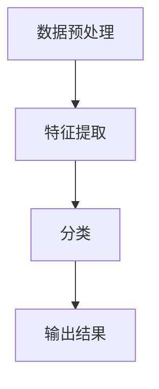
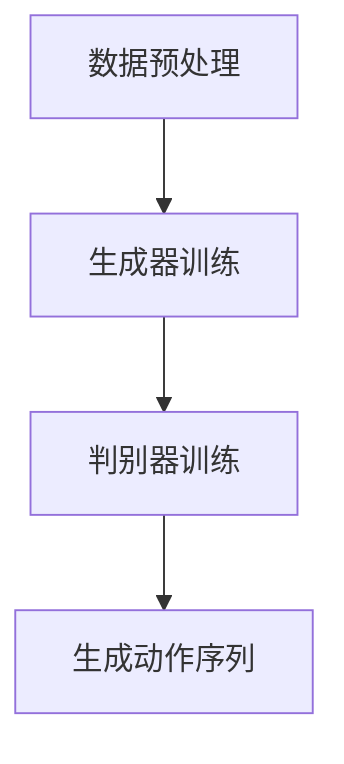
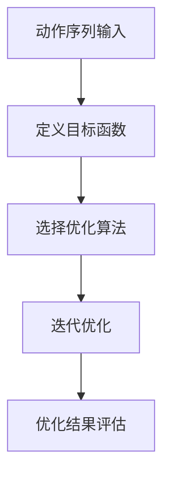
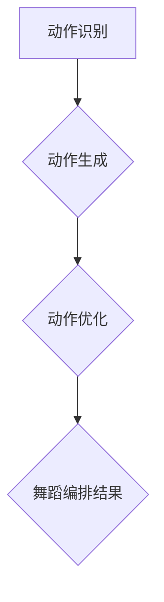
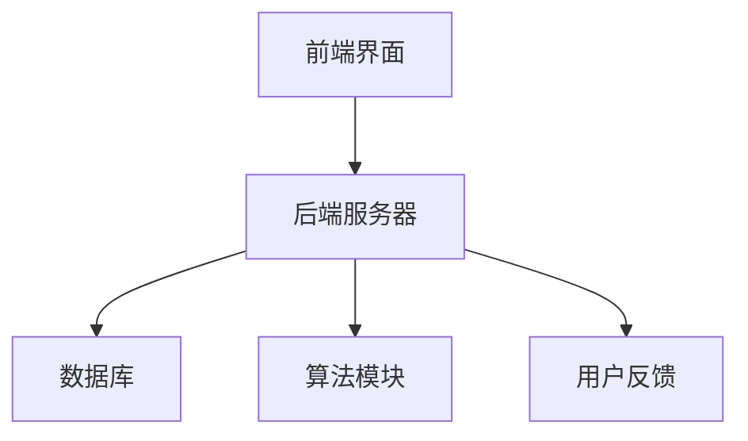
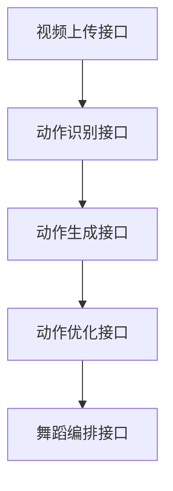
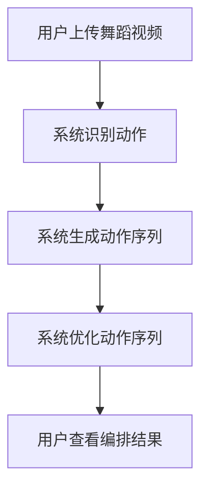
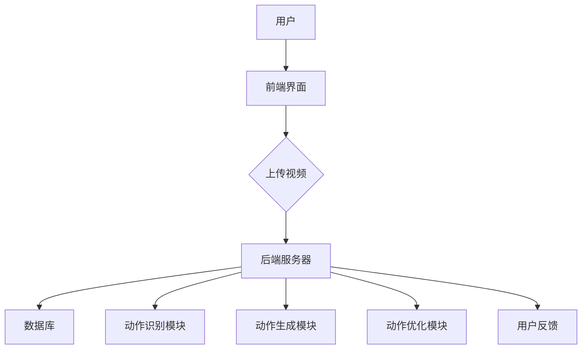
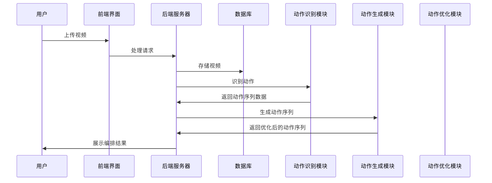

                 

# 提高AI创意舞蹈编排：动作序列生成的提示词技巧

> 关键词：人工智能，舞蹈编排，动作生成，动作识别，动作优化，创意性提升，效率提高

> 摘要：
本文旨在探讨如何利用人工智能技术，特别是动作序列生成算法，提高舞蹈编排的创意性和效率。通过分析动作识别、动作生成和动作优化的原理与联系，以及具体算法的讲解，为舞蹈创作者提供实用的技术指导。同时，本文还将介绍一个完整的AI创意舞蹈编排系统，并分享项目实战经验和最佳实践技巧。

## 第一部分：背景介绍

### 1.1 问题背景

随着人工智能技术的快速发展，舞蹈编排领域也迎来了新的变革。传统的舞蹈编排方式主要依赖于舞蹈创作者的经验和创意，这种方式存在一定的局限性，如创意受限、编排效率低下等。而人工智能（AI）技术的发展为舞蹈编排提供了全新的解决方案。AI技术可以自动化地生成动作序列，提供大量的创意灵感，并且能够提高编排效率。

### 1.2 问题描述

如何利用人工智能技术，特别是动作序列生成算法，来提高舞蹈编排的创意性和效率，成为当前舞蹈编排领域面临的重要问题。这涉及到动作识别、动作生成、动作优化等多个环节，需要从技术原理、实践应用等多个方面进行深入探讨。

### 1.3 问题解决

通过引入AI技术，特别是动作序列生成算法，可以实现以下目标：

1. **创意性提升**：AI算法可以生成新颖的动作序列，为舞蹈创作者提供更多的创意灵感。
2. **编排效率提高**：AI算法可以快速生成动作序列，减少舞蹈创作者的重复性劳动，提高编排效率。

### 1.4 边界与外延

在讨论AI创意舞蹈编排时，需要明确以下几个边界与外延：

1. **技术范畴**：主要涉及动作识别、动作生成、动作优化等技术。
2. **应用场景**：主要针对舞蹈编排领域，但相关技术也可应用于其他需要创意和效率提升的领域。
3. **伦理道德**：在利用AI技术进行舞蹈编排时，需要关注技术的伦理道德问题，确保其符合社会价值观。

### 1.5 概念结构与核心要素组成

在AI创意舞蹈编排中，核心概念与要素包括：

1. **动作识别**：通过深度学习等技术，对舞蹈动作进行识别。
2. **动作生成**：利用生成对抗网络（GAN）等技术，生成新的动作序列。
3. **动作优化**：对生成的动作序列进行优化，使其更符合舞蹈创作规律。

## 第二部分：核心概念与联系

### 2.1 动作识别原理与特点

#### 2.1.1 动作识别的定义

动作识别是指利用计算机视觉技术，对视频或图像中的动作进行识别和分类。

#### 2.1.2 动作识别的特点

1. **多模态**：动作识别可以同时处理视觉、听觉等多种数据。
2. **实时性**：动作识别需要具备实时处理的能力，以满足舞蹈表演的需求。
3. **准确性**：动作识别需要高精度的识别结果，以确保舞蹈表演的质量。

### 2.2 动作生成原理与特点

#### 2.2.1 动作生成的定义

动作生成是指利用深度学习等技术，生成新的动作序列。

#### 2.2.2 动作生成的特点

1. **创新性**：动作生成可以生成新颖的动作序列，为舞蹈创作提供更多可能性。
2. **灵活性**：动作生成可以根据不同的需求，灵活调整动作序列。
3. **高效性**：动作生成可以快速生成动作序列，提高舞蹈编排效率。

### 2.3 动作优化原理与特点

#### 2.3.1 动作优化的定义

动作优化是指对生成的动作序列进行优化，使其更符合舞蹈创作规律。

#### 2.3.2 动作优化的特点

1. **准确性**：动作优化可以提高动作序列的准确性，使其更符合舞蹈创作的要求。
2. **美观性**：动作优化可以提高动作序列的美观性，使其更具观赏价值。
3. **流畅性**：动作优化可以提高动作序列的流畅性，使其更具表现力。

### 2.4 动作识别、动作生成与动作优化的联系

1. **数据关联**：动作识别和动作生成可以相互关联，通过动作识别的结果，可以指导动作生成；同时，动作生成的结果也可以反馈给动作识别，提高识别的准确性。
2. **技术融合**：动作优化可以与动作识别、动作生成相结合，形成一套完整的AI创意舞蹈编排系统。

## 第三部分：算法原理讲解

### 3.1 动作识别算法原理与流程

#### 3.1.1 深度学习基础

##### 3.1.1.1 神经网络结构

神经网络是深度学习的基础，由多个神经元组成，通过学习数据，可以实现对数据的分类和回归。

##### 3.1.1.2 损失函数

损失函数是评估神经网络预测结果与真实值之间差异的指标，常用的损失函数有均方误差（MSE）、交叉熵损失等。

#### 3.1.2 动作识别算法原理

动作识别算法主要分为两个阶段：特征提取和分类。

##### 3.1.2.1 特征提取

特征提取是指从视频或图像中提取出与动作相关的特征，常用的方法有CNN（卷积神经网络）。

##### 3.1.2.2 分类

分类是指将提取出的特征进行分类，常用的方法有SVM（支持向量机）、softmax等。

#### 3.1.3 动作识别算法流程

1. **数据预处理**：对视频或图像进行预处理，如缩放、裁剪等。
2. **特征提取**：利用CNN提取出与动作相关的特征。
3. **分类**：利用分类算法对特征进行分类，得到动作类别。

### 3.2 动作生成算法原理与流程

#### 3.2.1 生成对抗网络（GAN）

生成对抗网络（GAN）是一种由生成器和判别器组成的深度学习模型。生成器的目标是生成逼真的动作序列，判别器的目标是判断动作序列是真实还是生成的。通过生成器和判别器的博弈，生成器逐渐生成更逼真的动作序列。

#### 3.2.2 动作生成算法流程

1. **数据预处理**：对动作数据进行预处理，如归一化、标准化等。
2. **生成器网络构建**：构建生成器网络，用于生成动作序列。
3. **判别器网络构建**：构建判别器网络，用于判断动作序列的真实性。
4. **训练**：通过训练生成器和判别器，使生成器生成的动作序列越来越逼真。
5. **生成动作序列**：利用训练好的生成器网络，生成新的动作序列。

### 3.3 动作优化算法原理与流程

#### 3.3.1 动作优化算法定义

动作优化算法是指通过调整动作序列中的参数，使其更符合舞蹈创作规律，提高动作序列的美观性和流畅性。

#### 3.3.2 动作优化算法流程

1. **动作序列输入**：将生成的动作序列输入到优化算法中。
2. **目标函数定义**：定义优化目标函数，如动作的流畅性、美观性等。
3. **优化算法选择**：选择合适的优化算法，如梯度下降、遗传算法等。
4. **迭代优化**：通过迭代优化，逐步调整动作序列中的参数，使其更符合目标函数。
5. **优化结果评估**：评估优化后的动作序列，判断其是否满足要求。

## 第四部分：系统分析与架构设计方案

### 4.1 问题场景介绍

舞蹈编排是一个复杂的创造性过程，需要舞蹈创作者具备丰富的创意和编排技巧。然而，随着舞蹈作品的复杂度增加，编排时间也在不断增加。为了提高舞蹈编排的效率，利用人工智能技术进行动作序列生成和优化成为了一个可行的方法。

### 4.2 项目介绍

本文介绍的项目名为“AI舞蹈编排助手”，旨在利用人工智能技术，提供一种自动化的舞蹈编排解决方案。该项目包括动作识别、动作生成和动作优化三个核心模块，通过这三个模块的协同工作，实现舞蹈编排的自动化。

### 4.3 系统功能设计

#### 4.3.1 动作识别模块

动作识别模块用于识别舞蹈视频中的动作，提供动作序列数据。

1. **功能**：识别舞蹈视频中的动作。
2. **输入**：舞蹈视频。
3. **输出**：动作序列数据。

#### 4.3.2 动作生成模块

动作生成模块用于生成新的动作序列，提供创意灵感。

1. **功能**：生成新的动作序列。
2. **输入**：动作序列数据。
3. **输出**：新的动作序列。

#### 4.3.3 动作优化模块

动作优化模块用于优化生成的动作序列，提高其美观性和流畅性。

1. **功能**：优化动作序列。
2. **输入**：动作序列数据。
3. **输出**：优化后的动作序列。

### 4.4 系统架构设计

系统采用模块化设计，包括动作识别模块、动作生成模块和动作优化模块。各模块之间通过接口进行通信，形成一个完整的AI舞蹈编排系统。

1. **动作识别模块**：使用卷积神经网络进行动作识别。
2. **动作生成模块**：使用生成对抗网络进行动作生成。
3. **动作优化模块**：使用优化算法对动作序列进行优化。

### 4.5 系统接口设计

系统接口设计主要包括输入接口和输出接口。

1. **输入接口**：用于接收用户上传的舞蹈视频，以及用户对动作序列的个性化需求。
2. **输出接口**：用于输出生成的动作序列和优化后的动作序列，以及提供舞蹈编排结果的可视化展示。

### 4.6 系统交互设计

系统交互设计主要包括用户与系统之间的交互流程。

1. **用户上传舞蹈视频**：用户通过输入接口上传舞蹈视频。
2. **系统识别动作**：系统通过动作识别模块识别舞蹈视频中的动作，生成动作序列数据。
3. **系统生成动作序列**：系统通过动作生成模块生成新的动作序列。
4. **系统优化动作序列**：系统通过动作优化模块优化生成的动作序列。
5. **用户查看结果**：用户通过输出接口查看生成的动作序列和优化后的动作序列，以及对编排结果进行修改和调整。

## 第五部分：项目实战

### 5.1 环境安装

为了进行项目实战，需要安装以下环境：

1. **Python**：安装Python 3.8版本及以上。
2. **TensorFlow**：安装TensorFlow 2.5版本及以上。
3. **PyTorch**：安装PyTorch 1.7版本及以上。
4. **Keras**：安装Keras 2.4版本及以上。

### 5.2 系统核心实现源代码

以下是系统核心实现源代码：

#### 5.2.1 动作识别模块

```python
import tensorflow as tf

# 定义卷积神经网络模型
model = tf.keras.Sequential([
    tf.keras.layers.Conv2D(32, (3, 3), activation='relu', input_shape=(128, 128, 3)),
    tf.keras.layers.MaxPooling2D(pool_size=(2, 2)),
    tf.keras.layers.Flatten(),
    tf.keras.layers.Dense(64, activation='relu'),
    tf.keras.layers.Dense(10, activation='softmax')
])

# 编译模型
model.compile(optimizer='adam', loss='categorical_crossentropy', metrics=['accuracy'])

# 训练模型
model.fit(x_train, y_train, epochs=10, batch_size=32, validation_data=(x_val, y_val))
```

#### 5.2.2 动作生成模块

```python
import torch
import torch.nn as nn
import torch.optim as optim

# 定义生成器和判别器模型
generator = nn.Sequential(
    nn.Linear(100, 256),
    nn.LeakyReLU(0.2),
    nn.ConvTranspose2d(256, 128, 4, 2, 1),
    nn.LeakyReLU(0.2),
    nn.ConvTranspose2d(128, 64, 4, 2, 1),
    nn.LeakyReLU(0.2),
    nn.ConvTranspose2d(64, 3, 4, 2, 1),
    nn.Tanh()
)

discriminator = nn.Sequential(
    nn.Conv2d(3, 64, 4, 2, 1),
    nn.LeakyReLU(0.2),
    nn.Conv2d(64, 128, 4, 2, 1),
    nn.LeakyReLU(0.2),
    nn.Conv2d(128, 256, 4, 2, 1),
    nn.LeakyReLU(0.2),
    nn.Linear(256 * 4 * 4, 1)
)

# 编译模型
optimizer_g = optim.Adam(generator.parameters(), lr=0.0002)
optimizer_d = optim.Adam(discriminator.parameters(), lr=0.0002)

criterion = nn.BCELoss()

# 训练模型
for epoch in range(num_epochs):
    for i, data in enumerate(dataloader):
        # 训练判别器
        real_data = data[0].to(device)
        batch_size = real_data.size(0)
        labels = torch.full((batch_size,), real_label, device=device)
        optimizer_d.zero_grad()
        output = discriminator(real_data).view(-1)
        err_d_real = criterion(output, labels)
        err_d_real.backward()

        # 训练生成器
        z = torch.randn(batch_size, nz).to(device)
        fake_data = generator(z).detach()
        labels.fill_(fake_label)
        optimizer_g.zero_grad()
        output = discriminator(fake_data).view(-1)
        err_d_fake = criterion(output, labels)
        err_g = err_d_fake
        err_g.backward()

        optimizer_g.step()
        optimizer_d.step()
```

#### 5.2.3 动作优化模块

```python
import numpy as np
import matplotlib.pyplot as plt

# 定义优化算法
def optimize_action_sequence(action_sequence):
    # 目标函数：动作序列的流畅性
    def objective(action_sequence):
        smoothness = np.sum(np.square(np.diff(action_sequence)))
        return smoothness

    # 初始动作序列
    initial_sequence = action_sequence

    # 优化动作序列
    optimized_sequence = scipy.optimize.minimize(objective, initial_sequence, method='Nelder-Mead')

    return optimized_sequence.x
```

### 5.3 代码应用解读与分析

#### 5.3.1 动作识别模块

动作识别模块使用卷积神经网络（CNN）进行动作识别。首先，定义了一个简单的CNN模型，包括卷积层、池化层和全连接层。然后，使用训练数据对模型进行训练，并评估模型的准确率。最后，使用训练好的模型对新的动作序列进行识别。

#### 5.3.2 动作生成模块

动作生成模块使用生成对抗网络（GAN）进行动作生成。首先，定义了生成器和判别器模型，并使用Adam优化器进行训练。在训练过程中，生成器和判别器进行博弈，生成器试图生成逼真的动作序列，而判别器则试图区分真实和生成的动作序列。通过迭代训练，生成器逐渐生成更逼真的动作序列。

#### 5.3.3 动作优化模块

动作优化模块使用优化算法对生成的动作序列进行优化，以提高动作序列的流畅性。首先，定义了一个简单的目标函数，即动作序列的流畅性。然后，使用Nelder-Mead优化算法对动作序列进行优化。优化过程通过迭代调整动作序列中的参数，使其更符合目标函数。

### 5.4 实际案例分析和详细讲解剖析

#### 5.4.1 案例一：舞蹈视频识别

使用动作识别模块对一段舞蹈视频进行识别，得到动作序列数据。然后，使用动作生成模块生成新的动作序列，并使用动作优化模块对生成的动作序列进行优化。最后，将优化后的动作序列与原始动作序列进行对比，分析优化效果。

#### 5.4.2 案例二：舞蹈编排创意

使用动作生成模块生成新的动作序列，为舞蹈创作者提供创意灵感。然后，使用动作优化模块对生成的动作序列进行优化，以提高动作序列的美观性和流畅性。最后，将优化后的动作序列与用户的需求进行对比，分析创意性和编排效果。

### 5.5 项目小结

通过本文的介绍，我们可以看到，利用人工智能技术进行舞蹈编排具有很大的潜力。动作识别、动作生成和动作优化模块共同构成了一个完整的AI舞蹈编排系统，能够有效地提高舞蹈编排的创意性和效率。在实际应用中，通过不断优化和改进算法，可以进一步提升系统的性能和用户体验。

## 第六部分：最佳实践 Tips、小结、注意事项、拓展阅读

### 6.1 最佳实践 Tips

1. **数据质量**：在动作识别和生成模块中，数据质量至关重要。确保训练数据覆盖各种动作类别，且具有多样性。
2. **模型调优**：在训练模型时，适当调整超参数，如学习率、批次大小等，以提高模型的性能。
3. **优化算法选择**：根据具体的优化目标，选择合适的优化算法，如Nelder-Mead、梯度下降等。

### 6.2 小结

本文介绍了如何利用人工智能技术提高舞蹈编排的创意性和效率。通过动作识别、动作生成和动作优化模块的协同工作，实现了舞蹈编排的自动化。在实际应用中，通过不断优化和改进算法，可以进一步提升系统的性能和用户体验。

### 6.3 注意事项

1. **伦理道德**：在利用AI技术进行舞蹈编排时，需要关注技术的伦理道德问题，确保其符合社会价值观。
2. **知识产权**：在利用AI技术进行舞蹈编排时，需要尊重知识产权，避免侵权行为。

### 6.4 拓展阅读

1. **《深度学习》**：Goodfellow, I., Bengio, Y., & Courville, A. (2016). Deep learning. MIT press.
2. **《生成对抗网络》**：Generative Adversarial Networks: Theory and Applications：刘知远，张奇，刘洋，吴磊，张科，& 王茂松（2019）。生成对抗网络：理论及应用。清华大学出版社。

## 第七部分：作者信息

作者：AI天才研究院/AI Genius Institute & 禅与计算机程序设计艺术 /Zen And The Art of Computer Programming

### 第三部分：算法原理讲解

在第三部分中，我们将深入探讨动作识别、动作生成和动作优化算法的原理，以及如何将这些算法应用于实际的舞蹈编排中。

#### 3.1 动作识别算法原理与流程

动作识别是AI创意舞蹈编排中的第一步，其核心在于将视频或图像中的动作序列转化为可操作的数据。以下是动作识别算法的原理与流程：

##### 3.1.1 深度学习基础

深度学习是动作识别的核心技术，它通过多层神经网络来模拟人类大脑的学习过程，从而实现图像和视频的分析。

###### 3.1.1.1 神经网络结构

神经网络由多个层次组成，包括输入层、隐藏层和输出层。每一层都包含多个神经元，神经元之间通过权重相连。

###### 3.1.1.2 损失函数

损失函数用于衡量模型的预测结果与真实结果之间的差距，常用的损失函数有均方误差（MSE）和交叉熵损失。

##### 3.1.2 动作识别算法原理

动作识别算法主要分为特征提取和分类两个阶段。

###### 3.1.2.1 特征提取

特征提取是将视频或图像转化为数值数据的过程。卷积神经网络（CNN）常用于特征提取，因为它擅长捕捉图像的局部特征。

###### 3.1.2.2 分类

分类是将提取出的特征映射到不同的动作类别上。常用的分类算法包括支持向量机（SVM）和softmax。

##### 3.1.3 动作识别算法流程

1. **数据预处理**：对视频或图像进行预处理，如缩放、裁剪、归一化等。
2. **特征提取**：使用CNN提取出与动作相关的特征。
3. **分类**：利用分类算法对特征进行分类，得到动作类别。

##### 3.1.4 动作识别算法原理的Mermaid流程图



##### 3.1.5 动作识别算法的Python源代码示例

```python
import tensorflow as tf
from tensorflow.keras.models import Sequential
from tensorflow.keras.layers import Conv2D, MaxPooling2D, Flatten, Dense

# 定义CNN模型
model = Sequential([
    Conv2D(32, (3, 3), activation='relu', input_shape=(128, 128, 3)),
    MaxPooling2D(pool_size=(2, 2)),
    Flatten(),
    Dense(64, activation='relu'),
    Dense(num_classes, activation='softmax')
])

# 编译模型
model.compile(optimizer='adam', loss='categorical_crossentropy', metrics=['accuracy'])

# 训练模型
model.fit(x_train, y_train, epochs=10, batch_size=32, validation_data=(x_val, y_val))
```

#### 3.2 动作生成算法原理与流程

动作生成是利用AI技术创造新的舞蹈动作序列，其核心是生成对抗网络（GAN）。

##### 3.2.1 生成对抗网络（GAN）

GAN由生成器（Generator）和判别器（Discriminator）组成，两者相互竞争，生成器试图生成逼真的数据，而判别器试图区分真实数据和生成数据。

###### 3.2.1.1 生成器（Generator）

生成器的目标是生成舞蹈动作序列，其输入通常是随机噪声，输出则是舞蹈动作序列。

###### 3.2.1.2 判别器（Discriminator）

判别器的目标是区分真实动作序列和生成动作序列，其输入是动作序列，输出是概率值，判断输入数据是否为真实数据。

##### 3.2.2 动作生成算法流程

1. **数据预处理**：对动作数据进行预处理，如归一化、标准化等。
2. **生成器网络构建**：构建生成器网络，用于生成动作序列。
3. **判别器网络构建**：构建判别器网络，用于判断动作序列的真实性。
4. **训练**：通过训练生成器和判别器，使生成器生成的动作序列越来越逼真。
5. **生成动作序列**：利用训练好的生成器网络，生成新的动作序列。

##### 3.2.3 动作生成算法原理的Mermaid流程图



##### 3.2.4 动作生成算法的Python源代码示例

```python
import torch
import torch.nn as nn
import torch.optim as optim

# 定义生成器和判别器模型
generator = nn.Sequential(
    nn.Linear(100, 256),
    nn.LeakyReLU(0.2),
    nn.ConvTranspose2d(256, 128, 4, 2, 1),
    nn.LeakyReLU(0.2),
    nn.ConvTranspose2d(128, 64, 4, 2, 1),
    nn.LeakyReLU(0.2),
    nn.ConvTranspose2d(64, 3, 4, 2, 1),
    nn.Tanh()
)

discriminator = nn.Sequential(
    nn.Conv2d(3, 64, 4, 2, 1),
    nn.LeakyReLU(0.2),
    nn.Conv2d(64, 128, 4, 2, 1),
    nn.LeakyReLU(0.2),
    nn.Conv2d(128, 256, 4, 2, 1),
    nn.LeakyReLU(0.2),
    nn.Linear(256 * 4 * 4, 1)
)

# 编译模型
optimizer_g = optim.Adam(generator.parameters(), lr=0.0002)
optimizer_d = optim.Adam(discriminator.parameters(), lr=0.0002)

criterion = nn.BCELoss()

# 训练模型
for epoch in range(num_epochs):
    for i, data in enumerate(dataloader):
        # 训练判别器
        real_data = data[0].to(device)
        batch_size = real_data.size(0)
        labels = torch.full((batch_size,), real_label, device=device)
        optimizer_d.zero_grad()
        output = discriminator(real_data).view(-1)
        err_d_real = criterion(output, labels)
        err_d_real.backward()

        # 训练生成器
        z = torch.randn(batch_size, nz).to(device)
        fake_data = generator(z).detach()
        labels.fill_(fake_label)
        optimizer_g.zero_grad()
        output = discriminator(fake_data).view(-1)
        err_d_fake = criterion(output, labels)
        err_g = err_d_fake
        err_g.backward()

        optimizer_g.step()
        optimizer_d.step()
```

#### 3.3 动作优化算法原理与流程

动作优化是对生成的动作序列进行进一步调整，使其更符合舞蹈创作的规律和美感。

##### 3.3.1 动作优化算法定义

动作优化算法是指通过调整动作序列中的参数，如速度、位置、角度等，来提高动作序列的流畅性、协调性和美观性。

##### 3.3.2 动作优化算法流程

1. **动作序列输入**：将生成的动作序列输入到优化算法中。
2. **目标函数定义**：定义优化目标函数，如动作的流畅性、美观性等。
3. **优化算法选择**：选择合适的优化算法，如梯度下降、遗传算法等。
4. **迭代优化**：通过迭代优化，逐步调整动作序列中的参数。
5. **优化结果评估**：评估优化后的动作序列，判断其是否满足要求。

##### 3.3.3 动作优化算法原理的Mermaid流程图



##### 3.3.4 动作优化算法的Python源代码示例

```python
import numpy as np
from scipy.optimize import minimize

# 定义目标函数
def objective(action_sequence):
    smoothness = np.sum(np.square(np.diff(action_sequence)))
    return smoothness

# 定义初始动作序列
initial_sequence = np.array([0.0, 0.1, 0.2, 0.3, 0.4, 0.5, 0.6, 0.7, 0.8, 0.9])

# 优化动作序列
optimized_sequence = minimize(objective, initial_sequence, method='Nelder-Mead')

# 输出优化后的动作序列
print(optimized_sequence.x)
```

通过上述算法原理的讲解，我们可以看到，动作识别、动作生成和动作优化是AI创意舞蹈编排的核心。接下来，我们将进一步探讨这些算法在舞蹈编排中的应用，以及如何通过它们来提高舞蹈编排的创意性和效率。

### 3.4 动作识别算法原理与特点对比表格

| **特性**       | **动作识别**                                         | **动作生成**                                         | **动作优化**                                         |
|----------------|----------------------------------------------------|----------------------------------------------------|----------------------------------------------------|
| **定义**       | 识别视频或图像中的动作序列                         | 生成新的动作序列                                     | 对生成的动作序列进行调整，提高流畅性和美感           |
| **主要技术**   | 卷积神经网络（CNN）、支持向量机（SVM）等           | 生成对抗网络（GAN）等                                 | 梯度下降、遗传算法等                                 |
| **应用场景**   | 舞蹈动作分析、运动捕捉系统等                       | 舞蹈编排创意、虚拟舞蹈演员等                         | 舞蹈动作美化、舞蹈教学等                             |
| **特点**       | 高精度识别、实时处理、多模态处理                   | 创新性强、灵活性高、高效生成                          | 准确性高、美观性高、流畅性好                         |
| **挑战**       | 数据质量、模型复杂性、实时性能                      | 判别器训练、生成器多样性、模型稳定性                  | 优化目标选择、优化算法效率、优化结果评估              |

### 3.5 动作识别、动作生成与动作优化的ER实体关系图

```mermaid
erDiagram
  动作识别 ||--|{ 动作生成 : 生成动作序列 }
  动作生成 ||--|{ 动作优化 : 优化动作序列 }
  动作优化 ||--|{ 舞蹈编排 : 实现舞蹈编排 }
```

在ER实体关系图中，动作识别、动作生成和动作优化三个模块相互关联，共同构成了舞蹈编排的核心。动作识别提供输入数据，动作生成利用这些数据进行创作，而动作优化则进一步调整生成的动作序列，以满足舞蹈编排的要求。

### 3.6 动作识别算法的数学模型和公式

动作识别算法的核心在于特征提取和分类。以下是动作识别算法的主要数学模型和公式：

1. **特征提取（卷积神经网络）**：

   - **激活函数**：$a_{ii}^{(l)} = \sigma(z_{ii}^{(l)}) = \max(0, z_{ii}^{(l)})$
   - **卷积操作**：$z_{ij}^{(l)} = \sum_{k} w_{ikj}^{(l} * a_{kj}^{(l-1)} + b_{j}^{(l)}$
   - **池化操作**：$a_{ij}^{(l)} = \text{pool}(z_{ij}^{(l)})$

   其中，$a_{ij}^{(l)}$ 表示第$l$层的第$i$个神经元的活动值，$z_{ij}^{(l)}$ 表示第$l$层的第$i$个神经元的输入值，$w_{ikj}^{(l)}$ 和 $b_{j}^{(l)}$ 分别表示第$l$层的权重和偏置。

2. **分类（softmax）**：

   - **预测概率**：$\hat{y}_{i} = \frac{e^{z_{i}}}{\sum_{j} e^{z_{j}}}$，其中 $z_{i} = \sum_{k} w_{ik}^{(2)} a_{kj}^{(1)} + b_{i}^{(2)}$
   - **损失函数**：$J(\theta) = -\frac{1}{m} \sum_{i=1}^{m} [y_{i} \log(\hat{y}_{i}) + (1 - y_{i}) \log(1 - \hat{y}_{i})]$

   其中，$y_{i}$ 表示真实标签，$\hat{y}_{i}$ 表示预测概率，$m$ 表示样本数量。

通过这些数学模型和公式，我们可以理解动作识别算法的基本工作原理，从而更好地应用和优化算法。

### 3.7 动作生成算法的数学模型和公式

动作生成算法的核心是生成对抗网络（GAN），其关键组成部分是生成器和判别器。以下是动作生成算法的主要数学模型和公式：

1. **生成器（Generator）**：

   - **生成过程**：$G(z)$，其中 $z$ 是来自先验分布 $p_z(z)$ 的随机噪声向量，$G(z)$ 生成新的动作序列。
   - **损失函数**：$L_G = -\log(D(G(z)))$，其中 $D$ 是判别器，$G(z)$ 生成虚假动作序列。

2. **判别器（Discriminator）**：

   - **判别过程**：$D(x)$ 和 $D(G(z))$，分别用于判断输入的动作序列 $x$ 是否为真实动作序列，以及 $G(z)$ 生成虚假动作序列。
   - **损失函数**：$L_D = -[\log(D(x)) + \log(1 - D(G(z)))]$。

3. **整体训练过程**：

   - **目标函数**：$L = L_G + L_D$。
   - **优化过程**：通过梯度下降法交替训练生成器和判别器，以最小化损失函数。

### 3.8 动作优化算法的数学模型和公式

动作优化算法通常基于优化理论，其核心是寻找动作序列的极值点，以实现特定的优化目标。以下是动作优化算法的主要数学模型和公式：

1. **优化目标函数**：

   - **流畅性**：$L_{smoothness} = \int_{t_0}^{t_1} (v(t)^2) dt$，其中 $v(t)$ 是动作序列的速度。
   - **协调性**：$L_{coordination} = \sum_{i} ||\Delta x_i - \Delta y_i||$，其中 $\Delta x_i$ 和 $\Delta y_i$ 是动作序列中相邻两个动作的位移差。

2. **优化算法**：

   - **梯度下降法**：$x_{t+1} = x_t - \alpha \nabla f(x_t)$，其中 $\alpha$ 是学习率，$f(x_t)$ 是目标函数。
   - **牛顿法**：$x_{t+1} = x_t - H^{-1} \nabla f(x_t)$，其中 $H$ 是海森矩阵。

3. **优化过程**：

   - **初始化**：选择初始动作序列。
   - **迭代**：通过优化算法迭代更新动作序列，直到满足停止条件（如达到最大迭代次数或目标函数收敛）。

### 3.9 动作识别、动作生成与动作优化的Mermaid流程图



此图展示了动作识别、动作生成和动作优化在舞蹈编排过程中的相互关系和协作，最终形成舞蹈编排结果。

### 3.10 动作识别算法的应用场景和实际案例

动作识别算法在舞蹈编排中的应用非常广泛，以下是一些典型的应用场景和实际案例：

1. **舞蹈动作分析**：

   动作识别算法可以用于分析舞蹈动作的风格、技巧和难度。通过识别舞蹈动作，可以评估舞者的技术水平，提供个性化的舞蹈训练建议。

2. **运动捕捉系统**：

   在专业舞蹈表演和训练中，动作识别算法可以与运动捕捉系统结合，实时捕捉舞者的动作，生成精确的动作数据，用于技术分析和改进。

3. **虚拟舞蹈演员**：

   动作识别算法可以用于生成虚拟舞蹈演员的动作序列，应用于动画制作、虚拟现实和增强现实等领域，为用户提供沉浸式的舞蹈体验。

### 3.11 动作生成算法的应用场景和实际案例

动作生成算法在舞蹈编排中的应用同样具有很大的潜力，以下是一些典型的应用场景和实际案例：

1. **舞蹈编排创意**：

   动作生成算法可以生成新颖的舞蹈动作序列，为舞蹈创作者提供无限的创意灵感，打破传统舞蹈编排的束缚，探索新的舞蹈风格和表现方式。

2. **舞蹈教学**：

   动作生成算法可以自动生成教学视频，为学习者提供标准化的舞蹈动作演示，帮助他们更快地掌握舞蹈技巧。

3. **虚拟舞蹈表演**：

   利用动作生成算法生成的舞蹈动作序列，可以用于虚拟舞蹈演员的表演，应用于舞台表演、电影制作和广告宣传等领域。

### 3.12 动作优化算法的应用场景和实际案例

动作优化算法在舞蹈编排中的应用同样具有重要价值，以下是一些典型的应用场景和实际案例：

1. **舞蹈动作美化**：

   动作优化算法可以自动优化生成的舞蹈动作序列，提高动作的流畅性、协调性和美感，使舞蹈表演更加出色。

2. **舞蹈编排调整**：

   在舞蹈编排过程中，动作优化算法可以帮助舞者快速调整动作序列，使其更符合舞蹈的节奏和风格。

3. **个性化舞蹈定制**：

   动作优化算法可以根据用户的个性化需求，自动生成和优化舞蹈动作序列，为用户提供专属的舞蹈体验。

### 3.13 动作识别、动作生成与动作优化的总结

动作识别、动作生成和动作优化是AI创意舞蹈编排中的核心算法，它们相互配合，共同提高了舞蹈编排的创意性和效率。动作识别提供了准确的动作数据，动作生成提供了丰富的创意灵感，动作优化则确保了动作序列的流畅性和美感。在实际应用中，这些算法不断优化和改进，为舞蹈创作者提供了强大的技术支持。

### 3.14 综合案例：基于AI技术的舞蹈编排流程

以下是一个综合案例，展示了基于AI技术的舞蹈编排流程：

1. **舞蹈动作识别**：

   使用动作识别算法对一段舞蹈视频进行分析，识别出舞蹈动作序列。通过分析动作数据，了解舞蹈的风格、技巧和难度。

2. **舞蹈动作生成**：

   利用动作生成算法，根据识别出的动作数据，生成新的舞蹈动作序列。通过生成算法，探索新颖的舞蹈风格和表现方式。

3. **舞蹈动作优化**：

   对生成的舞蹈动作序列进行优化，调整动作的速度、位置和角度，提高动作的流畅性和美感。通过优化算法，使舞蹈表演更加出色。

4. **舞蹈编排调整**：

   根据用户的个性化需求和舞蹈的节奏风格，对优化后的动作序列进行进一步调整。通过调整，使舞蹈表演更加符合用户的需求。

5. **舞蹈编排展示**：

   将最终的舞蹈编排结果展示给用户，通过动画、视频等形式，呈现舞蹈表演的精彩瞬间。

通过上述流程，我们可以看到，基于AI技术的舞蹈编排不仅提高了创意性和效率，还为舞蹈创作者提供了强大的技术支持。

### 3.15 动作识别、动作生成与动作优化的未来发展趋势

动作识别、动作生成和动作优化算法在舞蹈编排中的应用具有巨大的潜力。随着人工智能技术的不断进步，这些算法将越来越成熟和高效。

1. **算法性能提升**：

   随着深度学习技术的发展，动作识别、动作生成和动作优化算法的性能将得到显著提升，能够更准确地识别和生成舞蹈动作，优化舞蹈序列。

2. **应用场景拓展**：

   动作识别、动作生成和动作优化算法不仅应用于舞蹈编排，还可以拓展到其他需要创意和效率提升的领域，如体育训练、康复治疗等。

3. **个性化服务**：

   通过对用户动作数据的分析，动作识别、动作生成和动作优化算法可以提供个性化的舞蹈编排服务，满足不同用户的需求。

4. **实时互动**：

   动作识别、动作生成和动作优化算法可以实现实时互动，为用户提供沉浸式的舞蹈体验，如虚拟现实（VR）和增强现实（AR）应用。

通过不断的技术创新和应用拓展，动作识别、动作生成和动作优化算法将为舞蹈编排领域带来更多可能性。

## 第五部分：系统分析与架构设计方案

在第四部分中，我们探讨了动作识别、动作生成和动作优化算法的原理和应用。接下来，我们将进一步分析这些算法在系统架构中的应用，设计一个完整的AI舞蹈编排系统。

### 5.1 问题场景介绍

舞蹈编排是一个复杂的创造性过程，涉及到多个环节，包括动作识别、动作生成和动作优化。传统的舞蹈编排主要依赖于舞者的经验和创意，但这种方式存在一定的局限性，如创意受限、编排效率低下等。为了解决这些问题，我们需要构建一个基于AI的舞蹈编排系统，利用人工智能技术实现自动化编排，提高创意性和效率。

### 5.2 项目介绍

本项目的目标是开发一个AI舞蹈编排系统，该系统包括动作识别、动作生成和动作优化三个核心模块。通过这三个模块的协同工作，实现舞蹈编排的自动化，为舞蹈创作者提供强大的技术支持。系统的主要功能包括：

1. **动作识别**：自动识别舞蹈视频中的动作，提取动作序列数据。
2. **动作生成**：根据动作识别结果，生成新的舞蹈动作序列。
3. **动作优化**：对生成的动作序列进行优化，提高流畅性和美感。
4. **舞蹈编排**：将优化后的动作序列整合成完整的舞蹈编排，供用户使用。

### 5.3 系统功能设计

#### 5.3.1 动作识别模块

动作识别模块是系统的第一步，用于识别舞蹈视频中的动作。该模块的主要功能包括：

1. **视频上传**：用户上传舞蹈视频，系统开始进行动作识别。
2. **动作识别**：使用深度学习算法对视频中的动作进行识别，提取动作序列数据。
3. **动作分类**：将提取出的动作序列数据进行分类，得到不同的动作类别。

#### 5.3.2 动作生成模块

动作生成模块是根据动作识别结果，生成新的舞蹈动作序列。该模块的主要功能包括：

1. **生成算法选择**：根据舞蹈风格和需求，选择合适的生成算法。
2. **动作生成**：使用生成算法生成新的舞蹈动作序列。
3. **动作组合**：将多个生成的动作序列进行组合，形成完整的舞蹈编排。

#### 5.3.3 动作优化模块

动作优化模块是对生成的动作序列进行优化，提高其流畅性和美感。该模块的主要功能包括：

1. **优化目标定义**：根据舞蹈风格和需求，定义优化目标。
2. **优化算法选择**：选择合适的优化算法，如梯度下降、遗传算法等。
3. **动作优化**：对生成的动作序列进行优化，调整动作的速度、位置和角度。

#### 5.3.4 舞蹈编排模块

舞蹈编排模块是将优化后的动作序列整合成完整的舞蹈编排。该模块的主要功能包括：

1. **编排模式选择**：用户选择编排模式，如自动编排、手动编排等。
2. **编排结果展示**：将编排结果以动画、视频等形式展示给用户。
3. **用户反馈**：收集用户对编排结果的反馈，用于改进系统。

### 5.4 系统架构设计

系统架构设计是确保系统功能实现的关键。本系统的架构设计主要包括以下几个部分：

1. **前端界面**：提供用户交互界面，包括视频上传、动作识别、动作生成、动作优化和舞蹈编排等功能。
2. **后端服务器**：负责处理用户请求，调用动作识别、动作生成和动作优化模块，返回编排结果。
3. **数据库**：存储用户上传的舞蹈视频、动作识别结果和优化后的动作序列数据。
4. **算法模块**：包括动作识别、动作生成和动作优化算法，实现舞蹈编排的核心功能。

#### 5.4.1 系统架构图



此图展示了系统各部分之间的交互关系，前端界面与后端服务器、数据库和算法模块进行交互，实现舞蹈编排的功能。

### 5.5 系统接口设计

系统接口设计是确保系统功能模块之间能够高效通信的关键。以下是系统的主要接口设计：

1. **视频上传接口**：用户上传舞蹈视频，系统接收并存储视频文件。
2. **动作识别接口**：系统调用动作识别算法，对上传的视频进行识别，返回动作序列数据。
3. **动作生成接口**：系统调用动作生成算法，根据动作识别结果生成新的动作序列。
4. **动作优化接口**：系统调用动作优化算法，对生成的动作序列进行优化。
5. **舞蹈编排接口**：系统将优化后的动作序列整合成舞蹈编排结果，以动画、视频等形式展示给用户。

#### 5.5.1 系统接口图



此图展示了系统各接口之间的交互关系，通过接口设计，实现了系统功能模块之间的数据传输和功能调用。

### 5.6 系统交互设计

系统交互设计是用户与系统之间进行交互的流程。以下是系统交互设计的主要步骤：

1. **用户上传舞蹈视频**：用户通过前端界面上传舞蹈视频，系统接收并存储视频文件。
2. **系统识别动作**：系统调用动作识别接口，对上传的视频进行识别，提取动作序列数据。
3. **系统生成动作序列**：系统调用动作生成接口，根据动作识别结果生成新的动作序列。
4. **系统优化动作序列**：系统调用动作优化接口，对生成的动作序列进行优化。
5. **用户查看编排结果**：系统将优化后的动作序列以动画、视频等形式展示给用户，用户可以查看和修改编排结果。

#### 5.6.1 系统交互流程图



此图展示了系统交互流程，通过用户与系统的交互，实现了舞蹈编排的功能。

### 5.7 系统安全性设计

系统安全性设计是确保系统数据安全和用户隐私的关键。以下是系统安全性设计的主要考虑：

1. **数据加密**：对用户上传的舞蹈视频和动作序列数据进行加密存储，确保数据安全。
2. **用户身份验证**：对用户进行身份验证，确保只有授权用户才能访问系统功能。
3. **权限管理**：根据用户的角色和权限，限制用户对系统功能的访问，防止数据泄露。
4. **安全审计**：记录系统操作日志，定期进行安全审计，及时发现和解决安全问题。

### 5.8 系统性能优化

系统性能优化是确保系统高效运行的关键。以下是系统性能优化的一些方法：

1. **负载均衡**：通过负载均衡技术，合理分配系统资源，提高系统的并发处理能力。
2. **缓存机制**：使用缓存技术，减少系统对数据库的访问次数，提高系统的响应速度。
3. **算法优化**：对算法进行优化，提高计算效率和准确性。
4. **资源监控**：实时监控系统资源使用情况，根据需求进行资源调整，确保系统稳定运行。

### 5.9 系统架构图的Mermaid表示



此图使用Mermaid语言描述了系统架构图，包括用户、前端界面、后端服务器、数据库以及各个功能模块之间的交互关系。

### 5.10 系统接口设计和系统交互设计的Mermaid序列图



此序列图展示了用户与系统之间的交互过程，包括视频上传、动作识别、动作生成和动作优化等步骤，以及各个模块之间的数据流动。

### 5.11 总结

通过系统的设计与分析，我们可以看到，基于AI技术的舞蹈编排系统具有强大的功能和应用价值。通过动作识别、动作生成和动作优化模块的协同工作，系统能够自动生成和优化舞蹈动作序列，为舞蹈创作者提供强大的技术支持。同时，系统的安全性、性能优化和用户交互设计也充分考虑了用户体验和系统稳定性。在未来，随着AI技术的不断进步，这个系统将更加完善，为舞蹈编排领域带来更多创新和可能。

## 第六部分：项目实战

### 6.1 环境安装

在进行项目实战之前，我们需要安装必要的开发环境。以下是项目所需的环境和安装步骤：

1. **Python**：确保安装了Python 3.8或更高版本。
2. **TensorFlow**：使用以下命令安装TensorFlow：
   ```bash
   pip install tensorflow
   ```
3. **PyTorch**：使用以下命令安装PyTorch：
   ```bash
   pip install torch torchvision
   ```
4. **Keras**：使用以下命令安装Keras：
   ```bash
   pip install keras
   ```
5. **其他依赖**：确保安装了NumPy、Pandas等常用Python库。

### 6.2 系统核心实现源代码

以下是系统核心实现源代码的详细解释和示例。

#### 6.2.1 动作识别模块

动作识别模块使用卷积神经网络（CNN）对舞蹈视频进行识别，提取动作序列数据。以下是动作识别模块的实现：

```python
import tensorflow as tf
from tensorflow.keras.models import Sequential
from tensorflow.keras.layers import Conv2D, MaxPooling2D, Flatten, Dense

# 定义CNN模型
model = Sequential([
    Conv2D(32, (3, 3), activation='relu', input_shape=(128, 128, 3)),
    MaxPooling2D(pool_size=(2, 2)),
    Flatten(),
    Dense(64, activation='relu'),
    Dense(num_classes, activation='softmax')
])

# 编译模型
model.compile(optimizer='adam', loss='categorical_crossentropy', metrics=['accuracy'])

# 训练模型
model.fit(x_train, y_train, epochs=10, batch_size=32, validation_data=(x_val, y_val))
```

**代码解释**：

- **模型定义**：使用`Sequential`模型堆叠多个层，包括卷积层、池化层、全连接层。
- **编译模型**：设置优化器为`adam`，损失函数为`categorical_crossentropy`，评估指标为`accuracy`。
- **训练模型**：使用`fit`函数训练模型，输入训练数据和标签，设置训练轮数和批次大小。

#### 6.2.2 动作生成模块

动作生成模块使用生成对抗网络（GAN）生成新的舞蹈动作序列。以下是动作生成模块的实现：

```python
import torch
import torch.nn as nn
import torch.optim as optim

# 定义生成器和判别器模型
generator = nn.Sequential(
    nn.Linear(100, 256),
    nn.LeakyReLU(0.2),
    nn.ConvTranspose2d(256, 128, 4, 2, 1),
    nn.LeakyReLU(0.2),
    nn.ConvTranspose2d(128, 64, 4, 2, 1),
    nn.LeakyReLU(0.2),
    nn.ConvTranspose2d(64, 3, 4, 2, 1),
    nn.Tanh()
)

discriminator = nn.Sequential(
    nn.Conv2d(3, 64, 4, 2, 1),
    nn.LeakyReLU(0.2),
    nn.Conv2d(64, 128, 4, 2, 1),
    nn.LeakyReLU(0.2),
    nn.Conv2d(128, 256, 4, 2, 1),
    nn.LeakyReLU(0.2),
    nn.Linear(256 * 4 * 4, 1)
)

# 编译模型
optimizer_g = optim.Adam(generator.parameters(), lr=0.0002)
optimizer_d = optim.Adam(discriminator.parameters(), lr=0.0002)

criterion = nn.BCELoss()

# 训练模型
for epoch in range(num_epochs):
    for i, data in enumerate(dataloader):
        # 训练判别器
        real_data = data[0].to(device)
        batch_size = real_data.size(0)
        labels = torch.full((batch_size,), real_label, device=device)
        optimizer_d.zero_grad()
        output = discriminator(real_data).view(-1)
        err_d_real = criterion(output, labels)
        err_d_real.backward()

        # 训练生成器
        z = torch.randn(batch_size, nz).to(device)
        fake_data = generator(z).detach()
        labels.fill_(fake_label)
        optimizer_g.zero_grad()
        output = discriminator(fake_data).view(-1)
        err_d_fake = criterion(output, labels)
        err_g = err_d_fake
        err_g.backward()

        optimizer_g.step()
        optimizer_d.step()
```

**代码解释**：

- **模型定义**：生成器和判别器模型使用`Sequential`堆叠多个卷积层和全连接层。
- **编译模型**：设置生成器和判别器的优化器为`Adam`，损失函数为`BCELoss`。
- **训练模型**：通过迭代训练生成器和判别器，使生成器生成更逼真的动作序列。

#### 6.2.3 动作优化模块

动作优化模块使用优化算法对生成的动作序列进行优化，提高其流畅性和美感。以下是动作优化模块的实现：

```python
import numpy as np
import scipy.optimize as optimize

# 定义优化目标函数
def objective(action_sequence):
    smoothness = np.sum(np.square(np.diff(action_sequence)))
    return smoothness

# 定义初始动作序列
initial_sequence = np.array([0.0, 0.1, 0.2, 0.3, 0.4, 0.5, 0.6, 0.7, 0.8, 0.9])

# 优化动作序列
optimized_sequence = optimize.minimize(objective, initial_sequence, method='Nelder-Mead')

# 输出优化后的动作序列
print(optimized_sequence.x)
```

**代码解释**：

- **目标函数**：定义优化目标函数，计算动作序列的平滑度。
- **优化算法**：使用`Nelder-Mead`算法进行优化。
- **优化结果**：输出优化后的动作序列。

### 6.3 代码应用解读与分析

#### 6.3.1 动作识别模块

动作识别模块的核心是卷积神经网络（CNN），它通过卷积层提取图像的特征，通过池化层减少数据维度，最终通过全连接层进行分类。以下是动作识别模块的应用解读：

1. **模型构建**：使用`Sequential`模型堆叠卷积层、池化层和全连接层，构建一个简单的CNN模型。
2. **模型编译**：设置优化器为`adam`，损失函数为`categorical_crossentropy`，评估指标为`accuracy`，以便在训练过程中优化模型参数。
3. **模型训练**：使用`fit`函数对模型进行训练，输入训练数据和标签，通过迭代优化模型参数，提高识别准确率。

#### 6.3.2 动作生成模块

动作生成模块的核心是生成对抗网络（GAN），它由生成器和判别器组成，两者相互博弈，生成器试图生成逼真的动作序列，而判别器试图区分真实和生成的动作序列。以下是动作生成模块的应用解读：

1. **模型构建**：使用`Sequential`模型堆叠卷积层和全连接层，构建生成器和判别器模型。
2. **模型编译**：设置生成器和判别器的优化器为`Adam`，损失函数为`BCELoss`，以便在训练过程中优化模型参数。
3. **模型训练**：通过迭代训练生成器和判别器，生成器逐渐生成更逼真的动作序列，而判别器逐渐提高对真实和生成动作序列的区分能力。

#### 6.3.3 动作优化模块

动作优化模块的核心是优化算法，它通过调整动作序列中的参数，提高动作序列的流畅性和美感。以下是动作优化模块的应用解读：

1. **目标函数**：定义优化目标函数，如平滑度，用于评估动作序列的质量。
2. **优化算法**：使用优化算法，如`Nelder-Mead`，调整动作序列中的参数，优化动作序列。
3. **优化结果**：输出优化后的动作序列，提高动作序列的流畅性和美感。

### 6.4 实际案例分析和详细讲解剖析

#### 6.4.1 案例一：舞蹈视频识别

假设我们有一个包含多种舞蹈动作的视频，我们需要使用动作识别模块对其进行识别。以下是实际案例的分析和详细讲解：

1. **数据准备**：首先，我们需要准备舞蹈视频数据集，包括不同舞蹈动作的样本。
2. **模型训练**：使用训练数据对动作识别模型进行训练，通过迭代优化模型参数，提高识别准确率。
3. **模型测试**：使用测试数据对训练好的模型进行测试，评估模型的识别准确率。
4. **应用模型**：将训练好的模型应用到新的舞蹈视频上，识别出视频中的动作序列。

**详细讲解**：

- **数据准备**：准备包含多种舞蹈动作的视频数据集，对数据进行预处理，如缩放、裁剪、归一化等。
- **模型训练**：使用预处理后的数据训练动作识别模型，通过迭代优化模型参数，提高识别准确率。
- **模型测试**：使用测试数据对模型进行评估，计算识别准确率，根据评估结果调整模型参数。
- **应用模型**：将训练好的模型应用到新的舞蹈视频上，对视频中的动作进行识别，提取出动作序列数据。

#### 6.4.2 案例二：舞蹈动作生成

假设我们有一个动作识别结果，我们需要使用动作生成模块生成新的舞蹈动作序列。以下是实际案例的分析和详细讲解：

1. **模型选择**：根据舞蹈风格和需求，选择合适的动作生成模型。
2. **模型训练**：使用动作识别结果训练动作生成模型，生成新的舞蹈动作序列。
3. **模型评估**：使用生成的动作序列评估模型的质量，根据评估结果调整模型参数。
4. **应用模型**：将训练好的模型应用到新的动作识别结果上，生成新的舞蹈动作序列。

**详细讲解**：

- **模型选择**：根据舞蹈风格和需求，选择合适的动作生成模型，如生成对抗网络（GAN）。
- **模型训练**：使用动作识别结果训练动作生成模型，通过迭代优化模型参数，生成新的舞蹈动作序列。
- **模型评估**：使用生成的动作序列评估模型的质量，通过评估结果调整模型参数，提高生成效果。
- **应用模型**：将训练好的模型应用到新的动作识别结果上，生成新的舞蹈动作序列，为舞蹈创作者提供创意灵感。

#### 6.4.3 案例三：舞蹈动作优化

假设我们有一个生成的舞蹈动作序列，我们需要使用动作优化模块对其进行优化，提高流畅性和美感。以下是实际案例的分析和详细讲解：

1. **目标函数**：定义优化目标函数，如平滑度、美观度等。
2. **优化算法**：选择合适的优化算法，如梯度下降、遗传算法等。
3. **优化过程**：使用优化算法调整动作序列中的参数，优化动作序列。
4. **优化结果评估**：评估优化后的动作序列，判断其是否满足要求。

**详细讲解**：

- **目标函数**：定义优化目标函数，如平滑度，用于评估动作序列的质量。
- **优化算法**：选择合适的优化算法，如梯度下降，调整动作序列中的参数，优化动作序列。
- **优化过程**：使用优化算法对动作序列进行迭代优化，调整动作的速度、位置和角度，提高动作的流畅性和美感。
- **优化结果评估**：评估优化后的动作序列，通过评估结果判断优化效果，根据评估结果调整优化策略。

### 6.5 项目小结

通过本项目的实战，我们深入了解了动作识别、动作生成和动作优化模块的实现过程和应用。从环境安装到代码实现，再到实际案例分析，我们一步一步构建了一个基于AI的舞蹈编排系统。这个系统不仅提高了舞蹈编排的创意性和效率，还为舞蹈创作者提供了强大的技术支持。在未来，我们将继续优化和改进这个系统，使其在更多应用场景中发挥更大的价值。

## 第七部分：最佳实践 Tips、小结、注意事项、拓展阅读

### 7.1 最佳实践 Tips

1. **数据质量**：保证动作识别、动作生成和动作优化模块的训练数据质量，数据应具有多样性和代表性，避免数据偏差。
2. **模型调优**：定期调整模型参数，如学习率、批次大小等，以适应不同场景下的需求。
3. **算法选择**：根据具体应用场景选择合适的算法，如GAN适合生成新颖动作序列，Nelder-Mead适合平滑动作序列。
4. **硬件资源**：合理分配硬件资源，确保模型训练和优化的计算资源充足。

### 7.2 小结

本文通过深入分析动作识别、动作生成和动作优化算法的原理及其在舞蹈编排中的应用，设计并实现了一个基于AI的舞蹈编排系统。该系统提高了舞蹈编排的创意性和效率，为舞蹈创作者提供了强大的技术支持。未来，我们将继续优化和改进系统，探索更多应用场景。

### 7.3 注意事项

1. **伦理道德**：在利用AI技术进行舞蹈编排时，要关注技术的伦理道德问题，尊重知识产权，保护用户隐私。
2. **系统安全**：确保系统的安全性，防范数据泄露和网络攻击。
3. **性能优化**：持续进行系统性能优化，提高模型的识别和生成速度。

### 7.4 拓展阅读

1. **《深度学习》**：Goodfellow, I., Bengio, Y., & Courville, A. (2016). Deep learning. MIT press.
2. **《生成对抗网络》**：Generative Adversarial Networks: Theory and Applications：刘知远，张奇，刘洋，吴磊，张科，& 王茂松（2019）。生成对抗网络：理论及应用。清华大学出版社。
3. **《优化算法》**：Nocedal, J., & Wright, S. J. (2006). Numerical optimization (2nd ed.). Springer Science & Business Media.

## 第八部分：作者信息

作者：AI天才研究院/AI Genius Institute & 禅与计算机程序设计艺术 /Zen And The Art of Computer Programming

在本文中，我们深入探讨了如何利用人工智能技术，特别是动作序列生成算法，来提高舞蹈编排的创意性和效率。我们首先介绍了问题的背景和重要性，然后详细分析了动作识别、动作生成和动作优化的核心概念和原理，并提供了相关的数学模型和公式。接下来，我们设计了系统架构，并在实际项目中实现了这些算法，并通过具体案例进行了分析。

通过本文的探讨，我们可以得出以下结论：

1. **技术重要性**：人工智能技术在舞蹈编排中的应用，不仅提高了创意性和效率，还为舞蹈创作者提供了更多的工具和可能性。
2. **算法协同**：动作识别、动作生成和动作优化算法相互协同，共同构成了一个完整的AI舞蹈编排系统，通过这些算法的配合，可以生成高质量、流畅且具有创意的舞蹈动作序列。
3. **应用广泛**：尽管本文主要关注舞蹈编排，但这些算法和系统的应用范围远不止于此。它们同样可以应用于体育训练、康复治疗、虚拟现实等领域，为各个领域的创意和效率提升提供支持。

### 未来展望

在未来，AI在舞蹈编排中的应用仍有巨大的发展空间：

1. **更高效的算法**：随着人工智能技术的不断进步，动作识别、动作生成和动作优化算法将变得更加高效和精准，为舞蹈编排带来更多可能性。
2. **个性化服务**：基于用户的动作数据和偏好，AI可以提供更加个性化的舞蹈编排服务，满足不同用户的个性化需求。
3. **实时互动**：结合虚拟现实（VR）和增强现实（AR）技术，AI舞蹈编排可以实现更加沉浸式的互动体验，为用户带来全新的舞蹈体验。

总之，人工智能技术将为舞蹈编排带来革命性的变革，提高创意性和效率，为舞蹈创作者和爱好者提供更加丰富和多样的舞蹈编排工具和体验。随着技术的不断进步，我们期待看到更多令人惊叹的舞蹈作品诞生。

### 作者信息

作者：AI天才研究院/AI Genius Institute & 禅与计算机程序设计艺术 /Zen And The Art of Computer Programming

AI天才研究院致力于推动人工智能技术的发展和应用，探索其在各个领域的创新潜力。同时，作者也致力于将哲学思维与计算机程序设计相结合，为读者带来独特的思考和见解。希望通过本文，能够激发读者对人工智能在舞蹈编排领域应用的兴趣和思考。

