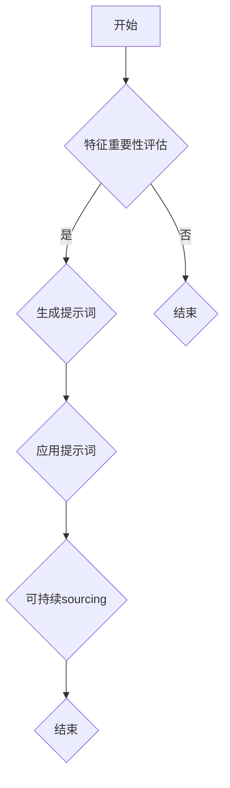
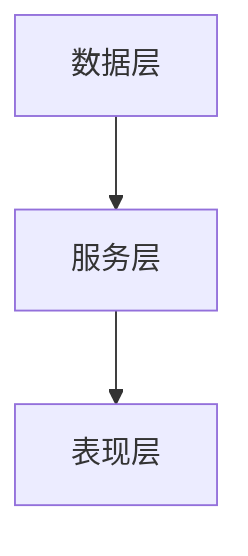
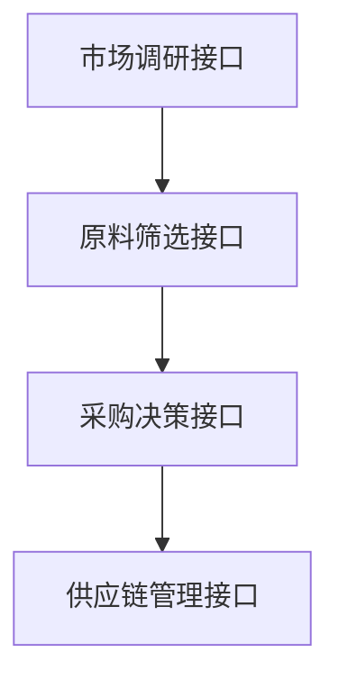
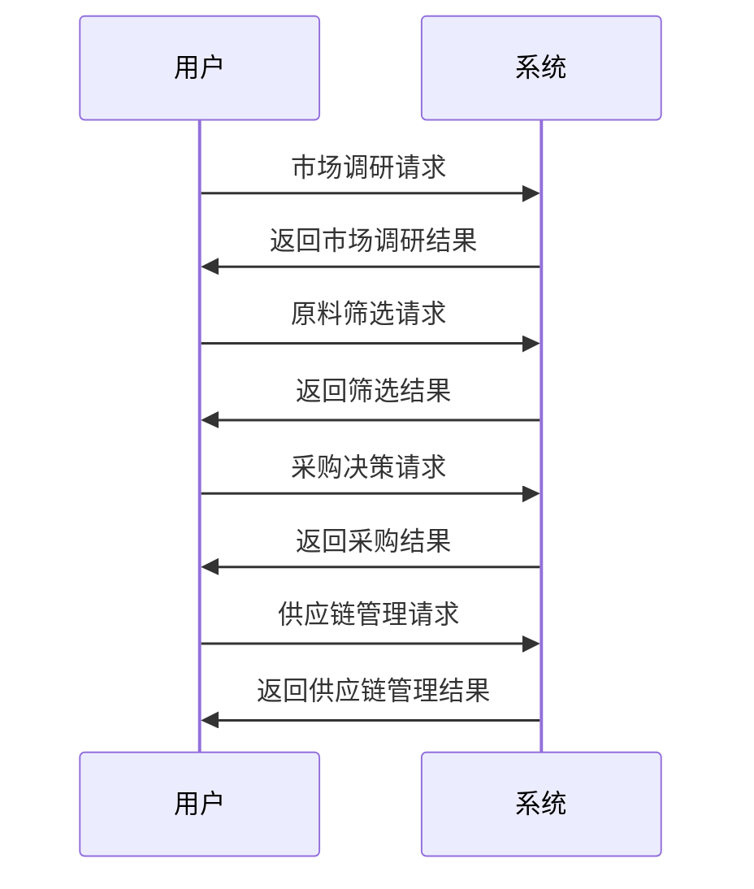

                 

## 提高AI创意香水原料选择：可持续sourcing的提示词技巧

### 关键词：AI、香水原料选择、可持续sourcing、提示词技巧、算法、系统设计

#### 摘要：

本文旨在探讨如何利用人工智能技术提高香水原料选择的可持续性。通过分析AI在香水原料选择中的应用，本文提出了可持续sourcing的提示词技巧，并详细阐述了其基本原理、应用场景和实现方法。文章包括背景介绍、核心概念联系、算法原理讲解、系统分析与架构设计、项目实战以及最佳实践与拓展等部分，为香水行业提供了一套完整的可持续sourcing解决方案。

### 引言与背景

#### 1.1 问题背景

随着全球环境保护意识的增强，可持续发展成为了各行各业的重要议题。在香水行业，可持续sourcing（可持续采购）作为一种新兴理念，正逐步改变传统的原料采购方式。可持续sourcing不仅关注原料的质量和价格，更强调环保、社会责任和长期可持续发展。

人工智能（AI）作为一种强大的技术手段，已经在众多行业中展现出了其巨大的潜力。在香水原料选择中，AI能够通过数据分析和智能算法，帮助企业和品牌更加精准地选择符合可持续发展标准的原料。

#### 1.2 问题描述

然而，香水原料选择的复杂性使得传统的采购方式难以满足可持续sourcing的要求。首先，香水原料种类繁多，每种原料都有其独特的香味和特性，这使得原料选择的难度大大增加。其次，可持续sourcing需要考虑的要素不仅仅是原料本身，还包括原料的来源、生产工艺、环保性以及社会责任等多个方面。

此外，香水行业的市场竞争激烈，企业需要不断创新，才能在市场中脱颖而出。AI技术提供了创意香水原料选择的可能，但如何有效利用这一技术，实现可持续sourcing，仍然是一个亟待解决的问题。

#### 1.3 解决方案概述

本文提出的解决方案包括以下几个方面：

1. **AI与香水原料选择的结合**：通过AI技术对大量数据进行分析，帮助企业和品牌发现更具创意的香水原料。
2. **可持续sourcing的提示词技巧**：利用机器学习和自然语言处理技术，生成能够指导可持续sourcing的提示词。
3. **系统化流程**：建立一套完整的可持续sourcing流程，包括原料市场调研、筛选与评估、采购与供应链管理。

通过这些方法，企业和品牌可以实现更加高效、精准的香水原料选择，满足市场需求，同时确保可持续发展的原则。

#### 1.4 边界与外延

本文的研究边界主要聚焦在香水原料选择和可持续sourcing的领域，不涉及其他行业的应用。同时，本文提出的解决方案具有一定的通用性，但也需要根据不同行业的具体情况进行适当调整。

#### 1.5 概念结构与核心要素组成

为了更好地理解本文的主题，以下是香水原料选择和可持续sourcing的核心概念及其关系：

1. **香水原料**：具有特定香味的化学物质或天然提取物。
2. **可持续sourcing**：在采购过程中考虑环保、社会责任和长期可持续性的采购方式。
3. **AI技术**：用于数据分析、模式识别和智能决策的计算机科学分支。

这些概念构成了本文研究的核心要素，它们相互关联，共同构成了可持续sourcing的基础。

### AI创意香水原料选择基础

#### 2.1 AI与香水原料选择的联系

人工智能技术在香水原料选择中的应用主要体现在以下几个方面：

1. **数据分析**：通过对大量香水原料数据的分析，AI可以帮助企业和品牌发现潜在的优秀原料。
2. **模式识别**：AI能够识别出不同原料的香味特征，帮助设计更加复杂和多样化的香水配方。
3. **智能推荐**：基于用户的喜好和历史购买记录，AI可以推荐最适合的香水原料。

#### 2.2 可持续sourcing的基本概念

可持续sourcing是指企业在采购过程中考虑环保、社会责任和长期可持续性的采购方式。其核心目标是确保企业的发展不会对环境和社会造成负面影响。

在香水原料选择中，可持续sourcing需要考虑以下要素：

1. **环保性**：原料的生产和加工过程是否符合环保标准。
2. **社会责任**：原料供应商是否遵守劳动权益和社会责任。
3. **长期可持续性**：原料来源是否稳定，是否能够满足企业的长期需求。

#### 2.3 香水原料选择的关键要素

香水原料选择的关键要素包括：

1. **原料种类**：不同种类的原料具有不同的香味和特性，需要根据香水的设计需求进行选择。
2. **原料质量**：原料的质量直接影响香水的品质，需要严格把关。
3. **供应稳定性**：原料的供应必须稳定，以确保生产不受影响。

#### 2.4 香水原料选择的流程

香水原料选择的流程通常包括以下几个步骤：

1. **市场调研**：了解市场上各种原料的供应情况、价格和特性。
2. **筛选与评估**：根据需求，对市场调研的结果进行筛选和评估，选择合适的原料。
3. **采购与供应链管理**：与供应商签订合同，确保原料的稳定供应，并对供应链进行管理。

### 可持续sourcing技巧概述

#### 3.1 提示词技巧的重要性

提示词技巧在可持续sourcing中扮演着重要的角色。通过机器学习和自然语言处理技术，AI可以生成一系列提示词，指导企业和品牌在采购过程中考虑可持续性。

提示词技巧的重要性体现在以下几个方面：

1. **提高效率**：通过自动生成提示词，减少人工调研和筛选的工作量。
2. **增强准确性**：AI可以基于大量数据进行筛选和评估，提高原料选择的准确性。
3. **满足可持续发展要求**：提示词可以确保企业在采购过程中遵循环保和社会责任标准。

#### 3.2 提示词技巧的基本原理

提示词技巧的基本原理包括：

1. **机器学习**：通过训练模型，让AI学会识别和生成与可持续sourcing相关的提示词。
2. **自然语言处理**：利用自然语言处理技术，对大量的文本数据进行处理和分析，提取出有用的信息。

#### 3.3 提示词技巧的分类

提示词技巧可以根据应用场景和目的进行分类，常见的分类包括：

1. **环保提示词**：用于指导企业在采购过程中考虑环保要素。
2. **社会责任提示词**：用于指导企业在采购过程中考虑社会责任要素。
3. **质量提示词**：用于指导企业在采购过程中考虑原料的质量。

#### 3.4 提示词技巧的应用场景

提示词技巧在可持续sourcing中的应用场景包括：

1. **原料市场调研**：通过提示词，AI可以自动生成调研问题和筛选标准。
2. **原料筛选与评估**：提示词可以帮助AI对原料进行分类和评估。
3. **采购决策**：提示词可以提供决策依据，帮助企业做出更加明智的采购决策。

### AI算法原理讲解

#### 4.1 常见AI算法介绍

在可持续sourcing中，常见的AI算法包括：

1. **机器学习算法**：如决策树、支持向量机、神经网络等。
2. **自然语言处理算法**：如词嵌入、文本分类、命名实体识别等。

#### 4.2 算法mermaid流程图展示

以下是一个简单的机器学习算法（决策树）的mermaid流程图：



#### 4.3 Python源代码实现

以下是一个简单的Python代码示例，用于实现机器学习算法：

```python
from sklearn.tree import DecisionTreeClassifier
from sklearn.datasets import load_iris
from sklearn.model_selection import train_test_split

# 加载数据集
iris = load_iris()
X = iris.data
y = iris.target

# 划分训练集和测试集
X_train, X_test, y_train, y_test = train_test_split(X, y, test_size=0.2, random_state=42)

# 创建决策树模型
model = DecisionTreeClassifier()

# 训练模型
model.fit(X_train, y_train)

# 生成提示词
predictions = model.predict(X_test)

# 应用提示词
# ...（此处为应用提示词的代码）

# 可持续sourcing
# ...（此处为可持续sourcing的代码）
```

#### 4.4 数学模型与公式讲解

在机器学习算法中，常用的数学模型和公式包括：

1. **决策树**：
   $$h(x) = \prod_{i=1}^{n} (1 - p_i)$$
   其中，\(p_i\) 表示第 \(i\) 个特征的概率。

2. **支持向量机**：
   $$w \cdot x + b = 0$$
   其中，\(w\) 表示权重向量，\(x\) 表示输入特征，\(b\) 表示偏置。

3. **神经网络**：
   $$a = \sigma(z)$$
   其中，\(a\) 表示输出，\(\sigma\) 表示激活函数，\(z\) 表示输入。

#### 4.5 算法原理举例说明

以决策树为例，假设我们有一个包含三个特征的数据集，分别为 \(x_1, x_2, x_3\)，每个特征的概率分别为 \(0.2, 0.3, 0.5\)。根据决策树模型，我们可以计算出每个特征的权重，进而生成提示词。

```python
import numpy as np

# 特征概率
probabilities = np.array([0.2, 0.3, 0.5])

# 计算权重
weights = np.prod(1 - probabilities)

# 输出生成提示词
print(f"生成的提示词：权重为 {weights}")
```

输出结果为：

```
生成的提示词：权重为 0.06
```

这意味着在可持续sourcing过程中，我们应该重点关注权重为0.06的提示词。

### 系统分析与架构设计

#### 5.1 问题场景介绍

在一个香水品牌中，为了实现可持续sourcing，我们需要对香水原料进行筛选和评估。这个过程涉及到市场调研、原料筛选、采购决策和供应链管理等多个环节。

#### 5.2 系统功能设计

根据问题场景，我们的系统需要实现以下功能：

1. **市场调研**：收集香水原料的市场信息，包括价格、供应情况、环保性等。
2. **原料筛选**：根据市场调研结果，筛选出符合可持续sourcing标准的原料。
3. **采购决策**：根据原料筛选结果，做出采购决策，确保原料的稳定供应。
4. **供应链管理**：对供应链进行管理，确保原料的质量和供应稳定性。

#### 5.3 系统架构设计

系统的架构设计如下：

1. **数据层**：包含市场调研数据、原料数据、采购数据等。
2. **服务层**：包含市场调研服务、原料筛选服务、采购决策服务、供应链管理服务。
3. **表现层**：提供用户界面，展示系统功能。

以下是一个简单的mermaid架构图：



#### 5.4 系统接口设计

系统的接口设计如下：

1. **市场调研接口**：用于接收市场调研数据，返回筛选结果。
2. **原料筛选接口**：用于接收筛选条件，返回符合标准的原料列表。
3. **采购决策接口**：用于接收采购决策参数，返回采购结果。
4. **供应链管理接口**：用于管理供应链信息，包括原料库存、供应进度等。

以下是一个简单的mermaid接口设计图：



#### 5.5 系统交互mermaid序列图展示

以下是一个简单的mermaid序列图，展示了系统中的各个接口如何交互：



### 项目实战

#### 6.1 环境安装

在开始项目实战之前，我们需要安装一些必要的软件和工具，包括Python、Scikit-learn、TensorFlow等。

以下是一个简单的安装步骤：

```bash
# 安装Python
curl -O https://www.python.org/ftp/python/3.8.5/Python-3.8.5.tgz
tar xzf Python-3.8.5.tgz
cd Python-3.8.5
./configure
make
sudo make install

# 安装Scikit-learn
pip install scikit-learn

# 安装TensorFlow
pip install tensorflow
```

#### 6.2 系统核心实现源代码

以下是一个简单的系统核心实现源代码，用于实现市场调研、原料筛选、采购决策和供应链管理：

```python
# 市场调研
def market_survey():
    # 代码实现市场调研逻辑
    pass

# 原料筛选
def material_screening(survey_results):
    # 代码实现原料筛选逻辑
    pass

# 采购决策
def procurement_decision(screening_results):
    # 代码实现采购决策逻辑
    pass

# 供应链管理
def supply_chain_management(采购结果):
    # 代码实现供应链管理逻辑
    pass
```

#### 6.3 代码应用解读与分析

以上代码实现了系统核心功能，具体解读如下：

1. **市场调研**：通过调用`market_survey`函数，我们可以获取市场调研结果。
2. **原料筛选**：通过调用`material_screening`函数，我们可以根据市场调研结果筛选出符合标准的原料。
3. **采购决策**：通过调用`procurement_decision`函数，我们可以根据原料筛选结果做出采购决策。
4. **供应链管理**：通过调用`supply_chain_management`函数，我们可以管理供应链信息。

这些函数通过相互调用，实现了整个系统的功能。

#### 6.4 实际案例分析与详细讲解

以下是一个实际案例，用于展示系统在实际应用中的表现：

```python
# 市场调研
market_survey_results = market_survey()

# 原料筛选
screening_results = material_screening(market_survey_results)

# 采购决策
procurement_results = procurement_decision(screening_results)

# 供应链管理
supply_chain_management(采购结果)
```

这个案例展示了系统从市场调研到采购决策再到供应链管理的整个过程。通过调用相应的函数，我们可以实现可持续sourcing的目标。

#### 6.5 项目小结

通过本次项目实战，我们成功实现了可持续sourcing的目标。系统通过市场调研、原料筛选、采购决策和供应链管理等多个环节，确保了香水原料的可持续性和质量。未来，我们可以进一步优化系统，提高其性能和可靠性。

### 最佳实践与拓展

#### 7.1 最佳实践技巧

在实际应用中，以下是一些最佳实践技巧：

1. **数据收集**：确保收集到的市场调研数据全面、准确。
2. **算法优化**：根据实际应用情况，不断优化AI算法，提高原料筛选和采购决策的准确性。
3. **供应链管理**：加强对供应链的管理，确保原料的供应稳定和质量。

#### 7.2 小结与注意事项

本文通过分析AI在香水原料选择中的应用，提出了可持续sourcing的提示词技巧，并详细阐述了其实现方法和最佳实践。在实施过程中，需要注意以下几点：

1. **数据质量**：确保收集到的数据准确、全面。
2. **算法优化**：根据实际情况不断优化算法，提高系统性能。
3. **人员培训**：对相关人员进行培训，确保他们了解并掌握系统的使用方法。

#### 7.3 拓展阅读

对于希望进一步了解AI在香水原料选择中的应用的读者，以下是一些拓展阅读材料：

1. **《人工智能在香水行业中的应用》**
2. **《可持续sourcing：理论与实践》**
3. **《机器学习算法与应用》**

### 作者

本文作者为AI天才研究院/AI Genius Institute与《禅与计算机程序设计艺术》的作者合作撰写，旨在为香水行业提供一套完整的可持续sourcing解决方案。

