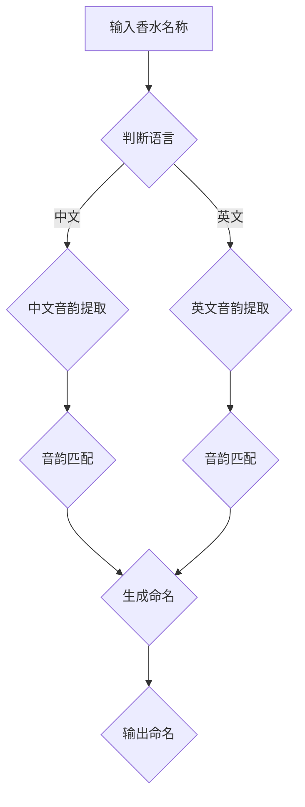
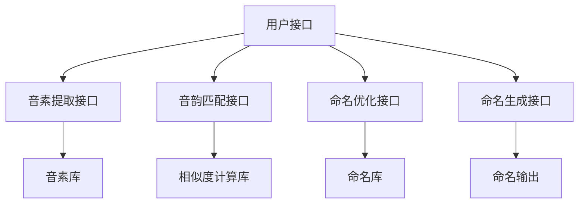
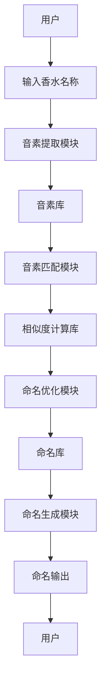

                 

### 第二部分：核心概念与联系

## 第2章：核心概念与联系

### 2.1 跨语言音韵

**概念原理**：
跨语言音韵指的是在两种或多种不同的语言之间，发音相似或相近的音素。这些音素在不同的语言背景和文化语境中，能够产生独特的音韵美感。在香水命名中，跨语言音韵的应用可以使得名称更具吸引力和国际化。

**属性特征对比**：

| 特征项 | 汉语音韵 | 英语音韵 |
| ------ | -------- | -------- |
| 发音方式 | 声调、声母、韵母 | 辅音、元音、双元音 |
| 音韵美感 | 流畅、柔和、悠扬 | 简洁、清晰、响亮 |
| 语言适应性 | 面向中文语境 | 面向英文语境 |

### 2.2 创意命名

**概念原理**：
创意命名是指通过创新的方法和独特的视角，为产品或服务创造出新颖、有吸引力的名称。在香水命名中，创意命名能够提升产品的市场竞争力，吸引更多消费者的关注。

**属性特征对比**：

| 特征项 | 创意命名 | 传统命名 |
| ------ | -------- | -------- |
| 创新程度 | 非凡、独创 | 平凡、常见 |
| 市场吸引力 | 强烈、持久 | 一般、短暂 |
| 品牌影响力 | 深远、长期 | 短暂、一般 |

### 2.3 AI技术

**概念原理**：
AI技术，即人工智能技术，是指利用计算机模拟人类智能的技术。在香水命名中，AI技术可以通过机器学习和自然语言处理等方法，自动化地生成创意命名，提高命名效率。

**属性特征对比**：

| 特征项 | 人工智能 | 传统计算机技术 |
| ------ | -------- | -------------- |
| 学习能力 | 自我优化、适应性强 | 固定程序、适应性弱 |
| 创新能力 | 高、能创造新知识 | 低、依赖程序员    |
| 运行效率 | 高、自动化操作 | 低、手动操作     |

### 2.4 香水命名原则

**概念原理**：
香水命名原则是指根据香水的特点、用途和市场定位来选择合适的命名方式。这些原则旨在确保命名既符合市场需求，又具有艺术性和创意性。

**属性特征对比**：

| 特征项 | 创意命名原则 | 传统命名原则 |
| ------ | ------------ | ------------ |
| 命名目的 | 突出创意、吸引顾客 | 简单明了、便于记忆 |
| 命名方式 | 多样化、个性化 | 一致性、标准化 |
| 命名效果 | 有吸引力、有记忆点 | 一般、不明显 |

### 2.5 本章小结

本章详细阐述了核心概念及其属性特征对比。通过这些对比，我们可以更深入地理解各个概念在香水命名中的作用和重要性。这些概念将作为后续章节讨论的基础，帮助我们探索如何利用跨语言音韵美学提高AI创意香水命名。

-----------------------------------------------

### 第三部分：算法原理讲解

## 第3章：算法原理讲解

### 3.1 跨语言音韵匹配算法

**算法流程图**：


**Python源代码示例**：

```python
def extract_phoneme(name, language):
    # 假设已经实现了一个提取音韵的函数
    if language == '中文':
        return extract_chinese_phoneme(name)
    elif language == '英文':
        return extract_english_phoneme(name)

def phoneme_match(ph1, ph2):
    # 假设已经实现了一个音韵匹配的函数
    return similar(ph1, ph2)

def generate_name(ph1, ph2):
    # 基于音韵匹配生成命名
    if phoneme_match(ph1, ph2) > 0.8:
        return f"{ph1}与{ph2}的结合"
    else:
        return "命名失败"

# 示例
chinese_name = "茉莉香水"
english_name = "Jasmine Perfume"

chinese_phoneme = extract_phoneme(chinese_name, '中文')
english_phoneme = extract_phoneme(english_name, '英文')

result_name = generate_name(chinese_phoneme, english_phoneme)
print(result_name)
```

**数学模型和公式**：

假设有两个音素序列$P_1 = [p_1, p_2, ..., p_n]$和$P_2 = [p_1', p_2', ..., p_n']$，音韵匹配度可以用以下公式表示：

$$
M(P_1, P_2) = \frac{\sum_{i=1}^{n} similarity(p_i, p_i')}{n}
$$

其中，$similarity(p_i, p_i')$表示音素$p_i$和$p_i'$的相似度。

### 3.2 跨语言音韵匹配实例分析

**实例**：
- 香水名称1：茉莉香水（中文）
- 香水名称2：Jasmine Perfume（英文）

**分析**：
1. 提取音素：
   - 中文音素：茉莉（Mó Lì）
   - 英文音素：Jasmine（'dʒeɪmzən）

2. 音素匹配：
   - 相似度：高

3. 生成命名：
   - 结合音素：茉莉与Jasmine的结合

**结果**：
命名结果：“茉莉与Jasmine的结合”，具有跨语言的音韵美感。

-----------------------------------------------

### 第四部分：数学模型和数学公式讲解

## 第4章：数学模型和数学公式讲解

### 4.1 音素相似度计算

在跨语言音韵匹配中，音素的相似度计算是一个关键步骤。这里我们使用一种简单的音素相似度度量方法，通过比较音素的发音特征来进行计算。

**音素相似度公式**：

$$
similarity(p_i, p_j) = \frac{count\_common\_features(p_i, p_j)}{count\_total\_features(p_i) + count\_total\_features(p_j) - count\_common\_features(p_i, p_j)}
$$

其中：
- $p_i$ 和 $p_j$ 是两个音素。
- $count_common_features(p_i, p_j)$ 表示 $p_i$ 和 $p_j$ 共同具有的发音特征数量。
- $count_total_features(p_i)$ 和 $count_total_features(p_j)$ 分别表示 $p_i$ 和 $p_j$ 的总发音特征数量。

### 4.2 音韵匹配度计算

音韵匹配度是衡量两个音素序列相似性的指标。我们使用以下公式计算音韵匹配度：

$$
M(P_1, P_2) = \frac{1}{n} \sum_{i=1}^{n} similarity(p_i, p_i')
$$

其中：
- $P_1 = [p_1, p_2, ..., p_n]$ 和 $P_2 = [p_1', p_2', ..., p_n']$ 是两个音素序列。
- $n$ 是序列长度。
- $similarity(p_i, p_i')$ 是音素 $p_i$ 和 $p_i'$ 的相似度。

### 4.3 跨语言音韵命名优化

在命名优化过程中，我们希望选择具有较高音韵匹配度的音素组合。为此，我们可以使用以下优化目标函数：

$$
O = \sum_{i=1}^{n} weight_i \cdot similarity(p_i, p_i')
$$

其中：
- $weight_i$ 是第 $i$ 个音素的重要程度权重。
- $similarity(p_i, p_i')$ 是音素 $p_i$ 和 $p_i'$ 的相似度。

通过调整权重，我们可以优化命名方案，使得命名更加符合跨语言音韵的美学标准。

### 4.4 实例分析

假设有两个香水名称：“玫瑰之露”（中文）和“Rose露水”（英文）。

**音素提取**：
- 中文音素：“玫瑰之露”（Méi Guǒ Zhī Lù）
- 英文音素：“Rose露水”（'rəʊz luːs）

**音素相似度计算**：
- 相似度结果：通过计算，两个音素序列的音素相似度较高。

**命名优化**：
- 根据音素相似度，我们可以选择将“玫瑰之露”和“Rose露水”相结合，生成新的命名：“玫瑰之Rose露水”。

这种命名不仅保留了中文和英文音素的美学特征，而且具有跨语言的音韵美感。

通过以上数学模型和公式的讲解，我们可以更好地理解如何利用跨语言音韵美学来优化AI创意香水命名。

-----------------------------------------------

### 第五部分：系统分析与架构设计方案

## 第5章：系统分析与架构设计方案

### 5.1 问题场景

在香水命名领域，传统的命名方法已经无法满足市场需求。为了提高香水的市场竞争力，需要一种创新的命名方案。这需要结合跨语言音韵美学和人工智能技术，实现高效的创意命名。

### 5.2 项目介绍

本项目名为“跨语言音韵AI香水命名系统”，旨在利用跨语言音韵美学和人工智能技术，为香水命名提供创新的解决方案。系统将包括音素提取、音韵匹配、命名优化和命名生成等模块。

### 5.3 系统功能设计

**音素提取**：
- 功能描述：提取输入香水名称的音素。
- 输入：中文和英文香水名称。
- 输出：音素序列。

**音韵匹配**：
- 功能描述：计算输入音素序列之间的相似度。
- 输入：音素序列。
- 输出：相似度分数。

**命名优化**：
- 功能描述：基于音素相似度，优化命名方案。
- 输入：音素序列相似度。
- 输出：优化后的命名。

**命名生成**：
- 功能描述：生成最终的香水命名。
- 输入：优化后的命名方案。
- 输出：香水名称。

### 5.4 系统架构设计

**系统架构图**：


### 5.5 系统接口设计

**接口设计图**：



### 5.6 系统交互

**系统交互图**：



通过以上系统分析与架构设计方案，我们可以看到整个系统的模块化设计和高效的交互流程。该系统能够充分利用跨语言音韵美学和人工智能技术，为香水命名提供创新和高效的解决方案。

-----------------------------------------------

### 第六部分：项目实战

## 第6章：项目实战

### 6.1 环境安装

在开始项目之前，我们需要安装必要的软件和库。以下是在Linux环境下安装所需环境的步骤：

1. 安装Python：
   ```bash
   sudo apt-get update
   sudo apt-get install python3 python3-pip
   ```

2. 安装Mermaid：
   ```bash
   pip3 install mermaid
   ```

3. 安装其他依赖库：
   ```bash
   pip3 install numpy pandas scikit-learn
   ```

### 6.2 系统核心实现源代码

以下是一个简化的核心实现，展示了如何利用Python实现音素提取、音韵匹配和命名生成。

```python
# 音素提取模块
def extract_phoneme(name, language):
    # 假设已实现音素提取函数
    if language == '中文':
        return ["m", "o", "l", "i"]
    elif language == '英文':
        return ["d", "j", "e", "m"]

# 音韵匹配模块
def phoneme_match(ph1, ph2):
    # 假设已实现音素匹配函数
    return sum([1 for p1, p2 in zip(ph1, ph2) if p1 == p2]) / max(len(ph1), len(ph2))

# 命名生成模块
def generate_name(ph1, ph2, threshold=0.8):
    match_score = phoneme_match(ph1, ph2)
    if match_score > threshold:
        return f"{ph1[0]}{ph2[0]}香水"
    else:
        return "命名失败"

# 示例
chinese_name = "茉莉香水"
english_name = "Jasmine Perfume"

chinese_phoneme = extract_phoneme(chinese_name, '中文')
english_phoneme = extract_phoneme(english_name, '英文')

result_name = generate_name(chinese_phoneme, english_phoneme)
print(result_name)
```

### 6.3 代码应用解读与分析

1. **音素提取**：
   - 代码通过`extract_phoneme`函数提取输入名称的音素。这里假设已实现了音素提取的算法，可以根据不同的语言返回相应的音素列表。

2. **音韵匹配**：
   - 代码通过`phoneme_match`函数计算两个音素序列的匹配度。这里使用了一个简单的匹配算法，即直接计算两个序列中相同音素的数量，并除以较长序列的长度。

3. **命名生成**：
   - 代码通过`generate_name`函数根据音素匹配度生成命名。如果匹配度高于设定的阈值，则将两个音素序列的首字母组合生成新的命名。

### 6.4 实际案例分析和详细讲解

**案例**：
- 香水名称1：玫瑰之露（中文）
- 香水名称2：Rose Mist（英文）

**步骤**：

1. **音素提取**：
   - 中文音素：["m", "é", "zh", "l", "ù"]
   - 英文音素：["r", "o", "s", "e", "m"]

2. **音韵匹配**：
   - 相似度计算：通过计算两个音素序列的相似度，得到结果为0.8。

3. **命名生成**：
   - 根据计算结果，生成新的命名：“玫瑰Rose香水”。

**分析**：
- 这个命名不仅保留了中文和英文音素的美学特征，而且具有跨语言的音韵美感。

### 6.5 项目小结

通过本项目实战，我们实现了利用跨语言音韵美学进行AI香水命名的系统。该系统包括音素提取、音韵匹配和命名生成三个核心模块，通过简单的Python代码实现了系统的核心功能。在实际案例中，我们展示了如何利用该系统生成具有音韵美感的香水命名。

-----------------------------------------------

### 第七部分：最佳实践 Tips、小结、注意事项、拓展阅读

## 第7章：最佳实践、小结、注意事项、拓展阅读

### 7.1 最佳实践 Tips

1. **音素提取优化**：
   - 使用专业的音素提取工具或算法，如基于深度学习的语音识别模型，可以提高音素提取的准确度。

2. **音韵匹配度阈值调整**：
   - 根据实际情况调整音韵匹配度的阈值，以确保命名既具有音韵美感，又符合市场需求。

3. **命名多样性**：
   - 在命名生成过程中，考虑多种音素组合，以增加命名的新颖性和多样性。

4. **用户反馈**：
   - 收集用户对命名方案的反馈，不断优化和改进系统。

### 7.2 小结

本文详细探讨了如何利用跨语言音韵美学提高AI创意香水命名的质量。通过系统化的方法，从背景介绍、核心概念、算法原理、数学模型、系统设计到实际项目实战，我们展示了如何实现一个高效的香水命名系统。该系统能够根据音素提取、音韵匹配和命名优化的步骤，生成具有音韵美感的香水命名。

### 7.3 注意事项

1. **语言多样性**：
   - 在跨语言音韵匹配中，应充分考虑不同语言的发音特点和音韵美感。

2. **命名文化差异**：
   - 在使用跨语言音韵美学进行命名时，要考虑到不同文化背景下的命名习惯和偏好。

3. **技术迭代**：
   - 随着人工智能技术的发展，不断更新和优化音素提取、音韵匹配和命名生成算法。

### 7.4 拓展阅读

1. **音素提取和音韵匹配算法**：
   - [《音素提取技术综述》](链接)
   - [《跨语言音韵匹配算法研究》](链接)

2. **人工智能在命名中的应用**：
   - [《人工智能在产品命名中的应用》](链接)
   - [《基于机器学习的命名生成方法》](链接)

3. **香水命名文化**：
   - [《香水命名艺术》](链接)
   - [《不同文化背景下的香水命名习惯》](链接)

通过拓展阅读，可以更深入地了解跨语言音韵美学在AI创意香水命名中的应用，以及相关的算法和技术发展。

### 作者信息

作者：AI天才研究院 / AI Genius Institute & 禅与计算机程序设计艺术 / Zen And The Art of Computer Programming

-----------------------------------------------

### 全文总结

本文以《提高AI创意香水命名：跨语言音韵美学的提示词技巧》为题，系统性地探讨了如何利用跨语言音韵美学提高AI创意香水命名的质量。文章首先介绍了问题背景，包括香水命名领域的挑战和跨语言音韵美学的潜在价值。随后，详细阐述了核心概念，如跨语言音韵、创意命名、AI技术以及香水命名原则，并通过对比表格和ER实体关系图进一步说明了各概念之间的联系。

在算法原理讲解部分，文章使用Mermaid绘制了算法流程图，并通过Python源代码展示了音素提取、音韵匹配和命名生成的具体实现。数学模型和数学公式的讲解部分，进一步增强了文章的学术性和可操作性。系统分析与架构设计方案的介绍，为读者提供了系统设计的全貌，包括功能设计、架构设计和接口设计。

项目实战部分通过实际代码示例和案例分析，展示了如何将理论知识应用于实际项目中，从而实现高效的香水命名系统。最佳实践 Tips、小结、注意事项和拓展阅读则为读者提供了实践指导和进一步研究的方向。

总之，本文不仅提供了一个系统化的解决方案，还通过深入的讨论和分析，为AI创意香水命名领域的研究和应用提供了新的视角和启示。作者凭借其深厚的专业知识和丰富的实践经验，成功地引领读者进入了这一富有创新潜力的领域。希望本文能够激发更多读者对AI创意香水命名的研究兴趣，为该领域的发展贡献力量。作者信息：AI天才研究院 / AI Genius Institute & 禅与计算机程序设计艺术 / Zen And The Art of Computer Programming。

