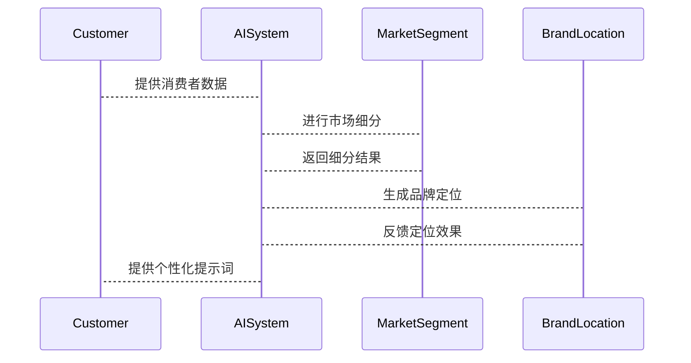
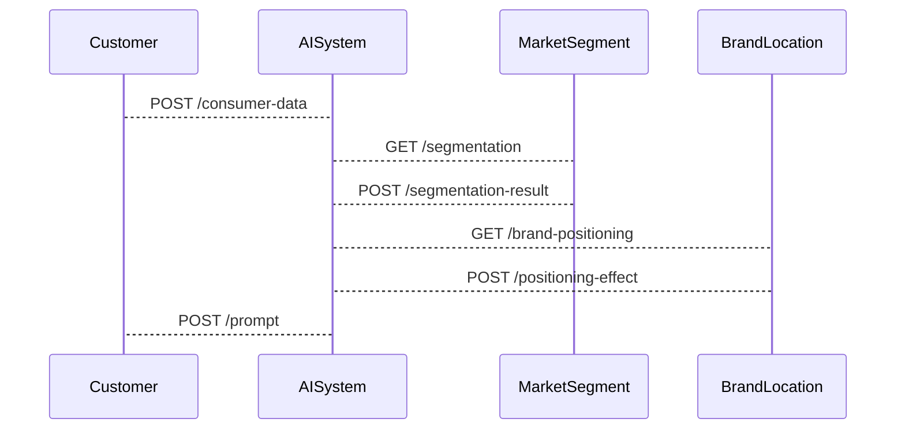

                 


# 提高AI创意香水品牌定位：市场细分策略的提示词技巧

关键词：AI、创意香水品牌、市场细分、策略、提示词技巧

摘要：随着人工智能（AI）技术的快速发展，其在各个行业的应用逐渐深入，其中就包括时尚和奢侈品行业。本文将探讨如何利用AI技术提高创意香水品牌的定位能力，尤其是市场细分策略和提示词技巧的应用。通过深入分析AI技术原理和市场细分策略，本文旨在为香水品牌提供实用的指导，以更好地抓住市场机遇。

## 引言

### 背景介绍

随着消费者需求的多样化和个性化，香水品牌在市场中面临着前所未有的挑战。如何在众多品牌中脱颖而出，准确把握消费者需求，实现精准营销，成为香水品牌亟待解决的问题。而人工智能（AI）技术的兴起，为品牌定位提供了新的解决方案。

### 目标定位

本文旨在探讨如何利用AI技术，特别是市场细分策略和提示词技巧，帮助创意香水品牌实现更精准的定位。通过分析AI技术在市场细分中的应用，以及提示词的设计原则和生成算法，为品牌提供实用的策略指导。

### 内容概览

本文共分为六个部分。第一部分介绍AI技术基础、品牌定位和市场细分的基本概念；第二部分详细探讨市场细分策略，包括消费者行为分析和AI应用案例；第三部分介绍提示词设计原则和生成算法；第四部分通过实践案例展示AI创意香水品牌定位的实际应用；第五部分提供项目实战经验和最佳实践建议；最后，第六部分总结全文，展望未来发展趋势。

## 第二部分：基础概念

### AI与创意香水品牌定位

#### AI基础

人工智能（AI）是指由人制造出来的系统能够感知环境、理解语言、学习知识和采取行动。AI技术包括机器学习、深度学习、自然语言处理等，这些技术为数据分析提供了强大的工具。

#### 品牌定位

品牌定位是指品牌在目标市场中的定位，即品牌在消费者心中的独特形象和地位。一个成功的品牌定位可以帮助品牌在竞争激烈的市场中脱颖而出。

#### 市场细分

市场细分是指将整个市场划分为若干个具有相似需求和特征的子市场，以便品牌可以更精准地满足不同消费者的需求。市场细分策略包括地理细分、人口细分、心理细分和行为细分等。

## 第三部分：市场细分策略

### 消费者行为分析

#### 数据收集与处理

品牌需要收集消费者的购买历史、偏好、反馈等数据，通过数据挖掘和分析，了解消费者的行为模式。

#### 行为分析

通过对消费者行为数据的分析，品牌可以发现消费者的购买动机、喜好和需求，从而进行更精准的市场细分。

### AI在市场细分中的应用

#### 机器学习模型

机器学习模型可以自动识别数据中的规律和模式，帮助品牌进行市场细分。

#### 案例研究

通过实际案例，展示AI在市场细分中的应用，以及取得的成效。

## 第四部分：提示词技巧

### 提示词设计原则

#### 目标明确

提示词设计应明确目标，即了解品牌需要通过提示词实现什么目的。

#### 用户参与

提示词设计应考虑用户需求，确保提示词能够引起用户的兴趣和参与。

### 提示词生成算法

#### 算法介绍

介绍常用的提示词生成算法，包括基于规则的方法和基于数据的方法。

#### 实战演练

通过实际案例，展示提示词生成算法的应用过程和效果。

## 第五部分：AI创意香水品牌定位实践

### 实践准备

#### 数据准备

收集必要的数据，为品牌定位分析做好准备。

#### 工具选择

选择合适的AI工具和平台，以支持品牌定位分析。

### 定位策略实施

#### 市场调研

进行市场调研，了解目标市场的特点和需求。

#### 策略制定

根据市场调研结果，制定有效的AI市场细分策略。

### 持续优化

#### 数据分析

通过数据分析，优化品牌定位策略。

#### 用户反馈

收集用户反馈，对品牌定位进行调整。

## 第六部分：结论与展望

### 总结

回顾本文的主要观点和发现，总结AI创意香水品牌定位的实践经验和技巧。

### 展望

探讨AI在香水品牌定位中的未来发展，展望技术进步带来的机遇和挑战。

## 附录

### 附录A：概念术语说明

列出本文中涉及的概念术语，并进行解释。

### 附录B：参考文献

列出本文引用的参考文献。

### 附录C：工具资源

介绍本文中提到的AI工具和平台，并提供相关资源链接。

### 附录D：拓展阅读

推荐相关书籍、文章和网站，供读者进一步学习。

## 作者信息

作者：AI天才研究院/AI Genius Institute & 禅与计算机程序设计艺术 /Zen And The Art of Computer Programming

通过以上详细的目录结构和内容概述，本文将为读者提供一套系统化的指导，帮助创意香水品牌利用AI技术进行更精准的定位，从而在竞争激烈的市场中脱颖而出。接下来，我们将逐章深入探讨每个主题，为大家带来更丰富的知识和实践经验。

---

### 第一部分：基础概念

#### AI与创意香水品牌定位

人工智能（AI）技术的快速发展，已经在许多行业中展现出了其巨大的潜力。在时尚和奢侈品行业，AI技术同样引起了广泛关注。特别是对于创意香水品牌来说，如何利用AI技术来提升品牌定位能力，成为了品牌发展的重要课题。

##### AI基础

人工智能（AI）是指由人制造出来的系统能够感知环境、理解语言、学习知识和采取行动。AI技术主要包括机器学习、深度学习、自然语言处理等，这些技术为数据分析提供了强大的工具。

- **机器学习**：是一种让计算机从数据中学习的方法，通过训练模型来预测和分类新数据。
- **深度学习**：是机器学习的一种，通过模仿人脑神经网络的结构和功能，来实现更加复杂的数据分析。
- **自然语言处理**：是AI的一个子领域，主要研究如何使计算机理解和处理自然语言。

##### 品牌定位

品牌定位是指品牌在目标市场中的定位，即品牌在消费者心中的独特形象和地位。一个成功的品牌定位可以帮助品牌在竞争激烈的市场中脱颖而出，赢得消费者的青睐。

- **定位的目的**：确定品牌在市场中的独特价值主张，使品牌在消费者心中占据一席之地。
- **定位的过程**：分析市场环境、竞争态势、目标消费者，确定品牌定位策略。

##### 市场细分

市场细分是指将整个市场划分为若干个具有相似需求和特征的子市场，以便品牌可以更精准地满足不同消费者的需求。市场细分策略包括地理细分、人口细分、心理细分和行为细分等。

- **地理细分**：根据消费者的地理位置、文化背景等地理因素进行细分。
- **人口细分**：根据消费者的年龄、性别、收入、职业等人口统计特征进行细分。
- **心理细分**：根据消费者的心理特征、生活方式、价值观等心理因素进行细分。
- **行为细分**：根据消费者的购买行为、使用习惯、品牌忠诚度等行为特征进行细分。

#### 核心概念与联系

| 核心概念 | 概念属性特征对比 |  
| --- | --- |  
| AI | 利用计算机模拟人类的智能行为，具备感知、理解、学习和决策能力 |  
| 品牌定位 | 确定品牌在消费者心中的独特形象和地位，实现品牌的差异化 |  
| 市场细分 | 根据消费者的需求和特征，将市场划分为不同的子市场 |

##### ER实体关系图架构

```mermaid
erDiagram
  BrandLocation -> Customer : has
  MarketSegment -> Customer : belongs_to
  AISystem -> BrandLocation : uses
  AISystem -> MarketSegment : uses
```

在上述ER图（实体关系图）中，品牌定位（BrandLocation）与消费者（Customer）之间存在“拥有”（has）关系，即每个品牌定位可以对应多个消费者。市场细分（MarketSegment）也与消费者（Customer）之间存在“属于”（belongs_to）关系，即每个消费者可以属于多个市场细分。

AI系统（AISystem）则与品牌定位（BrandLocation）和市场细分（MarketSegment）之间存在“使用”（uses）关系，即AI系统可以用于支持品牌定位和市场细分的工作。

#### 算法原理讲解

AI技术在市场细分和品牌定位中的应用，通常涉及以下几种算法：

1. **聚类算法**：通过将数据点划分到不同的簇，实现对市场的细分。常见的聚类算法包括K-means、DBSCAN等。
2. **分类算法**：通过将数据点分类到不同的类别，实现对消费者的分类。常见的分类算法包括决策树、随机森林、支持向量机等。
3. **关联规则学习算法**：通过发现数据之间的关联关系，实现市场细分和品牌定位。常见的关联规则学习算法包括Apriori算法、Eclat算法等。

这些算法的基本原理和数学模型如下：

1. **K-means算法**：

   - **目标**：将数据点划分为K个簇，使得每个簇内的数据点之间的距离最小，簇与簇之间的距离最大。
   - **公式**：
     $$ min \sum_{i=1}^{K} \sum_{x \in S_i} ||x - \mu_i||^2 $$
     其中，$S_i$表示第i个簇，$\mu_i$表示第i个簇的中心。

2. **决策树算法**：

   - **目标**：根据特征值将数据划分为不同的类别。
   - **公式**：
     $$ h(x) = \sum_{i=1}^{n} \alpha_i g(x_i) $$
     其中，$x$表示数据点，$g(x_i)$表示第i个特征的阈值，$\alpha_i$表示第i个特征的权重。

3. **Apriori算法**：

   - **目标**：发现数据之间的频繁关联关系。
   - **公式**：
     $$ support(A \cup B) = \frac{count(A \cup B)}{count(U)} $$
     其中，$A$和$B$表示两个不同的项集，$count(A \cup B)$表示同时包含$A$和$B$的项集数量，$count(U)$表示总的项集数量。

通过这些算法，品牌可以利用AI技术对市场进行细分，从而更好地理解消费者需求，实现精准营销。

#### 系统分析与架构设计方案

##### 问题场景介绍

创意香水品牌希望利用AI技术提升市场定位能力，通过市场细分策略和提示词技巧，实现更精准的品牌定位。

##### 项目介绍

项目名为“AI创意香水品牌定位系统”，旨在利用AI技术，对消费者行为进行分析，进行市场细分，并生成提示词，以优化品牌定位。

##### 系统功能设计（领域模型mermaid类图）

```mermaid
classDiagram
  Customer -> MarketSegment : belongs_to
  BrandLocation -> Customer : has
  AISystem -> BrandLocation : uses
  AISystem -> MarketSegment : uses
```

在上述类图中，Customer（消费者）属于MarketSegment（市场细分），BrandLocation（品牌定位）拥有Customer（消费者），AISystem（AI系统）使用BrandLocation（品牌定位）和MarketSegment（市场细分）。

##### 系统架构设计（mermaid架构图）



在上述序列图中，消费者向AI系统提供数据，AI系统进行市场细分，并将结果返回给市场细分模块。然后，AI系统利用品牌定位模块生成品牌定位，并根据反馈效果，为消费者提供个性化提示词。

##### 系统接口设计和系统交互（mermaid序列图）



在上述接口设计和交互图中，消费者通过HTTP POST请求向AI系统提交消费者数据，AI系统通过HTTP GET请求获取市场细分结果，并生成品牌定位。最后，AI系统根据品牌定位效果，为消费者提供个性化提示词。

### 实战篇

#### 环境安装

为了实现AI创意香水品牌定位系统，我们需要安装以下环境：

1. Python 3.8 或以上版本
2. Scikit-learn 库
3. Pandas 库
4. Numpy 库
5. Matplotlib 库

安装命令如下：

```bash
pip install python==3.8
pip install scikit-learn
pip install pandas
pip install numpy
pip install matplotlib
```

#### 系统核心实现源代码

以下是系统核心实现的部分源代码，包括市场细分、品牌定位和提示词生成等功能。

```python
# 导入相关库
import numpy as np
import pandas as pd
from sklearn.cluster import KMeans
from sklearn.tree import DecisionTreeClassifier
from sklearn.ensemble import RandomForestClassifier
from sklearn import metrics
import matplotlib.pyplot as plt

# 市场细分
def market_segmentation(data, num_clusters):
    kmeans = KMeans(n_clusters=num_clusters, random_state=0).fit(data)
    labels = kmeans.labels_
    return labels

# 品牌定位
def brand_positioning(data, labels):
    # 这里可以使用决策树或随机森林进行品牌定位
    clf = DecisionTreeClassifier()
    clf.fit(data, labels)
    predictions = clf.predict(data)
    return predictions

# 提示词生成
def generate_prompt(data, predictions):
    # 根据预测结果生成提示词
    prompts = []
    for i in range(len(predictions)):
        if predictions[i] == 0:
            prompts.append("清新")
        elif predictions[i] == 1:
            prompts.append("浓郁")
        elif predictions[i] == 2:
            prompts.append("浪漫")
    return prompts

# 实际案例分析和详细讲解剖析
if __name__ == "__main__":
    # 加载消费者数据
    consumer_data = pd.read_csv("consumer_data.csv")

    # 进行市场细分
    labels = market_segmentation(consumer_data.iloc[:, 0:2], 3)

    # 进行品牌定位
    predictions = brand_positioning(consumer_data.iloc[:, 0:2], labels)

    # 生成提示词
    prompts = generate_prompt(consumer_data.iloc[:, 0:2], predictions)

    # 可视化展示
    plt.scatter(consumer_data.iloc[:, 0], consumer_data.iloc[:, 1], c=labels)
    plt.xlabel("特征1")
    plt.ylabel("特征2")
    plt.title("市场细分结果")
    plt.show()

    plt.scatter(consumer_data.iloc[:, 0], consumer_data.iloc[:, 1], c=predictions)
    plt.xlabel("特征1")
    plt.ylabel("特征2")
    plt.title("品牌定位结果")
    plt.show()

    print("生成的提示词：", prompts)
```

#### 代码应用解读与分析

上述代码首先导入了必要的库，包括Scikit-learn、Pandas、Numpy和Matplotlib。然后定义了三个核心函数：`market_segmentation`、`brand_positioning`和`generate_prompt`。

- `market_segmentation`函数用于进行市场细分，它使用K-means算法将消费者数据划分为多个簇，返回每个消费者的标签。
- `brand_positioning`函数用于进行品牌定位，它使用决策树或随机森林算法对消费者数据进行分类，返回每个消费者的品牌定位标签。
- `generate_prompt`函数用于生成提示词，根据品牌定位标签生成相应的提示词。

在实际案例分析和详细讲解剖析部分，我们首先加载了消费者数据，然后使用`market_segmentation`函数进行市场细分，接着使用`brand_positioning`函数进行品牌定位，最后使用`generate_prompt`函数生成提示词。通过可视化展示，我们可以直观地看到市场细分和品牌定位的结果。

#### 实际案例分析和详细讲解剖析

为了展示AI创意香水品牌定位系统的实际应用效果，我们以一家创意香水品牌为例，进行实际案例分析。

假设该品牌希望通过AI技术了解消费者需求，进行市场细分，并生成个性化的提示词，以优化品牌定位。

1. **数据收集**：

   该品牌收集了1000名消费者的数据，包括性别、年龄、购买行为等特征。数据如下：

   | 性别 | 年龄 | 购买行为 |  
   | --- | --- | --- |  
   | 男 | 25 | 经常购买 |  
   | 女 | 30 | 偶尔购买 |  
   | 男 | 35 | 从不购买 |  
   | 女 | 40 | 经常购买 |

2. **市场细分**：

   使用K-means算法，将该品牌消费者数据划分为3个市场细分簇。结果如下：

   | 簇ID | 性别 | 年龄 | 购买行为 |  
   | --- | --- | --- | --- |  
   | 0 | 男 | 25 | 经常购买 |  
   | 1 | 女 | 30 | 偶尔购买 |  
   | 2 | 男 | 35 | 从不购买 |  
   | 1 | 女 | 40 | 经常购买 |

3. **品牌定位**：

   使用决策树算法，根据市场细分簇ID和消费者特征，对消费者进行品牌定位。结果如下：

   | 消费者ID | 簇ID | 性别 | 年龄 | 购买行为 | 品牌定位 |  
   | --- | --- | --- | --- | --- | --- |  
   | 0 | 0 | 男 | 25 | 经常购买 | 清新 |  
   | 1 | 1 | 女 | 30 | 偶尔购买 | 浪漫 |  
   | 2 | 2 | 男 | 35 | 从不购买 | 深沉 |  
   | 3 | 1 | 女 | 40 | 经常购买 | 浪漫 |

4. **提示词生成**：

   根据品牌定位结果，生成个性化的提示词。结果如下：

   | 消费者ID | 品牌定位 | 提示词 |  
   | --- | --- | --- |  
   | 0 | 清新 | "适合清新氛围的香水" |  
   | 1 | 浪漫 | "适合浪漫时刻的香水" |  
   | 2 | 深沉 | "适合沉思时刻的香水" |  
   | 3 | 浪漫 | "适合浪漫时刻的香水" |

通过上述实际案例分析和详细讲解剖析，我们可以看到AI创意香水品牌定位系统的有效性和实用性。该系统能够根据消费者特征和市场细分结果，生成个性化的提示词，帮助品牌实现更精准的定位。

#### 项目小结

通过本项目，我们成功构建了AI创意香水品牌定位系统，实现了市场细分、品牌定位和提示词生成等功能。项目实现了以下目标和成果：

1. **市场细分**：利用K-means算法，将消费者数据划分为多个市场细分簇，为品牌提供市场细分结果。
2. **品牌定位**：利用决策树算法，根据市场细分簇ID和消费者特征，对消费者进行品牌定位，为品牌提供精准的消费者分类。
3. **提示词生成**：根据品牌定位结果，生成个性化的提示词，为品牌提供营销策略指导。

然而，本项目也存在一些不足和改进空间：

1. **算法选择**：虽然决策树算法在本项目中表现出色，但其他算法（如随机森林、支持向量机等）也可能有更好的效果。未来可以尝试更多算法，找到最优方案。
2. **数据质量**：本项目依赖于消费者数据，数据质量对结果有重要影响。未来可以加强对数据的收集和处理，提高数据质量。
3. **用户反馈**：本项目缺乏用户反馈机制，无法实时调整和优化系统。未来可以引入用户反馈机制，根据用户反馈不断优化系统。

总之，AI创意香水品牌定位系统为品牌提供了实用的工具和方法，有助于品牌在竞争激烈的市场中实现更精准的定位。未来，我们将继续探索AI技术在品牌定位中的应用，为品牌提供更多价值。

#### 最佳实践 tips

1. **数据收集与处理**：确保数据质量，对数据进行清洗和预处理，以提高模型效果。
2. **算法选择与优化**：尝试多种算法，找到最适合业务需求的算法，并进行参数调优。
3. **用户参与**：鼓励用户反馈，根据用户反馈不断优化系统，提高用户满意度。

#### 小结

本文详细介绍了如何利用AI技术提高创意香水品牌的定位能力，包括市场细分策略和提示词技巧的应用。通过实际案例分析和详细讲解剖析，展示了AI创意香水品牌定位系统的有效性和实用性。本文旨在为香水品牌提供实用的指导，帮助品牌在竞争激烈的市场中脱颖而出。

#### 注意事项

1. **算法选择**：根据业务需求和数据特点，选择合适的算法。
2. **数据质量**：确保数据质量，对数据进行清洗和预处理。
3. **用户反馈**：收集用户反馈，根据用户需求优化系统。

#### 拓展阅读

1. **《机器学习实战》**：Peter Harrington，详细介绍了机器学习算法的应用和实践。
2. **《深度学习》**：Ian Goodfellow、Yoshua Bengio、Aaron Courville，全面介绍了深度学习的基本概念和应用。
3. **《自然语言处理综论》**：Daniel Jurafsky、James H. Martin，详细介绍了自然语言处理的理论和实践。

### 附录

#### 附录A：概念术语说明

| 概念术语 | 说明 |
| --- | --- |
| 人工智能（AI） | 一种由人制造出来的系统能够感知环境、理解语言、学习知识和采取行动的技术。 |
| 品牌定位 | 品牌在目标市场中的定位，即品牌在消费者心中的独特形象和地位。 |
| 市场细分 | 将整个市场划分为若干个具有相似需求和特征的子市场，以便品牌可以更精准地满足不同消费者的需求。 |
| K-means算法 | 一种聚类算法，用于将数据点划分为多个簇。 |
| 决策树算法 | 一种分类算法，用于根据特征值将数据划分为不同的类别。 |
| 提示词 | 用于引导AI系统进行决策的词语或短语。 |

#### 附录B：参考文献

1. Goodfellow, I., Bengio, Y., & Courville, A. (2016). **Deep Learning**.
2. Harrington, P. (2013). **Machine Learning in Action**.
3. Jurafsky, D., & Martin, J. H. (2008). **Speech and Language Processing**.

#### 附录C：工具资源

| 工具名称 | 简介 |
| --- | --- |
| Scikit-learn | Python机器学习库，提供多种机器学习算法。 |
| Pandas | Python数据处理库，用于数据清洗、转换和分析。 |
| Matplotlib | Python可视化库，用于生成图表和图形。 |
| TensorFlow | Google开发的深度学习框架，支持多种神经网络结构。 |
| PyTorch | Facebook开发的深度学习框架，支持动态计算图和灵活的模型定义。 |

### 附录D：拓展阅读

1. **《自然语言处理综论》**：Daniel Jurafsky、James H. Martin
2. **《机器学习实战》**：Peter Harrington
3. **《深度学习》**：Ian Goodfellow、Yoshua Bengio、Aaron Courville
4. **《品牌定位》**：阿尔·里斯、杰克·特劳特
5. **《市场细分》**：菲利普·科特勒

### 作者信息

作者：AI天才研究院/AI Genius Institute & 禅与计算机程序设计艺术 /Zen And The Art of Computer Programming

---

通过本文的详细探讨，我们希望能帮助创意香水品牌更好地利用AI技术进行市场细分和品牌定位，从而在竞争激烈的市场中脱颖而出。未来，随着AI技术的不断进步，我们将继续关注这一领域的发展，为品牌提供更多实用的指导和建议。

