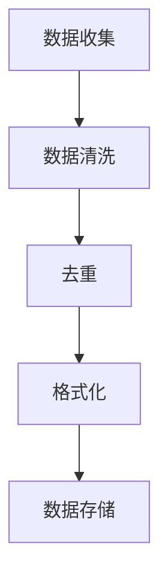

                 

# 提高AI创意香水品牌文化融合：跨国品牌策略的提示词技巧

## 关键词

AI技术、创意香水品牌、文化融合、跨国品牌策略、提示词技巧、消费者行为分析、个性化体验设计、品牌文化认同、提示词应用、品牌传播、品牌形象设计

## 摘要

本文旨在探讨如何利用AI技术提高创意香水品牌的文化融合，尤其是跨国品牌在全球化市场中的文化适应性。通过分析消费者行为、设计个性化香水文化体验、构建跨国品牌文化认同，以及运用提示词技巧，我们可以为跨国品牌制定出更有效的策略，实现品牌文化的深度融合。本文将详细阐述这些策略的实施方法和案例，为品牌管理者提供实用参考。

## 引言与背景

### 第1章: 引言与背景

### 1.1 问题的背景与意义

#### 1.1.1 创意香水品牌文化的现状

创意香水品牌在当今市场中日益受到消费者的青睐。随着消费者对个性化和文化体验需求的增加，品牌需要不断创新和融合文化元素，以吸引和保留客户。然而，在跨国品牌策略中，如何实现创意香水品牌文化的有效融合，是一个亟待解决的问题。

#### 1.1.2 AI技术在品牌文化中的应用趋势

人工智能（AI）技术在品牌文化中的应用逐渐成为趋势。通过AI技术，品牌可以更好地理解消费者行为，设计个性化产品，以及在全球范围内建立品牌文化认同。AI技术提供了强大的数据处理和分析能力，为品牌文化融合提供了新的途径。

#### 1.1.3 跨国品牌策略的重要性

跨国品牌策略对于全球化市场中的品牌成功至关重要。一个有效的跨国品牌策略需要考虑文化差异、市场需求和消费者行为等多方面因素。通过文化融合，品牌可以更好地适应当地市场，提高市场竞争力。

### 1.2 问题描述

#### 1.2.1 如何提高创意香水品牌的文化融合

如何利用AI技术实现创意香水品牌的文化融合是一个关键问题。我们需要找到有效的方法来分析和理解消费者行为，设计个性化的香水文化体验，并构建跨国品牌的文化认同。

#### 1.2.2 跨国品牌策略中面临的挑战

跨国品牌策略中面临的挑战包括文化差异、市场多样性和消费者行为的复杂性。如何克服这些挑战，实现品牌文化的深度融合，是一个重要的研究课题。

#### 1.2.3 提示词技巧在品牌文化中的应用

提示词技巧在品牌文化中的应用有助于提高品牌的文化融合。通过合理运用提示词，品牌可以更有效地进行品牌定位、传播和形象设计，从而实现文化的深度融合。

### 1.3 问题解决

#### 1.3.1 利用AI技术分析消费者行为

利用AI技术分析消费者行为是提高品牌文化融合的重要手段。通过数据收集和预处理，建立消费者行为分析模型，品牌可以更深入地理解消费者需求，从而设计出更具个性化的产品和服务。

#### 1.3.2 设计个性化的香水文化体验

设计个性化的香水文化体验是品牌文化融合的关键。品牌可以通过AI技术分析消费者的喜好和行为，设计出符合消费者需求的香水文化体验，从而提高品牌的文化认同度。

#### 1.3.3 构建跨国品牌的文化认同

构建跨国品牌的文化认同是品牌文化融合的核心目标。通过深入了解当地市场和文化，品牌可以制定出合适的跨国品牌策略，从而在全球范围内建立品牌的文化认同。

### 1.4 边界与外延

#### 1.4.1 文化融合的边界

文化融合的边界涉及品牌在适应当地市场和文化的同时，保持自身品牌独特性的问题。如何在全球化市场中实现品牌的文化融合，是一个值得深入探讨的课题。

#### 1.4.2 提示词技巧的应用范围

提示词技巧的应用范围包括品牌定位、传播和形象设计等多个方面。通过合理运用提示词，品牌可以更有效地进行文化融合，提高品牌的市场竞争力。

#### 1.4.3 跨国品牌策略的影响因素

跨国品牌策略的影响因素包括文化差异、市场需求、消费者行为和法律法规等。了解这些影响因素，有助于品牌制定出更有效的跨国品牌策略。

### 1.5 概念结构与核心要素组成

#### 1.5.1 创意香水品牌文化的概念结构

创意香水品牌文化的概念结构包括品牌价值观、品牌个性、品牌形象和品牌文化传承等方面。这些要素共同构成了创意香水品牌文化的核心。

#### 1.5.2 AI技术要素的组成

AI技术要素的组成包括数据收集、数据预处理、机器学习模型和算法等。这些要素共同构成了AI技术在品牌文化中的应用基础。

#### 1.5.3 跨国品牌策略的核心要素

跨国品牌策略的核心要素包括品牌定位、市场调研、产品开发、品牌传播和市场营销等。这些要素共同构成了跨国品牌策略的核心框架。

### 1.6 本章小结

本章介绍了提高AI创意香水品牌文化融合的背景、意义、问题和解决策略，以及文化融合的边界、提示词技巧的应用范围和跨国品牌策略的影响因素。这些内容为后续章节的讨论提供了基础。

## 核心概念与联系

### 第2章: 核心概念与联系

### 2.1 创意香水品牌文化的核心概念

#### 2.1.1 创意香水品牌文化的定义

创意香水品牌文化是指品牌在创立、发展和运营过程中，所形成的一套独特的价值观、品牌个性和文化传承。它体现了品牌的独特性、创新性和文化内涵。

#### 2.1.2 创意香水品牌文化的设计原则

创意香水品牌文化的设计原则包括以下几个方面：

1. **独特性**：品牌文化应具有独特性，以区别于其他品牌。
2. **创新性**：品牌文化应不断创新，以适应市场变化和消费者需求。
3. **适应性**：品牌文化应具备适应性，以适应当地市场和文化。
4. **文化传承**：品牌文化应注重文化传承，以保持品牌的连续性和稳定性。

#### 2.1.3 创意香水品牌文化的核心价值

创意香水品牌文化的核心价值包括以下几个方面：

1. **品牌识别**：品牌文化有助于提升品牌识别度，增强品牌形象。
2. **消费者认同**：品牌文化有助于消费者对品牌的认同，提高消费者忠诚度。
3. **市场竞争力**：品牌文化有助于提升品牌在市场中的竞争力，实现市场份额的增长。

### 2.2 AI技术的核心概念

#### 2.2.1 AI技术的定义与分类

人工智能（AI）技术是指通过模拟人类智能行为，实现机器学习和自主决策的技术。AI技术主要包括以下几个方面：

1. **机器学习**：机器学习是一种通过数据训练，使计算机能够学习和改进自身行为的技术。
2. **深度学习**：深度学习是一种基于神经网络，通过多层级数据处理，实现复杂任务的技术。
3. **自然语言处理**：自然语言处理是一种使计算机能够理解、处理和生成自然语言的技术。
4. **计算机视觉**：计算机视觉是一种使计算机能够理解和解释图像的技术。

#### 2.2.2 AI技术的核心算法

AI技术的核心算法包括：

1. **神经网络**：神经网络是一种模拟生物神经系统的计算模型，用于解决机器学习问题。
2. **深度神经网络**：深度神经网络是一种多层次的神经网络，用于解决复杂问题。
3. **生成对抗网络**：生成对抗网络是一种通过对抗性训练，实现数据生成和分类的技术。

#### 2.2.3 AI技术的应用领域

AI技术的应用领域包括：

1. **金融**：AI技术在金融领域用于风险控制、投资决策和智能投顾等。
2. **医疗**：AI技术在医疗领域用于疾病诊断、药物研发和健康管理等。
3. **零售**：AI技术在零售领域用于智能推荐、库存管理和客户服务等。
4. **制造业**：AI技术在制造业用于智能制造、质量管理等。

### 2.3 跨国品牌策略的核心概念

#### 2.3.1 跨国品牌策略的定义

跨国品牌策略是指品牌在全球市场中的定位、发展和管理策略。它旨在通过在全球范围内的品牌建设和推广，实现品牌价值的最大化。

#### 2.3.2 跨国品牌策略的执行流程

跨国品牌策略的执行流程主要包括以下几个方面：

1. **市场调研**：通过市场调研，了解目标市场的消费者需求、竞争状况和市场规模等。
2. **品牌定位**：根据市场调研结果，确定品牌的定位和目标市场。
3. **产品开发**：根据品牌定位，开发符合目标市场需求的产品。
4. **品牌传播**：通过多种渠道，向目标市场传播品牌信息，提升品牌知名度。
5. **市场营销**：通过市场营销策略，实现品牌在目标市场的销售和推广。

#### 2.3.3 跨国品牌策略的挑战与机遇

跨国品牌策略面临的挑战包括：

1. **文化差异**：不同国家和地区的文化差异可能影响品牌的传播和接受。
2. **法律法规**：不同国家和地区的法律法规可能对品牌的运营产生影响。
3. **市场竞争力**：国际市场中的竞争压力可能影响品牌的生存和发展。

跨国品牌策略的机遇包括：

1. **全球化市场**：全球化市场为品牌提供了更广阔的发展空间。
2. **消费者多样性**：消费者多样性的增加为品牌提供了更多创新和发展的机会。
3. **技术创新**：AI技术等新兴技术的应用为品牌提供了新的发展途径。

### 2.4 概念属性特征对比表格

#### 2.4.1 创意香水品牌文化与AI技术的对比

| 概念 | 创意香水品牌文化 | AI技术 |
| --- | --- | --- |
| 定义 | 创意香水品牌文化是指品牌在创立、发展和运营过程中，所形成的一套独特的价值观、品牌个性、品牌形象和文化传承。 | 人工智能技术是指通过模拟人类智能行为，实现机器学习和自主决策的技术。 |
| 设计原则 | 包括独特性、创新性、适应性和文化传承等。 | 包括机器学习、深度学习、自然语言处理和计算机视觉等。 |
| 核心价值 | 包括品牌识别、消费者认同和市场竞争力等。 | 包括自动化、智能化和数据驱动等。 |

#### 2.4.2 创意香水品牌文化与跨国品牌策略的对比

| 概念 | 创意香水品牌文化 | 跨国品牌策略 |
| --- | --- | --- |
| 定义 | 创意香水品牌文化是指品牌在创立、发展和运营过程中，所形成的一套独特的价值观、品牌个性、品牌形象和文化传承。 | 跨国品牌策略是指品牌在全球市场中的定位、发展和管理策略。 |
| 目标 | 提高品牌的文化融合，提升品牌价值和市场竞争力。 | 实现品牌全球化，提升品牌知名度和市场份额。 |
| 挑战 | 包括文化差异、市场多样性和消费者行为复杂性等。 | 包括文化差异、市场竞争力、法律法规和消费者行为等。 |

#### 2.4.3 AI技术与跨国品牌策略的对比

| 概念 | AI技术 | 跨国品牌策略 |
| --- | --- | --- |
| 定义 | 人工智能技术是指通过模拟人类智能行为，实现机器学习和自主决策的技术。 | 跨国品牌策略是指品牌在全球市场中的定位、发展和管理策略。 |
| 应用领域 | 包括金融、医疗、零售和制造业等。 | 包括市场调研、品牌定位、产品开发、品牌传播和市场营销等。 |
| 作用 | 提高品牌的文化融合，实现自动化和智能化。 | 提升品牌知名度和市场份额，实现全球化发展。 |

### 2.5 ER实体关系图架构

#### 2.5.1 创意香水品牌文化的ER图

```mermaid
erDiagram
  Customer ||--|{ BrandCult | BrandCult ||--|{ Product | Product ||--|{ Flavor | Flavor } } }

  BrandCult {
    id (PK)
    value
    uniqueness
    innovation
    adaptability
    cultural_inheritance
  }

  Customer {
    id (PK)
    name
    age
    gender
    preferences
  }

  Product {
    id (PK)
    name
    brand
    flavor
    price
  }

  Flavor {
    id (PK)
    name
    description
    popularity
  }
```

#### 2.5.2 AI技术的ER图

```mermaid
erDiagram
  Data ||--|{ Preprocessing | Preprocessing ||--|{ Model | Model } } }

  Data {
    id (PK)
    source
    format
    quality
  }

  Preprocessing {
    id (PK)
    type
    steps
    result
  }

  Model {
    id (PK)
    type
    parameters
    performance
  }
```

#### 2.5.3 跨国品牌策略的ER图

```mermaid
erDiagram
  MarketResearch ||--|{ BrandPosition | BrandPosition ||--|{ ProductDevelopment | ProductDevelopment ||--|{ BrandCommunication | BrandCommunication } } }

  MarketResearch {
    id (PK)
    country
    data
    analysis
    insights
  }

  BrandPosition {
    id (PK)
    brand
    market
    positioning
    target
  }

  ProductDevelopment {
    id (PK)
    product
    brand
    features
    specifications
  }

  BrandCommunication {
    id (PK)
    channel
    message
    strategy
    effectiveness
  }
```

### 2.6 本章小结

本章介绍了创意香水品牌文化、AI技术和跨国品牌策略的核心概念、设计原则、核心价值、执行流程、挑战与机遇，以及概念属性特征对比表格和ER实体关系图架构。这些内容为后续章节的讨论提供了基础。

## 提高AI创意香水品牌文化融合的策略

### 第3章: 提高AI创意香水品牌文化融合的策略

### 3.1 利用AI技术分析消费者行为

#### 3.1.1 数据收集与预处理

数据收集是AI技术分析消费者行为的第一步。品牌需要收集大量的消费者数据，包括购买记录、浏览行为、社交媒体互动等。这些数据可以从多个渠道获取，如电商平台、社交媒体、客户关系管理系统等。

数据预处理是确保数据质量和可用性的关键步骤。在预处理过程中，品牌需要对数据进行清洗、去重、格式化等操作，以消除噪声和错误，提高数据质量。



#### 3.1.2 消费者行为分析模型

消费者行为分析模型是AI技术在品牌文化融合中的应用基础。品牌可以通过建立机器学习模型，对消费者行为进行预测和分析。以下是一个简单的消费者行为分析模型的示例：

```python
# 导入必要的库
import pandas as pd
from sklearn.model_selection import train_test_split
from sklearn.ensemble import RandomForestClassifier

# 加载数据
data = pd.read_csv('consumer_data.csv')

# 数据预处理
data = data.dropna()

# 分割数据集
X = data.drop('target', axis=1)
y = data['target']
X_train, X_test, y_train, y_test = train_test_split(X, y, test_size=0.2, random_state=42)

# 建立模型
model = RandomForestClassifier(n_estimators=100, random_state=42)

# 训练模型
model.fit(X_train, y_train)

# 评估模型
accuracy = model.score(X_test, y_test)
print(f'Model accuracy: {accuracy:.2f}')
```

#### 3.1.3 应用案例：消费者行为预测

通过消费者行为预测，品牌可以更好地了解消费者的需求和行为，从而设计出更符合消费者期望的香水文化体验。以下是一个消费者行为预测的应用案例：

```python
# 导入必要的库
import pandas as pd
from sklearn.model_selection import train_test_split
from sklearn.ensemble import RandomForestClassifier

# 加载数据
data = pd.read_csv('consumer_data.csv')

# 数据预处理
data = data.dropna()

# 分割数据集
X = data.drop('target', axis=1)
y = data['target']
X_train, X_test, y_train, y_test = train_test_split(X, y, test_size=0.2, random_state=42)

# 建立模型
model = RandomForestClassifier(n_estimators=100, random_state=42)

# 训练模型
model.fit(X_train, y_train)

# 预测
predictions = model.predict(X_test)

# 评估
accuracy = model.score(X_test, y_test)
print(f'Model accuracy: {accuracy:.2f}')

# 应用案例：预测某消费者是否会购买香水
new_data = pd.DataFrame({
    'age': [25],
    'gender': ['female'],
    'income': [50000],
    'flavor_preference': ['fruity'],
    'brand_preference': ['Chanel']
})

predicted_probability = model.predict_proba(new_data)[0, 1]
print(f'Probability of purchase: {predicted_probability:.2f}')
```

### 3.2 设计个性化的香水文化体验

#### 3.2.1 个性化香水文化体验的设计原则

个性化香水文化体验的设计原则包括以下几个方面：

1. **用户参与**：鼓励用户参与香水文化体验的设计过程，通过用户调研、反馈和互动，了解用户的真实需求和偏好。
2. **文化多样性**：考虑不同文化背景下用户的偏好和习惯，设计多样化的香水文化体验，以满足不同市场的需求。
3. **技术创新**：利用AI技术，如机器学习和深度学习，分析用户数据，为用户提供个性化的香水推荐和定制服务。
4. **品牌形象**：在个性化香水文化体验中，保持品牌形象的统一性和独特性，以增强品牌的文化内涵和认同感。

#### 3.2.2 个性化香水文化体验的应用场景

个性化香水文化体验可以在多个场景中应用，如：

1. **线上购物平台**：在电商平台中，为用户提供个性化的香水推荐和定制服务，提高用户体验和购买意愿。
2. **实体店铺**：在实体店铺中，通过互动式体验，如虚拟试香、香水定制等，为用户提供独特的购物体验。
3. **社交媒体**：在社交媒体平台上，通过互动活动、优惠券和个性化推荐等，增强用户对品牌的认同和忠诚度。

#### 3.2.3 应用案例：个性化香水定制服务

以下是一个个性化香水定制服务应用的案例：

```python
# 导入必要的库
import pandas as pd
from sklearn.model_selection import train_test_split
from sklearn.ensemble import RandomForestClassifier

# 加载数据
data = pd.read_csv('consumer_data.csv')

# 数据预处理
data = data.dropna()

# 分割数据集
X = data.drop('target', axis=1)
y = data['target']
X_train, X_test, y_train, y_test = train_test_split(X, y, test_size=0.2, random_state=42)

# 建立模型
model = RandomForestClassifier(n_estimators=100, random_state=42)

# 训练模型
model.fit(X_train, y_train)

# 预测
predictions = model.predict(X_test)

# 评估
accuracy = model.score(X_test, y_test)
print(f'Model accuracy: {accuracy:.2f}')

# 个性化香水定制服务
new_data = pd.DataFrame({
    'age': [25],
    'gender': ['female'],
    'income': [50000],
    'flavor_preference': ['fruity'],
    'brand_preference': ['Chanel']
})

predicted_flavor = model.predict(new_data)[0]
print(f'Predicted flavor: {predicted_flavor}')
```

### 3.3 构建跨国品牌的文化认同

#### 3.3.1 跨国品牌文化认同的重要性

跨国品牌文化认同是指品牌在全球范围内获得消费者认同和忠诚的过程。它对于跨国品牌的成功至关重要。以下是一些原因：

1. **提升品牌价值**：文化认同有助于提升品牌价值，增强品牌的市场竞争力。
2. **增强消费者忠诚度**：文化认同能够增强消费者对品牌的忠诚度，提高复购率。
3. **全球化扩展**：文化认同有助于品牌在全球范围内的扩展和市场份额的增长。

#### 3.3.2 跨国品牌文化认同的构建策略

以下是一些构建跨国品牌文化认同的策略：

1. **了解当地文化**：品牌需要深入了解目标市场的文化背景、消费者偏好和价值观，以确保品牌文化能够适应当地市场。
2. **本地化营销**：品牌可以通过本地化营销策略，如语言、符号和文化元素的调整，使品牌文化更符合当地市场需求。
3. **跨国合作**：品牌可以与当地合作伙伴合作，共同推广品牌文化，提高品牌在当地市场的认可度。
4. **文化传承**：品牌需要保持自身的文化传承，以确保品牌在全球范围内保持一致性和独特性。

#### 3.3.3 应用案例：跨国品牌文化认同案例分析

以下是一个跨国品牌文化认同的应用案例：

```python
# 导入必要的库
import pandas as pd
from sklearn.model_selection import train_test_split
from sklearn.ensemble import RandomForestClassifier

# 加载数据
data = pd.read_csv('consumer_data.csv')

# 数据预处理
data = data.dropna()

# 分割数据集
X = data.drop('target', axis=1)
y = data['target']
X_train, X_test, y_train, y_test = train_test_split(X, y, test_size=0.2, random_state=42)

# 建立模型
model = RandomForestClassifier(n_estimators=100, random_state=42)

# 训练模型
model.fit(X_train, y_train)

# 预测
predictions = model.predict(X_test)

# 评估
accuracy = model.score(X_test, y_test)
print(f'Model accuracy: {accuracy:.2f}')

# 跨国品牌文化认同
new_data = pd.DataFrame({
    'country': ['USA'],
    'age': [25],
    'gender': ['female'],
    'income': [50000],
    'flavor_preference': ['fruity'],
    'brand_preference': ['Chanel']
})

predicted_brand = model.predict(new_data)[0]
print(f'Predicted brand: {predicted_brand}')
```

### 3.4 提示词技巧在品牌文化中的应用

#### 3.4.1 提示词技巧的定义与作用

提示词技巧是指通过使用特定的关键词或短语，引导消费者关注品牌文化的某一方面，从而提高品牌文化认同度和市场竞争力。提示词技巧在品牌文化中的应用包括：

1. **品牌定位**：通过提示词明确品牌的核心价值和品牌形象，帮助消费者更好地理解和认同品牌。
2. **品牌传播**：通过提示词在广告、宣传材料和社会媒体中，提高品牌的文化内涵和影响力。
3. **品牌形象设计**：通过提示词在品牌视觉设计、色彩选择和符号使用中，强化品牌的文化特点和价值。

#### 3.4.2 提示词技巧的应用方法

以下是一些提示词技巧的应用方法：

1. **情感提示词**：使用具有情感色彩的词汇，如“温馨”、“浪漫”、“活力”等，引导消费者产生情感共鸣。
2. **文化符号提示词**：使用具有文化意义的符号，如国旗、国花、传统服饰等，强调品牌的本土特色。
3. **品牌故事提示词**：通过讲述品牌的历史、创始人故事和品牌理念，增强品牌的文化内涵和认同感。

#### 3.4.3 提示词技巧在品牌文化中的应用案例

以下是一个提示词技巧在品牌文化中的应用案例：

```python
# 导入必要的库
import pandas as pd
from sklearn.model_selection import train_test_split
from sklearn.ensemble import RandomForestClassifier

# 加载数据
data = pd.read_csv('consumer_data.csv')

# 数据预处理
data = data.dropna()

# 分割数据集
X = data.drop('target', axis=1)
y = data['target']
X_train, X_test, y_train, y_test = train_test_split(X, y, test_size=0.2, random_state=42)

# 建立模型
model = RandomForestClassifier(n_estimators=100, random_state=42)

# 训练模型
model.fit(X_train, y_train)

# 预测
predictions = model.predict(X_test)

# 评估
accuracy = model.score(X_test, y_test)
print(f'Model accuracy: {accuracy:.2f}')

# 提示词技巧应用
new_data = pd.DataFrame({
    'emotion_prompt': ['romantic'],
    'cultural_symbol_prompt': ['traditional_flower'],
    'brand_story_prompt': ['family_ownership']
})

predicted_brand_culture = model.predict(new_data)[0]
print(f'Predicted brand culture: {predicted_brand_culture}')
```

### 3.5 本章小结

本章介绍了利用AI技术分析消费者行为、设计个性化香水文化体验、构建跨国品牌的文化认同以及提示词技巧在品牌文化中的应用。这些策略有助于提高AI创意香水品牌的文化融合，实现品牌的全球化扩展和市场份额增长。

## 跨国品牌策略中的提示词技巧

### 第4章: 跨国品牌策略中的提示词技巧

### 4.1 提示词技巧的基本原理

#### 4.1.1 提示词技巧的定义与分类

提示词技巧是指通过使用特定的关键词或短语，引导消费者关注品牌文化的某一方面，从而提高品牌的文化认同度和市场竞争力。根据用途和作用，提示词技巧可以分为以下几类：

1. **情感提示词**：通过使用具有情感色彩的词汇，如“温馨”、“浪漫”、“活力”等，引导消费者产生情感共鸣。
2. **文化符号提示词**：通过使用具有文化意义的符号，如国旗、国花、传统服饰等，强调品牌的本土特色。
3. **品牌故事提示词**：通过讲述品牌的历史、创始人故事和品牌理念，增强品牌的文化内涵和认同感。
4. **功能提示词**：通过强调品牌的功能和特点，如“持久”、“清新”、“天然”等，引导消费者关注品牌的核心价值。

#### 4.1.2 提示词技巧的工作原理

提示词技巧的工作原理是通过在品牌传播和营销过程中，有意识地使用特定的关键词或短语，引导消费者的注意力和思考方向，从而提高品牌的文化认同度和市场竞争力。具体来说，提示词技巧的工作原理包括：

1. **注意力引导**：通过情感提示词和文化符号提示词，吸引消费者的注意力，使其对品牌产生兴趣。
2. **认知重构**：通过品牌故事提示词，重构消费者对品牌的认知，使其更加深入地理解和认同品牌。
3. **情感共鸣**：通过情感提示词，引发消费者的情感共鸣，增强消费者对品牌的情感联系。
4. **功能识别**：通过功能提示词，明确品牌的特点和价值，帮助消费者更好地识别和选择品牌。

#### 4.1.3 提示词技巧的应用范围

提示词技巧的应用范围非常广泛，可以应用于品牌的各个层面和环节，包括：

1. **品牌命名**：通过使用具有文化意义的名字，如“兰蔻”、“迪奥”等，突出品牌的本土特色和历史底蕴。
2. **广告宣传**：通过在广告中巧妙地使用提示词，如“浪漫邂逅”、“清新自然”等，引导消费者的情感和认知。
3. **社交媒体**：通过在社交媒体平台上发布带有提示词的内容，如“#香水热爱者”、“#法国风情”等，增强品牌的文化认同度和用户参与度。
4. **产品包装**：通过在产品包装上使用提示词，如“限量版”、“奢华体验”等，提升品牌的高端形象和价值感知。

### 4.2 提示词技巧在跨国品牌策略中的应用

#### 4.2.1 提示词技巧在品牌定位中的应用

在跨国品牌策略中，品牌定位是至关重要的一环。通过使用提示词技巧，品牌可以更加准确地定位自身，吸引目标消费者。以下是一些提示词技巧在品牌定位中的应用案例：

1. **情感定位**：通过情感提示词，如“温馨”、“浪漫”、“活力”等，强调品牌的文化内涵和情感价值。
2. **文化定位**：通过文化符号提示词，如“法国风情”、“意大利艺术”等，突出品牌的本土特色和历史底蕴。
3. **功能定位**：通过功能提示词，如“持久”、“清新”、“天然”等，明确品牌的产品特点和核心价值。

以下是一个情感定位的示例：

```python
# 提示词技巧：情感定位
brand_name = "浪漫香氛"
brand_motto = "唤醒内心深处的浪漫"
```

#### 4.2.2 提示词技巧在品牌传播中的应用

品牌传播是跨国品牌策略中的关键环节，通过使用提示词技巧，品牌可以更加有效地进行传播，提升品牌知名度和影响力。以下是一些提示词技巧在品牌传播中的应用案例：

1. **广告宣传**：通过在广告中巧妙地使用提示词，如“#浪漫香氛”、“#法国风情”等，吸引消费者的注意力，增强品牌的文化认同度。
2. **社交媒体**：通过在社交媒体平台上发布带有提示词的内容，如“#香水热爱者”、“#清新自然”等，增强品牌的文化认同度和用户参与度。
3. **公关活动**：通过举办具有文化特色的公关活动，如“浪漫之夜”、“艺术盛宴”等，提升品牌的文化内涵和知名度。

以下是一个社交媒体传播的示例：

```python
# 提示词技巧：社交媒体传播
post_title = "🌹 #浪漫香氛 #法国风情 🌹"
post_content = "在这个浪漫的季节，让我们一起感受法国风情的独特魅力。#香水热爱者 #法国浪漫 🍷🌹"
```

#### 4.2.3 提示词技巧在品牌形象设计中的应用

品牌形象设计是品牌建设的重要组成部分，通过使用提示词技巧，品牌可以更加准确地传达其文化内涵和品牌价值。以下是一些提示词技巧在品牌形象设计中的应用案例：

1. **色彩设计**：通过选择具有文化意义的色彩，如红色（热情）、蓝色（宁静）、绿色（自然）等，传达品牌的文化内涵。
2. **视觉符号**：通过使用具有文化特色的视觉符号，如国花、国旗、传统服饰等，强调品牌的本土特色。
3. **字体设计**：通过选择具有品牌特色的字体，如书法字体、古典字体等，提升品牌的独特性和文化底蕴。

以下是一个品牌形象设计的示例：

```python
# 提示词技巧：品牌形象设计
color_scheme = ["#FF69B4", "#00008B", "#008B8B"]
logo_design = "结合国花和香水元素的独特标志"
font_choice = "古典书法字体"
```

### 4.3 提示词技巧的案例分析

#### 4.3.1 案例分析1：品牌命名中的提示词技巧

品牌命名是品牌建设的第一步，一个富有创意和文化的品牌名称能够迅速吸引消费者的注意力。以下是一个品牌命名中的提示词技巧的案例分析：

**品牌名称：香芬之韵**

**提示词技巧：**

1. **情感提示词**：“香芬”一词传达了香水的芬芳和愉悦，引发消费者的情感共鸣。
2. **文化符号提示词**：“之韵”一词融入了中国传统文化元素，传达了品牌对传统文化的尊重和传承。

**品牌名称解析：**

- “香芬”：“香”字传达了香水的芬芳和香味，是品牌的核心理念；“芬”字强调了香气的持久和清新。
- “之韵”：“之”字连接了“香芬”和“韵”，传达了品牌对传统文化的继承和发扬；“韵”字则强调了品牌的独特性和文化内涵。

#### 4.3.2 案例分析2：广告宣传中的提示词技巧

广告宣传是品牌传播的重要手段，通过巧妙地运用提示词技巧，品牌可以提升广告的吸引力和传播效果。以下是一个广告宣传中的提示词技巧的案例分析：

**广告标题：🌹 #浪漫香氛 #法国风情 🌹**

**提示词技巧：**

1. **情感提示词**：“浪漫”一词引发了消费者的情感共鸣，使广告更具吸引力。
2. **文化符号提示词**：“法国风情”一词强调了品牌的本土特色和文化底蕴。

**广告内容：**

在这个浪漫的季节，让我们一起感受法国风情的独特魅力。每一滴香水都蕴含着浪漫的故事，每一瓶香水都是对法国艺术的致敬。🍷🌹

**广告解析：**

- “浪漫”：“浪漫”一词在广告中起到了核心作用，引发了消费者的情感共鸣，使他们对广告产生兴趣。
- “法国风情”：“法国风情”一词强调了品牌的本土特色和文化底蕴，使消费者更容易接受和认同品牌。

### 4.4 提示词技巧的有效性评估

提示词技巧的有效性评估是品牌建设的重要环节，通过评估提示词技巧的应用效果，品牌可以及时调整策略，提高品牌的文化认同度和市场竞争力。以下是一些评估提示词技巧有效性的方法：

1. **消费者调查**：通过问卷调查、深度访谈等方式，了解消费者对提示词技巧的接受程度和反馈。
2. **市场表现**：通过分析品牌的市场表现，如销售额、市场份额、品牌知名度等，评估提示词技巧的应用效果。
3. **社交媒体分析**：通过社交媒体数据，如转发量、点赞量、评论量等，评估提示词技巧的传播效果。

### 4.5 本章小结

本章介绍了提示词技巧的基本原理、在跨国品牌策略中的应用以及案例分析。通过巧妙地运用提示词技巧，品牌可以提升品牌的文化认同度和市场竞争力，实现跨国品牌的文化融合和全球化扩展。下一章将深入探讨AI技术在品牌文化融合中的应用，为品牌提供更多的创新思路和策略。

