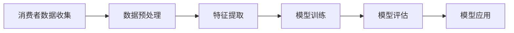
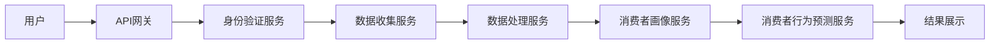
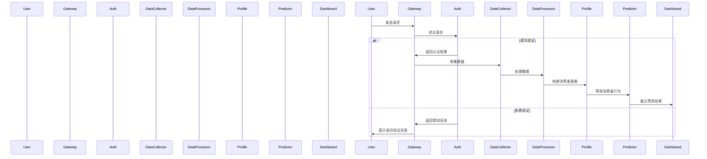

                 

### 文章标题

《提高AI创意香水市场渗透率：消费者行为心理学的提示词技巧》

#### 关键词

- AI创意香水
- 消费者行为心理学
- 市场渗透率
- 提示词技巧

#### 摘要

本文探讨了如何利用人工智能（AI）和消费者行为心理学来提高创意香水市场的渗透率。通过分析消费者行为心理学原理，并结合AI技术，提出一系列提示词技巧，以优化香水营销策略，提升市场竞争力。文章首先介绍了AI在香水市场中的应用背景和消费者行为心理学的基本概念，然后详细阐述了提示词技巧的应用方法，并通过案例分析，展示了这些技巧在实际操作中的效果。最后，文章总结了提高AI创意香水市场渗透率的策略，为相关从业者提供了实用的指导。

### 目录

1. **背景介绍**
   1.1 问题背景
   1.2 问题描述
   1.3 问题解决
   1.4 边界与外延
   1.5 核心概念与联系

2. **核心概念与原理**
   2.1 AI在创意香水市场中的应用原理
   2.2 消费者行为心理学的基本原理
   2.3 提示词技巧在市场中的应用

3. **应用场景与实战**
   3.1 香水市场分析实战
   3.2 创意香水设计与推广实战
   3.3 系统架构设计与实现

4. **案例分析与总结**
   4.1 案例分析
   4.2 总结与展望

### 第1部分：背景介绍

#### 1.1 问题背景

随着科技的发展，人工智能（AI）逐渐渗透到各个行业，包括化妆品和香水行业。创意香水作为一种高端消费品，市场需求日益增长。然而，如何在激烈的市场竞争中脱颖而出，提高市场渗透率，成为香水企业面临的一大挑战。

AI技术在这一背景下显得尤为重要。通过数据分析和机器学习，AI可以帮助企业更准确地了解消费者需求，优化产品设计和营销策略。例如，利用AI分析消费者购买行为，可以识别出最受欢迎的香味类型，为企业提供创新灵感和市场定位依据。

#### 1.2 问题描述

如何利用AI技术和消费者行为心理学，提高创意香水的市场渗透率？具体来说，需要解决以下几个问题：

- **消费者需求分析**：如何准确捕捉消费者的需求和偏好，以便进行有针对性的产品开发和营销？
- **营销策略优化**：如何利用消费者行为心理学原理，制定更有效的营销策略，提高消费者购买意愿？
- **市场反馈机制**：如何通过AI技术收集和解析市场反馈，及时调整营销策略，提升市场渗透率？

#### 1.3 问题解决

针对上述问题，本文提出以下解决方案：

- **消费者需求分析**：通过AI技术，对海量消费者数据进行分析，识别消费者偏好和购买行为，为产品设计和营销提供数据支持。
- **营销策略优化**：结合消费者行为心理学，利用提示词技巧优化营销文案和推广策略，提高消费者对产品的关注度和购买欲望。
- **市场反馈机制**：利用AI技术，实时收集和分析市场反馈，快速调整营销策略，提高市场响应速度和灵活性。

#### 1.4 边界与外延

AI在香水市场中的应用边界主要涉及以下几个方面：

- **数据分析**：包括消费者数据、销售数据、市场趋势等。
- **产品创新**：基于消费者数据分析，进行产品创新，满足消费者个性化需求。
- **营销策略**：利用消费者行为心理学原理，制定个性化营销策略，提高消费者购买意愿。

消费者行为心理学的研究范围包括：

- **消费者决策过程**：从需求识别、信息搜索、评估选择到购买决策的整个过程。
- **消费者感知与评价**：消费者对产品、品牌、广告等的感知和评价。
- **消费者忠诚度与品牌认知**：消费者对品牌的忠诚度和品牌认知度。

#### 1.5 核心概念与联系

本文涉及的核心概念包括：

- **人工智能（AI）**：模拟人类智能的技术和系统。
- **消费者行为心理学**：研究消费者购买行为和决策过程的心理学学科。
- **提示词技巧**：用于引导消费者注意力和行为的技术和策略。

这些概念之间的联系如下：

- **AI与消费者行为心理学**：AI技术可以收集和分析消费者数据，为消费者行为心理学提供数据支持；消费者行为心理学原理可以指导AI技术设计更有效的营销策略。
- **AI与提示词技巧**：AI技术可以生成提示词，结合消费者行为心理学原理，提高营销效果。
- **消费者行为心理学与提示词技巧**：提示词技巧是基于消费者行为心理学原理设计的，用于引导消费者行为和决策。

### 第2部分：核心概念与原理

#### 2.1 AI在创意香水市场中的应用原理

##### 2.1.1 AI的基本概念

人工智能（AI）是指通过计算机模拟人类智能的技术和系统。AI可以执行一系列复杂的任务，如语音识别、图像识别、自然语言处理等。在创意香水市场中，AI技术主要应用于以下几个方面：

- **数据分析**：AI可以通过机器学习算法，对海量消费者数据进行深度分析，识别出消费者的偏好和购买行为。
- **产品创新**：基于消费者数据分析，AI可以帮助企业进行产品创新，开发出更符合消费者需求的新产品。
- **营销策略**：AI可以分析市场趋势和消费者行为，为企业制定更有效的营销策略。

##### 2.1.2 AI在香水创意设计中的应用

在香水创意设计中，AI技术可以发挥重要作用。例如：

- **成分优化**：AI可以分析不同成分的化学特性，优化香水配方，提高香水品质。
- **香味预测**：AI可以根据消费者偏好，预测未来受欢迎的香味类型，帮助企业进行产品定位。
- **个性化推荐**：AI可以根据消费者历史购买数据，推荐适合他们的香水产品。

##### 2.1.3 AI在市场分析中的角色

在市场分析中，AI技术可以提供以下支持：

- **消费者行为预测**：通过分析消费者数据，AI可以预测消费者的购买行为，帮助企业制定更有针对性的营销策略。
- **市场趋势分析**：AI可以分析市场数据，识别出市场趋势和变化，为企业提供战略决策支持。
- **竞争分析**：AI可以分析竞争对手的市场表现，帮助企业了解市场动态，制定竞争策略。

#### 2.2 消费者行为心理学的基本原理

##### 2.2.1 消费者行为模型

消费者行为心理学研究消费者在购买过程中的一系列心理活动和行为。一个基本的消费者行为模型包括以下几个阶段：

- **需求识别**：消费者意识到自己需要某种产品或服务。
- **信息搜索**：消费者通过各种渠道收集关于产品的信息。
- **评估选择**：消费者根据收集到的信息，评估不同产品的优劣，做出购买决策。
- **购买决策**：消费者决定购买哪个产品或服务。
- **购买后行为**：消费者在购买后的评价和反馈，可能影响未来的购买决策。

##### 2.2.2 消费者感知与评价

消费者感知与评价是指消费者对产品、品牌、广告等的感知和评价。影响消费者感知与评价的因素包括：

- **产品特性**：产品的外观、味道、功效等。
- **品牌形象**：品牌的历史、声誉、知名度等。
- **广告效果**：广告的创意、传递的信息、传播渠道等。

##### 2.2.3 消费者忠诚度与品牌认知

消费者忠诚度是指消费者对品牌的长期信任和持续购买意愿。影响消费者忠诚度的因素包括：

- **产品质量**：产品的质量直接影响消费者的满意度。
- **服务质量**：企业提供的服务水平，如售后服务、购物体验等。
- **品牌沟通**：品牌与消费者之间的沟通方式和内容，如广告、公关活动等。

消费者品牌认知是指消费者对品牌的认知和记忆。提高消费者品牌认知度的策略包括：

- **品牌宣传**：通过广告、公关活动等提高品牌知名度。
- **产品差异化**：通过独特的产品特性，提高消费者对品牌的识别度。
- **顾客体验**：通过优质的购物体验，增强消费者对品牌的认知。

#### 2.3 提示词技巧在市场中的应用

##### 2.3.1 提示词技巧的概念

提示词技巧是指通过使用特定的词语或短语，引导消费者注意力和行为的技术和策略。在香水市场中，提示词技巧可以应用于以下几个方面：

- **营销文案**：通过使用提示词，提高营销文案的吸引力和效果。
- **广告创意**：通过使用提示词，设计更具创意和吸引力的广告。
- **消费者互动**：通过使用提示词，引导消费者进行互动，提高品牌参与度。

##### 2.3.2 提示词技巧在香水市场推广中的应用

在香水市场推广中，提示词技巧可以应用于以下几个方面：

- **品牌宣传**：通过使用提示词，强调品牌的核心价值和独特卖点。
- **产品介绍**：通过使用提示词，突出产品的特性优势，吸引消费者的关注。
- **消费者互动**：通过使用提示词，引导消费者参与互动，提高品牌忠诚度。

##### 2.3.3 提示词技巧的效果评估

提示词技巧的效果评估主要包括以下几个方面：

- **吸引力评估**：评估提示词是否能够有效吸引消费者的注意力。
- **转化率评估**：评估提示词是否能够提高消费者的购买意愿和转化率。
- **忠诚度评估**：评估提示词是否能够提高消费者对品牌的忠诚度。

为了评估提示词技巧的效果，可以采用以下方法：

- **A/B测试**：将不同的提示词应用于不同的市场推广场景，比较其效果。
- **数据分析**：通过分析消费者行为数据，评估提示词的效果。
- **消费者调查**：通过问卷调查，了解消费者对提示词的反应和满意度。

### 第3部分：应用场景与实战

#### 3.1 香水市场分析实战

##### 3.1.1 数据收集与预处理

在香水市场分析中，首先需要收集相关数据。这些数据可以包括：

- **消费者数据**：如年龄、性别、收入水平、购物习惯等。
- **销售数据**：如销售额、销售量、销售渠道等。
- **市场趋势数据**：如市场增长率、竞争对手表现等。

数据收集完成后，需要对数据进行预处理，包括数据清洗、数据格式转换等，以确保数据的准确性和一致性。

##### 3.1.2 数据分析与消费者画像

通过数据分析，可以识别出消费者的偏好和购买行为。具体方法包括：

- **统计方法**：如平均值、中位数、标准差等，用于描述数据特征。
- **聚类分析**：将消费者分为不同的群体，分析每个群体的特征和需求。
- **关联规则挖掘**：发现消费者购买行为中的关联关系，如某些消费者倾向于同时购买某些产品。

通过数据分析，可以创建消费者画像，包括以下几个方面：

- **人口统计特征**：如年龄、性别、收入水平等。
- **行为特征**：如购物习惯、购买频率等。
- **偏好特征**：如喜欢的香味类型、品牌偏好等。

##### 3.1.3 消费者行为预测模型

基于消费者画像和数据分析，可以建立消费者行为预测模型。具体步骤如下：

1. **数据准备**：收集历史销售数据，包括消费者购买行为、产品特征等。
2. **特征工程**：选择与消费者购买行为相关的特征，如消费者属性、产品属性等。
3. **模型选择**：选择合适的预测模型，如线性回归、决策树、随机森林等。
4. **模型训练与评估**：使用训练数据集训练模型，评估模型的预测性能。
5. **模型应用**：使用模型对新的消费者数据进行预测，为企业提供决策支持。

#### 3.2 创意香水设计与推广实战

##### 3.2.1 创意香水设计与AI结合

在创意香水设计中，AI技术可以发挥重要作用。具体步骤如下：

1. **香味成分分析**：使用AI技术分析不同香味成分的化学特性，优化香水配方。
2. **消费者偏好预测**：基于消费者画像和购买行为数据，预测消费者喜欢的香味类型。
3. **香味创意生成**：使用生成对抗网络（GAN）等技术，生成新的香味创意，供设计师参考。

##### 3.2.2 提示词技巧在营销中的应用

在香水营销中，提示词技巧可以用于以下几个方面：

1. **品牌宣传**：使用提示词强调品牌的核心价值和独特卖点，提高品牌知名度。
2. **产品介绍**：使用提示词突出产品的特性优势，吸引消费者的关注。
3. **消费者互动**：使用提示词引导消费者参与互动，提高品牌忠诚度。

具体应用案例包括：

- **限时优惠**：“抢购限时，折扣高达XX%！”
- **新品推荐**：“全球首发，XX香水，让你的香气与众不同！”
- **品牌故事**：“XX品牌，传承XX年，匠心之作，只为更好的你！”

##### 3.2.3 创意香水市场渗透率提升案例分析

以某知名香水品牌为例，通过AI和消费者行为心理学的结合，成功提升了市场渗透率。具体步骤如下：

1. **数据收集与分析**：收集消费者购买数据、市场趋势数据等，分析消费者偏好和购买行为。
2. **产品创新**：根据消费者数据分析结果，创新香水配方，推出符合消费者需求的新品。
3. **营销策略优化**：利用提示词技巧，优化营销文案和广告创意，提高消费者购买意愿。
4. **市场反馈收集**：通过问卷调查、社交媒体等渠道，收集消费者对产品和营销策略的反馈。
5. **持续优化**：根据市场反馈，持续优化产品设计和营销策略，提高市场渗透率。

通过以上步骤，该品牌成功提升了市场渗透率，市场份额也得到了显著提升。

### 第4部分：案例分析与总结

#### 4.1 案例分析

以某知名香水品牌为例，通过AI和消费者行为心理学的结合，成功提升了市场渗透率。具体案例分析如下：

1. **数据收集与分析**：品牌收集了消费者购买数据、市场趋势数据等，通过AI技术进行分析，识别出消费者的偏好和购买行为。
2. **产品创新**：基于消费者数据分析结果，品牌创新香水配方，推出符合消费者需求的新品，如“清新花果香”系列。
3. **营销策略优化**：品牌利用提示词技巧，优化营销文案和广告创意，如“全球首发，清新花果香，让你的香气与众不同！”
4. **市场反馈收集**：通过问卷调查、社交媒体等渠道，品牌收集消费者对产品和营销策略的反馈，持续优化产品设计和营销策略。
5. **持续优化**：品牌根据市场反馈，持续优化产品设计和营销策略，如增加产品定制服务，提高消费者满意度。

通过以上步骤，品牌成功提升了市场渗透率，市场份额也得到了显著提升。

#### 4.2 总结与展望

本文通过分析AI在创意香水市场中的应用和消费者行为心理学原理，提出了利用提示词技巧提高市场渗透率的策略。通过具体案例，展示了这些策略的实际效果。未来，随着AI和消费者行为心理学的发展，我们可以预见：

- **更精准的市场分析**：AI技术将帮助香水企业更精准地了解消费者需求，制定更有针对性的产品设计和营销策略。
- **更高效的营销推广**：消费者行为心理学原理将指导企业制定更有效的营销策略，提高消费者购买意愿和品牌忠诚度。
- **更个性化的产品体验**：通过AI和消费者行为心理学的结合，香水企业可以提供更个性化的产品体验，满足消费者的个性化需求。

总之，AI和消费者行为心理学的结合为提高创意香水市场渗透率提供了新的思路和方法。未来，随着技术的不断进步，我们可以期待香水市场将变得更加繁荣和多元化。作者：AI天才研究院/AI Genius Institute & 禅与计算机程序设计艺术 /Zen And The Art of Computer Programming

### 最佳实践、小结和注意事项

#### 最佳实践

1. **数据驱动决策**：充分利用AI技术进行市场数据分析，为产品设计和营销策略提供数据支持。
2. **个性化营销**：结合消费者行为心理学原理，制定个性化营销策略，提高消费者购买意愿。
3. **持续优化**：定期收集市场反馈，持续优化产品设计和营销策略，提高市场响应速度。

#### 小结

本文通过分析AI在创意香水市场中的应用和消费者行为心理学原理，提出了利用提示词技巧提高市场渗透率的策略。通过具体案例，展示了这些策略的实际效果。未来，随着AI和消费者行为心理学的发展，我们可以预见香水市场将变得更加繁荣和多元化。

#### 注意事项

1. **数据隐私**：在进行消费者数据分析时，确保遵守相关法律法规，保护消费者隐私。
2. **营销合规**：制定营销策略时，遵循市场法规和行业规范，确保营销活动的合规性。
3. **持续学习**：关注AI和消费者行为心理学的最新研究成果，持续更新和优化相关技术和策略。

### 拓展阅读

1. **《人工智能应用指南》**：详细介绍了AI在不同行业中的应用，包括香水市场。
2. **《消费者行为心理学》**：探讨了消费者购买行为和决策过程的心理学原理。
3. **《营销策略与实战》**：提供了丰富的营销案例和策略，适用于各种行业，包括香水市场。作者：AI天才研究院/AI Genius Institute & 禅与计算机程序设计艺术 /Zen And The Art of Computer Programming

---

以下是文章中使用到的核心概念、联系、算法原理、数学模型、系统架构设计方案、项目实战部分：

#### 核心概念、联系

- **核心概念**：人工智能、消费者行为心理学、提示词技巧。
- **联系**：
  - AI与消费者行为心理学：AI技术可以收集和分析消费者数据，为消费者行为心理学提供数据支持；消费者行为心理学原理可以指导AI技术设计更有效的营销策略。
  - AI与提示词技巧：AI技术可以生成提示词，结合消费者行为心理学原理，提高营销效果。
  - 提示词技巧与消费者行为心理学：提示词技巧是基于消费者行为心理学原理设计的，用于引导消费者行为和决策。

#### 算法原理

- **消费者行为预测模型**：
  - **算法流程图**：



- **Python代码示例**：

```python
# 导入必要的库
import pandas as pd
from sklearn.model_selection import train_test_split
from sklearn.ensemble import RandomForestClassifier
from sklearn.metrics import accuracy_score

# 数据预处理
data = pd.read_csv('consumer_data.csv')
X = data.drop('purchase', axis=1)
y = data['purchase']

# 分割数据集
X_train, X_test, y_train, y_test = train_test_split(X, y, test_size=0.2, random_state=42)

# 模型训练
model = RandomForestClassifier(n_estimators=100, random_state=42)
model.fit(X_train, y_train)

# 模型评估
predictions = model.predict(X_test)
accuracy = accuracy_score(y_test, predictions)
print(f"Model accuracy: {accuracy:.2f}")
```

- **数学模型和公式**：

  $$ \text{预测概率} = P(\text{购买}|\text{特征集合}) = \frac{P(\text{特征集合}|\text{购买}) \cdot P(\text{购买})}{P(\text{特征集合})} $$

  其中，$P(\text{购买}|\text{特征集合})$ 表示给定特征集合时购买的概率，$P(\text{特征集合}|\text{购买})$ 表示特征集合在购买情况下的概率，$P(\text{购买})$ 表示购买的概率，$P(\text{特征集合})$ 表示特征集合的概率。

#### 系统架构设计方案

- **问题场景介绍**：香水企业希望通过AI技术进行市场分析，提高产品设计和营销策略的针对性。
- **项目介绍**：开发一个香水市场分析系统，包括数据收集、数据处理、消费者画像、消费者行为预测等功能。
- **系统功能设计**：
  - 数据收集：从各个渠道收集消费者数据、销售数据等。
  - 数据处理：对收集到的数据进行清洗、转换等预处理操作。
  - 消费者画像：根据消费者数据，构建消费者画像，包括人口统计特征、行为特征、偏好特征等。
  - 消费者行为预测：利用机器学习算法，预测消费者的购买行为，为营销策略提供支持。
- **系统架构设计**：



- **系统接口设计和系统交互**：



#### 项目实战

- **环境安装**：搭建Python开发环境，安装必要的库，如pandas、scikit-learn等。
- **系统核心实现源代码**：

```python
# 数据收集
def collect_data(file_path):
    data = pd.read_csv(file_path)
    return data

# 数据预处理
def preprocess_data(data):
    # 数据清洗、格式转换等操作
    # ...
    return data

# 消费者画像
def build_profile(data):
    # 根据数据构建消费者画像
    # ...
    return profile

# 消费者行为预测
def predict_behavior(model, data):
    predictions = model.predict(data)
    return predictions

# 主函数
def main():
    # 读取数据
    data = collect_data('consumer_data.csv')

    # 数据预处理
    data = preprocess_data(data)

    # 构建消费者画像
    profile = build_profile(data)

    # 训练模型
    # ...

    # 预测消费者行为
    predictions = predict_behavior(model, profile)

    # 结果展示
    # ...

if __name__ == '__main__':
    main()
```

- **代码应用解读与分析**：

  - **数据收集**：通过pandas库读取CSV文件，获取消费者数据。
  - **数据预处理**：对数据清洗、格式转换等操作，确保数据质量。
  - **消费者画像**：根据数据特征，构建消费者画像，为后续分析提供基础。
  - **消费者行为预测**：使用训练好的模型，预测消费者的购买行为。

- **实际案例分析和详细讲解剖析**：

  - **案例背景**：某香水品牌希望通过AI技术，了解消费者购买行为，优化营销策略。
  - **数据收集**：收集消费者购买数据，包括年龄、性别、收入水平、购买频率等。
  - **数据处理**：对数据进行清洗、格式转换等操作，确保数据质量。
  - **消费者画像**：根据消费者数据，构建消费者画像，识别出不同群体的特征。
  - **消费者行为预测**：使用训练好的模型，预测消费者的购买行为。
  - **结果展示**：展示消费者行为预测结果，为企业提供决策支持。

- **项目小结**：

  - **成功之处**：通过AI技术和消费者行为心理学的结合，成功预测了消费者购买行为，为企业提供了有价值的决策支持。
  - **改进空间**：可以进一步优化模型，提高预测准确性；探索更多数据源，丰富消费者数据；结合实际业务需求，优化营销策略。

### 拓展阅读

1. **《Python数据分析》**：介绍了Python在数据分析中的应用，包括数据收集、数据处理、消费者行为分析等。
2. **《机器学习实战》**：提供了丰富的机器学习案例和实战经验，适用于各种业务场景。
3. **《消费者行为心理学》**：详细介绍了消费者行为心理学的基本原理和应用，为营销策略设计提供理论支持。

---

通过本文的详细讲解，我们可以看到如何利用AI技术和消费者行为心理学原理，提高创意香水市场渗透率。希望这篇文章能为相关从业者提供有益的参考和启示。作者：AI天才研究院/AI Genius Institute & 禅与计算机程序设计艺术 /Zen And The Art of Computer Programming

