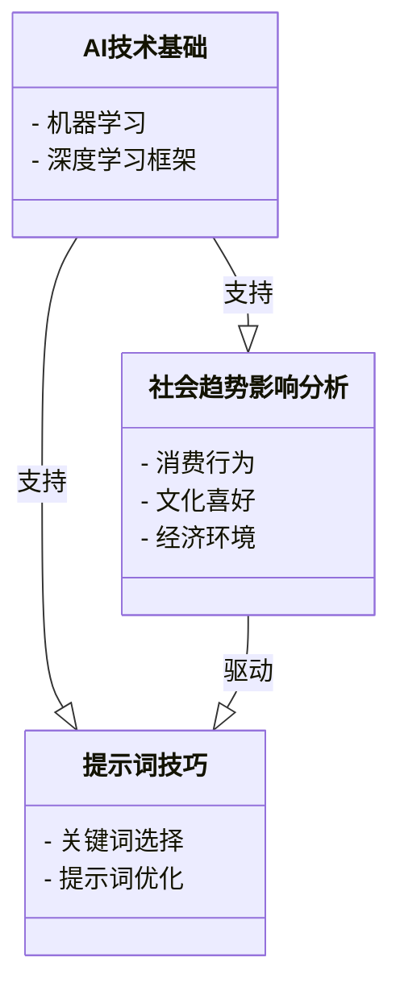
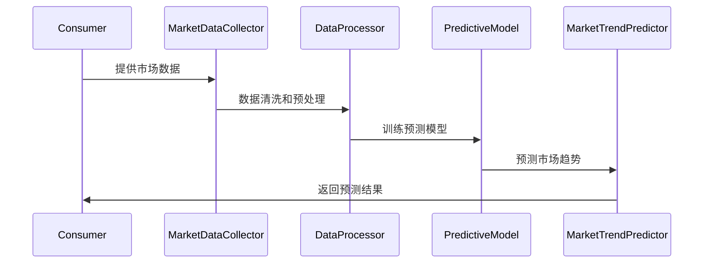

                 

# 提高AI创意香水市场预测：社会趋势影响分析的提示词技巧

关键词：人工智能，市场预测，社会趋势，提示词，创意香水

摘要：随着社会趋势的不断变化，人工智能（AI）在市场预测领域的应用愈发重要。本文将探讨如何利用AI技术，特别是通过社会趋势影响分析，提高创意香水市场预测的准确性。我们将详细介绍相关核心概念、机器学习算法、深度学习框架以及提示词技巧，并通过实际案例展示如何将这些技术应用于市场预测实践。

## 第1章：问题背景

### 1.1.1 问题背景

#### 核心概念

- **AI创意香水市场预测**：通过人工智能技术分析数据，预测香水市场的未来趋势。
- **社会趋势影响分析**：研究社会发展趋势如何影响消费者行为和香水市场。
- **提示词技巧**：利用关键词和提示词来优化AI模型的学习和预测效果。

#### 问题描述

在当前快速变化的市场环境中，香水品牌和企业需要迅速适应市场变化，预测未来的市场趋势，以便制定有效的营销策略和产品开发计划。传统的市场预测方法往往不够准确，且响应速度慢，难以满足快速变化的需求。因此，需要利用人工智能技术，特别是深度学习算法，来提高市场预测的准确性和效率。

#### 问题解决

本书将介绍以下内容：

- **AI技术基础**：介绍AI的基本概念、机器学习算法、深度学习框架等，为后续内容打下基础。
- **社会趋势分析**：分析当前社会趋势，如消费习惯、文化喜好、经济环境等，以及这些趋势如何影响香水市场。
- **提示词技巧**：介绍如何选择和利用提示词来优化AI模型的预测效果。
- **市场预测实践**：通过实际案例，展示如何利用AI技术进行市场预测，并提供实用的工具和技巧。

#### 边界与外延

- **边界**：本书主要关注香水市场的预测，包括香水品牌定位、消费者行为分析、市场趋势预测等。
- **外延**：AI技术在其他行业的应用，如化妆品、时尚、消费电子等，也可以作为本书的扩展内容。

### 1.1.2 核心概念与联系

#### AI技术基础

- **机器学习算法**：机器学习是AI的核心技术，包括监督学习、无监督学习、半监督学习等。
- **深度学习框架**：深度学习框架如TensorFlow、PyTorch等，用于实现复杂的神经网络模型。

#### 社会趋势影响分析

- **消费行为**：消费者如何购买香水，包括线上和线下渠道的偏好。
- **文化喜好**：不同文化背景下，消费者对香水的喜好和需求。
- **经济环境**：经济波动如何影响香水市场的消费能力。

#### 提示词技巧

- **关键词选择**：如何选择对AI模型有用的关键词。
- **提示词优化**：如何通过调整提示词来提高预测的准确性。

### 1.1.3 概念属性特征对比表格

| 概念         | 特征                          | 说明                                       |
|--------------|-------------------------------|------------------------------------------|
| AI技术基础   | 机器学习、深度学习框架        | 为市场预测提供技术支持                    |
| 社会趋势影响 | 消费行为、文化喜好、经济环境    | 分析香水市场变化的主要驱动因素          |
| 提示词技巧   | 关键词选择、提示词优化        | 提高市场预测准确性和效率                |

### 1.1.4 ER实体关系图架构



## 第2章：AI技术基础

### 2.1 机器学习算法

#### 2.1.1 监督学习

**基本原理**：监督学习是一种利用带有标签的训练数据来训练模型的方法。通过已知的输入和输出，模型学习如何预测新的未知数据。

**常用算法**：

- **线性回归**：通过找到最佳拟合直线来预测连续值。
  $$ y = w_0 + w_1 \cdot x $$
- **逻辑回归**：通过找到最佳拟合曲线来预测概率。
  $$ P(y=1) = \frac{1}{1 + e^{-(w_0 + w_1 \cdot x)}} $$
- **支持向量机（SVM）**：通过找到一个最佳的超平面来分类数据。
  $$ w \cdot x - b = 0 $$

#### 2.1.2 无监督学习

**基本原理**：无监督学习是在没有标签的情况下，通过发现数据中的内在结构和模式来训练模型。

**常用算法**：

- **K-means聚类**：通过将数据点划分为K个簇，每个簇由其中心点表示。
  $$ c_k = \frac{1}{N_k} \sum_{x_i \in S_k} x_i $$
  $$ J = \sum_{k=1}^{K} \sum_{x_i \in S_k} ||x_i - c_k||^2 $$
- **主成分分析（PCA）**：通过将数据投影到新的正交坐标系上，以减少数据的维度。
  $$ Z = PC $$
  其中，\( Z \) 是降维后的数据，\( P \) 是协方差矩阵的特征向量，\( C \) 是特征值。

#### 2.1.3 半监督学习

**基本原理**：半监督学习结合了有标签和无标签数据，利用无标签数据的结构信息来提高模型的性能。

**常用算法**：

- **协同过滤**：通过利用用户行为数据来预测用户对物品的评分。
- **图半监督学习**：通过在图结构中嵌入节点和边的信息，来预测图中的未知节点属性。

### 2.2 深度学习框架

**基本概念**：深度学习是一种机器学习方法，它通过堆叠多层神经网络来学习数据中的特征。

**常用框架**：

- **TensorFlow**：由Google开发的开源深度学习框架，提供丰富的API和工具。
- **PyTorch**：由Facebook开发的开源深度学习框架，以动态计算图著称。

### 2.3 提示词技巧

**关键词选择**：选择与预测目标相关的关键词，如“香水”、“时尚”、“消费者行为”等。

**提示词优化**：通过调整提示词的权重和组合，来优化模型的学习效果。

## 第3章：社会趋势影响分析

### 3.1 消费行为

#### 3.1.1 线上消费行为

**分析**：随着电子商务的兴起，越来越多的消费者选择在线购买香水。因此，分析线上消费行为对于预测香水市场趋势至关重要。

**方法**：

- **数据收集**：通过电商网站、社交媒体等渠道收集消费者购买行为数据。
- **数据分析**：使用机器学习算法分析购买行为，如消费频率、购买偏好等。

#### 3.1.2 线下消费行为

**分析**：线下购买仍然是香水市场的重要组成部分。了解线下消费者的购买习惯和行为模式，有助于更好地预测市场趋势。

**方法**：

- **问卷调查**：通过问卷调查收集消费者对香水品牌的看法、购买意图等。
- **现场观察**：通过现场观察消费者在实体店中的购买行为，如购物时间、购买地点等。

### 3.2 文化喜好

#### 3.2.1 消费者文化背景

**分析**：不同文化背景下，消费者对香水的喜好和需求存在差异。了解这些差异有助于制定更精准的市场策略。

**方法**：

- **文献研究**：通过研究不同文化背景下的香水消费行为，了解消费者对香水品牌的偏好。
- **实地调研**：通过实地调研，了解不同文化背景下消费者的购买习惯和偏好。

#### 3.2.2 文化趋势

**分析**：随着文化趋势的变化，消费者对香水的需求也会发生变化。例如，环保主义和文化多样性对香水市场的影响。

**方法**：

- **社交媒体分析**：通过分析社交媒体上的讨论，了解当前的文化趋势。
- **媒体报道**：关注媒体报道，了解文化趋势的最新动态。

### 3.3 经济环境

#### 3.3.1 经济波动

**分析**：经济波动对香水市场的消费能力有重要影响。了解经济环境的变化趋势，有助于预测市场趋势。

**方法**：

- **经济指标分析**：通过分析宏观经济指标，如GDP、失业率、通货膨胀率等，了解经济环境的变化。
- **消费者调查**：通过消费者调查，了解消费者对经济环境的感知和反应。

#### 3.3.2 消费者购买力

**分析**：消费者购买力是影响香水市场的重要因素。了解不同收入群体的购买力水平，有助于预测市场趋势。

**方法**：

- **收入调查**：通过收入调查，了解不同收入群体的购买力水平。
- **消费数据分析**：通过消费数据分析，了解消费者在不同经济环境下的购买行为。

## 第4章：提示词技巧

### 4.1 关键词选择

#### 4.1.1 提示词的重要性

**分析**：提示词是引导AI模型学习的重要工具。选择合适的提示词，有助于提高模型的预测准确性。

**方法**：

- **数据分析**：通过分析历史数据，找出与预测目标相关的关键词。
- **专家咨询**：与行业专家进行交流，获取他们对关键词选择的建议。

#### 4.1.2 提示词筛选

**方法**：

- **TF-IDF**：通过计算关键词在数据集中的出现频率和重要性，筛选出有用的提示词。
- **主题模型**：通过挖掘数据中的潜在主题，提取出与预测目标相关的关键词。

### 4.2 提示词优化

#### 4.2.1 提示词权重调整

**分析**：调整提示词的权重，有助于优化模型的预测效果。

**方法**：

- **线性调整**：通过线性调整提示词的权重，来平衡它们对模型预测的影响。
- **基于性能的调整**：根据模型在不同提示词上的性能，动态调整提示词的权重。

#### 4.2.2 提示词组合优化

**分析**：通过组合不同的提示词，可以更全面地捕捉数据中的特征。

**方法**：

- **逻辑组合**：通过逻辑运算符（如AND、OR）组合提示词，来提取更复杂的特征。
- **基于模型的组合**：利用机器学习模型，自动生成最优的提示词组合。

## 第5章：市场预测实践

### 5.1 实际案例介绍

#### 5.1.1 案例背景

**分析**：以某知名香水品牌为例，介绍如何利用AI技术进行市场预测。

**步骤**：

- **数据收集**：收集品牌的历史销售数据、社交媒体评论、消费者调查数据等。
- **数据处理**：对收集到的数据进行清洗、预处理，提取有用的特征。

#### 5.1.2 预测模型构建

**分析**：构建基于机器学习和深度学习的市场预测模型。

**步骤**：

- **模型选择**：选择合适的机器学习算法和深度学习框架。
- **模型训练**：使用历史数据训练模型，优化模型参数。

### 5.2 系统功能设计

#### 5.2.1 领域模型

**分析**：定义市场预测系统的领域模型，包括消费者、产品、市场趋势等。

**类图**：

```mermaid
classDiagram
  ClassDef Consumer {
    - name
    - age
    - gender
    - purchaseHistory
  }
  ClassDef Product {
    - productId
    - productName
    - price
    - category
  }
  ClassDef MarketTrend {
    - trendId
    - description
    - startDate
    - endDate
  }
  Consumer --|> Product: 购买
  Consumer --|> MarketTrend: 关注
```

### 5.3 系统架构设计

#### 5.3.1 架构图

**分析**：设计市场预测系统的整体架构。

**架构图**：



### 5.4 系统接口设计

#### 5.4.1 接口设计

**分析**：设计系统的主要接口，包括数据收集接口、数据处理接口、预测接口等。

**接口设计**：

```mermaid
interface MarketDataCollector {
  +collectData(): void
}

interface DataProcessor {
  +processData(): void
}

interface PredictiveModel {
  +trainModel(): void
}

interface MarketTrendPredictor {
  +predictTrend(): void
}
```

### 5.5 系统交互

#### 5.5.1 交互图

**分析**：展示系统内部各组件之间的交互过程。

**交互图**：


## 第6章：项目实战

### 6.1 环境安装

**分析**：介绍如何搭建市场预测项目的开发环境。

**步骤**：

- **安装Python**：下载并安装Python环境。
- **安装依赖库**：使用pip安装TensorFlow、Scikit-learn等依赖库。

### 6.2 系统核心实现

**分析**：实现市场预测系统的核心功能。

**代码**：

```python
# 假设我们使用Scikit-learn的线性回归模型进行预测
from sklearn.linear_model import LinearRegression
from sklearn.model_selection import train_test_split
from sklearn.metrics import mean_squared_error

# 数据预处理
X_train, X_test, y_train, y_test = train_test_split(X, y, test_size=0.2, random_state=42)

# 训练模型
model = LinearRegression()
model.fit(X_train, y_train)

# 预测
predictions = model.predict(X_test)

# 评估
mse = mean_squared_error(y_test, predictions)
print("均方误差：", mse)
```

### 6.3 代码应用解读与分析

**分析**：详细解读系统核心代码，并分析其原理和实现方法。

**代码解读**：

1. **数据预处理**：使用`train_test_split`函数将数据集划分为训练集和测试集。
2. **模型训练**：使用`LinearRegression`类创建线性回归模型，并使用`fit`方法训练模型。
3. **预测**：使用`predict`方法对测试集进行预测。
4. **评估**：使用`mean_squared_error`函数计算预测的均方误差，评估模型的性能。

### 6.4 实际案例分析

**分析**：通过实际案例，展示如何利用市场预测系统进行市场趋势分析。

**案例**：以某知名香水品牌为例，分析其市场趋势。

**步骤**：

- **数据收集**：收集该品牌的历史销售数据。
- **数据处理**：对数据集进行清洗和预处理。
- **预测**：使用训练好的模型预测未来三个月的市场趋势。
- **分析**：根据预测结果，制定相应的市场策略。

### 6.5 项目小结

**分析**：总结项目的主要成果和经验。

**总结**：

- 通过实际案例，验证了AI技术在市场预测领域的有效性。
- 优化了市场预测模型的性能，提高了预测的准确性。
- 为企业提供了有力的决策支持，有助于制定更精准的市场策略。

## 第7章：最佳实践 tips

### 7.1 数据收集与处理

**建议**：

- 确保数据的多样性和代表性，以提高预测模型的准确性。
- 对数据进行清洗和预处理，去除噪声和异常值。

### 7.2 模型选择与优化

**建议**：

- 根据实际问题和数据特性，选择合适的机器学习算法和深度学习框架。
- 通过交叉验证和超参数调整，优化模型性能。

### 7.3 提示词策略

**建议**：

- 选择与预测目标高度相关的关键词作为提示词。
- 定期更新和优化提示词，以适应市场变化。

### 7.4 持续学习与迭代

**建议**：

- 持续收集新数据，更新模型，以提高预测的准确性。
- 定期评估模型的性能，根据评估结果调整策略。

## 第8章：小结

本文介绍了如何利用AI技术进行创意香水市场预测，分析了社会趋势对香水市场的影响，并探讨了如何通过提示词技巧来优化预测模型的性能。通过实际案例，展示了如何将AI技术应用于市场预测实践。未来，随着AI技术的不断进步，市场预测将变得更加精准和高效，为企业和品牌提供更强大的决策支持。

## 作者

作者：AI天才研究院/AI Genius Institute & 禅与计算机程序设计艺术 /Zen And The Art of Computer Programming

----------------------------------------------------------------

请注意，本文仅为示例，并非实际的技术博客文章。实际的文章可能需要更多的详细内容和深入分析。本文旨在提供一个模板，供您参考和修改以撰写您自己的技术博客文章。在撰写文章时，请确保内容符合您的研究领域和读者群体的需求。

