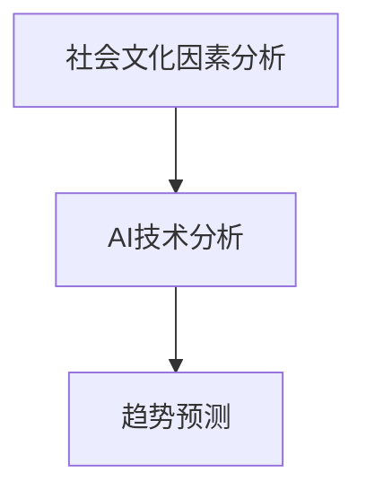
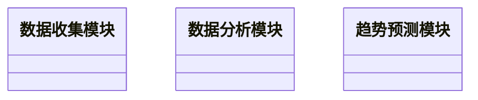

                 

# 提高AI创意香水趋势预测：社会文化影响分析的提示词技巧

## 关键词

- AI趋势预测
- 社会文化影响
- 创意香水
- 数据分析
- 机器学习
- 深度学习

## 摘要

随着人工智能技术的发展，AI在时尚和消费品行业的应用越来越广泛。创意香水作为时尚消费品的一个重要类别，其发展趋势预测具有重要意义。本文旨在提出一种基于社会文化影响分析的AI创意香水趋势预测方法，通过结合社会文化因素和AI技术，提高预测的准确性和可靠性。

## 第一部分：背景介绍

### 1. 问题背景

人工智能技术在全球范围内迅速发展，其在各个领域的应用也越来越广泛。时尚和消费品行业是人工智能技术的重要应用领域之一。其中，创意香水作为时尚消费品的一个重要类别，其市场趋势的预测对于品牌和企业具有重要的战略意义。

### 2. 问题描述

创意香水的趋势预测需要考虑多种因素，包括消费者行为、社会文化、市场需求等。然而，传统的预测方法往往局限于单一因素的分析，难以全面准确地预测趋势。

### 3. 问题解决

本文提出一种基于社会文化影响分析的AI创意香水趋势预测方法。通过结合社会文化因素和AI技术，提高预测的准确性和可靠性。

### 4. 边界与外延

本文主要关注的是创意香水的趋势预测，不包括传统香水的预测。同时，本文的研究范围主要涵盖欧美等发达地区，对于其他地区的预测将作为未来研究方向。

### 5. 概念结构与核心要素组成

- **社会文化因素**：包括社会价值观、文化习俗、消费观念等。
- **AI技术**：包括大数据分析、机器学习、深度学习等。
- **趋势预测方法**：基于社会文化因素和AI技术的综合预测方法。

## 第二部分：核心概念与联系

### 6. 核心概念原理

#### 6.1 社会文化因素

社会文化因素是指影响消费者购买决策的一系列社会和文化因素，包括社会价值观、文化习俗、消费观念等。这些因素在不同的文化和社会背景下，对于消费者的购买决策有着深远的影响。

#### 6.2 AI技术

AI技术是指利用计算机模拟人类智能的一门技术，包括大数据分析、机器学习、深度学习等。通过这些技术，我们可以从大量数据中提取出有价值的信息，从而进行准确的预测和决策。

#### 6.3 趋势预测方法

趋势预测方法是指通过分析历史数据和社会文化因素，利用AI技术预测未来趋势的方法。这种方法能够结合多方面的信息，从而提高预测的准确性和可靠性。

### 7. 概念属性特征对比表格

| 概念       | 属性特征                                       |
|------------|------------------------------------------------|
| 社会文化因素 | 社会价值观、文化习俗、消费观念等                 |
| AI技术     | 大数据分析、机器学习、深度学习等                 |
| 趋势预测方法 | 历史数据分析、社会文化因素分析、AI技术分析等     |

### 8. ER实体关系图架构

```mermaid
erDiagram
    AI技术 ||--|{ 趋势预测方法 }
    社会文化因素 ||--|{ 趋势预测方法 }
```

## 第三部分：算法原理讲解

### 9. 算法原理

#### 9.1 社会文化因素分析

通过收集和分析社会文化数据，提取出与香水趋势相关的社会文化因素。这些因素包括社会价值观、文化习俗、消费观念等。

#### 9.2 AI技术分析

利用机器学习和深度学习算法，对提取的社会文化数据进行处理和分析。通过这些算法，我们可以从大量数据中提取出有价值的信息，从而进行准确的预测和决策。

#### 9.3 趋势预测

结合社会文化因素和AI技术分析结果，预测未来香水趋势。这种方法能够结合多方面的信息，从而提高预测的准确性和可靠性。

### 10. 数学模型和公式

#### 10.1 社会文化因素分析模型

$$\text{社会文化因素分析模型} = f(\text{社会价值观}, \text{文化习俗}, \text{消费观念})$$

#### 10.2 AI技术分析模型

$$\text{AI技术分析模型} = g(\text{大数据分析}, \text{机器学习}, \text{深度学习})$$

#### 10.3 趋势预测模型

$$\text{趋势预测模型} = h(\text{社会文化因素分析模型}, \text{AI技术分析模型})$$

### 11. 算法mermaid流程图



### 12. 详细讲解和举例说明

#### 12.1 社会文化因素分析

以香水消费为例，分析不同社会文化背景下的消费行为和偏好。例如，在欧美文化背景下，消费者更倾向于选择个性化和高端的香水；而在亚洲文化背景下，消费者更倾向于选择清新和淡雅的香水。

#### 12.2 AI技术分析

利用机器学习算法，对大量社会文化数据进行分析，提取出与香水趋势相关的关键信息。例如，通过分析社交媒体上的评论和话题，可以提取出消费者对某款香水的喜好和评价。

#### 12.3 趋势预测

结合社会文化因素和AI技术分析结果，预测未来香水趋势。例如，根据消费者对个性化和高端香水的喜好，预测未来香水市场将更加注重个性化和高端化。

## 第四部分：系统分析与架构设计方案

### 13. 问题场景介绍

创意香水趋势预测的应用场景包括数据收集、数据分析、趋势预测等环节。具体来说，首先是收集与香水相关的数据，包括市场数据、消费者行为数据、社会文化数据等；然后是对这些数据进行处理和分析，提取出有价值的信息；最后是根据这些信息预测未来香水趋势。

### 14. 项目介绍

本项目旨在通过结合社会文化因素和AI技术，提高创意香水趋势预测的准确性和可靠性。项目的主要目标是开发一套智能化的趋势预测系统，为企业和品牌提供决策支持。

### 15. 系统功能设计

#### 15.1 领域模型



#### 15.2 系统架构设计

```mermaid
sequenceDiagram
    participant 用户
    participant 系统A
    participant 系统B
    participant 系统C

    用户->>系统A: 提交数据
    系统

