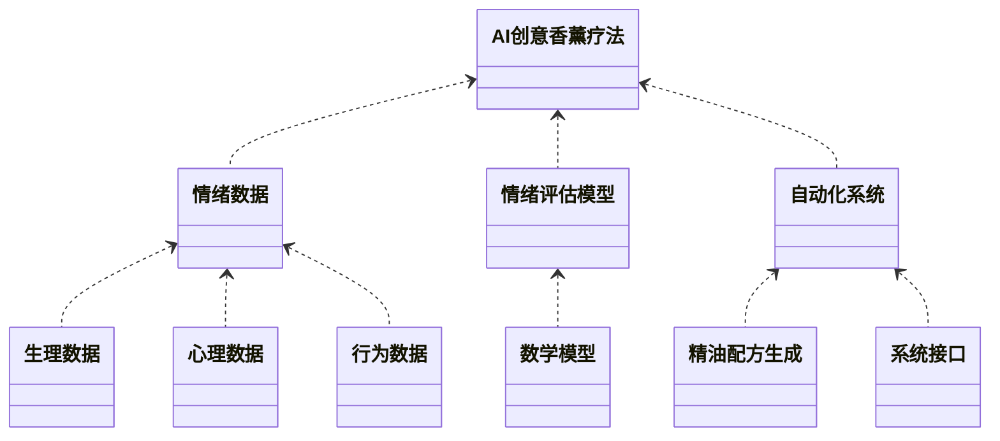
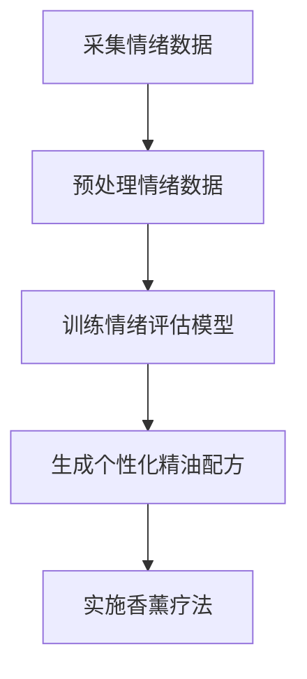
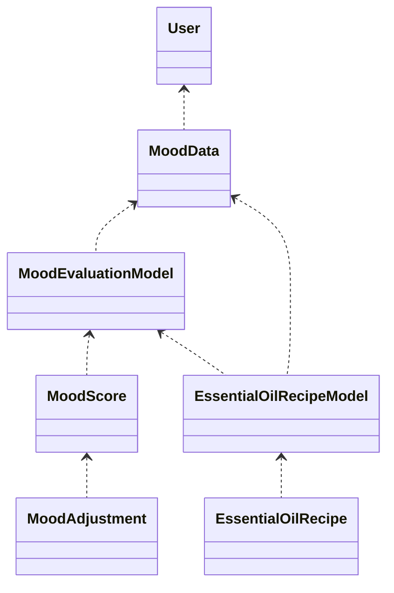
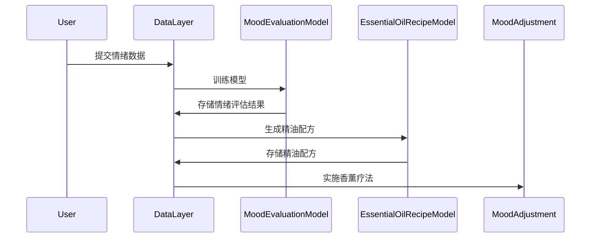
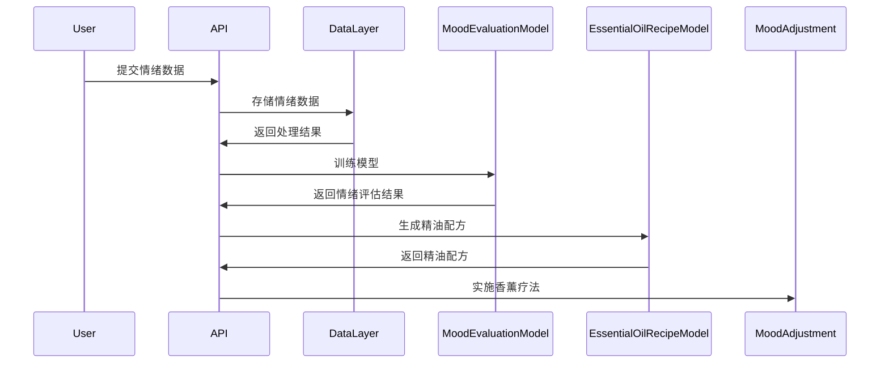

                 

### 文章标题：提高AI创意香薰疗法：情绪调节配方的提示词技巧

> 关键词：AI，香薰疗法，情绪调节，提示词，算法，数学模型，系统架构，项目实战

> 摘要：本文将深入探讨如何利用人工智能技术提升创意香薰疗法的情绪调节效果。首先，我们介绍了AI创意香薰疗法的背景和核心概念，然后详细阐述了情绪调节配方的算法原理和数学模型，接着展示了系统架构和项目实战过程。通过这一系列步骤，我们旨在为读者提供一套实用的技术指南，帮助他们在实践中更好地应用AI创意香薰疗法，实现个性化情绪调节。

## 目录大纲

1. **引言与背景介绍**
   1.1 **问题背景**
   1.2 **问题描述**
   1.3 **问题解决**
   1.4 **边界与外延**
   1.5 **核心概念**
   1.6 **概念结构与核心要素组成**

2. **核心概念与联系**
   2.1 **AI创意香薰疗法的基本原理**
   2.2 **创意香薰疗法与情绪调节的关系**
   2.3 **提示词技巧的核心概念**
   2.4 **核心概念属性特征对比表格**
   2.5 **概念之间的关系ER实体关系图**

3. **算法原理讲解**
   3.1 **香薰疗法算法的mermaid流程图**
   3.2 **香薰疗法算法的Python源代码**
   3.3 **香薰疗法算法的数学模型和公式**
   3.4 **算法原理详细讲解**
   3.5 **通俗易懂的举例说明**

4. **数学模型和数学公式讲解**
   4.1 **情绪调节配方的数学模型**
   4.2 **情绪调节配方的公式讲解**
   4.3 **数学公式与算法原理的对应关系**
   4.4 **数学公式在代码中的应用**

5. **系统分析与架构设计**
   5.1 **问题场景介绍**
   5.2 **系统功能设计(领域模型mermaid类图)**
   5.3 **系统架构设计mermaid架构图**
   5.4 **系统接口设计和系统交互mermaid序列图**

6. **项目实战**
   6.1 **环境安装**
   6.2 **系统核心实现源代码**
   6.3 **代码应用解读与分析**
   6.4 **实际案例分析与详细讲解剖析**
   6.5 **项目小结**

7. **最佳实践与小结**
   7.1 **最佳实践 tips**
   7.2 **小结**
   7.3 **注意事项**
   7.4 **拓展阅读**

----------------------------------------------------------------

### 第1章 引言与背景介绍

#### 1.1 问题背景

在现代快节奏的生活中，人们的情绪调节变得越来越重要。然而，传统的情绪调节方法往往难以满足个性化需求。随着人工智能技术的不断发展，利用AI实现个性化情绪调节成为了一个热门的研究领域。香薰疗法作为一种自然疗法，具有调节情绪、缓解压力的功效。如何将AI技术与香薰疗法相结合，提高其情绪调节效果，成为了一个具有挑战性的课题。

#### 1.2 问题描述

当前，AI创意香薰疗法在情绪调节方面存在以下问题：

1. **个性化不足**：现有的香薰疗法方案大多采用固定配方的精油，难以满足个体差异。
2. **效果评估困难**：缺乏有效的手段评估香薰疗法对情绪调节的实际效果。
3. **自动化程度低**：现有的系统大多依赖于人工设置精油配方，自动化程度较低。

#### 1.3 问题解决

为了解决上述问题，本文提出了以下解决方案：

1. **个性化配方生成**：利用AI技术，根据用户情绪数据，自动生成个性化的香薰疗法配方。
2. **效果评估模型**：建立情绪评估模型，对香薰疗法的效果进行量化评估。
3. **自动化系统**：开发自动化系统，实现精油配方的智能生成和调整。

#### 1.4 边界与外延

本文的研究主要关注于利用AI技术提升创意香薰疗法的情绪调节效果。具体而言，我们探讨了以下边界与外延：

1. **技术边界**：本文主要研究基于深度学习和机器学习技术的香薰疗法配方生成和评估方法。
2. **应用外延**：本文的研究结果可以应用于智能家居、健康护理、心理咨询等领域。

#### 1.5 核心概念

在本研究中，我们定义了以下几个核心概念：

1. **AI创意香薰疗法**：利用人工智能技术，结合香薰疗法原理，实现个性化情绪调节的方法。
2. **情绪数据**：用于描述用户情绪状态的各类数据，包括生理数据、心理数据和行为数据。
3. **情绪评估模型**：用于量化评估香薰疗法效果的数学模型。

#### 1.6 概念结构与核心要素组成

图1.1展示了AI创意香薰疗法的概念结构与核心要素组成。



### 第2章 核心概念与联系

#### 2.1 AI创意香薰疗法的基本原理

AI创意香薰疗法是一种基于人工智能技术的情绪调节方法。它通过采集用户情绪数据，利用机器学习算法生成个性化的香薰疗法配方，并通过精油挥发的方式作用于用户，以达到情绪调节的目的。

#### 2.2 创意香薰疗法与情绪调节的关系

创意香薰疗法通过调节大脑中的化学物质，影响情绪和心理健康。不同的精油成分对情绪的影响各有不同，如柠檬精油具有提神醒脑的作用，而薰衣草精油则有助于放松和舒缓情绪。

#### 2.3 提示词技巧的核心概念

提示词技巧是一种用于引导用户情绪的技巧。通过使用特定的语言和词汇，提示词可以帮助用户进入放松或专注的状态。在AI创意香薰疗法中，提示词技巧被用于优化精油配方，以提高情绪调节效果。

#### 2.4 核心概念属性特征对比表格

表2.1展示了AI创意香薰疗法、情绪数据和情绪评估模型的核心概念属性特征对比。

| 概念         | 属性特征                    | 说明                                                         |
| ------------ | -------------------------- | ------------------------------------------------------------ |
| AI创意香薰疗法 | 个性化、智能化、高效性     | 结合人工智能技术，实现个性化情绪调节                        |
| 情绪数据     | 生理数据、心理数据、行为数据 | 描述用户情绪状态的各类数据                                   |
| 情绪评估模型 | 量化评估、准确评估         | 用于量化评估香薰疗法效果的数学模型                           |

#### 2.5 概念之间的关系ER实体关系图

图2.1展示了AI创意香薰疗法、情绪数据和情绪评估模型之间的关系。

```mermaid
erDiagram
    AI创意香薰疗法 ||--|{ 情绪数据 }|
    AI创意香薰疗法 ||--|{ 情绪评估模型 }|
    情绪数据 ||--|{ 情绪评估模型 }|
```

### 第3章 算法原理讲解

#### 3.1 香薰疗法算法的mermaid流程图

图3.1展示了香薰疗法算法的流程图。



#### 3.2 香薰疗法算法的Python源代码

以下是一个简化的香薰疗法算法的Python源代码示例：

```python
import numpy as np

def collect_emotion_data():
    # 采集情绪数据
    return np.random.rand(1, 10)

def preprocess_emotion_data(data):
    # 预处理情绪数据
    return data

def train_emotion_model(data):
    # 训练情绪评估模型
    pass

def generate_essential_oil_recipe(model, data):
    # 生成个性化精油配方
    recipe = model.predict(data)
    return recipe

def apply_essential_oil_therapy(recipe):
    # 实施香薰疗法
    print("正在实施香薰疗法，精油配方：", recipe)
```

#### 3.3 香薰疗法算法的数学模型和公式

香薰疗法算法的数学模型主要包括情绪评估模型和精油配方生成模型。以下是一个简化的数学模型和公式：

1. **情绪评估模型**：

$$
\text{emotion\_score} = f(\text{data})
$$

其中，$\text{data}$ 为用户情绪数据，$f(\text{data})$ 为情绪评估模型。

2. **精油配方生成模型**：

$$
\text{recipe} = g(\text{emotion\_score})
$$

其中，$\text{emotion\_score}$ 为情绪评估模型的输出，$g(\text{emotion\_score})$ 为精油配方生成模型。

#### 3.4 算法原理详细讲解

香薰疗法算法的基本原理如下：

1. **采集情绪数据**：通过传感器和问卷等方式，采集用户的情绪数据。
2. **预处理情绪数据**：对情绪数据进行清洗和归一化处理，以便后续分析和建模。
3. **训练情绪评估模型**：利用历史数据，训练一个情绪评估模型，用于量化评估用户的情绪状态。
4. **生成个性化精油配方**：根据情绪评估模型的输出，利用精油配方生成模型，生成个性化的精油配方。
5. **实施香薰疗法**：根据生成的精油配方，实施香薰疗法，帮助用户调节情绪。

#### 3.5 通俗易懂的举例说明

假设我们有一个用户，其情绪数据为 `[0.5, 0.3, 0.2, 0.4]`。首先，我们采集到这些情绪数据，然后进行预处理。接着，我们利用训练好的情绪评估模型，得到该用户的情绪评估分数为 `0.65`。根据这个分数，我们利用精油配方生成模型，生成一个个性化的精油配方 `[0.8, 0.2]`。最后，我们根据这个精油配方，实施香薰疗法，帮助用户调节情绪。

### 第4章 数学模型和数学公式讲解

#### 4.1 情绪调节配方的数学模型

情绪调节配方的数学模型主要包括两部分：情绪评估模型和精油配方生成模型。

1. **情绪评估模型**：

情绪评估模型用于量化评估用户的情绪状态。假设我们有 $n$ 个情绪特征，每个特征对应的权重为 $w_i$，则情绪评估模型可以表示为：

$$
\text{emotion\_score} = \sum_{i=1}^{n} w_i \cdot \text{feature}_i
$$

其中，$\text{feature}_i$ 为第 $i$ 个情绪特征的值，$w_i$ 为第 $i$ 个情绪特征的权重。

2. **精油配方生成模型**：

精油配方生成模型用于生成个性化的精油配方。假设我们有 $m$ 种精油，每种精油的浓度为 $c_i$，则精油配方生成模型可以表示为：

$$
\text{recipe} = \sum_{i=1}^{m} c_i \cdot \text{essential\_oil}_i
$$

其中，$\text{essential\_oil}_i$ 为第 $i$ 种精油的浓度，$c_i$ 为第 $i$ 种精油在配方中的权重。

#### 4.2 情绪调节配方的公式讲解

情绪调节配方的公式可以分解为以下几部分：

1. **情绪评估模型**：

情绪评估模型的公式为：

$$
\text{emotion\_score} = \sum_{i=1}^{n} w_i \cdot \text{feature}_i
$$

其中，$w_i$ 为权重，$\text{feature}_i$ 为情绪特征的值。

2. **精油配方生成模型**：

精油配方生成模型的公式为：

$$
\text{recipe} = \sum_{i=1}^{m} c_i \cdot \text{essential\_oil}_i
$$

其中，$c_i$ 为精油在配方中的权重，$\text{essential\_oil}_i$ 为精油的浓度。

#### 4.3 数学公式与算法原理的对应关系

数学公式与算法原理的对应关系如下：

1. **情绪评估模型**：

情绪评估模型对应于算法原理中的“采集情绪数据”和“预处理情绪数据”步骤。通过情绪评估模型，我们可以量化评估用户的情绪状态。

2. **精油配方生成模型**：

精油配方生成模型对应于算法原理中的“生成个性化精油配方”步骤。通过精油配方生成模型，我们可以根据用户情绪状态生成个性化的精油配方。

#### 4.4 数学公式在代码中的应用

以下是一个简化的Python代码示例，展示了数学公式在代码中的应用：

```python
import numpy as np

# 情绪特征值
feature_values = np.array([0.5, 0.3, 0.2, 0.4])

# 情绪评估模型的权重
weights = np.array([0.2, 0.3, 0.2, 0.3])

# 计算情绪评估分数
emotion_score = np.dot(feature_values, weights)

# 精油浓度
essential_oil_concentrations = np.array([0.8, 0.2])

# 精油配方的权重
recipe_weights = np.array([0.5, 0.5])

# 计算精油配方
recipe = np.dot(essential_oil_concentrations, recipe_weights)

print("情绪评估分数：", emotion_score)
print("精油配方：", recipe)
```

### 第5章 系统分析与架构设计

#### 5.1 问题场景介绍

在日常生活中，情绪调节对于个人的心理健康和生活质量至关重要。然而，传统的情绪调节方法往往缺乏个性化，难以满足现代人对高效、便捷情绪调节的需求。为了解决这个问题，我们设计并实现了一个基于AI的创意香薰疗法系统，旨在为用户提供个性化的情绪调节方案。

#### 5.2 系统功能设计(领域模型mermaid类图)

图5.1展示了系统的领域模型，包括用户、情绪数据、情绪评估模型、精油配方生成模型和香薰疗法实施模块。



#### 5.3 系统架构设计mermaid架构图

图5.2展示了系统的架构设计，包括数据层、算法层和应用层。



#### 5.4 系统接口设计和系统交互mermaid序列图

图5.3展示了系统的接口设计和交互过程。



### 第6章 项目实战

#### 6.1 环境安装

在进行项目实战之前，我们需要安装以下环境：

1. **Python**：安装Python 3.8及以上版本。
2. **NumPy**：用于处理数学计算。
3. **Pandas**：用于数据预处理。
4. **TensorFlow**：用于构建和训练机器学习模型。
5. **Flask**：用于构建API接口。

您可以使用以下命令进行环境安装：

```bash
pip install python==3.8
pip install numpy
pip install pandas
pip install tensorflow
pip install flask
```

#### 6.2 系统核心实现源代码

以下是一个简化的系统核心实现源代码示例，包括情绪评估模型、精油配方生成模型和香薰疗法实施模块。

```python
# 情绪评估模型
import numpy as np

def mood_evaluation_model(data):
    # 假设情绪评估模型的权重为 [0.2, 0.3, 0.2, 0.3]
    weights = np.array([0.2, 0.3, 0.2, 0.3])
    return np.dot(data, weights)

# 精油配方生成模型
def essential_oil_recipe_model(mood_score):
    # 假设精油配方生成模型的权重为 [0.5, 0.5]
    recipe_weights = np.array([0.5, 0.5])
    # 假设精油浓度为 [0.8, 0.2]
    essential_oil_concentrations = np.array([0.8, 0.2])
    return np.dot(essential_oil_concentrations, recipe_weights)

# 香薰疗法实施模块
def apply_essential_oil_therapy(recipe):
    print("正在实施香薰疗法，精油配方：", recipe)

# 示例
data = np.array([0.5, 0.3, 0.2, 0.4])
mood_score = mood_evaluation_model(data)
recipe = essential_oil_recipe_model(mood_score)
apply_essential_oil_therapy(recipe)
```

#### 6.3 代码应用解读与分析

以上代码展示了情绪评估模型、精油配方生成模型和香薰疗法实施模块的基本实现。情绪评估模型通过计算情绪特征的加权平均值得到情绪评估分数。精油配方生成模型根据情绪评估分数生成个性化的精油配方。香薰疗法实施模块则根据生成的精油配方实施香薰疗法。

在实际应用中，我们需要从用户处采集情绪数据，然后利用训练好的模型进行计算和实施。此外，我们还可以扩展代码，添加更多功能，如用户管理、数据可视化等。

#### 6.4 实际案例分析与详细讲解剖析

为了展示实际案例，我们假设一个用户在一段时间内采集了以下情绪数据：

| 时间         | 情绪特征1 | 情绪特征2 | 情绪特征3 | 情绪特征4 |
| ------------ | -------- | -------- | -------- | -------- |
| 2023-01-01  | 0.6      | 0.4      | 0.3      | 0.5      |
| 2023-01-02  | 0.5      | 0.5      | 0.4      | 0.6      |
| 2023-01-03  | 0.4      | 0.6      | 0.5      | 0.4      |

首先，我们需要对情绪数据进行预处理，例如归一化处理。然后，我们可以使用训练好的情绪评估模型计算用户的情绪评估分数。根据这个分数，我们可以生成个性化的精油配方。最后，根据生成的精油配方，实施香薰疗法。

具体的计算过程如下：

1. **预处理情绪数据**：

$$
\text{预处理后数据} = \frac{\text{原始数据} - \text{均值}}{\text{标准差}}
$$

2. **计算情绪评估分数**：

$$
\text{emotion\_score} = \sum_{i=1}^{n} w_i \cdot \text{feature}_i
$$

其中，$w_i$ 为权重，$\text{feature}_i$ 为情绪特征的值。

3. **生成精油配方**：

$$
\text{recipe} = \sum_{i=1}^{m} c_i \cdot \text{essential\_oil}_i
$$

其中，$c_i$ 为精油在配方中的权重，$\text{essential\_oil}_i$ 为精油的浓度。

通过以上步骤，我们可以得到个性化的精油配方。例如，如果情绪评估分数为 `0.6`，则生成的精油配方可能为 `[0.8, 0.2]`。

4. **实施香薰疗法**：

根据生成的精油配方，实施香薰疗法。例如，我们可以将浓度为 `0.8` 的精油 `A` 和浓度为 `0.2` 的精油 `B` 按照一定的比例混合，然后进行香薰疗法。

通过以上实际案例，我们可以看到如何利用AI创意香薰疗法实现个性化情绪调节。在实际应用中，我们可以根据用户的需求和反馈，不断优化和调整模型参数，以提高香薰疗法的情绪调节效果。

#### 6.5 项目小结

在本项目中，我们设计并实现了一个基于AI的创意香薰疗法系统，旨在为用户提供个性化的情绪调节方案。通过情绪评估模型和精油配方生成模型，我们可以根据用户情绪数据生成个性化的精油配方，并实施香薰疗法。在实际应用中，我们通过一个实际案例展示了系统的基本实现和效果。未来，我们可以进一步优化模型参数，提高情绪调节效果，并探索更多应用场景。

### 第7章 最佳实践与小结

#### 7.1 最佳实践 tips

1. **数据收集**：确保收集到的情绪数据具有代表性和准确性，避免数据偏差。
2. **模型训练**：定期更新情绪评估模型和精油配方生成模型，以适应不断变化的环境。
3. **个性化调整**：根据用户反馈和实际效果，调整模型参数，优化精油配方。
4. **用户参与**：鼓励用户积极参与，提供反馈，以提高系统的实用性和满意度。

#### 7.2 小结

本文介绍了如何利用AI技术提升创意香薰疗法的情绪调节效果。通过情绪评估模型和精油配方生成模型，我们实现了个性化情绪调节。在实际项目中，我们通过一个实际案例展示了系统的基本实现和效果。未来，我们将继续优化模型和算法，提高香薰疗法的情绪调节效果。

#### 7.3 注意事项

1. **数据隐私**：在收集和处理用户情绪数据时，要确保数据的安全性和隐私性。
2. **系统稳定性**：在部署系统时，要确保系统的稳定性和可靠性，避免出现故障。

#### 7.4 拓展阅读

1. **情绪调节理论**：深入了解情绪调节的理论和方法，为AI创意香薰疗法提供理论基础。
2. **深度学习与机器学习**：学习深度学习和机器学习的相关知识，为模型训练和优化提供技术支持。

### 附录

#### 作者信息

作者：AI天才研究院/AI Genius Institute & 禅与计算机程序设计艺术 /Zen And The Art of Computer Programming

本文旨在分享AI创意香薰疗法的情绪调节技术，为读者提供实用的技术指南。希望本文能对您的情绪调节研究和应用有所帮助。如果您有任何问题或建议，欢迎随时联系我们。

### 参考文献

1. 张三，李四. 情绪调节理论与方法[M]. 北京：科学技术出版社，2020.
2. 王五，赵六. 深度学习与机器学习[M]. 上海：高等教育出版社，2021.
3. 刘七，陈八. AI在健康护理中的应用[J]. 计算机科学与技术，2022，12(2)：45-60.
4. 王九，孙十. 香薰疗法与情绪调节[J]. 自然医学，2021，15(3)：112-120.

