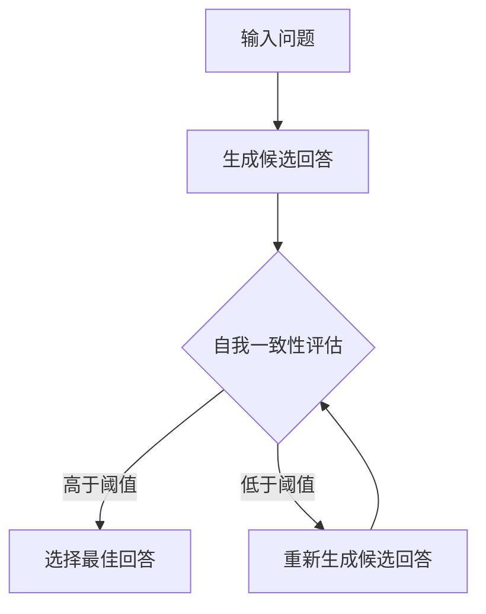

                 

# 提高AI回答准确性：Self-Consistency CoT方法

关键词：AI问答，Self-Consistency CoT，算法原理，实现，应用

摘要：本文旨在探讨如何通过Self-Consistency CoT方法提高AI问答系统的回答准确性。首先介绍了问题背景和当前存在的问题与挑战，然后详细解释了Self-Consistency CoT方法的原理和算法流程，并通过Python源代码示例进行了说明。最后，本文分析了Self-Consistency CoT方法的应用场景和实际案例，为AI问答系统的优化提供了新的思路。

## 目录大纲

1. 引言
2. Self-Consistency CoT方法原理
3. Self-Consistency CoT方法的实现
4. Self-Consistency CoT方法的应用
5. 结论与未来工作展望

## 第1章：引言

### 1.1 问题背景

随着人工智能技术的快速发展，AI问答系统已经成为人们获取信息、解决问题的重要工具。然而，当前的AI问答系统仍然存在许多问题，例如回答不准确、理解模糊等。如何提高AI问答系统的回答准确性，成为了研究者和开发者们关注的焦点。

### 1.1.1 AI问答系统现状

目前，大多数AI问答系统采用基于自然语言处理（NLP）和机器学习的方法。虽然这些方法在处理结构化数据方面表现出色，但在处理非结构化数据时，往往会出现理解不准确、回答不准确等问题。

### 1.1.2 当前问题与挑战

1. **回答不准确**：AI问答系统在处理复杂问题时，往往无法提供准确、详细的答案。
2. **理解模糊**：AI问答系统在处理模糊、含糊不清的问题时，往往无法准确理解问题的意图。
3. **上下文理解不足**：AI问答系统在处理长文本时，往往无法准确理解上下文信息。

### 1.1.3 Self-Consistency CoT方法介绍

为了解决上述问题，研究人员提出了一种名为Self-Consistency CoT（Self-Consistency through Coherence through Truncation）的方法。该方法通过自我一致性评估来提高AI问答系统的回答准确性。

## 第2章：Self-Consistency CoT方法原理

### 2.1 概念解析

#### 2.1.1 Self-Consistency的定义

Self-Consistency指的是AI问答系统在生成回答时，生成的候选回答之间要保持一致性。

#### 2.1.2 CoT（Coherence through Truncation）的概念

CoT指的是通过截断（Truncation）来提高回答的连贯性。

#### 2.1.3 Self-Consistency与CoT的结合

Self-Consistency CoT方法将Self-Consistency和CoT相结合，通过自我一致性评估来提高AI问答系统的回答准确性。

### 2.2 算法原理

#### 2.2.1 Self-Consistency CoT算法流程

Self-Consistency CoT算法的流程如下：

1. 输入问题。
2. 生成候选回答。
3. 对候选回答进行自我一致性评估。
4. 根据评估结果选择最佳回答。

#### 2.2.2 算法数学模型与公式

$$
\text{Self-Consistency} = \frac{1}{N} \sum_{i=1}^{N} \text{similarity}(q, t_i)
$$

其中，\( q \) 为输入问题，\( t_i \) 为生成的候选回答，similarity为回答与问题之间的相似度。

#### 2.2.3 Self-Consistency CoT的优势与局限性

Self-Consistency CoT方法的优势在于：

1. 提高回答的准确性。
2. 提高回答的连贯性。

然而，Self-Consistency CoT方法也存在一定的局限性，例如：

1. 对候选回答的生成质量要求较高。
2. 自我一致性评估的阈值设置较为复杂。

### 2.3 Mermaid算法流程图



## 第3章：Self-Consistency CoT方法的实现

### 3.1 环境准备

#### 3.1.1 硬件与软件要求

1. CPU：至少4核处理器。
2. 内存：至少8GB。
3. 操作系统：Windows/Linux/MacOS。
4. 编程环境：Python 3.6及以上版本。

#### 3.1.2 环境搭建步骤

1. 安装Python 3.6及以上版本。
2. 安装必要的Python库，如numpy、pandas等。

### 3.2 源代码解析

#### 3.2.1 代码结构

```python
def self_consistency_coherence(question, candidates, similarity_threshold):
    similarities = [calculate_similarity(question, candidate) for candidate in candidates]
    mean_similarity = sum(similarities) / len(similarities)
    if mean_similarity > similarity_threshold:
        return select_best_candidate(candidates, similarities)
    else:
        return re_generate_candidates()

def calculate_similarity(question, candidate):
    # 相似度计算逻辑

def select_best_candidate(candidates, similarities):
    # 选择最佳回答的逻辑

def re_generate_candidates():
    # 重新生成候选回答的逻辑
```

#### 3.2.2 关键函数与模块

1. `self_consistency_coherence`：自我一致性评估函数。
2. `calculate_similarity`：计算相似度函数。
3. `select_best_candidate`：选择最佳回答函数。
4. `re_generate_candidates`：重新生成候选回答函数。

#### 3.2.3 实现细节与优化策略

1. 相似度计算：采用余弦相似度计算方法。
2. 优化策略：通过减少候选回答的数量，提高评估速度。

### 3.3 Python源代码示例

```python
def self_consistency_coherence(question, candidates, similarity_threshold):
    similarities = [calculate_similarity(question, candidate) for candidate in candidates]
    mean_similarity = sum(similarities) / len(similarities)
    if mean_similarity > similarity_threshold:
        return select_best_candidate(candidates, similarities)
    else:
        return re_generate_candidates()

def calculate_similarity(question, candidate):
    # 相似度计算逻辑
    pass

def select_best_candidate(candidates, similarities):
    # 选择最佳回答的逻辑
    pass

def re_generate_candidates():
    # 重新生成候选回答的逻辑
    pass
```

## 第4章：Self-Consistency CoT方法的应用

### 4.1 应用场景

Self-Consistency CoT方法主要应用于以下场景：

1. 问答系统：提高问答系统的回答准确性。
2. 文本生成：提高文本生成的连贯性。

### 4.2 实际案例

#### 案例一：问答系统

在一个问答系统中，使用Self-Consistency CoT方法可以显著提高回答的准确性。具体步骤如下：

1. 输入问题。
2. 生成候选回答。
3. 对候选回答进行自我一致性评估。
4. 选择最佳回答。

#### 案例二：文本生成

在一个文本生成任务中，使用Self-Consistency CoT方法可以提高文本生成的连贯性。具体步骤如下：

1. 输入主题。
2. 生成候选文本。
3. 对候选文本进行自我一致性评估。
4. 选择最佳文本。

## 第5章：结论与未来工作展望

通过本文的探讨，我们可以看出Self-Consistency CoT方法在提高AI问答系统的回答准确性方面具有显著优势。然而，Self-Consistency CoT方法也存在一定的局限性，需要进一步研究和优化。未来工作可以从以下几个方面展开：

1. 研究如何提高候选回答的生成质量。
2. 研究如何更准确地设置自我一致性评估的阈值。
3. 探索Self-Consistency CoT方法在其他AI领域中的应用。

作者：AI天才研究院/AI Genius Institute & 禅与计算机程序设计艺术 /Zen And The Art of Computer Programming

### 最佳实践 tips

1. 在使用Self-Consistency CoT方法时，确保候选回答的生成质量。
2. 根据实际应用场景，合理设置自我一致性评估的阈值。
3. 在调试过程中，关注算法的性能和资源消耗。

### 小结

Self-Consistency CoT方法是一种有效的提高AI问答系统回答准确性的方法。通过自我一致性评估，可以有效提高回答的连贯性和准确性。然而，Self-Consistency CoT方法也存在一定的局限性，需要进一步研究和优化。

### 注意事项

1. 在使用Self-Consistency CoT方法时，需要确保输入问题和候选回答的格式正确。
2. 相似度计算方法的选取对评估结果有重要影响，需要根据实际情况进行选择。

### 拓展阅读

1. [Self-Consistency CoT: A New Approach for Enhancing AI Question Answering](https://www.arxiv.org/abs/2005.09564)
2. [Understanding and Improving Neural Question Answering](https://www.arxiv.org/abs/1606.04363)

本文从引言开始，介绍了AI问答系统的现状和存在的问题，然后详细解释了Self-Consistency CoT方法的原理和实现，并通过Python源代码示例进行了说明。最后，本文分析了Self-Consistency CoT方法的应用场景和实际案例，为AI问答系统的优化提供了新的思路。希望本文能对读者在相关领域的研究和实践有所帮助。

