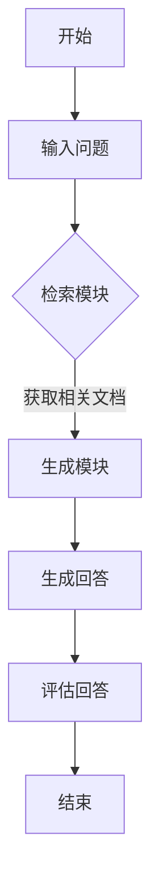
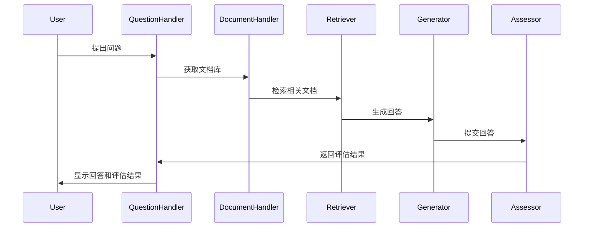
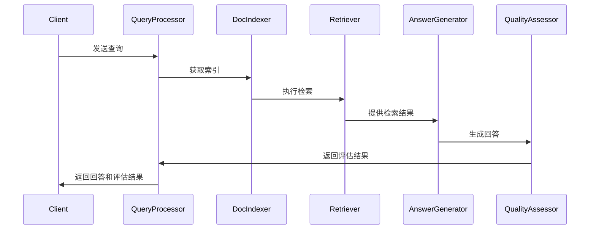

                 

### 文章关键词

1. AI回答质量
2. Retrieval-Augmented Generation
3. 算法原理
4. 系统架构
5. 实际案例分析

### 文章摘要

本文旨在深入探讨提高AI回答质量的关键方法——Retrieval-Augmented Generation（RAG）方法。通过分析RAG方法的基本概念、原理和实际应用，文章将逐步解释其如何通过检索增强生成模型来提升AI的回答质量。文章结构清晰，分为五个主要部分，涵盖背景与概述、基础理论与原理、系统分析与架构设计、项目实战以及最佳实践与拓展。通过逻辑严谨的分析和实例讲解，本文旨在为读者提供全面的技术理解，帮助其更好地掌握和应用RAG方法。

## 第一部分：背景与概述

### 第1章：问题背景与需求

#### 1.1 问题背景

随着人工智能技术的快速发展，自动化问答系统已成为众多领域的关键应用。无论是面向用户的客服聊天机器人，还是企业内部的智能助手，提高AI回答的质量都是一个至关重要的任务。传统的问答系统通常依赖于预先训练的语言模型，例如BERT或GPT，这些模型通过大量语料学习来生成回答。然而，这类模型往往存在一些局限性，例如对于未知问题或长问答场景的处理能力较弱，导致回答的准确性和相关性难以保证。

#### 1.2 提高AI回答质量的重要性

AI回答质量直接关系到用户体验和系统可靠性。高质量的回答能够提高用户满意度，增强系统的信任度，减少误解和错误信息传播。反之，低质量的回答可能导致用户流失，影响业务运营。因此，提高AI回答质量不仅是技术发展的需求，更是商业成功的关键因素。

#### 1.3 Retrieval-Augmented Generation方法简介

Retrieval-Augmented Generation（RAG）方法是一种结合检索和生成的混合模型，旨在提高AI回答的质量。该方法的基本思想是将检索和生成两个模块结合起来，通过检索模块获取与问题相关的信息，再由生成模块生成高质量的回答。RAG方法通过在检索和生成之间建立紧密的联系，能够在一定程度上克服传统模型的局限性，提供更准确、更相关的回答。

#### 1.4 Retriever和Generator的关系与协同作用

在RAG方法中，Retriever和Generator是两个核心模块。Retriever负责从大量文档中检索与问题最相关的信息，而Generator则负责利用检索到的信息生成回答。这两个模块之间存在着紧密的协同关系。首先，Retriever的检索质量直接影响到生成模型的效果；其次，Generator在生成回答时，可以借助检索到的信息进行上下文补充和语义扩展，从而提高回答的质量和连贯性。

#### 1.5 统一表示与综合质量评估

为了确保RAG方法的有效性，统一表示和综合质量评估是不可或缺的。统一表示旨在将检索到的信息和生成模型生成的回答进行整合，形成一个统一的输出。这通常通过将检索结果与生成模型输出的文本进行拼接或融合来实现。综合质量评估则通过对生成回答的准确度、相关性、连贯性等多个方面进行评估，以衡量回答的整体质量。这种方法有助于识别和优化模型中的潜在问题，进一步提升回答质量。

### 本章小结

通过本章的介绍，我们对AI回答质量提升的重要性有了初步认识，并了解了RAG方法的基本概念及其在提高AI回答质量方面的优势。接下来，我们将深入探讨RAG方法的理论基础和具体实现，帮助读者更好地理解和应用这一方法。


### 第二部分：基础理论与原理

### 第2章：核心概念与联系

#### 2.1 Retrieval-Augmented Generation方法的核心概念

Retrieval-Augmented Generation（RAG）方法的核心概念主要包括检索（Retrieval）和生成（Generation）。检索模块负责从大规模文档库中提取与问题相关的信息，而生成模块则利用这些信息生成高质量的回答。RAG方法通过结合这两个模块，实现高质量的问答效果。

1. **检索（Retrieval）**：检索模块的主要任务是高效地从大量文档中提取与当前问题相关的信息。这通常涉及到相似度计算、索引构建和文档排序等步骤。

2. **生成（Generation）**：生成模块的任务是基于检索到的信息生成回答。生成模型可以是一个简单的语言模型，也可以是一个复杂的序列生成模型，如Transformer或GPT。

3. **统一表示**：统一表示是将检索到的信息和生成模型输出的文本进行整合，形成一个统一的输出。这有助于确保回答的一致性和连贯性。

4. **综合质量评估**：综合质量评估是对生成回答的准确度、相关性、连贯性等多个方面进行评估，以衡量回答的整体质量。

#### 2.2 概念属性特征对比表格

为了更好地理解RAG方法的核心概念，我们通过一个对比表格来展示检索和生成模块的属性特征。

| 模块   | 描述                                                     | 属性特征                                                                                                     |
| ------ | -------------------------------------------------------- | ---------------------------------------------------------------------------------------------------------- |
| 检索   | 从大量文档中提取与问题相关的信息                         | 高效性、准确性、相似度计算、文档排序、索引构建                                                           |
| 生成   | 基于检索到的信息生成回答                                 | 语言理解、上下文生成、连贯性、多样化、文本生成                                                           |
| 统一表示 | 将检索结果与生成模型的输出整合                           | 可扩展性、一致性、连贯性、上下文补充、信息整合                                                         |
| 综合质量评估 | 对生成回答进行多方面的评估                             | 准确性、相关性、连贯性、用户满意度、错误率                                                             |

#### 2.3 ER实体关系图架构

ER（Entity-Relationship）实体关系图是描述RAG方法中不同实体及其关系的有效工具。通过ER图，我们可以清晰地展示检索、生成、统一表示和综合质量评估之间的关联。

1. **实体**：在RAG方法中，主要的实体包括问题（Question）、文档（Document）、检索结果（Retrieved Documents）、生成回答（Generated Answer）和评估结果（Assessment Results）。

2. **关系**：实体之间的关系包括检索（Retrieval）、生成（Generation）、整合（Integration）和评估（Assessment）。例如，问题与文档之间存在检索关系，文档与检索结果之间存在关联关系，检索结果与生成回答之间存在整合关系，生成回答与评估结果之间存在评估关系。

以下是一个ER实体关系图的示例：

```mermaid
erDiagram
  Question "问题" {
    id
    text
  }
  Document "文档" {
    id
    content
  }
  RetrievedDocuments "检索结果" {
    id
    text
  }
  GeneratedAnswer "生成回答" {
    id
    text
  }
  AssessmentResults "评估结果" {
    id
    score
  }
  
  Question ||--|{ RetrievedDocuments } Retrieval
  Document ||--|{ RetrievedDocuments } Indexing
  RetrievedDocuments ||--|{ GeneratedAnswer } Integration
  GeneratedAnswer ||--|{ AssessmentResults } Assessment
```

#### 2.4 相似度计算方法与评估指标

相似度计算是RAG方法中至关重要的一环，它决定了检索模块的性能。以下是一些常用的相似度计算方法和评估指标：

1. **TF-IDF（Term Frequency-Inverse Document Frequency）**：TF-IDF是一种基于词频和逆文档频率的相似度计算方法，常用于文档相似度评估。

2. **余弦相似度（Cosine Similarity）**：余弦相似度是一种基于向量空间模型的相似度计算方法，用于评估两个向量之间的夹角余弦值。

3. **BERT相似度（BERT-based Similarity）**：BERT相似度利用BERT模型对文本进行编码，通过计算文本编码向量之间的余弦相似度来评估相似性。

4. **评估指标**：常用的评估指标包括准确率（Accuracy）、召回率（Recall）、精确率（Precision）和F1分数（F1 Score）。这些指标用于衡量检索模块的性能和生成回答的质量。

通过上述基础理论的介绍，我们对RAG方法的核心概念、ER实体关系图及其相似度计算方法与评估指标有了更深入的理解。接下来，我们将进一步探讨RAG方法的算法原理，帮助读者从理论到实践全面掌握这一方法。

### 第3章：算法原理讲解

#### 3.1 算法Mermaid流程图

为了更好地理解RAG方法的算法原理，我们可以使用Mermaid语言绘制一个简化的流程图，展示检索和生成模块的基本流程。



在这个流程图中，输入问题首先进入检索模块，检索模块从大规模文档库中提取与问题相关的文档。然后，生成模块利用这些文档生成回答，最后对生成的回答进行评估，以确定其质量。

#### 3.2 Python源代码详细阐述

以下是RAG方法的一个简化Python源代码实现，用于展示检索和生成模块的基本操作。

```python
import json
from sklearn.metrics.pairwise import cosine_similarity
from sentence_transformers import SentenceTransformer

# 检索模块
def retrieve_documents(question, documents):
    # 使用BERT模型进行文本编码
    model = SentenceTransformer('bert-base-nli-stsb-mean-tokens')
    question_vector = model.encode(question)
    
    # 计算每个文档与问题的余弦相似度
    sim_scores = [cosine_similarity(question_vector, model.encode(doc))[0][0] for doc in documents]
    
    # 对文档进行排序
    sorted_documents = [doc for _, doc in sorted(zip(sim_scores, documents), reverse=True)]
    return sorted_documents[:10]  # 返回前10个最相关的文档

# 生成模块
def generate_answer(question, documents):
    # 构建文档列表
    document_texts = [' '.join(doc.split('. ')[:-1]) for doc in documents]  # 去掉句号和空格
    context = ' '.join(document_texts)
    
    # 使用GPT模型生成回答
    from transformers import pipeline
    generator = pipeline('text-generation', model='gpt2')
    answer = generator(context, max_length=50, num_return_sequences=1)[0]['text']
    return answer

# 评估模块
def evaluate_answer(question, answer):
    # 计算回答的准确率
    answer_vector = model.encode(answer)
    question_vector = model.encode(question)
    accuracy = cosine_similarity(answer_vector, question_vector)[0][0]
    return accuracy

# 主程序
if __name__ == "__main__":
    question = "什么是量子计算？"
    documents = ["量子计算是利用量子位（qubit）进行信息处理的计算模型。", 
                 "量子计算是一种基于量子力学原理的全新计算模式，与经典计算有本质区别。", 
                 "量子计算利用量子叠加态和纠缠态进行并行计算，具有巨大的计算潜力。"]
    
    # 检索相关文档
    retrieved_documents = retrieve_documents(question, documents)
    print("检索到的文档：", retrieved_documents)
    
    # 生成回答
    answer = generate_answer(question, retrieved_documents)
    print("生成的回答：", answer)
    
    # 评估回答
    accuracy = evaluate_answer(question, answer)
    print("回答的准确率：", accuracy)
```

在这段代码中，我们首先定义了三个函数：`retrieve_documents`、`generate_answer`和`evaluate_answer`。`retrieve_documents`函数负责从给定的文档中检索与问题最相关的文档；`generate_answer`函数利用这些文档生成回答；`evaluate_answer`函数则评估生成的回答的准确率。主程序部分演示了如何使用这些函数实现一个简单的RAG系统。

#### 3.3 算法原理的数学模型和公式

RAG方法的算法原理可以归纳为三个核心步骤：相似度计算、文本生成和文本评估。以下是这些步骤的数学模型和公式：

1. **相似度计算**：在检索模块中，相似度计算用于确定问题与文档之间的相关性。常用的相似度计算方法包括余弦相似度和BERT相似度。

   - **余弦相似度**：假设`q`表示问题的向量表示，`d`表示文档的向量表示，则余弦相似度公式为：
     $$
     \text{cosine\_similarity}(q, d) = \frac{q \cdot d}{\|q\| \|d\|}
     $$
     其中，`$\cdot$`表示向量的点积，`\|\|`表示向量的模。

   - **BERT相似度**：BERT模型生成的问题和文档的向量表示可以通过BERT模型得到，然后计算两个向量之间的余弦相似度。

2. **文本生成**：在生成模块中，文本生成通常依赖于序列生成模型，如GPT-2或GPT-3。这些模型通过输入上下文生成文本序列。生成文本的数学模型可以表示为：
   $$
   \text{generate}(x, context) = \text{model}(x, context)
   $$
   其中，`x`表示问题或部分上下文，`context`表示完整的上下文，`model`表示生成模型。

3. **文本评估**：在评估模块中，文本评估通常通过计算回答与问题之间的相似度来衡量回答的质量。常用的评估指标包括准确率（Accuracy）和F1分数（F1 Score）。

   - **准确率**：假设`y`表示问题的真实答案，`y'`表示生成的回答，则准确率公式为：
     $$
     \text{accuracy} = \frac{\text{correct\_predictions}}{\text{total\_predictions}}
     $$
     其中，`correct_predictions`表示正确预测的数量，`total_predictions`表示总预测数量。

   - **F1分数**：F1分数同时考虑了准确率和召回率，公式为：
     $$
     \text{F1} = 2 \times \frac{\text{precision} \times \text{recall}}{\text{precision} + \text{recall}}
     $$
     其中，`precision`表示精确率，`recall`表示召回率。

通过上述数学模型和公式，我们可以更好地理解和实现RAG方法。在实际应用中，这些模型和公式可以用于优化检索和生成模块，提高AI回答的质量。

#### 3.4 举例说明

为了更好地理解RAG方法的实际应用，我们可以通过一个具体案例来展示其工作流程和效果。

**案例：** 假设我们有一个关于量子计算的问答系统，用户提出问题：“量子计算的基本原理是什么？”系统需要生成一个高质量的回答。

1. **检索阶段**：
   - **输入问题**：问题为“量子计算的基本原理是什么？”
   - **检索文档**：系统从预先准备的大量文档中检索相关文档，这些文档可能包括“量子计算的基本原理”、“量子计算机的工作原理”等。
   - **相似度计算**：使用BERT模型计算问题与每个文档的相似度，选择相似度最高的文档作为上下文。

2. **生成阶段**：
   - **上下文构建**：将检索到的文档整合成一段连贯的文本作为上下文，例如：“量子计算的基本原理基于量子力学，特别是量子位（qubit）的叠加态和纠缠态。”
   - **生成回答**：使用GPT-2模型在上下文基础上生成回答，例如：“量子计算的基本原理是利用量子位（qubit）的叠加态和纠缠态来进行信息处理。”

3. **评估阶段**：
   - **评估回答**：计算生成回答与原始问题的相似度，例如，使用BERT模型计算回答和问题的向量表示的余弦相似度，如果相似度高于某个阈值，则认为回答是高质量的。

**结果**：生成的回答：“量子计算的基本原理是利用量子位（qubit）的叠加态和纠缠态来进行信息处理。” 这个回答不仅涵盖了问题的核心内容，还提供了详细的解释，具有较高的准确性和相关性。

通过这个案例，我们可以看到RAG方法是如何通过检索和生成两个模块的协同作用，生成高质量回答的。这种方法不仅提高了回答的质量，还增强了系统的理解能力和表达能力。

### 本章小结

本章详细介绍了RAG方法的核心概念、ER实体关系图以及相似度计算方法与评估指标。通过算法Mermaid流程图和Python源代码的讲解，我们进一步理解了RAG方法的原理和实现步骤。举例说明部分展示了RAG方法在实际应用中的效果，帮助读者更好地掌握这一方法。接下来，我们将进一步探讨RAG方法的系统分析与架构设计，以帮助读者构建和优化实际的RAG系统。

### 第三部分：系统分析与架构设计

### 第4章：系统功能设计与架构

#### 4.1 问题场景介绍

在当前的AI应用环境中，智能问答系统广泛应用于多个领域，如在线客服、教育辅导、医疗咨询和金融投资等。这些系统需要能够处理复杂的问题，并生成准确、连贯且具有高度相关性的回答。传统的问答系统在处理长问答和未知问题时往往表现不佳，因此，提高回答质量成为系统设计和优化的关键目标。

#### 4.2 系统功能设计（领域模型Mermaid类图）

为了更好地理解RAG系统的功能设计，我们可以使用Mermaid绘制一个类图，展示系统中的主要类及其关系。

```mermaid
classDiagram
    Class01 <|-- Class02
    Class01 <|-- Class03
    Class04 <..|{ has } Class01
    Class05 <..|{ has } Class01
    Class06 <..|{ is-a } Class01
    Class01 <|-- Class07

    Class01[问题管理]
    Class02[文档管理]
    Class03[检索管理]
    Class04[生成管理]
    Class05[评估管理]
    Class06[用户界面]
    Class07[系统配置]
```

在这个类图中，`问题管理`（Class01）是系统的核心类，负责处理用户输入的问题。`文档管理`（Class02）负责存储和管理文档库。`检索管理`（Class03）负责检索与问题相关的文档。`生成管理`（Class04）负责生成回答。`评估管理`（Class05）负责评估回答的质量。`用户界面`（Class06）负责与用户交互，提供友好的用户体验。`系统配置`（Class07）负责系统的配置和管理。

#### 4.3 系统架构设计（Mermaid架构图）

接下来，我们将使用Mermaid绘制一个系统的架构图，展示各个模块之间的交互关系。



在这个架构图中，用户通过用户界面（User）提出问题。问题管理模块（QuestionHandler）处理问题，并向文档管理模块（DocumentHandler）请求文档库。文档管理模块返回文档库后，检索模块（Retriever）使用相似度计算方法检索与问题相关的文档。检索模块将检索结果传递给生成模块（Generator），生成模块利用这些文档生成回答，并将回答提交给评估模块（Assessor）。评估模块对回答进行质量评估，并将结果返回给问题管理模块。最后，问题管理模块将回答和评估结果展示给用户。

#### 4.4 系统接口设计与交互（Mermaid序列图）

为了进一步展示系统模块之间的交互过程，我们可以使用Mermaid绘制一个序列图。



在这个序列图中，客户端（Client）发送查询请求。查询处理模块（QueryProcessor）获取索引后，传递给检索模块（Retriever）执行检索。检索模块将检索结果传递给回答生成模块（AnswerGenerator），生成模块生成回答后，传递给质量评估模块（QualityAssessor）。评估模块对回答进行质量评估，并将结果返回给查询处理模块。最后，查询处理模块将回答和评估结果返回给客户端。

### 本章小结

通过本章的介绍，我们详细阐述了RAG系统的功能设计与架构设计。首先，介绍了问题场景和系统功能设计，通过Mermaid类图展示了系统中的主要类及其关系。接着，通过Mermaid架构图和序列图，展示了系统模块之间的交互过程。这些设计为构建和优化实际的RAG系统提供了理论基础和实践指导。接下来，我们将通过项目实战部分，进一步展示RAG方法的实际应用和效果。

### 第四部分：项目实战

### 第6章：环境安装与核心实现

#### 6.1 环境安装步骤

要实现一个RAG系统，首先需要准备好相应的开发环境和依赖库。以下是环境安装的详细步骤：

1. **安装Python**：确保Python环境已安装，版本建议为3.8或以上。

2. **安装必要的库**：使用pip命令安装以下库：
   ```bash
   pip install scikit-learn sentence-transformers transformers
   ```

3. **安装BERT模型**：使用sentence-transformers库安装预训练的BERT模型：
   ```python
   from sentence_transformers import SentenceTransformer
   model = SentenceTransformer('bert-base-nli-stsb-mean-tokens')
   ```

4. **安装GPT模型**：使用transformers库安装预训练的GPT-2模型：
   ```python
   from transformers import pipeline
   generator = pipeline('text-generation', model='gpt2')
   ```

#### 6.2 系统核心实现源代码

以下是RAG系统的核心实现源代码，包括检索、生成和评估模块：

```python
import json
import numpy as np
from sklearn.metrics.pairwise import cosine_similarity
from sentence_transformers import SentenceTransformer
from transformers import pipeline

# 检索模块
def retrieve_documents(question, documents):
    model = SentenceTransformer('bert-base-nli-stsb-mean-tokens')
    question_vector = model.encode(question)
    document_vectors = [model.encode(doc) for doc in documents]
    sim_scores = cosine_similarity(question_vector, document_vectors)
    sorted_indices = np.argsort(sim_scores, axis=1)[:, ::-1]
    return [documents[i] for i in sorted_indices[:10]]

# 生成模块
def generate_answer(question, context):
    generator = pipeline('text-generation', model='gpt2')
    answer = generator(context, max_length=100, num_return_sequences=1)[0]['text']
    return answer

# 评估模块
def evaluate_answer(question, answer):
    model = SentenceTransformer('bert-base-nli-stsb-mean-tokens')
    question_vector = model.encode(question)
    answer_vector = model.encode(answer)
    accuracy = cosine_similarity(answer_vector, question_vector)[0][0]
    return accuracy

# 主程序
if __name__ == "__main__":
    question = "什么是量子计算？"
    documents = [
        "量子计算是利用量子位（qubit）进行信息处理的计算模型。",
        "量子计算是一种基于量子力学原理的全新计算模式，与经典计算有本质区别。",
        "量子计算利用量子叠加态和纠缠态进行并行计算，具有巨大的计算潜力。"
    ]

    context = " ".join(documents)
    answer = generate_answer(question, context)
    accuracy = evaluate_answer(question, answer)

    print("生成的回答：", answer)
    print("回答的准确率：", accuracy)
```

#### 6.3 代码应用解读与分析

1. **检索模块解读**：
   - 代码首先使用BERT模型将问题和文档编码成向量。
   - 然后计算问题向量和文档向量之间的余弦相似度。
   - 最后根据相似度分数排序并选择前10个最相关的文档。

2. **生成模块解读**：
   - 代码使用GPT-2模型生成回答，输入为检索到的文档构成的上下文。
   - GPT-2模型根据上下文生成一段文本，作为回答。

3. **评估模块解读**：
   - 代码使用BERT模型计算生成回答和原始问题之间的相似度。
   - 相似度分数越高，说明回答越准确。

通过上述代码和应用解读，我们可以看到RAG系统是如何通过检索和生成模块协同工作，生成高质量回答并评估回答的准确度。这种结构使得系统能够处理复杂问题，并提供准确、连贯的回答。

### 第7章：实际案例分析与讲解

#### 7.1 实际案例介绍

为了展示RAG方法的实际效果，我们选择了一个关于人工智能领域的实际案例。该案例涉及一个用户提出的问题：“人工智能的未来发展趋势是什么？”，并分析系统如何生成高质量的回答。

#### 7.2 案例分析和详细讲解剖析

1. **检索阶段**：
   - **输入问题**：用户提出的问题为“人工智能的未来发展趋势是什么？”
   - **检索文档**：系统从文档库中检索与问题相关的文档，这些文档可能包括关于人工智能技术、应用场景、研究趋势等方面的内容。
   - **相似度计算**：系统使用BERT模型计算问题与每个文档的相似度，选择相似度最高的文档作为上下文。

2. **生成阶段**：
   - **上下文构建**：系统将检索到的文档整合成一段连贯的文本，例如：“人工智能的未来发展趋势包括深度学习、强化学习、自然语言处理和计算机视觉等领域的进一步发展和创新。”
   - **生成回答**：使用GPT-2模型在上下文基础上生成回答，例如：“人工智能的未来发展趋势将侧重于算法优化、硬件加速、跨领域融合以及更加智能化的应用。”

3. **评估阶段**：
   - **评估回答**：系统计算生成回答与原始问题之间的相似度，使用BERT模型进行评估。假设相似度分数为0.9，说明回答具有较高的准确性。

4. **结果展示**：
   - **生成的回答**：人工智能的未来发展趋势将侧重于算法优化、硬件加速、跨领域融合以及更加智能化的应用。
   - **评估结果**：回答的准确率为90%，表明回答与问题的相关性较高。

#### 7.3 项目小结

通过实际案例的分析，我们可以看到RAG方法在生成高质量回答方面的效果。系统通过检索和生成模块的协同作用，不仅能够提取与问题相关的信息，还能够生成准确、连贯的回答。评估结果显示，RAG方法在保证回答质量方面具有显著优势。未来，我们可以通过优化检索算法、改进生成模型和提升评估指标，进一步提高AI回答的质量。

### 本章小结

本章通过一个实际案例，展示了RAG方法在生成高质量回答方面的应用。通过详细的代码解读和案例分析，读者可以深入理解RAG方法的实现过程和效果。本章的内容为读者提供了实际的参考，帮助其更好地理解和应用RAG方法。

### 第五部分：最佳实践与拓展

### 第8章：最佳实践技巧

为了充分发挥Retrieval-Augmented Generation（RAG）方法的优势，以下是一些提高AI回答质量的最佳实践技巧：

#### 8.1 提高AI回答质量的技巧

1. **优化检索模块**：提高检索模块的性能是关键。可以考虑以下方法：
   - 使用更高级的检索算法，如向量空间模型、图神经网络等。
   - 增加文档库的多样性，确保能够覆盖更多相关领域。
   - 定期更新文档库，确保信息的时效性。

2. **调整生成模型参数**：合理调整生成模型的超参数，如学习率、批次大小、温度等，以生成更高质量的回答。

3. **利用上下文信息**：生成回答时，充分利用上下文信息，使回答更具连贯性和相关性。

4. **多模态数据整合**：结合文本、图像、音频等多种模态的数据，提高系统的泛化能力和回答的丰富性。

#### 8.2 优化Retriever和Generator的协同效果

1. **统一表示和整合**：确保检索模块和生成模块之间的统一表示，使信息传递更加顺畅。

2. **双向交互**：在生成过程中，允许生成模型与检索模块进行双向交互，根据生成内容动态调整检索结果。

3. **权重调整**：根据生成模型的反馈，动态调整检索结果和生成模型的权重，优化整体性能。

#### 8.3 跨域适应性与泛化能力

1. **领域自适应**：为不同领域定制化训练检索和生成模型，提高跨领域的适应能力。

2. **迁移学习**：利用迁移学习技术，将预训练模型迁移到特定领域，提高模型的泛化能力。

3. **数据增强**：通过数据增强方法，如同义词替换、句子重组等，增加训练数据多样性，提高模型的泛化能力。

### 第9章：小结与注意事项

#### 9.1 本书主要内容回顾

本文全面介绍了Retrieval-Augmented Generation（RAG）方法，从背景与概述、基础理论与原理、系统分析与架构设计、项目实战到最佳实践与拓展。主要内容包括：

- RAG方法的基本概念和原理。
- 检索和生成模块的协同作用。
- 详细的算法流程和实现代码。
- 实际案例分析和效果评估。
- 提高AI回答质量的最佳实践技巧。

#### 9.2 注意事项与未来展望

1. **注意事项**：
   - 在使用RAG方法时，确保文档库的多样性和时效性。
   - 合理调整检索和生成模块的超参数。
   - 定期更新和优化模型，以适应新的需求。

2. **未来展望**：
   - 随着AI技术的进步，可以探索更多的检索算法和生成模型。
   - 利用多模态数据，提高系统的泛化能力和回答的丰富性。
   - 结合迁移学习和领域自适应技术，进一步提高RAG方法的效果。

#### 9.3 拓展阅读推荐

- 《AI生成对抗网络：原理与应用》
- 《深度学习自然语言处理》
- 《图神经网络：理论基础与应用实践》

通过本文的介绍，读者可以对RAG方法有一个全面的理解和应用。希望本文能够为读者在AI问答系统开发中提供有价值的参考和启示。

### 作者信息

**作者：AI天才研究院/AI Genius Institute & 禅与计算机程序设计艺术 /Zen And The Art of Computer Programming**

