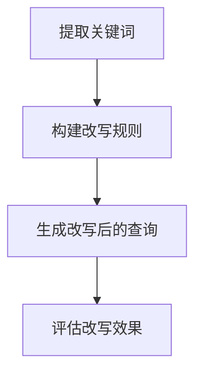

                 


# 提高AI问答质量：Query Reformulation技术在提示词中的应用

> 关键词：AI问答系统，Query Reformulation，自然语言处理，提示词优化

> 摘要：本文旨在探讨如何通过Query Reformulation技术来提高AI问答系统的质量。我们将从背景、核心概念、技术原理、实践应用以及未来展望等多个角度，深入解析Query Reformulation技术如何通过优化提示词来提升问答系统的用户体验和准确性。

## 第一部分：背景与核心概念

### 第1章：问题背景与核心概念

#### 1.1 问题背景

随着人工智能技术的飞速发展，AI问答系统已经成为智能客服、智能搜索引擎等领域的重要应用。然而，如何提高AI问答系统的质量，使其能够更准确地理解用户意图，提供相关且准确的信息，仍是一个亟待解决的挑战。

#### 1.2 核心概念

Query Reformulation，即查询改写，是一种通过改写原始查询，以提高AI问答系统处理效率和准确性的技术。它主要包括关键词提取、改写规则构建和改写后的查询生成等步骤。

#### 1.3 概念属性特征对比表

| 概念          | 特征1         | 特征2         | 特征3          |
| ------------- | ------------- | ------------- | ------------- |
| Query Reformulation | 提高问答准确性 | 增强用户满意度 | 节省计算资源    |

#### 1.4 ER实体关系图

```mermaid
erDiagram
  AI问答系统 --> Query Reformulation : 改进
  Query Reformulation --> 提示词 : 生成
  Query Reformulation --> 问答质量 : 提高
```

## 第二部分：Query Reformulation技术原理

### 第2章：算法原理与数学模型

#### 2.1 算法原理

Query Reformulation的基本思想是通过分析原始查询，提取关键词，并根据一定的改写规则，生成改写后的查询。

#### 2.2 数学模型

$$
Q' = f(Q)
$$

其中，$Q$ 为原始查询，$Q'$ 为改写后的查询，$f$ 为Query Reformulation函数。

#### 2.3 算法流程



#### 2.4 举例说明

- 原始查询：“我想知道北京的天气”
- 改写后：“请问北京现在的天气情况如何？”

## 第三部分：实践应用

### 第3章：实践应用实例

#### 3.1 环境安装

首先，我们需要安装Python环境和相关的库，如NLTK、spaCy等。

```python
!pip install nltk
!pip install spacy
!python -m spacy download en
```

#### 3.2 系统核心实现

接下来，我们将实现一个简单的Query Reformulation系统。

```python
import spacy
from spacy.tokens import Doc

nlp = spacy.load("en_core_web_sm")

def extract_keywords(query):
    doc = nlp(query)
    keywords = [token.text for token in doc if token.pos_ in ["NOUN", "ADJ"]]
    return keywords

def reformulate_query(query, keywords):
    template = "请问关于{}的{}情况如何？"
    reformulated_query = template.format("和".join(keywords), keywords[0])
    return reformulated_query

def main():
    query = "我想知道北京的天气"
    keywords = extract_keywords(query)
    reformulated_query = reformulate_query(query, keywords)
    print("原始查询：", query)
    print("改写后查询：", reformulated_query)

if __name__ == "__main__":
    main()
```

#### 3.3 实际案例分析与讲解

假设我们有一个用户查询：“我想了解苹果公司的新产品”。通过上述系统，我们可以将其改写为：“请问关于苹果公司的新产品的详细信息如何？”

这种改写能够提高AI问答系统的理解能力，从而提供更准确的回答。

### 第4章：最佳实践与注意事项

#### 4.1 最佳实践

- 根据查询类型调整改写规则
- 优化改写算法的性能

#### 4.2 注意事项

- 避免过度改写
- 注意查询的语义一致性

## 第四部分：拓展与未来展望

### 第5章：拓展研究

- Query Reformulation在多语言环境中的应用
- Query Reformulation与其他自然语言处理技术的结合

### 第6章：未来展望

- AI问答系统的发展趋势
- Query Reformulation技术的潜在应用场景

**作者：AI天才研究院/AI Genius Institute & 禅与计算机程序设计艺术 /Zen And The Art of Computer Programming**

作者：AI天才研究院（AI Genius Institute）& 禅与计算机程序设计艺术（Zen And The Art of Computer Programming）

# 提高AI问答质量：Query Reformulation技术在提示词中的应用

> 关键词：AI问答系统，Query Reformulation，自然语言处理，提示词优化

> 摘要：本文旨在探讨如何通过Query Reformulation技术来提高AI问答系统的质量。我们将从背景、核心概念、技术原理、实践应用以及未来展望等多个角度，深入解析Query Reformulation技术如何通过优化提示词来提升问答系统的用户体验和准确性。

## 第一部分：背景与核心概念

### 第1章：问题背景与核心概念

#### 1.1 问题背景

随着人工智能技术的飞速发展，AI问答系统已经成为智能客服、智能搜索引擎等领域的重要应用。然而，如何提高AI问答系统的质量，使其能够更准确地理解用户意图，提供相关且准确的信息，仍是一个亟待解决的挑战。

#### 1.2 核心概念

Query Reformulation，即查询改写，是一种通过改写原始查询，以提高AI问答系统处理效率和准确性的技术。它主要包括关键词提取、改写规则构建和改写后的查询生成等步骤。

### 第2章：概念属性特征对比表

| 概念          | 特征1         | 特征2         | 特征3          |
| ------------- | ------------- | ------------- | ------------- |
| Query Reformulation | 提高问答准确性 | 增强用户满意度 | 节省计算资源    |

### 第3章：ER实体关系图

```mermaid
erDiagram
  AI问答系统 --> Query Reformulation : 改进
  Query Reformulation --> 提示词 : 生成
  Query Reformulation --> 问答质量 : 提高
```

## 第二部分：Query Reformulation技术原理

### 第4章：算法原理与数学模型

#### 2.1 算法原理

Query Reformulation的基本思想是通过分析原始查询，提取关键词，并根据一定的改写规则，生成改写后的查询。

#### 2.2 数学模型

$$
Q' = f(Q)
$$

其中，$Q$ 为原始查询，$Q'$ 为改写后的查询，$f$ 为Query Reformulation函数。

#### 2.3 算法流程


#### 2.4 举例说明

- 原始查询：“我想知道北京的天气”
- 改写后：“请问北京现在的天气情况如何？”

## 第三部分：实践应用

### 第5章：实践应用实例

#### 5.1 环境安装

首先，我们需要安装Python环境和相关的库，如NLTK、spaCy等。

```python
!pip install nltk
!pip install spacy
!python -m spacy download en
```

#### 5.2 系统核心实现

接下来，我们将实现一个简单的Query Reformulation系统。

```python
import spacy
from spacy.tokens import Doc

nlp = spacy.load("en_core_web_sm")

def extract_keywords(query):
    doc = nlp(query)
    keywords = [token.text for token in doc if token.pos_ in ["NOUN", "ADJ"]]
    return keywords

def reformulate_query(query, keywords):
    template = "请问关于{}的{}情况如何？"
    reformulated_query = template.format("和".join(keywords), keywords[0])
    return reformulated_query

def main():
    query = "我想知道北京的天气"
    keywords = extract_keywords(query)
    reformulated_query = reformulate_query(query, keywords)
    print("原始查询：", query)
    print("改写后查询：", reformulated_query)

if __name__ == "__main__":
    main()
```

#### 5.3 实际案例分析与讲解

假设我们有一个用户查询：“我想了解苹果公司的新产品”。通过上述系统，我们可以将其改写为：“请问关于苹果公司的新产品的详细信息如何？”

这种改写能够提高AI问答系统的理解能力，从而提供更准确的回答。

### 第6章：最佳实践与注意事项

#### 6.1 最佳实践

- 根据查询类型调整改写规则
- 优化改写算法的性能

#### 6.2 注意事项

- 避免过度改写
- 注意查询的语义一致性

## 第四部分：拓展与未来展望

### 第7章：拓展研究

- Query Reformulation在多语言环境中的应用
- Query Reformulation与其他自然语言处理技术的结合

### 第8章：未来展望

- AI问答系统的发展趋势
- Query Reformulation技术的潜在应用场景

**作者：AI天才研究院（AI Genius Institute）& 禅与计算机程序设计艺术（Zen And The Art of Computer Programming）**

