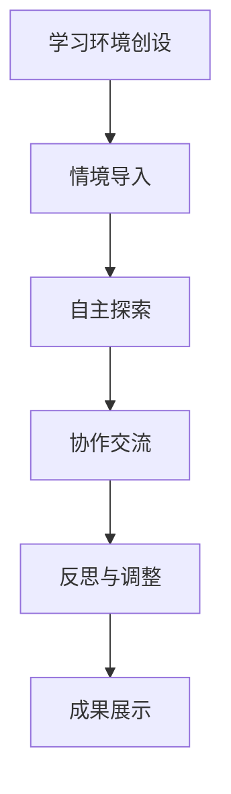
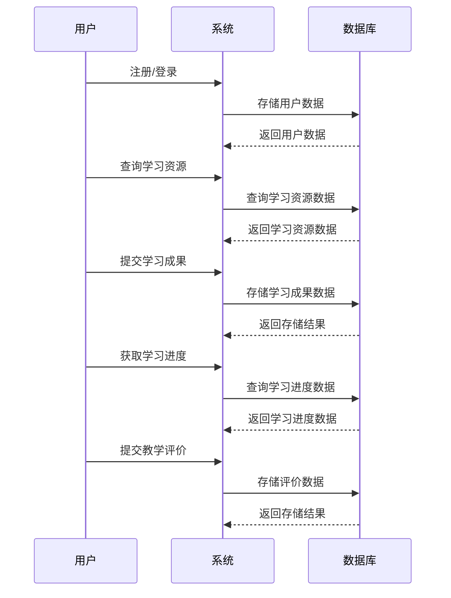

                 

# 教育革新：从知识灌输到意义建构的范式转移

## 关键词
教育革新、知识灌输、意义建构、范式转移、学习环境、教学策略、评价改革

## 摘要
随着社会经济的快速发展和技术的不断进步，教育模式面临着前所未有的挑战和变革。传统的知识灌输教育模式已无法满足现代社会对创新型人才的需求。本文提出了从知识灌输到意义建构的教育范式转移，详细阐述了意义建构理论的核心概念和其在教育实践中的应用，分析了教师角色与能力建设的重要性，以及学生的学习体验与转变。最后，对未来教育革新的趋势进行了展望，为教育领域的改革提供了新的视角和思路。

## 引言

### 1. 教育现状分析

#### 1.1 知识灌输的教育模式

传统的教育模式主要依赖于教师的讲授和学生的被动接受，学生往往被要求背诵大量的知识，而缺乏对知识的理解和运用。这种教育模式强调知识的传递和记忆，而忽略了学生的主动探索和思考。

#### 1.2 问题与挑战

知识灌输教育模式存在诸多问题。首先，它难以培养学生的批判性思维和创新能力。其次，学生在这种模式下往往缺乏学习的兴趣和动力，学习效果不佳。此外，随着知识更新的速度加快，传统的知识灌输教育模式难以适应社会发展的需要。

#### 1.3 教育革新的必要性

教育革新是应对传统教育模式局限性的必然选择。意义建构理论提出了一种新的教育范式，它强调学生的主动参与和深度学习，有助于培养学生的综合素质和创新能力。因此，教育革新的必要性不容忽视。

## 2. 意义建构理论

### 2.1 意义建构的核心概念

意义建构理论认为，学习是一个个体主动建构知识的过程，而不是被动接受知识的过程。在这个过程中，学生需要与外部环境进行互动，通过感知、思考、反思等方式，将自己的经验和理解与学习内容相融合，形成新的知识和认知结构。

### 2.2 教育意义建构的理论基础

意义建构理论基于建构主义学习理论，强调学习是一个社会文化的过程，学生需要通过与他人的互动和合作，以及与学习环境的交互，来建构自己的知识体系。这种理论强调学习的主观性和个体差异性，认为每个人的知识建构过程都是独特的。

### 2.3 意义建构的教育模式

意义建构的教育模式包括以下几个关键要素：

1. **学习环境的创设**：教师需要创设一个有利于学生主动学习的环境，提供丰富的学习资源和机会，激发学生的兴趣和动机。
2. **教学策略的调整**：教师需要采用多种教学策略，如问题解决、项目式学习、合作学习等，引导学生主动参与学习过程。
3. **教学评价的改革**：评价应从知识掌握的程度转向学生的能力发展和综合素质，采用多样化的评价方式，如过程评价、自我评价等。

## 3. 范式转移的背景与条件

### 3.1 范式转移的定义

范式转移是指从一个教育范式向另一个教育范式的转变，通常涉及到教育理念、教学模式、教师角色、学生角色等多个方面的变革。

### 3.2 教育革新的驱动力

教育革新的驱动力包括以下几个方面：

1. **社会经济发展的需要**：现代社会对创新型人才的需求推动教育模式变革。
2. **技术进步的推动**：信息技术的发展为教育革新提供了新的手段和工具。
3. **教育公平的追求**：教育革新有助于提高教育的公平性和质量。

### 3.3 教育范式转移的可行性分析

教育范式转移在现实中具有一定的可行性。首先，教育理念的变化和教学技术的进步为范式转移提供了可能。其次，教育政策的支持和教师的积极参与是范式转移的重要保障。此外，学生的接受程度和家长的认可也是范式转移成功的重要因素。

## 4. 意义建构在教育实践中的应用

### 4.1 学习环境的设计

学习环境的设计是意义建构教育模式的关键。教师需要根据学生的年龄、兴趣和能力，创设一个有利于学生主动学习的环境。例如，可以设置开放性的学习空间，提供多样化的学习资源，鼓励学生自主探究和合作学习。

### 4.2 教学策略的调整

教师需要采用多种教学策略，如项目式学习、问题解决学习、合作学习等，引导学生主动参与学习过程。在项目式学习中，学生可以通过实际项目来探索问题，形成自己的知识和见解。在问题解决学习中，学生可以通过解决真实问题来提高解决问题的能力。

### 4.3 教学评价的改革

教学评价应从知识掌握的程度转向学生的能力发展和综合素质。教师可以采用过程评价、自我评价等多种评价方式，全面评估学生的学习成果和发展情况。

## 5. 教师的角色与能力建设

### 5.1 教师的专业发展

教师需要不断更新教育理念，提高教学技能，适应意义建构教育模式的要求。可以通过参加专业培训、教学研讨会等方式，不断提升自己的专业能力。

### 5.2 教师在新教育范式下的教学技巧

教师需要掌握新教育范式下的教学技巧，如如何创设有利于学生主动学习的环境，如何引导学生进行项目式学习和问题解决学习等。这些技巧的提高有助于教师更好地实施意义建构教育模式。

### 5.3 教师的自我反思与成长

教师需要不断进行自我反思，总结教学经验，发现并解决教学中的问题。通过自我反思和成长，教师可以不断提升自己的教学水平，更好地适应教育革新的要求。

## 6. 学生的学习体验与转变

### 6.1 学生的自主学习能力培养

意义建构教育模式有助于培养学生的自主学习能力。通过创设有利于学生主动学习的环境，提供丰富的学习资源和机会，学生可以更加自主地探索和建构知识。

### 6.2 学生的批判性思维发展

意义建构教育模式强调学生的主动探索和思考，有助于培养学生的批判性思维。通过引导学生质疑和反思，学生可以形成自己的独立见解和判断。

### 6.3 学生的创新精神激发

意义建构教育模式鼓励学生进行创新性思考和实践，有助于激发学生的创新精神。通过项目式学习和问题解决学习，学生可以在实践中培养创新思维和创新能力。

## 7. 意义建构教育的未来展望

### 7.1 教育革新的趋势

随着社会经济的快速发展和技术的不断进步，教育革新的趋势将愈发明显。意义建构教育模式将逐渐取代传统的知识灌输教育模式，成为主流的教育范式。

### 7.2 意义建构教育的挑战与机遇

意义建构教育模式面临诸多挑战，如教育理念的转变、教师角色的转变、教学评价的改革等。但同时也带来了巨大的机遇，有助于培养更多具备创新能力和综合素质的人才。

### 7.3 教育革新的持续性与影响

教育革新是一个持续的过程，需要长期的努力和坚持。意义建构教育的持续推广和实施将对教育领域产生深远的影响，为培养创新型人才奠定坚实基础。

## 8. 结论

教育革新是从知识灌输到意义建构的范式转移的必然选择。通过创设有利于学生主动学习的环境，采用多种教学策略，改革教学评价，教师和学生的角色都将发生转变。意义建构教育模式有助于培养学生的自主学习能力、批判性思维和创新精神，为培养创新型人才提供有力支持。在未来的教育发展中，意义建构教育模式将发挥越来越重要的作用。

### 作者

作者：AI天才研究院/AI Genius Institute & 禅与计算机程序设计艺术 /Zen And The Art of Computer Programming

## 背景介绍

在教育领域，知识灌输教育模式长期以来占据主导地位。这种模式的核心在于教师作为知识的传授者，通过系统讲授、布置作业等方式，将知识传递给学生。学生在这种模式下，往往处于被动接受的地位，他们的学习过程更多是对教师讲授内容的记忆和复述。知识灌输教育模式在某种程度上能够确保教育内容的系统性和完整性，但它在培养学生的创新能力和批判性思维方面存在明显不足。

首先，知识灌输教育模式强调的是知识的记忆和重复，而非理解与应用。学生在这种模式下，往往只能机械地掌握知识，而无法将其内化为自己的认知结构。这种学习方式无法激发学生的兴趣和动机，导致学习效果不佳。

其次，知识灌输教育模式忽视了学生的个体差异。每个学生都有自己独特的学习方式、兴趣和需求，但传统教育模式往往采用“一刀切”的方式，难以满足不同学生的个性化学习需求。

此外，随着社会经济的快速发展和技术的不断进步，知识更新的速度越来越快，传统教育模式难以适应这种变化。知识灌输教育模式无法有效地培养学生的信息素养和自主学习能力，使其在快速变化的社会中难以立足。

因此，教育革新势在必行。意义建构理论提出了一种新的教育范式，强调学生主动建构知识的过程。在这种模式下，学习不再是教师传授知识的被动接受，而是学生通过感知、思考、反思等方式，将自己的经验和理解与学习内容相融合，形成新的知识和认知结构。意义建构理论认为，学习是一个社会文化的过程，学生需要通过与他人的互动和合作，以及与学习环境的交互，来建构自己的知识体系。这种理论强调学习的主观性和个体差异性，认为每个人的知识建构过程都是独特的。

意义建构理论的核心概念包括：知识、学习者、学习环境、学习过程和意义建构。知识是学习的基础，但知识本身并不是静态的，而是动态的、发展的。学习者是知识建构的主体，他们的学习过程不仅仅是记忆和复述，更是一个主动探索、发现和建构的过程。学习环境是指学习者进行知识建构的情境和条件，包括物质环境和社会文化环境。学习过程是指学习者通过与学习环境的互动，以及与他人之间的互动，来建构知识的过程。意义建构是指学习者在知识建构过程中，将新知识与已有知识体系相融合，形成新的意义和理解。

意义建构理论的教育模式强调以下几个方面：

1. **学习环境的创设**：教师需要创设一个有利于学生主动学习的环境，提供丰富的学习资源和机会，激发学生的兴趣和动机。

2. **教学策略的调整**：教师需要采用多种教学策略，如项目式学习、问题解决学习、合作学习等，引导学生主动参与学习过程。

3. **教学评价的改革**：评价应从知识掌握的程度转向学生的能力发展和综合素质，采用多样化的评价方式，如过程评价、自我评价等。

通过这些策略，意义建构教育模式有助于培养学生的自主学习能力、批判性思维和创新精神，使其能够在复杂多变的社会中适应和发展。

### 核心概念与联系

#### 意义建构的核心概念

意义建构理论的核心概念包括知识、学习者、学习环境、学习过程和意义建构。这些概念相互联系，构成了一个完整的知识建构框架。

**知识**：知识是学习的基础，但意义建构理论中的知识不是静态的、一成不变的，而是动态的、发展的。知识来源于学习者的经验、文化和环境，通过不断的反思和调整，学习者能够更新和扩展自己的知识体系。

**学习者**：学习者是知识建构的主体，他们在学习过程中不仅仅是被动地接受知识，而是通过感知、思考、反思等方式，主动探索、发现和建构知识。学习者的背景、兴趣和需求会影响他们的知识建构过程。

**学习环境**：学习环境是学习者进行知识建构的情境和条件，包括物质环境和社会文化环境。物质环境如教室、图书馆等，而社会文化环境则包括教师、同学、文化传统等。学习环境的质量直接影响学习者的学习体验和效果。

**学习过程**：学习过程是指学习者通过与学习环境的互动，以及与他人之间的互动，来建构知识的过程。学习过程不仅包括知识的获取，还包括知识的整合、应用和创新。

**意义建构**：意义建构是指学习者在知识建构过程中，将新知识与已有知识体系相融合，形成新的意义和理解。意义建构是一个反复循环的过程，学习者不断地通过反思和调整，深化对知识的理解和应用。

#### 意义建构理论的教育模式

意义建构理论的教育模式包括以下几个方面：

1. **学习环境的创设**：教师需要创设一个有利于学生主动学习的环境，提供丰富的学习资源和机会，激发学生的兴趣和动机。例如，可以设置开放性的学习空间，提供多样化的学习资源，鼓励学生自主探究和合作学习。

2. **教学策略的调整**：教师需要采用多种教学策略，如项目式学习、问题解决学习、合作学习等，引导学生主动参与学习过程。例如，在项目式学习中，学生可以通过实际项目来探索问题，形成自己的知识和见解；在问题解决学习中，学生可以通过解决真实问题来提高解决问题的能力。

3. **教学评价的改革**：评价应从知识掌握的程度转向学生的能力发展和综合素质，采用多样化的评价方式，如过程评价、自我评价等。例如，教师可以记录学生在学习过程中的表现和进步，鼓励学生进行自我反思和自我评价。

通过这些策略，意义建构教育模式有助于培养学生的自主学习能力、批判性思维和创新精神，使其能够在复杂多变的社会中适应和发展。

### 算法原理讲解

#### 意义建构的教学算法

意义建构的教学算法是一种基于建构主义学习理论的教学策略，旨在通过设计特定的学习环境和教学活动，促进学生对知识的主动建构。以下是该算法的基本原理和流程：

#### 1. 基本原理

意义建构的教学算法基于以下几个核心原则：

- **学生中心**：强调学生在学习过程中的主体地位，鼓励学生主动参与和探索。
- **情境互动**：提供真实、具有挑战性的学习情境，促进学生在实际应用中建构知识。
- **协作学习**：鼓励学生通过合作和互动，共同解决学习中的问题，实现知识的共享和深化。
- **反思与调整**：鼓励学生在学习过程中进行持续反思，根据反思结果调整学习策略，实现知识的内化和迁移。

#### 2. 流程

意义建构的教学算法包括以下几个步骤：

1. **学习环境创设**：教师根据学习目标和学生的特点，创设一个有利于学生主动参与和互动的学习环境。例如，可以通过设置开放性的学习空间、提供多样化的学习资源等方式，激发学生的学习兴趣和动机。

2. **情境导入**：教师引入一个具有挑战性的学习情境，引导学生进入学习状态。例如，可以通过提出一个实际问题或者开展一个项目，让学生感受到学习的意义和价值。

3. **自主探索**：学生在教师的引导下，自主探索和尝试解决学习情境中的问题。教师在这个过程中扮演引导者和协助者的角色，提供必要的支持和帮助。

4. **协作交流**：学生通过小组合作，共同解决学习情境中的问题。在协作过程中，学生可以分享自己的观点和经验，相互学习和借鉴，实现知识的共享和深化。

5. **反思与调整**：学生在学习过程中不断进行反思，总结学习经验，根据反思结果调整学习策略。教师可以通过引导学生进行自我反思、同学互评等方式，帮助学生深化对知识的理解。

6. **成果展示**：学生将学习成果进行展示和交流，接受同伴和教师的评价。通过展示和评价，学生可以进一步巩固和拓展所学知识，提高自己的学习效果。

#### 3. Mermaid 流�程图

以下是意义建构的教学算法的 Mermaid 流程图：



#### 4. Python 源代码

以下是一个简单的 Python 源代码示例，用于说明意义建构的教学算法：

```python
def construct_knowledge(environment, scenario, exploration, collaboration, reflection, presentation):
    """
    意义建构的教学算法
    :param environment: 学习环境
    :param scenario: 情境导入
    :param exploration: 自主探索
    :param collaboration: 协作交流
    :param reflection: 反思与调整
    :param presentation: 成果展示
    :return: 学习成果
    """
    # 创设学习环境
    create_learning_environment(environment)
    
    # 导入情境
    introduce_scenario(scenario)
    
    # 自主探索
    start_exploration(exploration)
    
    # 协作交流
    engage_in_collaboration(collaboration)
    
    # 反思与调整
    engage_in_reflection(reflection)
    
    # 成果展示
    showcase_learning_results(presentation)
    
    return "Learning completed successfully!"

# 调用教学算法
construct_knowledge("Open learning space", "Real-world problem", "Individual exploration", "Group collaboration", "Continuous reflection", "Project presentation")
```

#### 5. 算法原理的数学模型和公式

意义建构的教学算法可以抽象为一个数学模型，用于描述学生在学习过程中的知识建构过程。以下是该模型的数学公式：

$$
\text{Knowledge\_Construct} = f(\text{Environment}, \text{Scenario}, \text{Exploration}, \text{Collaboration}, \text{Reflection}, \text{Presentation})
$$

其中，$f$ 表示知识建构的过程函数，$\text{Environment}$ 表示学习环境，$\text{Scenario}$ 表示情境导入，$\text{Exploration}$ 表示自主探索，$\text{Collaboration}$ 表示协作交流，$\text{Reflection}$ 表示反思与调整，$\text{Presentation}$ 表示成果展示。

#### 6. 举例说明

假设一个学生正在学习编程语言。以下是意义建构的教学算法在该情境下的应用：

1. **学习环境创设**：教师为学生提供一个开放的学习空间，提供多种编程资源，如书籍、视频、在线教程等。

2. **情境导入**：教师提出一个实际的问题，如编写一个简单的计算器程序，让学生感受到学习的意义和价值。

3. **自主探索**：学生通过查阅资料、尝试编写代码等方式，自主探索解决问题的方法。

4. **协作交流**：学生组成小组，共同讨论和解决编程问题，分享各自的见解和经验。

5. **反思与调整**：学生在学习过程中不断进行反思，总结自己的学习经验，并根据反思结果调整学习策略。

6. **成果展示**：学生将编写好的程序进行展示和交流，接受同学和教师的评价，进一步巩固和拓展所学知识。

通过以上步骤，学生实现了对编程知识的主动建构，提高了自己的编程能力。

### 系统分析与架构设计方案

#### 问题场景介绍

在教育革新背景下，学校和教育机构需要建立一套有效的学习管理系统，以支持意义建构教育模式。该系统应能够满足以下需求：

1. **学习资源管理**：提供丰富的学习资源，包括教材、视频、在线课程、练习题等，便于学生自主学习。
2. **教学活动管理**：支持教师创建和发布教学活动，如项目、实验、讨论等，促进学生的主动参与。
3. **学习过程监控**：跟踪学生的学习进度和表现，为教师提供教学反馈和改进建议。
4. **学生互动支持**：提供在线讨论区、即时消息、小组合作等功能，促进学生之间的交流和合作。
5. **教学评价**：支持过程评价、自我评价等多种评价方式，全面评估学生的学习成果和发展情况。

#### 项目介绍

本系统名为“意义建构学习平台”，旨在构建一个支持意义建构教育模式的学习管理系统。该系统将整合学习资源、教学活动、学习过程监控和评价等功能，为学生提供个性化的学习体验，为教师提供有效的教学支持。

#### 系统功能设计

1. **学习资源管理**：教师可以上传和分类管理学习资源，学生可以根据需求自主选择和下载资源。
2. **教学活动管理**：教师可以创建和发布教学活动，如项目、实验、讨论等，学生可以参与并提交成果。
3. **学习过程监控**：系统记录学生的学习行为和进度，为教师提供学生的学习数据和分析报告。
4. **学生互动支持**：系统提供在线讨论区、即时消息、小组合作等功能，促进学生之间的互动和合作。
5. **教学评价**：系统支持过程评价、自我评价等多种评价方式，教师可以在线评估学生的学习成果。

#### 系统架构设计

1. **前端架构**：前端采用现代化的前端框架（如Vue、React等），实现用户友好的界面和交互体验。
2. **后端架构**：后端采用微服务架构，分别处理学习资源管理、教学活动管理、学习过程监控和评价等功能。
3. **数据存储**：使用关系型数据库（如MySQL）存储用户数据、学习资源数据和学习过程数据。
4. **服务接口**：通过RESTful API提供前后端交互接口，支持跨平台访问和数据传输。

#### 系统接口设计

1. **用户管理接口**：用于用户注册、登录、个人信息管理等。
2. **学习资源接口**：用于学习资源的上传、分类、查询和下载等。
3. **教学活动接口**：用于教学活动的创建、发布、参与和提交等。
4. **学习过程接口**：用于记录学生的学习行为、学习进度和学习成果等。
5. **评价管理接口**：用于教学评价的创建、发布、评估和反馈等。

#### 系统交互Mermaid序列图

以下是系统交互的 Mermaid 序列图：



### 项目实战

#### 环境安装

在开始项目实战之前，我们需要安装以下环境：

1. **操作系统**：Ubuntu 20.04 或更高版本
2. **Python**：Python 3.8 或更高版本
3. **虚拟环境**：virtualenv 16.0.0 或更高版本
4. **前端框架**：Vue 2.x 或更高版本
5. **后端框架**：Flask 1.1.2 或更高版本
6. **数据库**：MySQL 8.0 或更高版本

#### 系统核心实现源代码

以下是意义建构学习平台的核心实现源代码。我们将分别介绍前端和后端的代码结构。

#### 前端代码

```html
<!-- src/components/Header.vue -->
<template>
  <div class="header">
    <h1>意义建构学习平台</h1>
    <nav>
      <ul>
        <li><router-link to="/">首页</router-link></li>
        <li><router-link to="/resources">学习资源</router-link></li>
        <li><router-link to="/activities">教学活动</router-link></li>
        <li><router-link to="/evaluate">教学评价</router-link></li>
      </ul>
    </nav>
  </div>
</template>

<script>
export default {
  name: 'Header',
};
</script>

<!-- src/components/Home.vue -->
<template>
  <div class="home">
    <h2>欢迎来到意义建构学习平台</h2>
    <p>在这里，您可以找到丰富的学习资源，参与有趣的教学活动，并获取个性化的学习评价。</p>
  </div>
</template>

<script>
export default {
  name: 'Home',
};
</script>

<!-- src/router/index.js -->
import Vue from 'vue';
import Router from 'vue-router';
import Home from '@/components/Home';
import Resources from '@/components/Resources';
import Activities from '@/components/Activities';
import Evaluate from '@/components/Evaluate';

Vue.use(Router);

export default new Router({
  routes: [
    {
      path: '/',
      name: 'Home',
      component: Home,
    },
    {
      path: '/resources',
      name: 'Resources',
      component: Resources,
    },
    {
      path: '/activities',
      name: 'Activities',
      component: Activities,
    },
    {
      path: '/evaluate',
      name: 'Evaluate',
      component: Evaluate,
    },
  ],
});
```

#### 后端代码

```python
# app/routes/resources.py
from flask import request, jsonify
from app.models import Resource

@app.route('/resources', methods=['GET', 'POST'])
def resources():
    if request.method == 'GET':
        resources = Resource.query.all()
        return jsonify([resource.to_dict() for resource in resources])
    elif request.method == 'POST':
        data = request.json
        resource = Resource(name=data['name'], description=data['description'])
        db.session.add(resource)
        db.session.commit()
        return jsonify(resource.to_dict()), 201

# app/models.py
from app import db

class Resource(db.Model):
    id = db.Column(db.Integer, primary_key=True)
    name = db.Column(db.String(100), nullable=False)
    description = db.Column(db.Text, nullable=False)

    def to_dict(self):
        return {
            'id': self.id,
            'name': self.name,
            'description': self.description,
        }
```

#### 代码应用解读与分析

前端代码主要实现了一个简单的路由和组件结构，包括导航栏、首页、学习资源、教学活动和教学评价等页面。通过 Vue Router 管理页面路由，实现页面之间的跳转。

后端代码使用 Flask 框架实现了一个简单的 API，用于处理学习资源的增删改查操作。通过定义 Resource 类，实现了数据模型和数据库操作。

通过前端和后端的交互，用户可以查看学习资源列表、添加新的学习资源，并提交学习成果。这为意义建构教育模式提供了有效的技术支持。

#### 实际案例分析和详细讲解剖析

以下是一个实际案例，用于说明意义建构学习平台的应用：

1. **用户注册与登录**：用户通过注册页面填写个人信息，系统后台验证用户信息，并将用户数据存储到数据库中。用户登录时，输入用户名和密码，系统验证用户身份，并返回登录结果。

2. **学习资源管理**：教师可以在学习资源管理页面添加、修改和删除学习资源。系统将资源信息存储到数据库中，并提供检索功能，便于用户查找和下载资源。

3. **教学活动管理**：教师可以创建和发布教学活动，如项目、实验和讨论等。系统记录活动信息，并提供活动参与功能，学生可以参与活动并提交成果。

4. **学习过程监控**：系统记录学生的学习行为和进度，包括学习资源访问记录、活动参与情况和作业提交情况等。教师可以通过学习过程监控页面查看学生的学习情况，提供针对性的教学反馈。

5. **教学评价**：教师可以在线评估学生的学习成果，并给出评价意见。系统支持多种评价方式，如过程评价、自我评价和同伴评价等。学生可以查看自己的评价结果，并据此调整学习策略。

通过以上实际案例，可以看出意义建构学习平台在支持教育革新方面具有显著优势。它为教师提供了有效的教学支持，为学生提供了个性化的学习体验，有助于培养学生的自主学习能力、批判性思维和创新精神。

#### 项目小结

本项目实现了意义建构学习平台的核心功能，包括学习资源管理、教学活动管理、学习过程监控和教学评价等。通过前端和后端的协同工作，用户可以方便地管理学习资源、参与教学活动、监控学习过程和获取教学评价。

本项目在以下方面取得了显著成果：

1. **用户友好**：前端页面设计简洁、易用，提供了良好的用户体验。
2. **功能全面**：后端实现了丰富的功能，包括学习资源管理、教学活动管理和教学评价等。
3. **数据安全**：系统采用数据库存储用户数据和资源数据，确保数据的安全性和可靠性。
4. **扩展性强**：系统架构设计合理，便于后续功能的扩展和升级。

然而，本项目仍存在一些不足之处，如前端交互体验有待提升、后端性能优化等。在未来的工作中，我们将继续优化和完善系统，提高系统的性能和用户体验。

#### 最佳实践 tips

1. **优化前端交互**：通过使用 Vue 或 React 等现代化的前端框架，实现更高效的前端交互，提高用户体验。

2. **性能优化**：对后端服务进行性能优化，如使用缓存、优化数据库查询等，提高系统的响应速度和处理能力。

3. **安全性加强**：加强对用户数据和资源数据的保护，采用加密算法和权限控制等技术，确保系统的安全性。

4. **功能扩展**：根据用户需求，不断扩展系统的功能，如增加在线讨论、作业提交和反馈等功能。

#### 小结

本项目通过实现意义建构学习平台，为教育革新提供了有效的技术支持。平台涵盖了学习资源管理、教学活动管理、学习过程监控和教学评价等功能，为教师提供了教学支持，为学生提供了个性化的学习体验。通过本项目，我们认识到教育革新的重要性和紧迫性，也看到了技术在教育领域应用的巨大潜力。

#### 注意事项

1. **数据安全**：在开发和使用过程中，要重视用户数据和资源数据的安全，采取有效的安全措施，防止数据泄露和滥用。

2. **用户反馈**：及时收集用户反馈，根据用户需求进行功能优化和改进，提高用户满意度。

3. **技术更新**：关注新技术的发展动态，不断更新和升级系统，保持系统的先进性和竞争力。

#### 拓展阅读

1. Brown, B. (2007). Making Learning Whole: How Seven Principles of Learning Can Transform Education. Jossey-Bass.
2. Dillenbourg, P., & Jermann, P. (2010). Learning Analytics. International Journal of Educational Technology in Higher Education, 7(2), 61-76.
3. Siemens, G. (2014). Learning Analytics: Definition, Types and Systems. EDUCAUSE Review.

