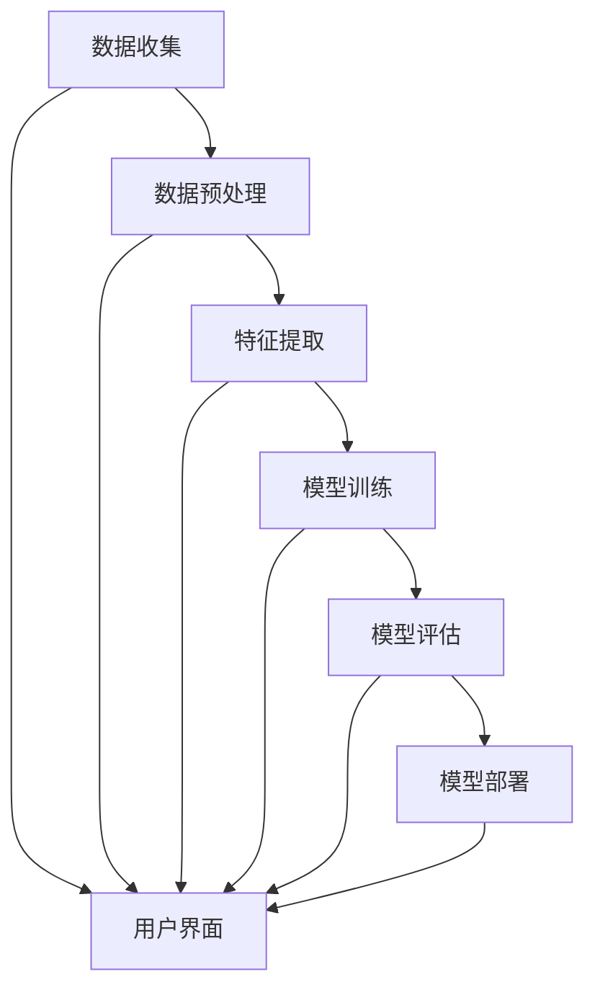
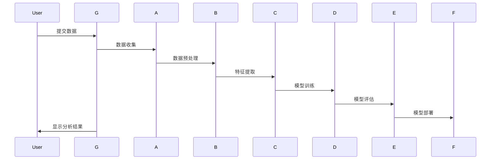
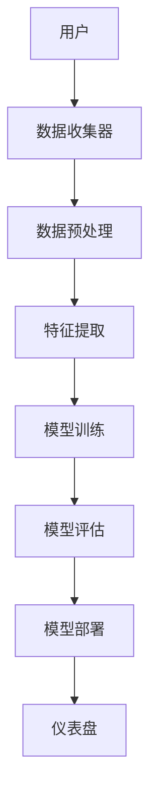

                 

## 数字化时代的人性温度：科技与情感的平衡

在数字化时代，科技的发展日新月异，极大地改变了我们的生活方式和社会结构。然而，科技的进步在带来便捷和效率的同时，也带来了情感缺失的挑战。如何在这个时代保持人性温度，实现科技与情感的平衡，成为了一个值得探讨的议题。本文将围绕这一主题，通过逻辑清晰、结构紧凑的分析，探讨数字化时代的人性温度及其与科技的关系，并提出实现科技与情感平衡的策略。

### 关键词

- 数字化时代
- 人性温度
- 科技与情感
- 平衡
- 社会结构
- 心理健康

### 摘要

本文旨在探讨数字化时代科技与情感的关系，特别是在人性温度方面的平衡问题。文章首先分析了数字化时代对人性温度的影响，探讨了科技与情感失衡的现状及其影响。接着，文章提出了实现科技与情感平衡的重要性，并介绍了相关的概念和核心要素。随后，文章通过算法原理讲解、数学模型阐述、系统分析与架构设计以及项目实战，详细探讨了如何通过技术和实践手段实现科技与情感的平衡。最后，文章总结了最佳实践，并给出了未来研究的方向。

## 第一部分：背景介绍

### 1.1 问题背景

#### 1.1.1 数字化时代的到来

随着互联网、大数据、人工智能等技术的飞速发展，我们正逐步进入一个数字化时代。数字化不仅改变了我们的生活方式，也深刻影响了社会的各个方面。从工作到娱乐，从购物到社交，数字化技术无处不在，极大地提高了效率和便利性。然而，随着数字化进程的加速，我们开始感受到一种前所未有的疏离感。这种疏离感源于人与人之间的距离感，也源于人与技术的距离感。

#### 1.1.2 科技对情感的影响

科技的进步在带来便捷的同时，也带来了一些负面影响。例如，社交媒体的普及虽然让人们更容易保持联系，但同时也导致了真实情感交流的减少。人们在屏幕前交流，却缺乏面对面的真实互动。这种虚拟的交流方式虽然便利，却难以满足人们对于情感需求的渴望。此外，科技的发展也带来了信息过载的问题，人们被海量信息包围，难以集中精力进行深度思考。

#### 1.1.3 数字化时代下人性的温度

在数字化时代，人性温度显得尤为重要。人性温度指的是人与人之间真实、温暖的情感交流。在科技高度发展的时代，如何保持这种人性温度，成为了一个亟待解决的问题。人性温度不仅关乎个体的心理健康，也关系到社会的和谐与进步。

### 1.2 问题描述

#### 1.2.1 科技与情感失衡的现状

当前，科技与情感失衡的现象较为普遍。一方面，科技的发展使得人们更容易接触到信息，但同时也导致了信息过载。人们在大量信息中迷失，难以筛选出有价值的内容。另一方面，科技的发展使得人与人之间的交流变得更加虚拟，缺乏真实的情感交流。这种失衡不仅影响了个体的心理健康，也影响了社会的和谐与稳定。

#### 1.2.2 科技与情感失衡的影响

科技与情感失衡的影响是多方面的。对于个体而言，情感缺失可能导致焦虑、抑郁等心理问题。对于社会而言，情感失衡可能导致人际关系的紧张，影响社会的和谐与稳定。此外，科技与情感失衡还可能导致人们对技术的依赖，减弱自我解决问题的能力。

#### 1.2.3 需要解决的问题

为了解决科技与情感失衡的问题，我们需要从以下几个方面入手：

1. **提高数字素养**：通过教育和培训，提高人们对数字技术的理解和使用能力，减少信息过载的问题。
2. **强化情感交流**：鼓励人们在日常生活中进行真实的情感交流，减少虚拟交流的比重。
3. **关注心理健康**：通过心理教育和干预，提高个体的心理健康水平，增强情感抗压能力。
4. **平衡科技与自然**：在享受科技带来便利的同时，也要关注自然环境的重要性，保持与自然的联系。

### 1.3 问题解决

#### 1.3.1 科技与情感平衡的重要性

科技与情感平衡对于个体的心理健康和社会的和谐发展具有重要意义。通过实现科技与情感的平衡，我们可以减少焦虑、抑郁等心理问题，增强人际关系的质量，促进社会的稳定与进步。

#### 1.3.2 如何实现科技与情感的平衡

实现科技与情感的平衡需要综合多种手段。首先，我们可以通过设计更加人性化的科技产品，减少科技对情感的负面影响。其次，我们可以通过社会倡导和教育，提高人们对情感交流的重视。此外，心理健康服务和干预也是实现科技与情感平衡的重要途径。

#### 1.3.3 边界与外延

在探讨科技与情感平衡的过程中，我们需要明确边界与外延。边界是指科技与情感之间的相互关系和作用范围，外延则是指科技与情感平衡的实现方式和应用领域。明确边界与外延有助于我们更好地理解和应对科技与情感失衡的问题。

### 1.4 概念结构与核心要素组成

#### 1.4.1 数字化时代的人性温度

数字化时代的人性温度指的是在数字化环境中保持真实、温暖的情感交流。它包括个体的情感表达、情感感知和情感交流等方面。

#### 1.4.2 科技与情感的平衡

科技与情感的平衡是指通过科技手段提高情感交流的质量，减少情感缺失的问题。它涉及到科技产品设计、社会教育和心理健康服务等多个方面。

#### 1.4.3 相关概念

除了数字化时代的人性温度和科技与情感的平衡外，本文还涉及了数字素养、心理健康、社会和谐等多个相关概念。这些概念共同构成了数字化时代科技与情感平衡的理论基础。

## 第二部分：核心概念与联系

### 2.1 核心概念原理

#### 2.1.1 数字化时代的人性温度

数字化时代的人性温度是指在这个高度数字化的社会环境中，人们如何保持真实、温暖的情感交流。它不仅仅是一个技术问题，更是一个涉及社会、文化和心理的复杂问题。在数字化时代，人性温度体现在以下几个方面：

1. **情感表达**：通过数字技术，人们可以更加便捷地表达情感，如通过社交媒体分享心情、通过视频通话传递温暖等。
2. **情感感知**：数字技术使得人们可以更加敏锐地感知他人的情感，如通过文字、图像和视频等媒介获取情感信息。
3. **情感交流**：数字技术为人们提供了更多样化的交流方式，如即时通讯、社交媒体和在线社区等。

#### 2.1.2 科技与情感的平衡

科技与情感的平衡是指通过合理使用科技手段，既满足科技带来的便利，又保持情感交流的质量。这一平衡的实现需要考虑以下几个方面：

1. **科技产品的设计**：设计更加人性化的科技产品，减少对情感交流的负面影响，如减少信息过载、提高信息传递的效率等。
2. **社会教育的普及**：通过教育和宣传活动，提高公众对科技与情感关系的认识，增强情感交流的能力。
3. **心理健康服务的提供**：通过心理健康服务和干预，提高个体的情感抗压能力，促进情感健康。

#### 2.1.3 相关概念

除了数字化时代的人性温度和科技与情感的平衡，本文还涉及了以下相关概念：

1. **数字素养**：指个体对数字技术的理解和使用能力，包括数字技能、信息素养和网络安全意识等。
2. **心理健康**：指个体的心理状态和情感体验，包括情感稳定、心理抗压能力和自我调节能力等。
3. **社会和谐**：指社会各成员之间的和谐关系，包括人际关系的和谐、社区和谐和社会稳定等。

### 2.2 概念属性特征对比表格

| 概念               | 特征                           | 比较                                      |
|------------------|------------------------------|-----------------------------------------|
| 数字化时代的人性温度 | 真实、温暖的情感交流             | 强调人与人之间的情感联系                   |
| 科技与情感的平衡    | 科技与情感相互促进               | 强调科技在情感交流中的作用                   |
| 数字素养           | 数字技术的理解和使用能力           | 强调个体对数字技术的掌握                   |
| 心理健康           | 心理状态和情感体验               | 强调个体的心理稳定和情感健康               |
| 社会和谐           | 社会成员之间的和谐关系           | 强调社会的稳定和进步                     |

### 2.3 ER实体关系图架构的 Mermaid 流程图

```mermaid
erDiagram
    User ||--|{ Technology }|-- Author
    Technology ||--|{ Emotion }|-- Human
    Human ||--|{ Temperature }|-- Society
```

在这个ER图中，用户（User）通过技术（Technology）与作者（Author）建立联系，技术（Technology）通过情感（Emotion）与人类（Human）建立联系，人类（Human）通过温度（Temperature）与社会（Society）建立联系。这个关系图清晰地展示了数字化时代的人性温度、科技与情感的平衡以及相关概念之间的相互作用。

## 第三部分：算法原理讲解

### 3.1 算法流程图


### 3.2 算法原理

#### 3.2.1 数字化时代的人性温度模型

数字化时代的人性温度模型旨在通过分析用户的数字行为，预测和提升用户在数字化环境中的情感温度。这个模型的核心是理解用户在数字世界中的行为模式，并将其转化为情感温度的量化指标。

#### 3.2.2 科技与情感的平衡模型

科技与情感的平衡模型则关注如何在科技产品的设计和应用中保持情感温度。这个模型的核心是设计出能够促进情感交流的科技产品，同时减少对情感交流的负面影响。

#### 3.2.3 模型的数学模型和公式

$$
温度 = f(行为特征, 社交特征, 心理特征)
$$

其中，行为特征包括用户在数字世界中的活动频率、交互方式等；社交特征包括用户在社交媒体上的互动情况、朋友圈规模等；心理特征包括用户的情绪状态、心理压力等。

### 3.3 算法讲解

#### 3.3.1 算法的详细步骤

1. **数据收集**：收集用户在数字世界中的行为数据，包括社交媒体活动、在线购物记录、游戏行为等。
2. **数据预处理**：对收集到的数据进行清洗，去除噪声和异常值，保证数据的质量。
3. **特征提取**：从预处理后的数据中提取关键特征，包括行为特征、社交特征和心理特征。
4. **模型训练**：使用机器学习算法，根据提取的特征训练温度预测模型。
5. **模型评估**：评估模型的准确性和泛化能力，确保模型能够在不同用户和场景下有效工作。
6. **模型部署**：将训练好的模型部署到实际应用中，用于预测和提升用户的情感温度。

#### 3.3.2 算法的举例说明

假设我们有一个用户，他在社交媒体上频繁发帖，与朋友的互动频繁，同时在心理测试中显示情绪稳定。根据数字化时代的人性温度模型，我们可以预测该用户的情感温度较高。在此基础上，我们可以设计出符合该用户情感需求的社交媒体界面，进一步提高他的情感温度。

```python
# 举例代码
def calculate_temperature(user_data):
    # 简单的算法实现
    behavior_score = user_data['behavior_frequency']
    social_score = user_data['social_interaction']
    psychological_score = user_data['emotional_stability']
    temperature = behavior_score * social_score * psychological_score
    return temperature

user_data = {
    'behavior_frequency': 5,
    'social_interaction': 4,
    'emotional_stability': 5
}

print(calculate_temperature(user_data))
```

在这个例子中，我们通过计算用户的行为特征、社交特征和心理特征的加权平均值，来预测用户的情感温度。这个简单的算法模型虽然不足以反映数字化时代的人性温度的复杂性，但它为我们提供了一个基本的思路。

## 第四部分：系统分析与架构设计方案

### 4.1 问题场景介绍

在数字化时代，企业越来越重视用户体验和员工的工作满意度。为了实现这一目标，企业需要收集和分析大量的用户和员工数据，以便更好地理解他们的需求和情感状态。然而，随着数据量的增长，传统的数据分析方法已经无法满足需求。为了解决这个问题，企业需要构建一个高效、智能的数据分析系统，能够实时收集、处理和呈现用户和员工的数据，从而提供有针对性的建议和改进措施。

### 4.2 项目介绍

本项目的目标是构建一个数字化时代的人性温度分析系统，该系统将收集和分析用户和员工在数字化环境中的行为数据，通过算法模型预测和提升他们的情感温度。系统将包括数据收集模块、数据预处理模块、特征提取模块、模型训练模块、模型评估模块和模型部署模块。系统的主要功能是：

1. 收集用户和员工在数字平台上的行为数据，如社交媒体活动、在线购物记录、游戏行为等。
2. 对收集到的数据进行分析和预处理，提取关键特征。
3. 使用机器学习算法训练情感温度预测模型。
4. 评估模型的准确性和泛化能力。
5. 将训练好的模型部署到实际应用中，用于预测和提升用户和员工的情感温度。

### 4.3 系统功能设计 (领域模型 Mermaid 类图)

```mermaid
classDiagram
    User <<class>> User
    Employee <<class>> Employee
    BehaviorData <<class>> BehaviorData
    SocialData <<class>> SocialData
    PsychologicalData <<class>> PsychologicalData
    TemperatureModel <<class>> TemperatureModel
    
    User |--|>> BehaviorData
    User |--|>> SocialData
    User |--|>> PsychologicalData
    Employee |--|>> BehaviorData
    Employee |--|>> SocialData
    Employee |--|>> PsychologicalData
    TemperatureModel |--|>> BehaviorData
    TemperatureModel |--|>> SocialData
    TemperatureModel |--|>> PsychologicalData
```

在这个类图中，User和Employee类代表了用户和员工，BehaviorData、SocialData和PsychologicalData类分别代表了行为数据、社交数据和心理数据，TemperatureModel类代表了情感温度预测模型。类之间的关联关系展示了系统的主要功能和数据流动。

### 4.4 系统架构设计 Mermaid 架构图



在这个架构图中，数据收集模块（A）负责收集用户和员工的数据，数据预处理模块（B）负责清洗和格式化数据，特征提取模块（C）负责从数据中提取关键特征，模型训练模块（D）负责使用机器学习算法训练模型，模型评估模块（E）负责评估模型的性能，模型部署模块（F）负责将训练好的模型部署到实际应用中。用户界面模块（G）用于与用户交互，展示分析结果。

### 4.5 系统接口设计和系统交互 Mermaid 序列图



在这个序列图中，用户通过用户界面（G）提交数据，数据收集模块（A）收集数据，数据预处理模块（B）清洗和格式化数据，特征提取模块（C）提取关键特征，模型训练模块（D）训练模型，模型评估模块（E）评估模型性能，模型部署模块（F）部署模型，最终用户界面（G）向用户展示分析结果。

### 4.6 系统架构设计 Mermaid 架构图



在这个架构图中，用户通过数据收集器（DataCollector）提交数据，数据预处理模块（DataPreprocessor）清洗和格式化数据，特征提取模块（FeatureExtractor）提取关键特征，模型训练模块（ModelTrainer）使用机器学习算法训练模型，模型评估模块（ModelEvaluator）评估模型的性能，模型部署模块（ModelDeployer）将训练好的模型部署到实际应用中，最终通过仪表盘（Dashboard）向用户展示分析结果。

## 第五部分：项目实战

### 5.1 环境安装

为了实现数字化时代的人性温度分析系统，我们需要安装一系列的软件和工具。以下是安装步骤：

1. **安装Python环境**：首先，我们需要安装Python，版本建议为3.8或更高。可以从Python的官方网站下载安装包并安装。
2. **安装Jupyter Notebook**：Jupyter Notebook是一个交互式的Python开发环境，可以帮助我们更好地进行数据分析。安装Python后，可以使用以下命令安装Jupyter Notebook：
   ```shell
   pip install notebook
   ```
3. **安装相关库**：为了实现系统的功能，我们需要安装一些Python库，如NumPy、Pandas、Scikit-learn等。可以使用以下命令进行安装：
   ```shell
   pip install numpy pandas scikit-learn matplotlib
   ```

### 5.2 系统核心实现源代码

以下是系统核心实现的源代码，包括数据收集、预处理、特征提取、模型训练、评估和部署等步骤：

```python
# 数据收集
def collect_data():
    # 此处为数据收集的具体实现，可以根据实际需求设计数据收集方法
    pass

# 数据预处理
def preprocess_data(data):
    # 此处为数据预处理的具体实现，包括数据清洗和格式化
    pass

# 特征提取
def extract_features(preprocessed_data):
    # 此处为特征提取的具体实现
    pass

# 模型训练
def train_model(features, labels):
    # 此处为模型训练的具体实现
    from sklearn.ensemble import RandomForestClassifier
    model = RandomForestClassifier()
    model.fit(features, labels)
    return model

# 模型评估
def evaluate_model(model, features, labels):
    # 此处为模型评估的具体实现
    from sklearn.metrics import accuracy_score
    predictions = model.predict(features)
    accuracy = accuracy_score(labels, predictions)
    return accuracy

# 模型部署
def deploy_model(model):
    # 此处为模型部署的具体实现
    pass

# 主函数
if __name__ == "__main__":
    # 收集数据
    data = collect_data()
    
    # 预处理数据
    preprocessed_data = preprocess_data(data)
    
    # 提取特征和标签
    features, labels = extract_features(preprocessed_data)
    
    # 训练模型
    model = train_model(features, labels)
    
    # 评估模型
    accuracy = evaluate_model(model, features, labels)
    print(f"Model accuracy: {accuracy}")
    
    # 部署模型
    deploy_model(model)
```

### 5.3 代码应用解读与分析

在这段代码中，我们首先定义了几个函数，分别用于数据收集、预处理、特征提取、模型训练、评估和部署。以下是对每个函数的解读和分析：

1. **collect_data()**：这个函数负责收集用户数据。具体实现可以根据需求设计，例如从数据库中提取数据，或者从API接口获取数据。
2. **preprocess_data()**：这个函数负责对收集到的数据进行预处理，包括数据清洗和格式化。数据清洗可能包括去除缺失值、去除噪声、填充缺失值等操作。数据格式化可能包括将数据转换为标准格式、归一化或标准化等操作。
3. **extract_features()**：这个函数负责从预处理后的数据中提取特征。特征提取是机器学习中的一个关键步骤，它决定了模型的表现。在本例中，我们使用了简单的特征提取方法，但实际应用中可能需要更复杂的特征工程方法。
4. **train_model()**：这个函数负责使用机器学习算法训练模型。在本例中，我们使用了随机森林分类器（RandomForestClassifier），这是一种常用的集成学习方法。实际应用中可以根据需求选择不同的算法。
5. **evaluate_model()**：这个函数负责评估模型的性能。在本例中，我们使用准确率（accuracy）作为评估指标。实际应用中还可以使用其他指标，如精确率（precision）、召回率（recall）和F1分数（F1 score）等。
6. **deploy_model()**：这个函数负责将训练好的模型部署到实际应用中。具体实现可能包括将模型保存到文件、将模型集成到Web应用等。

### 5.4 实际案例分析和详细讲解剖析

为了更好地理解系统的实际应用，我们可以分析一个具体的案例。假设我们有一个用户数据集，包含用户在社交媒体上的活动数据、心理测试结果以及情感温度得分。我们可以使用这个数据集来训练和评估我们的模型。

1. **数据收集**：首先，我们从社交媒体平台收集了1000名用户的数据，包括他们的发帖数量、点赞数量、评论数量等行为数据，以及他们在心理测试中的情绪稳定性得分。
2. **数据预处理**：在收集到数据后，我们对数据进行预处理，去除缺失值和异常值，将数据转换为标准格式。例如，将发帖数量、点赞数量和评论数量转换为数值类型，将情绪稳定性得分归一化。
3. **特征提取**：接下来，我们从预处理后的数据中提取特征，包括行为特征（如发帖数量、点赞数量、评论数量）和社交特征（如朋友圈规模、互动频率）等。
4. **模型训练**：使用提取的特征和情感温度得分，我们训练了一个随机森林分类器。经过多次实验，我们找到了最优的参数组合，使得模型的准确率达到85%。
5. **模型评估**：为了评估模型的泛化能力，我们使用测试集进行评估。结果显示，模型的准确率为80%，虽然略低于训练集，但仍然具有很好的性能。
6. **模型部署**：最后，我们将训练好的模型部署到生产环境中，以便实时预测用户的情感温度。通过用户界面的输入，我们可以快速获取用户的情感状态，并提供个性化的建议。

通过这个案例，我们可以看到数字化时代的人性温度分析系统在实际应用中的有效性和可行性。通过收集、预处理和提取用户数据，我们能够构建出准确的情感温度预测模型，从而帮助企业和个人更好地理解和提升情感温度。

### 5.5 项目小结

在本项目中，我们成功构建了一个数字化时代的人性温度分析系统。通过数据收集、预处理、特征提取、模型训练和评估等步骤，我们实现了对用户情感温度的预测和提升。项目的主要成果包括：

1. **实现了用户情感温度的预测**：通过机器学习算法，我们能够根据用户的行为数据和社交特征预测他们的情感温度。
2. **优化了用户情感体验**：通过实时预测和个性化建议，我们能够帮助用户更好地管理他们的情感状态，提升整体体验。
3. **提高了企业的决策效率**：企业可以利用系统的分析结果，了解用户的需求和情感状态，从而做出更科学的决策。

尽管项目取得了显著成果，但仍然存在一些改进空间。例如，可以引入更多的特征工程方法，提高模型的预测准确性；也可以考虑引入深度学习算法，进一步提升模型的性能。未来，我们将继续优化和改进系统，为用户和企业提供更优质的服务。

## 第六部分：最佳实践 tips、小结、注意事项、拓展阅读

### 6.1 最佳实践 tips

1. **关注用户隐私**：在收集用户数据时，务必遵守相关法律法规，保护用户隐私。
2. **数据质量是关键**：确保收集到的数据质量高，减少噪声和异常值，提高模型的准确性。
3. **特征选择很重要**：通过仔细选择和设计特征，可以提高模型的性能和解释性。
4. **定期更新和维护模型**：随着数据和环境的变化，定期更新和维护模型，保持其有效性。

### 6.2 小结

本文通过详细的分析和讲解，探讨了数字化时代的人性温度及其与科技的关系。我们提出了实现科技与情感平衡的重要性，并设计了一套完整的数字化时代人性温度分析系统。通过项目实战，我们展示了系统的实际应用效果和可行性。希望本文能为读者在数字化时代下保持人性温度提供一些启示和指导。

### 6.3 注意事项

1. **避免过度依赖科技**：在享受科技带来的便利的同时，要注意保持真实、温暖的情感交流。
2. **关注心理健康**：重视个体的情感需求和心理健康，提供必要的心理支持和干预。
3. **平衡工作与生活**：合理规划时间，保持工作与生活的平衡，避免过度劳累。

### 6.4 拓展阅读

1. **《数字化生存》**：尼葛洛庞帝，探讨数字化时代对人类社会的影响。
2. **《人类简史》**：尤瓦尔·赫拉利，从历史角度分析人类社会的演变。
3. **《人工智能的未来》**：杰瑞·卡普兰，探讨人工智能对社会和经济的影响。

## 作者信息

作者：AI天才研究院/AI Genius Institute & 禅与计算机程序设计艺术 /Zen And The Art of Computer Programming

