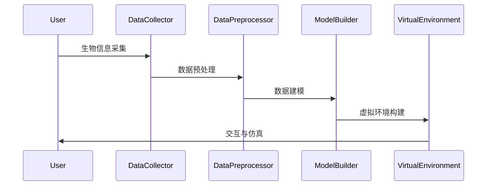

                 

### 背景介绍

#### 第1章: 虚拟现实与数字化生命的崛起

在科技迅速发展的当今时代，虚拟现实（Virtual Reality，简称VR）与数字化生命（Digital Life）的概念正逐步渗透到我们生活的方方面面。本章节旨在探讨这两大前沿技术的背景、概念、发展历程及其在虚拟现实中的重要性。

#### 1.1.1 问题背景

随着计算机技术和网络通信技术的飞速发展，人类对于现实世界的认知和体验方式正在发生根本性的变革。传统的二维互联网已经无法满足人们对更真实、沉浸式的体验需求。虚拟现实技术以其独特的沉浸感和互动性，为用户提供了前所未有的视觉和感知体验，成为科技领域的热门话题。与此同时，数字化生命作为人工智能技术的重要组成部分，正逐步改变人类的生活方式和社会结构。如何将虚拟现实与数字化生命有机结合，实现生命的数字化延续，成为当前技术发展的一个重要课题。

#### 1.1.2 数字化生命的概念

数字化生命，顾名思义，是指将人的生命过程、思维活动、情感体验等通过数字化技术进行模拟和再现。其核心思想是将人类的生物信息转化为数字信号，在虚拟空间中重建人类的生命活动。数字化生命的概念涵盖了多个领域，包括生物信息学、计算机科学、人工智能、虚拟现实等。通过数字化生命，人们可以在虚拟环境中实现身份转换、情感互动和记忆存储等功能，从而拓展生命的维度和可能性。

#### 1.1.3 虚拟现实技术的发展历程

虚拟现实技术起源于20世纪50年代的计算机科学和认知心理学研究。最初的研究主要集中在模拟人类感知和认知过程的计算机模型。随着计算机性能的提升和显示技术的发展，虚拟现实设备逐渐从实验室走向市场。20世纪90年代，虚拟现实技术开始应用于游戏、娱乐、教育培训等领域，逐渐引起了广泛关注。进入21世纪，随着互联网和移动设备的普及，虚拟现实技术进入了一个快速发展的阶段，市场规模不断扩张。近年来，增强现实（Augmented Reality，简称AR）和混合现实（Mixed Reality，简称MR）技术的兴起，进一步丰富了虚拟现实的应用场景。

#### 1.1.4 数字化生命在虚拟现实中的重要性

数字化生命在虚拟现实中的应用具有重要意义。首先，它为人类提供了一种全新的生存方式，使得人们可以在虚拟环境中实现身份转换和情感互动。其次，数字化生命技术有助于保护和传承人类的文化遗产，通过数字化方式保存和再现历史事件、艺术品和文化遗产。此外，数字化生命技术还可以在医疗、教育、娱乐等领域发挥重要作用，提高生产效率和生活质量。

#### 1.1.5 边界与外延

虚拟现实与数字化生命的边界并不明确，两者之间存在紧密的联系和交叉。虚拟现实技术为数字化生命提供了展示平台，而数字化生命则为虚拟现实注入了更多的情感和智慧。在实际应用中，虚拟现实与数字化生命的融合将不断拓展其应用领域，为人类社会带来更多创新和变革。

#### 1.1.6 概念结构与核心要素组成

虚拟现实与数字化生命的技术体系可以看作是一个复杂的概念结构，其核心要素包括：

1. **硬件设备**：如头戴式显示器、手柄控制器等，用于实现虚拟环境的沉浸感。
2. **软件系统**：包括虚拟现实平台、开发工具和应用软件，用于构建和运行虚拟环境。
3. **数据存储与传输**：通过云计算和大数据技术，实现虚拟环境中数据的存储、传输和处理。
4. **人工智能算法**：用于模拟和再现人类的思维、情感和行为。
5. **用户交互**：通过自然语言处理、手势识别等技术，实现用户与虚拟环境的互动。

这些核心要素相互关联，共同构成了虚拟现实与数字化生命的技术体系，为人类社会的发展带来了前所未有的机遇和挑战。

#### 总结

本章节对虚拟现实与数字化生命的背景、概念、发展历程及其重要性进行了详细阐述。在接下来的章节中，我们将深入探讨虚拟现实与数字化生命之间的核心概念与联系，进一步解析这两大前沿技术如何在虚拟现实中的生命延续中发挥重要作用。

---

### 虚拟现实中的核心概念与联系

在探讨虚拟现实与数字化生命的关系之前，我们需要首先了解虚拟现实中的核心概念及其相互联系。本章节将详细解析虚拟现实技术的原理、数字化生命的基本原理以及两者之间的关系。

#### 1.2.1 虚拟现实技术原理

虚拟现实技术是一种通过计算机生成的三维模拟环境，使用户能够沉浸其中并进行交互。其核心原理包括以下几个方面：

##### 1.2.1.1 概念原理

虚拟现实技术的基本概念包括三个主要方面：视觉沉浸、听觉沉浸和触觉沉浸。

1. **视觉沉浸**：通过头戴式显示器（HMD）或投影设备，用户可以看到计算机生成的三维图像，从而产生身临其境的感觉。
2. **听觉沉浸**：通过耳机或空间音频技术，用户可以听到来自虚拟环境的声音，增强沉浸感。
3. **触觉沉浸**：通过手柄控制器、触觉手套等设备，用户可以感受到虚拟环境中的物体和动作，提高交互体验。

##### 1.2.1.2 概念属性特征对比

表1.1展示了虚拟现实技术、增强现实技术和混合现实技术的属性特征对比。

| 特征               | VR技术 | AR技术 | MR技术 |
|--------------------|--------|--------|--------|
| 空间感             | 高     | 中     | 高     |
| 用户交互           | 直接   | 间接   | 直接   |
| 现实与虚拟融合度   | 低     | 中     | 高     |
| 应用场景           | 游戏娱乐、教育培训 | 实时导航、工业设计 | 虚拟手术、远程协作 |

通过对比可以发现，虚拟现实技术以高度的沉浸感和交互性为核心特点，适用于游戏娱乐、教育培训等场景；增强现实技术则注重现实与虚拟的融合，适用于实时导航、工业设计等场景；混合现实技术则兼具虚拟现实和增强现实的特点，适用于虚拟手术、远程协作等复杂场景。

##### 1.2.1.3 ER实体关系图架构

为了更清晰地理解虚拟现实技术中的核心实体及其关系，我们可以使用Mermaid语言绘制一个ER实体关系图。

```mermaid
erDiagram
    User ||--|{ VRApplication }|--| User
    VRApplication ||--|{ VRDevice }|--| User
    VRDevice ||--|{ VRContent }|--| User
```

在上图中，User（用户）是核心实体，VRApplication（虚拟应用）、VRDevice（虚拟设备）和VRContent（虚拟内容）是与User相关的三个实体。这些实体通过关系实现了用户与虚拟现实环境的互动。

#### 1.2.2 数字化生命的基本原理

数字化生命是指通过数字化技术将人类生命过程中的生物信息、思维活动、情感体验等进行模拟和再现。其基本原理包括以下几个方面：

##### 1.2.2.1 原理

1. **生物信息采集**：通过生物传感器、基因测序等技术，获取个体的生物信息。
2. **数据建模**：将生物信息转化为数字信号，构建个体的数字模型。
3. **虚拟环境构建**：在虚拟现实中创建一个与个体生物信息相对应的虚拟环境。
4. **交互与体验**：用户在虚拟环境中与数字模型进行交互，体验虚拟生命活动。

##### 1.2.2.2 数学模型

$$
\text{数字化生命状态} = f(\text{数据输入}, \text{算法})
$$

其中，数据输入包括个体的生物信息、环境数据等，算法用于处理这些输入并生成虚拟生命状态。

##### 1.2.2.3 举例说明

例如，一个数字化生命的实现过程可以包括以下步骤：

1. **采集生物信息**：通过传感器采集个体的心率、体温、呼吸等生理数据。
2. **数据建模**：将这些生理数据转化为数字信号，构建个体的数字模型。
3. **虚拟环境构建**：在一个虚拟环境中创建一个与个体生理状态相对应的场景，例如一个跑步的虚拟环境。
4. **交互与体验**：个体在虚拟环境中跑步，虚拟环境会根据个体的生理数据进行实时调整，模拟真实的跑步体验。

#### 1.2.3 虚拟现实与数字化生命的关系

虚拟现实与数字化生命之间存在着紧密的联系和互动。虚拟现实技术为数字化生命提供了展示平台，而数字化生命则为虚拟现实注入了更多的情感和智慧。

##### 1.2.3.1 关系

1. **虚拟现实是数字化生命的展示平台**：通过虚拟现实技术，数字化生命可以在虚拟环境中进行展示和互动。
2. **数字化生命是虚拟现实的核心内容**：数字化生命的技术实现和算法优化，是虚拟现实技术发展的关键。

##### 1.2.3.2 实例分析

例如，在一个虚拟教育场景中，数字化生命可以模拟学生的思维活动和学习过程，虚拟现实技术则提供了沉浸式的学习环境。通过数字化生命的模拟，教师可以实时了解学生的学习状态，提供个性化的教学服务。

#### 总结

通过本章节的探讨，我们了解了虚拟现实技术的原理、数字化生命的基本原理以及两者之间的联系。在接下来的章节中，我们将进一步探讨虚拟现实中的生命延续技术及其应用，探索虚拟现实技术在数字化生命延续中的重要作用。

---

### 虚拟现实中的生命延续探索

在了解了虚拟现实与数字化生命的基本概念和联系之后，我们接下来要深入探讨的是虚拟现实中的生命延续技术。本章节将首先定义生命延续的概念，阐述其意义，然后详细分析虚拟现实中的生命延续技术原理和实现，并探讨其在教育培训、医疗康复和社交娱乐等领域的应用。

#### 1.3.1 生命延续的概念

生命延续，指的是通过科技手段，使得个体在生命结束后，其思维、意识、记忆等能够在虚拟环境中得到某种形式的延续。这种延续不仅仅是简单的数据保存，而是通过数字化技术，在虚拟现实中重建个体的生命体验和人格特征，实现一种跨越物理生命终结的延续。

##### 1.3.1.1 定义

生命延续可以定义为：“利用数字化技术，在虚拟环境中再现个体生命过程中的思维、情感和记忆等，从而实现个体生命的延续。”这一概念涵盖了多个方面：

1. **数字身份**：通过数字化技术，创建一个在虚拟世界中代表个体的数字身份，这个身份可以拥有个体的历史记忆、习惯和情感。
2. **意识延续**：通过模拟个体的神经系统活动，尝试在虚拟环境中再现个体的意识和思维过程。
3. **记忆存储与再现**：将个体的记忆数据存储在虚拟环境中，通过特定的算法和模型，再现个体的记忆体验。

##### 1.3.1.2 意义

生命延续技术具有重要的社会和科技意义：

1. **文化传承**：通过数字化技术，人们可以跨越时空，在虚拟环境中再现历史人物和文化遗产，实现文化的传承。
2. **个人体验**：对于那些无法在现实世界中实现某些梦想的人来说，生命延续技术提供了一个可能的途径，让他们能够在虚拟世界中体验和实现。
3. **科学研究**：通过模拟个体生命过程，科学家可以更好地理解大脑功能、情感机制等，推动人类认知科学的进步。

#### 1.3.2 虚拟现实中的生命延续技术

生命延续技术依赖于虚拟现实技术，其主要原理包括以下几个方面：

##### 1.3.2.1 技术原理

1. **生物信息采集**：通过传感器、基因测序等技术，获取个体的生物信息，包括生理数据、行为数据等。
2. **数据建模**：将采集到的生物信息转化为数字信号，建立个体的数字模型。
3. **虚拟环境构建**：在虚拟现实中创建一个与个体生物信息相对应的虚拟环境。
4. **交互与仿真**：在虚拟环境中，通过特定的算法和交互机制，模拟个体的思维、情感和记忆，实现与虚拟环境的互动。

##### 1.3.2.2 技术实现

生命延续的技术实现过程可以分为以下几个步骤：

1. **生物信息采集**：首先，通过各种生物传感器（如脑电图、心电图等）采集个体的生物信号。例如，在采集个体的脑电图数据时，可以使用脑电图帽（Electroencephalography, EEG）来记录大脑的电活动。
2. **数据预处理**：对采集到的生物信号进行预处理，去除噪声、提取有效信息。预处理后的数据将作为后续建模的输入。
3. **数据建模**：使用机器学习和神经网络等技术，将预处理后的生物信号数据建模，构建个体的数字模型。例如，可以使用深度学习模型来训练神经网络，模拟个体的思维过程。
4. **虚拟环境构建**：在虚拟现实中创建一个与个体数字模型相对应的虚拟环境。这个环境可以根据个体的历史行为和偏好进行定制。
5. **交互与仿真**：在虚拟环境中，通过特定的算法和交互机制，模拟个体的思维、情感和记忆。例如，可以使用虚拟现实头戴显示器（HMD）和手柄控制器，实现个体与虚拟环境的互动。

##### 1.3.2.3 生命延续技术实现流程

图3.1展示了虚拟现实生命延续技术实现的基本流程。



在这个流程中，User（用户）通过DataCollector（生物信息采集器）采集生物信息，DataPreprocessor（数据预处理器）对采集到的数据进行预处理，ModelBuilder（模型构建器）使用预处理后的数据构建数字模型，VirtualEnvironment（虚拟环境）根据模型进行构建，并最终通过User（用户）与虚拟环境进行交互与仿真。

#### 1.3.3 生命延续在虚拟现实中的应用

生命延续技术在虚拟现实中的应用非常广泛，涵盖了教育培训、医疗康复和社交娱乐等多个领域：

##### 1.3.3.1 教育培训

在教育培训领域，生命延续技术可以模拟历史上的著名人物，让学生在虚拟环境中与这些人物进行互动，加深对历史事件的理解。同时，通过个性化教育，可以根据学生的学习习惯和偏好，提供个性化的学习体验。

##### 1.3.3.2 医疗康复

在医疗康复领域，生命延续技术可以帮助患者重建其日常生活场景，进行虚拟现实治疗。例如，对于失去肢体功能的患者，可以通过虚拟现实技术模拟肢体动作，帮助患者进行康复训练。此外，生命延续技术还可以用于心理治疗，通过模拟特定的情境，帮助患者克服恐惧和焦虑。

##### 1.3.3.3 社交娱乐

在社交娱乐领域，生命延续技术可以创建一个虚拟社区，让用户可以在虚拟环境中与已故亲人进行互动。这种技术不仅可以满足用户对亲人的思念，还可以为用户提供一种全新的社交体验。

#### 总结

通过本章节的探讨，我们了解了虚拟现实中的生命延续技术的基本概念、技术原理和实现流程，以及其在教育培训、医疗康复和社交娱乐等领域的应用。在接下来的章节中，我们将进一步探讨数字化生命与伦理问题，分析虚拟现实技术发展中面临的伦理挑战及其应对策略。

---

### 数字化生命与伦理问题探讨

在数字化生命技术的发展过程中，不可避免地会面临一系列伦理问题。这些问题不仅涉及隐私保护、安全风险，还涉及到人机关系的本质。本章节将深入探讨这些伦理问题，并分析可能的应对策略。

#### 1.4.1 伦理问题的提出

##### 1.4.1.1 隐私保护

隐私保护是数字化生命技术中最突出的伦理问题之一。在数字化生命过程中，需要收集和存储大量的个人生物信息、行为数据等。这些数据一旦泄露，可能会导致个人隐私被侵犯，甚至引发严重的安全问题。例如，个人病史、生活习惯等敏感信息如果被不法分子利用，可能会对个人造成无法挽回的损害。

##### 1.4.1.2 安全风险

安全风险主要体现在两个方面：一是数据泄露风险，即数字化生命系统中的数据可能被黑客攻击、非法获取；二是技术滥用风险，即数字化生命技术可能被用于非法目的，如间谍活动、恐怖袭击等。

##### 1.4.1.3 人机关系

人机关系的伦理问题主要表现在以下几个方面：

1. **数字依赖**：随着数字化生命技术的发展，人类可能对虚拟环境产生过度依赖，甚至对虚拟生命产生情感依赖，影响现实生活中的社交和情感发展。
2. **数字歧视**：在数字化社会中，数字身份和虚拟生命的地位可能取代现实身份，导致数字富人和数字穷人之间的社会不平等加剧。
3. **数字身份认同**：人们可能对自己的数字身份产生认同感，从而影响对现实自我的认知。

#### 1.4.2 伦理问题的应对策略

针对上述伦理问题，可以采取以下应对策略：

##### 1.4.2.1 法律法规的完善

法律法规的完善是保护隐私和安全的重要手段。政府应制定相关法律法规，明确数字化生命技术中的隐私保护标准和安全要求。例如，可以出台数据保护法、网络安全法等，对数字化生命技术中的数据采集、存储、使用等行为进行规范。

##### 1.4.2.2 技术规范与标准

技术规范和标准的制定有助于确保数字化生命技术的安全性和可靠性。行业协会、标准化组织等可以制定技术规范，明确数字化生命技术的开发、测试、部署等流程中的安全要求和标准。

##### 1.4.2.3 社会伦理教育

社会伦理教育是提高公众数字化生命伦理意识的重要手段。学校、社区等可以开展数字化生命伦理教育，向公众普及数字化生命技术的基本概念、潜在风险和应对策略，提高公众的安全意识和伦理素养。

#### 1.4.2.4 技术与伦理相结合

在数字化生命技术的开发过程中，应重视技术与伦理相结合。技术开发者应在设计阶段充分考虑伦理问题，将伦理原则融入技术设计之中。例如，在设计数字化生命系统时，应考虑如何保护个人隐私、防止数据滥用等。

#### 1.4.2.5 公众参与与监督

公众参与和监督是确保数字化生命技术健康发展的重要保障。政府和企业应鼓励公众参与数字化生命技术的决策过程，听取公众的意见和建议。同时，公众应积极参与数字化生命技术的监督，发现和报告潜在的安全和伦理问题。

#### 总结

通过本章节的探讨，我们分析了数字化生命技术中面临的隐私保护、安全风险和人机关系等伦理问题，并提出了相应的应对策略。在接下来的章节中，我们将进一步探讨数字化生命技术对社会和经济的影响，分析其带来的机遇和挑战。

---

### 数字化生命的经济与社会影响

数字化生命的崛起不仅对科技领域产生了深远影响，也在经济和社会层面引发了重大变革。本章节将分析数字化生命对经济和各社会领域的具体影响，并探讨这些变化背后的驱动因素。

#### 1.5.1 经济影响

##### 1.5.1.1 产业链变革

数字化生命技术的兴起带动了相关产业链的变革。首先，硬件设备领域迎来了新的发展机遇，如高性能的虚拟现实头戴设备、触觉反馈手套等。其次，软件领域也迎来了新的挑战和机遇，开发虚拟现实平台和应用软件成为技术公司的重要发展方向。此外，随着数字化生命的普及，云计算、大数据和人工智能等技术也得到了广泛应用，推动了这些行业的快速发展。

##### 1.5.1.2 创业机遇

数字化生命技术为创业者提供了丰富的创业机遇。一方面，可以开发创新的数字化生命产品，如虚拟现实教育培训平台、数字遗产保存系统等；另一方面，还可以探索数字化生命技术的应用场景，如虚拟医疗服务、数字文化遗产保护等。这些创业项目不仅具有广阔的市场前景，还能为社会带来积极的影响。

##### 1.5.1.3 新兴产业的崛起

数字化生命技术催生了一批新兴产业，如数字健康、虚拟旅游、数字娱乐等。这些产业不仅提供了新的就业机会，还推动了相关技术的研发和应用。例如，数字健康产业通过虚拟现实技术提供个性化的医疗康复服务，虚拟旅游产业则通过虚拟现实技术让人们可以“身临其境”地体验不同的旅游目的地。

#### 1.5.2 社会影响

##### 1.5.2.1 社会结构变迁

数字化生命技术的普及对社会结构产生了深远的影响。首先，传统的工作模式正在发生变化，远程办公、虚拟协作等新型工作方式越来越受欢迎。这不仅可以提高工作效率，还能减少通勤时间，改善工作与生活的平衡。其次，数字化生命技术改变了人们的社交方式，虚拟社区、虚拟社交平台等新兴社交形式逐渐兴起，人们可以在虚拟环境中建立和维持社交关系。

##### 1.5.2.2 文明观念转变

数字化生命技术引发了人们对生命、死亡和身份认同等文明观念的重新思考。一方面，数字化生命技术为人们提供了一种超越物理生命的方式，使得生命的延续和传承成为可能。另一方面，数字化生命技术也带来了对现实与虚拟、人与机器之间界限的模糊，挑战了传统的文明观念。例如，数字身份的概念逐渐被认可，人们开始思考如何在虚拟环境中建立和维护自我认同。

##### 1.5.2.3 教育方式的变革

数字化生命技术在教育领域的应用正在改变传统的教育方式。通过虚拟现实技术，学生可以身临其境地学习历史事件、科学实验等，提高学习的趣味性和效果。此外，个性化教育平台可以根据学生的学习习惯和进度，提供定制化的学习方案，提高教育质量和效率。

##### 1.5.2.4 文化和娱乐产业的创新

数字化生命技术为文化和娱乐产业带来了前所未有的创新机会。虚拟现实游戏、数字艺术、虚拟演唱会等新兴形式吸引了大量用户，推动了文化和娱乐产业的快速发展。这些创新不仅丰富了人们的文化生活，还带动了相关产业链的发展，创造了巨大的经济效益。

#### 驱动因素

数字化生命的经济与社会影响主要受到以下驱动因素的影响：

1. **技术进步**：随着计算机技术、人工智能、虚拟现实等技术的不断进步，数字化生命技术得到了快速发展，为经济和社会带来了新的机遇。
2. **市场需求**：人们对更真实、沉浸式的体验需求不断增长，推动了虚拟现实和数字化生命技术的发展。
3. **政策支持**：政府的政策支持是数字化生命技术发展的重要保障。通过制定相关法律法规、提供资金支持等，政府可以推动数字化生命技术的研发和应用。
4. **社会变革**：社会结构的变迁和文明观念的转变也为数字化生命技术提供了发展的土壤。人们对于生命、死亡和身份认同的重新思考，推动了数字化生命技术的探索和应用。

#### 总结

数字化生命技术对经济和社会产生了深远的影响，推动了产业链的变革、新兴产业的崛起，并改变了社会结构和文明观念。在技术进步、市场需求、政策支持和社会变革的驱动下，数字化生命技术将继续发展，为人类社会带来更多的创新和机遇。

---

### 未来展望：数字化生命的可能场景

在探讨数字化生命的经济和社会影响之后，我们接下来将展望数字化生命的未来可能场景，分析技术发展趋势和伦理挑战。

#### 1.6.1 技术发展趋势

未来，数字化生命技术将继续快速发展，并在多个领域实现重要突破。以下是几个值得关注的发展趋势：

##### 1.6.1.1 AI与VR的结合

人工智能（AI）与虚拟现实（VR）的结合将成为未来数字化生命技术的重要方向。通过AI技术，可以实现更智能的虚拟环境模拟，提高虚拟现实系统的交互性和智能水平。例如，AI算法可以用于预测用户的意图、自动调整虚拟环境，提供更加个性化的体验。

##### 1.6.1.2 跨界融合

数字化生命技术将在多个领域实现跨界融合，推动新兴应用场景的出现。例如，虚拟现实与医疗、教育、娱乐等领域的融合，将创造出更加丰富和多样的应用场景，满足不同用户的需求。

##### 1.6.1.3 虚拟社会的发展

随着虚拟现实技术的普及，虚拟社会将成为人们生活的重要组成部分。在未来，人们可以在虚拟社会中进行工作、社交、娱乐等活动，形成一个与现实社会平行的虚拟世界。虚拟社会的建立将带来新的社会结构和社会关系，对社会治理提出新的挑战。

#### 1.6.2 社会伦理的持续挑战

尽管数字化生命技术带来了许多机遇，但同时也面临着一系列伦理挑战。以下是未来需要重点关注和解决的几个问题：

##### 1.6.2.1 伦理观念的更新

随着数字化生命技术的不断发展，传统的伦理观念将面临新的挑战。例如，数字身份的认同、虚拟生命权的界定等问题，需要新的伦理观念来指导。未来，社会和学界需要不断更新伦理观念，以适应数字化时代的需求。

##### 1.6.2.2 数字鸿沟问题

数字化生命技术的普及可能导致数字鸿沟的加剧。一方面，技术发达地区的人们将拥有更好的数字化体验；另一方面，技术落后的地区可能被边缘化。这需要政府和社会各方共同努力，确保数字化生命技术的普及和应用公平。

##### 1.6.2.3 数据隐私与安全

随着数字化生命技术的广泛应用，数据隐私和安全问题将日益突出。如何保护用户的个人数据，防止数据泄露和滥用，是未来数字化生命技术发展的重要课题。政府和相关机构需要制定严格的法律法规，确保数字化生命技术的安全性和隐私保护。

#### 总结

未来，数字化生命技术将在AI与VR的结合、跨界融合和虚拟社会的发展等方面实现重要突破。然而，这一过程中也将面临伦理观念更新、数字鸿沟问题和数据隐私与安全等挑战。在技术进步的同时，我们应不断思考和解决这些问题，确保数字化生命技术的健康发展，为人类社会带来更多的机遇和福祉。

---

### 总结与展望

通过本章节的探讨，我们全面了解了数字化生命在虚拟现实中的应用及其带来的深远影响。从虚拟现实与数字化生命的基本概念、技术原理，到其在教育培训、医疗康复、社交娱乐等领域的应用，再到伦理问题的探讨，以及数字化生命对经济和社会的推动作用，我们逐步揭示了这一前沿科技领域的核心要素和未来趋势。

首先，虚拟现实与数字化生命技术的结合，为人类提供了一个全新的生存方式和体验。通过虚拟现实技术，人们可以在虚拟环境中实现身份转换、情感互动和记忆存储等功能，从而拓展生命的维度和可能性。同时，数字化生命技术为虚拟现实注入了更多的情感和智慧，使得虚拟环境更加真实和丰富。

其次，数字化生命技术在教育培训、医疗康复和社交娱乐等领域的广泛应用，不仅提高了生产效率和生活质量，还带来了新的经济和社会机遇。然而，这一过程中也面临着隐私保护、安全风险和人机关系等伦理挑战，需要我们不断探索和解决。

展望未来，数字化生命技术将继续快速发展，并在人工智能、跨界融合和虚拟社会等方面实现重要突破。然而，这一过程中也将面临伦理观念更新、数字鸿沟问题和数据隐私与安全等挑战。我们应积极应对这些挑战，推动数字化生命技术的健康发展，为人类社会带来更多的机遇和福祉。

在技术创新的同时，我们也应关注伦理和社会问题，确保技术的发展与人类价值观和社会需求相协调。只有这样，数字化生命技术才能真正为人类社会带来积极的影响，实现人类与技术的和谐共生。

让我们携手共进，探索数字化生命的无限可能，共创美好的未来。

