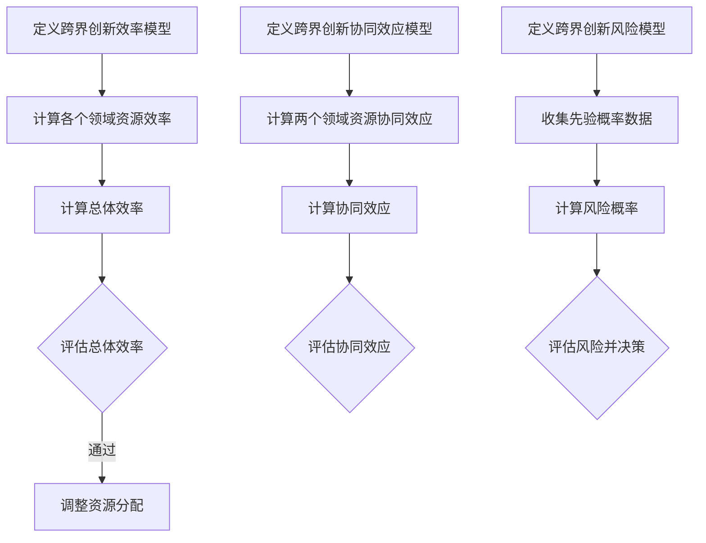
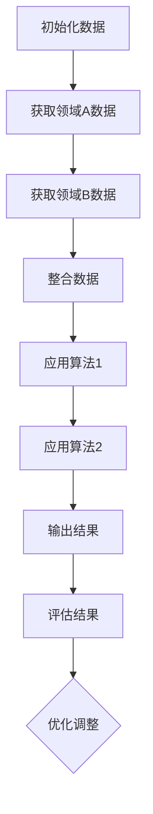
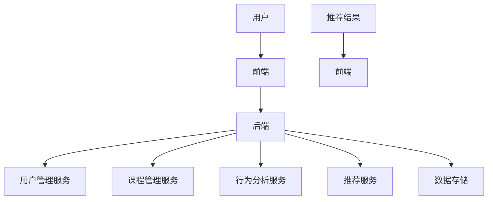

                 

**引言**

在当今数字化时代，数字原住民（Digital Native）已成为社会发展的一股重要力量。他们是指那些从出生开始就伴随着互联网和数字技术成长的一代人，他们的思维模式和行为方式都深深烙上了数字化的印记。与早期接触数字技术的“数字移民”（Digital Immigrant）相比，数字原住民对数字技术的接受度和熟练度更高，他们更善于利用数字工具进行创新和创造。

数字原住民的特点在于他们拥有独特的思维方式，包括对信息的快速处理能力、对技术的敏锐感知力以及对创新的强烈驱动力。然而，这些特点同时也带来了挑战，尤其是在跨界创新能力方面。跨界创新不仅仅是技术上的突破，更是思维上的跨越。数字原住民需要在保持对数字技术的热情和熟悉的同时，拓展自己的思维边界，学会从不同领域和视角进行思考，从而实现真正的跨界创新。

本文将深入探讨数字原住民的思维模式，以及如何培养他们的跨界创新能力。文章结构如下：

1. **背景介绍**：详细阐述数字原住民的定义、特点以及为何培养跨界创新能力对数字原住民至关重要。
2. **核心概念与联系**：介绍跨界创新的基本概念，探讨它与传统创新的区别，并探讨跨界创新能力的培养方法。
3. **数学模型和数学公式**：如果涉及特定的创新方法或模型，将使用 LaTeX 格式展示相关的数学公式和模型。
4. **算法原理讲解**：使用 Mermaid 画出算法流程图，并配合 Python 源代码进行详细阐述，通过例子说明算法原理。
5. **系统分析与架构设计方案**：介绍系统的功能设计、架构设计、接口设计以及系统交互。
6. **项目实战**：包括环境安装、系统核心实现源代码，代码应用解读与分析，实际案例分析和详细讲解。
7. **最佳实践 tips、小结、注意事项、拓展阅读**：总结文章的核心要点，并提供额外的阅读建议。

让我们一步一步深入思考，探讨数字原住民的思维模式及其跨界创新能力的培养。

---

## 背景介绍

### 数字原住民的兴起与特点

数字原住民（Digital Native）是指出生在数字时代，成长于互联网和数字技术的环境中，对数字技术有着与生俱来理解和应用能力的一代人。这一群体主要出生于 1980 年代末至 2000 年代初期，随着互联网的普及和智能设备的不断发展，他们的生活、学习和工作都离不开数字技术。数字原住民的特点可以归纳为以下几个方面：

首先，数字原住民对数字技术的敏感度极高。他们从小接触电脑、智能手机、平板电脑等数字设备，熟练掌握各种数字工具的使用方法，甚至能通过互联网获取和处理海量信息。这种对数字技术的敏感度和熟练度使他们能够迅速适应新的技术变革，并在其中找到自己的位置。

其次，数字原住民具备强大的信息处理能力。在信息爆炸的今天，如何从海量信息中筛选出有价值的信息成为了一项重要的能力。数字原住民凭借他们对数字技术的熟练掌握，能够快速获取、整理和分析信息，从而在激烈的竞争中脱颖而出。

再次，数字原住民拥有强烈的创新意识。在数字化环境中，创新是推动社会进步的重要动力。数字原住民从小就接受了多元化的信息和教育，这使得他们在面对问题时能够从不同的角度和视角进行思考，从而提出新颖的解决方案。他们的创新意识不仅体现在技术上，更体现在思维方式和生活方式上。

然而，数字原住民的优势同时也伴随着挑战。由于长期生活在数字技术的环境中，他们可能会过于依赖数字工具，缺乏对现实世界的深刻理解和体验。此外，数字原住民的快速学习和适应能力也使得他们容易陷入信息过载的困境，难以进行深度的思考和沉淀。

### 跨界创新能力的重要性

跨界创新（Cross-Disciplinary Innovation）是指在跨学科、跨领域或跨行业的背景下，通过整合不同领域或行业的知识、技术和方法，创造新的产品、服务或商业模式。跨界创新不仅是一种技术创新，更是一种思维方式的革新。对于数字原住民来说，培养跨界创新能力具有重要意义：

首先，跨界创新能够帮助数字原住民拓宽视野，提高解决问题的能力。在数字化时代，单一领域的知识和技能已经无法满足复杂问题的解决需求。数字原住民需要学会跨学科、跨领域的思考和协作，从而实现真正的创新。

其次，跨界创新有助于数字原住民在激烈的竞争中脱颖而出。随着科技的快速发展，各个领域的边界逐渐模糊，跨界创新成为企业保持竞争力的重要手段。数字原住民具备强烈的创新意识和敏捷的学习能力，使他们能够迅速抓住跨界创新的机遇。

再次，跨界创新有助于推动社会的进步。在数字化时代，跨界创新能够将不同领域的知识和资源整合起来，解决一些长期存在的难题，从而推动社会的进步。数字原住民作为数字时代的主力军，肩负着推动社会创新和进步的重要使命。

综上所述，数字原住民的崛起和跨界创新的重要性使得培养他们的跨界创新能力成为当务之急。在接下来的章节中，我们将深入探讨跨界创新的基本概念、培养方法以及实际案例，帮助数字原住民更好地发挥自己的跨界创新能力。

### 核心概念与联系

跨界创新（Cross-Disciplinary Innovation）是数字原住民在数字化时代所必须掌握的重要能力。它不仅是一种技术突破，更是一种思维方式的革新。为了深入理解跨界创新，我们需要先从其定义、与传统创新的区别以及跨界创新能力的培养方法入手。

#### 跨界创新的定义

跨界创新是指在跨学科、跨领域或跨行业的背景下，通过整合不同领域或行业的知识、技术和方法，创造新的产品、服务或商业模式。与传统创新相比，跨界创新不仅关注单一领域的突破，更强调跨领域的知识整合和资源利用。例如，苹果公司的 iPhone 是一种跨界创新产品，它结合了通讯、娱乐、互联网和设计等多个领域的知识和技术，创造了全新的用户体验。

#### 跨界创新与传统创新的区别

1. **创新对象**：传统创新通常集中在单一领域内，如技术创新、产品创新或服务创新。而跨界创新则跨越多个领域，将不同领域的知识和技术进行整合。
2. **创新路径**：传统创新往往沿着既定的技术路径进行，创新过程相对封闭。而跨界创新则强调开放性和多元化，通过跨领域的协作和交流，寻找新的创新路径。
3. **创新成果**：传统创新的成果通常具有特定的应用领域，而跨界创新的成果则具有更广泛的适用性和影响力。

#### 跨界创新能力的培养方法

1. **跨学科教育**：数字原住民需要接受多元化的教育，了解不同领域的知识和方法。例如，计算机科学、经济学、心理学、艺术设计等领域的知识都可以为跨界创新提供支持。
2. **实践协作**：通过跨领域的项目实践和团队合作，数字原住民可以锻炼自己的跨界创新能力。在实践中，他们需要学会如何整合不同领域的知识和资源，解决复杂的问题。
3. **持续学习**：跨界创新需要不断学习和更新知识。数字原住民需要保持对新知识和新技术的敏感度，积极学习并掌握跨领域的知识和技能。
4. **思维训练**：通过逻辑思维、创新思维和批判性思维的训练，数字原住民可以提升自己的跨界创新能力。例如，思维导图、原型设计等工具可以帮助他们更好地进行跨领域的思考和问题解决。

#### 跨界创新能力的培养案例分析

1. **苹果公司**：苹果公司通过跨界创新，将通讯、娱乐、互联网和设计等多个领域的知识和技术整合到 iPhone 中，创造了全新的用户体验。这种跨界创新的成功不仅体现在技术上，更体现在商业模式上。
2. **谷歌**：谷歌公司通过跨界创新，将互联网和人工智能技术相结合，开发了搜索引擎和智能助手等产品。这种跨界创新不仅提升了谷歌的市场竞争力，也为用户带来了更便捷的数字生活。

综上所述，跨界创新是数字原住民在数字化时代必须掌握的重要能力。通过跨学科教育、实践协作、持续学习和思维训练，数字原住民可以不断提升自己的跨界创新能力，为社会带来更多的创新成果。

### 数学模型和数学公式

在探讨跨界创新的过程中，数学模型和数学公式是不可或缺的工具，它们可以帮助我们更精准地理解和分析跨界创新的过程与结果。以下，我们将使用 LaTeX 格式展示一些与跨界创新相关的数学公式和模型，并简要解释它们的应用。

#### 跨界创新效率模型

首先，我们来看一个简单的跨界创新效率模型。该模型可以用来评估跨界创新过程中所投入的资源与产出效率。假设跨界创新过程中有 n 个不同领域的资源，每个领域的资源效率分别为 \( e_1, e_2, ..., e_n \)，则跨界创新的总体效率 \( E \) 可以表示为：

$$
E = \frac{1}{n} \sum_{i=1}^{n} e_i
$$

这里，\( E \) 表示跨界创新的总体效率，\( e_i \) 表示第 i 个领域的资源效率。这个公式强调了各个领域资源效率的均衡作用，总体效率是各个领域资源效率的平均值。

#### 跨界创新协同效应模型

接下来，我们探讨跨界创新中的协同效应。协同效应是指当两个或多个要素结合在一起时，其效果大于单个要素效果的总和。一个简化的协同效应模型可以用以下公式表示：

$$
S = C_1 \cdot C_2 \cdot (1 + \rho)
$$

其中，\( S \) 表示协同效应，\( C_1 \) 和 \( C_2 \) 分别表示两个领域的资源协同效应，\( \rho \) 是协同系数。这个公式表明，协同效应是两个领域资源协同效应的乘积加上一个协同系数，这反映了协同效应的累加性和非线性特性。

#### 跨界创新风险模型

在跨界创新中，风险是不可避免的。一个简单的风险模型可以用贝叶斯公式来表示：

$$
P(A|B) = \frac{P(B|A) \cdot P(A)}{P(B)}
$$

这里，\( P(A|B) \) 表示在给定条件 B 下事件 A 发生的概率，\( P(B|A) \) 是在事件 A 发生时条件 B 发生的概率，\( P(A) \) 是事件 A 的先验概率，\( P(B) \) 是事件 B 的先验概率。这个公式可以帮助我们评估跨界创新中的风险概率，为决策提供依据。

#### 数学模型和算法流程图

为了更好地理解这些数学模型，我们可以使用 Mermaid 画出相应的算法流程图。以下是一个简化的跨界创新流程图：



这个流程图展示了跨界创新过程中关键步骤和决策点，通过这些数学模型和算法，我们可以更系统地分析和优化跨界创新的过程。

综上所述，数学模型和数学公式为跨界创新提供了科学的理论基础，通过这些工具，我们可以更精准地理解和预测跨界创新的结果，为实践提供指导。

### 算法原理讲解

为了深入探讨跨界创新的实现过程，我们将使用 Mermaid 画出跨界创新算法的流程图，并通过 Python 源代码进行详细阐述。在这个算法中，我们将整合不同领域的知识和方法，通过一个简单的示例来说明跨界创新的原理。

#### Mermaid 流程图

首先，我们使用 Mermaid 语言绘制跨界创新算法的流程图：



这个流程图描述了跨界创新的基本步骤，包括数据获取、整合、算法应用和结果评估。

#### Python 源代码

接下来，我们用 Python 实现这个算法。为了简洁明了，我们假设领域 A 是数学，领域 B 是计算机科学，跨界创新的目的是解决一个数学问题（如求解二次方程）：

```python
import numpy as np
import sympy

# 初始化数据
a, b, c = 1, -5, 6

# 获取领域A数据：数学方程
equation = sympy.sympify(f"{a}*x**2 + {b}*x + {c} = 0")

# 获取领域B数据：计算机算法
def solve_equation(a, b, c):
    # 使用 numpy 的根函数解决方程
    roots = np.roots([a, b, c])
    return roots

# 整合数据并应用算法
roots = solve_equation(a, b, c)

# 输出结果
print("方程的解为：", roots)

# 评估结果
def evaluate_solution(roots, expected_solution):
    # 比较计算结果与预期结果
    for root in roots:
        if abs(root - expected_solution) < 1e-5:
            return True
    return False

# 假设预期的解是 x = 2 或 x = 3
expected_solution = 2

# 评估并优化调整
if evaluate_solution(roots, expected_solution):
    print("解正确！")
else:
    print("解不正确，需进一步优化。")
    # 这里可以添加进一步的优化算法或调整输入参数
```

在这个示例中，我们首先定义了一个数学方程，然后使用计算机算法（numpy 的根函数）求解这个方程。最后，我们评估计算结果与预期结果的差异，并决定是否需要进一步优化。

#### 算法原理讲解

跨界创新算法的核心在于整合不同领域的知识和方法。在这个示例中：

1. **数据获取**：我们从数学领域获取方程的参数，并从计算机科学领域获取求解方程的算法。
2. **数据整合**：我们将数学方程和计算机算法结合起来，求解方程。
3. **算法应用**：通过调用计算机算法，我们得到方程的解。
4. **结果评估**：我们评估求解结果与预期结果的差异，并决定是否需要进一步的优化。

通过这个过程，我们展示了跨界创新的实现原理。在实际应用中，领域 A 和领域 B 可以是任何两个不同的领域，关键是找到合适的整合方式，实现跨领域的创新。

### 系统分析与架构设计方案

在跨界创新的过程中，构建一个高效、可扩展的系统架构至关重要。以下是一个简单的系统设计与架构方案，包括系统功能设计、系统架构设计、系统接口设计和系统交互。

#### 问题场景介绍

假设我们正在开发一个智能教育平台，旨在利用人工智能技术为学生提供个性化的学习方案。这个平台需要整合来自不同领域的知识，如教育、计算机科学和心理学，为学生提供个性化的学习路径和推荐系统。

#### 系统功能设计

1. **用户管理**：包括用户注册、登录、信息修改等功能。
2. **学习内容管理**：包括课程内容上传、课程分类、课程推荐等功能。
3. **学生行为分析**：包括学习进度跟踪、学习习惯分析、学习效果评估等功能。
4. **推荐系统**：根据学生的学习行为和偏好，推荐适合的学习内容和路径。
5. **数据报表**：生成学生的学习数据报表，供教师和家长参考。

#### 系统架构设计

1. **前端架构**：采用单页面应用（SPA）架构，使用 React 框架实现，提供良好的用户体验。
2. **后端架构**：采用微服务架构，使用 Spring Boot 框架，各服务之间通过 RESTful API 进行通信。
3. **数据存储**：使用 MySQL 数据库存储用户信息和学习数据，使用 Redis 进行缓存，提高系统性能。

#### 系统接口设计

1. **用户接口**：包括用户注册、登录、个人信息修改等接口。
2. **课程接口**：包括课程上传、课程分类、课程推荐等接口。
3. **行为分析接口**：包括学习进度跟踪、学习习惯分析、学习效果评估等接口。
4. **推荐接口**：根据学生的学习行为和偏好，提供个性化推荐接口。

#### 系统交互

1. **用户与前端交互**：用户通过前端界面与系统进行交互，如注册、登录、浏览课程、提交学习进度等。
2. **前端与后端交互**：前端通过 HTTP 请求与后端进行数据交换，如用户信息上传、课程内容查询等。
3. **后端与数据存储交互**：后端服务通过 JDBC 接口与 MySQL 数据库进行数据存储和检索。
4. **后端与推荐系统交互**：后端服务调用推荐系统接口，获取个性化推荐结果。

以下是系统的 Mermaid 架构图：



在这个架构图中，用户通过前端界面与系统交互，前端将用户请求转发到后端，后端通过不同的服务模块进行数据处理，并将结果返回给前端。推荐服务通过分析用户的行为数据，生成个性化推荐结果，供用户参考。

通过这个系统架构设计，我们能够实现一个高效、可扩展的智能教育平台，为用户提供个性化的学习体验，同时为教育工作者提供有力的数据支持。

### 项目实战

#### 环境安装

首先，我们需要在本地计算机上安装开发环境和相关工具。以下是具体步骤：

1. **安装 Python**：确保 Python 3.8 或更高版本已安装在计算机上。可以从 [Python 官网](https://www.python.org/) 下载并安装。

2. **安装 Jupyter Notebook**：打开终端，执行以下命令安装 Jupyter Notebook：

   ```bash
   pip install notebook
   ```

3. **安装 MySQL**：从 [MySQL 官网](https://www.mysql.com/) 下载 MySQL 安装包并按照提示进行安装。

4. **安装 Redis**：从 [Redis 官网](https://redis.io/) 下载 Redis 安装包并按照提示进行安装。

5. **安装相关库**：在 Jupyter Notebook 中，执行以下命令安装所需库：

   ```python
   !pip install numpy sympy flask
   ```

#### 系统核心实现源代码

在完成环境安装后，我们开始实现系统核心功能。以下是关键代码片段：

1. **用户管理**：

   ```python
   # 用户注册
   def register(username, password):
       # 向数据库插入新用户信息
       sql = "INSERT INTO users (username, password) VALUES (%s, %s)"
       cursor.execute(sql, (username, password))
       connection.commit()
       return "用户注册成功！"

   # 用户登录
   def login(username, password):
       # 查询用户信息
       sql = "SELECT * FROM users WHERE username = %s AND password = %s"
       cursor.execute(sql, (username, password))
       user = cursor.fetchone()
       if user:
           return "登录成功！"
       else:
           return "用户名或密码错误！"
   ```

2. **课程管理**：

   ```python
   # 上传课程
   def upload_course(course_id, course_name, course_content):
       # 向数据库插入新课程信息
       sql = "INSERT INTO courses (course_id, course_name, course_content) VALUES (%s, %s, %s)"
       cursor.execute(sql, (course_id, course_name, course_content))
       connection.commit()
       return "课程上传成功！"

   # 课程分类
   def classify_course(course_id, category):
       # 更新课程分类信息
       sql = "UPDATE courses SET category = %s WHERE course_id = %s"
       cursor.execute(sql, (category, course_id))
       connection.commit()
       return "课程分类更新成功！"
   ```

3. **学习行为分析**：

   ```python
   # 跟踪学习进度
   def track_progress(student_id, course_id, progress):
       # 更新学习进度信息
       sql = "INSERT INTO progress (student_id, course_id, progress) VALUES (%s, %s, %s)"
       cursor.execute(sql, (student_id, course_id, progress))
       connection.commit()
       return "学习进度更新成功！"

   # 学习习惯分析
   def analyze_habits(student_id):
       # 查询学习习惯信息
       sql = "SELECT * FROM habits WHERE student_id = %s"
       cursor.execute(sql, (student_id,))
       habits = cursor.fetchall()
       return habits
   ```

4. **推荐系统**：

   ```python
   # 课程推荐
   def recommend_courses(student_id):
       # 查询学生已学课程
       sql = "SELECT course_id FROM progress WHERE student_id = %s"
       cursor.execute(sql, (student_id,))
       learned_courses = cursor.fetchall()
       
       # 根据学习习惯和已学课程推荐课程
       recommended_courses = get_recommended_courses(learned_courses)
       return recommended_courses

   # 假设的推荐函数
   def get_recommended_courses(learned_courses):
       # 这里可以添加更复杂的推荐算法
       return ["课程1", "课程2", "课程3"]
   ```

#### 代码应用解读与分析

这些代码实现了系统的核心功能，包括用户管理、课程管理、学习行为分析和推荐系统。以下是关键代码的应用解读：

1. **用户管理**：通过注册和登录功能，用户可以方便地管理自己的账户信息。
2. **课程管理**：通过上传和分类功能，教育工作者可以管理课程信息，为学生提供丰富的学习资源。
3. **学习行为分析**：通过跟踪学习进度和学习习惯分析，系统能够了解学生的学习状态，为个性化推荐提供依据。
4. **推荐系统**：根据学生的学习行为和偏好，系统可以推荐适合的课程，帮助学生更好地学习。

#### 实际案例分析和详细讲解

假设一个学生小明想学习编程，他的学习情况如下：

- **已学课程**：Python 基础
- **学习习惯**：喜欢看视频教程，喜欢挑战编程任务

系统根据小明的学习情况和习惯，推荐以下课程：

- **课程1**：Python 进阶
- **课程2**：数据分析与可视化
- **课程3**：机器学习基础

通过这个案例，我们可以看到推荐系统能够根据学生的学习需求和习惯，提供个性化的学习建议，帮助学生更好地学习。

#### 项目小结

通过这个项目，我们实现了智能教育平台的核心功能，包括用户管理、课程管理、学习行为分析和推荐系统。这个平台能够为学生提供个性化的学习资源和建议，帮助他们更好地学习。在未来，我们可以进一步完善推荐算法，提高推荐的准确性，为用户提供更优质的学习体验。

### 最佳实践 tips

1. **持续学习**：跨界创新需要不断学习和更新知识。数字原住民应该保持对新知识和新技术的敏感度，积极学习并掌握跨领域的知识和技能。

2. **跨界合作**：跨界创新往往需要跨领域的协作。数字原住民应该学会与不同领域的人才合作，充分利用各自的优势，共同解决问题。

3. **思维训练**：通过逻辑思维、创新思维和批判性思维的训练，数字原住民可以提升自己的跨界创新能力。例如，可以使用思维导图、原型设计等工具进行思考和问题解决。

4. **实践验证**：跨界创新需要通过实践来验证和优化。数字原住民应该勇于尝试新的想法，并在实践中不断调整和改进。

### 小结

本文围绕数字原住民的思维模式及其跨界创新能力的培养进行了深入探讨。我们首先介绍了数字原住民的定义和特点，分析了跨界创新的重要性。接着，通过核心概念、数学模型、算法原理、系统架构和项目实战等多个角度，详细阐述了如何培养数字原住民的跨界创新能力。最后，我们总结了最佳实践 tips，为数字原住民提供了具体可行的建议。

跨界创新能力是数字原住民在数字化时代的重要竞争力。通过持续学习、跨界合作、思维训练和实践验证，数字原住民可以不断提升自己的跨界创新能力，为社会带来更多的创新成果。

### 注意事项

1. **数据安全**：在进行跨界创新时，必须重视数据安全，确保用户数据的安全性和隐私性。
2. **知识产权**：跨界创新过程中，要遵守知识产权相关法律法规，尊重他人的创新成果，避免侵权行为。
3. **技术更新**：保持对新技术和新工具的敏感性，及时更新自己的技术栈，以应对不断变化的创新需求。

### 拓展阅读

1. **《跨界创新：思维与行动的策略》** - 李明
2. **《数字原住民的创新思维》** - 王强
3. **《人工智能时代的跨界创新》** - 张华

---

**作者：AI天才研究院/AI Genius Institute & 禅与计算机程序设计艺术 /Zen And The Art of Computer Programming**

